# 4.3 图像性质

考向 1 $y = A \sin (\omega x + \varphi)$ 的图像与性质
### 一、正弦函数、余弦函数和正切函数的图像性质

<table><tr><td>函数</td><td> $y = \sin x$ </td><td> $y = \cos x$ </td><td> $y = \tan x$ </td></tr><tr><td>图象</td><td>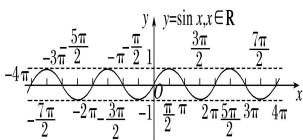</td><td>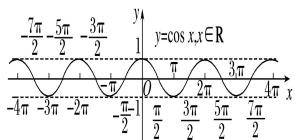</td><td>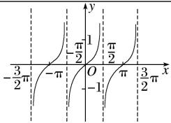</td></tr><tr><td>定义域</td><td>R</td><td>R</td><td> $\{x \mid x \in R, x \neq k\pi + \frac{\pi}{2}\}$ </td></tr><tr><td>值域</td><td>[-1, 1]</td><td>[-1, 1]</td><td>R</td></tr><tr><td>周期性</td><td> $2\pi$ </td><td> $2\pi$ </td><td> $\pi$ </td></tr><tr><td>奇偶性</td><td>奇函数</td><td>偶函数</td><td>奇函数</td></tr><tr><td>递增区间</td><td> $[2k\pi - \frac{\pi}{2}, 2k\pi + \frac{\pi}{2}]$ </td><td> $[-\pi + 2k\pi, 2k\pi]$ </td><td> $(k\pi - \frac{\pi}{2}, k\pi + \frac{\pi}{2})$ </td></tr><tr><td>递减区间</td><td> $[2k\pi + \frac{\pi}{2}, 2k\pi + \frac{3\pi}{2}]$ </td><td> $[2k\pi, \pi + 2k\pi]$ </td><td>无</td></tr><tr><td>对称中心</td><td> $(k\pi, 0)$ </td><td> $(k\pi + \frac{\pi}{2}, 0)$ </td><td> $(\frac{k\pi}{2}, 0)$ </td></tr><tr><td>对称轴方程</td><td>直线  $x = k\pi + \frac{\pi}{2}$ </td><td>直线  $x = k\pi$ </td><td>无</td></tr></table>
### 二、正弦函数 $y = \sin x$ 与 $y = A\sin (\omega x + \varphi)$ 的图像性质关系

<table><tr><td></td><td> $y = \sin x$ </td><td> $y = A\sin(\omega x + \varphi)$ </td></tr><tr><td>周期</td><td> $2\pi$ </td><td> $\frac{2\pi}{\omega}$ </td></tr><tr><td>定义域</td><td> $R$ </td><td> $R$ </td></tr><tr><td>最大值</td><td>1,当 $x = 2k\pi + \frac{\pi}{2}$ 取得</td><td> $A$ ,当 $x = \frac{2k\pi + \frac{\pi}{2} - \varphi}{\omega}$ 取得</td></tr><tr><td>最小值</td><td>-1,当 $x = 2k\pi + \frac{3\pi}{2}$ 取得</td><td>-A,当 $x = \frac{2k\pi + \frac{3\pi}{2} - \varphi}{\omega}$ 取得</td></tr></table>

<table><tr><td rowspan="4">类比于研的性质,只</td><td>单调增区间</td><td> $\left[2k\pi - \frac{\pi}{2}, 2k\pi + \frac{\pi}{2}\right]$ </td><td> $\left[\frac{2k\pi - \frac{\pi}{2} - \varphi}{\omega}, \frac{2k\pi + \frac{\pi}{2} - \varphi}{\omega}\right]$ </td></tr><tr><td>单调减区间</td><td> $\left[2k\pi + \frac{\pi}{2}, 2k\pi + \frac{3\pi}{2}\right]$ </td><td> $\left[\frac{2k\pi + \frac{\pi}{2} - \varphi}{\omega}, \frac{2k\pi + \frac{3\pi}{2} - \varphi}{\omega}\right]$ </td></tr><tr><td>对称轴</td><td> $x = k\pi + \frac{\pi}{2}$ </td><td> $x = \frac{k\pi + \frac{\pi}{2} - \varphi}{\omega}$ </td></tr><tr><td>对称中心</td><td> $(k\pi,0)$ </td><td> $\left(\frac{k\pi - \varphi}{\omega},0\right)$ </td></tr></table>

究 $y = \sin x$ 需 将

$y = A \sin (\omega x + \varphi)$ 中的 $\omega x + \varphi$ 看成 $y = \sin x$ 中的 $x$ ，但在求 $y = A \sin (\omega x + \varphi)$ 的单调区间时，要特别注意 $A$ 和 $\omega$ 的符号，通过诱导公式先将 $\omega$ 化为正数．研究函数 $y = A \cos (\omega x + \varphi)$ ， $y = A \tan (\omega x + \varphi)$ 的性质的方法与其类似，也是类比、转化．

# 题型 1 求解对称性与最小正周期

【例 1】（2024•新高考Ⅱ）对于函数 $f(x)=\sin 2x$ 和 $g(x)=\sin(2x-\frac{\pi}{4})$ ，下列正确的有（）

$\quad$A. $f(x)$ 与 $g(x)$ 有相同零点  
$\quad$B. $f(x)$ 与 $g(x)$ 有相同最大值  
$\quad$C. $f(x)$ 与 $g(x)$ 有相同的最小正周期  
$\quad$D. $f(x)$ 与 $g(x)$ 的图像有相同的对称轴

【例 2】（2024·北京）设函数 $f(x)=\sin\omega x(\omega>0)$ 。已知 $f(x_{1})=-1,\quad f(x_{2})=1$ ，且 $|x_{1}-x_{2}|$ 的最小值为 $\frac{\pi}{2}$ ，则 $\omega=(\quad)$

$\quad$A. 1

$\quad$B. 2

$\quad$C. 3

$\quad$D. 4

【例 3】（2014•新课标 I）在函数① $y = \cos |2x|$ ，② $y = |\cos x|$ ，③ $y = \cos(2x + \frac{\pi}{6})$ ，④ $y = \tan(2x - \frac{\pi}{4})$ 中，最小正周期为 $\pi$ 的所有函数为（）

$\quad$A. ①②③

$\quad$B. ①③④

$\quad$C. ②④

$\quad$D. ①③

# 题型 2 求解单调区间与最值

【例 1】函数 $y = \sin(-2x + \frac{\pi}{4})$ 的单调递增区间是()

$\quad$A. $[2k\pi + \frac{3}{8}\pi, 2k\pi + \frac{7}{8}\pi](k \in Z)$

$\quad$B. $[k\pi +\frac{3}{8}\pi ,k\pi +\frac{7}{8}\pi ](k\in Z)$

$\quad$C. $[k\pi -\frac{1}{8}\pi ,k\pi +\frac{3}{8}\pi ](k\in Z)$

$\quad$D. $[k\pi -\frac{5}{8}\pi ,k\pi -\frac{1}{8}\pi ](k\in Z)$

【例 2】（2024•上海）已知 $f(x)=\sin(\omega x+\frac{\pi}{3})$ ， $\omega>0$ .

（1）设 $\omega=1$ ，求解： $y=f(x)$ ， $x\in[0,\pi]$ 的值域；  
（2） $a > \pi (a \in R)$ , $f(x)$ 的最小正周期为 $\pi$ , 若在 $x \in [\pi, a]$ 上恰有 3 个零点, 求 $a$ 的取值范围.

【例 3】（2024•天津）已知函数 $f(x)=3\sin(\omega x+\frac{\pi}{3})(\omega>0)$ 的最小正周期为 $\pi$ ．则 $f(x)$ 在区间 $[-\frac{\pi}{12},\frac{\pi}{6}]$ 上的最小值为（）

$\quad$A. $-\frac{3\sqrt{3}}{2}$

$\quad$B. $-\frac{3}{2}$

$\quad$C. 0

$\quad$D. $\frac{3}{2}$

# 题型 3 求解三角函数解析式

【例 1】（2021•甲卷）已知函数 $f(x)=2\cos(\omega x+\varphi)$ 的部分图像如图所示，则 $f(\frac{\pi}{2})=$ \_\_\_\_.

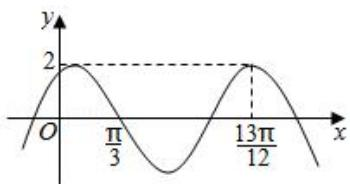

【例 2】（2023•新高考Ⅱ）已知函数 $f(x)=\sin(\omega x+\varphi)$ ，如图，A，B 是直线 $y=\frac{1}{2}$ 与曲线 $y=f(x)$ 的两个交点，若 $\left|AB\right|=\frac{\pi}{6}$ ，则 $f(\pi)=$ \_\_\_\_.

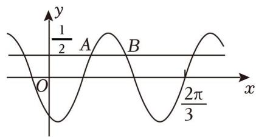

# 考向 2 三角函数图像的平移与变换

# 题型 1 三角函数图像的平移伸缩

### 三、正弦函数的平移和伸缩变换

函数 $y = A \sin(\omega x + \phi)$ 的图象可以通过下列两种方式得到：

##### 1. $y = \sin x \xrightarrow{\text{图象左移} \varphi} y = \sin(x + \varphi) \xrightarrow{\frac{\text{横坐标缩短到原来的} \frac{1}{\omega}\text{倍}}{\omega}} y = \sin(\omega x + \varphi)$ 纵坐标伸长为原来的A倍 $y = A \sin(\omega x + \varphi)$

##### 2. $y = \sin x \xrightarrow{\text{横坐标缩短到原来的} \frac{1}{\omega} \text{倍}} y = \sin(\omega x) \xrightarrow{\text{图象左移} \frac{\varphi}{\omega}} y = \sin(\omega x + \varphi)$ 纵坐标伸长为原来的A倍 $y = A \sin (\omega x + \varphi)$

关键：把握先移后缩和先缩后移的区别．类比可以得到： $y = A \cos(\omega x + \varphi)$ ， $y = A \tan(\omega x + \varphi)$ 的图像
定理： $y = A \sin(\omega x + \varphi_{1}) \rightarrow y = A \sin(\omega x + \varphi_{2})$ 则平移单位为 $\frac{|\varphi_{2} - \varphi_{1}|}{\omega}$ （注意平移方向）

【例 1】(2023·甲卷)已知 $f(x)$ 为函数 $y = \cos\left(2x + \frac{\pi}{6}\right)$ 向左平移 $\frac{\pi}{6}$ 个单位所得函数，则 $y = f(x)$ 与 $y = \frac{1}{2}x - \frac{1}{2}$ 的交点个数为()

$\quad$A. 1

$\quad$B. 2

$\quad$C. 3

$\quad$D. 4

【例 2】（2021•乙卷）把函数 $y = f(x)$ 图像上所有点的横坐标缩短到原来的 $\frac{1}{2}$ 倍，纵坐标不变，再把所得曲线向右平移 $\frac{\pi}{3}$ 个单位长度，得到函数 $y = \sin\left(x - \frac{\pi}{4}\right)$ 的图像，则 $f(x) = (\quad)$

$\quad$A. $\sin(\frac{x}{2}-\frac{7\pi}{12})$

$\quad$B. $\sin(\frac{x}{2}+\frac{\pi}{12})$

$\quad$C. $\sin(2x-\frac{7\pi}{12})$

$\quad$D. $\sin(2x+\frac{\pi}{12})$

# 题型 2 涉及二倍角与函数名变换问题

【例 1】（2017•新课标 I）已知曲线 $C_{1}: y = \cos x$ ， $C_{2}: y = \sin(2x + \frac{2\pi}{3})$ ，则下面结论正确的是（）

$\quad$A. 把 $C_{1}$ 上各点的横坐标伸长到原来的 2 倍, 纵坐标不变, 再把得到的曲线向右平移 $\frac{\pi}{6}$ 个单位长度, 得到曲线 $C_{2}$

$\quad$B. 把 $C_{1}$ 上各点的横坐标伸长到原来的 2 倍, 纵坐标不变, 再把得到的曲线向左平移 $\frac{\pi}{12}$ 个单位长度, 得到曲线 $C_{2}$

$\quad$C. 把 $C_{1}$ 上各点的横坐标缩短到原来的 $\frac{1}{2}$ , 纵坐标不变, 再把得到的曲线向右平移 $\frac{\pi}{6}$ 个单位长度, 得到曲线 $C_{2}$ 
$\quad$D. 把 $C_{1}$ 上各点的横坐标缩短到原来的 $\frac{1}{2}$ , 纵坐标不变, 再把得到的曲线向左平移 $\frac{\pi}{12}$ 个单位长度, 得到曲线 $C_{2}$

【例 2】若将函数 $y = \sin(\omega x + \frac{\pi}{4})(\omega > 0)$ 的图像向右平移 $\frac{\pi}{3}$ 个单位长度后，与函数 $y = \cos(\omega x + \frac{\pi}{6})$ 的图像重合，则 $\omega$ 的最小值是（）

$\quad$A. $\frac{21}{4}$

$\quad$B. $\frac{19}{4}$

$\quad$C. $\frac{17}{4}$

$\quad$D. $\frac{15}{4}$

# 考向 3 三角函数 $\omega$ 范围问题

### 四、三角函数 $\omega$ 取值范围

##### 1. 整体换元法解决区间 $(0, b)$ 类型

（1） 单调性问题:

若 $y = A \sin (\omega x + \varphi) (A > 0, \omega > 0, \varphi > 0)$ ，在区间 $(0, b)$ 上单调递增，求 $\omega$ 的取值范围：令 $\omega x + \varphi = t$ ， $t \in (\varphi, \omega b + \varphi)$ ，根据正弦函数 $y = \sin t$ 的单调性的性质，单调递增区间要满足： $(\varphi, \omega b + \varphi) \subseteq (-\frac{\pi}{2} + 2k\pi, \frac{\pi}{2} + 2k\pi)(k \in \pi)$ ，所以有 $\omega b + \varphi \leq \frac{\pi}{2} + 2k\pi, k \in z$ ，即 $\omega \leq \frac{\frac{\pi}{2} + 2k\pi - \varphi}{b}(k \in z)$ .

（2） 零点数问题:

若 $y = A\sin (\omega x + \varphi)$ ( $A > 0, \omega > 0, 0 < \varphi < \pi$ ), 在区间 (0, b) 上有 $n$ 个零点，求 $\omega$ 的取值范围：令 $\omega x + \varphi = t$ ， $t \in (\varphi, \omega b + \varphi)$ ，根据正弦函数 $y = \sin t$ 的零点区间分布情况：则 $n\pi < \omega b + \varphi \leq (n + 1)\pi$ .

##### 2. 周期卡根法解决区间 $(a, b)$ 类型

（1） 单调性问题:

$y = A\sin (\omega x + \varphi)$ 在区间 $(a,b)$ 内单调 $\Rightarrow \frac{T}{2}\geq |b - a|$ 且 $\frac{k\pi - \frac{\pi}{2} - \varphi}{\omega}\leq a$ ， $b\leq \frac{k\pi + \frac{\pi}{2} - \varphi}{\omega}$

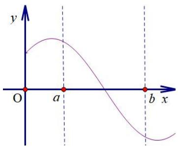

图 1

（2） 零点数问题:

$y = A\sin (\omega x + \varphi)$ 在区间 $(a,b)$ 内有 $n$ 个零点 $\Rightarrow \frac{(n + 1)T}{2}\geq |b - a| > \frac{(n - 1)T}{2}$

且 $\left\{ \begin{array}{l} \frac{(k - 1)\pi - \varphi}{\omega} \leq a < \frac{k\pi - \varphi}{\omega} \\ \frac{(k + n)\pi - \varphi}{\omega} < b \leq \frac{(k + n + 1)\pi - \varphi}{\omega} \end{array} \right.$ （图3图4）

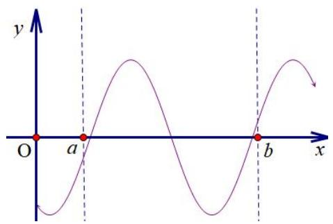

图 3

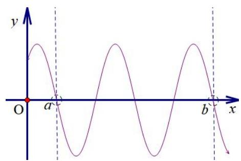

图4

### 题型 1 区间 $(0, b)$ 类型

【例 1】若函数 $f(x)=\sin(\omega x+\frac{\pi}{6})(\omega>0)$ 在 $(0,\frac{\pi}{3})$ 上单调，则 $\omega$ 的取值范围是（）

$\quad$A. $(1, + \infty)$

$\quad$B. $[1, +\infty)$

$\quad$C. $(0,1)$

$\quad$D. $(0, 1]$

【例 2】(2023·新高考 I) 已知函数 $f(x)=\cos\omega x-1(\omega>0)$ 在区间 $[0, 2\pi]$ 有且仅有 3 个零点，则 $\omega$ 的取值范围是 \_\_\_\_.

【例 3】（2022•甲卷）设函数 $f(x)=\sin(\omega x+\frac{\pi}{3})$ 在区间 $(0,\pi)$ 恰有三个极值点、两个零点，则 $\omega$ 的取值范围是（）

$\quad$A. $\left[\frac{5}{3},\frac{13}{6}\right)$

$\quad$B. $\left[\frac{5}{3},\frac{19}{6}\right)$

$\quad$C. $\left(\frac{13}{6},\frac{8}{3}\right]$

$\quad$D. $\left(\frac{13}{6},\frac{19}{6}\right]$

### 题型 2 区间 $(a, b)$ 类型

##### 【例1】已知 $\omega > 0$ ，函数 $f(x) = \sin \omega x \cos \omega x + \cos^2 \omega x$ 在 $(\frac{\pi}{2}, \pi)$ 单调递减，则 $\omega$ 的取值范围为（）

$\quad$A. $\left[\frac{1}{2},\frac{5}{8}\right]$

$\quad$B. $\left[\frac{1}{2},\frac{3}{4}\right]$

$\quad$C. $(0,\frac{1}{4}]$

$\quad$D. $\left[\frac{1}{4},\frac{5}{8}\right]$

【例 2】若函数 $f(x)=2\sin\omega x(\omega>0)$ 在区间 $\left[\frac{\pi}{4},\frac{3\pi}{4}\right]$ 内仅有 1 个零点，则 $\omega$ 的取值范围是（）

$\quad$A. $\left[\frac{4}{3},4\right)$

$\quad$B. $\left(\frac{4}{3},4\right]$

$\quad$C. $\left[\frac{4}{3},\frac{8}{3}\right)$

$\quad$D. $\left(\frac{4}{3},\frac{8}{3}\right]$

【例 3】将函数 $f(x)=\cos(x+\frac{2\pi}{3})$ 图象上所有点的横坐标变为原来的 $\frac{1}{\omega}(\omega>0)$ ，纵坐标不变，所得图象在区间 $[0,\frac{2\pi}{3}]$ 上恰有两个零点，且在 $[-\frac{\pi}{12},\frac{\pi}{12}]$ 上单调递减，则 $\omega$ 的取值范围为（）

$\quad$A. $\left[\frac{9}{4},3\right]$

$\quad$B. $\left[\frac{9}{4},4\right)$

$\quad$C. $\left[\frac{11}{4},4\right]$

$\quad$D. $\left(\frac{11}{4},6\right]$

# 考向 3 三角函数实际应用问题

# 三角函数实际应用问题

以三角函数的图像和性质作为命题背景，解决实际生活中的数学问题，创新性比较强，体现数形结合和建模思想。一般以三角函数的最值为常考点，也考查三角形相关的周长和面积等问题。

【例 1】（2019·北京）如图，A，B 是半径为 2 的圆周上的定点，P 为圆周上的动点， $\angle APB$ 是锐角，大小为 $\beta$ ，图中阴影区域的面积的最大值为（）

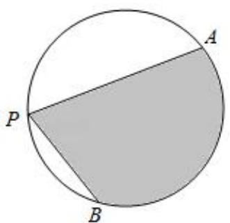

$\quad$A. $4\beta + 4\cos \beta$

$\quad$B. $4\beta + 4\sin \beta$

$\quad$C. $2\beta + 2\cos \beta$

$\quad$D. $2\beta + 2\sin \beta$

【例 2】水车是一种利用水流的动力进行灌溉的工具，其工作示意图如图所示，设水车的半径为4m，其中心O到水面的距离为2m，水车逆时针匀速旋转，旋转一周的时间为60s，当水车上的一个水筒A从水中 $(A_{0}$ 处)浮现时开始计时经过t（单位：s）后水筒A距离水面的高度为 $f(t)$ （在水面下高度为负数），则 $f(130)=()$

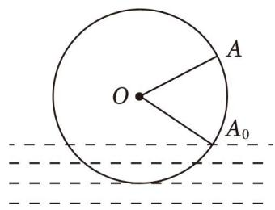

$\quad$A. $3m$

$\quad$B. 4m

$\quad$C. 5m

$\quad$D. 6m

# 拓展思维

# 拓展 1 三角换元与斜率最值问题

【例 1】求函数 $y=\frac{\sin x-1}{\cos x-2}$ 的最大值和最小值.

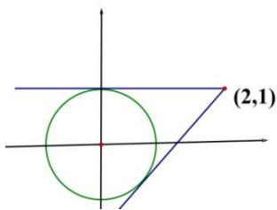

【例 2】已知函数 $y=\sqrt{1-x}+\sqrt{x+3}$ 的最大值为 M，最小值为 m，则 $\frac{m}{M}$ 的值为（）

$\quad$A. $\frac{1}{4}$

$\quad$B. $\frac{1}{2}$

$\quad$C. $\frac{\sqrt{2}}{2}$

$\quad$D. $\frac{\sqrt{3}}{2}$

# 拓展 2 三角换元与隐半圆问题

隐半圆常常出现的结构为：① $\sqrt{a^2 - x^2}$ ；② $\sqrt{a^2 - (x - b)^2}$ 。

隐半圆的结构特点：根式下为二次代数式，且二次项系数为-1．如 $y=\sqrt{a^{2}-x^{2}}$ 表示以原点为圆心， $|a|$ 为半径的圆的上半圆， $y=\sqrt{a^{2}-(x-b)^{2}}$ 表示以 $(b,0)$ 为圆心， $|a|$ 为半径的圆的上半圆，必要的时候可以进行三角换元， $y=\sqrt{a^{2}-x^{2}}$ 上的任意一点可以表示为 $(a\cos\alpha,a\sin\alpha)$ ， $y=\sqrt{a^{2}-(x-b)^{2}}$ 上的任意一点可以表示为 $(b+a\cos\alpha,a\sin\alpha)$ ，此时 $\alpha$ 的范围为 $[0,\pi]$ .

【例 1】函数 $f(x)=\frac{\sqrt{1-x^{2}}}{x-2}$ 的最小值为 \_\_\_\_.

# 拓展 3 导数与三角函数最值问题

$\sin 2x + 2\cos x$ 与 $\sin 2x + 2\sin x$ 类型和 $\sin x\cos x + m\sin x + n\cos x$

此类型题虽然是二次和一次的关系，但是换元无法解决问题，所以本类问题通常用数形结合或者求导来解决.

【例 1】（2018•全国I卷）已知函数 $f(x)=2\sin x+\sin 2x$ ，则 $f(x)$ 的最小值是 \_\_\_\_.

##### 【例2】函数 $f(x) = \sin x - x\cos x$ 在区间 $[- \frac{\pi}{2}, \frac{\pi}{2}]$ 上的最小值为（）

$\quad$A. $\frac{3\sqrt{3} - \pi}{6}$

$\quad$B. -1

$\quad$C. $\frac{\sqrt{3}\pi - 6}{12}$

$\quad$D. 0

【例 3】（2025·深圳一模）已知函数 $f(x)=\sin x+\sin 2x$ ，则（）

$\quad$A. $f(x)$ 为周期函数  
$\quad$B. 存在 $t \in R$ ，使得 $y = f(x)$ 的图象关于 $x = t$ 对称  
$\quad$C. $f(x)$ 在区间 $\left(\frac{\pi}{3}, \frac{3\pi}{4}\right)$ 上单调递减  
$\quad$D. $f(x)$ 的最大值为 2

