# 第3节 直线相关的对称问题（★★☆）

# 内容提要

##### 1. 点关于直线对称: 如图 1, 欲求点 $A$ 关于直线 $l$ 的对称点 $A'$ , 可设 $A'(a,b)$ , 用 $AA' \perp l$ 和 $AA'$ 的中点在直线 $l$ 上来建立方程组求解 $a$ 和 $b$ .

特殊情况：当 $l$ 的斜率是 $\pm 1$ 时，可直接由 $l$ 的方程分别将 $x, y$ 反解出来，再将点 $A$ 的坐标分别代入即可求得 $A'$ 的坐标.

##### 2. 圆关于直线对称：如图2，圆 $C$ 和圆 $C'$ 关于直线 $l$ 对称，则 $C$ 和 $C'$ 关于直线 $l$ 对称，且两圆半径相等.

##### 3. 直线与直线对称: 如图 3, 求直线 $a$ 关于直线 $l$ 的对称直线 $a'$ , 可抓住两点:

①所求直线 $a'$ 经过直线 $a$ 和直线 $l$ 的交点 $P$ ;

②在直线 $l$ 上另取一点 $Q$ , 根据点 $Q$ 到直线 $a$ 和 $a'$ 的距离相等建立方程求解 $a'$ 的斜率. 特别地, 如图 4 和图 5, 若 $l$ 是水平线或竖直线, 则 $a$ 和 $a'$ 的倾斜角互补, 斜率相反.

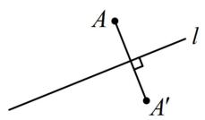  
图1

  
图2

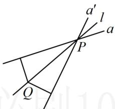

图3

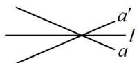  
图4

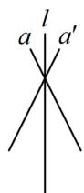  
图5

# 类型 I：点与线的对称

##### 【例1】点 $A(1,2)$ 关于直线 $l: x + y - 2 = 0$ 的对称点是（）

$\quad$A. (1,0)

$\quad$B. (0,1)

$\quad$C. $(0, - 1)$

$\quad$D. (2,1)

【解法1】: 求点 $A$ 关于直线 $l$ 的对称点 $A'$ , 抓住 $AA'$ 的中点在 $l$ 上和 $AA' \perp l$ 建立方程组即可, 设 $A$ 关于 $l$ 的对称点是 $A'(a,b)$ , 则 $AA'$ 的中点为 $D\left(\frac{a+1}{2}, \frac{b+2}{2}\right)$ , 如图,

应有 $\left\{ \begin{array}{l} \frac{a + 1}{2} + \frac{b + 2}{2} - 2 = 0 (\text{中点在} l \text{上}) \\ \frac{b - 2}{a - 1} \times (-1) = -1 (AA' \perp l) \end{array} \right.$ ，解得： $\left\{ \begin{array}{l} a = 0 \\ b = 1 \end{array} \right.$ ，所以 $A'(0,1)$ .

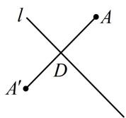

【解法2】注意到对称轴的斜率为-1，故可按内容提要中的特殊情况来处理，先由对称轴方程反解 $x$ 和 $y$ ， $x + y - 2 = 0 \Rightarrow \begin{cases} x = 2 - y \\ y = 2 - x \end{cases}$ ，将 $A(1,2)$ 分别代入此二式的右侧可得 $\left\{ \begin{array}{l} x = 2 - 2 = 0 \\ y = 2 - 1 = 1 \end{array} \right.$ ，故所求对称点为 $(0,1)$ .

答案: B

【反思】①求点 $A$ 关于直线 $l$ 的对称点 $A'$ ，关键是抓住 $AA'$ 的中点在 $l$ 上和 $l \perp AA'$ 来建立方程组，这是解决这类问题的通法；②解法2的做法，只适用于对称轴的斜率为 $\pm 1$ 的情形.

##### 【变式】已知直线 $l: x + 3y - 2 = 0$ ，则直线 $l$ 关于点 $A(1,1)$ 对称的直线 $l'$ 的方程为 \_\_\_\_.

【解法1】如图，关于点对称的两直线平行，所以两直线斜率相等，再找一个点即可，

由题意, 点 $B(2,0)$ 在 $l$ 上, 那么它关于点 $A$ 的对称点 $B'(0,2)$ 在 $l'$ 上,

又直线 $l$ 的斜率为 $-\frac{1}{3}$ ，所以 $l'$ 的方程为 $y = -\frac{1}{3} x + 2$ ，整理得： $x + 3y - 6 = 0$ 。

【解法2】要求直线 $l'$ ，可设其上任意一点 $B'$ 的坐标，由 $B'$ 关于 $A$ 的对称点 $B$ 在 $l$ 上建立该坐标的方程，

设 $B'(x, y)$ 是 $l'$ 上任意一点，则它关于 $A$ 的对称点 $B(2 - x, 2 - y)$ 在直线 $l$ 上，

代入直线 l 的方程可得 $(2-x)+3(2-y)-2=0$ ，

整理得： $x + 3y - 6 = 0$ ，所以 $l'$ 的方程为 $x + 3y - 6 = 0$

答案 $x+3y-6=0$

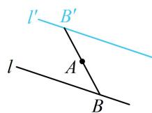

# 类型Ⅱ：圆关于直线的对称

【例 2】与圆 $C:(x-1)^{2}+y^{2}=1$ 关于直线 $l:x-y+1=0$ 对称的圆的方程为 \_\_\_\_.

解析如图，对称圆的圆心 $C'$ 与点 $C$ 关于 $l$ 对称，先求 $C'$ 的坐标，直线 $l$ 的斜率为 1，可按特殊情况处理，

$x - y + 1 = 0 \Rightarrow \left\{ \begin{array}{l} x = y - 1 \\ y = x + 1 \end{array} \right.$ ，将 $C(1,0)$ 代入此二式右侧可得 $\left\{ \begin{array}{l} x = 0 - 1 = -1 \\ y = 1 + 1 = 2 \end{array} \right.$ ，

所以 $C'(-1,2)$ ，故所求圆的方程为 $(x + 1)^{2} + (y - 2)^{2} = 1$

答案 $(x + 1)^{2} + (y - 2)^{2} = 1$

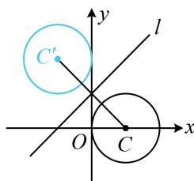

【反思】求圆 $C$ 关于直线 $l$ 的对称圆 $C'$ ，关键是求点 $C$ 关于直线 $l$ 的对称点 $C'$ ，两圆半径相等.

##### 【变式】若方程 $x^{2} + y^{2} + Dx + Ey + F = 0 (D^{2} + E^{2} - 4F > 0)$ 表示的曲线关于直线 $y = x$ 对称，则必有（）

$\quad$A. $D = E$

$\quad$B. $D = F$

$\quad$C. $E = F$

$\quad$D. $D = E = F$

解析 $x^{2} + y^{2} + Dx + Ey + F = 0\Rightarrow \left(x + \frac{D}{2}\right)^{2} + \left(y + \frac{E}{2}\right)^{2} = \frac{D^{2} + E^{2} - 4F}{4}\Rightarrow$ 所给方程表示圆心为 $\left(-\frac{D}{2}, - \frac{E}{2}\right)$ 的圆，圆关于直线对称，只需该直线过圆心，所以 $-\frac{E}{2} = -\frac{D}{2}$ ，故 $D = E$ ：

答案: A

# 类型III：直线与直线对称

【例 3】直线 $l_{1}: x + y - 1 = 0$ 关于直线 l: 3x - y - 3 = 0 对称的直线 $l_{2}$ 的方程为 \_\_\_\_.

解析如图，直线 $l_{2}$ 过 $l_{1}$ 与 $l$ 的交点 $P$ ，先求点 $P$ ， $\left\{ \begin{array}{l}x + y - 1 = 0\\ 3x - y - 3 = 0 \end{array} \right.\Rightarrow \left\{ \begin{array}{l}x = 1\\ y = 0 \end{array} \right.$ ，所以 $P(1,0)$

有了点, 还差斜率, 故设斜率, 并在 $l$ 上另取一点 $Q$ , 由 $Q$ 到 $l_{1}$ 和 $l_{2}$ 距离相等建立方程求斜率,

由图可知 $l_{2}$ 的斜率存在，设为 $k$ ，则 $l_{2}$ 的方程为 $y = k(x - 1)$ ，即 $kx - y - k = 0$ ①，

在 $l$ 上另取一点 $Q(0, - 3)$ ，则 $Q$ 到 $l_{1}$ 和 $l_{2}$ 的距离相等，

所以 $\frac{|-3 - 1|}{\sqrt{1^2 + 1^2}} = \frac{|-(-3) - k|}{\sqrt{k^2 + (-1)^2}}$ ，解得： $k = \frac{1}{7}$ 或-1，其中-1是 $l_{1}$ 的斜率，舍去，

所以 $k = \frac{1}{7}$ ，代入①整理得 $l_{2}$ 的方程为 $x - 7y - 1 = 0$ 。

答案 $x - 7y - 1 = 0$

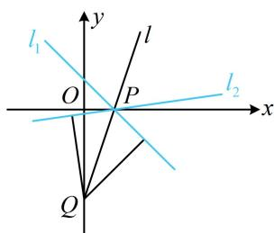

##### 【变式1】直线 $l:3x - 4y + 5 = 0$ 关于 $y$ 轴对称的直线 $l'$ 的方程为

解析如图，直线 $l'$ 经过l与y轴的交点P，先求点P的坐标， $\left\{\begin{aligned}&3x-4y+5=0\\&x=0\end{aligned}\right.\Rightarrow y=\frac{5}{4}$ ，所以 $P\left(0,\frac{5}{4}\right)$

由图可知两直线的倾斜角互补，其斜率应互为相反数，

直线 l 的斜率为 $\frac{3}{4}$ ，所以直线 $l'$ 的斜率为 $-\frac{3}{4}$ ，

故直线 $l'$ 的方程为 $y = -\frac{3}{4} x + \frac{5}{4}$ ，整理得： $3x + 4y - 5 = 0$ .

答案 $3x + 4y - 5 = 0$

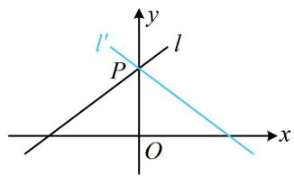

##### 【变式2】(2022·新课标Ⅱ卷) 设点 $A(-2,3)$ , $B(0,a)$ , 直线 $AB$ 关于直线 $y = a$ 的对称直线为 $l$ , 已知直线 $l$ 与圆 $C: (x+3)^{2}+(y+2)^{2}=1$ 有公共点, 则 $a$ 的取值范围为 \_\_\_\_.

解析 $y = a$ 是水平线，关于水平线对称的两直线倾斜角互补，斜率相反，所以直线 $l$ 的方程易求出，如图，注意到点 $B$ 在直线 $y = a$ 上，所以直线 $l$ 也过点 $B$ ，

因为 $k_{AB} = \frac{3 - a}{-2 - 0} = \frac{a - 3}{2}$ ，所以 $l$ 的斜率为 $\frac{3 - a}{2}$ ，故 $l$ 的方程为 $y = \frac{3 - a}{2} x + a$ ，即 $(3 - a)x - 2y + 2a = 0$ ，

直线 l 与圆 C 有公共点可翻译成圆心到直线 l 的距离 $d \leq r$ ,

可由此建立不等式求 $a$ 的范围，

因为 $l$ 与圆 $C$ 有公共点, 所以圆心 $C(-3, -2)$ 到 $l$ 的距离

$d=\frac{\left|(3-a)\times(-3)-2\times(-2)+2a\right|}{\sqrt{(3-a)^{2}+4}}\leq1$ ，解得： $\frac{1}{3}\leq a\leq\frac{3}{2}$

答案 $\left[\frac{1}{3},\frac{3}{2}\right]$

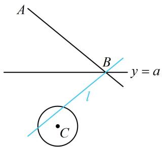

【总结】从例 3 及其后的两个变式可以看出，当对称轴不与坐标轴垂直时，可在对称轴上另取一点，由该点到两直线距离相等来求斜率；当对称轴与坐标轴垂直时，直接由两直线斜率相反即可求斜率.

# 类型IV：线段和与差的最值

【例 4】在平面直角坐标系 xOy 中，直线 $l: x + y + 1 = 0$ 上的动点 P 到定点 $M(0,2)$ 和 $N(1,1)$ 的距离之和的最小值为 \_\_\_\_.

解析 $M$ ， $N$ 在 $l$ 的同侧，直接分析 $|PM| + |PN|$ 的最值不易，可将 $M$ 对称到 $l$ 的另一侧，转化为求 $l$ 上的动点到其两侧定点的距离之和的最小值来分析，

如图，设 $M'$ 是 $M$ 关于直线 $l$ 的对称点，则 $\left|PM\right| = \left|PM'\right|$ ，所以 $\left|PM\right| + \left|PN\right| = \left|PM'\right| + \left|PN\right|$ ，

由三角形两边之和大于第三边可得 $\left|PM'\right|+\left|PN\right|\geq\left|M'N\right|$ ，当且仅当P与图中 $P_{0}$ 重合时取等号，

所以 $\left|PM\right|+\left|PN\right|$ 的最小值是 $\left|M'N\right|$ ,

求 $|MN|$ 要用 $M'$ 的坐标，先求它，注意到 l 的斜率为 -1，可按特殊情况处理，

$x + y + 1 = 0 \Rightarrow \left\{ \begin{array}{l} x = -y - 1 \\ y = -x - 1 \end{array} \right.$ ，将点 $M(0,2)$ 代入此二式的右侧可得 $\left\{ \begin{array}{l} x = -2 - 1 = -3 \\ y = -0 - 1 = -1 \end{array} \right.$ ，

所以 $M'(-3, - 1)$ ，故 $\left|M'N\right| = \sqrt{(-3 - 1)^2 + (-1 - 1)^2} = 2\sqrt{5}$ ，即 $(|PM| + |PN|)_{\min} = 2\sqrt{5}$

答案 $2 \sqrt{5}$

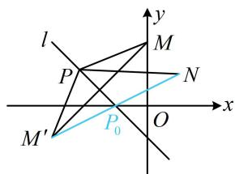

【反思】定直线 l 上的动点 P 到其同侧两定点 M, N 的距离之和的最小值，可通过将 M 或 N 对称到 l 的另一侧，借助三角形两边之和大于第三边来分析.

##### 【变式】直线 $2x + 3y - 6 = 0$ 分别交 $x$ 轴和 $y$ 轴于点 $A, B$ , 点 $P$ 为直线 $l: y = x$ 上的动点, 则 $\left|PA\right| - \left|PB\right|$ 的最大值是 ( )

$\quad$A. 1 
$\quad$B. 2 
$\quad$C. 3 
$\quad$D. 4

解析由题意，直线 $2x + 3y - 6 = 0$ 与 $x$ 轴交于点 $A(3,0)$ ，与 $y$ 轴交于点 $B(0,2)$ ，

如图，A, B 在 l 两侧，直接分析 $\left|PA\right| - \left|PB\right|$ 的最大值不易，可将 B 对称到 l 的另一侧，设 $B'$ 是 B 关于直线 l 的对称点，则 $B'(2,0)$ ，且 $\left|PB\right| = \left|PB'\right|$ ，

所以 $\left|PA\right|-\left|PB\right|=\left|PA\right|-\left|PB'\right|$ ，由三角形两边之差小于第三边可得 $\left|PA\right|-\left|PB'\right|\leq\left|AB'\right|$ ，当且仅当点P与点O重合时取等号，所以 $\left(\left|PA\right|-\left|PB\right|\right)_{\max}=\left|AB'\right|=1$ 。

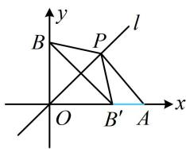

答案: A

【反思】定直线 l 上的动点 P 到其异侧两定点 A, B 的距离之差的最大值，可通过将 A 或 B 对称到 l 的另一侧，借助三角形两边之差小于第三边来分析.

# 类型V：入射光线与反射光线的对称

【例 5】已知从点 A(-4,1) 发出的一束光线 $l_{1}$ 经过直线 $l: x - y + 3 = 0$ 反射，反射光线 $l_{2}$ 恰好通过点 B(-3,2)，则 $l_{2}$ 的方程为 \_\_\_\_.

解析如图，入射光线 $l_{1}$ 和反射光线 $l_{2}$ 关于直线 $l$ 对称，所以 $A$ 关于 $l$ 的对称点 $A'$ 在 $l_{2}$ 上，先求 $A'$ 的坐标，直线 $l$ 的斜率为 1，可按特殊情况处理，

$x - y + 3 = 0 \Rightarrow \left\{ \begin{array}{l} x = y - 3 \\ y = x + 3 \end{array} \right.$ ，将点 $A(-4,1)$ 代入此二式的右侧可得 $\left\{ \begin{array}{l} x = 1 - 3 = -2 \\ y = -4 + 3 = -1 \end{array} \right.$ ，

所以 $A'(-2, - 1)$ ，直线 $l_{2}$ 即为直线 $A'B$ ，其斜率为 $\frac{-1 - 2}{-2 - (-3)} = -3$

故 $l_{2}$ 的方程为 $y - 2 = -3[x - (-3)]$ ，整理得： $3x + y + 7 = 0$

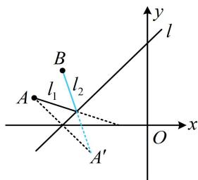

答案 $3x + y + 7 = 0$

【反思】如图， $\angle 1 = \angle 2 \Rightarrow \angle 3 = \angle 4$ ，又 $\angle 3 = \angle 5$ ，所以 $\angle 4 = \angle 5$ ，从而入射光线 $l_{1}$ 与反射光线 $l_{2}$ 关于直线 $l$ 对称，利用此性质可解决大部分的光线入射与反射问题，其本质仍是点关于线的对称.

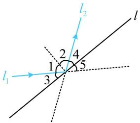

# 强化训练

##### 1. (2025·福建福州模拟·★)

点(1,2)关于直线x-2y-2=0的对称点坐标是\_\_\_\_.

##### 2. (2022·北京模拟·★)

直线 $l:3x-4y+5=0$ 关于点 $A(1,1)$ 对称的直线 $l'$ 的方程为 \_\_\_\_.

##### 3. (★)

已知圆 $C: x^2 + y^2 + ax + by + 1 = 0$ 关于直线 $l: x + y = 1$ 对称的圆为 $O: x^2 + y^2 = 1$ ，则 $a + b = (\quad)$

$\quad$A. -2

$\quad$B. ±2

$\quad$C. -4

$\quad$D. ±4

##### 4. (★)

已知圆 $C: x^{2} + y^{2} - 2x + 4y = 0$ 关于直线 $l: 2x + ay = 0$ 对称，则 $a =$ \_\_\_\_.

##### 5. (★)

直线 $l: x - y + 1 = 0$ 关于 $x$ 轴对称的直线 $l'$ 的方程是（）

$\quad$A. $x + y - 1 = 0$

$\quad$B. $x - y + 1 = 0$

$\quad$C. $x + y + 1 = 0$

$\quad$D. $x - y - 1 = 0$

##### 6. (★★)

直线 $l_{1}: x - 3y + 3 = 0$ 关于 $l: x + y - 1 = 0$ 的对称直线 $l_{2}$ 的方程为 \_\_\_\_.

##### 7. (2022·黑龙江勃利模拟·★★★)

设 $P(x,y)$ 为直线 $l:x - y = 0$ 上的动点，则 $m = \sqrt{(x - 2)^2 + (y - 4)^2} +\sqrt{(x + 2)^2 + (y - 1)^2}$ 的最小值为（）

$\quad$A. 5

$\quad$B. 6

$\quad$C. $\sqrt{37}$

$\quad$D. $\sqrt{39}$

##### 8. (2022·安徽模拟·★★★)

已知点 $R$ 在直线 $l: x - y + 1 = 0$ 上， $M(1,3)$ ， $N(3,-1)$ ，则 $\left\| RM \right| - \left| RN \right|$ 的最大值为（）

$\quad$A. $\sqrt{5}$

$\quad$B. $\sqrt{7}$

$\quad$C. $\sqrt{10}$

$\quad$D. $2 \sqrt{5}$

##### 9.（2022·山东潍坊一模·★★★☆）（多选）

已知圆 $C: x^{2} + (y - 2)^{2} = 1$ ，一条光线从点 $P(2,1)$ 发出，经 $x$ 轴反射，下列结论中正确的是（）

$\quad$A. 圆 $C$ 关于 $x$ 轴的对称圆为 $x^{2} + (y + 2)^{2} = 1$

$\quad$B. 若反射光线平分圆 $C$ 的周长, 则入射光线所在的直线为 $3 x - 2 y - 4 = 0$

$\quad$C. 若反射光线与圆 $C$ 相切于点 $A$ , 与 $x$ 轴交于点 $B$ , 则 $\left|PB\right| + \left|BA\right| = 2$

$\quad$D. 若反射光线与圆 $C$ 的一个交点为 $A$ , 与 $x$ 轴交于点 $B$ , 则 $\vert PB \vert + \vert BA \vert$ 的最小值为 $2 \sqrt{3} - 1$

