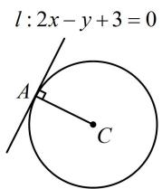
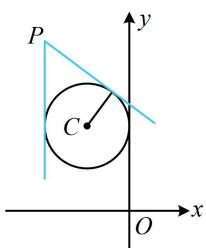
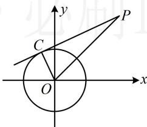
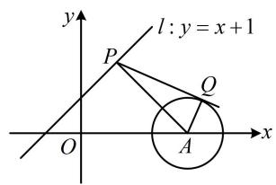
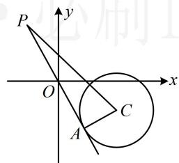
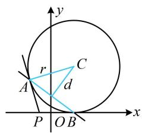
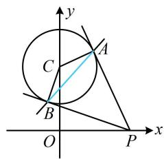
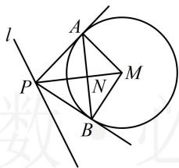
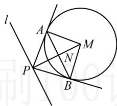

# 强化训练

##### 1. (2025·河北石家庄模拟·★)

过点 $P(1, - 1)$ 且与圆 $C:x^{2} + y^{2} - 4x + 2 = 0$ 相切的直线的方程为（）

$\quad$A. $x + y = 0$

$\quad$B. $x - y - 2 = 0$

$\quad$C. $x - y = 0$

$\quad$D. $x - y + 2 = 0$

##### 1. A

解析点 $P$ 与圆 $C$ 的位置关系不同，求切线的方法也不同，故先判断 $P$ 与圆 $C$ 的位置关系，

将 $P$ 的坐标代入圆 $C$ 的方程得 $1^{2} + (-1)^{2} - 4 \times 1 + 2 = 0 \Rightarrow P$ 在圆 $C$ 上，故可直接用内容提要4的结论写出切线方程，

切线的方程为 $1 \times x + (-1) \times y - 4 \times \frac{1 + x}{2} + 2 = 0$ ，

整理得： $x + y = 0$

##### 2. (★★)

已知圆 C 的圆心坐标是 $(0, m)$ ，半径长是 r。若直线 $2x - y + 3 = 0$ 与圆相切于点 $A(-2, -1)$ ，则 m = \_\_\_\_， $r =$ \_\_\_\_ .

##### 2. -2, $\sqrt{5}$

【解法1】如图，由题意，应有 $AC \perp l$

所以 $2 \cdot \frac{m + 1}{2} = -1$ ，解得： $m = -2$

点 $C$ 到直线 $l$ 的距离即为半径，所以 $r = \frac{|-m + 3|}{\sqrt{2^2 + (-1)^2}} = \sqrt{5}$

解法 2: 也可写出圆的方程, 代圆上一点处的切线结论,

由题意，圆 $C$ 的方程是 $x^{2} + (y - m)^{2} = r^{2}(r > 0)$

所以圆 $C$ 在 $A(-2, - 1)$ 处的切线方程是 $-2x + (-1 - m)(y - m)$

$=r^{2}$ ，整理得： $2x+(1+m)y+r^{2}-m(1+m)=0$ ，

此方程与题干的 $2x - y + 3 = 0$ 是同一直线，比较系数即可，

所以 $\left\{ \begin{array}{l} 1 + m = -1 \\ r^2 - m(1 + m) = 3 \end{array} \right.$ ，解得： $\left\{ \begin{array}{l} m = -2 \\ r = \sqrt{5} \end{array} \right.$ .

##### 3. (2022·辽宁模拟·★★)

已知圆 $C: x^{2} + y^{2} + 2x - 4y + m = 0$ 与 $y$ 轴相切，过点 $P(-2,4)$ 作圆 $C$ 的切线 $l$ ，则 $l$ 的方程为 \_\_\_\_.

##### 3. $x = -2$ 或 $3x + 4y - 10 = 0$

解析 $x^{2} + y^{2} + 2x - 4y + m = 0\Rightarrow (x + 1)^{2} + (y - 2)^{2} =$

$5 - m$ ，所以圆心为 $C(-1,2)$ ，半径 $r = \sqrt{5 - m}$

因为圆 $C$ 与 $y$ 轴相切，所以圆心到 $y$ 轴的距离 $1 = \sqrt{5 - m}$

解得： $m = 4$ ，故圆 $C:(x + 1)^{2} + (y - 2)^{2} = 1$

如图，点 $P$ 在圆外，求切线可设斜率，先考虑斜率不存在的情况，当 $l \perp x$ 轴时，其方程为 $x = -2$ ，圆心 $C$ 到 $l$ 的距离 $d = 1$

满足直线 l 与圆相切；

当 $l$ 不与 $x$ 轴垂直时，可设其方程为 $y - 4 = k(x + 2)$

即 $kx - y + 2k + 4 = 0$ ①,

所以 $d = \frac{|-k - 2 + 2k + 4|}{\sqrt{k^2 + (-1)^2}} = \frac{|k + 2|}{\sqrt{k^2 + 1}}$

$l$ 与圆 $C$ 相切 $\Rightarrow d = r\Rightarrow \frac{|k + 2|}{\sqrt{k^2 + 1}} = 1$ ，解得： $k = -\frac{3}{4}$

代入①整理得 l 的方程为 $3x + 4y - 10 = 0$ ;

综上所述，切线 $l$ 的方程为 $x = -2$ 或 $3x + 4y - 10 = 0$

# 4. (2023·湖北模拟·★★)

已知过点 $P(3,3)$ 作圆 $O: x^{2} + y^{2} = 2$ 的切线，则切线长为 \_\_\_\_.

##### 4.4

解析如图， $\left|PO\right|=\sqrt{3^{2}+3^{2}}=3\sqrt{2}$ ，

所以切线长 $\left|PC\right|=\sqrt{\left|PO\right|^{2}-\left|OC\right|^{2}}=\sqrt{(3\sqrt{2})^{2}-2}=4$ .

# 5. (2024·陕西模拟·★★★)

由直线 $y = x + 1$ 上的一点向圆 $x^{2} + y^{2} - 6x + 8 = 0$ 引切线，则切线长的最小值为（）

$\quad$A. 3

$\quad$B. $2 \sqrt{2}$

$\quad$C. $\sqrt{7}$

$\quad$D. $\sqrt{6}$

##### 5. C

解析 $x^{2} + y^{2} - 6x + 8 = 0\Rightarrow (x - 3)^{2} + y^{2} = 1$

所以圆心为 $A(3,0)$ ，半径 $r = 1$ ，如图，设 $P$ 为直线 $y = x + 1$ 上一点， $PQ$ 与 $\odot A$ 相切于点 $Q$

所求即为 $|PQ|$ 的最小值，这是圆的切线长，可考虑转化为圆外的点 $P$ 到圆心 $A$ 的距离来处理，

由图可知， $PQ \perp AQ$ ，且 $|AQ| = 1$ ，

所以 $\left|PQ\right|=\sqrt{\left|PA\right|^{2}-\left|AQ\right|^{2}}=\sqrt{\left|PA\right|^{2}-1}$ ①,

要使 $|PQ|$ 最小，只需 $|PA|$ 最小，显然当 $PA \perp l$ 时， $|PA|$ 最小， $y = x + 1$ 可化为 $x - y + 1 = 0$ ，所以 $\left|PA\right|_{\min} = \frac{\left|3 - 0 + 1\right|}{\sqrt{1^2 + (-1)^2}} = 2\sqrt{2}$ ，代入①得 $\left|PQ\right|_{\min} = \sqrt{(2\sqrt{2})^2 - 1} = \sqrt{7}$ .

##### 6. (2022·湖北模拟·★★★)

若圆 $C:(x - 2)^{2} + (y + 1)^{2} = 2$ 关于直线 $l:ax + 2by + 6 = 0$ 对称，过 $P(a,b)$ 作圆 $C$ 的一条切线，切点为 $A$ ，则 $\left|PA\right|$ 的最小值为（）

$\quad$A. 2 
$\quad$B. 3 
$\quad$C. 4 
$\quad$D. 6

##### 6. C

解析圆 $C$ 关于直线 $l$ 对称 $\Rightarrow$ 圆心 $C(2, - 1)$ 在直线 $l$ 上

$\Rightarrow 2 a - 2 b + 6 = 0 \Rightarrow b = a + 3 \quad ①,$

如图，可在 $\triangle PCA$ 中用勾股定理算切线长 $|PA|$ ，下面先

算 $|PC|$ ， $|PC|=\sqrt{(a-2)^{2}+(b+1)^{2}}$ ，

所以 $\left|PA\right|=\sqrt{\left|PC\right|^{2}-\left|AC\right|^{2}}=\sqrt{(a-2)^{2}+(b+1)^{2}-2}$ ，

有 $a, b$ 两个变量，可利用式①来消元，

将式①代入可得 $\left|PA\right|=\sqrt{(a-2)^{2}+(a+3+1)^{2}-2}$

$= \sqrt {2 a ^ {2} + 4 a + 1 8} = \sqrt {2 (a + 1) ^ {2} + 1 6},$

故当 $a = -1$ 时， $\left|PA\right|$ 取得最小值4.

##### 7. (★★☆)

若圆 $C:(x - 2)^{2} + (y - 4)^{2} = 16$ ，过点 $P(-1,0)$ 作圆 $C$ 的两条切线，切点分别为 $A,B$ ，则 $\vert AB\vert = \underline{\quad}$

##### 7. $\frac{24}{5}$

解析如图，可先由切点弦结论写出直线 $AB$ 的方程，

切点弦 $AB$ 的方程为 $(-1 - 2)(x - 2) + (0 - 4)(y - 4) = 16$

整理得： $3x+4y-6=0$ ，

此时 $|AB|$ 可看成直线 $AB$ 被圆 $C$ 截得的弦长，先算 $d$

圆心 $C(2,4)$ 到直线 $AB$ 的距离 $d = \frac{|3\times 2 + 4\times 4 - 6|}{\sqrt{3^2 + 4^2}} = \frac{16}{5}$

所以 $\left|AB\right|=2\sqrt{r^{2}-d^{2}}=2\sqrt{16-\left(\frac{16}{5}\right)^{2}}=\frac{24}{5}$ .

##### 8. (2022·浙江温州模拟·★★★)

过 $x$ 轴正半轴上一点 $P(x_0, 0)$ 作圆 $C: x^2 + (y - \sqrt{3})^2 = 1$ 的两条切线，切点分别为 $A, B$ ，若 $|AB| \geq \sqrt{3}$ ，则 $x_0$ 的最小值为（）

$\quad$A. 1 
$\quad$B. $\sqrt{2}$ 
$\quad$C. 2 
$\quad$D. 3

##### 8. A

解析如图，可由切点弦结论写出直线 $AB$ 的方程，

因为 $P(x_0, 0)$ ，所以直线 $AB$ 的方程为 $x_0 x +$

$(0 - \sqrt{3})(y - \sqrt{3}) = 1$ ，整理得： $x_0x - \sqrt{3} y + 2 = 0$

题干给出 $|AB| \geq \sqrt{3}$ ，于是得算 $|AB|$ ，可按直线 $AB$ 被圆截得的弦长来算，先求圆心到直线 $AB$ 的距离 $d$

圆 $C$ 的圆心为 $C(0, \sqrt{3})$ ，半径 $r = 1$ ，故 $d = \frac{\left| -\sqrt{3} \times \sqrt{3} + 2 \right|}{\sqrt{x_0^2 + (-\sqrt{3})^2}}$

$= \frac{1}{\sqrt{x_0^2 + 3}}$ ，所以 $\left|AB\right| = 2\sqrt{r^2 - d^2} = 2\sqrt{1 - \frac{1}{x_0^2 + 3}}$

因为 $\left|AB\right|\geq\sqrt{3}$ ，所以 $2\sqrt{1-\frac{1}{x_{0}^{2}+3}}\geq\sqrt{3}$ ，

结合 $x_0 > 0$ 可解得： $x_0 \geq 1$ ，故 $x_0$ 的最小值为1.

##### 9. (2020·新课标Ⅰ卷·★★★★)

已知圆 $M: x^2 + y^2 - 2x - 2y - 2 = 0$ ，直线 $l: 2x + y + 2 = 0$ ， $P$ 为 $l$ 上的动点，过点 $P$ 作圆 $M$ 的切线 $PA$ ， $PB$ ，切点为 $A$ ， $B$ ，当 $|PM| \cdot |AB|$ 最小时，直线 $AB$ 的方程为（）

$\quad$A. $2x - y - 1 = 0$ 
$\quad$B. $2x + y - 1 = 0$

$\quad$C. $2x - y + 1 = 0$ 
$\quad$D. $2x + y + 1 = 0$

##### 9. D

解析 $x^{2} + y^{2} - 2x - 2y - 2 = 0\Rightarrow (x - 1)^{2} + (y - 1)^{2} = 4$

所以圆 M 的圆心为 $M(1,1)$ ，半径 r=2，

要求直线 $AB$ 的方程, 只需求出点 $P$ 的坐标, 代切点弦结论即可, 注意到 $|AB|$ 与 $|PM|$ 有关系, 所以为了分析 $|PM| \cdot |AB|$ 何时最小, 先把 $|AB|$ 也用 $|PM|$ 表示,

如图1，设 $AB$ 与 $PM$ 交于点 $N$ ，则 $AN \perp PM$

下面先求 $|AN|$ ，可在 $\triangle PAM$ 中用等面积法，

因为 $S_{\triangle PAM} = \frac{1}{2}\big|PA\big|\cdot \big|AM\big| = \frac{1}{2}\big|PM\big|\cdot \big|AN\big|$ ，所以 $\big|AN\big| =$

$\frac {\left| P A \right| \cdot \left| A M \right|}{\left| P M \right|} = \frac {2 \left| P A \right|}{\left| P M \right|} = \frac {2 \sqrt {\left| P M \right| ^ {2} - 4}}{\left| P M \right|} = 2 \sqrt {1 - \frac {4}{\left| P M \right| ^ {2}}} ,$

从而 $|AB|=2|AN|=4\sqrt{1-\frac{4}{|PM|^{2}}}$ ，

故 $\left|PM\right|\cdot\left|AB\right|=\left|PM\right|\cdot4\sqrt{1-\frac{4}{\left|PM\right|^{2}}}=\sqrt{4\sqrt{\left|PM\right|^{2}-4}}$

所以当 $|PM|$ 最小时， $|PM|\cdot|AB|$ 也最小，

而 $|PM|$ 最小时应有 $PM \perp l$ ，如图2，

可由此垂直关系求得 $PM$ 的斜率，结合点 $M$ 写出其方程，并与 $l$ 联立求出 $P$ 的坐标，

因为直线 $l$ 的斜率为-2，所以 $PM$ 的斜率为 $\frac{1}{2}$

故 $PM$ 的方程为 $y - 1 = \frac{1}{2} (x - 1)$ ，整理得： $x - 2y + 1 = 0$

联立 $\left\{ \begin{array}{l}x - 2y + 1 = 0\\ 2x + y + 2 = 0 \end{array} \right.$ 解得： $\left\{ \begin{array}{l}x = -1\\ y = 0 \end{array} \right.$ ，所以 $P(-1,0)$

由切点弦结论可知直线 $AB$ 的方程为 $-x + 0\cdot y - 2\cdot \frac{-1 + x}{2}$

$-2\cdot\frac{0+y}{2}-2=0$ ，整理得： $2x+y+1=0$

图1

图2

