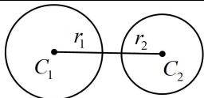
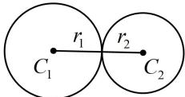
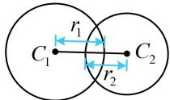
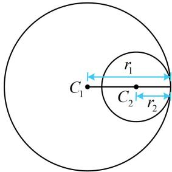
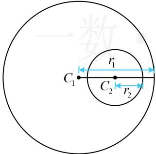
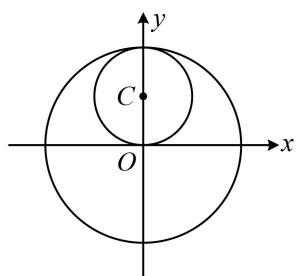
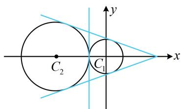
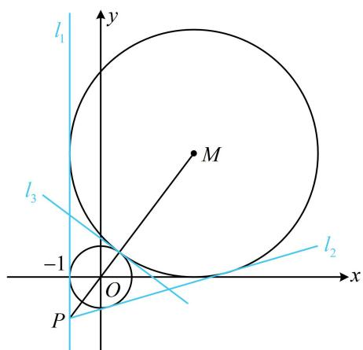
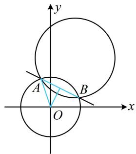

# 第 4 节 圆与圆的位置关系（★★☆）

# 内容提要

##### 1. 设圆 $C_1$ 和圆 $C_2$ 的半径分别为 $r_1, r_2$ ，则两圆的位置关系的判断方法如下表：

<table><tr><td>位置关系</td><td>图形</td><td>判断依据</td><td>交点个数</td><td>公切线条数</td></tr><tr><td>外离</td><td></td><td> $|C_1C_2| > r_1 + r_2$ </td><td>无交点</td><td>4条</td></tr><tr><td>外切</td><td></td><td> $|C_1C_2| = r_1 + r_2$ </td><td>1个</td><td>3条</td></tr><tr><td>相交</td><td></td><td> $|r_1 - r_2| < |C_1C_2| < r_1 + r_2$ </td><td>2个</td><td>2条</td></tr><tr><td>内切</td><td></td><td> $|C_1C_2| = |r_1 - r_2|$ </td><td>1个</td><td>1条</td></tr><tr><td>内含</td><td></td><td> $|C_1C_2| < |r_1 - r_2|$ </td><td>无交点</td><td>无公切线</td></tr></table>

##### 2. 公共弦方程: 当两圆相交时, 它们的公共弦所在直线的方程可用两圆方程作差消去平方项获得. 因为作差得到的必为直线方程, 且两交点都满足该方程, 故该方程即为公共弦的方程.

# 类型 I：圆与圆的位置关系

【例 1】圆 $C: x^{2} + y^{2} - 2y = 0$ 与圆 $O: x^{2} + y^{2} = 4$ 的位置关系是（）

$\quad$A. 内切

$\quad$B. 相交

$\quad$C. 外切

$\quad$D. 内含

解析判断圆与圆的位置关系，只需计算圆心距，并与半径的和、差比较， $x^{2} + y^{2} - 2y = 0 \Rightarrow x^{2} + (y - 1)^{2} = 1 \Rightarrow$ 圆 $C$ 的圆心为 $C(0,1)$ ，半径 $r_1 = 1$ 又圆 $O$ 的圆心为原点，半径 $r_2 = 2$ ，所以圆心距 $\left|OC\right| = 1 = \left|r_1 - r_2\right|$ ，故圆 $C$ 与圆 $O$ 内切，如图.

答案: A

【变式 1】若圆 $C_{1}:(x-1)^{2}+(y-a)^{2}=4$ 与圆 $C_{2}:(x+2)^{2}+(y+1)^{2}=a^{2}$ 相交，则正实数 a 的取值范围是（）

$\quad$A. $(3, +\infty)$ 
$\quad$B. $(2, +\infty)$ 
$\quad$C. $\left(\frac{3}{2}, +\infty\right)$ 
$\quad$D. (3,4)

解析两圆相交等价于 $\left|r_{1}-r_{2}\right|<\left|C_{1}C_{2}\right|<r_{1}+r_{2}$ ，故先计算 $\left|C_{1}C_{2}\right|$ ，

由题意， $C_1(1,a)$ ， $r_1 = 2$ ， $C_2(-2, - 1)$ ， $r_2 = a$ ，所以 $\left|C_1C_2\right| = \sqrt{(-2 - 1)^2 + (-1 - a)^2} = \sqrt{a^2 + 2a + 10}$

因为两圆相交，所以 $|2 - a| < \sqrt{a^2 + 2a + 10} < 2 + a$ ，结合 $a > 0$ 解得： $a > 3$

答案: A

##### 【变式2】已知圆 $C_1:(x - 3)^2 +(y + 2)^2 = 1$ 与圆 $C_2:(x - 7)^2 +(y - 1)^2 = 50 - a$ 有且仅有一个公共点，则实数 $a$ 的值为（）

$\quad$A. 14 
$\quad$B. 34 
$\quad$C. 14或45 
$\quad$D. 34或14

解析两圆有且仅有1个公共点，意味着两圆外切或内切，有两种情况，故分别考虑，

由题意， $C_1(3, - 2)$ ， $r_1 = 1$ ， $C_2(7,1)$ ， $r_2 = \sqrt{50 - a} (a <   50)$ ，所以 $\left|C_1C_2\right| = \sqrt{(3 - 7)^2 + (-2 - 1)^2} = 5$

若两圆外切，则 $\left|C_1C_2\right| = r_1 + r_2$ ，所以 $5 = 1 + \sqrt{50 - a}$ ，解得： $a = 34$

若两圆内切，则 $\left|C_1C_2\right| = \left|r_1 - r_2\right|$ ，所以 $5 = \left|1 - \sqrt{50 - a}\right|$ ，故 $1 - \sqrt{50 - a} = \pm 5$ ，解得： $a = 14$ ；

综上所述，实数 $a$ 的值为34或14.

答案: D

# 类型 II：两圆公切线有关问题

##### 【例2】两圆 $C_1: x^2 + y^2 = 1$ 与 $C_2: (x + 3)^2 + y^2 = 4$ 的公切线的条数为（）

$\quad$A. 1 
$\quad$B. 2 
$\quad$C. 3 
$\quad$D. 4

解析两圆公切线的条数与两圆的位置关系有关，故先判断两圆的位置关系，

由题意， $C_1(0,0)$ ， $r_1 = 1$ ， $C_2(-3,0)$ ， $r_2 = 2$ ，所以 $\left|C_1C_2\right| = 3 = r_1 + r_2$

故两圆外切，有3条公切线，如图.

答案: C

【反思】判断圆与圆公切线的条数，本质就是判断两圆的位置关系.

【变式 1】若圆 $C_{1}: x^{2} + y^{2} - 2mx + m^{2} = 4$ 和圆 $C_{2}: x^{2} + y^{2} + 2x - 4my = 8 - 4m^{2}$ 没有公切线，则实数 m 的取值范围为 \_\_\_\_.

解析公切线条数由两圆的位置关系决定，故可按此翻译，因为圆 $C_1$ 和 $C_2$ 没有公切线，所以两圆内含，

$x ^ {2} + y ^ {2} - 2 m x + m ^ {2} = 4 \Rightarrow (x - m) ^ {2} + y ^ {2} = 4 \Rightarrow C _ {1} (m, 0), \quad r _ {1} = 2,$

$x ^ {2} + y ^ {2} + 2 x - 4 m y = 8 - 4 m ^ {2} \Rightarrow (x + 1) ^ {2} + (y - 2 m) ^ {2} = 9 \Rightarrow C _ {2} (- 1, 2 m), r _ {2} = 3,$

所以 $\left|C_1C_2\right| = \sqrt{(m + 1)^2 + (0 - 2m)^2} = \sqrt{5m^2 + 2m + 1}$ ，由两圆内含可得 $\left|C_1C_2\right| < \left|r_1 - r_2\right|$

所以 $\sqrt{5m^2 + 2m + 1} < 1$ ，解得： $-\frac{2}{5} < m < 0$

答案 $\left(-\frac{2}{5},0\right)$

##### 【变式2】已知圆 $C_1:(x + 2a)^2 +y^2 = 4$ 与圆 $C_2:x^2 +(y - b)^2 = 1$ 只有一条公切线，若 $a,b\in \mathbf{R}$ 且 $ab\neq$ 0，则 $\frac{1}{a^2} +\frac{1}{b^2}$ 的最小值为

解析要求 $\frac{1}{a^2} +\frac{1}{b^2}$ 的最小值，得先寻找 $a$ 和 $b$ 的关系，可将公切线条数翻译成两圆的位置关系，由题意， $C_1(-2a,0)$ ， $r_1 = 2$ ， $C_2(0,b)$ ， $r_2 = 1$ ，所以 $\left|C_1C_2\right| = \sqrt{4a^2 + b^2}$

因为 $C_1$ 和 $C_2$ 有1条公切线，所以两圆内切，故 $\left|C_1C_2\right| = \left|r_1 - r_2\right|$ ，即 $\sqrt{4a^2 + b^2} = 1$ ，所以 $4a^2 + b^2 = 1$ ，在此基础上求 $\frac{1}{a^2} + \frac{1}{b^2}$ 的最小值，可使用“1的代换”来凑成积为定值，由均值不等式求最小值，

$\frac {1}{a ^ {2}} + \frac {1}{b ^ {2}} = \left(\frac {1}{a ^ {2}} + \frac {1}{b ^ {2}}\right) \cdot 1 = \left(\frac {1}{a ^ {2}} + \frac {1}{b ^ {2}}\right) (4 a ^ {2} + b ^ {2}) = 4 + \frac {b ^ {2}}{a ^ {2}} + \frac {4 a ^ {2}}{b ^ {2}} + 1 = 5 + \frac {b ^ {2}}{a ^ {2}} + \frac {4 a ^ {2}}{b ^ {2}} \geq 5 + 2 \sqrt {\frac {b ^ {2}}{a ^ {2}} \cdot \frac {4 a ^ {2}}{b ^ {2}}} = 9,$

当且仅当 $\frac{b^2}{a^2} = \frac{4a^2}{b^2}$ ，即 $a^2 = \frac{1}{6}$ ， $b^2 = \frac{1}{3}$ 时等号成立，所以 $\frac{1}{a^2} + \frac{1}{b^2}$ 的最小值为9.

答案: 9

【例 3】(2022·新课标 I 卷) 写出与圆 $x^{2} + y^{2} = 1$ 和 $(x - 3)^{2} + (y - 4)^{2} = 16$ 都相切的一条直线的方程 \_\_\_\_.

解析两个圆如图，它们的半径分别为1和4，圆心分别为原点 $O$ 和 $M(3,4)$

所以圆心距 $|OM| = \sqrt{3^2 + 4^2} = 5 = 1 + 4$ ，从而两圆外切，故两圆共有三条公切线，如图中的 $l_1, l_2, l_3$ ，求公切线可设斜率，先考虑斜率不存在的情况，结合图象可得 $x = -1$ 是两圆的一条公切线，即图中的 $l_1$ ，本题只需填一条公切线，做到这里已经可以结束了，但我们把另外两条公切线也求一下，

若公切线的斜率存在，则可设其方程为 $y = kx + b$ ，即 $kx - y + b = 0$ ①，

因为该直线与两圆都相切，所以 $\frac{|b|}{\sqrt{k^2 + 1}} = 1$ ②， $\frac{|3k - 4 + b|}{\sqrt{k^2 + 1}} = 4$ ③，

对比②③得 $\left|3k-4+b\right|=4\left|b\right|$ ，所以 $3k-4+b=4b$ 或 $3k-4+b=-4b$ ，

整理得： $b=k-\frac{4}{3}$ 或 $b=\frac{4}{5}-\frac{3}{5}k$ ，

若 $b = k - \frac{4}{3}$ ，代入②解得： $k = \frac{7}{24}$ ，所以 $b = k - \frac{4}{3} = -\frac{25}{24}$

代入①整理得： $7x - 24y - 25 = 0$

若 $b = \frac{4}{5} - \frac{3}{5} k$ ，代入②解得： $k = -\frac{3}{4}$ ，

所以 $b = \frac{4}{5} - \frac{3}{5} k = \frac{5}{4}$ ，代入①整理得： $3x + 4y - 5 = 0$ ；

综上所述，与两圆都相切的直线有 $x = -1$ ， $7x - 24y - 25 = 0$ ， $3x + 4y - 5 = 0$ ，任选其一填入横线即可.

答案 $x = -1$ （答案不唯一，也可填 $3x + 4y - 5 = 0$ ，或 $7x - 24y - 25 = 0$ ）

【反思】求两圆公切线方程的步骤: ①判断两圆的位置关系, 确定公切线条数; ②设公切线方程为 $y = kx + b$ (要讨论斜率不存在的情形); ③利用两圆圆心到公切线的距离等于各自半径, 建立方程组求 $k$ 和 $b$ .

# 类型III：公共弦相关问题

【例 4】圆 $C_{1}: x^{2} + y^{2} = 4$ 和圆 $C_{2}: (x - 1)^{2} + (y - 2)^{2} = 9$ 交于 A、B 两点，则直线 AB 的方程为 \_\_\_\_.

解析 $(x - 1)^2 +(y - 2)^2 = 9\Rightarrow x^2 +y^2 -2x - 4y - 4 = 0$ ，联立 $\left\{ \begin{array}{ll}x^{2} + y^{2} = 4 & ①\\ x^{2} + y^{2} - 2x - 4y - 4 = 0 & ② \end{array} \right.$

用①-②可得： $2x+4y+4=4$ ，整理得公共弦AB的方程为 $x+2y=0$ .

答案: $x + 2y = 0$

【反思】当两圆相交时，直接用两圆的方程作差，消去 $x^{2}$ 和 $y^{2}$ ，化简即得两圆公共弦所在直线的方程.

##### 【变式】若圆 $x^{2} + y^{2} = 4$ 与圆 $x^{2} + y^{2} + 2ax + 4ay - 9 = 0$ 相交，且公共弦长为 $2\sqrt{2}$ ，则 $a =$ \_\_\_\_.

解析如图，把公共弦看成直线 AB 被圆 O 截得的弦，可用弦长公式 $L = 2\sqrt{r^{2} - d^{2}}$ 来算，先求 AB 的方程，用两圆方程作差整理得直线 AB 的方程为 $2ax + 4ay - 5 = 0$ ，

点 $O$ 到直线 $AB$ 的距离 $d = \frac{|-5|}{\sqrt{(2a)^2 + (4a)^2}} = \frac{\sqrt{5}}{2|a|}$

所以公共弦长 $|AB|=2\sqrt{4-\frac{5}{4a^{2}}}=2\sqrt{2}$ ，解得： $a=\pm\frac{\sqrt{10}}{4}$

经检验，均满足所给两圆相交.

答案 $\pm \frac{\sqrt{10}}{4}$

【反思】计算两圆的公共弦长，可先求公共弦所在直线的方程，再按直线被其中一个圆截得的弦长来算.

# 强化训练

##### 1. (2022·湖北十堰模拟·★★)

当圆 $C: x^2 + y^2 - 4x + 2ky + 2k = 0$ 的面积最小时，圆 $C$ 与圆 $O: x^2 + y^2 = 1$ 的位置关系是 \_\_\_\_.

##### 2. (2025·福建福州模拟·★★)

已知圆 $C_1: x^2 + y^2 = 4$ 与圆 $C_2: (x - a)^2 + (y + 4)^2 = 9$ 有且仅有两条公切线，则实数 $a$ 的取值范围为（）

$\quad$A. (1,5)

$\quad$B. $(- \infty, 1) \cup (5, +\infty)$

$\quad$C. $(-3,3)$

$\quad$D. $(- \infty, -3) \cup (3, +\infty)$

##### 3. (★★☆)

若圆 $O: x^2 + y^2 = 1$ 与圆 $C: x^2 + y^2 - 2\sqrt{3}x - 2y + m = 0$ 相切，则实数 $m$ 的值为 \_\_\_\_.

##### 4. (★★)

已知圆 $C_1: x^2 + y^2 - kx - 2y = 0$ 和圆 $C_2: x^2 + y^2 - 2ky - 2 = 0$ 相交，则圆 $C_1$ 和圆 $C_2$ 的公共弦所在的直线过的定点是（）

$\quad$A. (2,2)

$\quad$B. (2,1)

$\quad$C. (1,2)

$\quad$D. (1,1)

##### 5. (★★★)

已知圆 $C_1: x^2 + y^2 - 2x + 4y + 4 = 0$ ，圆 $C_2: x^2 + y^2 + x - y - m^2 = 0 (m > 0)$ ，若圆 $C_2$ 平分圆 $C_1$ 的圆周，则正数 $m$ 的值为（）

$\quad$A. 3

$\quad$B. 2

$\quad$C. 4

$\quad$D. 1

##### 6. (★★★)

已知圆 $M:(x - 2)^{2} + (y - 2)^{2} = 8$ ，圆 $N:(x - 3)^{2} + (y - 3)^{2} = 2$ ，若直线 $l$ 与圆 $M$ 和圆 $N$ 都相切，则直线 $l$ 的方程为

##### 7. (2020·浙江卷·★★★)

设直线 $l:y = kx + b(k > 0)$ ，圆 $C_1:x^2 +y^2 = 1$ ， $C_2:(x - 4)^2 +y^2 = 1$ ，若直线 $l$ 与 $C_1$ ， $C_2$ 都相切，则 $k = \_$ ， $b = \_$

##### 8. (★★★☆)

若圆 $C_1: x^2 + y^2 + 2\sqrt{m}x + m - 4 = 0 (m > 0)$ 和 $C_2: x^2 + y^2 - 4\sqrt{n}y - 1 + 4n = 0 (n > 0)$ 恰有三条公切线，则 $\frac{1}{m} + \frac{1}{n}$ 的最小值为（）

$\quad$A. $\frac{1}{9}$

$\quad$B. $\frac{4}{9}$

$\quad$C. 1

$\quad$D. 3

一数·必刷100讲

