# 内容提要

圆中的最值问题一般有两种处理方法：几何法、代数法.

##### 1. 几何法：五个基本模型（下述 $r$ 均为圆 $C$ 的半径）

①模型1：如图1， $M$ 为圆 $C$ 外一定点， $P$ 为圆 $C$ 上的动点，则 $\left|MC\right| - r \leq \left|PM\right| \leq \left|MC\right| + r$ ，当 $P$ 分别位于图中 $P_{1}$ 和 $P_{2}$ 处时，左右两边分别取等号.  
②模型2：如图2， $M$ 为圆 $C$ 内一定点， $P$ 为圆 $C$ 上的动点，则 $\left\{ \begin{array}{l} |PM| + |CM| \geq |PC| \\ |PM| - |CM| \leq |PC| \end{array} \right.$ ，所以 $\left\{ \begin{array}{l} |PM| \geq |PC| - |CM| = r - |CM| \\ |PM| \leq |PC| + |CM| = r + |CM| \end{array} \right.$ ，故 $r - |CM| \leq |PM| \leq r + |CM|$ ，当 $P$ 分别位于图中 $P_{1}$ 和 $P_{2}$ 处时，左右两边分别取等号.  
③模型3: 如图3, 设直线 $l$ 与圆 $C$ 相离, 圆心 $C$ 到直线 $l$ 的距离为 $d$ , 则圆上动点 $P$ 到直线 $l$ 的距离的取值范围为 $[d - r, d + r]$ , 其中 $d - r$ 和 $d + r$ 分别在图中的 $P_{1}$ , $P_{2}$ 处取得.  
④模型4：如图4，设直线 $l$ 与圆 $C$ 相交，圆心 $C$ 到直线 $l$ 的距离为 $d$ ，则圆上动点 $P$ 到直线 $l$ 的距离的最大值在 $P_{0}$ 处取得，且最大值为 $d + r$   
⑤模型5: 如图5, 过圆 $C$ 内一定点 $P$ 作圆的弦, 则最长的弦为圆的直径, 那最短的弦呢? 我们知道弦长 $L = 2 \sqrt{r^2 - d^2}$ , 所以要使 $L$ 最小, 则需 $d$ 最大, 此时的弦应与 $PC$ 垂直, 如图中的 $AB$ , 因为若弦不与 $PC$ 垂直, 如图中的 $A'B'$ , 则圆心到弦 $A'B'$ 的距离 $d$ 是图中阴影三角形的一条直角边, 必定小于斜边 $PC$ , 而对于弦 $AB$ , 圆心 $C$ 到它的距离即为 $|PC|$ , 所以当弦垂直于 $PC$ 时, $d$ 最大, 弦长 $L$ 最小.

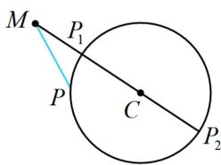

图1

  
图2

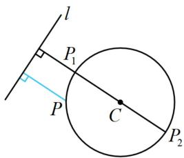

图3

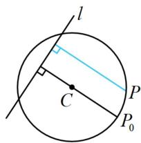

图4

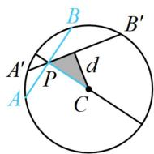  
图5

##### 2. 代数法：设圆 $C: (x - a)^2 + (y - b)^2 = r^2 (r > 0)$ ，可将其方程变形成 $\left(\frac{x - a}{r}\right)^2 + \left(\frac{y - b}{r}\right)^2 = 1$ ，在三角函数那部分，我们知道 $\cos^2\theta +\sin^2\theta = 1$ ，所以可据此进行三角换元，令 $\left\{ \begin{array}{l} \frac{x - a}{r} = \cos \theta \\ \frac{y - b}{r} = \sin \theta \end{array} \right.$ ，从

而 $\left\{ \begin{array}{l} x = a + r\cos \theta \\ y = b + r\sin \theta \end{array} \right.$ ，故对于圆 $C$ 上的动点 $P$ ，可将其坐标设为 $(a + r\cos \theta, b + r\sin \theta)$ （这种设法中 $\theta$ 的几何意义可参考下图），将求最值的目标表示成关于 $\theta$ 的三角函数，借助三角函数求最值.

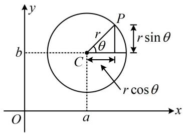

# 类型 I：圆上动点与定点距离的最值问题

【例 1】设 P 为圆 $C:(x-1)^{2}+(y-1)^{2}=1$ 上的动点，O 为原点，则 $|OP|$ 的取值范围为 \_\_\_\_.

解析如图，原点 $O$ 在圆 $C$ 外，属内容提要中的模型 1,

由图可知， $|OP|$ 的最小值在 $P_{1}$ 处取得，最大值在 $P_{2}$ 处取得，

由题意， $C(1,1)$ ，圆 $C$ 的半径 $r = 1$ ，所以 $\left|OC\right| = \sqrt{2}$

从而 $\left|OP_{1}\right|=\left|OC\right|-r=\sqrt{2}-1,\quad\left|OP_{2}\right|=\left|OC\right|+r=\sqrt{2}+1$ ，故 $\left|OP\right|\in[\sqrt{2}-1,\sqrt{2}+1]$ .

答案 $[\sqrt{2} - 1, \sqrt{2} + 1]$

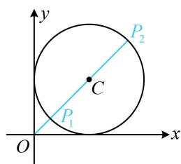

##### 【变式】(2020·北京卷) 已知半径为 1 的圆经过点 (3,4)，则其圆心到原点的距离的最小值为 ( )

$\quad$A. 4 
$\quad$B. 5 
$\quad$C. 6 
$\quad$D. 7

解析本题圆心是动点，先求出圆心的运动轨迹，设圆心为 $P(x, y)$ ，记 $Q(3, 4)$ ，

由题意， $|PQ| = \sqrt{(x - 3)^2 + (y - 4)^2} = 1$ ，所以 $(x - 3)^2 +(y - 4)^2 = 1$

故圆心可在以 $Q(3,4)$ 为圆心，1为半径的圆上运动，

原点在该圆外，属内容提要中的模型1， $|OP|$ 最小的情形如图所示，

因为 $|OQ| = \sqrt{3^2 + 4^2} = 5$ ，所以圆心 $P$ 到原点距离的最小值为 $|OQ| - 1 = 4$ .

答案: A

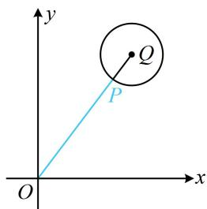

# 类型 II：圆上动点与直线的距离最值问题

【例 2】若 P 为圆 $C:(x-1)^{2}+(y-1)^{2}=1$ 上的动点，则点 P 到直线 $l:x+y+1=0$ 的距离的取值范围为 \_\_\_\_.

解析如图，直线 l 与圆 C 相离，属内容提要中的模型 3，P 到 l 距离最小、最大的情形如图中 $P_{1}$ ， $P_{2}$ ，

圆心 $C(1,1)$ 到直线 $l$ 的距离 $d = \frac{|1 + 1 + 1|}{\sqrt{1^2 + 1^2}} = \frac{3\sqrt{2}}{2}$ ，所以点 $P$ 到直线 $l$ 的距离的取值范

围为 $\left[\frac{3\sqrt{2}}{2}-1,\frac{3\sqrt{2}}{2}+1\right]$ .

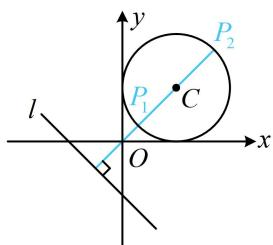

答案 $\left[\frac{3\sqrt{2}}{2} -1,\frac{3\sqrt{2}}{2} +1\right]$

【变式 1】(2018·新课标III卷) 直线 $x + y + 2 = 0$ 分别与 $x$ 轴、 $y$ 轴交于 $A, B$ 两点，点 $P$ 在圆 $(x - 2)^{2} + y^{2} = 2$ 上，则 $\triangle ABP$ 的面积的取值范围是（）

$\quad$A. [2,6]

$\quad$B. [4,8]

$\quad$C. $[\sqrt{2}, 3\sqrt{2}]$

$\quad$D. $[2\sqrt{2}, 3\sqrt{2}]$

解析在 $x + y + 2 = 0$ 中令 $x = 0$ 得 $y = -2$ ，令 $y = 0$ 得 $x = -2$ ，所以 $A(-2,0)$ ， $B(0,-2)$ ，故 $\vert AB\vert = 2\sqrt{2}$ 记 $\triangle ABP$ 的 $AB$ 边上的高为 $h$ ，则 $S_{\triangle ABP} = \frac{1}{2}\vert AB\vert \cdot h = \sqrt{2}h$

下面先求 $h$ 的范围，如图，直线 $AB$ 与圆 $C$ 相离，属内容提要中的模型3，圆心 $C(2,0)$ 到直线 $AB$ 的距离 $d = \frac{|2 + 2|}{\sqrt{1^2 + 1^2}} = 2\sqrt{2}$ ，当 $P$ 在圆 $C$ 上运动时，有 $d - r \leq h \leq d + r$ ，所以 $\sqrt{2} \leq h \leq 3\sqrt{2}$ ，故 $2 \leq S_{\triangle ABP} = \sqrt{2}h \leq 6$ .

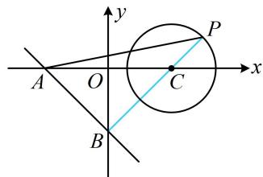

答案: A

【反思】本题也可设点 P 的坐标为 $(2 + \sqrt{2} \cos \theta, \sqrt{2} \sin \theta)$ ，用三角的方法来求 h 的取值范围，不妨试试.

##### 【变式2】设 $P$ 为圆 $C: (x - 1)^{2} + (y - 1)^{2} = 1$ 上的动点， $Q$ 为直线 $l: x + y + 1 = 0$ 上的动点，则 $|PQ|$ 的最小值为 \_\_\_\_.

解析涉及两个动点，考虑先取定一个来看，不妨先取定点 $P$ ，分析 $Q$ 的运动情况，

如图，对于圆 $C$ 上任意的点 $P$ ，当 $Q$ 在直线 $l$ 上运动时， $|PQ|$ 的最小值总是在 $PQ \perp l$ 时取得，

所以问题等价于求点 P 到直线 l 距离的最小值，直线 l 与圆 C 相离，可按内容提要中的模型 3 处理，

圆心 $C(1,1)$ 到直线 $l$ 的距离 $d = \frac{|1 + 1 + 1|}{\sqrt{1^2 + 1^2}} = \frac{3\sqrt{2}}{2} \Rightarrow |PQ|_{\min} = d - r = \frac{3\sqrt{2}}{2} - 1.$

答案 $\frac{3\sqrt{2}}{2} -1$

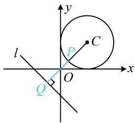

##### 【变式3】设点 $P$ 是函数 $y = -\sqrt{4 - (x - 1)^2}$ 图象上任意一点，点 $Q(2a, a - 3)(a \in \mathbf{R})$ ，则 $|PQ|$ 的最小值为（）

$\quad$A. $\frac{8\sqrt{5}}{5} - 2$

$\quad$B. $\sqrt{5}$

$\quad$C. $\sqrt{5} - 2$

$\quad$D. $\frac{7\sqrt{5}}{5} - 2$

解析直接代两点间距离公式较复杂，可考虑画图来看，所给函数解析式有根号，先平方去根号， $y = -\sqrt{4 - (x - 1)^2} \Rightarrow y^2 = 4 - (x - 1)^2 \Rightarrow (x - 1)^2 + y^2 = 4 (y \leq 0)$ ，所以点 $P$ 在如图所示的半圆 $C$ 上运动，点 $Q$ 的坐标含参，是动点，先消去参数看看点 $Q$ 的运动轨迹，

设 $Q(x,y)$ ，则 $\left\{ \begin{array}{ll}x = 2a & ①\\ y = a - 3 & ② \end{array} \right.$ ，由 $②$ 得 $a = y + 3$ ，代入 $①$ 整理得： $x - 2y - 6 = 0$

所以 $Q$ 是直线 $l: x - 2y - 6 = 0$ 上的动点，

对半圆上任意的点 $P$ ，当 $Q$ 在 $l$ 上运动时， $|PQ|$ 的最小值总是在 $PQ \perp l$ 时取得，故可按内容提要的模型3处理，

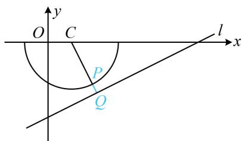

如图，点 $C(1,0)$ 到直线 $l$ 的距离 $d = \frac{|1 - 6|}{\sqrt{5}} = \sqrt{5}$ ，所以 $\left|PQ\right|_{\min} = \sqrt{5} - 2$ 。

答案: C

【反思】当点 $P$ 的坐标含参时，例如 $P(f(a), g(a))$ ，则可设 $P(x, y)$ ，由 $\left\{ \begin{array}{l} x = f(a) \\ y = g(a) \end{array} \right.$ 消去参数 $a$ 得到关于 $x$ 和 $y$ 的方程，从而找到点 $P$ 的运动轨迹.

# 类型III：圆内过定点的弦长最值

【例 3】(2020·新课标 I 卷) 设圆 $x^{2} + y^{2} - 6x = 0$ ，过点 (1,2) 的直线被该圆截得的弦的长度的最小值为（）

$\quad$A. 1 
$\quad$B. 2 
$\quad$C. 3 
$\quad$D. 4

解析 $x^{2} + y^{2} - 6x = 0\Rightarrow (x - 3)^{2} + y^{2} = 9$ ，所以圆心为 $C(3,0)$ ，半径 $r = 3$ 记 $P(1,2)$ ，过点 $P$ 的弦为 $AB$ ，因为 $1^{2} + 2^{2} - 6\times 1 = -1 <   0$ ，所以点 $P$ 在圆 $C$ 内，故可按内容提要中的模型5处理，如图，当弦 $AB\bot PC$ 时， $\vert AB\vert$ 最小，因为 $\left|PC\right| = \sqrt{(1 - 3)^2 + (2 - 0)^2} = 2\sqrt{2}$ ，所以 $\left|AB\right|_{\min} = 2\sqrt{r^2 - \left|PC\right|^2} = 2.$

答案: B

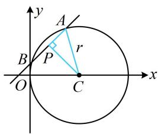

##### 【变式】若直线 $l: kx + y - k = 0$ 与圆 $C: x^2 + y^2 - 4x - 2y - 3 = 0$ 交于 $A, B$ 两点，则 $\triangle ABC$ 的面积的最大值为（）

$\quad$A. 4 
$\quad$B. 8 
$\quad$C. $2 \sqrt{3}$ 
$\quad$D. $4 \sqrt{3}$

解析 $x^{2} + y^{2} - 4x - 2y - 3 = 0\Rightarrow (x - 2)^{2} + (y - 1)^{2} = 8$ ，所以圆心为 $C(2,1)$ ，半径 $r = 2\sqrt{2}$ 直线 $l$ 含参，先看看是否过定点， $kx + y - k = 0\Rightarrow k(x - 1) + y = 0\Rightarrow$ 直线 $l$ 过定点 $P(1,0)$ 如图，可用 $\vert AB\vert$ 和点 $C$ 到直线 $AB$ 的距离 $d$ 求 $\triangle ABC$ 的面积，而 $\vert AB\vert$ 与 $d$ 有关，故面积可用 $d$ 表示，因为 $\vert AB\vert = 2\sqrt{r^2 - d^2} = 2\sqrt{8 - d^2}$ ，所以 $S_{\triangle ABC} = \frac{1}{2}\big|\boldsymbol {AB}\big|\cdot d = \frac{1}{2}\times 2\sqrt{8 - d^2}\cdot d = \sqrt{(8 - d^2)d^2}$ ①，

于是得先求 $d$ 的范围， $d$ 的最小值显然为0，最大值呢，根据内容提要模型5，应在 $AB \perp PC$ 时取得，

因为 $d_{\max} = |PC| = \sqrt{(2 - 1)^2 + (1 - 0)^2} = \sqrt{2}$ ，所以 $d \in [0, \sqrt{2}]$ ，

从式①来看，只需把 $d^{2}$ 换元成t，就可将根号内化为二次函数求区间最值，

令 $t = d^2$ ，则 $S_{\triangle ABC} = \sqrt{(8 - t)t} = \sqrt{16 - (t - 4)^2}$ ，且 $t\in [0,2]$

函数 $\varphi(t) = 16 - (t - 4)^2 (0\leq t\leq 2)$ 在[0,2]上，

所以 $\varphi(t)_{\max} = \varphi(2) = 12$ ，故 $(S_{\triangle ABC})_{\max} = 2\sqrt{3}$ .

答案: C

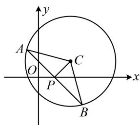

【反思】圆中涉及弦长、面积等相关的范围问题都可以考虑转化成圆心到直线的距离 $d$ 的范围来处理.

# 类型IV：三角换元求最值

【例 4】已知圆 $O: x^{2} + y^{2} = 4$ ，点 $P(x, y)$ 是圆 O 上一点.

（1）x-y 的取值范围是\_\_\_\_；（2） $\left|x+\sqrt{3}y-5\right|$ 的最小值是\_\_\_\_。

解析（1）点 $P$ 在圆 $O$ 上运动，可将 $P$ 的坐标设为三角形式，转化为三角函数求最值或范围，设 $\left\{ \begin{array}{l} x = 2\cos \theta \\ y = 2\sin \theta \end{array} \right.$ ，则 $x - y = 2\cos \theta - 2\sin \theta = 2\sqrt{2}\cos \left( \theta + \frac{\pi}{4} \right)$ ，由 $-1 \leq \cos \left( \theta + \frac{\pi}{4} \right) \leq 1$ 得 $-2\sqrt{2} \leq x - y \leq 2\sqrt{2}$ .

（2）由（1）可得 $\left|x+\sqrt{3}y-5\right|=\left|2\cos\theta+2\sqrt{3}\sin\theta-5\right|=\left|4\sin\left(\theta+\frac{\pi}{6}\right)-5\right|=5-4\sin\left(\theta+\frac{\pi}{6}\right)$

因为 $-1 \leq \sin \left( \theta + \frac{\pi}{6} \right) \leq 1$ ，所以当 $\sin \left( \theta + \frac{\pi}{6} \right) = 1$ 时， $\left| x + \sqrt{3} y - 5 \right|$ 取得最小值 1.

答案（1） $[-2\sqrt{2}, 2\sqrt{2}]$ ；（2）1

【反思】看到动点满足 $x^{2} + y^{2} = a$ 时，可考虑三角换元，将目标式表示成关于 $\theta$ 的单变量三角函数来分析.

# 强化训练

##### 1. (★★)

已知 $O$ 为原点， $P$ 为圆 $C: (x - 1)^2 + (y - b)^2 = 1 (b > 0)$ 上的动点，若 $|OP|$ 的最大值为3，则 $b = (\quad)$

$\quad$A. 1 
$\quad$B. $\sqrt{2}$ 
$\quad$C. $\sqrt{3}$ 
$\quad$D. 2

##### 2. (2022·陕西西安模拟·★★☆)

已知半径为 2 的圆过点(5,12)，则其圆心到原点的距离的最小值为（）

$\quad$A. 10 
$\quad$B. 11 
$\quad$C. 12 
$\quad$D. 13

##### 3. (2022·陕西西安模拟·★★☆)

圆 $C: x^2 + y^2 - 4x - 4y - 10 = 0$ 上的点 $P$ 到直线 $l: x + y - 14 = 0$ 的最大距离与最小距离之和为（）

$\quad$A. 30 
$\quad$B. 18 
$\quad$C. $10 \sqrt{2}$ 
$\quad$D. $5 \sqrt{2}$

##### 4. (2022·青海大通三模·★★★)

已知点 $M, N$ 分别在圆 $C: (x - 3)^2 + (y - 1)^2 = 4$ 和直线 $l: 4x - 3y + t = 0$ 上运动，若 $|MN|$ 的最小值为 7，则 $t$ 的值为（）

$\quad$A. 36 
$\quad$B. 37 
$\quad$C. -45 
$\quad$D. -54或36

##### 5. (2022·天津模拟·★★★)

设曲线 $C: x = \sqrt{1 - (y - 1)^2}$ 上的点 $P$ 到直线 $l: x - y - 2 = 0$ 的距离的最大值为 $a$ ，最小值为 $b$ ，则 $a - b$ 的值为（）

$\quad$A. $\sqrt{2}$

$\quad$B. $2 - \frac{\sqrt{2}}{2}$

$\quad$C. 2

$\quad$D. $\frac{\sqrt{2}}{2} + 1$

##### 6. (★★★)

若 $P$ 为圆 $O: x^2 + y^2 = 2$ 上的动点，点 $A(m, m - 3) (m \in \mathbf{R})$ ，则 $|PA|$ 的最小值为（）

$\quad$A. 1

$\quad$B. 2

$\quad$C. $\frac{\sqrt{2}}{2}$

$\quad$D. $\frac{3\sqrt{2}}{2}$

##### 7. (2022·云南昆明模拟·★★★)

在圆 $M: x^{2} + y^{2} - 4x + 2y - 4 = 0$ 内，过点 $O(0,0)$ 的最长弦和最短弦分别是 $AC$ ， $BD$ ，则四边形 $ABCD$ 的面积为（）

$\quad$A. 24

$\quad$B. 12

$\quad$C. 10

$\quad$D. 8

##### 8. (2022·北京模拟·★★★)

已知直线 $l: ax + by = 1$ ，若 $l$ 上有且仅有一点 $P$ ，使得以 $P$ 为圆心，1 为半径的圆过原点 $O$ ，则 $a - b$ 的最大值为（）

$\quad$A. $\sqrt{2}$

$\quad$B. $2 \sqrt{2}$

$\quad$C. 2

$\quad$D. 1

##### 9. (2024·全国甲卷·★★★☆)

已知 $b$ 是 $a, c$ 的等差中项，直线 $ax + by + c = 0$ 与圆 $x^{2} + y^{2} + 4y - 1 = 0$ 交于 $A, B$ 两点，则 $\vert AB\vert$ 的最小值为（）

$\quad$A. 1

$\quad$B. 2

$\quad$C. 4

$\quad$D. $2 \sqrt{5}$

一数·必刷100讲

