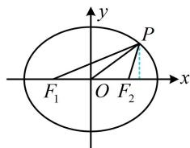
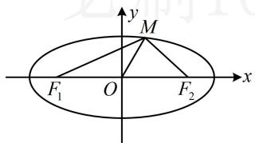
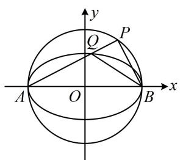
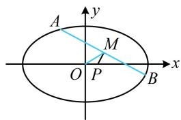

# 强化训练

##### 1. (★★)

设 $F_{1}$ ， $F_{2}$ 是椭圆 $\frac{x^2}{5} +\frac{y^2}{4} = 1$ 的两个焦点，点 $P$ 在椭圆上， $\angle F_1PF_2 = 30^\circ$ ，则 $\triangle PF_1F_2$ 的面积为

##### 1. $8 - 4 \sqrt{3}$

解析给出 $\angle F_{1}PF_{2}$ ，直接用 $S_{\triangle PF_1F_2} = b^2\tan \frac{\theta}{2}$ 求面积，

由题意， $S_{\triangle PF_1F_2} = 4\tan 15^{\circ} = 4\tan (60^{\circ} - 45^{\circ})$

$= 4 \times \frac {\tan 6 0 ^ {\circ} - \tan 4 5 ^ {\circ}}{1 + \tan 6 0 ^ {\circ} \tan 4 5 ^ {\circ}} = 4 \times \frac {\sqrt {3} - 1}{1 + \sqrt {3}} = 8 - 4 \sqrt {3}.$

##### 2. (2023·全国甲卷·★★★)

椭圆 $\frac{x^2}{9} +\frac{y^2}{6} = 1$ 的两焦点为 $F_{1}$ ， $F_{2}$ ， $O$ 为原点， $P$ 为椭圆上一点， $\cos \angle F_1PF_2 = \frac{3}{5}$ ，则 $\left|OP\right| =$ （）

$\quad$A. $\frac{2}{5}$

$\quad$B. $\frac{\sqrt{30}}{2}$

$\quad$C. $\frac{3}{5}$

$\quad$D. $\frac{\sqrt{35}}{2}$

##### 2. B

解析由题意， $a = 3$ ， $b = \sqrt{6}$ ， $c = \sqrt{a^2 - b^2} = \sqrt{3}$

如图，已知 $\angle F_{1}PF_{2}$ ，可由焦点三角形面积公式求 $S_{\triangle PF_ {1}F_ {2}}$

而 $S_{\triangle PF_1F_2} = \frac{1}{2}\big|F_1F_2\big|\cdot y_P$ ，故可建立方程求 $y_{P}$

记 $\angle F_{1}PF_{2} = \theta$ ，则由题意， $\cos \theta = \frac{3}{5}$

又 $\cos \theta = 2\cos^2{\frac{\theta}{2}} -1$ ，所以 $2\cos^2{\frac{\theta}{2}} -1 = {\frac{3}{5}}$

结合 $\frac{\theta}{2}$ 为锐角可得 $\cos \frac{\theta}{2} = \frac{2\sqrt{5}}{5}$ ，故 $\tan \frac{\theta}{2} = \frac{1}{2}$ ，

所以 $S_{\triangle PF_1F_2} = b^2\tan \frac{\theta}{2} = 3$ ，又 $S_{\triangle PF_1F_2} = \frac{1}{2}\big|F_1F_2\big|\cdot \big|y_P\big|$

$= \frac{1}{2}\times 2\sqrt{3}\left|y_{P}\right| = \sqrt{3}\left|y_{P}\right|$ ，所以 $\sqrt{3}\left|y_P\right| = 3$ ，故 $\left|y_P\right| = \sqrt{3}$

代入椭圆方程可求得 $\left|x_{P}\right|=\frac{3\sqrt{2}}{2}\Rightarrow\left|OP\right|=\sqrt{x_{P}^{2}+y_{P}^{2}}=\frac{\sqrt{30}}{2}$ .

##### 3. (★★)

椭圆 $\frac{x^2}{6} +\frac{y^2}{2} = 1$ 的左、右焦点分别为 $F_{1}$ ， $F_{2}$ ，点 $P$ 在椭圆上，则 $\left|PF_1\right|\cdot \left|PF_2\right|$ 的取值范围为

##### 3. [2,6]

解析涉及焦半径 $\left|PF_{1}\right|$ 和 $\left|PF_{2}\right|$ ，可用焦半径公式来算，

由题意， $a = \sqrt{6}$ ， $b = \sqrt{2}$ ， $c = \sqrt{a^2 - b^2} = 2$

椭圆的离心率 $e = \frac{c}{a} = \frac{\sqrt{6}}{3}$ ,

设 $P(x_0,y_0)(-\sqrt{6}\leq x_0\leq \sqrt{6})$ ，则 $\left|PF_1\right| = \sqrt{6} +\frac{\sqrt{6}}{3} x_0$

$\left|PF_{2}\right| = \sqrt{6} -\frac{\sqrt{6}}{3} x_{0}$ ，所以 $\left|PF_1\right|\cdot \left|PF_2\right| = 6 - \frac{2}{3} x_0^2\in [2,6]$

##### 4.（2023·广东南粤名校联考·★★★☆）

设椭圆 $\frac{x^2}{5} + y^2 = 1$ 的左、右焦点分别为 $F_{1}$ ， $F_{2}$ ，点 $M$ 在椭圆 $C$ 上，且 $\angle F_{1}MF_{2} = 120^{\circ}$ ，（ $O$ 为原点），则 $|OM| =$ \_\_\_\_.

##### 4. $\sqrt{2}$

解析怎样翻译 $\angle F_{1}MF_{2} = 120^{\circ}$ ？可考虑对 $\triangle MF_{1}F_{2}$ 用余弦定理，需要 $\left|MF_1\right|$ 和 $\left|MF_2\right|$ ，它们分别是椭圆的左焦半径和右焦半径，可用 $M$ 的坐标代焦半径公式计算，而 $\left|OM\right|$ 恰好也可由 $M$ 的坐标计算，故设 $M$ 的坐标，

设 $M(x_0,y_0)$ ，由题意， $a = \sqrt{5}$ ， $b = 1$ ， $c = 2$ ， $e = \frac{2}{\sqrt{5}}$

由焦半径公式， $\left|MF_1\right| = \sqrt{5} +\frac{2}{\sqrt{5}} x_0$ ， $\left|MF_2\right| = \sqrt{5} -\frac{2}{\sqrt{5}} x_0$

在 $\triangle MF_{1}F_{2}$ 中，由余弦定理，

$\left| F _ {1} F _ {2} \right| ^ {2} = \left| M F _ {1} \right| ^ {2} + \left| M F _ {2} \right| ^ {2} - 2 \left| M F _ {1} \right| \cdot \left| M F _ {2} \right| \cdot \cos \angle F _ {1} M F _ {2},$

所以 $16 = \left(\sqrt{5} +\frac{2}{\sqrt{5}} x_0\right)^2 +\left(\sqrt{5} -\frac{2}{\sqrt{5}} x_0\right)^2 -$

$2\left(\sqrt{5} + \frac{2}{\sqrt{5}} x_0\right)\left(\sqrt{5} - \frac{2}{\sqrt{5}} x_0\right)\cos 120^\circ$ ，化简得： $x_0^2 = \frac{5}{4}$ ，

所以 $y_0^2 = 1 - \frac{x_0^2}{5} = \frac{3}{4}$ 故 $\left|OM\right| = \sqrt{x_0^2 + y_0^2} = \sqrt{\frac{5}{4} + \frac{3}{4}} = \sqrt{2}$ .

##### 5. (2022·广西模拟·★★★)

已知椭圆 $C: \frac{x^2}{a^2} + \frac{y^2}{b^2} = 1 (a > b > 0)$ 的左焦点为 $F$ ，过 $F$ 作倾斜角为 $45^\circ$ 的直线与椭圆 $C$ 交于 $A, B$ 两点，若点 $M(-3,2)$ 是线段 $AB$ 的中点，则椭圆 $C$ 的离心率是（）

$\quad$A. $\frac{\sqrt{3}}{3}$

$\quad$B. $\frac{1}{2}$

$\quad$C. $\frac{2}{5}$

$\quad$D. $\frac{\sqrt{5}}{5}$

##### 5. A

解析涉及弦 $AB$ 的中点，考虑中点弦斜率积结论，先计算直线 $OM$ 和直线 $AB$ 的斜率，由题意， $k_{OM} = \frac{2 - 0}{-3 - 0} = -\frac{2}{3}$ ，

$k_{AB}=\tan45^{\circ}=1$ ，所以 $k_{OM}\cdot k_{AB}=-\frac{2}{3}$ ，

由中点弦斜率积结论， $k_{OM}\cdot k_{AB} = -\frac{b^2}{a^2}$

所以 $-\frac{b^2}{a^2} = -\frac{2}{3}$ ，故 $2a^{2} = 3b^{2} = 3(a^{2} - c^{2})$

整理得： $\frac{c^2}{a^2} = \frac{1}{3}$ ，所以椭圆 $C$ 的离心率 $e = \frac{c}{a} = \frac{\sqrt{3}}{3}$

##### 6. (2023·重庆模拟·★★★☆)

已知点 $A(-5,0)$ , $B(5,0)$ , 动点 $P(m,n)$ 满足直线 $PA$ , $PB$ 的斜率之积为 $-\frac{16}{25}$ , 则 $4m^{2}+n^{2}$ 的取值范围是 ( )

$\quad$A. [16,100]

$\quad$B. [25,100]

$\quad$C. [16,100)

$\quad$D. (25,100)

##### 6. C

解析看到 $PA, PB$ 的斜率积为 $-\frac{16}{25}, A, B$ 又关于原点对称，想到基于椭圆第三定义的斜率积结论，

由题意，点 $P$ 在以 $A, B$ 为左、右顶点的椭圆上，

所以 a=5，又 $k_{PA} \cdot k_{PB} = -\frac{b^{2}}{a^{2}} = -\frac{16}{25}$ ，所以 $b^{2}=16$ ，

故点 $P(m,n)$ 在椭圆 $\frac{x^2}{25} +\frac{y^2}{16} = 1$ 上且不与 $A$ ， $B$ 重合，

所以 $\frac{m^2}{25} +\frac{n^2}{16} = 1(m\neq \pm 5)$ ，可由此式反解出 $n^2$ ，代入目标式 $4m^{2} + n^{2}$ 消去 $n$ ，故 $n^2 = 16 - \frac{16}{25} m^2$

所以 $4m^{2} + n^{2} = 4m^{2} + 16 - \frac{16}{25} m^{2} = \frac{84}{25} m^{2} + 16$ ①，

因为 $m \neq \pm 5$ ，所以 $-5 < m < 5$ ，故 $0 \leq m^2 < 25$

结合①可得 $16 \leq 4m^{2} + n^{2} < 100$

##### 7. (2023·浙江温州三模·★★★☆)

如图， $A$ ， $B$ 是椭圆 $C:\frac{x^2}{a^2} +\frac{y^2}{b^2} = 1(a > b > 0)$ 的左、右顶点， $P$ 是 $\odot O:x^{2} + y^{2} = a^{2}$ 上不同于 $A$ ， $B$ 的动点，线段 $PA$ 与椭圆 $C$ 交于点 $Q$ ，若 $\tan \angle PBA = 3\tan \angle QBA$ ，则椭圆 $C$ 的离心率为（）

$\quad$A. $\frac{1}{3}$

$\quad$B. $\frac{\sqrt{2}}{3}$

$\quad$C. $\frac{\sqrt{3}}{3}$

$\quad$D. $\frac{\sqrt{6}}{3}$

##### 7. D

解析 $\tan \angle PBA$ 和 $\tan \angle QBA$ 能与 $PB$ ， $QB$ 的斜率联系起来，注意到 $A$ ， $B$ 是左、右顶点，故想到第三定义斜率积结论，设 $PA$ ， $PB$ ， $QB$ 的斜率分别为 $k_{1}$ ， $k_{2}$ ， $k_{3}$ ，

由椭圆第三定义斜率积结论， $k_{1}k_{3}=-\frac{b^{2}}{a^{2}}$ ①，

$\tan \angle P B A = 3 \tan \angle Q B A \Rightarrow - k _ {2} = 3 (- k _ {3}) \Rightarrow k _ {2} = 3 k _ {3} \quad ②,$

又 $P$ 在以 $AB$ 为直径的圆上，所以 $k_{1}k_{2} = -1$ ③，

将②代入③可得 $k_{1} \cdot 3k_{3} = -1$ ，所以 $k_{1}k_{3} = -\frac{1}{3}$

结合①得 $-\frac{b^2}{a^2} = -\frac{1}{3}$ ，所以 $a^2 = 3b^2 = 3a^2 - 3c^2$

化简得离心率 $e = \frac{c}{a} = \frac{\sqrt{6}}{3}$

##### 8. (2022·安徽蚌埠模拟·★★★★)

若椭圆 $C: \frac{x^2}{a^2} + \frac{y^2}{4} = 1 (a > 2)$ 上存在 $A(x_1, y_1), B(x_2, y_2)(x_1 \neq x_2)$ 到点 $P\left(\frac{a}{5}, 0\right)$ 的距离相等，则椭圆 $C$ 的离心率的取值范围是（）

$\quad$A. $\left(0, \frac{\sqrt{5}}{5}\right)$

$\quad$B. $\left(\frac{\sqrt{5}}{5},1\right)$

$\quad$C. $\left(0, \frac{\sqrt{3}}{3}\right)$

$\quad$D. $\left(\frac{\sqrt{3}}{3},1\right)$

##### 8. B

解析如图，由 $|PA| = |PB|$ 想到中垂线，故涉及弦中点，考虑中点弦斜率积结论，先设中点坐标，

设 $AB$ 中点为 $M(x_0, y_0)$ ，由题意， $M$ 在椭圆内部，且不在坐标轴上，所以 $-a < x_0 < a$ 且 $x_0 \neq 0$ ， $y_0 \neq 0$ ，

接下来先由斜率积结论建立 $x_0$ 和 $a$ 之间的关系，再结合 $-a < x_0 < a$ 来求 $a$ 的范围， $k_{OM} = \frac{y_0}{x_0}$ ， $k_{PM} = \frac{y_0}{x_0 - \frac{a}{5}}$

因为 $PM$ 是 $AB$ 的中垂线，所以 $k_{AB} = -\frac{x_0 - \frac{a}{5}}{y_0}$

由中点弦斜率积结论， $k_{OM}\cdot k_{AB} = \frac{y_0}{x_0}\cdot \left(-\frac{x_0 - \frac{a}{5}}{y_0}\right) = -\frac{4}{a^2},$

整理得： $x_0 = \frac{a^3}{5(a^2 - 4)}$ ，代入 $-a < x_0 < a$ 可得：

$-a < \frac{a^3}{5(a^2 - 4)} < a$ ，结合 $a > 2$ 可得 $a > \sqrt{5}$

所以椭圆 $C$ 的离心率 $e = \frac{\sqrt{a^2 - 4}}{a} = \sqrt{\frac{a^2 - 4}{a^2}} = \sqrt{1 - \frac{4}{a^2}}$

$>\frac{\sqrt{5}}{5}$ ，又0<e<1，所以 $\frac{\sqrt{5}}{5}<e<1$ .

【反思】有时中点弦是隐含的，例如本题由 $|PA| = |PB|$ 联想到中垂线，故取 $AB$ 中点，才发现有中点弦.

