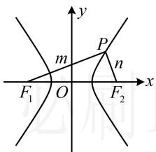
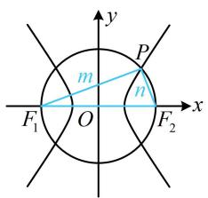
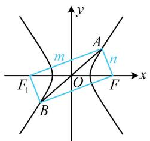
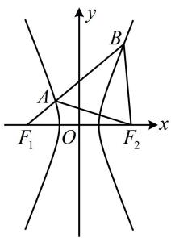
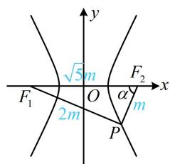
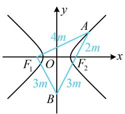
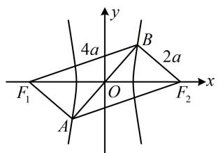
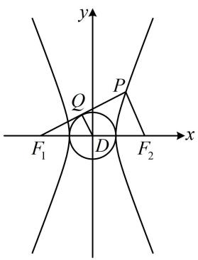
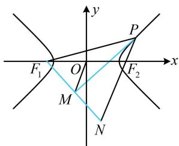
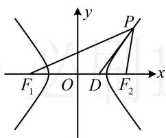

# 强化训练

##### 1. (2020·新课标III卷·★★☆)

设双曲线 $C: \frac{x^2}{a^2} - \frac{y^2}{b^2} = 1 (a > 0, b > 0)$ 的左、右焦点分别为 $F_1$ ， $F_2$ ，离心率为 $\sqrt{5}$ ， $P$ 是 $C$ 上一点， $F_1 P \perp F_2 P$ ，若 $\triangle PF_1 F_2$ 的面积为 4，则 $a = (\quad)$

$\quad$A. 1

$\quad$B. 2

$\quad$C. 4

$\quad$D. 8

##### 1. A

解析已知离心率，可将变量 a, b, c 统一起来，

$e = \frac{c}{a} = \sqrt{5}\Rightarrow c = \sqrt{5} a$ ，所以 $\left|F_1F_2\right| = 2c = 2\sqrt{5} a$ ，焦点三角形中涉及垂直关系，常用勾股定理翻译，并结合定义处理，

设 $\left|PF_{1}\right|=m,\quad\left|PF_{2}\right|=n$ ，如图，因为 $F_{1}P\perp F_{2}P$ ，

所以 $m^2 + n^2 = \left|F_1F_2\right|^2 = 20a^2$ ①,

由双曲线定义， $|m-n|=2a$ ②，

把①配方可得 $m^2 + n^2 = (m - n)^2 + 2mn = 20a^2$

结合式②可得 $4a^{2} + 2mn = 20a^{2}$ ，所以 $mn = 8a^2$

故 $S_{\triangle PF_1F_2} = \frac{1}{2} mn = 4a^2$ ，由题意， $S_{\triangle PF_1F_2} = 4$

所以 $4a^{2}=4$ ，故 a=1。

##### 2. (2022·江西九江三模·★★☆)

双曲线 $\frac{x^2}{t} -\frac{y^2}{1 - t} = 1(0 < t < 1)$ 的左、右焦点分别为 $F_{1}$ ， $F_{2}$ ， $P$ 为圆 $x^{2} + y^{2} = 1$ 与该双曲线的一个公共点，则 $\triangle PF_1F_2$ 的面积为（）

$\quad$A. $1 - t$

$\quad$B. $t$

$\quad$C. $2t - 1$

$\quad$D. 1

##### 2. A

解析由题意，双曲线的半焦距 $c = \sqrt{t + 1 - t} = 1$

所给圆即为以 $F_{1}F_{2}$ 为直径的圆，点 $P$ 在圆上隐含了 $PF_{1} \perp PF_{2}$ ，可用勾股定理结合双曲线定义来处理，

如图，设 $\left|PF_{1}\right|=m$ ， $\left|PF_{2}\right|=n$ ，

则 $m^2 + n^2 = \left|F_1F_2\right|^2 = 4c^2 = 4$ ①,

由双曲线定义， $|m-n|=2\sqrt{t}$ ②，

由①可得 $m^2 + n^2 = (m - n)^2 + 2mn = 4$ ，将②代入得

$4t + 2mn = 4$ ，所以 $mn = 2 - 2t$ ，故 $S_{\triangle PF_1F_2} = \frac{1}{2} mn = 1 - t$ .

# 3. (★★★)

已知双曲线 $C: \frac{x^2}{a^2} - \frac{y^2}{b^2} = 1 (a > 0, b > 0)$ 的右焦点为 $F$ ，直线 $y = kx (k \neq 0)$ 与双曲线 $C$ 交于 $A$ ， $B$ 两点，若 $\angle AFB = 90^\circ$ ，且 $\triangle OAF$ 的面积为 $4a^2$ ，则 $C$ 的离心率为（）

$\quad$A. $\frac{2\sqrt{6}}{5}$

$\quad$B. $\frac{\sqrt{26}}{5}$

$\quad$C. 2

$\quad$D. 3

##### 3. D

解析看到过原点的直线与双曲线交于 $A, B$ 两点，想到和两焦点构成平行四边形，

如图，设双曲线 $C$ 的左焦点为 $F_{1}$ ，则四边形 $AF_{1}BF$ 为平行四边形，又 $\angle AFB = 90^{\circ}$ ，所以四边形 $AF_{1}BF$ 为矩形，

故 $\angle F_{1}AF = 90^{\circ}$ ， $\triangle OAF$ 的面积可换算成 $\triangle AFF_{1}$ 的面积，于是结合双曲线的定义和勾股定理处理即可，

设 $\left|AF_{1}\right|=m,\quad\left|AF\right|=n$ ，则 $m^{2}+n^{2}=\left|F_{1}F_{2}\right|^{2}=4c^{2}$ ①，

由双曲线定义， $|m-n|=2a$ ②，

由①可得 $m^2 + n^2 = (m - n)^2 + 2mn = 4c^2$ ，将式②代入可得 $4a^2 + 2mn = 4c^2$ ，所以 $mn = 2c^2 - 2a^2$ ，

故 $S_{\triangle AFF_1} = \frac{1}{2} mn = c^2 - a^2$

由题意， $S_{\triangle OAF} = 4a^2$ ，所以 $S_{\triangle AFF_1} = 2S_{\triangle OAF} = 8a^2$

从而 $c^2 - a^2 = 8a^2$ ，故 $c^2 = 9a^2$

所以双曲线 $C$ 的离心率 $e = \frac{c}{a} = 3$ .

##### 4. (2022·河南模拟·★★★)

已知 $F_{1}$ , $F_{2}$ 分别是双曲线 $C: \frac{x^{2}}{a^{2}} - \frac{y^{2}}{b^{2}} = 1 (a > 0, b > 0)$ 的左、右焦点，过 $F_{1}$ 的直线与双曲线 $C$ 的左、右两支分别交于 $A$ , $B$ 两点，若 $\triangle ABF_{2}$ 是等边三角形，则 $C$ 的离心率是 \_\_\_\_.

##### 4. $\sqrt{7}$

解析涉及双曲线上的点和左、右焦点，优先考虑定义，

如图，由双曲线定义， $\left|BF_{1}\right|-\left|BF_{2}\right|=2a$ ①，

又 $\triangle ABF_{2}$ 是正三角形，所以 $\left|BF_2\right| = \left|AB\right|$

代入①得： $\left|BF_{1}\right|-\left|BF_{2}\right|=\left|BF_{1}\right|-\left|AB\right|=\left|AF_{1}\right|=2a$

因为点 $A$ 也在双曲线上，所以 $\left|AF_2\right| - \left|AF_1\right| = 2a$

故 $\left|AF_2\right| = \left|AF_1\right| + 2a = 4a$ ，正三角形除已知边长关系外，还知道角，故可在 $\triangle AF_1F_2$ 中由余弦定理建立方程求离心率，

由题意， $\angle BAF_{2} = 60^{\circ}$ ， $\angle F_{1}AF_{2} = 180^{\circ} - \angle BAF_{2} = 120^{\circ}$

在 $\triangle AF_{1}F_{2}$ 中，由余弦定理，

$\left| F _ {1} F _ {2} \right| ^ {2} = \left| A F _ {1} \right| ^ {2} + \left| A F _ {2} \right| ^ {2} - 2 \left| A F _ {1} \right| \cdot \left| A F _ {2} \right| \cdot \cos \angle F _ {1} A F _ {2},$

所以 $4c^{2} = 4a^{2} + 16a^{2} - 2 \times 2a \times 4a \times \cos 120^{\circ}$

整理得： $\frac{c^2}{a^2} = 7$ ，故离心率 $e = \frac{c}{a} = \sqrt{7}$

# 5. (2024·天津卷·★★★)

双曲线 $\frac{x^2}{a^2} -\frac{y^2}{b^2} = 1(a > 0,b > 0)$ 的左、右焦点分别为 $F_{1}$ ， $F_{2}$ ， $P$ 是双曲线右支上一点，且直线 $PF_{2}$ 的斜率为2， $\triangle PF_1F_2$ 是面积为8的直角三角形，则双曲线的方程为（）

$\quad$A. $\frac{x^2}{8} -\frac{y^2}{2} = 1$

$\quad$B. $\frac{x^2}{8} -\frac{y^2}{4} = 1$

$\quad$C. $\frac{x^2}{2} -\frac{y^2}{8} = 1$

$\quad$D. $\frac{x^2}{4} -\frac{y^2}{8} = 1$

##### 5. C

解析条件涉及 $PF_{2}$ 的斜率，怎样翻译？有 $\triangle PF_1F_2$ 为 Rt $\triangle$ ，当然到此三角形中研究边的关系，设直线 $PF_{2}$ 的倾斜角为 $\alpha$ ，则 $\angle PF_2F_1 = \alpha$ ，由题意， $k_{PF_2} = \tan \alpha = 2$ ，

又因为 $\triangle PF_{1}F_{2}$ 是直角三角形，且如图，

只能 $\angle F_{1}PF_{2} = 90^{\circ}$ ，所以 $\tan \alpha = \frac{|PF_1|}{|PF_2|}$ ，故 $\frac{|PF_1|}{|PF_2|} = 2$

设 $\left|PF_{2}\right|=m$ ，则 $\left|PF_{1}\right|=2m$ ， $\left|F_{1}F_{2}\right|=\sqrt{\left|PF_{1}\right|^{2}+\left|PF_{2}\right|^{2}}=\sqrt{5}m$ ，

还剩 $\triangle PF_{1}F_{2}$ 面积为8没翻译，由此可求出 $m$ ，得到 $\triangle PF_{1}F_{2}$ 的三边，

由题意， $S_{\triangle PF_1F_2} = \frac{1}{2}\bigl |PF_1\bigr |\cdot \bigl |PF_2\bigr | = \frac{1}{2}\cdot 2m\cdot m = m^2 = 8$

所以 $m = 2\sqrt{2}$ ，由双曲线定义， $\left|PF_1\right| - \left|PF_2\right| = 2a$

所以 $2m - m = 2a$ ，故 $a = \frac{m}{2} = \sqrt{2}$

又因为 $\left|F_{1}F_{2}\right|=2c=\sqrt{5}m$ ，所以 $c=\frac{\sqrt{5}}{2}m=\sqrt{10}$ ，

故 $b = \sqrt{c^2 - a^2} = 2\sqrt{2}$ ，所以双曲线的方程为 $\frac{x^2}{2} - \frac{y^2}{8} = 1$ 。

##### 6. (2023·新课标Ⅰ卷·★★★☆)

已知双曲线 $C: \frac{x^2}{a^2} - \frac{y^2}{b^2} = 1 (a > 0, b > 0)$ 的左、右焦点分别为 $F_1$ ， $F_2$ ，点 $A$ 在 $C$ 上，点 $B$ 在 $y$ 轴上， $\overrightarrow{F_1A} \perp \overrightarrow{F_1B}$ ， $\overrightarrow{F_2A} = -\frac{2}{3} \overrightarrow{F_2B}$ ，则 $C$ 的离心率为 \_\_\_\_.

##### 6. $\frac{3\sqrt{5}}{5}$

解析如图，条件中有 $\overrightarrow{F_2A} = -\frac{2}{3}\overrightarrow{F_2B}$ ，不妨设一段长度，看能否表示其余线段的长，

设 $\left|AF_2\right| = 2m$ ，因为 $\overrightarrow{F_2A} = -\frac{2}{3}\overrightarrow{F_2B}$ ，所以 $\left|BF_2\right| = 3m$

故 $\left|AB\right|=\left|AF_{2}\right|+\left|BF_{2}\right|=5m$ ，由对称性， $\left|BF_{1}\right|=\left|BF_{2}\right|=3m$ ，

又 $\overrightarrow{F_1A} \perp \overrightarrow{F_1B}$ ，所以 $\left|AF_1\right| = \sqrt{\left|AB\right|^2 - \left|BF_1\right|^2} = 4m$ ，

$\left|AF_{1}\right|$ 和 $\left|AF_{2}\right|$ 都有了，结合双曲线的定义可计算 $\triangle ABF_{1}$ 的各边，则可用“双余弦法”建立方程，

由图可知 $A$ 在双曲线 $C$ 的右支上，所以 $\left|AF_1\right| - \left|AF_2\right|$

$= 2m = 2a$ ，从而 $m = a$ ，故 $\left|BF_1\right| = \left|BF_2\right| = 3a$

又 $\left|F_{1}F_{2}\right|=2c$ ，所以在 $\triangle BF_{1}F_{2}$ 中，由余弦定理推论，

$\cos \angle F _ {1} B F _ {2} = \frac {\left| B F _ {1} \right| ^ {2} + \left| B F _ {2} \right| ^ {2} - \left| F _ {1} F _ {2} \right| ^ {2}}{2 \left| B F _ {1} \right| \cdot \left| B F _ {2} \right|} = \frac {9 a ^ {2} + 9 a ^ {2} - 4 c ^ {2}}{2 \times 3 a \times 3 a}$

$= \frac{9a^2 - 2c^2}{9a^2}$ ，在 $\triangle ABF_{1}$ 中， $\cos \angle ABF_{1} = \frac{|BF_{1}|}{|AB|} = \frac{3m}{5m} = \frac{3}{5},$

因为 $\angle ABF_{1} = \angle F_{1}BF_{2}$ ，所以 $\frac{9a^2 - 2c^2}{9a^2} = \frac{3}{5}$

故双曲线 C 的离心率 $e=\frac{c}{a}=\frac{3\sqrt{5}}{5}$ .

##### 7. (2024·九省联考·★★★☆)

设双曲线 $C: \frac{x^2}{a^2} - \frac{y^2}{b^2} = 1 (a > 0, b > 0)$ 的左、右焦点分别为 $F_1$ ， $F_2$ ，过坐标原点的直线与 $C$ 交于 $A$ ， $B$ 两点， $|F_1 B| = 2 |F_1 A|$ ， $\overrightarrow{F_2 A} \cdot \overrightarrow{F_2 B} = 4 a^2$ ，则 $C$ 的离心率为（）

$\quad$A. $\sqrt{2}$

$\quad$B. 2

$\quad$C. $\sqrt{5}$

$\quad$D. $\sqrt{7}$

##### 7. D

解析如图，由双曲线的对称性可知 $A$ ， $B$ 关于原点对称，即 $O$ 是线段 $AB$ 的中点，

又因为 $O$ 是 $F_{1}F_{2}$ 的中点，所以 $AF_{1}BF_{2}$ 是平行四边形，

故 $\left|F_{2}A\right|=\left|F_{1}B\right|$ ， $\left|F_{1}A\right|=\left|F_{2}B\right|$ ，

条件涉及 $\left|F_{1}B\right|$ ， $\left|F_{1}A\right|$ ，这是双曲线上的点到焦点的距离，想到结合双曲线定义，求出这些线段的长，

由题意， $\left|F_{1}B\right|=2\left|F_{1}A\right|$

结合 $\left|F_{1}A\right|=\left|F_{2}B\right|$ 可得 $\left|F_{1}B\right|=2\left|F_{2}B\right|$ ①,

由双曲线定义， $\left|F_{1}B\right|-\left|F_{2}B\right|=2a$ ，

与①联立可解得： $\left|F_{2}B\right|=2a,\quad\left|F_{1}B\right|=4a$

所以 $\left|F_{1}A\right|=\left|F_{2}B\right|=2a,\quad\left|F_{2}A\right|=\left|F_{1}B\right|=4a,$

注意到 $\left|F_{1}F_{2}\right|=2c$ ，所以 $\triangle F_{1}BF_{2}$ 三边都有了，若能求出它的一个内角，就能用余弦定理建立方程求离心率。剩下的条件 $\overrightarrow{F_{2}A}\cdot\overrightarrow{F_{2}B}=4a^{2}$ 刚好能与角联系起来，我们来翻译它，

由题意， $\overrightarrow{F_2A}\cdot \overrightarrow{F_2B} = 4a^2\Rightarrow \left|\overrightarrow{F_2A}\right|\cdot \left|\overrightarrow{F_2B}\right|\cdot \cos \angle BF_2A = 4a^2$

$\Rightarrow 4 a \cdot 2 a \cdot \cos \angle B F _ {2} A = 4 a ^ {2} \Rightarrow \cos \angle B F _ {2} A = \frac {1}{2},$

结合 $\angle BF_{2}A\in (0,\pi)$ 可得 $\angle BF_{2}A = \frac{\pi}{3}$

由 $AF_{1}BF_{2}$ 是平行四边形可得 $\angle F_{1}BF_{2} = \pi -\angle BF_{2}A = \frac{2\pi}{3}$

在 $\triangle F_{1}BF_{2}$ 中，由余弦定理，

$\left| F _ {1} F _ {2} \right| ^ {2} = \left| F _ {1} B \right| ^ {2} + \left| F _ {2} B \right| ^ {2} - 2 \left| F _ {1} B \right| \left| F _ {2} B \right| \cos \angle F _ {1} B F _ {2},$

所以 $4c^{2} = (4a)^{2} + (2a)^{2} - 2\cdot 4a\cdot 2a\cdot \cos \frac{2\pi}{3}$

化简得双曲线的离心率 $e = \frac{c}{a} = \sqrt{7}$ .

##### 8. (2023·辽宁模拟·★★★★)

双曲线 $C: \frac{x^2}{a^2} - \frac{y^2}{b^2} = 1 (a > 0, b > 0)$ 的左、右焦点分别为 $F_1(-c, 0)$ ， $F_2(c, 0)$ ，以 $C$ 的实轴为直径的圆记为 $D$ ，过 $F_1$ 作圆 $D$ 的切线与双曲线 $C$ 在第一象限交于点 $P$ ，且 $S_{\triangle PF_1F_2} = 4a^2$ ，则双曲线 $C$ 的离心率为（）

$\quad$A. $\sqrt{5}$

$\quad$B. $\frac{\sqrt{5} + 1}{2}$

$\quad$C. $\sqrt{5} - 1$

$\quad$D. $\sqrt{2}$

##### 8. A

解析如图，设 $PF_{1}$ 与圆 $D$ 相切于点 $Q$ ，则 $DQ \perp PF_{1}$

且 $|DQ|=a$ ， $|DF_{1}|=c$ ， $|QF_{1}|=\sqrt{|DF_{1}|^{2}-|DQ|^{2}}=b$ ，

$\left|F_{1}F_{2}\right| = 2c$ ，条件 $S_{\triangle PF_1F_2} = 4a^2$ 怎样翻译？注意到 $\sin \angle PF_1F_2$ 可放到 Rt△DQF₁ 中来求，故用 $\angle PF_1F_2$ 来计算 $S_{\triangle PF_1F_2}$

由图可知， $\sin \angle PF_1F_2 = \frac{|DQ|}{|DF_1|} = \frac{a}{c}$ ，所以 $S_{\triangle PF_1F_2} =$

$\frac {1}{2} \left| P F _ {1} \right| \cdot \left| F _ {1} F _ {2} \right| \cdot \sin \angle P F _ {1} F _ {2} = \frac {1}{2} \left| P F _ {1} \right| \cdot 2 c \cdot \frac {a}{c} = a \left| P F _ {1} \right|,$

又由题意， $S_{\triangle PF_1F_2} = 4a^2$ ，所以 $a\left|PF_1\right| = 4a^2$ ，故 $\left|PF_1\right| = 4a$

由双曲线定义， $\left|PF_{1}\right|-\left|PF_{2}\right|=2a$ ，

所以 $\left|PF_{2}\right|=\left|PF_{1}\right|-2a=2a$

注意到 $\left|PF_{2}\right|=2\left|DQ\right|$ ，于是联想到DQ是 $\triangle PF_{1}F_{2}$ 的中位线，故考虑由此继续分析几何关系，建立方程求离心率，

因为 $\left|PF_{2}\right|=2\left|DQ\right|$ ，且D是 $F_{1}F_{2}$ 的中点，所以 $DQ\parallel PF_{2}$ ，

结合 $DQ \perp PF_{1}$ 可得 $PF_{2} \perp PF_{1}$ ，所以在 $\triangle PF_{1}F_{2}$ 中，

$\left|PF_{1}\right|^{2}+\left|PF_{2}\right|^{2}=\left|F_{1}F_{2}\right|^{2}$ ，所以 $16a^{2}+4a^{2}=4c^{2}$ ，

化简得双曲线 $C$ 的离心率 $e = \frac{c}{a} = \sqrt{5}$

##### 9. (2023·浙江杭州二模·★★★★)

费马定理是几何光学中的一条重要原理，在数学中可以推导出圆锥曲线的一些光学性质。例如，点 $P$ 为双曲线（ $F_{1}$ ， $F_{2}$ 为焦点）上一点，点 $P$ 处的切线平分 $\angle F_{1}PF_{2}$ 。已知双曲线 $C: \frac{x^{2}}{4} - \frac{y^{2}}{2} = 1$ ， $O$ 为坐标原点， $l$ 是点 $P\left(3, \frac{\sqrt{10}}{2}\right)$ 处的切线，过左焦点 $F_{1}$ 作 $l$ 的垂线，垂足为 $M$ ，则 $|OM| =$ \_\_\_\_.

##### 9.2

解析如图，PM既是 $\angle F_{1}PF_{2}$ 的平分线，又是 $F_{1}N$ 的垂线，想到三线合一，可构造等腰三角形，延长 $F_{1}M$ 和 $PF_{2}$ 交于点N，由题意，PM平分 $\angle F_{1}PF_{2}$ ， $PM\perp F_{1}N$ ，

所以 $\left|PF_1\right| = \left|PN\right|$ ，且 $M$ 为 $F_{1}N$ 的中点，涉及中点，考虑中位线，结合 $O$ 为 $F_{1}F_{2}$ 的中点可得 $\left|OM\right| = \frac{1}{2}\left|F_2N\right|$

$= \frac {1}{2} (\left| P N \right| - \left| P F _ {2} \right|) = \frac {1}{2} (\left| P F _ {1} \right| - \left| P F _ {2} \right|) = \frac {1}{2} \times 2 a = a = 2.$

【反思】本题构造等腰三角形的方法眼熟吧？之前椭圆涉及角平分线的问题也用过类似的构造方法.

##### 10. (2022·山西大同月考·★★★★)

设 $F_{1}$ ， $F_{2}$ 是双曲线 $E:\frac{x^2}{a^2} -\frac{y^2}{b^2} = 1(a > 0,b > 0)$ 的左、右焦点，点 $P$ 在 $E$ 上，且 $\angle F_1PF_2$ 的平分线交 $x$ 轴于点 $D$ 若 $\angle F_1PF_2 = \frac{\pi}{3}$ ， $\left|PF_1\right| + \left|PF_2\right| = 8$ ，且 $\left|PD\right| = \sqrt{3}$ ，则 $E$ 的方程为（）

$\quad$A. $\frac{x^2}{2} -\frac{y^2}{8} = 1$

$\quad$B. $\frac{x^2}{8} -\frac{y^2}{2} = 1$

$\quad$C. $\frac{x^2}{6} -\frac{y^2}{4} = 1$

$\quad$D. $\frac{x^2}{4} -\frac{y^2}{6} = 1$

##### 10. B

解析如图，题干给出了 $\left|PF_{1}\right|+\left|PF_{2}\right|=8$ ，结合双曲线定义可求得 $\left|PF_{1}\right|$ 和 $\left|PF_{2}\right|$ ，

不妨设 $P$ 在右支，由题意， $\left\{ \begin{array}{l} \left|PF_1\right| + \left|PF_2\right| = 8\\ \left|PF_1\right| - \left|PF_2\right| = 2a \end{array} \right.$

所以 $\left|PF_1\right| = 4 + a$ ， $\left|PF_2\right| = 4 - a$ ，注意到 $\angle F_{1}PF_{2}$ 给了大小，可用小三角形面积和等于大三角形面积建立方程求 $a$

因为 $PD$ 是 $\angle F_{1}PF_{2}$ 的平分线，且 $\angle F_{1}PF_{2} = \frac{\pi}{3}$

所以 $\angle F_{1}PD = \angle F_{2}PD = \frac{\pi}{6}$ ，因为 $S_{\triangle PF_1D} + S_{\triangle PF_2D} = S_{\triangle PF_1F_2}$

所以 $\frac{1}{2}\big|PF_1\big|\cdot |PD|\cdot \sin \angle F_1PD + \frac{1}{2}\big|PF_2\big|\cdot |PD|\cdot \sin \angle F_2PD =$

$\frac {1}{2} \left| P F _ {1} \right| \cdot \left| P F _ {2} \right| \cdot \sin \angle F _ {1} P F _ {2},$

即 $\frac{1}{2} (4 + a)\cdot \sqrt{3}\cdot \sin \frac{\pi}{6} +\frac{1}{2} (4 - a)\cdot \sqrt{3}\cdot \sin \frac{\pi}{6} =$

$\frac{1}{2}(4+a)(4-a)\sin\frac{\pi}{3}$ ，解得： $a=2\sqrt{2}$ ，

再求 $b$ ，此时 $\triangle PF_{1}F_{2}$ 已知两边及夹角了，可先由余弦定理求 $\left|F_1F_2\right|$ ，从而得到 $c$ ，那么 $b$ 也就有了，

在 $\triangle PF_{1}F_{2}$ 中，由余弦定理，

$\left| F _ {1} F _ {2} \right| ^ {2} = \left| P F _ {1} \right| ^ {2} + \left| P F _ {2} \right| ^ {2} - 2 \left| P F _ {1} \right| \cdot \left| P F _ {2} \right| \cdot \cos \angle F _ {1} P F _ {2},$

所以 $4c^{2} = (4 + a)^{2} + (4 - a)^{2} - 2(4 + a)(4 - a)\cos 60^{\circ}$

$= 16 + 3a^{2} = 40$ ，从而 $c^2 = 10$ ，故 $b^{2} = c^{2} - a^{2} = 2$

所以双曲线 $E$ 的方程为 $\frac{x^2}{8} -\frac{y^2}{2} = 1$

【反思】本题对角平分线的翻译与上一题不一样，为什么？因为本题已知顶角，就可用解三角形中的等面积法构造方程，所以解析几何难题常与解三角形结合.

