# 第 3 节 双曲线渐近线相关问题（★★★）

# 内容提要

圆锥曲线中，渐近线是双曲线独有的几何性质，相关考题较多，本节将归纳一些常见题型.

##### 1. 借助渐近线分析直线与双曲线的交点个数:

①当直线 l 过原点时，若其斜率 $k \in \left(-\infty, -\frac{b}{a}\right] \cup \left[\frac{b}{a}, +\infty\right)$ ，则直线 l 与双曲线没有交点，如图 1；
若 $k \in \left(-\frac{b}{a}, \frac{b}{a}\right)$ ，则直线 l 与双曲线有两个关于原点对称的交点，如图 2.  
②当直线过双曲线内部定点 $P$ 时, 若其斜率 $k = \pm \frac{b}{a}$ , 即直线与渐近线平行, 则直线与双曲线有 1 个交点, 如图 3 中的 $l_{1}$ 和 $l_{2}$ ; 若 $k \in \left(-\frac{b}{a}, \frac{b}{a}\right)$ , 则直线与双曲线的两支各有 1 个交点, 如图 3 中的 $l$ ; 若 $k \in \left(-\infty, -\frac{b}{a}\right) \cup \left(\frac{b}{a}, +\infty\right)$ , 则直线与双曲线的同支有 2 个交点, 如图 4 中的 $l$ .  
③当直线过双曲线外部定点 $P$ （不与原点重合）时，分析交点个数还需借助切线，如图5， $l_{1}$ 和 $l_{4}$ 是与渐近线平行的直线， $l_{2}$ 和 $l_{3}$ 是双曲线的两条切线，我们让直线 $l$ 从 $l_{1}$ 出发绕点 $P$ 逆时针旋转，恰好为 $l_{1}$ 时，与双曲线有1个交点；转到 $l_{1}$ 和 $l_{2}$ 之间时，与双曲线在同支有2个交点；恰好为 $l_{2}$ 时，与双曲线有1个交点；在 $l_{2}$ 和 $l_{3}$ 之间时，没有交点；恰好为 $l_{3}$ 时，有1个交点；在 $l_{3}$ 和 $l_{4}$ 之间时，与双曲线在同支有2个交点；恰好为 $l_{4}$ 时，有1个交点；从 $l_{4}$ 继续转回 $l_{1}$ 的过程中，与双曲线在两支上各有1个交点.

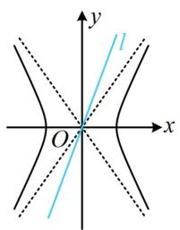

图1

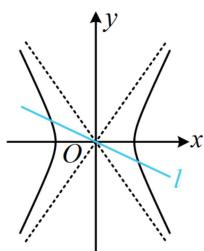

图2

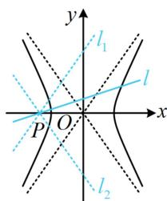

图3

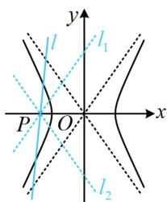

图4

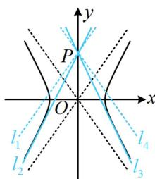

图5

##### 2. 渐近线的角度关系: 如图6, 双曲线的两条渐近线关于 $x$ 轴、 $y$ 轴对称, 所以图6中左右两个角相等, 设为 $\alpha$ , 中间两个角也相等, 设为 $\beta$ , 且 $\alpha + \beta = 90^{\circ}$ .

##### 3. 双曲线的两类特征三角形:

①如图7，设 $F$ 为双曲线 $\frac{x^2}{a^2} -\frac{y^2}{b^2} = 1(a > 0,b > 0)$ 的右焦点，过 $F$ 作一条渐近线的垂线，垂足为 $A$ ，则在 $\triangle AOF$ 中， $\vert AF\vert = b$ ， $\vert OA\vert = a$ ， $\vert OF\vert = c$ ，这个三角形有双曲线的全部特征参数，所以把$\triangle AOF$ 称为双曲线的“特征三角形”. 由对称性, 这样的特征三角形有 4 个. 由于点 $A$ 满足 $\left|OA\right| = a$ , 所以 $A$ 在圆 $x^{2} + y^{2} = a^{2}$ 上, 由 $OA \perp AF$ 可得 $AF$ 是该圆的切线, 若要求点 $A$ 的坐标, 可联立 $\left\{ \begin{array}{l} y = \frac{b}{a} x \\ x^{2} + y^{2} = a^{2} \end{array} \right.$ 求得 $\left\{ \begin{array}{l} x^{2} = \frac{a^{4}}{c^{2}} \\ y^{2} = \frac{a^{2}b^{2}}{c^{2}} \end{array} \right.$ , 所以图 7 中点 $A$ 的坐标为 $\left(\frac{a^{2}}{c}, \frac{ab}{c}\right)$ .

②如图8， $A$ 为双曲线的右顶点，过 $A$ 作 $x$ 轴的垂线交一条渐近线于点 $B$ ，则在 $\triangle AOB$ 中， $|OA| = a$ ， $|AB| = b$ ， $|OB| = c$ ，这个三角形也有双曲线的全部特征，所以把 $\triangle AOB$ 称为双曲线的“特征三角形”，由对称性，这样的特征三角形有4个.

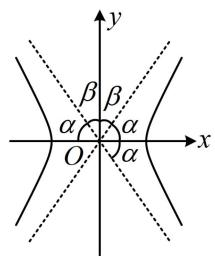

图6

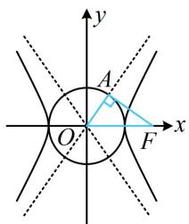

图7

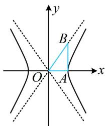

图8

# 类型 I：借助渐近线进行图形分析

【例 1】(2022·全国甲卷) 记双曲线 $C: \frac{x^2}{a^2} - \frac{y^2}{b^2} = 1 (a > 0, b > 0)$ 的离心率为 $e$ ，写出满足条件“直线 $y = 2x$ 与 $C$ 无公共点”的 $e$ 的一个值 \_\_\_\_.

解析过原点的直线与双曲线没有交点的临界状态是渐近线，故可画图，比较斜率，

如图，直线 $y = 2x$ 与 $C$ 无公共点 $\Leftrightarrow \frac{b}{a} \leq 2 \Leftrightarrow b \leq 2a \Leftrightarrow b^2 \leq 4a^2$

$\Leftrightarrow c^{2} - a^{2}\leq 4a^{2}\Leftrightarrow \frac{c^{2}}{a^{2}}\leq 5$ ，结合 $e > 1$ 可得 $1 <   e = \frac{c}{a}\leq \sqrt{5}$

答案: 2 (答案不唯一, 满足 $1 < e \leq \sqrt{5}$ 的 $e$ 值均可)

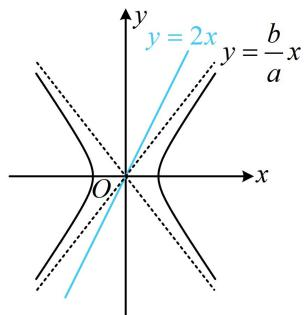

##### 【变式】双曲线 $C: \frac{x^2}{a^2} - \frac{y^2}{b^2} = 1 (a > 0, b > 0)$ 的焦距为 $2c$ ， $F_1$ ， $F_2$ 为其左、右两个焦点，直线 $l$ 经过点 $(0, b)$ 且斜率为 1，若 $l$ 上存在点 $P$ 满足 $\left|PF_1\right| - \left|PF_2\right| = 2b$ ，则 $C$ 的离心率的取值范围为（）

$\quad$A. $(1, \sqrt{2})$

$\quad$B. $(\sqrt{2},\sqrt{3})$

$\quad$C. $(1, \sqrt{3})$

$\quad$D. $(\sqrt{2}, + \infty)$

解析看到 $\left|PF_{1}\right|-\left|PF_{2}\right|=2b$ ，联想到点P在某双曲线（不是双曲线C）上，该双曲线的焦点也是 $F_{1}$ ， $F_{2}$ ，但距离之差是定值2b，相当于和原双曲线C相比，c不变，把a和b交换即可，

由题意，满足 $\left|PF_{1}\right|-\left|PF_{2}\right|=2b$ 的点P在双曲线 $\frac{x^{2}}{b^{2}}-\frac{y^{2}}{a^{2}}=1$ 的右支上，所以直线l与该双曲线右支有交点，涉及直线与双曲线的交点问题，可借助渐近线来分析，

如图，则直线 $l$ 的斜率是1，双曲线 $\frac{x^2}{b^2} -\frac{y^2}{a^2} = 1$ 渐近线是 $y = \pm \frac{a}{b} x$

由图可知要使 $l$ 与该双曲线右支有交点，只需 $1 < \frac{a}{b}$ ，所以 $a > b$

从而 $a^2 > b^2 = c^2 - a^2$ ，故 $\frac{c^2}{a^2} < 2$ ，所以 $e < \sqrt{2}$ ，又 $e > 1$ ，所以 $1 < e < \sqrt{2}$ 。

答案: A

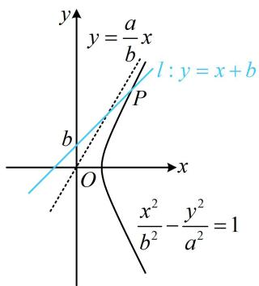

【反思】从上面两道题可以看出，涉及直线与双曲线的交点个数问题，常借助渐近线来分析临界状态.

【例 2】已知双曲线 $C: \frac{y^{2}}{a^{2}} - \frac{x^{2}}{b^{2}} = 1 (a > 0, b > 0)$ ，若直线 x = -b 与 C 的两条渐近线分别交于 A，B 两点，O 为原点，且 $\overrightarrow{OA}$ 与 $\overrightarrow{OB}$ 的夹角为 $60^{\circ}$ ，则 C 的离心率为（）

$\quad$A. 2 
$\quad$B. $\frac{3}{2}$ 
$\quad$C. $\sqrt{3}$ 
$\quad$D. $\frac{2\sqrt{3}}{3}$

解析如图，由所给向量的夹角可求得渐近线的倾斜角，进而求出斜率，

由题意， $\angle AOB = 60^{\circ}$ ，设直线 $AB$ 与 $x$ 轴交于点 $D$ ， $E$ 为渐近线上第一象限的一点，则 $\angle BOD = 30^{\circ}$

所以 $\angle E O x = \angle B O D = 30^{\circ}$ ，故渐近线 $BE$ 的倾斜角为 $30^{\circ}$

其斜率 $\frac{a}{b} = \tan 30^{\circ} = \frac{\sqrt{3}}{3}$ ，所以 $b = \sqrt{3} a$ ，从而 $b^{2} = c^{2} - a^{2} = 3a^{2}$ ，

整理得： $\frac{c^2}{a^2} = 4$ ，故离心率 $e = \frac{c}{a} = 2$

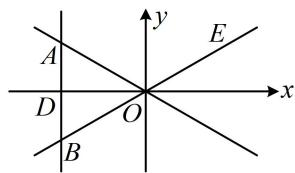

答案: A

【变式 1】已知双曲线 $C: \frac{x^{2}}{a^{2}} - \frac{y^{2}}{b^{2}} = 1 (a > 0, b > 0)$ 的左、右焦点分别为 $F_{1}, F_{2}$ , 以线段 $F_{1}F_{2}$ 为直径的圆与 $y$ 轴的正半轴交于点 $B$ , 连接 $F_{1}B, F_{2}B$ 分别交双曲线的渐近线于点 $E, F$ , 若四边形 OFBE 为平行四边形, 则 $C$ 的离心率为 \_\_\_\_.

解析如图，图形比较规则，要求离心率，可尝试先从几何关系分析渐近线的夹角，

由题意，四边形OFBE为平行四边形，又 $F_{1}F_{2}$ 是圆的直径，所以 $BF_{1}\bot BF_{2}$ ，从而四边形OFBE为矩形，

故 $\angle EOF = 90^{\circ}$ ，结合两条渐近线关于 $y$ 轴对称知 $\angle FOB = 45^{\circ}$

所以 $\angle FOF_{2} = 45^{\circ}$ ，从而渐近线 $OF$ 的斜率 $\frac{b}{a} = \tan 45^{\circ} = 1$ ，故 $a = b$

所以 $a^2 = b^2 = c^2 - a^2$ ，整理得： $\frac{c^2}{a^2} = 2$ ，故 $e = \frac{c}{a} = \sqrt{2}$ 。

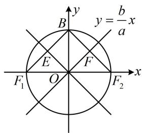

答案: $\sqrt{2}$

【反思】①双曲线的两条渐近线分别关于 $x$ 轴、 $y$ 轴对称，由此可得到一些特殊的角度相等关系，这也是渐近线最基础的几何性质；②两渐近线夹角为 $90^{\circ}$ 的双曲线是等轴双曲线，其离心率为 $\sqrt{2}$ .

##### 【变式2】(2022·上海卷)已知 $P_{1}(x_{1},y_{1})$ ， $P_{2}(x_{2},y_{2})$ 两点均在双曲线 $\Gamma: \frac{x^{2}}{a^{2}} - y^{2} = 1 (a > 0)$ 的右支上，若 $x_{1}x_{2} + y_{1}y_{2} > 0$ 恒成立，则 $a$ 的取值范围是 \_\_\_\_.

解析看到 $x_{1}x_{2} + y_{1}y_{2}$ ，想到向量的数量积，由题意， $\overrightarrow{OP_1} = (x_1,y_1)$ ， $\overrightarrow{OP_2} = (x_2,y_2)$

且 $\overrightarrow{OP_1} \cdot \overrightarrow{OP_2} = x_1x_2 + y_1y_2 > 0$ ，所以 $\angle P_1OP_2$ 为锐角，

如图，只需 $\angle AOB\leq 90^{\circ}$ 即可，所以 $\angle AOx\leq 45^{\circ}$

故渐近线 $OA$ 的斜率 $\frac{1}{a} \leq \tan 45^{\circ} = 1$ ，结合 $a > 0$ 可得 $a \geq 1$ .

答案: $[1, +\infty)$

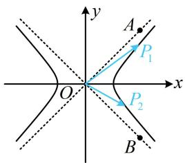

【反思】可以发现，本题我们又用到了通过判断数量积的正负来分析角度的锐钝这一方法.

【例 3】已知 F 是双曲线 $C: \frac{x^{2}}{a^{2}} - \frac{y^{2}}{b^{2}} = 1 (a > 0, b > 0)$ 的右焦点，点 A 是 C 的左顶点，O 为原点，过 F 作 C 的一条渐近线的垂线，垂足为 P，若 $\angle PAF = 30^{\circ}$ ，则 C 的离心率为 \_\_\_\_.

解析条件涉及渐近线，先考虑通过几何关系分析渐近线的倾斜角，

如图，渐近线为 $y = \frac{b}{a} x$ ，即 $bx - ay = 0$ ，右焦点 $F(c,0)$ 到渐近线的距离 $|PF| = \frac{|bc|}{\sqrt{b^2 + (-a)^2}} = \frac{|bc|}{c} = b$ ，

又 $\left|OF\right|=c$ ，所以 $\left|OP\right|=\sqrt{\left|OF\right|^{2}-\left|PF\right|^{2}}=\sqrt{c^{2}-b^{2}}=a$ ，因为 $\left|OA\right|=a$ ，所以 $\left|OP\right|=\left|OA\right|$

从而 $\angle APO = \angle PAO = 30^{\circ}$ ，故 $\angle POF = \angle PAO + \angle APO = 60^{\circ}$

有了渐近线的倾斜角，可求其斜率，再转换成离心率即可，

所以渐近线 $OP$ 的斜率 $\frac{b}{a} = \tan 60^{\circ} = \sqrt{3}$ ，从而 $b = \sqrt{3} a$ ，故 $b^{2} = c^{2} - a^{2} = 3a^{2}$ ，

整理得： $\frac{c^2}{a^2} = 4$ ，所以 $C$ 的离心率 $e = \frac{c}{a} = 2$

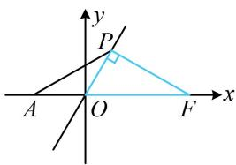

答案: 2

【反思】上图中的 $\triangle POF$ 的三边长分别为 $a, b, c$ ，我们把它叫做双曲线的一个“特征三角形”，在后续的某些题目中，熟悉这一结论，可以迅速发现图形中的一些几何关系.

##### 【变式1】(2019·新课标Ⅰ卷)已知双曲线 $C: \frac{x^2}{a^2} - \frac{y^2}{b^2} = 1 (a > 0, b > 0)$ 的左、右焦点分别为 $F_1$ ， $F_2$ ，过 $F_1$ 的直线与 $C$ 的两条渐近线分别交于 $A$ ， $B$ 两点，若 $\overrightarrow{F_1A} = \overrightarrow{AB}$ ， $\overrightarrow{F_1B} \cdot \overrightarrow{F_2B} = 0$ ，则 $C$ 的离心率为 \_\_\_\_.

【解法1】条件中有向量的数量积，可考虑设坐标来算，如图，点 $B$ 在渐近线 $y = \frac{b}{a} x$ 上，

可设 $B\left(x_0, \frac{b}{a} x_0\right)$ ， $F_1(-c, 0)$ ， $F_2(c, 0)$ ，则 $\overrightarrow{F_1B} = \left(x_0 + c, \frac{b}{a} x_0\right)$ ， $\overrightarrow{F_2B} = \left(x_0 - c, \frac{b}{a} x_0\right)$ ，

所以 $\overrightarrow{F_1B} \cdot \overrightarrow{F_2B} = (x_0 + c)(x_0 - c) + \frac{b^2}{a^2} x_0^2 = \left(1 + \frac{b^2}{a^2}\right)x_0^2 - c^2 = \frac{c^2}{a^2} x_0^2 - c^2 = 0$ ，解得： $x_0 = a$ 或 $-a$ （舍去），故 $B(a, b)$ ，求得了 $B$ ，可由 $\overrightarrow{F_1A} = \overrightarrow{AB}$ 求 $A$ 的坐标，代入另一渐近线 $y = -\frac{b}{a} x$ 即可建立方程求离心率，

由 $\overrightarrow{F_1A} = \overrightarrow{AB}$ 知 $A$ 为 $F_{1}B$ 中点，所以 $A\left(\frac{a - c}{2},\frac{b}{2}\right)$ ，代入 $y = -\frac{b}{a} x$ 得： $\frac{b}{2} = -\frac{b}{a} \cdot \frac{a - c}{2}$ ，整理得离心率 $e = \frac{c}{a} = 2$ 。

【解法2】所给的数量积恰好为0，可翻译为垂直，于是也可尝试分析几何特征，找渐近线的倾斜角，

如图，由 $\overrightarrow{F_1B} \cdot \overrightarrow{F_2B} = 0$ 知 $BF_{1} \perp BF_{2}$ ，又 $O$ 为 $F_{1}F_{2}$ 中点，所以 $\left|OB\right| = \frac{1}{2}\left|F_{1}F_{2}\right| = \left|OF_{1}\right|$ ，

由 $\overrightarrow{F_1A} = \overrightarrow{AB}$ 知 $A$ 为 $F_{1}B$ 中点，故 $\angle AOB = \angle AOF_{1}$ ，（原因：等腰三角形底边中线也是顶角的平分线）

又由渐近线的对称性， $\angle AOF_{1} = \angle BOF_{2}$ ，所以 $\angle AOB = \angle AOF_{1} = \angle BOF_{2} = 60^{\circ}$

从而渐近线 $OB$ 的斜率 $\frac{b}{a} = \tan \angle BOF_{2} = \tan 60^{\circ} = \sqrt{3}$ ，故 $b = \sqrt{3} a$

所以 $b^{2} = 3a^{2}$ ，从而 $c^2 - a^2 = 3a^2$ ，故 $e = \frac{c}{a} = 2$

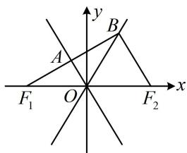

答案2

##### 【变式2】已知双曲线 $E: \frac{x^2}{a^2} - \frac{y^2}{b^2} = 1 (a > 0, b > 0)$ 的左、右焦点分别为 $F_1$ ， $F_2$ ，圆 $O: x^2 + y^2 = a^2$ 与 $E$ 的一条渐近线的一个交点为 $M$ ，若 $\left|MF_2\right| = \frac{\sqrt{2}}{2}\left|F_1F_2\right|$ ，则 $E$ 的离心率为（）

$\quad$A. $\sqrt{2}$ 
$\quad$B. $\sqrt{3}$ 
$\quad$C. $\sqrt{5}$ 
$\quad$D. $\sqrt{6}$

解析由对称性，不妨设 $M$ 在 $x$ 轴上方，有如图1和图2所示的两种情况，应先判断是哪种，

若为图1，则 $\triangle MOF_{2}$ 是双曲线的一个特征三角形，所以 $\left|MF_2\right| = b < \frac{\sqrt{2}}{2}\left|F_1F_2\right| = \sqrt{2} c$ ，不合题意；

若为图2，则 $\triangle MOF_{1}$ 是双曲线的一个特征三角形，

可抓住 $\angle MOF_{1}$ 和 $\angle MOF_{2}$ 互补，用双余弦法建立方程求离心率，

在 $\triangle MOF_{1}$ 中， $|OM| = a$ ， $|OF_{1}| = c$ ，且 $OM \perp MF_{1}$ ，所以 $\cos \angle MOF_{1} = \frac{a}{c}$ ，

在 $\triangle MOF_{2}$ 中， $|MF_{2}| = \frac{\sqrt{2}}{2} |F_{1}F_{2}| = \sqrt{2} c$ ， $|OF_{2}| = c$

所以 $\cos \angle MOF_{2} = \frac{\left|OM\right|^{2} + \left|OF_{2}\right|^{2} - \left|MF_{2}\right|^{2}}{2\left|OM\right|\cdot\left|OF_{2}\right|} = \frac{a^{2} - c^{2}}{2ac}$

由图可知 $\angle MOF_{1} = \pi -\angle MOF_{2}$

所以 $\cos \angle MOF_{1} = \cos (\pi -\angle MOF_{2}) = -\cos \angle MOF_{2}$

故 $\frac{a}{c} = -\frac{a^2 - c^2}{2ac}$ ，整理得离心率 $e = \frac{c}{a} = \sqrt{3}$

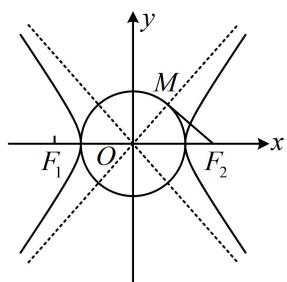

图1

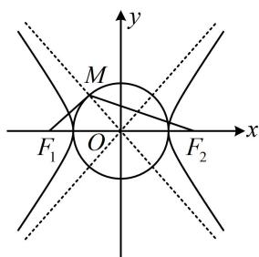

图2

答案: B

##### 【变式3】已知双曲线 $C: \frac{x^2}{a^2} - \frac{y^2}{b^2} = 1 (a > 0, b > 0)$ 的左焦点为 $F$ ，右顶点为 $A$ ，点 $B$ 在 $C$ 的一条渐近线上，且 $FB \perp BO$ ， $O$ 为原点，直线 $FB$ 与 $y$ 轴交于点 $D$ ，若直线 $AB$ 过线段 $OD$ 的中点，则 $C$ 的离心率为（）

$\quad$A. $\sqrt{2}$ 
$\quad$B. $\sqrt{3}$ 
$\quad$C. 2 
$\quad$D. $\sqrt{5}$

解析: 如图, 直线 $AB$ 过 $OD$ 中点 $I$ 怎样翻译? 可翻译成 $k_{AI} = k_{AB}$ , 故需要 $I, B$ 的坐标. 观察发现 $\triangle FBO$ 是双曲线的一个特征三角形, 容易通过几何关系求得点 $B$ 和 $D$ 的坐标, $I$ 的坐标也就有了,

由题意， $|FB| = b$ ， $|OB| = a$ ， $|OF| = c$ ，设 $\angle BFO = \theta$ ，则 $\angle BOE = 90^{\circ} - \theta$ ，作 $BE\bot x$ 轴于点 $E$

$\left| B E \right| = \left| F B \right| \sin \theta = \left| F B \right| \cdot \frac {\left| O B \right|}{\left| O F \right|} = \frac {a b}{c}, \quad \left| O E \right| = \left| O B \right| \cos \angle B O E = a \cos (9 0 ^ {\circ} - \theta) = a \sin \theta = a \cdot \frac {\left| O B \right|}{\left| O F \right|} = \frac {a ^ {2}}{c},$

所以 $B\left(-\frac{a^2}{c}, \frac{ab}{c}\right)$ ，又 $\left|OD\right| = \left|OF\right|\tan \theta = \left|OF\right| \cdot \frac{\left|OB\right|}{\left|FB\right|} = \frac{ac}{b}$ ，所以 $D\left(0, \frac{ac}{b}\right)$ ，故 $OD$ 中点为 $I\left(0, \frac{ac}{2b}\right)$ ，

接下来按 $k_{AI} = k_{AB}$ 翻译直线 $AB$ 过点 $I$ , 从而建立方程求离心率,

由题意， $A(a,0)$ ，且 $A$ ， $I$ ， $B$ 三点共线，所以 $k_{AI} = k_{AB}$

故 $\frac{\frac{ac}{2b} - 0}{0 - a} = \frac{\frac{ab}{c} - 0}{-\frac{a^2}{c} - a}$ ，整理得： $ac + c^2 = 2b^2$

所以 $ac + c^2 = 2c^2 - 2a^2$ ，故 $c^2 - ac - 2a^2 = 0$

两端同除以 $a^2$ 可得 $e^2 - e - 2 = 0$ ，解得： $e = 2$ 或 $-1$ （舍去）.

答案: C

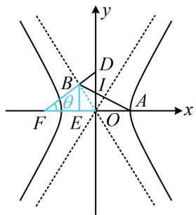

【总结】由例 3 及其变式可发现，渐近线问题中对于几何条件的翻译和做法，与前面小节大同小异.

# 类型 II：渐近线相关的综合运算

【例 4】已知双曲线 $\frac{x^{2}}{a^{2}} - \frac{y^{2}}{b^{2}} = 1 (a > 0, b > 0)$ 的左焦点为 F，过 F 且与 x 轴垂直的直线 l 与双曲线交于 A，B 两点，交双曲线的渐近线于 C，D 两点， $|CD| = \sqrt{2}|AB|$ ，则双曲线的离心率为 \_\_\_\_.

解析翻译 $|CD|=\sqrt{2}|AB|$ 需要 $|AB|$ 和 $|CD|$ ，求 $|AB|$ 可用通径公式，而 $|CD|$ 可通过求C，D的坐标来算，由通径公式， $|AB|=\frac{2b^{2}}{a}$ ，由题意，直线l的方程为x=-c，代入 $y=-\frac{b}{a}x$ 解得： $y=\frac{bc}{a}$ ，

如图， $y_{C}=\frac{bc}{a}$ ，由对称性可知， $y_{D}=-\frac{bc}{a}$ ，所以 $\left|CD\right|=\frac{2bc}{a}$ ，

因为 $\left|CD\right|=\sqrt{2}\left|AB\right|$ ，所以 $\frac{2bc}{a}=\sqrt{2}\cdot\frac{2b^{2}}{a}$ ，从而 $c=\sqrt{2}b$ ，

故 $c^2 = 2b^2 = 2c^2 - 2a^2$ ，整理得： $\frac{c^2}{a^2} = 2$ ，所以双曲线的离心率 $e = \frac{c}{a} = \sqrt{2}$ 。

答案: $\sqrt{2}$

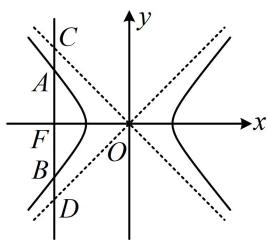

【例 5】(2022·浙江卷) 已知双曲线 $\frac{x^{2}}{a^{2}} - \frac{y^{2}}{b^{2}} = 1 (a > 0, b > 0)$ 的左焦点为 F，过 F 且斜率为 $\frac{b}{4a}$ 的直线交双曲线于点 $A(x_{1}, y_{1})$ ，交双曲线的渐近线于点 $B(x_{2}, y_{2})$ ，且 $x_{1} < 0 < x_{2}$ ，若 $|FB| = 3 |FA|$ ，则双曲线的离心率是 \_\_\_\_.

解析如图，点 $B$ 的坐标可通过联立直线 $AB$ 和渐近线的方程来求，先求该坐标，

由题意， $F(-c,0)$ ，直线 $AB$ 的方程为 $y = \frac{b}{4a} (x + c)$ ，联立 $\left\{ \begin{array}{l} y = \frac{b}{4a} (x + c) \\ y = \frac{b}{a} x \end{array} \right.$ 解得： $\left\{ \begin{array}{l} x = \frac{c}{3} \\ y = \frac{bc}{3a} \end{array} \right.$ ，所以 $B\left(\frac{c}{3},\frac{bc}{3a}\right)$ ，

题干给出 $|FB|=3|FA|$ ，可由此构造相似三角形求得A的坐标，代入双曲线即可建立方程求离心率，

作 $AD \perp x$ 轴于 $D$ ， $BE \perp x$ 轴于 $E$ ，则 $\triangle FAD \sim \triangle FBE$ ，且 $E\left(\frac{c}{3}, 0\right)$ ， $|EF| = \frac{4c}{3}$ ， $|BE| = \frac{bc}{3a}$ ，

因为 $|FB|=3|FA|$ ，所以 $\frac{|FD|}{|EF|}=\frac{|AD|}{|BE|}=\frac{1}{3}$ ，故 $|FD|=\frac{1}{3}|EF|=\frac{4c}{9}$ ，

$\left|OD\right| = \left|OF\right| - \left|FD\right| = \frac{5c}{9},\quad \left|AD\right| = \frac{1}{3}\left|BE\right| = \frac{bc}{9a},$ 所以 $A\left(-\frac{5c}{9},\frac{bc}{9a}\right),$

代入 $\frac{x^2}{a^2} -\frac{y^2}{b^2} = 1$ 得 $\frac{25c^2}{81a^2} -\frac{b^2c^2}{81a^2b^2} = 1$ ，整理得： $\frac{c^2}{a^2} = \frac{27}{8}$ ，故离心率 $e = \frac{c}{a} = \frac{3\sqrt{6}}{4}$

答案 $\frac{3\sqrt{6}}{4}$

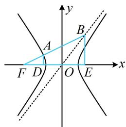

【总结】从上面两道题可以看出，渐近线有关问题，若不便从几何角度分析，也可用其方程参与运算，按代数的方法来求解问题，但这样做计算量往往更大一些，为次选方案.

# 强化训练

##### 1. (2022·江苏南京模拟·★★)

已知双曲线 $C: \frac{x^2}{a^2} - \frac{y^2}{b^2} = 1 (a > 0, b > 0)$ 的两条渐近线的夹角为 $\frac{\pi}{3}$ ，则此双曲线的离心率为 \_\_\_\_.

##### 2. (2024·广东惠州一模·★★)

已知双曲线 $\frac{x^2}{a^2} -\frac{y^2}{b^2} = 1(a > 0,b > 0)$ 的渐近线与圆 $x^{2} + y^{2} - 4y + 3 = 0$ 相切，则该双曲线的离心率为

##### 3. (2023·福建厦门四模·★★)

写出同时满足下列条件的一条直线 l 的方程 \_\_\_\_.

①直线 l 在 y 轴上的截距为 1;

②直线 l 与双曲线 $\frac{x^{2}}{4}-y^{2}=1$ 只有一个公共点.

##### 4. (2022·天津卷·★★)

已知抛物线 $y^{2} = 4\sqrt{5} x$ ， $F_{1}$ ， $F_{2}$ 分别是双曲线 $\frac{x^2}{a^2} - \frac{y^2}{b^2} = 1 (a > 0, b > 0)$ 的左、右焦点，抛物线的准线过双曲线的左焦点 $F_{1}$ ，与双曲线的一条渐近线交于点 $A$ ，若 $\angle F_{1}F_{2}A = \frac{\pi}{4}$ ，则双曲线的标准方程为（）

$\quad$A. $\frac{x^2}{10} - y^2 = 1$

$\quad$B. $x^{2} - \frac{y^{2}}{16} = 1$

$\quad$C. $x^{2} - \frac{y^{2}}{4} = 1$

$\quad$D. $\frac{x^2}{4} - y^2 = 1$

##### 5. (2020·新课标II卷·★★★)

设 O 为坐标原点, 直线 x = a 与双曲线 $C: \frac{x^{2}}{a^{2}} - \frac{y^{2}}{b^{2}} = 1 (a > 0, b > 0)$ 的两条渐近线分别交于 D, E 两点, 若 $\triangle ODE$ 的面积为 8, 则 C 的焦距的最小值为（）

$\quad$A. 4

$\quad$B. 8

$\quad$C. 16

$\quad$D. 32

##### 6. (2018·天津卷·★★★)

已知双曲线 $\frac{x^2}{a^2} -\frac{y^2}{b^2} = 1(a > 0,b > 0)$ 的离心率为2，过右焦点且垂直于 $x$ 轴的直线与双曲线交于 $A$ ， $B$ 两点.设 $A$ ， $B$ 到双曲线的同一条渐近线的距离分别为 $d_{1}$ 和 $d_{2}$ ，且 $d_{1} + d_{2} = 6$ ，则双曲线的方程为（）

$\quad$A. $\frac{x^2}{4} -\frac{y^2}{12} = 1$

$\quad$B. $\frac{x^2}{12} -\frac{y^2}{4} = 1$

$\quad$C. $\frac{x^2}{3} -\frac{y^2}{9} = 1$

$\quad$D. $\frac{x^2}{9} -\frac{y^2}{3} = 1$

##### 7. (★★★)

双曲线 $C: \frac{x^2}{a^2} - \frac{y^2}{b^2} = 1 (a > 0, b > 0)$ 的右焦点为 $F$ ，过 $F$ 作一条渐近线的垂线 $l$ ，垂足为 $M$ ，若 $l$ 与另一条渐近线的交点是 $N$ ，且 $\overrightarrow{MN} = 5\overrightarrow{MF}$ ，则 $C$ 的离心率为 \_\_\_\_.

##### 8. (2024·河北五校联考·★★★)

已知点 $P$ 是双曲线 $C: \frac{x^2}{a^2} - \frac{y^2}{b^2} = 1 (a > 0, b > 0)$ 左支上一点， $F_1$ ， $F_2$ 是双曲线的左、右两个焦点，且 $PF_1 \perp PF_2$ ， $PF_2$ 与两条渐近线相交与 $M$ ， $N$ 两点（如图），点 $N$ 恰好平分线段 $PF_2$ ，则双曲线的离心率是 \_\_\_\_.

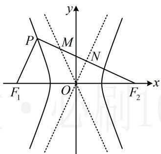

##### 9. (2023·福建福州一模·★★★)

设双曲线 $C: \frac{x^2}{a^2} - \frac{y^2}{b^2} = 1 (a > 0, b > 0)$ 的左焦点为 $F$ ，两条渐近线分别为 $l_1$ ， $l_2$ 。点 $A$ 在 $l_1$ 上，点 $B$ 在 $l_2$ 上，且点 $A$ 位于第一象限，原点 $O$ 与 $B$ 关于直线 $AF$ 对称。若 $|AF| = 2b$ ，则 $C$ 的离心率为 \_\_\_\_.

##### 10. (2025·全国Ⅱ卷·★★★☆)(多选)

双曲线 $C: \frac{x^2}{a^2} - \frac{y^2}{b^2} = 1 (a > 0, b > 0)$ 的左、右焦点分别是 $F_1$ ， $F_2$ ，左、右顶点分别为 $A_1$ ， $A_2$ ，以 $F_1F_2$ 为直径的圆与曲线 $C$ 的一条渐近线交于 $M$ ， $N$ 两点，且 $\angle NA_1M = \frac{5\pi}{6}$ ，则（）

$\quad$A. $\angle A_{1}MA_{2} = \frac{\pi}{6}$   
$\quad$B. $\left|MA_{1}\right|=2\left|MA_{2}\right|$   
$\quad$C. $C$ 的离心率为 $\sqrt{13}$   
$\quad$D. 当 $a = \sqrt{2}$ 时，四边形 $NA_{1}MA_{2}$ 的面积为 $8\sqrt{3}$

##### 11. (2022·江西赣州模拟·★★★★)

设直线 $y = 2x + t (t \neq 0)$ 与双曲线 $\frac{x^2}{a^2} - \frac{y^2}{b^2} = 1 (a > 0, b > 0)$ 的两条渐近线交于 $A$ ， $B$ 两点，若点 $P(4t, 0)$ 满足 $|PA| = |PB|$ ，则该双曲线的渐近线的方程是（）

$\quad$A. $y = \pm 3x$

$\quad$B. $y = \pm \sqrt{3} x$

$\quad$C. $y = \pm \frac{1}{3} x$

$\quad$D. $y = \pm \frac{1}{9} x$

