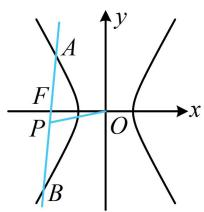
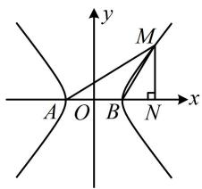
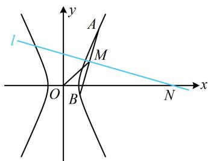
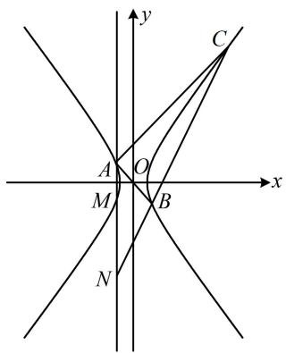

# 强化训练

##### 1. (2024·江苏南通模拟·★)

已知 $F_{1}$ , $F_{2}$ 是双曲线 $E: \frac{x^{2}}{9} - \frac{y^{2}}{16} = 1$ 的两个焦点, 点 $M$ 在 $E$ 上, 如果 $\overrightarrow{MF_{1}} \perp \overrightarrow{MF_{2}}$ , 则 $\triangle MF_{1}F_{2}$ 的面积为 \_\_\_\_.

##### 1. 16

解析 $\overrightarrow{MF_1} \perp \overrightarrow{MF_2}$ 意味着 $\angle F_{1}MF_{2} = 90^{\circ}$ ，已知 $\angle F_{1}MF_{2}$ ，可直接代焦点三角形面积公式求 $\triangle MF_{1}F_{2}$ 的面积，

因为 $\overrightarrow{MF_1} \perp \overrightarrow{MF_2}$ ，所以 $\theta = \angle F_1MF_2 = 90^\circ$ ，由双曲线的焦点三角形面积公式， $S_{\triangle MF_1F_2} = \frac{b^2}{\tan\frac{\theta}{2}} = \frac{16}{\tan45^\circ} = 16$ 。

##### 2. (2022·陕西汉中模拟·★★)

已知双曲线 $\frac{x^2}{4} -\frac{y^2}{b^2} = 1(b > 0)$ 的左焦点为 $F$ ，过 $F$ 作斜率为2的直线与双曲线交于 $A$ ， $B$ 两点， $P$ 是 $AB$ 中点， $O$ 为原点，若直线 $OP$ 的斜率为 $\frac{1}{4}$ ，则双曲线的离心率为（）

$\quad$A. $\frac{\sqrt{6}}{2}$

$\quad$B. 2

$\quad$C. $\frac{3}{2}$

$\quad$D. $\sqrt{2}$

##### 2. A

解析涉及弦中点，考虑用中点弦斜率积结论，

如图， $k_{AB}\cdot k_{OP} = \frac{b^2}{4}$ ，所以 $2\times \frac{1}{4} = \frac{b^2}{4}$ ，解得： $b^{2} = 2$

故双曲线的离心率 $e = \frac{c}{a} = \frac{\sqrt{4 + b^2}}{2} = \frac{\sqrt{6}}{2}$ .

##### 3. (★★★)

已知 $A$ ， $B$ 为双曲线 $E$ 的左、右顶点，点 $M$ 在 $E$ 上， $\triangle ABM$ 为等腰三角形，且顶角为 $120^{\circ}$ ，则 $E$ 的离心率为（）

$\quad$A. $\sqrt{5}$

$\quad$B. 2

$\quad$C. $\sqrt{3}$ 
$\quad$D. $\sqrt{2}$

##### 3. D

【解法1】如图，观察发现可由所给的关于 $\triangle ABM$ 的条件分析几何特征，求得 $M$ 的坐标，代入双曲线方程求离心率，

设双曲线 $E: \frac{x^2}{a^2} - \frac{y^2}{b^2} = 1 (a > 0, b > 0)$ ，不妨设 $M$ 在第一象限，过 $M$ 作 $MN \perp x$ 轴于 $N$

由题意， $\angle ABM = 120^{\circ}$ ， $|AB| = |BM| = 2a$

所以 $\angle MBN = 180^{\circ} - \angle ABM = 60^{\circ}$

$\left| B N \right| = \left| B M \right| \cdot \cos \angle M B N = 2 a \cos 6 0 ^ {\circ} = a, \quad \left| O N \right| = \left| O B \right| + \left| B N \right|$

$= 2 a, \quad | M N | = | B M | \cdot \sin \angle M B N = 2 a \sin 6 0 ^ {\circ} = \sqrt {3} a,$

故 $M(2a, \sqrt{3} a)$ ，代入双曲线方程得： $\frac{(2a)^2}{a^2} - \frac{(\sqrt{3} a)^2}{b^2} = 1$ ，

所以 $a^2 = b^2 = c^2 - a^2$ ，从而 $\frac{c^2}{a^2} = 2$

故 $E$ 的离心率 $e = \frac{c}{a} = \sqrt{2}$

解法 2: A, B 为两个顶点, M 在双曲线 E 上, 符合第三定义斜率积结论的场景, 故也考虑可由用结论来速求离心率,

设双曲线 $E:\frac{x^{2}}{a^{2}}-\frac{y^{2}}{b^{2}}=1(a>0,b>0)$ ,

由题意， $\angle ABM = 120^{\circ}$ ， $\angle BAM = \angle BMA = 30^{\circ}$

$\angle M B x = 1 8 0 ^ {\circ} - \angle A B M = 6 0 ^ {\circ},$

所以 $k_{MA} = \tan \angle BAM = \frac{\sqrt{3}}{3}, k_{MB} = \tan \angle MBx = \sqrt{3}$

由第三定义斜率积结论， $k_{MA}\cdot k_{MB} = \frac{\sqrt{3}}{3}\times \sqrt{3} = \frac{b^2}{a^2},$

所以 $a^2 = b^2 = c^2 - a^2$ ，从而 $\frac{c^2}{a^2} = 2$ ，故 $e = \frac{c}{a} = \sqrt{2}$ 。

##### 4. (2023·福建厦门二模·★★★☆)

不与 $x$ 轴重合的直线 $l$ 过点 $N(x_{N},0)(x_{N} \neq 0)$ ，双曲线 $C: \frac{x^{2}}{a^{2}} - \frac{y^{2}}{b^{2}} = 1 (a > 0, b > 0)$ 上存在两点 $A$ ， $B$ 关于 $l$ 对称， $AB$ 中点 $M$ 的横坐标为 $x_{M}$ 。若 $x_{N} = 4x_{M}$ ，则 $C$ 的离心率为 \_\_\_\_.

##### 4.2

解析如图，题干涉及双曲线的弦 $AB$ 的中点 $M$ ，想到中点弦斜率积结论，故先把直线 $AB$ 和 $OM$ 的斜率求出来，

设点 $M$ 的纵坐标为 $y_{M}$ ，则直线 $OM$ 的斜率 $k_{OM} = \frac{y_M}{x_M}$

再求 $k_{AB}$ ，题干只有 $M, N$ 的坐标关系，但注意到 $AB \perp MN$ ，故可先求 $k_{MN}$ ，再得到 $k_{AB}$ ，

因为 $MN \perp AB$ ，且 $k_{MN} = \frac{y_M}{x_M - x_N}$ ，所以 $k_{AB} = -\frac{1}{k_{MN}}$

$= \frac{x_{N} - x_{M}}{y_{M}}$ ，故 $k_{AB}\cdot k_{OM} = \frac{x_N - x_M}{y_M}\cdot \frac{y_M}{x_M} = \frac{x_N - x_M}{x_M}$

结合 $x_{N} = 4x_{M}$ 可得 $k_{AB}\cdot k_{OM} = 3$

又由双曲线的中点弦斜率积结论， $k_{AB} \cdot k_{OM} = \frac{b^{2}}{a^{2}}$

所以 $\frac{b^2}{a^2} = 3$ ，从而 $3a^{2} = b^{2} = c^{2} - a^{2}$ ，故 $c^2 = 4a^2$

所以 C 的离心率 $e=\frac{c}{a}=2$ .

##### 5. (2024·河北邯郸一模·★★★★)

设双曲线 $C: \frac{x^2}{a^2} - \frac{y^2}{b^2} = 1 (a > 0, b > 0)$ 的左、右焦点分别为 $F_1$ ， $F_2$ ，点 $P$ 在双曲线 $C$ 上，过点 $P$ 作两条渐近线的垂线，垂足分别为 $D$ ， $E$ ，若 $\overrightarrow{PF_1} \cdot \overrightarrow{PF_2}$

$= 0$ ，且 $3\left|PD\right|\cdot \left|PE\right| = S_{\triangle PF_1F_2}$ ，则双曲线 $C$ 的离心率为（）

$\quad$A. $\frac{2\sqrt{3}}{3}$

$\quad$B. $\sqrt{2}$

$\quad$C. $\sqrt{3}$

$\quad$D. 2

##### 5. C

解析观察发现条件中的 $|PD|\cdot |PE|$ 是 $P$ 到两渐近线的距离之积，该距离需要用 $P$ 的坐标计算，故考虑设 $P$ 的坐标，设 $P(x_0,y_0)$ ，双曲线 $C$ 的渐近线方程为 $bx\pm ay = 0$ ，

所以 $\left|PD\right|\cdot\left|PE\right|=\frac{\left|bx_{0}-ay_{0}\right|}{\sqrt{b^{2}+(-a)^{2}}}\cdot\frac{\left|bx_{0}+ay_{0}\right|}{\sqrt{b^{2}+a^{2}}}=\frac{\left|b^{2}x_{0}^{2}-a^{2}y_{0}^{2}\right|}{c^{2}}$ ①,

涉及 $x_0$ ， $y_{0}$ 两个变量，考虑消元， $P$ 在双曲线上，故可利用双曲线的方程来消元，

因为点 $P$ 在双曲线 $C$ 上，所以 $\frac{x_0^2}{a^2} -\frac{y_0^2}{b^2} = 1$

故 $b^{2}x_{0}^{2} - a^{2}y_{0}^{2} = a^{2}b^{2}$ ，代入①得 $\left|PD\right|\cdot \left|PE\right| = \frac{a^2b^2}{c^2}$

由题意， $3|PD|\cdot|PE|=S_{\triangle PF_{1}F_{2}}$ ，所以 $S_{\triangle PF_{1}F_{2}}=\frac{3a^{2}b^{2}}{c^{2}}$ ②，

若能用另一种方法表示 $S_{\triangle PF_1F_2}$ ，就能建立方程求离心率。注意到条件中还有 $\overrightarrow{PF_1} \cdot \overrightarrow{PF_2} = 0$ ，这意味着 $\angle F_1PF_2 = 90^\circ$ ，故可直接代焦点三角形面积公式表示 $S_{\triangle PF_1F_2}$ ，

$\overrightarrow {P F _ {1}} \cdot \overrightarrow {P F _ {2}} = 0 \Rightarrow \angle F _ {1} P F _ {2} = 9 0 ^ {\circ} \Rightarrow S _ {\triangle P F _ {1} F _ {2}} = \frac {b ^ {2}}{\tan \frac {\angle F _ {1} P F _ {2}}{2}} = b ^ {2},$

代入②得 $b^{2} = \frac{3a^{2}b^{2}}{c^{2}}$ ，所以双曲线 $C$ 的离心率 $e = \frac{c}{a} = \sqrt{3}$ .

##### 6. (2024·浙江绍兴模拟·★★★★)

已知点 $A, B, C$ 都在双曲线 $\Gamma: \frac{x^2}{a^2} - \frac{y^2}{b^2} = 1 (a > 0,$

$b > 0)$ 上，且点 $A$ ， $B$ 关于原点对称， $\angle CAB = 90^{\circ}$ ，过 $A$ 作垂直于 $x$ 轴的直线分别交 $\Gamma$ ， $BC$ 于点 $M$ ， $N$ 。若 $\overrightarrow{AN} = 3\overrightarrow{AM}$ ，则 $\Gamma$ 的离心率是（）

$\quad$A. $\sqrt{2}$

$\quad$B. $\sqrt{3}$

$\quad$C. 2

$\quad$D. $2 \sqrt{3}$

##### 6. B

解析如图，注意到 $A$ ， $B$ 是双曲线上关于原点对称的两点， $C$ 在双曲线上，联想到双曲线的第三定义斜率积结论，条件 $\angle CAB = 90^{\circ}$ 刚好也可以用斜率翻译.表示斜率需要有关点的坐标，故先设坐标，设谁的坐标呢？仔细观察会发现设 $A$ 的坐标最方便，因为根据对称性，可以获得 $B$ ， $M$ 的坐标，结合题设条件 $\overrightarrow{AN} = 3\overrightarrow{AM}$ 又能求出 $N$ 的坐标，

设 $A(x_0,y_0)$ ，则由对称性可得 $B(-x_0, - y_0)$ ， $M(x_0, - y_0)$

由 $\overrightarrow{AN} = 3\overrightarrow{AM}$ 得 $(x_{N} - x_{0},y_{N} - y_{0}) = 3(0, - 2y_{0}) = (0, - 6y_{0})$

所以 $\left\{ \begin{array}{l}x_{N} - x_{0} = 0\\ y_{N} - y_{0} = -6y_{0} \end{array} \right.$ ，故 $\left\{ \begin{array}{l}x_N = x_0\\ y_N = -5y_0 \end{array} \right.$ ，即 $N(x_0, - 5y_0)$

由双曲线的第三定义斜率积结论， $k_{CA}\cdot k_{CB} = \frac{b^2}{a^2}$ ①，没有 $C$ 的坐标，不方便直接求 $k_{CA}$ ，怎么办呢？可翻译 $\angle CAB = 90^{\circ}$ ，将 $k_{CA}$ 转化为容易计算的 $k_{AB}$ 来求，

因为 $\angle CAB = 90^{\circ}$ ，所以 $k_{CA} \cdot k_{AB} = -1$

故 $k_{CA} = -\frac{1}{k_{AB}} = -\frac{1}{\frac{y_0 - (-y_0)}{x_0 - (-x_0)}} = -\frac{x_0}{y_0}$ ②，

另一方面， $k_{CB} = k_{NB} = \frac{-5y_0 - (-y_0)}{x_0 - (-x_0)} = -\frac{2y_0}{x_0}$ ③，

将②③代入①得 $-\frac{x_0}{y_0} \cdot \left(-\frac{2y_0}{x_0}\right) = \frac{b^2}{a^2}$ ，所以 $\frac{b^2}{a^2} = 2$ ，

故离心率 $e = \frac{c}{a} = \sqrt{\frac{a^2 + b^2}{a^2}} = \sqrt{1 + \frac{b^2}{a^2}} = \sqrt{3}$

