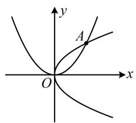
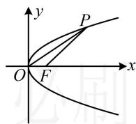
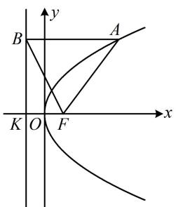
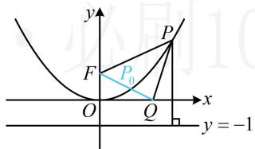
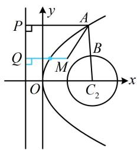

# 强化训练

##### 1. (2024·河南模拟·★)

抛物线 $y = 4x^{2}$ 的焦点坐标为（）

$\quad$A. $\left(\frac{1}{16},0\right)$

$\quad$B. $\left(0,\frac{1}{16}\right)$

$\quad$C. (1,0)

$\quad$D. $(0,1)$

##### 1. B

解析所给不是抛物线的标准方程，应先化为标准方程，再观察焦点坐标，由 $y = 4x^{2}$ 可得 $x^{2} = \frac{1}{4} y$ ，

与 $x^{2} = 2py$ 对比可得 $2p = \frac{1}{4}$ ，所以 $p = \frac{1}{8}$

又 $x^{2} = \frac{1}{4} y$ 开口向上，所以其焦点坐标为 $\left(0, \frac{1}{16}\right)$ .

##### 2. (★)

若抛物线 C 的顶点在原点，准线方程为 $y = -\frac{1}{4}$ ，则抛物线 C 的标准方程为 \_\_\_\_.

##### 2. $x^{2} = y$

解析没给抛物线的开口，先由所给准线方程判断开口，

抛物线 C 的准线方程为 $y = -\frac{1}{4} \Rightarrow$ 开口向上，

可设其方程为 $x^{2}=2py(p>0)$ ①,

则其准线方程为 $y = -\frac{p}{2}$ ，与 $y = -\frac{1}{4}$ 对比可得 $-\frac{p}{2} = -\frac{1}{4}$ ，

所以 $p = \frac{1}{2}$ ，代入①得 $C$ 的方程为 $x^{2} = y$

##### 3. (2021·新高考Ⅱ卷·★)

抛物线 $y^{2} = 2px (p > 0)$ 的焦点到直线 $y = x + 1$ 的距离为 $\sqrt{2}$ ，则 $p = (\quad)$

$\quad$A. 1

$\quad$B. 2

$\quad$C. $2 \sqrt{2}$

$\quad$D. 4

##### 3. B

解析 $y = x + 1 \Rightarrow x - y + 1 = 0$ ，由题意，焦点 $\left(\frac{p}{2}, 0\right)$ 到直线 $x - y + 1 = 0$ 的距离 $d = \frac{\left|\frac{p}{2} + 1\right|}{\sqrt{1^2 + (-1)^2}} = \sqrt{2}$ ，结合 $p > 0$ 可解得： $p = 2$ .

##### 4. (★☆)

顶点在原点，对称轴为坐标轴的抛物线 C 经过点 $A(2,2)$ ，则 C 的方程为 \_\_\_\_.

##### 4. $y^{2} = 2x$ 或 $x^{2} = 2y$

解析没有规定开口，则过点 $A(2,2)$ 的抛物线有如图所示的两种情况，下面分别考虑，

若开口向右，可设抛物线 $C$ 的方程为 $y^{2} = 2px(p > 0)$

将点 $A(2,2)$ 代入可得： $2^{2} = 2p\cdot 2$ ，解得： $p = 1$

所以抛物线 C 的方程为 $y^{2}=2x$ ;

若开口向上，可设抛物线 $C$ 的方程为： $x^{2} = 2my(m > 0)$ ，

将点 $A(2,2)$ 代入可得： $2^{2} = 2m\cdot 2$ ，解得： $m = 1$

所以抛物线 C 的方程为 $x^{2}=2y$ ;

综上所述，抛物线 C 的方程为 $y^{2}=2x$ 或 $x^{2}=2y$ .

##### 5. (2022·上海模拟·★★)

已知点 $F$ 为抛物线 $y^{2} = 2px (p > 0)$ 的焦点，点 $P$ 在抛物线上且横坐标为8， $O$ 为原点，若 $\triangle OFP$ 的面积为 $2\sqrt{2}$ ，则该抛物线的准线方程为 \_\_\_\_.

##### 5. $x = -1$

解析如图，给了点 $P$ 的横坐标，可代入抛物线的方程求其纵坐标，并用它计算 $\triangle OFP$ 的面积，

$x _ {P} = 8 \Rightarrow y _ {P} ^ {2} = 2 p x _ {P} = 1 6 p \Rightarrow y _ {P} = \pm 4 \sqrt {p}    ,    \text {又}   | O F | = \frac {p}{2}  ,$

所以 $S_{\triangle OFP} = \frac{1}{2}\big|OF\big|\cdot \big|y_P\big| = \frac{1}{2}\times \frac{p}{2}\times 4\sqrt{p} = p\sqrt{p}$

由题意， $S_{\triangle OFP} = 2\sqrt{2}$ ，所以 $p\sqrt{p} = 2\sqrt{2}$ ，故 $p = 2$

所以抛物线的准线方程为 x = -1.

##### 6. (2025·全国Ⅱ卷·★★☆)

设抛物线 $C: y^{2} = 2px (p > 0)$ 的焦点为 $F$ ，点 $A$ 在 $C$ 上，过 $A$ 作 $C$ 准线的垂线，垂足为 $B$ ，若直线 $BF$ 的方程为 $y = -2x + 2$ ，则 $\left|AF\right| = (\quad)$

$\quad$A. 3

$\quad$B. 4

$\quad$C. 5

$\quad$D. 6

##### 6. C

解析如图， $F$ 在 $x$ 轴上，故可先用所给直线与 $x$ 轴联立，求出交点 $F$ 的坐标，

联立 $\left\{\begin{aligned}y&=-2x+2\\ y&=0\end{aligned}\right.$ 解得： $\left\{\begin{aligned}x&=1\\ y&=0\end{aligned}\right.$ ，所以 $F(1,0)$ ，

从而 $\frac{p}{2} = 1 \Rightarrow p = 2$ ，故抛物线 $C$ 的方程为 $y^{2} = 4x$ ，

求 $|AF|$ 需要 A 的横坐标, 怎么求? 观察图形发现 B 的横坐标容易获得, 代入所给直线方程可求得其纵坐标, A, B 纵坐标相等, 代入抛物线方程可求得 A 的横坐标,

抛物线的准线为 $x = -1$ ，所以 $x_{B} = -1$

从而 $y_{B} = -2x_{B} + 2 = 4$ ，故 $y_{A} = 4$

又 A 在抛物线 C 上，所以 $x_{A}=\frac{y_{A}^{2}}{4}=4$ ，

故 $\left|AF\right|=x_{A}+\frac{p}{2}=4+1=5$ .

##### 7. (2022·北京模拟·★★★)

已知点 $Q(2\sqrt{2},0)$ 及抛物线 $x^{2} = 4y$ 上一动点 $P(x,y)$ ，则 $y + |PQ|$ 的最小值是（）

$\quad$A. $\frac{1}{2}$

$\quad$B. 1

$\quad$C. 2

$\quad$D. 3

##### 7. C

解析如图，直接分析 $y + |PQ|$ 的最小值不易，可考虑把 $y$ 凑成 $y + 1$ ，用定义转化为 $|PF|$ 再看，

抛物线的焦点为 $F(0,1)$ ，准线为 $y = -1$

由抛物线定义， $\left|PF\right|=y+1$ ，所以 $y=\left|PF\right|-1$ ，

故 $y + |PQ| = |PF| - 1 + |PQ| = |PF| + |PQ| - 1$ ①,

由三角形两边之和大于第三边可得 $\left|PF\right|+\left|PQ\right|\geq\left|FQ\right|$

结合①得 $y + |PQ| \geq |FQ| - 1 = \sqrt{(2\sqrt{2} - 0)^2 + (0 - 1)^2} - 1 = 2$ ，

取等条件是 $P$ 与图中 $P_{0}$ 重合，所以 $(y + |PQ|)_{\mathrm{min}} = 2$

##### 8. (2023·江苏扬州模拟·★★★)

已知抛物线 $C_1: y^2 = 8x$ ，圆 $C_2: (x - 2)^2 + y^2 = 1$ ，点 $M(1,1)$ ，若 $A, B$ 分别是 $C_1, C_2$ 上的动点，则 $\left|AM\right| + \left|AB\right|$ 的最小值为 \_\_\_\_.

##### 8.2

解析如图， $A$ ， $B$ 都是动点，不好分析，可先取定一个．由于圆上动点到圆外定点的距离最值比较好求，故先取定 $A$

由图可知， $\left|AB\right|\geq\left|AC_{2}\right|-1$

所以 $\left|AM\right|+\left|AB\right|\geq\left|AM\right|+\left|AC_{2}\right|-1$ ①,

再求 $\left|AM\right|+\left|AC_{2}\right|$ 的最小值，直接分析不易，注意到 $C_{2}(2,0)$ 恰好是抛物线的焦点，故又可用抛物线定义将 $\left|AC_{2}\right|$ 转化为A到准线的距离来看，

如图，作 $AP \perp$ 准线 $x = -2$ 于 $P$ ， $MQ \perp$ 准线于 $Q$

由抛物线定义， $\left|AC_{2}\right|=\left|AP\right|$ ，代入①可得

$\left| A M \right| + \left| A B \right| \geq \left| A M \right| + \left| A P \right| - 1 \geq \left| M Q \right| - 1 = 3 - 1 = 2,$

当且仅当 $B$ 为线段 $AC_{2}$ 与圆的交点，且 $A$ 为线段 $QM$ 与抛物线交点时两个不等号同时取等号，

所以 $|AM| + |AB|$ 的最小值为2.

一数·必刷100讲

