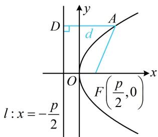
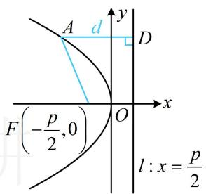
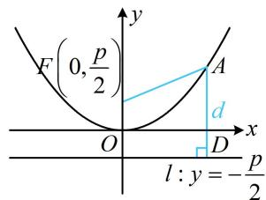
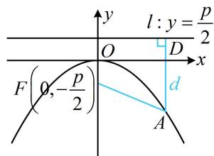
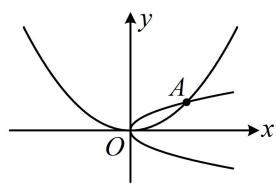
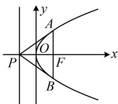
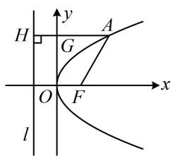
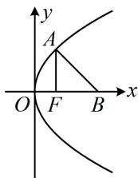
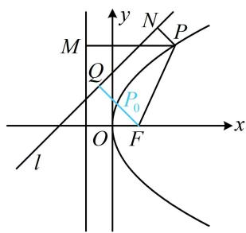

# 模块五 抛物线与方程

# 第1节 抛物线定义、标准方程及简单几何性质（★☆）

# 内容提要

##### 1. 抛物线的定义：平面上到定点 $F$ 的距离与到定直线 $l$ （不过定点 $F$ ）的距离相等的点的轨迹是抛物线，其中定点 $F$ 叫做抛物线的焦点，定直线 $l$ 叫做抛物线的准线.

##### 2. 抛物线的标准方程与简单几何性质:

<table><tr><td>定义</td><td>标准方程 $(p>0)$ </td><td>焦点</td><td>准线</td><td>范围</td><td>对称轴</td><td>顶点</td><td>图形</td></tr><tr><td rowspan="4"> $|AF|=d$ </td><td> $y^{2}=2px$ </td><td> $\left(\frac{p}{2},0\right)$ </td><td> $x=-\frac{p}{2}$ </td><td> $x≥0$  $y∈R$ </td><td>x轴</td><td>原点</td><td></td></tr><tr><td> $y^{2}=-2px$ </td><td> $\left(-\frac{p}{2},0\right)$ </td><td> $x=\frac{p}{2}$ </td><td> $x≤0$  $y∈R$ </td><td>x轴</td><td>原点</td><td></td></tr><tr><td> $x^{2}=2py$ </td><td> $\left(0,\frac{p}{2}\right)$ </td><td> $y=-\frac{p}{2}$ </td><td> $x∈R$  $y≥0$ </td><td>y轴</td><td>原点</td><td></td></tr><tr><td> $x^{2}=-2py$ </td><td> $\left(0,-\frac{p}{2}\right)$ </td><td> $y=\frac{p}{2}$ </td><td> $x∈R$  $y≤0$ </td><td>y轴</td><td>原点</td><td></td></tr></table>

##### 3. 抛物线上的点到焦点 $F$ 的距离可用坐标表示，例如开口向右的抛物线 $y^{2} = 2px (p > 0)$ 中，若点 $A$ 在抛物线上，且 $AD \perp$ 准线于 $D$ ，如上表中第1个图，有 $\left|AF\right| = \left|AD\right| = x_{A} + \frac{p}{2}$ ，其余开口的抛物线类似.

类型 I：抛物线的标准方程与简单几何性质

【例 1】若抛物线 C 的顶点在原点，焦点坐标为 $\left(\frac{3}{2},0\right)$ ，则抛物线 C 的标准方程为 \_\_\_\_，准线方程是 \_\_\_\_.

解析先判断开口，并设标准方程，焦点为 $\left(\frac{3}{2},0\right) \Rightarrow$ 开口向右，可设抛物线方程为 $y^{2} = 2px (p > 0)$ ，则其焦点坐标为 $\left(\frac{p}{2},0\right)$ ，由题意， $\frac{p}{2} = \frac{3}{2}$ ，所以 $p = 3$ ，故 $C$ 的方程为 $y^{2} = 6x$ ，准线方程为 $x = -\frac{3}{2}$ .

答案 $y^{2}=6x,\quad x=-\frac{3}{2}$

【变式 1】顶点在原点，对称轴为坐标轴的抛物线 C 经过点 A(2,1)，则 C 的方程为 \_\_\_\_.

解析抛物线过点 $A(2,1)$ ，有如图所示的两种情况，下面分别考虑，

若开口向右，可设抛物线 C 的方程为 $y^{2}=2px(p>0)$ ，

将点 $A(2,1)$ 代入可得： $1^{2} = 2p\cdot 2$ ，解得： $p = \frac{1}{4}$ ，所以 $C$ 的方程为 $y^{2} = \frac{1}{2} x$

若开口向上，可设抛物线 $C$ 的方程为 $x^{2} = 2my(m > 0)$

将点 $A(2,1)$ 代入可得： $2^{2} = 2m$ ，解得： $m = 2$ ，所以 $C$ 的方程为 $x^{2} = 4y$ ；

综上所述， $C$ 的方程为 $y^{2} = \frac{1}{2} x$ 或 $x^{2} = 4y$

答案 $y^{2}=\frac{1}{2}x$ 或 $x^{2}=4y$

##### 【变式2】若抛物线 $y = ax^{2}$ 的准线方程为 $y = -\frac{1}{8}$ ，则 $a =$ \_\_\_\_.

解析先把所给方程化为标准方程，即把平方项系数化1，并判断开口， $y=ax^{2}\Rightarrow x^{2}=\frac{1}{a}y$ ，

由抛物线的准线方程是 $y = -\frac{1}{8}$ 知抛物线开口向上，所以 $a > 0$ ，且 $2p = \frac{1}{a}$ ，从而 $p = \frac{1}{2a}$ ，

故抛物线的准线方程为 $y = -\frac{1}{4a}$ ，与 $y = -\frac{1}{8}$ 比较可得 $-\frac{1}{4a} = -\frac{1}{8}$ ，解得： $a = 2$ .

答案: 2

【例 2】已知抛物线 $C: y^{2} = 2px (p > 0)$ 的焦点为 $F$ ，准线 $l$ 与 $x$ 轴交于点 $P$ ，过 $F$ 且垂直于 $x$ 轴的直线与抛物线交于 $A$ ， $B$ 两点，若 $\triangle PAB$ 的面积为 2，则 $p = \_$ .

解析如图，可以 $AB$ 为底， $PF$ 为高来计算 $\triangle PAB$ 的面积，下面先求 $|AB|$ ，

将 $x = \frac{p}{2}$ 代入 $y^{2} = 2px$ 解得： $y = \pm p$ ，所以 $\left|AB\right| = 2p$ ，

又 $\left|PF\right|=p$ ，所以 $S_{\triangle PAB}=\frac{1}{2}\left|AB\right|\cdot\left|PF\right|=\frac{1}{2}\cdot2p\cdot p=p^{2}$

由题意， $S_{\triangle PAB} = 2$ ，所以 $p^2 = 2$ ，故 $p = \sqrt{2}$

答案: $\sqrt{2}$

类型 II：抛物线定义的运用

【例 3】(2020·新课标 I 卷) 已知 A 为抛物线 $C: y^{2} = 2px (p > 0)$ 上一点，点 A 到 C 的焦点的距离为 12，到 y 轴的距离为 9，则 p = （）

$\quad$A. 2 
$\quad$B. 3 
$\quad$C. 6 
$\quad$D. 9

解析如图，涉及抛物线上的点到焦点的距离，考虑抛物线的定义，设焦点为 $F\left(\frac{p}{2},0\right)$ ，准线为 $l:x=-\frac{p}{2}$ ，作 $AH\perp l$ 于H，交y轴于G，由抛物线定义， $|AH|=|AF|=12$ ，

又 $|AG|=9$ ，所以 $|HG|=|AH|-|AG|=12-9=3$ ，即 $\frac{p}{2}=3$ ，故p=6.

答案: C

【反思】涉及抛物线上的点到焦点的距离问题，常常优先往抛物线定义上考虑.

【变式 1】(2022·全国乙卷) 设 F 为抛物线 $C: y^{2} = 4x$ 的焦点，点 A 在 C 上，点 $B(3,0)$ ，若 $\left|AF\right| = \left|BF\right|$ ，则 $\left|AB\right| = (\quad)$

$\quad$A. 2 
$\quad$B. $2\sqrt{2}$ 
$\quad$C. 3 
$\quad$D. $3\sqrt{2}$

解析如图，只要求出 $|AF|$ ，就可结合抛物线定义求得A的坐标，进而求出 $|AB|$ ，由题意， $F(1,0)$ ， $B(3,0)$ ，所以 $|BF|=2$ ，因为 $|AF|=|BF|$ ，所以 $|AF|=2$ ，

由内容提要3， $\left|AF\right|=x_{A}+\frac{p}{2}=x_{A}+1$ ，所以 $x_{A}+1=2$ ，

从而 $x_{A} = 1$ ，故 $y_{A}^{2} = 4x_{A} = 4$ ，故 $\left|AB\right| = \sqrt{(x_A - 3)^2 + y_A^2} = 2\sqrt{2}$

答案: B

【变式 2】P 是抛物线 $C: y^{2} = 4x$ 上的动点，设点 P 到抛物线准线的距离为 $d_{1}$ ，到直线 $l: x - y + 2 = 0$ 的距离为 $d_{2}$ ，则 $d_{1} + d_{2}$ 的最小值为 \_\_\_\_.

解析如图，直接分析 $d_{1} + d_{2}$ 的最小值不易，可考虑用定义将 $d_{1}$ 转化为 $\left|PF\right|$ 来看，

设抛物线的焦点为 $F(1,0)$ ，由抛物线的定义知 $d_{1} = |PF|$ ，所以 $d_{1} + d_{2} = |PF| + d_{2}$ ①，

如图，过 $F$ 作 $FQ \perp l$ 于 $Q$ ，过 $P$ 作 $PN \perp l$ 于 $N$ ，则 $d_{2} = |PN|$

代入①得： $d_{1} + d_{2} = |PF| + |PN|\geq |FQ| = \frac{|1 + 2|}{\sqrt{1^{2} + (-1)^{2}}} = \frac{3\sqrt{2}}{2},$

当且仅当点 $P$ 为线段 $FQ$ 与抛物线交点 $P_0$ 时取等号，所以 $(d_{1} + d_{2})_{\min} = \frac{3\sqrt{2}}{2}$

答案 $\frac{3\sqrt{2}}{2}$

【总结】只要涉及抛物线上的点到焦点的距离，不管问什么，最常见的思考方向都是利用定义转换长度.

# 强化训练

##### 1. (2024·河南模拟·★)

抛物线 $y = 4x^{2}$ 的焦点坐标为（）

$\quad$A. $\left(\frac{1}{16},0\right)$

$\quad$B. $\left(0,\frac{1}{16}\right)$

$\quad$C. (1,0)

$\quad$D. $(0,1)$

##### 2. (★)

若抛物线 C 的顶点在原点，准线方程为 $y = -\frac{1}{4}$ ，则抛物线 C 的标准方程为 \_\_\_\_.

##### 3. (2021·新高考II卷·★)

抛物线 $y^{2} = 2px (p > 0)$ 的焦点到直线 $y = x + 1$ 的距离为 $\sqrt{2}$ ，则 $p = (\quad)$

$\quad$A. 1

$\quad$B. 2

$\quad$C. $2 \sqrt{2}$

$\quad$D. 4

##### 4. (★☆)

顶点在原点，对称轴为坐标轴的抛物线 C 经过点 $A(2,2)$ ，则 C 的方程为 \_\_\_\_.

##### 5. (2022·上海模拟·★★)

已知点 $F$ 为抛物线 $y^{2} = 2px(p > 0)$ 的焦点，点 $P$ 在抛物线上且横坐标为8， $O$ 为原点，若 $\triangle OFP$ 的面积为 $2\sqrt{2}$ ，则该抛物线的准线方程为 \_\_\_\_.

##### 6. (2025·全国Ⅱ卷·★★☆)

设抛物线 $C: y^{2} = 2px (p > 0)$ 的焦点为 $F$ ，点 $A$ 在 $C$ 上，过 $A$ 作 $C$ 准线的垂线，垂足为 $B$ ，若直线 $BF$ 的方程为 $y = -2x + 2$ ，则 $\left|AF\right| = (\quad)$

$\quad$A. 3

$\quad$B. 4

$\quad$C. 5

$\quad$D. 6

##### 7. (2022·北京模拟·★★★)

已知点 $Q(2\sqrt{2},0)$ 及抛物线 $x^{2} = 4y$ 上一动点 $P(x,y)$ ，则 $y + |PQ|$ 的最小值是（）

$\quad$A. $\frac{1}{2}$

$\quad$B. 1

$\quad$C. 2

$\quad$D. 3

##### 8. (2023·江苏扬州模拟·★★★)

已知抛物线 $C_1: y^2 = 8x$ ，圆 $C_2: (x - 2)^2 + y^2 = 1$ ，点 $M(1,1)$ ，若 $A, B$ 分别是 $C_1, C_2$ 上的动点，则 $\left|AM\right| + \left|AB\right|$ 的最小值为 \_\_\_\_.

