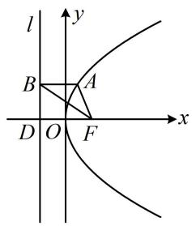
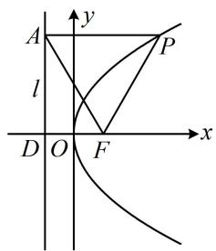
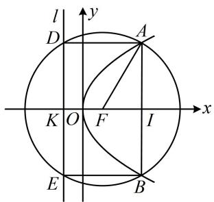
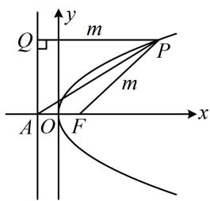
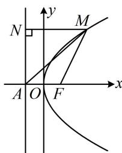
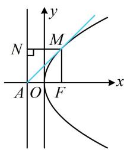
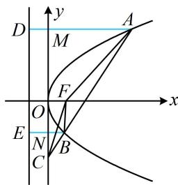
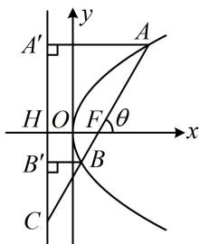
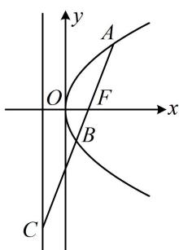
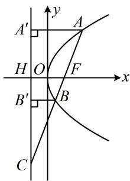

# 第 2 节 抛物线定义与几何性质综合问题（★★★）

# 内容提要

抛物线上的点到焦点的距离问题常用抛物线的定义求解, 但除定义外, 可能还需结合图形 (如等腰、等边、直角三角形, 矩形等) 的几何性质才能求解问题, 因此本节将归纳高考中抛物线常见的图形和几何条件的处理思路.

# 类型 I：定义与特殊图形

【例 1】已知抛物线 C: $y^{2}=12x$ 的焦点为 F，准线为 l，点 A 在 C 上，且 $AB \perp l$ 于 B，若 $\angle FAB = \frac{2\pi}{3}$ ，则 $\left|BF\right| = (\quad)$

$\quad$A. $2\sqrt{3}$ 
$\quad$B. $4\sqrt{3}$ 
$\quad$C. $\frac{4\sqrt{3}}{3}$ 
$\quad$D. $\frac{8\sqrt{3}}{3}$

解析如图，涉及抛物线上的点向准线作垂线，想到抛物线定义，

由题意， $|AB| = |AF|$ ，又 $\angle FAB = \frac{2\pi}{3}$ ，所以 $\angle ABF = \angle AFB = \frac{\pi}{6}$ ，要求 $|BF|$ ，注意到 $\triangle BFD$ 为直角三角形且 $|FD|$ 已知，所以将条件转移到该三角形中来看，

记准线与 $x$ 轴交于点 $D$ ，抛物线的焦点为 $F(3,0)$ ，准线为 $l: x = -3$ ，所以 $|FD| = 6$ ，由 $\angle ABF = \frac{\pi}{6}$ 可得 $\angle DBF = \frac{\pi}{3}$ ，所以 $|BF| = \frac{|FD|}{\sin \angle DBF} = \frac{6}{\sin \frac{\pi}{3}} = 4\sqrt{3}$ .

答案: B

【反思】利用抛物线的定义可知，抛物线上的点 A 与焦点 F，以及点 A 在准线上的射影 B 所围成的三角形 ABF 是等腰三角形，且 FB 为 $\angle AFO$ 的角平分线.

【例 2】已知抛物线 $C: y^{2} = 4x$ 的焦点为 F，准线为 l，点 P 在 C 上， $PA \perp l$ 于 A，若 $\left|PA\right| = \left|AF\right|$ ，则 $\left|AF\right| =$ \_\_\_\_.

解析如图，C 的焦点为 $F(1,0)$ ，准线为 l:x=-1，设 l 与 x 轴交于点 D，由抛物线定义， $|PA|=|PF|$ ，又 $|PA|=|AF|$ ，所以 $\triangle PAF$ 是正三角形，要算 $|AF|$ ，图中已知的长度只有 $|FD|$ ，故放到 $\triangle ADF$ 中来看，

因为 $\angle PAF = 60^{\circ}$ ，所以 $\angle DAF = 30^{\circ}$

又 $|FD|=2$ ，所以 $|AF|=\frac{|FD|}{\sin\angle DAF}=\frac{2}{\sin30^{\circ}}=4$ .

答案: 4

##### 【变式】已知抛物线 $C: y^{2} = 2px (p > 0)$ 的焦点为 $F$ ，准线为 $l$ ，以 $F$ 为圆心作圆与 $C$ 交于 $A$ ， $B$ 两点，与 $l$ 交于 $D$ ， $E$ 两点， $|AB| = |DE| = 4\sqrt{3}$ ，则 $p = \_$ .

解析如图，已知 $|AB| = |DE| = 4\sqrt{3}$ ，可通过分析几何关系，求出点 $A$ 的坐标，代入抛物线方程求 $p$ ，因为 $|AB| = |DE| = 4\sqrt{3}$ ，所以 $AB, DE$ 是同一圆中等长的弦，结合对称性可得四边形 $ABED$ 是矩形，设准线 $l$ 与 $x$ 轴交于点 $K$ , $AB$ 与 $x$ 轴交于点 $I$ , 则 $\left|KF\right| = p$ , 因为 $\left|AB\right| = \left|DE\right|$ , 所以 $\left|FI\right| = \left|KF\right| = p$ , 故 $\left|OI\right| = \left|OF\right| + \left|FI\right| = \frac{3p}{2}$ , 又 $\left|AI\right| = \frac{1}{2}\left|AB\right| = 2\sqrt{3}$ , 所以 $A\left(\frac{3p}{2}, 2\sqrt{3}\right)$ ,

代入抛物线方程可得： $(2\sqrt{3})^2 = 2p\cdot \frac{3p}{2}$ ，解得： $p = 2$

答案: 2

【例 3】已知抛物线 $E: y^{2} = 2px (p > 0)$ 的焦点为 F，点 A 是抛物线 E 的准线与坐标轴的交点，点 P 在抛物线 E 上，若 $\angle PAF = 30^{\circ}$ ，则 $\frac{|PA|}{|PF|} =$ \_\_\_\_， $\sin \angle PFA =$ \_\_\_\_.

解析涉及 $|PF|$ ，常用抛物线定义转化为 $P$ 到准线的距离来分析，

如图，作 $PQ \perp$ 准线于 $Q$ ，因为 $\angle PAF = 30^{\circ}$ ，所以 $\angle PAQ = 60^{\circ}$

设 $\left|PF\right|=m$ ，则 $\left|PQ\right|=m$ ，所以 $\left|PA\right|=\frac{\left|PQ\right|}{\sin\angle PAQ}=\frac{m}{\sin60^{\circ}}=\frac{2\sqrt{3}m}{3}$ ，故 $\frac{\left|PA\right|}{\left|PF\right|}=\frac{2\sqrt{3}}{3}$

在 $\triangle PAF$ 中， $PA$ 和 $PF$ 所对的角恰好分别是 $\angle PFA$ 和 $\angle PAF$ ，故可用正弦定理求 $\sin \angle PFA$ ，由正弦定理， $\frac{|PA|}{\sin \angle PFA} = \frac{|PF|}{\sin \angle PAF}$ ，

所以 $\sin \angle PFA = \frac{|PA|\sin\angle PAF}{|PF|} = \frac{\frac{2\sqrt{3}m}{3}\times\frac{1}{2}}{m} = \frac{\sqrt{3}}{3}.$

答案 $\frac{2\sqrt{3}}{3}$ ， $\frac{\sqrt{3}}{3}$

##### 【变式】已知抛物线 $C: y^{2} = 2px (p > 0)$ 的焦点为 $F(1,0)$ ，准线与 $x$ 轴交于点 $A$ ，点 $M$ 在第一象限且在抛物线 $C$ 上，则当 $\frac{|MF|}{|MA|}$ 取得最小值时，直线 $AM$ 的方程为 \_\_\_\_.

解析涉及 $|MF|$ ，想到用定义转化为 $M$ 到准线的距离，如图1，作 $MN \perp$ 准线于 $N$ ，则 $|MF| = |MN|$ ，所以 $\frac{|MF|}{|MA|} = \frac{|MN|}{|MA|} = \sin \angle MAN$ ，要使 $\sin \angle MAN$ 最小，只需 $\angle MAN$ 最小，此时的情形如图2，

图 2 中直线 AM 与抛物线相切，可联立方程用判别式 $\Delta = 0$ 求直线的方程，

抛物线 $C$ 的准线为 $x = -1$ ，所以 $A(-1,0)$ ，故可设图2中切线 $AM$ 的方程为 $x = my - 1$

联立 $\left\{\begin{aligned}x&=my-1\\ y^{2}&=4x\end{aligned}\right.$ 消去 x 整理得： $y^{2}-4my+4=0$

因为直线 $AM$ 与抛物线相切，所以 $\Delta = (-4m)^2 - 4 \times 1 \times 4 = 0$

解得： $m = \pm 1$ ，因为 $M$ 在第一象限，所以 $m = 1$

故直线 $AM$ 的方程为 $x = y - 1$ ，即 $x - y + 1 = 0$

答案: $x - y + 1 = 0$

图1

图2

# 类型 II：定义与线段比例、相似相关

【例 4】设抛物线 $y^{2}=4x$ 的焦点为 F，不经过焦点的直线上有三个不同的点 A，B，C，其中点 A，

B 在抛物线上，点 C 在 y 轴上，B 在线段 AC 上，则 $\triangle BCF$ 与 $\triangle ACF$ 的面积之比是（）

$\quad$A. $\frac{|BF| - 1}{|AF| - 1}$

$\quad$B. $\frac{\left|BF\right|^2 - 1}{\left|AF\right|^2 - 1}$

$\quad$C. $\frac{|BF| + 1}{|AF| + 1}$

$\quad$D. $\frac{\left|BF\right|^2 + 1}{\left|AF\right|^2 + 1}$

解析如图，两个三角形有相同的高（点 $F$ 到直线 $AC$ 的距离），故只需分析底边之比 $\frac{|BC|}{|AC|}$ 。选项中有 $|AF|$ 和 $|BF|$ ，由此想到抛物线定义，故过 $A, B$ 向准线作垂线，作出来就发现可用相似比来分析 $\frac{|BC|}{|AC|}$ ，

过 $A, B$ 作抛物线准线 $x = -1$ 的垂线分别交 $y$ 轴于 $M, N$ , 垂足分别为 $D, E$ ,

则 $\triangle CBN\sim \triangle CAM$ ，所以 $\frac{|BC|}{|AC|} = \frac{|BN|}{|AM|} = \frac{|BE| - 1}{|AD| - 1}$ ①，

由抛物线定义， $|BE| = |BF|$ ， $|AD| = |AF|$

代入①得： $\frac{|BC|}{|AC|} = \frac{|BF| - 1}{|AF| - 1}$ ，所以 $\frac{S_{\triangle BCF}}{S_{\triangle ACF}} = \frac{|BF| - 1}{|AF| - 1}$

答案: A

【反思】抛物线中与焦点 F 有关的线段比例问题中，过抛物线上的点向准线作垂线，借助抛物线定义来分析图形的几何特征，是常规操作.

【变式 1】过抛物线 $y^{2}=2px(p>0)$ 的焦点 F 且斜率 k>0 的直线交抛物线于 A, B 两点，交其准线 l 于点 C (B 在 F, C 之间)，且 $\left|BC\right|=2\left|BF\right|$ ， $\left|AF\right|=12$ ，则直线 AB 的方程为 \_\_\_\_.

解析如图，作 $AA' \perp$ 准线于 $A'$ ， $BB' \perp$ 准线于 $B'$ ，设准线与 $x$ 轴交于点 $H$ ，

先求直线 $AB$ 的倾斜角 $\theta$ ，可将 $|BC| = 2|BF|$ 转化为 $|BB'\|$ 和 $|BC|$ 的关系，求得 $\angle CBB'$ ，该角等于 $\theta$ ，

由抛物线定义， $\left|BF\right|=\left|BB'\right|$ ，代入 $\left|BC\right|=2\left|BF\right|$ 可得 $\left|BC\right|=2\left|BB'\right|$ ，所以 $\cos\angle CBB'=\frac{\left|BB'\right|}{\left|BC\right|}=\frac{1}{2}$ ，

故 $\angle CBB' = 60^{\circ}$ ，又 $BB' // x$ 轴，所以 $\theta = 60^{\circ}$ ，故直线 $AB$ 的斜率 $k = \tan 60^{\circ} = \sqrt{3}$

求直线 $AB$ 的方程还差 $F$ 的坐标, 先求 $\left|HF\right|$ , 可利用相似比转化为求 $\left|AA'\right|$ ,

因为 $AA' \parallel x$ 轴，所以 $\angle CAA' = \theta = 60^\circ$ ，故 $\left|AA'\right| = \left|AC\right|\cos \angle CAA' = \frac{1}{2}\left|AC\right|$ ①，

由抛物线定义， $\left|AA'\right|=\left|AF\right|$ ，代入①可得 $\left|AF\right|=\frac{1}{2}\left|AC\right|$ ，所以F为AC中点，

结合 $FH \parallel AA'$ 可得 $\left|FH\right| = \frac{1}{2}\left|AA'\right| = \frac{1}{2}\left|AF\right| = 6$ ，所以 $F(3,0)$ ，

故直线 $AB$ 的方程为 $y = \sqrt{3} (x - 3)$ ，即 $y = \sqrt{3} x - 3\sqrt{3}$ 。

答案: $y = \sqrt{3}x - 3\sqrt{3}$

【变式 2】如图，过抛物线 $y^{2}=4x$ 的焦点 F 作直线与抛物线及其准线分别交于 A, B, C 三点，若 $\overrightarrow{FC}=4\overrightarrow{FB}$ ，则 $\left|AB\right|=\underline{\hspace{2cm}}$ .

解析抛物线的准线为 $x = -1$ ，焦点为 $F(1,0)$ ，设准线与 $x$ 轴交于点 $H$ ，则 $\vert FH\vert = 2$ 如图，作 $AA' \perp$ 准线于 $A'$ ， $BB' \perp$ 准线于 $B'$ ，则 $\vert AF\vert = \vert AA'\vert$ ， $\vert BF\vert = \vert BB'\vert$ ，

题干给出 $\overrightarrow{FC}=4\overrightarrow{FB}$ 这种线段比例式，可先设 $\left|BF\right|$ ，并求其它线段的长，再用相似比建立方程，设 $\left|BF\right|=m$ ，则 $\left|BB'\right|=m$ ，因为 $\overrightarrow{FC}=4\overrightarrow{FB}$ ，所以 $\left|BC\right|=3\left|BF\right|=3m$ ， $\left|CF\right|=4m$ ，

因为 $\triangle CBB' \sim \triangle CFH$ ，所以 $\frac{|BB'|}{|FH|} = \frac{|BC|}{|CF|}$ ，即 $\frac{m}{2} = \frac{3m}{4m}$ ，解得： $m = \frac{3}{2}$ ，所以 $|BF| = \frac{3}{2}$ ， $|CF| = 6$ ，

还需求出 $|AF|$ ，做法与求 $|BF|$ 类似，可设其为未知数，用相似比来建立方程求解，

设 $\left|AF\right|=\left|AA'\right|=n$ ，则 $\left|AC\right|=\left|AF\right|+\left|CF\right|=n+6$ ，

由 $\triangle CFH\sim \triangle CAA'$ 可得 $\frac{|CF|}{|AC|} = \frac{|FH|}{|AA'|}$ ，即 $\frac{6}{n + 6} = \frac{2}{n}$ ，解得： $n = 3$

所以 $\left|AF\right|=3$ ，故 $\left|AB\right|=\left|AF\right|+\left|BF\right|=3+\frac{3}{2}=\frac{9}{2}$ .

答案: $\frac{9}{2}$

【反思】抛物线小题中出现未知长度的比例关系时，往往可设一段长，利用定义以及相似等几何性质求解其它线段的长.

# 强化训练

##### 1. (2022·安徽合肥模拟·★★)

已知抛物线 $C: y^{2} = 4\sqrt{3} x$ 的焦点为 $F$ ，准线为 $l$ ，过抛物线上一点 $P$ 作准线的垂线，垂足为 $Q$ ，若 $\angle PFQ = 60^{\circ}$ ，则 $\left|PF\right| = (\quad)$

$\quad$A. $4 \sqrt{3}$

$\quad$B. $2 \sqrt{3}$

$\quad$C. $\sqrt{3}$

$\quad$D. 6

##### 2. (2022·湖南岳阳模拟·★★☆)

过抛物线 $C: y^{2} = 2px (p > 0)$ 的焦点 $F$ 且斜率 $k > 0$ 直线与 $C$ 交于 $A, B$ 两点， $A$ 在第一象限，过 $A$ 作准线的垂线，垂足为 $H$ ，若 $\angle HFB$ 被 $x$ 轴平分，则 $k = \_$ .

##### 3. (2022·广东开平模拟·★★★)

抛物线 $C: y^{2} = 16x$ 的焦点为 $F, M$ 是 $C$ 上一点， $FM$ 的延长线交 $y$ 轴于点 $N$ ，若 $3\overrightarrow{FM} = 2\overrightarrow{MN}$ ，则 $\left|FN\right| =$ \_\_\_\_.

##### 4. (2022·河南模拟·★★★)

过抛物线 $y^{2} = 2px (p > 0)$ 的焦点 $F$ 的直线交抛物线于 $A, B$ 两点，交其准线于点 $C$ ，若点 $F$ 是 $AC$ 的中点，且 $|AF| = 4$ ，则 $|AB| =$ \_\_\_\_.

##### 5.（2024·湖南长沙模拟·★★★）

设抛物线 $C: y^{2} = 2px (p > 0)$ 的焦点为 $F$ ，直线 $l$ 与 $C$ 交于 $A$ ， $B$ 两点， $FA \perp FB$ ， $|FA| = 2|FB|$ ，则 $l$ 的斜率是（）

$\quad$A. $\pm 1$

$\quad$B. $\pm \sqrt{2}$

$\quad$C. $\pm \sqrt{3}$

$\quad$D. ±2

##### 6. (2024·安徽合肥二模·★★★)

抛物线 $C: y^{2} = 4x$ 的焦点为 $F$ ，准线为 $l$ ， $A$ 为 $C$ 上一点，以点 $F$ 为圆心， $|AF|$ 为半径的圆与 $l$ 交于点 $B$ ， $D$ ，与 $x$ 轴交于点 $M$ ， $N$ ，若 $\overrightarrow{AB} = \overrightarrow{FM}$ ，则 $|AM| =$ \_\_\_\_.

##### 7. (★★★☆)

抛物线 $E: y^{2} = 4x$ 的焦点为 $F$ ，过 $F$ 的直线与 $E$ 交于 $A$ ， $B$ 两点，延长 $FB$ 交 $E$ 的准线 $l$ 于点 $C$ ，过 $A$ ， $B$ 作 $l$ 的垂线，垂足分别为 $M$ ， $N$ ，若 $\left|BC\right| = 2\left|BN\right|$ ，则 $\triangle AFM$ 的面积为（）

$\quad$A. $4 \sqrt{3}$

$\quad$B. 4

$\quad$C. $2 \sqrt{3}$

$\quad$D. 2

##### 8. (2022·黑龙江齐齐哈尔模拟·★★★★)

已知抛物线 $C:y^{2} = 2px(p > 0)$ 的准线 $x = -1$ 与 $x$ 轴交于点 $A$ ， $F$ 为 $C$ 的焦点， $B$ 是 $C$ 上第一象限内的一点，则当 $\frac{|BF|}{|AB|}$ 取得最小值时， $\triangle ABF$ 的面积为（）

$\quad$A. 2 
$\quad$B. 3 
$\quad$C. 4 
$\quad$D. 6

##### 9. (2022·云南昆明模拟·★★★★)

抛物线 $C:y^{2} = 2px(p > 0)$ 的焦点为 $F$ ，第一象限的 $A$ ， $B$ 两点在抛物线上，且 $FA\bot AB$ ， $\left|AF\right| = 7$ ， $\left|BF\right| = 25$ 若直线 $AB$ 的倾斜角为 $\theta$ ，则 $\cos \theta =$

##### 10. (2022·湖北模拟·★★★★)

已知抛物线 C 的焦点为 F，点 A，B 在抛物线上，以 AB 为直径的圆过点 F，过线段 AB 的中点 P 作 C 的准线的垂线，垂足为 Q，则 $\frac{|PQ|}{|AB|}$ 的最大值为（）

$\quad$A. $\frac{1}{2}$ 
$\quad$B. $\frac{\sqrt{3}}{3}$ 
$\quad$C. $\frac{\sqrt{2}}{2}$ 
$\quad$D. 1

