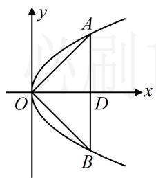
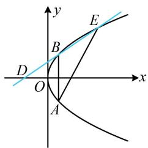
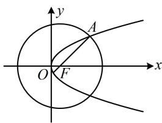
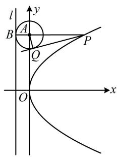
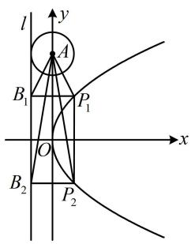
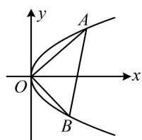
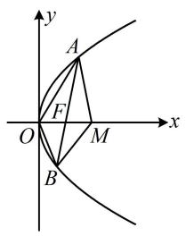

# 强化训练

##### 1. (★★)

已知 $O$ 为坐标原点，垂直于抛物线 $C: y^2 = 2px (p > 0)$ 的对称轴的直线 $l$ 交 $C$ 于 $A, B$ 两点， $\overrightarrow{OA} \cdot \overrightarrow{OB} = 0$ ，且 $|AB| = 4$ ，则 $p = (\quad)$

$\quad$A. 4

$\quad$B. 3

$\quad$C. 2

$\quad$D. 1

##### 1. D

【解法1】条件 $\overrightarrow{OA} \cdot \overrightarrow{OB} = 0$ 可用 $A, B$ 的坐标翻译，考虑到 $l \perp x$ 轴，可设 $l$ 的方程，与抛物线联立求 $A, B$ 的坐标，

由题意，可设直线 $l$ 的方程为 $x = t(t > 0)$

代入 $y^{2} = 2px$ 可得： $y^{2} = 2pt$ ，解得： $y = \pm \sqrt{2pt}$

不妨设 $A(t, \sqrt{2pt})$ ， $B(t, -\sqrt{2pt})$ ，

则 $\left\{ \begin{array}{l} |AB| = 2\sqrt{2pt} = 4 \\ \overrightarrow{OA} \cdot \overrightarrow{OB} = t^2 + \sqrt{2pt} \cdot (-\sqrt{2pt}) = t^2 - 2pt = 0 \end{array} \right.$ ①

由②结合 t > 0 可得：t = 2p，代入①解得：p = 1。

【解法2】 $\overrightarrow{OA}\cdot \overrightarrow{OB} = 0$ 意味着 $OA\bot OB$ ，由对称性，结合 $|AB| = 4$ 可找到 $A$ 的坐标，代入抛物线方程即可求出 $p$

设直线 l 与 x 轴交于点 D，由对称性， $|OA| = |OB|$ ，

又 $\overrightarrow{OA} \cdot \overrightarrow{OB} = 0$ ，所以 $OA \perp OB$ ，故 $\triangle AOB$ 为等腰直角三角形，所以 $\triangle AOD$ 也是等腰直角三角形，

因为 $|AB|=4$ ，所以 $|OD|=|AD|=2$ ，故 $A(2,2)$ ，

代入 $y^{2}=2px$ 可得： $2^{2}=2p\cdot2$ ，解得：p=1。

##### 2. (2022·贵州镇远模拟·★★)

已知 $A$ ， $B$ 是抛物线 $C:y^{2} = 4x$ 上关于 $x$ 轴对称的两点， $D$ 是 $C$ 的准线与 $x$ 轴的交点，若直线 $BD$ 与 $C$ 的另一个交点是 $E(4,4)$ ，则直线 $AE$ 的方程为（）

$\quad$A. $2x - y - 4 = 0$

$\quad$B. $4x - 3y - 4 = 0$

$\quad$C. $x - 2y + 4 = 0$

$\quad$D. $4x - 5y + 4 = 0$

##### 2. B

解析如图，抛物线的准线为 $x = -1$ ，所以 $D(-1,0)$

还知道点 $E$ ，于是可写出直线 $DE$ 的方程，与抛物线联立求 $B$ 的坐标，又 $E(4,4)$ ，所以 $k_{DE} = \frac{0 - 4}{-1 - 4} = \frac{4}{5}$

故直线 $DE$ 的方程为 $y = \frac{4}{5} (x + 1)$ ，即 $4x = 5y - 4$ ，

代入 $y^{2}=4x$ 消去 x 整理得： $y^{2}-5y+4=0$ ，

解得： $y = 1$ 或4，因为 $y_{E} = 4$ ，所以 $y_{B} = 1$

又点 $B$ 在抛物线 $C$ 上，所以 $x_{B} = \frac{y_{B}^{2}}{4} = \frac{1}{4}$ ，故 $B\left(\frac{1}{4},1\right)$

此时可由对称性求得 $A$ 的坐标，结合点 $E$ 写出直线 $AE$ 的方程，由对称性知点 $A$ 的坐标为 $\left(\frac{1}{4}, -1\right)$ ，

所以 $k_{AE} = \frac{-1 - 4}{\frac{1}{4} - 4} = \frac{4}{3}$ ，故 $AE$ 的方程为 $y - 4 = \frac{4}{3}(x - 4)$

整理得： $4x - 3y - 4 = 0$

##### 3. (2024·天津卷·★★)

$(x - 1)^2 + y^2 = 25$ 的圆心与抛物线 $y^2 = 2px (p > 0)$ 的焦点 $F$ 重合， $A$ 为两曲线的交点，则原点到直线 $AF$ 的距离为 \_\_\_\_.

##### 3. $\frac{4}{5}$

解析由题意， $F(1,0)$ ，又因为抛物线 $y^{2}=2px(p>0)$ 的焦点坐标为 $\left(\frac{p}{2},0\right)$ ，所以 $\frac{p}{2}=1$ ，故 p=2，

如图，求 $O$ 到 $AF$ 的距离需要 $AF$ 的方程，已知 $F$ ，求该方程还差 $A$ 的坐标，故联立圆和抛物线求 $A$ 的坐标，

联立 $\left\{ \begin{array}{l} (x - 1)^2 + y^2 = 25 \\ y^2 = 4x \end{array} \right.$ 消去 $y$ 整理得： $x^2 + 2x - 24 = 0$

解得： $x = 4$ 或-6（舍去），所以 $y = \pm 2\sqrt{x} = \pm 4$

由对称性，不妨假设 $A(4,4)$ ，则 $k_{AF} = \frac{4 - 0}{4 - 1} = \frac{4}{3}$

直线 $AF$ 的方程为 $y = \frac{4}{3} (x - 1)$ ，即 $4x - 3y - 4 = 0$ ，

所以原点到直线 $AF$ 的距离 $d = \frac{|-4|}{\sqrt{4^2 + (-3)^2}} = \frac{4}{5}$ .

##### 4. (2022·江西上饶模拟·★★)

已知抛物线 $y^{2} = 2px(p > 0)$ 的焦点为 $F(1,0)$ ，则抛物线上的动点 $N$ 到点 $M(3p,0)$ 的距离的最小值为（）

$\quad$A. 4

$\quad$B. 6

$\quad$C. $2 \sqrt{5}$

$\quad$D. $4 \sqrt{5}$

##### 4. C

解析抛物线的焦点为 $F(1,0)\Rightarrow \frac{p}{2} = 1\Rightarrow p = 2$

所以抛物线的方程为 $y^{2} = 4x$ ，且 $M$ 的坐标为(6,0)，

点 $N$ 在抛物线上运动，可将其坐标设为单变量的形式，用于计算 $\left|MN\right|$ ，

可设 $N\left(\frac{a^2}{4}, a\right)$ ，则 $\left|MN\right| = \sqrt{\left(\frac{a^2}{4} - 6\right)^2 + (a - 0)^2}$

$= \sqrt {\frac {a ^ {4}}{1 6} - 2 a ^ {2} + 3 6} = \sqrt {\frac {a ^ {4} - 3 2 a ^ {2} + 5 7 6}{1 6}} = \frac {\sqrt {(a ^ {2} - 1 6) ^ {2} + 3 2 0}}{4},$

所以当 $a = \pm 4$ 时， $|MN|$ 取得最小值 $2\sqrt{5}$ .

##### 5.（2022·湖北模拟（改）·★★★）

已知 $F$ 为抛物线 $y^{2} = 2x$ 的焦点， $A(x_{0}, y_{0})(x_{0} \neq 0)$ 为抛物线上的动点，点 $B(-1, 0)$ ，则 $\frac{2|AB|}{\sqrt{4|AF| - 2}}$ 的最小值为（）

$\quad$A. $\frac{1}{2}$

$\quad$B. $\sqrt{2}$

$\quad$C. $\sqrt{6}$

$\quad$D. $\sqrt{5}$

##### 5. C

解析 $|AF|$ 为抛物线上的点到焦点的距离，用定义转到准线上；A, B 均有坐标， $|AB|$ 用两点距离公式表示，

由题意， $F\left(\frac{1}{2},0\right),\quad \left|AF\right| = x_0 + \frac{1}{2},\quad \left|AB\right| = \sqrt{(x_0 + 1)^2 + y_0^2}$

所以 $\frac{2|AB|}{\sqrt{4|AF|-2}} = \frac{2\sqrt{(x_0 + 1)^2 + y_0^2}}{2\sqrt{x_0}} = \sqrt{\frac{(x_0 + 1)^2 + y_0^2}{x_0}}$ ①，

式①中有两个变量，可结合抛物线的方程来消元，

因为点 A 在抛物线 $y^{2}=2x$ 上，所以 $y_{0}^{2}=2x_{0}$ ，

代入①得 $\frac{2|AB|}{\sqrt{4|AF| - 1}} = \sqrt{\frac{(x_0 + 1)^2 + 2x_0}{x_0}} = \sqrt{\frac{x_0^2 + 4x_0 + 1}{x_0}}$

$= \sqrt {x _ {0} + \frac {1}{x _ {0}} + 4} \geq \sqrt {2 \sqrt {x _ {0} \cdot \frac {1}{x _ {0}} + 4}} = \sqrt {6},$

取等条件是 $x_0 = \frac{1}{x_0}$ ，即 $x_0 = 1$ ，故 $\left(\frac{2|AB|}{\sqrt{4|AF| - 2}}\right)_{\min} = \sqrt{6}$

##### 6.（2022·河北唐山一模·★★★）（多选）

已知直线 $l: x = my + 4$ 和抛物线 $C: y^2 = 4x$ 交于 $A(x_1, y_1)$ ， $B(x_2, y_2)$ 两点， $O$ 为原点，直线 $OA$ ， $OB$ 的斜率分别为 $k_1$ ， $k_2$ ，则（）

$\quad$A. $y_{1} y_{2}$ 为定值

$\quad$B. $k_{1} k_{2}$ 为定值

$\quad$C. $y_{1} + y_{2}$ 为定值

$\quad$D. $k_{1} + k_{2} + m$ 为定值

##### 6. ABD

解析选项中的 $y_{1} + y_{2}$ 和 $y_{1}y_{2}$ ，可通过将直线和抛物线联立，结合韦达定理来算，

联立 $\left\{ \begin{array}{l} x = my + 4 \\ y^2 = 4x \end{array} \right.$ 消去 $x$ 整理得： $y^{2} - 4my - 16 = 0$

判别式 $\Delta = 16m^2 + 64 > 0$ 恒成立，由韦达定理， $y_1 + y_2 =$

4m, $y_{1}y_{2} = -16$ ，所以A项正确，C项错误；

对于B、D两项， $k_{1}k_{2} = \frac{y_{1}}{x_{1}}\cdot \frac{y_{2}}{x_{2}}$ ①，

$k_{1} + k_{2} + m = \frac{y_{1}}{x_{1}} +\frac{y_{2}}{x_{2}} +m$ ②，此二式都可用点在抛物线上将分母的 $x_{1}$ 和 $x_{2}$ 转化为 $y_{1}$ 和 $y_{2}$ ，结合韦达定理来算，

因为 A, B 在抛物线上，所以 $\left\{\begin{aligned}x_{1}&=\frac{y_{1}^{2}}{4}\\ x_{2}&=\frac{y_{2}^{2}}{4}\end{aligned}\right.$

代入①得 $k_{1}k_{2} = \frac{y_{1}y_{2}}{\frac{y_{1}^{2}}{4}.\frac{y_{2}^{2}}{4}} = \frac{16}{y_{1}y_{2}} = \frac{16}{-16} = -1$

代入②得 $k_{1} + k_{2} + m = \frac{y_{1}}{\frac{y_{1}^{2}}{4}} +\frac{y_{2}}{\frac{y_{2}^{2}}{4}} +m = \frac{4}{y_{1}} +\frac{4}{y_{2}} +m$

$= \frac{4(y_1 + y_2)}{y_1y_2} + m = \frac{4\times 4m}{-16} +m = 0$ ，故B项和D项正确.

##### 7.（2024·新课标Ⅱ卷·★★★☆）（多选）

抛物线 $C: y^{2} = 4x$ 的准线为 $l$ ， $P$ 为 $C$ 上的动点，过 $P$ 作 $\odot A: x^{2} + (y - 4)^{2} = 1$ 的一条切线， $Q$ 为切点，过 $P$ 作 $l$ 的垂线，垂足为 $B$ ，则（）

$\quad$A. l 与 $\odot A$ 相切

$\quad$B. 当 $P, A, B$ 三点共线时， $|PQ| = \sqrt{15}$

$\quad$C. 当 $|PB|=2$ 时， $PA\perp AB$

$\quad$D. 满足 $|PA| = |PB|$ 的点 $P$ 有且仅有2个

##### 7. ABD

解法 1: A 项，抛物线的准线为 l: x = -1，

圆 $A$ 的半径 $r = 1$ ，圆心 $A(0,4)$ 到 $l$ 的距离 $d = 1 = r$

所以准线 l 与 $\odot A$ 相切，故 A 项正确；

B项， $|PQ|$ 是切线长，故求 $|PQ|$ 的核心是求 $|PA|$ ，我们画图来看，当 $P, A, B$ 三点共线时，如图1， $PA \perp y$ 轴，

所以 $PA$ 的方程为 $y = 4$ ，代入 $y^{2} = 4x$ 可得 $x = 4$

所以 $|PA|=4$ ，又因为 $|AQ|=1$ ，所以 $|PQ|=\sqrt{|PA|^{2}-|AQ|^{2}}$

$= \sqrt{15}$ ，故B项正确；

C 项， $\left|PB\right|=x_{p}+1=2\Rightarrow x_{p}=1$ ，如图 2，满足条件的点 P 有 $P_{1}$ ， $P_{2}$ 两个，对应的 B 也有两个，分别为 $B_{1}$ ， $B_{2}$ ，故只需判断 $P_{1}A\perp AB_{1}$ 和 $P_{2}A\perp AB_{2}$ 是否成立，涉及垂直关系，可考虑用斜率积来判断，

将 $x = 1$ 代入 $y^{2} = 4x$ 得 $y = \pm 2$ ，所以 $P_{1}(1,2)$ ， $B_{1}(-1,2)$

$P_{2}(1, - 2)$ ， $B_{2}(-1, - 2)$ ，从而 $k_{P_1A}\cdot k_{AB_1} = \frac{2 - 4}{1 - 0}\times \frac{2 - 4}{-1 - 0}$

$= - 4 \neq - 1, k _ {P _ {2} A} \cdot k _ {A B _ {2}} = \frac {- 2 - 4}{1 - 0} \times \frac {- 2 - 4}{- 1 - 0} = - 3 6 \neq - 1,$

故 $P_{1}A$ 与 $AB_{1}$ 不垂直， $P_{2}A$ 与 $AB_{2}$ 不垂直，故C项错误；

D项，怎样翻译 $|PA| = |PB|$ ？这些长度都能用坐标方便地计算，故可考虑设坐标，直接用坐标翻译它，

设 $P\left(\frac{t^2}{4}, t\right)$ ，则 $B(-1, t)$ ，因为 $\left|PA\right| = \left|PB\right|$ ，

所以 $\sqrt{\frac{t^4}{16} + (t - 4)^2} = \frac{t^2}{4} + 1$ ，解得： $t = 8 \pm \sqrt{34}$ ，

所以满足题意的 P 有且仅有 2 个，故 D 项正确.

【解法2】A、B、C三项的分析同解法1，对于D项，在 $|PA|=|PB|$ 中，P，B都是动点，不好分析，但若注意到 $|PB|$ 是P到准线的距离，则可转化为P到焦点的距离，那么动点就只有P了，也可按此考虑，

由题意，抛物线的焦点为 $F(1,0)$ ，因为 $\left|PA\right| = \left|PB\right|$ ，所以 $\left|PA\right| = \left|PF\right|$ ，故点 $P$ 在 $AF$ 的中垂线上，

于是 $AF$ 的中垂线与抛物线有几个交点，满足题意的 $P$ 就有几个，故可求出该中垂线，与抛物线联立，

$k_{AF} = \frac{4 - 0}{0 - 1} = -4$ ，所以 $AF$ 中垂线的斜率为 $\frac{1}{4}$ ，又 $AF$ 中点为 $\left(\frac{1}{2},2\right)$ ，所以 $AF$ 的中垂线为 $y - 2 = \frac{1}{4}\left(x - \frac{1}{2}\right)$

即 $x = 4y - \frac{15}{2}$ ，代入 $y^{2} = 4x$ 整理得： $y^{2} - 16y + 30 = 0$

解得： $y = 8 \pm \sqrt{34}$ ，所以满足题意的 $P$ 有且仅有2个，

故D项正确.

图1

图2

##### 8. (2022·北京模拟·★★★★)

设 A，B 是抛物线 $y^{2}=2x$ 上的两个不与原点 O 重合的动点，且 $OA \perp OB$ ，则 $\left|OA\right| \cdot \left|OB\right|$ 的最小值是（）

$\quad$A. $\frac{5}{4}$

$\quad$B. 4

$\quad$C. 8

$\quad$D. 64

##### 8. C

解析 $|OA|\cdot|OB|$ 可用 A，B 的坐标来算，故设坐标，

由题意，可设 $A\left(\frac{y_1^2}{2}, y_1\right)$ ， $B\left(\frac{y_2^2}{2}, y_2\right)$ ，

则 $\left|OA\right|\cdot\left|OB\right|=\sqrt{\frac{y_{1}^{4}}{4}+y_{1}^{2}}\cdot\sqrt{\frac{y_{2}^{4}}{4}+y_{2}^{2}}=\sqrt{y_{1}^{2}y_{2}^{2}\left(\frac{y_{1}^{2}}{4}+1\right)\left(\frac{y_{2}^{2}}{4}+1\right)}$

$= \frac{|y_1y_2|}{4}\cdot \sqrt{(y_1^2 + 4)(y_2^2 + 4)}$ ①，要求式①的最小值，应先建立 $y_{1}$ 和 $y_{2}$ 关系，用斜率翻译 $OA\bot OB$ 即可，

$OA \perp OB \Rightarrow k_{OA} \cdot k_{OB} = \frac{y_1}{\frac{y_1^2}{2}} \cdot \frac{y_2}{\frac{y_2^2}{2}} = -1$ ，所以 $y_1 y_2 = -4$ ，

代入①得 $\left|OA\right|\cdot\left|OB\right|=\sqrt{(y_{1}^{2}+4)(y_{2}^{2}+4)}$

$= \sqrt {y _ {1} ^ {2} y _ {2} ^ {2} + 4 (y _ {1} ^ {2} + y _ {2} ^ {2}) + 1 6} = \sqrt {3 2 + 4 (y _ {1} ^ {2} + y _ {2} ^ {2})}$

$\geq \sqrt {3 2 + 4 \times 2 \left| y _ {1} y _ {2} \right|} = 8,$

当且仅当 $|y_1| = |y_2|$ 时取等号，结合 $y_{1}y_{2} = -4$ 可得此时

$\left\{\begin{aligned}y_{1}&=2\\ y_{2}&=-2\end{aligned}\right.$ 或 $\left\{\begin{aligned}y_{1}&=-2\\ y_{2}&=2\end{aligned}\right.$ ，所以 $\left|OA\right|\cdot\left|OB\right|$ 的最小值是 8.

##### 9. (2022·新课标Ⅱ卷·★★★★★) (多选)

已知 $O$ 为坐标原点，过抛物线 $C: y^2 = 2px (p > 0)$ 的焦点 $F$ 的直线与 $C$ 交于 $A$ 、 $B$ 两点，点 $A$ 在第一象限，点 $M(p,0)$ ，若 $\left|AF\right| = \left|AM\right|$ ，则（）

$\quad$A. 直线 $AB$ 的斜率为 $2 \sqrt{6}$   
$\quad$B. $|OB| = |OF|$   
$\quad$C. $|AB| > 4|OF|$   
$\quad$D. $\angle OAM + \angle OBM < 180^{\circ}$

##### 9. ACD

解析A 项， $\left|AF\right|=\left|AM\right|$ 怎样翻译？如图，可翻译成 A 在线段 FM 的中垂线上，从而得到 A 的横坐标，

由题意， $F\left(\frac{p}{2},0\right)$ ， $M(p,0)$ ，所以FM的中垂线为

$x = \frac{3p}{4}$ ，因为 $\left|AF\right| = \left|AM\right|$ ，所以 $x_{A} = \frac{3p}{4}$

结合 $A$ 在抛物线的第一象限上可得 $y_{A} = \sqrt{2px_{A}} = \frac{\sqrt{6}p}{2}$

所以 $A\left(\frac{3p}{4}, \frac{\sqrt{6}p}{2}\right)$ ，从而 $k_{AB} = k_{AF} = \frac{\frac{\sqrt{6}p}{2} - 0}{\frac{3p}{4} - \frac{p}{2}} = 2\sqrt{6}$ ，

故A项正确；

B项，判断此选项得求 $|OB|$ ，需要 $B$ 的坐标。已有直线 $AB$ 的斜率，可写出其方程，与抛物线联立求点 $B$

直线 $AB$ 的方程为 $y = 2\sqrt{6}\left(x - \frac{p}{2}\right)$ ，代入 $y^{2} = 2px$ 整理得： $12x^{2} - 13px + 3p^{2} = 0$ ，解得： $x = \frac{p}{3}$ 或 $\frac{3p}{4}$ ，

因为 $x_{A} = \frac{3p}{4}$ ，所以 $x_{B} = \frac{p}{3}$ ，从而 $y_{B} = 2\sqrt{6}\left(x_{B} - \frac{p}{2}\right)$

$= -\frac{\sqrt{6} p}{3}$ ，故 $\left|OB\right| = \sqrt{x_B^2 + y_B^2} = \frac{\sqrt{7} p}{3}$

又 $\left|OF\right|=\frac{p}{2}$ ，所以 $\left|OB\right|\neq\left|OF\right|$ ，故B项错误；

C 项， $\left|AB\right|=\left|AF\right|+\left|BF\right|=\left(\frac{3p}{4}+\frac{p}{2}\right)+\left(\frac{p}{3}+\frac{p}{2}\right)=\frac{25p}{12}$

$4|OF| = 4 \times \frac{p}{2} = 2p$ ，所以 $|AB| > 4|OF|$ ，故C项正确；

D 项, 观察图形可猜测 $\angle OAM$ 和 $\angle OBM$ 都是锐角, 于是结论成立. 已有各点坐标, 可通过计算 $\overrightarrow{AO} \cdot \overrightarrow{AM}$ 和 $\overrightarrow{BO} \cdot \overrightarrow{BM}$ , 由结果的正负来验证上述猜想,

$\overrightarrow {A O} = \left(- \frac {3 p}{4}, - \frac {\sqrt {6} p}{2}\right), \quad \overrightarrow {A M} = \left(\frac {p}{4}, - \frac {\sqrt {6} p}{2}\right),$

所以 $\overrightarrow{AO} \cdot \overrightarrow{AM} = -\frac{3p}{4} \cdot \frac{p}{4} + \left(-\frac{\sqrt{6} p}{2}\right)^2 = \frac{21p^2}{16} > 0$

故 $\angle OAM$ 为锐角，又 $B\left(\frac{p}{3}, -\frac{\sqrt{6} p}{3}\right)$

所以 $\overrightarrow{BO} = \left(-\frac{p}{3},\frac{\sqrt{6}p}{3}\right),\quad \overrightarrow{BM} = \left(\frac{2p}{3},\frac{\sqrt{6}p}{3}\right),$

从而 $\overrightarrow{BO} \cdot \overrightarrow{BM} = -\frac{p}{3} \times \frac{2p}{3} + \left(\frac{\sqrt{6}p}{3}\right)^2 = \frac{4p^2}{9} > 0$

故 $\angle OBM$ 为锐角，所以 $\angle OAM + \angle OBM < 180^{\circ}$

故D项正确.

一数·必刷100讲

