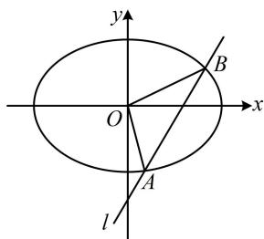
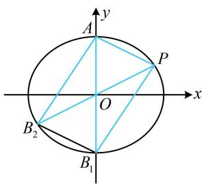
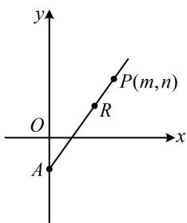
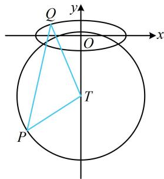
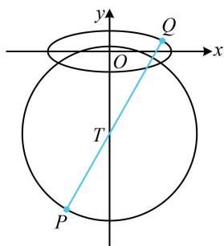
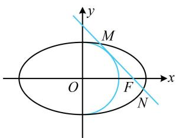
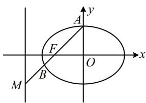
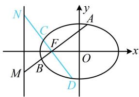
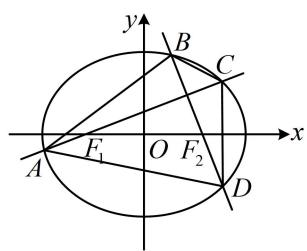
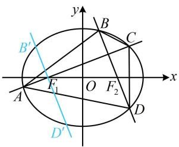

# 强化训练

##### 1. (2025·全国Ⅱ卷·★★★)

已知椭圆 $C: \frac{x^2}{a^2} + \frac{y^2}{b^2} = 1 (a > b > 0)$ 的离心率为 $\frac{\sqrt{2}}{2}$ ，长轴长为4.

（1） 求 C 的方程;  
（2）过点 $(0, - 2)$ 的直线 $l$ 与 $C$ 交于 $A$ ， $B$ 两点， $O$ 为坐标原点．若 $\triangle OAB$ 的面积为 $\sqrt{2}$ ，求 $|AB|$

##### 1. 解：（1）由题意，椭圆的长轴长 $2a = 4$ ，所以 $a = 2$

又椭圆的离心率 $e = \frac{\sqrt{a^2 - b^2}}{a} = \frac{\sqrt{2}}{2}$

化简得： $b=\frac{\sqrt{2}}{2}a=\sqrt{2}$ ，所以 C 的方程为 $\frac{x^{2}}{4}+\frac{y^{2}}{2}=1$ .

（2）（所求为 $|AB|$ ，可联立直线 $l$ 与椭圆的方程，用弦长公式来算，直线 $AB$ 过点 $(0, -2)$ ，还差斜率就能写出其方程，故设斜率，下面考虑看斜率不存在的情况）

当直线 l 斜率不存在时，A, O, B 三点共线，不构成三角形，不合题意；

当直线 l 斜率存在时，设 l 的斜率为 k，结合 l 过点 $(0,-2)$ 可得 l 的方程为 y=kx-2，设 $A(x_{1},y_{1})$ ， $B(x_{2},y_{2})$ ，

联立 $\left\{ \begin{array}{l} y = kx - 2 \\ \frac{x^2}{4} + \frac{y^2}{2} = 1 \end{array} \right.$ 消去 $y$ 整理得： $(1 + 2k^2)x^2 - 8kx + 4 = 0$

判别式 $\Delta = (-8k)^2 - 4(1 + 2k^2) \cdot 4 = 16(2k^2 - 1) > 0$

所以 $k < -\frac{\sqrt{2}}{2}$ 或 $k > \frac{\sqrt{2}}{2}$ ,

由弦长公式， $\left|AB\right|=\sqrt{1+k^{2}}\cdot\left|x_{1}-x_{2}\right|$

$= \sqrt {1 + k ^ {2}} \cdot \frac {\sqrt {1 6 (2 k ^ {2} - 1)}}{\left| 1 + 2 k ^ {2} \right|} = \sqrt {1 + k ^ {2}} \cdot \frac {4 \sqrt {2 k ^ {2} - 1}}{1 + 2 k ^ {2}} \quad ①,$

（求 $|AB|$ 还差 k，题干给出了 $\triangle OAB$ 的面积，可以 AB 为底，点 O 到直线 l 的距离为高，计算该面积，建立方程求 k）直线 l 的方程可化为 kx - y - 2 = 0，所以点 O 到直线 l 的距离 $d = \frac{|-2|}{\sqrt{k^2 + (-1)^2}} = \frac{2}{\sqrt{k^2 + 1}}$ ，

所以 $S_{\triangle OAB} = \frac{1}{2}\big|AB\big|\cdot d = \frac{1}{2}\times \sqrt{1 + k^2}\cdot \frac{4\sqrt{2k^2 - 1}}{1 + 2k^2}\times \frac{2}{\sqrt{k^2 + 1}}$

$= \frac{4\sqrt{2k^2 - 1}}{1 + 2k^2}$ ，由题意， $S_{\triangle OAB} = \sqrt{2}$

所以 $\frac{4\sqrt{2k^2 - 1}}{1 + 2k^2} = \sqrt{2}$ ，解得： $k^2 = \frac{3}{2}$ ，满足 $k < -\frac{\sqrt{2}}{2}$ 或

$k > \frac{\sqrt{2}}{2}$ ，代入①得 $\left|AB\right| = \sqrt{1 + \frac{3}{2}} \times \frac{4\sqrt{2 \times \frac{3}{2} - 1}}{1 + 2 \times \frac{3}{2}} = \sqrt{5}$ .

##### 2. (2024·新课标Ⅰ卷·★★★☆)

已知 $A(0,3)$ 和 $P\left(3,\frac{3}{2}\right)$ 为椭圆 $C:\frac{x^2}{a^2} +\frac{y^2}{b^2} = 1(a > b > 0)$ 上两点.

（1） 求 C 的离心率;  
（2） 若过 $P$ 的直线 $l$ 交 $C$ 于另一点 $B$ , 且 $\triangle ABP$ 的面积为 9, 求 $l$ 的方程.

##### 2. 解: （1） 由题意, $A(0,3)$ 在椭圆 $C$ 上, 所以 $b = 3$ ,

又 $P\left(3, \frac{3}{2}\right)$ 在椭圆 $C$ 上，所以 $\frac{9}{a^2} + \frac{9}{4b^2} = 1$

结合 $b = 3$ 得 $a = 2\sqrt{3}$ ，所以 $C$ 的离心率 $e = \frac{\sqrt{a^2 - b^2}}{a} = \frac{1}{2}$

（2）解法1：（计算 $S_{\triangle ABP}$ 可用 $BP$ 为底，点 $A$ 到直线 $BP$ 的距离为高，故设直线 $BP$ 的斜率，用弦长公式计算 $\vert BP\vert$ ，下面先考虑斜率不存在的情况）

当直线 $l$ 斜率不存在时，其方程为 $x = 3$ ，所以点 $A$ 到直线 $BP$ 的距离为3，

又由对称性可知 $B\left(3, - \frac{3}{2}\right)$ ，所以 $\left|BP\right| = \frac{3}{2} -\left(-\frac{3}{2}\right) = 3$

故 $S_{\triangle ABP} = \frac{1}{2}\times 3\times 3 = \frac{9}{2}\neq 9$ ，不合题意；

当直线 $l$ 斜率存在时，设 $l$ 的方程为 $y - \frac{3}{2} = k(x - 3)$

即 $y = kx + \frac{3}{2} - 3k$ ①，代入 $\frac{x^2}{12} + \frac{y^2}{9} = 1$ 整理得：

$(3 + 4 k ^ {2}) x ^ {2} + 4 k (3 - 6 k) x + 3 6 k ^ {2} - 3 6 k - 2 7 = 0 \quad ②,$

（注意到 $P$ 的坐标是已知的，故结合韦达定理，可以求 $B$ 的坐标）由韦达定理， $x_{P}x_{B} = 3x_{B} = \frac{36k^{2} - 36k - 27}{3 + 4k^{2}}$

所以 $x_{B}=\frac{12k^{2}-12k-9}{3+4k^{2}}$ ,

故由弦长公式， $\left|BP\right|=\sqrt{1+k^{2}}\cdot\left|x_{P}-x_{B}\right|$

$= \sqrt {1 + k ^ {2}} \cdot \left| \frac {1 2 k ^ {2} - 1 2 k - 9}{3 + 4 k ^ {2}} - 3 \right| = \sqrt {1 + k ^ {2}} \cdot \frac {6 | 2 k + 3 |}{3 + 4 k ^ {2}},$

式①可化为 $2kx - 2y + 3 - 6k = 0$

所以点 $A$ 到直线 $BP$ 的距离 $d = \frac{|-2\times 3 + 3 - 6k|}{\sqrt{4k^2 + 4}} = \frac{3|1 + 2k|}{2\sqrt{k^2 + 1}}$

故 $S_{\triangle ABP} = \frac{1}{2}\big|BP\big|\cdot d = \frac{1}{2}\sqrt{1 + k^2}\cdot \frac{6\big|2k + 3\big|}{3 + 4k^2}\cdot \frac{3\big|1 + 2k\big|}{2\sqrt{k^2 + 1}}$

$= \frac{9\left|4k^2 + 8k + 3\right|}{2(3 + 4k^2)}$ ，由题意， $\frac{9\left|4k^2 + 8k + 3\right|}{2(3 + 4k^2)} = 9$

所以 $4k^{2} + 8k + 3 = 2(3 + 4k^{2})$ 或 $4k^{2} + 8k + 3 = -2(3 + 4k^{2})$

解得： $k=\frac{1}{2}$ 或 $\frac{3}{2}$ ，经检验，满足方程②的判别式 $\Delta>0$ ，

代入①化简得直线 l 的方程为 x-2y=0 或 3x-2y-6=0.

【解法2】: (如图, 仔细观察会发现, 当 $B$ 与图中 $B_{1}$ 重合时, $\triangle ABP$ 的面积恰好为9, 所以这是满足题意的一种情况, 我们先求解此时的直线 $BP$ 的方程)

由题意，当点 $B$ 与椭圆的下顶点 $B_{1}(0, - 3)$ 重合时，

$S_{\triangle ABP} = \frac{1}{2}\big|AB_1\big|\cdot d_{P - AB_1} = \frac{1}{2}\times 6\times 3 = 9$ （其中 $d_{P - AB_1}$ 表示点 $P$ 到直线 $AB_{1}$ 的距离），满足题意，

此时直线 $l$ 的斜率 $k = \frac{\frac{3}{2} - (-3)}{3 - 0} = \frac{3}{2}$

其方程为 $y - \frac{3}{2} = \frac{3}{2}(x - 3)$ ，化简得： $3x - 2y - 6 = 0$ ；

(那其它情况怎么找呢? 由于 $AP$ 的长是固定的, 所以换个角度, 我们以 $AP$ 为底, 则高也是固定的, 这意味着点 $B$ 只能在过 $B_{1}$ 且与 $AP$ 平行的直线上, 该直线与椭圆还有一个交点 $B_{2}$ , 所以 $B$ 与 $B_{2}$ 重合也可以)

如图，过 $B_{1}$ 作 $AP$ 的平行线交椭圆 $C$ 于另一点 $B_{2}$ ，则当 $B$ 与 $B_{2}$ 重合时，也有 $S_{\triangle ABP} = 9$

由对称性， $B_{2}\left(-3, - \frac{3}{2}\right)$ ，此时直线 $l$ 过原点，其斜率 $k = \frac{1}{2}$ ，所以 $l$ 的方程为 $y = \frac{1}{2} x$ ，化简得： $x - 2y = 0$

结合图形可知满足 $S_{\triangle ABP} = 9$ 的点 $B$ 只有 $B_{1}$ ， $B_{2}$ 两种情况，

所以 l 的方程为 3x - 2y - 6 = 0 或 x - 2y = 0.

##### 3. (2025·全国Ⅰ卷·★★★★)

设椭圆 $C: \frac{x^2}{a^2} + \frac{y^2}{b^2} = 1 (a > b > 0)$ 的离心率为 $\frac{2\sqrt{2}}{3}$ ，下顶点为 $A$ ，右顶点为 $B$ ， $|AB| = \sqrt{10}$ .

（1） 求 C 的方程;

（2） 已知动点 $P$ 不在 $y$ 轴上, 点 $R$ 在射线 $A P$

上，且满足 $|AR|\cdot|AP|=3$ .

(i) 设 $P(m, n)$ ，求点 $R$ 的坐标（用 $m, n$ 表示）；

（ii）设 O 为坐标原点，Q 是 C 上的动点，直线 OR 的斜率为直线 OP 的斜率的 3 倍，求 $\left|PQ\right|$ 的最大值.

##### 3. 解: （1） 椭圆的下顶点为 $A(0, -b)$ , 右顶点为 $B(a, 0)$ ,

所以 $\left|AB\right|=\sqrt{(0-a)^{2}+(-b-0)^{2}}=\sqrt{a^{2}+b^{2}}$ ，

又 $|AB|=\sqrt{10}$ ，所以 $\sqrt{a^{2}+b^{2}}=\sqrt{10}$ ，故 $a^{2}+b^{2}=10$ ①，

因为椭圆 $C$ 的离心率为 $\frac{2\sqrt{2}}{3}$ ，所以 $\frac{\sqrt{a^2 - b^2}}{a} = \frac{2\sqrt{2}}{3}$ ，

化简得： $a = 3b$ ，结合①可解得： $a = 3$ ， $b = 1$

所以椭圆 $C$ 的方程为 $\frac{x^2}{9} + y^2 = 1$ .

（2） (i) 解法 1: (如图 1, A, P 的坐标已知, A, R, P 三点又共线, 于是可设 $\overrightarrow{AR} = \lambda \overrightarrow{AP}$ , 只要求出 $\lambda$ , 就能得到 $\overrightarrow{AR}$ 的坐标, 那么 $R$ 的坐标也就有了, 怎样求 $\lambda$ ? 可翻译 $|AR| \cdot |AP| = 3$ 建立关于 $\lambda$ 的方程并求解)

由（1）可得 $A(0, - 1)$ ，所以 $\overrightarrow{AP} = (m,n + 1)$

设 $R(x_{R},y_{R})$ ，则 $\overrightarrow{AR} = (x_R,y_R + 1)$

由图1可知 $\overrightarrow{AR}$ 与 $\overrightarrow{AP}$ 同向，所以可设 $\overrightarrow{AR} = \lambda \overrightarrow{AP} (\lambda >0)$ ，则 $\overrightarrow{AR}\cdot \overrightarrow{AP} = \lambda \overrightarrow{AP}\cdot \overrightarrow{AP} = \lambda \overrightarrow{AP} ^2 = \lambda [m^2 +(n + 1)^2 ]$ ②，

又 $\overrightarrow{AR} \cdot \overrightarrow{AP} = |\overrightarrow{AR}| \cdot |\overrightarrow{AP}| \cdot \cos 0^{\circ} = |\overrightarrow{AR}| \cdot |\overrightarrow{AP}| = |AR| \cdot |AP|$ ,

且由题意， $\left|AR\right|\cdot\left|AP\right|=3$ ，所以 $\overrightarrow{AR}\cdot\overrightarrow{AP}=3$ ，

结合②得 $\lambda [m^2 +(n + 1)^2 ] = 3$ ，所以 $\lambda = \frac{3}{m^2 + (n + 1)^2}$

因为 $\overrightarrow{AR} = \lambda \overrightarrow{AP}$ ，所以 $(x_{R},y_{R} + 1) = \lambda (m,n + 1)$

故 $\left\{\begin{aligned}x_{R}&=\lambda m\\ y_{R}&+1=\lambda(n+1)\end{aligned}\right.$

结合 $\lambda = \frac{3}{m^2 + (n + 1)^2}$ 可得 $\left\{ \begin{array}{l} x_R = \frac{3m}{m^2 + (n + 1)^2} \\ y_R = \frac{3(n + 1)}{m^2 + (n + 1)^2} - 1 \end{array} \right.$

所以 $R$ 的坐标为 $\left(\frac{3m}{m^2 + (n + 1)^2}, \frac{3(n + 1)}{m^2 + (n + 1)^2} - 1\right)$ .

【解法2】: (核心是求 $\overrightarrow{AR}$ 的坐标, 注意到 $|\overrightarrow{AR}|$ 容易由 $|AR|$ .

$\left|AP\right|=3$ 求得，而 $\overrightarrow{AR}=\left|\overrightarrow{AR}\right|\cdot\frac{\overrightarrow{AP}}{\left|\overrightarrow{AP}\right|}$ ，由此可求 $\overrightarrow{AR}$ 的坐标）

由题意， $\overrightarrow{AP} = (m,n + 1)$ ，所以与 $\overrightarrow{AP}$ 同向的单位向量为 $\frac{\overrightarrow{AP}}{\left|\overrightarrow{AP}\right|} = \left(\frac{m}{\sqrt{m^2 + (n + 1)^2}},\frac{n + 1}{\sqrt{m^2 + (n + 1)^2}}\right),$

因为 $\left|AR\right|\cdot\left|AP\right|=3$ ，所以 $\left|\overrightarrow{AR}\right|=\left|AR\right|=\frac{3}{\left|AP\right|}$

$= \frac{3}{\sqrt{m^2 + (n + 1)^2}}$ ，由图1可知 $\overrightarrow{AR}$ 与 $\overrightarrow{AP}$ 同向，

所以 $\overrightarrow{AR} = |\overrightarrow{AR} |\cdot \frac{\overrightarrow{AP}}{|\overrightarrow{AP}|}$

$= \frac {3}{\sqrt {m ^ {2} + (n + 1) ^ {2}}} \left(\frac {m}{\sqrt {m ^ {2} + (n + 1) ^ {2}}}, \frac {n + 1}{\sqrt {m ^ {2} + (n + 1) ^ {2}}}\right)$

$= \left(\frac {3 m}{m ^ {2} + (n + 1) ^ {2}}, \frac {3 (n + 1)}{m ^ {2} + (n + 1) ^ {2}}\right),$

又 $\overrightarrow{AR} = (x_R, y_R + 1)$ ，所以 $\left\{ \begin{array}{l} x_R = \frac{3m}{m^2 + (n + 1)^2} \\ y_R + 1 = \frac{3(n + 1)}{m^2 + (n + 1)^2} \end{array} \right.$ ，

从而 $\left\{ \begin{array}{l} x_{R} = \frac{3m}{m^{2} + (n + 1)^{2}} \\ y_{R} = \frac{3(n + 1)}{m^{2} + (n + 1)^{2}} - 1 \end{array} \right.$

故 $R$ 的坐标为 $\left(\frac{3m}{m^2 + (n + 1)^2}, \frac{3(n + 1)}{m^2 + (n + 1)^2} - 1\right)$ .

(ii)（条件给出 $OR$ 的斜率是 $OP$ 斜率的3倍，已有 $R, P$ 的坐标，可先用坐标翻译此条件，看能得到什么）

由题意， $k_{OR} = 3k_{OP}$ ，所以 $\frac{\frac{3(n + 1)}{m^2 + (n + 1)^2} - 1}{\frac{3m}{m^2 + (n + 1)^2}} = 3\cdot \frac{n}{m}$

化简得： $m^2 +(n + 4)^2 = 18$ ，所以点 $P$ 在以 $T(0, - 4)$ 为圆心， $3\sqrt{2}$ 为半径的圆上，且 $P$ 不在 $y$ 轴上，

（如图2， $P$ ， $Q$ 都是动点，直接分析 $|PQ|$ 的最大值不易，考虑先取定一个，由于圆上动点到定点的距离最值更容易分析，故不妨先取定 $Q$ ，考虑 $P$ 在圆上运动的情形）

图1

图2

对 $C$ 上任意的点 $Q$ ，当 $P$ 在圆 $T$ 上运动时，由三角形两边之和大于第三边， $\left|PQ\right|\leq \left|TQ\right| + \left|TP\right| = \left|TQ\right| + 3\sqrt{2}$ ③，取等条件是点 $T$ 在线段 $PQ$ 上，

（再考虑 $Q$ 在椭圆上运动时， $\left|TQ\right|$ 的最大值，此时只有 $Q$ 是动点，可设 $Q$ 的坐标，表示 $\left|TQ\right|$ ，再分析最大值）设 $Q(x_0,y_0)$ ，则 $\left|TQ\right| = \sqrt{x_0^2 + (y_0 + 4)^2}$ ④，

（有 $x_0$ ， $y_{0}$ 两个变量，考虑消元，可利用椭圆的方程来消元，且注意到 $x_0$ 只有平方项，所以消 $x_0$ 比较方便）由点 $Q$ 在椭圆 $C$ 上得 $\frac{x_0^2}{9} + y_0^2 = 1$ ，所以 $x_0^2 = 9 - 9y_0^2$

代入④得 $\left|TQ\right|=\sqrt{9-9y_{0}^{2}+(y_{0}+4)^{2}}=\sqrt{-8y_{0}^{2}+8y_{0}+25}$

$= \sqrt {- 8 \left(y _ {0} - \frac {1}{2}\right) ^ {2} + 2 7},$

因为 $-1 \leq y_0 \leq 1$ ，所以当 $y_0 = \frac{1}{2}$ 时， $|TQ|$ 取得最大值 $3\sqrt{3}$ ，

结合③得 $|PQ| \leq 3\sqrt{3} + 3\sqrt{2}$ ，

取等条件是 $y_0 = \frac{1}{2}$ ，且点 $T$ 在线段 $PQ$ 上，如图3，

此时 $P$ 不在 $y$ 轴上，满足题意，

所以 $|PQ|$ 的最大值是 $3\sqrt{3} + 3\sqrt{2}$ .

图3

【反思】不一定看到长度就要用弦长公式翻译,例如本题翻译 $|AR|\cdot|AP|=3$ 这个条件时,就没有用弦长公式,而是根据 $\overrightarrow{AR}$ 与 $\overrightarrow{AP}$ 同向,将 $|AR|\cdot|AP|$ 转化成 $\overrightarrow{AR}\cdot\overrightarrow{AP}$ 来处理(解法1),或用两点距离公式计算 $|AP|$ ,再得到 $|AR|$ (解法2),所以具体问题要具体分析.

# 4. (2021·新高考II卷·★★★☆)

已知椭圆 $C$ 的方程为 $\frac{x^2}{a^2} +\frac{y^2}{b^2} = 1(a > b > 0)$ ，右焦点为 $F(\sqrt{2},0)$ ，离心率为 $\frac{\sqrt{6}}{3}$

（1） 求椭圆 C 的方程;

（2）设 $M$ ， $N$ 是椭圆 $C$ 上的两点，直线 $MN$ 与曲线 $x^{2} + y^{2} = b^{2}(x > 0)$ 相切．证明： $M$ ， $N$ ， $F$ 三点共线的充要条件是 $\left|MN\right| = \sqrt{3}$ ：

##### 4. 解：（1）因为椭圆 $C$ 的右焦点为 $F(\sqrt{2}, 0)$ ，所以其半焦距

$c=\sqrt{2}$ ，又离心率 $e=\frac{c}{a}=\frac{\sqrt{6}}{3}$ ，所以 $a=\sqrt{3}$ ，

从而 $b^{2} = a^{2} - c^{2} = 1$ ，故椭圆 $C$ 的方程为 $\frac{x^2}{3} +y^2 = 1$

（2） (条件给出直线 $MN$ 与曲线 $x^{2} + y^{2} = b^{2}(x > 0)$ 相切, 该曲线是半圆, 可用圆心到直线 $MN$ 的距离等于半径来翻译, 故先设直线 $MN$ 的方程. 由于要证的结论中的 $F$ 在 $x$ 轴上, 故考虑设横截式)

由（1）知所给曲线即为 $x^{2} + y^{2} = 1(x > 0)$ ，过 $F$ 且 $\perp y$ 轴的直线不与该曲线相切，故可设 $MN$ 的方程为 $x = my + t$ 如图，直线 $MN$ 与右半圆 $x^{2} + y^{2} = 1(x > 0)$ 相切，应有 $t > 0$

且 $\frac{|t|}{\sqrt{m^2 + 1}} = 1$ ，整理得： $t^2 = m^2 +1$ ①，

（下面先证充分性，应以 $|MN| = \sqrt{3}$ 为条件，证 $M, N, F$ 三点共线，故将直线 $MN$ 代入椭圆 $C$ 的方程，用弦长公式求 $|MN|$ ）将 $x = my + t$ 代入 $\frac{x^2}{3} + y^2 = 1$ 消去 $x$ 整理得：

$(m ^ {2} + 3) y ^ {2} + 2 m t y + t ^ {2} - 3 = 0,$

判别式 $\Delta = 4m^2 t^2 - 4(m^2 + 3)(t^2 - 3) = 12(m^2 + 3 - t^2)$ ，

将式①代入可得 $\Delta=12(m^{2}+3-m^{2}-1)=24>0$

设 $M(x_{1},y_{1})$ ， $N(x_{2},y_{2})$ ，则由弦长公式，

$\left| M N \right| = \sqrt {1 + m ^ {2}} \cdot \left| y _ {1} - y _ {2} \right| = \sqrt {1 + m ^ {2}} \cdot \frac {\sqrt {2 4}}{m ^ {2} + 3},$

因为 $|MN|=\sqrt{3}$ ，所以 $\sqrt{1+m^{2}}\cdot\frac{\sqrt{24}}{m^{2}+3}=\sqrt{3}$ ，故 $m^{2}=1$ ，

代入①结合 t > 0 可得 $t = \sqrt{2}$ ，

所以直线 $MN$ 的方程为 $x = my + \sqrt{2}$

从而直线 MN 过点 $F(\sqrt{2},0)$ ,

故 $M, N, F$ 三点共线，充分性成立；（再证必要性，应以 $M, N, F$ 三点共线为条件，证明 $\left|MN\right| = \sqrt{3}$ ）

因为 $M, N, F$ 三点共线，所以直线 $MN$ 过点 $F(\sqrt{2}, 0)$ ，

代入 $x = my + t$ 可得 $t = \sqrt{2}$ ，结合式①可得 $m = \pm 1$

所以直线 MN 的方程为 $x = \pm y + \sqrt{2}$ ，

代入 $\frac{x^2}{3} + y^2 = 1$ 消去 $x$ 整理得： $4y^{2} \pm 2\sqrt{2} y - 1 = 0$

判别式 $\Delta'=(\pm2\sqrt{2})^{2}-4\times4\times(-1)=24>0$

由弦长公式， $\left|MN\right|=\sqrt{1+(\pm1)^{2}}\cdot\left|y_{1}-y_{2}\right|=\sqrt{2}\times\frac{\sqrt{24}}{4}=\sqrt{3}$

必要性成立；

综上所述， $M$ ， $N$ ， $F$ 三点共线的充要条件是 $\left|MN\right| = \sqrt{3}$

##### 5. (2023·江苏苏北七市二调·★★★★)

已知椭圆 $E: \frac{x^2}{a^2} + \frac{y^2}{b^2} = 1 (a > b > 0)$ 的离心率为 $\frac{\sqrt{2}}{2}$ ，焦距为 2，过 $E$ 的左焦点 $F$ 的直线 $l$ 与 $E$ 相交于 $A$ ， $B$ 两点，与直线 $x = -2$ 相交于点 $M$ .

（1）若 $M(-2, - 1)$ ，求证： $\left|MA\right|\cdot \left|BF\right| = \left|MB\right|\cdot \left|AF\right|$   
（2）过点 $F$ 作直线 $l$ 的垂线 $m$ 与 $E$ 相交于 $C, D$ 两点，与直线 $x = -2$ 相交于点 $N$ . 求 $\frac{1}{|MA|} + \frac{1}{|MB|} + \frac{1}{|NC|} + \frac{1}{|ND|}$ 的最大值.

##### 5. 解：（1）因为椭圆 $E$ 的焦距 $2c = 2$ ，所以 $c = 1$ ， $F(-1,0)$

又离心率 $e = \frac{c}{a} = \frac{\sqrt{2}}{2}$ ，所以 $a = \sqrt{2}$ ，故 $b = \sqrt{a^2 - c^2} = 1$

(如图 1, 已知 $F$ 和 $M$ , 可写出直线 $l$ 的方程, 代入椭圆方程, 求得交点坐标, 再证结论)

因为 $M(-2, - 1)$ ，所以直线 $l$ 的斜率为 $\frac{-1 - 0}{-2 - (-1)} = 1$

故 $l$ 的方程为 $y = x + 1$ ，代入 $\frac{x^2}{2} + y^2 = 1$ 消去 $y$ 整理得：

$3x^{2} + 4x = 0$ ，解得： $x = 0$ 或 $-\frac{4}{3}$

(有直线 l 的斜率，可按弦长公式 $\sqrt{1+k^{2}}\cdot\left|x_{1}-x_{2}\right|$ 计算有关长度，故无需再求 A, B 的纵坐标)

不妨设 $A$ 的横坐标为0，则 $B$ 的横坐标为 $-\frac{4}{3}$

由弦长公式， $\left|MA\right|=\sqrt{1+1^{2}}\cdot\left|-2-0\right|=2\sqrt{2}$ ，

$\begin{array}{l} \left| B F \right| = \sqrt {1 + 1 ^ {2}} \cdot \left| - \frac {4}{3} - (- 1) \right| = \frac {\sqrt {2}}{3}, \quad \left| M B \right| = \sqrt {1 + 1 ^ {2}} \cdot \left| - 2 - \left(- \frac {4}{3}\right) \right| \\ = \frac {2 \sqrt {2}}{3}, \quad | A F | = \sqrt {1 + 1 ^ {2}} \cdot | 0 - (- 1) | = \sqrt {2}, \\ \end{array}$

所以 $\left|MA\right|\cdot\left|BF\right|=\frac{4}{3}$ ， $\left|MB\right|\cdot\left|AF\right|=\frac{4}{3}$ ，

故 $\left|MA\right|\cdot\left|BF\right|=\left|MB\right|\cdot\left|AF\right|$ .

图1

图2

（2）（如图2，求 $|MA|$ ， $|MB|$ ， $|NC|$ ， $|ND|$ 可用弦长公式 $\sqrt{1+k^{2}}\cdot|x_{1}-x_{2}|$ ，需要直线的斜率和有关点的坐标，故先把这些设出来）

设 $A(x_{1},y_{1})$ ， $B(x_{2},y_{2})$ ，因为 $AB$ 及其垂线都与直线 $x = -2$ 相交，所以直线 $AB$ 斜率存在且不为0，故可设直线 $AB$ 的斜率为 $k(k\neq 0)$ ，

因为 $CD \perp AB$ ，所以直线 $CD$ 的斜率为 $-\frac{1}{k}$

由弦长公式， $\left|MA\right|=\sqrt{1+k^{2}}\cdot\left|-2-x_{1}\right|=\sqrt{1+k^{2}}(x_{1}+2)$ ，

同理， $\left|MB\right|=\sqrt{1+k^{2}}\left(x_{2}+2\right)$

所以 $\frac{1}{|MA|} +\frac{1}{|MB|} = \frac{1}{\sqrt{1 + k^2}(x_1 + 2)} +\frac{1}{\sqrt{1 + k^2}(x_2 + 2)}$

$= \frac {x _ {1} + x _ {2} + 4}{\sqrt {1 + k ^ {2}} (x _ {1} + 2) (x _ {2} + 2)} = \frac {x _ {1} + x _ {2} + 4}{\sqrt {1 + k ^ {2}} [ x _ {1} x _ {2} + 2 (x _ {1} + x _ {2}) + 4 ]} \tag {①}$

(看到 $x_{1} + x_{2}$ 和 $x_{1}x_{2}$ , 想到将直线 $AB$ 的方程代入椭圆 $E$ 的方程, 结合韦达定理来算它们)

直线 $AB$ 的方程为 $y = k(x + 1)$ ，代入 $\frac{x^2}{2} + y^2 = 1$ 消去 $y$ 整理得： $(2k^2 + 1)x^2 + 4k^2x + 2k^2 - 2 = 0$

判别式 $\Delta = 16k^4 - 4(2k^2 + 1)(2k^2 - 2) = 8(k^2 + 1) > 0$

由韦达定理， $x_{1} + x_{2} = -\frac{4k^{2}}{2k^{2} + 1}, x_{1}x_{2} = \frac{2k^{2} - 2}{2k^{2} + 1}$

代入①得： $\frac{1}{|MA|} +\frac{1}{|MB|} = \frac{-\frac{4k^2}{2k^2 + 1} + 4}{\sqrt{1 + k^2}\left[\frac{2k^2 - 2}{2k^2 + 1} + 2\left(-\frac{4k^2}{2k^2 + 1}\right) + 4\right]}$

$= \frac {4 k ^ {2} + 4}{\sqrt {1 + k ^ {2}} (2 k ^ {2} + 2)} = \frac {2}{\sqrt {1 + k ^ {2}}} \quad ②,$

(要再求一遍 $\frac{1}{|NC|} + \frac{1}{|ND|}$ 吗? 不用, 因为 $AB$ 与 $CD$ 仅斜率不同, 故直接将②的 $k$ 换成 $-\frac{1}{k}$ 即得 $\frac{1}{|NC|} + \frac{1}{|ND|}$ )

同理， $\frac{1}{|NC|} +\frac{1}{|ND|} = \frac{2}{\sqrt{1 + \left(-\frac{1}{k}\right)^2}} = \frac{2|k|}{\sqrt{k^2 + 1}}$ ③，

结合②③得 $\frac{1}{|MA|} +\frac{1}{|MB|} +\frac{1}{|NC|} +\frac{1}{|ND|} = \frac{2}{\sqrt{1 + k^2}} +\frac{2|k|}{\sqrt{1 + k^2}}$

$= \frac {2 (1 + | k |)}{\sqrt {1 + k ^ {2}}} = 2 \sqrt {\frac {(1 + | k |) ^ {2}}{1 + k ^ {2}}} = 2 \sqrt {\frac {1 + 2 | k | + k ^ {2}}{1 + k ^ {2}}} = 2 \sqrt {1 + \frac {2 | k |}{1 + k ^ {2}}}$

$= 2 \sqrt {1 + \frac {2}{\frac {1}{| k |} + | k |}} \leq 2 \sqrt {1 + \frac {2}{2 \sqrt {\frac {1}{| k |} \cdot | k |}}} = 2 \sqrt {2},$

当且仅当 $\frac{1}{|k|} = |k|$ ，即 $k = \pm 1$ 时取等号，

所以 $\frac{1}{|MA|} +\frac{1}{|MB|} +\frac{1}{|NC|} +\frac{1}{|ND|}$ 的最大值为 $2\sqrt{2}$

##### 6. (2024·江苏泰州模拟·★★★★)

已知椭圆 $W: \frac{x^2}{a^2} + \frac{y^2}{b^2} = 1 (a > b > 0)$ 的左、右焦点分别为 $F_1$ ， $F_2$ ，且 $\left|F_1F_2\right| = 2$ ，椭圆上一动点 $P$ 满足 $\left|PF_1\right| + \left|PF_2\right| = 2\sqrt{3}$ .

（1）求椭圆 W 的标准方程及离心率；

（2）如图，过点 $F_{1}$ 作直线 $l_{1}$ 与椭圆 $W$ 交于点 $A, C$ ，过点 $F_{2}$ 作直线 $l_{2} \perp l_{1}$ ，且 $l_{2}$ 与椭圆 $W$ 交于点 $B, D$ ，试求四边形ABCD面积的最大值.

##### 6. 解：（1）由题意， $\left|F_{1}F_{2}\right|=2c=2$ ，所以 c=1，

又 $\left|PF_1\right| + \left|PF_2\right| = 2a = 2\sqrt{3}$ ，所以 $a = \sqrt{3}$

从而 $b = \sqrt{a^2 - c^2} = \sqrt{2}$ ，故椭圆 $W$ 的方程为 $\frac{x^2}{3} +\frac{y^2}{2} = 1$

离心率 $e = \frac{c}{a} = \frac{1}{\sqrt{3}} = \frac{\sqrt{3}}{3}$

（2） (四边形 $ABCD$ 对角线垂直, 可按 $S = \frac{1}{2} |AC| \cdot |BD|$ 求其面积, 故设直线 $AC$ 和 $BD$ 的方程, 用弦长公式计算 $|AC|$ , $|BD|$ , 直线 $AC$ , $BD$ 过 $x$ 轴上定点, 一般设横截式, 故先考虑斜率为 0 的情况)

由题意可知， $F_{1}(-1,0)$ ， $F_{2}(1,0)$ ，

当直线 $l_{1} \perp y$ 轴时， $l_{2} \perp x$ 轴，此时 $\left|AC\right| = 2a = 2\sqrt{3}$ ，

直线 $l_{2}$ 的方程为 $x = 1$ ，代入 $\frac{x^2}{3} +\frac{y^2}{2} = 1$ 可求得 $y = \pm \frac{2\sqrt{3}}{3}$

所以 $\left|BD\right|=\frac{4\sqrt{3}}{3}$ ， $S_{ABCD}=\frac{1}{2}\left|AC\right|\cdot\left|BD\right|=\frac{1}{2}\times2\sqrt{3}\times\frac{4\sqrt{3}}{3}=4$ ，

由对称性可知当 $l_{1} \perp x$ 轴， $l_{2} \perp y$ 轴时，也有 $S_{ABCD} = 4$

当 $l_{1}$ ， $l_{2}$ 都不与x轴，y轴垂直时，

设 $l_{1}$ 的方程为 $x=my-1(m\neq0)$ ,

代入 $\frac{x^2}{3} +\frac{y^2}{2} = 1$ 消去 $x$ 整理得： $(2m^{2} + 3)y^{2} - 4my - 4 = 0$

判别式 $\Delta = (-4m)^2 - 4(2m^2 + 3) \cdot (-4) = 48(m^2 + 1) > 0$

设 $A(x_{1},y_{1})$ ， $C(x_{2},y_{2})$ ，则 $\left|AC\right| = \sqrt{1 + m^2}\cdot \left|y_1 - y_2\right|$

$= \sqrt {1 + m ^ {2}} \cdot \frac {\sqrt {4 8 (m ^ {2} + 1)}}{2 m ^ {2} + 3} = \frac {4 \sqrt {3} (m ^ {2} + 1)}{2 m ^ {2} + 3},$

（再求 $|BD|$ ，要重新计算一遍吗？不用，直线 BD 的方程为 $x = -\frac{1}{m}y + 1$ ，如图，由对称性， $|BD| = |B'D'|$ ，其中 $B'D' : x = -\frac{1}{m}y - 1$ ，它与 AC 的差异只是把 m 换成了 $-\frac{1}{m}$ ，其它都一样，所以在 $|AC|$ 的结果中将 m 换成 $-\frac{1}{m}$ 就能得到 $|B'D'|$ ，于是 $\left|BD\right| = \frac{4\sqrt{3}\left[\left(-\frac{1}{m}\right)^2 + 1\right]}{2\left(-\frac{1}{m}\right)^2 + 3} = \frac{4\sqrt{3}(1 + m^2)}{2 + 3m^2}$ 。这是我们分析得出的结果，作答时，直接写同理就行了）

同理， $\left|BD\right|=\frac{4\sqrt{3}(1+m^{2})}{2+3m^{2}}$ ，所以 $S_{ABCD}=\frac{1}{2}\left|AC\right|\cdot\left|BD\right|$

$= \frac {1}{2} \times \frac {4 \sqrt {3} (m ^ {2} + 1)}{2 m ^ {2} + 3} \times \frac {4 \sqrt {3} (1 + m ^ {2})}{2 + 3 m ^ {2}} = \frac {2 4 (m ^ {2} + 1) ^ {2}}{(2 m ^ {2} + 3) (2 + 3 m ^ {2})},$

(怎样求上式的最值？不妨把分母展开，观察它与分子的联系)

$S _ {A B C D} = \frac {2 4 (m ^ {2} + 1) ^ {2}}{6 m ^ {4} + 1 3 m ^ {2} + 6} = \frac {2 4 (m ^ {2} + 1) ^ {2}}{6 (m ^ {2} + 1) ^ {2} + m ^ {2}} = \frac {2 4}{6 + \frac {m ^ {2}}{(m ^ {2} + 1) ^ {2}}} ,$

因为 $\frac{m^2}{(m^2 + 1)^2} > 0$ ，所以 $6 + \frac{m^2}{(m^2 + 1)^2} > 6$

故 $0 < S_{ABCD} = \frac{24}{6 + \frac{m^2}{(m^2 + 1)^2}} < 4$

综上所述，四边形ABCD面积的最大值为4.

