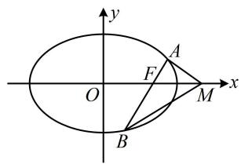
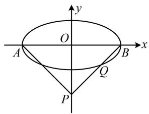
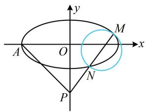
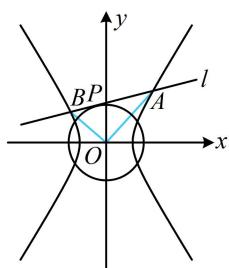
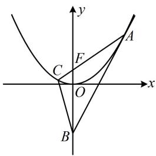

# 强化训练

##### 1. (2018·新课标Ⅰ卷·★★★☆)

设椭圆 $C: \frac{x^2}{2} + y^2 = 1$ 的右焦点为 $F$ ，过 $F$ 的直线 $l$ 与 $C$ 交于 $A$ ， $B$ 两点，点 $M$ 的坐标为 $(2,0)$ .

（1）当 $l$ 与 $x$ 轴垂直时，求直线 $AM$ 的方程；  
（2）设 $O$ 为坐标原点，证明： $\angle OMA = \angle OMB$

##### 1. 解: （1） (已有 $M$ 的坐标, 只需联立直线 $l$ 与椭圆的方程,

求出 $A$ 的坐标, 就能写出 $A M$ 的方程)

由题意， $F(1,0)$ ，当 $l\bot x$ 轴时， $l$ 的方程为 $x = 1$

由 $\left\{ \begin{array}{l} x = 1 \\ \frac{x^2}{2} + y^2 = 1 \end{array} \right.$ 得 $y = \pm \frac{\sqrt{2}}{2}$ ，所以点 $A$ 的坐标为 $\left(1, \pm \frac{\sqrt{2}}{2}\right)$ ，

当点 $A$ 的坐标为 $\left(1, \frac{\sqrt{2}}{2}\right)$ 时， $k_{AM} = \frac{\frac{\sqrt{2}}{2} - 0}{1 - 2} = -\frac{\sqrt{2}}{2}$ ，

所以 $AM$ 的方程为 $y = -\frac{\sqrt{2}}{2} (x - 2)$ ，即 $y = -\frac{\sqrt{2}}{2} x + \sqrt{2}$ ，

当点 $A$ 的坐标为 $\left(1, -\frac{\sqrt{2}}{2}\right)$ 时， $k_{AM} = \frac{-\frac{\sqrt{2}}{2} - 0}{1 - 2} = \frac{\sqrt{2}}{2}$ ，

所以 $AM$ 的方程为 $y = \frac{\sqrt{2}}{2} (x - 2)$ ，即 $y = \frac{\sqrt{2}}{2} x - \sqrt{2}$ ，

综上所述，直线 $AM$ 的方程为 $y = -\frac{\sqrt{2}}{2} x + \sqrt{2}$ 或

$y = \frac {\sqrt {2}}{2} x - \sqrt {2}.$

（2） 解法 1: (如图, $\angle OMA = \angle OMB$ 意味着直线 $AM$ 和 $BM$ 的倾斜角互补, 即它们的斜率互为相反数, 故可按此证明结论. 计算斜率需要坐标, 于是先设坐标)

设 $A(x_{1},y_{1})$ ， $B(x_{2},y_{2})$ ，则 $k_{AM} + k_{BM} = \frac{y_1}{x_1 - 2} +\frac{y_2}{x_2 - 2}$

$= \frac {y _ {1} (x _ {2} - 2) + y _ {2} (x _ {1} - 2)}{(x _ {1} - 2) (x _ {2} - 2)} = \frac {x _ {1} y _ {2} + x _ {2} y _ {1} - 2 (y _ {1} + y _ {2})}{(x _ {1} - 2) (x _ {2} - 2)} \quad ①,$

(看到 $x_{1}y_{2} + x_{2}y_{1}$ 和 $y_{1} + y_{2}$ ，想到设直线 l 的方程，与椭圆联立，结合韦达定理计算它们，直线 l 过 x 轴上的定点，考虑设横截式方程，下面先考虑 $l \perp y$ 轴的情况)

当 $l \perp y$ 轴时， $A, B$ 为椭圆的两个长轴端点，

所以 $\angle OMA = \angle OMB = 0^{\circ}$

当 $l$ 不与 $y$ 轴垂直时，可设其方程为 $x = my + 1$

代入 $\frac{x^2}{2} + y^2 = 1$ 消去 $x$ 整理得： $(m^2 + 2)y^2 + 2my - 1 = 0$

判别式 $\Delta = 4m^2 - 4(m^2 + 2) \cdot (-1) = 8(m^2 + 1) > 0$

由韦达定理， $y_{1} + y_{2} = -\frac{2m}{m^{2} + 2}$ ， $y_{1}y_{2} = -\frac{1}{m^{2} + 2}$ ，

$x _ {1} y _ {2} + x _ {2} y _ {1} = (m y _ {1} + 1) y _ {2} + (m y _ {2} + 1) y _ {1} = 2 m y _ {1} y _ {2} + \left(y _ {1} + y _ {2}\right)$

$= 2 m \cdot \left(- \frac {1}{m ^ {2} + 2}\right) + \left(- \frac {2 m}{m ^ {2} + 2}\right) = - \frac {4 m}{m ^ {2} + 2},$

所以 $x_{1}y_{2} + x_{2}y_{1} - 2(y_{1} + y_{2}) = -\frac{4m}{m^{2} + 2} -2\left(-\frac{2m}{m^{2} + 2}\right) = 0$

代入①得 $k_{AM} + k_{BM} = 0$ ，所以 $\angle OMA = \angle OMB$

综上所述， $\angle OMA = \angle OMB$

【解法2】（按解法1得到 $k_{AM} + k_{BM} = \frac{y_1}{x_1 - 2} +\frac{y_2}{x_2 - 2}$ 后，由其结构特征想到可用齐次化思想来速算它．为了直接由韦达定理求出 $\frac{y_1}{x_1 - 2} +\frac{y_2}{x_2 - 2}$ ，在联立直线和椭圆方程时，应化成 $A\left(\frac{y}{x - 2}\right)^2 +B\cdot \frac{y}{x - 2} +C = 0$ 这种形式．由于目标结构是 $\frac{y}{x - 2}$ ，我们先把直线和椭圆方程中的 $x$ 凑成 $x - 2$ ）

当 $l \perp y$ 轴时， $A, B$ 为椭圆的两个长轴端点，

所以 $\angle OMA = \angle OMB = 0^{\circ}$

当 $l$ 不与 $y$ 轴垂直时，可设其方程为 $x = my + 1$

即 $(x - 2) - my = -1$ ，椭圆方程可化为 $\frac{[(x - 2) + 2]^2}{2} + y^2 = 1$

即 $(x - 2)^{2} + 4(x - 2) + 2y^{2} + 2 = 0$ ②，

（式②关于 $x - 2$ 和 $y$ 不齐次，应将一次项 $4(x - 2)$ 和常数项2也化为关于 $x - 2$ 和 $y$ 的二次式，可用 $(x - 2) - my = -1$ 来实现）结合 $(x - 2) - my = -1$ 可将式②化为

$(x - 2) ^ {2} - 4 [ (x - 2) - m y ] (x - 2) + 2 y ^ {2} + 2 (x - 2 - m y) ^ {2} = 0,$

整理得： $(2 + 2m^{2})y^{2} - (x - 2)^{2} = 0$

两端同除以 $(x - 2)^{2}$ 得 $(2 + 2m^{2})\left(\frac{y}{x - 2}\right)^{2} - 1 = 0$

因为 $M$ ， $N$ 的坐标满足上述方程，所以由韦达定理，

$\frac{y_{1}}{x_{1}-2}+\frac{y_{2}}{x_{2}-2}=\frac{0}{2+2m^{2}}=0$ ，从而 $k_{AM}+k_{BM}=0$ ，

故 $\angle OMA = \angle OMB$

综上所述， $\angle OMA = \angle OMB$ 。

##### 2.（2024·黑龙江哈尔滨模拟·★★★☆）

已知点 $A, B$ 分别为椭圆 $E: \frac{x^2}{a^2} + \frac{y^2}{b^2} = 1 (a > b > 0)$ 的左、右顶点，点 $P(0, -2)$ ，直线 $BP$ 交 $E$ 于点 $Q$ ， $\overrightarrow{PQ} = \frac{3}{2}\overrightarrow{QB}$ ，且 $\triangle ABP$ 是等腰直角三角形.

（1） 求椭圆 E 的方程;  
（2）设过点 $P$ 的直线 $l$ 与 $E$ 相交于 $M, N$ 两点，当坐标原点 $O$ 位于以 $MN$ 为直径的圆外时，求直线 $l$ 斜率的取值范围.

##### 2. 解: （1） 如图 1, 由题意, $\triangle ABP$ 是等腰直角三角形,

且 $P(0, -2)$ ，所以 $\left|OA\right| = \left|OB\right| = \left|OP\right| = 2$ ，故 $a = 2$ ，

（再求 $b$ ，条件 $\overrightarrow{PQ} = \frac{3}{2}\overrightarrow{QB}$ 怎样翻译？注意到 $P$ ， $B$ 坐标已知，故可由此求 $Q$ 的坐标，代入椭圆方程即可求 $b$ ）因为 $P(0, - 2)$ ， $B(2,0)$ ，所以 $\overrightarrow{PQ} = (x_Q,y_Q + 2)$

$\overrightarrow{QB} = (2 - x_{Q}, - y_{Q})$ ，由题意， $\overrightarrow{PQ} = \frac{3}{2}\overrightarrow{QB}$

所以 $\left\{ \begin{array}{l} x_{Q} = \frac{3}{2} (2 - x_{Q}) \\ y_{Q} + 2 = \frac{3}{2} (-y_{Q}) \end{array} \right.$ ，解得： $\left\{ \begin{array}{l} x_{Q} = \frac{6}{5} \\ y_{Q} = -\frac{4}{5} \end{array} \right.$ ，故 $Q\left(\frac{6}{5}, -\frac{4}{5}\right)$ ，

代入 $\frac{x^2}{a^2} +\frac{y^2}{b^2} = 1$ 得 $\frac{36}{25a^2} +\frac{16}{25b^2} = 1$ ，结合 $a = 2$ 可得 $b = 1$

所以椭圆 E 的方程为 $\frac{x^{2}}{4} + y^{2} = 1$ .

（2） (条件 “原点 O 位于以 MN 为直径的圆外” 可翻译为 $\overrightarrow{OM} \cdot \overrightarrow{ON} > 0$ ，故先求此数量积)

设 $M(x_{1},y_{1})$ ， $N(x_{2},y_{2})$ ，则 $\overrightarrow{OM} = (x_1,y_1)$ ， $\overrightarrow{ON} = (x_2,y_2)$

所以 $\overrightarrow{OM} \cdot \overrightarrow{ON} = x_{1}x_{2} + y_{1}y_{2}$ ①,

(看到 $x_{1}x_{2}$ 和 $y_{1}y_{2}$ ，想到设直线 l 的方程，与椭圆联立，结合韦达定理计算它们)

由题意，直线 $l$ 的斜率存在，设其方程为 $y = kx - 2$

代入 $\frac{x^2}{4} + y^2 = 1$ 消去 $y$ 整理得： $(1 + 4k^2)x^2 - 16kx + 12 = 0$

判别式 $\Delta = (-16k)^2 - 4(1 + 4k^2) \cdot 12 > 0$ ，所以 $k^2 > \frac{3}{4}$ ②，

由韦达定理， $x_{1} + x_{2} = \frac{16k}{1 + 4k^{2}}$ ， $x_{1}x_{2} = \frac{12}{1 + 4k^{2}}$

所以 $y_{1}y_{2} = (kx_{1} - 2)(kx_{2} - 2) = k^{2}x_{1}x_{2} - 2k(x_{1} + x_{2}) + 4$

$= \frac {1 2 k ^ {2}}{1 + 4 k ^ {2}} - \frac {3 2 k ^ {2}}{1 + 4 k ^ {2}} + 4 = \frac {4 - 4 k ^ {2}}{1 + 4 k ^ {2}},$

代入①得 $\overrightarrow{OM} \cdot \overrightarrow{ON} = \frac{12}{1 + 4k^2} + \frac{4 - 4k^2}{1 + 4k^2} = \frac{16 - 4k^2}{1 + 4k^2}$

因为原点 $O$ 在以 $MN$ 为直径的圆外，所以 $\overrightarrow{OM} \cdot \overrightarrow{ON} > 0$

从而 $\frac{16 - 4k^2}{1 + 4k^2} >0$ ，故 $k^2 < 4$ ，结合②得 $\frac{3}{4} < k^2 < 4$

所以 $-2 < k < -\frac{\sqrt{3}}{2}$ 或 $\frac{\sqrt{3}}{2} < k < 2$

故直线 $l$ 斜率的取值范围是 $\left(-2, -\frac{\sqrt{3}}{2}\right) \cup \left(\frac{\sqrt{3}}{2}, 2\right)$ .

图1

图2

##### 3. (2024·四川模拟·★★★☆)

已知双曲线 $C: \frac{x^2}{a^2} - \frac{y^2}{b^2} = 1 (a > 0, b > 0)$ 的离心率为 $\sqrt{3}$ ，且过点 $(\sqrt{2}, \sqrt{2})$ 。

（1） 求双曲线 C 的方程;  
（2）设直线 $l$ 是圆 $O: x^2 + y^2 = 2$ 上的动点 $P$ 处的切线， $l$ 与双曲线 $C$ 交于不同的两点 $A, B$ ，证明： $\angle AOB$ 的大小为定值.

##### 3. 解：（1）设双曲线 $C$ 的半焦距为 $c$ ，则 $c^2 = a^2 + b^2$

由题意， $\left\{ \begin{array}{l} \frac{c}{a} = \sqrt{3}\\  \frac{2}{a^2} -\frac{2}{b^2} = 1 \end{array} \right.$ ，解得： $a = 1$ ， $b = \sqrt{2}$ ， $c = \sqrt{3}$

所以双曲线 $C$ 的方程为 $x^{2} - \frac{y^{2}}{2} = 1$

（2） (稍微准确一点地画出图形如图, 由图可以猜想 $\angle AOB$ 为定值 $90^{\circ}$ , 故尝试证 $\overrightarrow{OA} \cdot \overrightarrow{OB} = 0$ . 求此数量积需要 $A, B$ 的坐标,于是先设坐标)

设 $A(x_{1},y_{1})$ ， $B(x_{2},y_{2})$ ，则 $\overrightarrow{OA} = (x_1,y_1)$ ， $\overrightarrow{OB} = (x_2,y_2)$

所以 $\overrightarrow{OA} \cdot \overrightarrow{OB} = x_{1}x_{2} + y_{1}y_{2}$ ①,

(由此想到设直线 l 的方程, 与双曲线联立, 结合韦达定理计算式①. 不妨设斜截式, 先考虑斜率不存在的情形)

当直线 $l \perp x$ 轴时，易得其方程为 $x = \sqrt{2}$ 或 $x = -\sqrt{2}$ ，

分别代入 $x^{2} - \frac{y^{2}}{2} = 1$ 可解得： $y = \pm \sqrt{2}$

所以 $\left\{ \begin{array}{l}x_{1} = \sqrt{2}\\ y_{1} = \sqrt{2} \end{array} \right.$ ， $\left\{ \begin{array}{l}x_2 = \sqrt{2}\\ y_2 = -\sqrt{2} \end{array} \right.$ 或 $\left\{ \begin{array}{l}x_{1} = -\sqrt{2}\\ y_{1} = \sqrt{2} \end{array} \right.$ ， $\left\{ \begin{array}{l}x_{2} = -\sqrt{2}\\ y_{2} = -\sqrt{2} \end{array} \right.$

代入①均有 $\overrightarrow{OA} \cdot \overrightarrow{OB} = x_{1}x_{2} + y_{1}y_{2} = 0$ ，所以 $\angle AOB = 90^{\circ}$ ;

当直线 $l$ 斜率存在时，可设其方程为 $y = kx + m$

将 $y = kx + m$ 代入 $2x^{2} - y^{2} = 2$ 消去 $y$ 整理得：

$(2 - k ^ {2}) x ^ {2} - 2 k m x - m ^ {2} - 2 = 0,$

因为 $l$ 与 $C$ 交于不同的两点，所以 $2 - k^{2} \neq 0$ 且判别式 $\Delta =$

$(- 2 k m) ^ {2} - 4 (2 - k ^ {2}) (- m ^ {2} - 2) = 8 (m ^ {2} + 2 - k ^ {2}) > 0 \quad ②,$

由韦达定理， $x_{1} + x_{2} = \frac{2km}{2 - k^{2}}$ ， $x_{1}x_{2} = -\frac{m^{2} + 2}{2 - k^{2}}$

所以 $y_{1}y_{2}=(kx_{1}+m)(kx_{2}+m)$

$= k ^ {2} x _ {1} x _ {2} + k m (x _ {1} + x _ {2}) + m ^ {2} = \frac {2 m ^ {2} - 2 k ^ {2}}{2 - k ^ {2}},$

故 $\overrightarrow{OA} \cdot \overrightarrow{OB} = x_{1}x_{2} + y_{1}y_{2}$

$= - \frac {m ^ {2} + 2}{2 - k ^ {2}} + \frac {2 m ^ {2} - 2 k ^ {2}}{2 - k ^ {2}} = \frac {m ^ {2} - 2 k ^ {2} - 2}{2 - k ^ {2}} \quad ③,$

(上式中有 $m$ 和 $k$ 两个变量, 要进一步计算, 需寻找 $m$ 和 $k$ 的关系, 还剩直线 $l$ 与圆 $O$ 相切没有翻译, 故翻译它)

由 $l$ 与圆 $O$ 相切得 $\frac{|m|}{\sqrt{k^2 + 1}} = \sqrt{2}$ ，所以 $m^2 = 2(k^2 + 1)$ ④，

将④代入②知满足 $\Delta > 0$ ，将④代入③可得

$\overrightarrow{OA} \cdot \overrightarrow{OB} = \frac{2(k^2 + 1) - 2k^2 - 2}{2 - k^2} = 0$ ，所以 $\angle AOB = 90^\circ$

综上所述， $\angle AOB$ 为定值 $90^{\circ}$ 。

# 4. (2024·浙江温州一模·★★★★)

已知抛物线 $x^{2} = 4y$ 的焦点为 $F$ ，抛物线上的点 $A(x_0,y_0)$ 处的切线为 $l$

（1）求 $l$ 的方程（用 $x_0$ 表示）；  
（2） 若直线 l 与 y 轴交于点 B，直线 AF 与抛物线交于点 C，若 $\angle ACB$ 为钝角，求 $y_{0}$ 的取值范围.

# 4. 解: （1） (开口向上的抛物线可看成二次函数的图象, 故可

用导数求切线的方程)

由 $x^{2}=4y$ 可得 $y=\frac{x^{2}}{4}$ ，所以 $y'=\frac{x}{2}$ ，

故抛物线在点 $A(x_0,y_0)$ 处的切线斜率为 $\frac{x_0}{2}$

切线方程为 $y - y_0 = \frac{x_0}{2} (x - x_0)$

结合 $y_{0}=\frac{x_{0}^{2}}{4}$ 化简得 $y=\frac{x_{0}}{2}x-\frac{x_{0}^{2}}{4}$ .

（2） (涉及 $\angle ACB$ 为钝角, 可按 $\overrightarrow{CA} \cdot \overrightarrow{CB} < 0$ 来翻译, 计算此数量积需要 $B, C$ 的坐标, 故先求坐标)

在 $y = \frac{x_0}{2} x - \frac{x_0^2}{4}$ 中令 $x = 0$ 得 $y = -\frac{x_0^2}{4}$ ，所以 $B\left(0, -\frac{x_0^2}{4}\right)$ ，

(再求 C 的坐标, 可写出 AF 的方程, 与抛物线联立求解)

抛物线 $x^{2} = 4y$ 的焦点为 $F(0,1)$ ，所以 $k_{AF} = \frac{y_0 - 1}{x_0}$

故 $AF$ 的方程为 $y = \frac{y_0 - 1}{x_0} x + 1$

代入 $x^{2} = 4y$ 化简得： $x^{2} - \frac{4(y_{0} - 1)}{x_{0}} x - 4 = 0$

由韦达定理， $x_0x_C = -4$ ，所以 $x_{C} = -\frac{4}{x_{0}}$

从而 $y_{C} = \frac{x_{C}^{2}}{4} = \frac{4}{x_{0}^{2}}$ ，故 $C\left(-\frac{4}{x_0},\frac{4}{x_0^2}\right)$

故 $\overrightarrow{CA} = \left(x_0 + \frac{4}{x_0}, y_0 - \frac{4}{x_0^2}\right)$ , $\overrightarrow{CB} = \left(\frac{4}{x_0}, -\frac{x_0^2}{4} - \frac{4}{x_0^2}\right)$ ,

因为 $\angle ACB$ 是钝角，所以 $\overrightarrow{CA} \cdot \overrightarrow{CB} = \left(x_0 + \frac{4}{x_0}\right) \frac{4}{x_0} +$

$\left(y _ {0} - \frac {4}{x _ {0} ^ {2}}\right) \left(- \frac {x _ {0} ^ {2}}{4} - \frac {4}{x _ {0} ^ {2}}\right) = 4 + \frac {1 6}{x _ {0} ^ {2}} - \left(y _ {0} - \frac {4}{x _ {0} ^ {2}}\right) \left(\frac {x _ {0} ^ {2}}{4} + \frac {4}{x _ {0} ^ {2}}\right) <   0 \quad ①,$

（我们的目标是求 $y_0$ 的范围，故考虑消去上式中的 $x_0$ ，可用 $x_0^2 = 4y_0$ 来实现）将 $x_0^2 = 4y_0$ 代入①得

$\overrightarrow {C A} \cdot \overrightarrow {C B} = 4 + \frac {4}{y _ {0}} - \left(y _ {0} - \frac {1}{y _ {0}}\right) \left(y _ {0} + \frac {1}{y _ {0}}\right) <   0,$

两端乘以 $y_0^2$ 可得 $4y_0^2 + 4y_0 - (y_0^2 - 1)(y_0^2 + 1) < 0$ ②，

因为 $4y_{0}^{2} + 4y_{0} - (y_{0}^{2} - 1)(y_{0}^{2} + 1) = 4y_{0}(y_{0} + 1) -$

$(y _ {0} + 1) (y _ {0} - 1) (y _ {0} ^ {2} + 1) = (y _ {0} + 1) [ 4 y _ {0} - (y _ {0} - 1) (y _ {0} ^ {2} + 1) ]$

$= (y _ {0} + 1) (- y _ {0} ^ {3} + y _ {0} ^ {2} + 3 y _ {0} + 1),$

所以代入②得 $(y_0 + 1)(-y_0^3 + y_0^2 + 3y_0 + 1) < 0$ ③，

又因为 $y_0 > 0$ ，所以 $y_0 + 1 > 0$

故式③可化为 $y_{0}^{3}-y_{0}^{2}-3y_{0}-1>0$ ④，

（怎样解此不等式？次数较高，考虑通过猜根来寻找分解因式的方向。观察发现 $y_0 = -1$ 是方程 $y_0^3 - y_0^2 - 3y_0 - 1 = 0$ 的根，所以该方程必可化为 $(y_0 + 1)(\cdots) = 0$ 的形式，故按此凑形式，分解因式）

$y _ {0} ^ {3} - y _ {0} ^ {2} - 3 y _ {0} - 1 = y _ {0} ^ {3} + y _ {0} ^ {2} - (2 y _ {0} ^ {2} + 3 y _ {0} + 1)$

$= y _ {0} ^ {2} (y _ {0} + 1) - (2 y _ {0} + 1) (y _ {0} + 1) = (y _ {0} + 1) (y _ {0} ^ {2} - 2 y _ {0} - 1),$

代入④得 $(y_0 + 1)(y_0^2 - 2y_0 - 1) > 0$

结合 $y_0 + 1 > 0$ 可得 $y_0^2 - 2y_0 - 1 > 0$ ，所以 $(y_0 - 1)^2 > 2$

故 $y_0 > 1 + \sqrt{2}$ 或 $y_0 < 1 - \sqrt{2}$ ，又 $y_0 > 0$ ，所以 $y_0 > 1 + \sqrt{2}$ ，

故 $y_0$ 的取值范围是 $(1 + \sqrt{2}, +\infty)$

