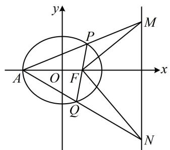
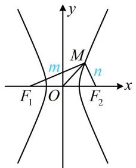
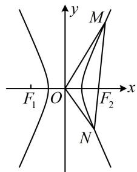
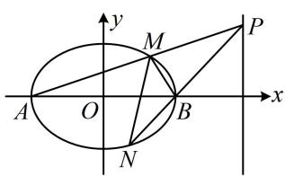
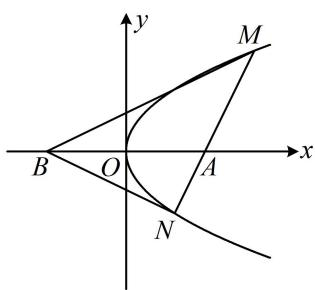
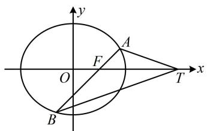

# 内容提要

##### 1. 在解析几何大题中，锐角、直角、钝角的条件可通过向量的数量积来翻译：

① $\angle APB$ 为直角：可翻译为 $\overrightarrow{PA} \cdot \overrightarrow{PB} = 0$ ，但需单独排除 $P$ 与 $A$ 或 $B$ 重合的情况；也可翻译为 $k_{PA} \cdot k_{PB} = -1$ ，但需单独考虑 $PA$ ， $PB$ 斜率不存在的情况；

② $\angle APB$ 为锐角：可翻译为 $\overrightarrow{PA} \cdot \overrightarrow{PB} > 0$ ，但需单独排除 $\angle APB = 0^{\circ}$ 的情况；

③ $\angle APB$ 为钝角：可翻译为 $\overrightarrow{PA} \cdot \overrightarrow{PB} < 0$ ，但需单独排除 $\angle APB = 180^{\circ}$ 的情况.

##### 2. 倾斜角互补: 当两直线倾斜角互补时, 根据 $\tan (\pi - \alpha) = -\tan \alpha$ , 可以得出两直线斜率互为相反数, 所以倾斜角互补的问题, 在解析几何中往往采用斜率和为零来进行计算.

# 类型Ⅰ：直角、锐角、钝角

【例 1】已知椭圆 $C: \frac{x^{2}}{a^{2}} + \frac{y^{2}}{b^{2}} = 1 (a > b > 0)$ 的焦距和长半轴长都为 2．过椭圆 C 的右焦点 F 作不与 y 轴垂直的直线 l 与椭圆 C 相交于 P，Q 两点.

（1） 求椭圆 C 的方程;

（2）设点 $A$ 是椭圆 $C$ 的左顶点，直线 $AP, AQ$ 分别与直线 $x = 4$ 相交于点 $M, N$ ，求证：以 $MN$ 为直径的圆恒过点 $F$ .

解：（1）由题意，椭圆 $C$ 的焦距 $2c = 2$ ，所以 $c = 1$

又长半轴长 $a = 2$ ，所以 $b = \sqrt{a^2 - c^2} = \sqrt{3}$ ，故椭圆 $C$ 的方程为 $\frac{x^2}{4} +\frac{y^2}{3} = 1$

（2） (以 $MN$ 为直径的圆恒过点 $F$ 意味着 $FM \perp FN$ , 故可翻译成 $\overrightarrow{FM} \cdot \overrightarrow{FN} = 0$ , 而求此数量积需要 $M, N$ 的坐标, 故考虑设出 $P, Q$ 的坐标, 写出直线 $AP, AQ$ 的方程, 与 $x = 4$ 联立求 $M, N$ 的坐标) 设 $P(x_{1}, y_{1}), Q(x_{2}, y_{2})$ , 由 （1） 可得 $A(-2, 0)$ , 所以 $k_{AP} = \frac{y_{1}}{x_{1} + 2}$ , 故直线 $AP$ 的方程为 $y = \frac{y_{1}}{x_{1} + 2}(x + 2)$ ,

令 $x = 4$ 得 $y = \frac{6y_1}{x_1 + 2}$ ，所以 $M\left(4,\frac{6y_1}{x_1 + 2}\right)$ ，同理可得， $N\left(4,\frac{6y_2}{x_2 + 2}\right)$

又因为 $F(1,0)$ ，所以 $\overrightarrow{FM} = \left(3,\frac{6y_1}{x_1 + 2}\right),\quad \overrightarrow{FN} = \left(3,\frac{6y_2}{x_2 + 2}\right),$

故 $\overrightarrow{FM} \cdot \overrightarrow{FN} = 9 + \frac{36y_1y_2}{x_1x_2 + 2(x_1 + x_2) + 4}$ ①,

（看到 $x_{1}x_{2}$ ， $x_{1} + x_{2}$ ， $y_{1}y_{2}$ ，想到设直线 $l$ 的方程，与椭圆方程联立，结合韦达定理计算它们. 直线 $l$ 过 $x$ 轴上的定点 $F$ ，考虑设横截式方程）

由题意，直线 l 不与 y 轴垂直，故可设其方程为 $x = my + 1$ ，

代入 $\frac{x^2}{4} +\frac{y^2}{3} = 1$ 消去 $x$ 整理得： $(3m^{2} + 4)y^{2} + 6my - 9 = 0$ ， $\Delta = 36m^2 -4(3m^2 +4)\cdot (-9) = 144(m^2 +1) > 0$

由韦达定理， $y_{1} + y_{2} = -\frac{6m}{3m^{2} + 4},\quad y_{1}y_{2} = -\frac{9}{3m^{2} + 4}$ ，所以 $x_{1} + x_{2} = m(y_{1} + y_{2}) + 2 = \frac{8}{3m^{2} + 4}$

$x _ {1} x _ {2} = (m y _ {1} + 1) (m y _ {2} + 1) = m ^ {2} y _ {1} y _ {2} + m \left(y _ {1} + y _ {2}\right) + 1 = \frac {4 - 1 2 m ^ {2}}{3 m ^ {2} + 4},$

代入①得 $\overrightarrow{FM} \cdot \overrightarrow{FN} = 9 + \frac{36 \cdot \left(-\frac{9}{3m^2 + 4}\right)}{\frac{4 - 12m^2}{3m^2 + 4} + \frac{16}{3m^2 + 4} + 4} = 0$ ，所以 $FM \perp FN$ ，故以 $MN$ 为直径的圆恒过点 $F$ .

【反思】在解析几何中， $FM \perp FN$ 的翻译方法有： $\overrightarrow{FM} \cdot \overrightarrow{FN} = 0$ ， $k_{FM} \cdot k_{FN} = -1$ ， $|FT| = \frac{1}{2} |MN|$ （其中 $T$ 为 $MN$ 中点）， $|FM|^2 + |FN|^2 = |MN|^2$ 等，但最常用的是前两种。本题采用的是第一种，其实用第二种，计算量也大致相当，因为 $k_{FM} \cdot k_{FN} = \frac{2y_1}{x_1 + 2} \cdot \frac{2y_2}{x_2 + 2} = \frac{4y_1y_2}{x_1x_2 + 2(x_1 + x_2) + 4}$ ，所以要证明其结果是-1，也是结合韦达定理计算。

【例 2】在平面直角坐标系 xOy 中，双曲线 $C: \frac{x^{2}}{a^{2}} - \frac{y^{2}}{b^{2}} = 1 (a > 0, b > 0)$ 的左、右焦点分别为 $F_{1}$ ， $F_{2}$ ，C 的离心率为 2，直线 l 过 $F_{2}$ 与 C 交于 M，N 两点，当 $\left|OM\right| = \left|OF_{2}\right|$ 时， $\triangle MF_{1}F_{2}$ 的面积为 3.

（1） 求双曲线 C 的方程;  
（2）已知 M，N 都在 C 的右支上，设 l 的斜率为 m.  
(i) 求实数 $m$ 的取值范围; (ii) 是否存在实数 $m$ , 使得 $\angle MON$ 为锐角? 若存在, 请求出 $m$ 的取值范围; 若不存在, 请说明理由.

解：（1）（如图1，不难看出 $\triangle MF_{1}F_{2}$ 为 Rt $\triangle$ ，所以由面积为3可以得出 $|MF_{1}|$ 与 $|MF_{2}|$ 的一个方程，想到结合双曲线定义求解）设 $|MF_{1}| = m$ ， $|MF_{2}| = n$ ，双曲线 $C$ 的半焦距为 $c$ ，则 $|F_{1}F_{2}| = 2c$ ，

当 $\left|OM\right|=\left|OF_{2}\right|$ 时， $\left|OM\right|=\frac{1}{2}\left|F_{1}F_{2}\right|$ ，所以 $MF_{1}\perp MF_{2}$ ，故 $m^{2}+n^{2}=4c^{2}$ ①，

且由题意， $S_{\triangle MF_1F_2} = \frac{1}{2} mn = 3$ ，所以 $mn = 6$ ②，又由双曲线定义， $\left|m - n\right| = 2a$ ③，

由①可得 $4c^{2} = m^{2} + n^{2} = (m - n)^{2} + 2mn$ ，结合②③得 $4c^{2} = 4a^{2} + 12$ ，所以 $b^{2} = c^{2} - a^{2} = 3$ ，故 $b = \sqrt{3}$ 又双曲线 $C$ 的离心率 $e = \frac{c}{a} = \frac{\sqrt{a^2 + b^2}}{a} = 2$ ，所以 $a = 1$ ，故双曲线 $C$ 的方程为 $x^{2} - \frac{y^{2}}{3} = 1$

（2） (i) 由 （1） 可得 $c = \sqrt{a^2 + b^2} = 2$ ，所以 $F_2(2,0)$ ，又直线 $l$ 的斜率为 $m$ ，所以其方程为 $y = m(x - 2)$ ，设 $M(x_1, y_1)$ ， $N(x_2, y_2)$ ，将 $y = m(x - 2)$ 代入 $x^2 - \frac{y^2}{3} = 1$ 消去 $y$ 整理得： $(3 - m^2)x^2 + 4m^2x - 4m^2 - 3 = 0$ ④，

因为 $M, N$ 都在 $C$ 的右支上，所以 $\left\{ \begin{array}{l} 3 - m^2 \neq 0 \\ \Delta = (4m^2)^2 - 4(3 - m^2)(-4m^2 - 3) = 36(m^2 + 1) > 0 \end{array} \right.$ ，解得： $m \neq \pm \sqrt{3}$ ，

(上述结果只能保证直线 $l$ 与双曲线 $C$ 有 2 个交点, 不一定都在右支上, 还要补充什么? 交点都在右支上意味着交点横坐标都是正的, 所以方程④得有两个正根, 可结合韦达定理来处理)

由韦达定理， $\left\{ \begin{array}{l}x_{1} + x_{2} = \frac{4m^{2}}{m^{2} - 3} >0\\ x_{1}x_{2} = \frac{4m^{2} + 3}{m^{2} - 3} >0 \end{array} \right.$ ，解得： $m <   - \sqrt{3}$ 或 $m > \sqrt{3}$ ，故 $m$ 的取值范围是 $(- \infty , - \sqrt{3})\cup (\sqrt{3}, + \infty)$

（ii）（涉及 $\angle MON$ 为锐角，可翻译为 $\overrightarrow{OM} \cdot \overrightarrow{ON} > 0$ ，下面先求该数量积，看看 $\overrightarrow{OM} \cdot \overrightarrow{ON} > 0$ 是否可能成立） $\overrightarrow{OM} = (x_{1}, y_{1})$ ， $\overrightarrow{ON} = (x_{2}, y_{2})$ ，所以 $\overrightarrow{OM} \cdot \overrightarrow{ON} = x_{1}x_{2} + y_{1}y_{2} = \frac{4m^{2} + 3}{m^{2} - 3} + y_{1}y_{2}$ ⑤，

(还差 $y_{1}y_{2}$ ，可利用直线 l 的方程将它化为 $x_{1}$ ， $x_{2}$ 来计算)

$y _ {1} y _ {2} = m \left(x _ {1} - 2\right) m \left(x _ {2} - 2\right) = m ^ {2} \left[ x _ {1} x _ {2} - 2 \left(x _ {1} + x _ {2}\right) + 4 \right] = m ^ {2} \left(\frac {4 m ^ {2} + 3}{m ^ {2} - 3} - 2 \cdot \frac {4 m ^ {2}}{m ^ {2} - 3} + 4\right) = - \frac {9 m ^ {2}}{m ^ {2} - 3},$

代入⑤得 $\overrightarrow{OM} \cdot \overrightarrow{ON} = \frac{4m^2 + 3}{m^2 - 3} - \frac{9m^2}{m^2 - 3} = \frac{3 - 5m^2}{m^2 - 3}$ ，由（i）可得 $m^2 > 3$ ，所以 $\frac{3 - 5m^2}{m^2 - 3} < 0$ ，故 $\overrightarrow{OM} \cdot \overrightarrow{ON} < 0$ ，所以 $\angle MON$ 始终为钝角，故不存在实数 $m$ ，使得 $\angle MON$ 为锐角.

图1

图2

【反思】解析几何中 $\angle MON$ 为锐角一般按 $\overrightarrow{OM} \cdot \overrightarrow{ON} > 0$ 来翻译. 但需注意, 若有必要, 还应检验 $\overrightarrow{OM}$ 与 $\overrightarrow{ON}$ 是否可能同向, 此时虽也满足 $\overrightarrow{OM} \cdot \overrightarrow{ON} > 0$ , 但 $\angle MON = 0^{\circ}$ , 应排除这种情况.

##### 【例3】设 $A, B$ 分别为椭圆 $\frac{x^2}{a^2} + \frac{y^2}{b^2} = 1 (a > b > 0)$ 的左、右顶点，椭圆长半轴的长等于焦距，且过点 $\left(\sqrt{2}, \frac{\sqrt{6}}{2}\right)$ .

（1） 求椭圆的方程;   
（2）设 $P$ 为直线 $x = 4$ 上不同于点 $(4,0)$ 的任意一点，若直线 $AP$ ， $BP$ 分别与椭圆相交于异于 $A$ ， $B$ 的点 $M$ ， $N$ ，证明：点 $B$ 在以 $MN$ 为直径的圆内.

解：（1）设椭圆的焦距为 $2c$ ，则 $\left\{ \begin{array}{l}a = 2c\\ \frac{2}{a^2} +\frac{3}{2b^2} = 1, \end{array} \right.$ 解得： $a = 2$ ， $b = \sqrt{3}$ ， $c = 1$ ，故椭圆的方程为 $\frac{x^2}{4} +\frac{y^2}{3} = 1$

（2） 解法 1: (怎样翻译点 $B$ 在以 $MN$ 为直径的圆内? 结合图形可知此结论意味着 $\angle MBN$ 为钝角, 故可翻译为 $\overrightarrow{BM} \cdot \overrightarrow{BN} < 0$ , 计算此数量积需要 $M, N$ 的坐标, 观察图形发现可设 $P$ 的坐标, 并用它写出 $PA, PB$ 的方程, 与椭圆联立求 $M, N$ 的坐标)

由（1）可得 $A(-2,0)$ ， $B(2,0)$ ，设 $P(4,t)(t \neq 0)$ ，则 $k_{PA} = \frac{t}{6}$ ，所以直线 $PA$ 的方程为 $x = \frac{6}{t} y - 2$ ，

代入椭圆方程消去 $x$ 整理得： $(t^2 + 27)y^2 - 18ty = 0$ ，解得： $y = 0$ 或 $\frac{18t}{t^2 + 27}$

所以 $y_{M} = \frac{18t}{t^{2} + 27}$ ， $x_{M} = \frac{6}{t} y_{M} - 2 = \frac{54 - 2t^{2}}{t^{2} + 27}$ ，故 $M\left(\frac{54 - 2t^2}{27 + t^2},\frac{18t}{27 + t^2}\right)$

又 $k_{PB} = \frac{t}{2}$ ，所以直线 $PB$ 的方程为 $x = \frac{2}{t} y + 2$

代入椭圆方程消去 $x$ 整理得： $(t^2 +3)y^2 +6ty = 0$ ，解得： $y = 0$ 或 $-\frac{6t}{t^2 + 3}$

所以 $y_{N} = -\frac{6t}{t^{2} + 3}, x_{N} = \frac{2}{t} y_{N} + 2 = \frac{2t^{2} - 6}{t^{2} + 3}$ 故 $N\left(\frac{2t^2 - 6}{3 + t^2}, -\frac{6t}{3 + t^2}\right)$

所以 $\overrightarrow{BM} = \left(-\frac{4t^2}{27 + t^2},\frac{18t}{27 + t^2}\right),\quad \overrightarrow{BN} = \left(-\frac{12}{3 + t^2}, - \frac{6t}{3 + t^2}\right)$ ，故 $\overrightarrow{BM}\cdot \overrightarrow{BN} = -\frac{60t^2}{(27 + t^2)(3 + t^2)} < 0$

所以 $\angle MBN$ 为钝角，故点 $B$ 在以 $MN$ 为直径的圆内.

【解法2】: (解法1求了 $M, N$ 两个坐标, 计算量较大. 观察图形发现 $\angle MBN$ 为钝角等价于 $\angle MBP$ 为锐角, 故也可转化为证 $\overrightarrow{BM} \cdot \overrightarrow{BP} > 0$ , 这样就只需要 $M$ 和 $P$ 的坐标, 无需求 $N$ 的坐标, 可按此优化解法1)

求点 $M$ 坐标的过程同解法1，因为 $\overrightarrow{BM} = \left(-\frac{4t^2}{27 + t^2},\frac{18t}{27 + t^2}\right),\overrightarrow{BP} = (2,t)$

所以 $\overrightarrow{BM} \cdot \overrightarrow{BP} = -\frac{4t^2}{27 + t^2} \cdot 2 + \frac{18t}{27 + t^2} \cdot t = \frac{10t^2}{27 + t^2} > 0$ ，从而 $\angle MBP$ 为锐角，故 $\angle MBN$ 为钝角，

所以点 B 在以 MN 为直径的圆内.

【解法3】: (上面解法2我们采用的是设 $P$ 求 $M$ , 既然只需要用 $M$ 和 $P$ 的坐标, 那么也可以设 $M$ 求 $P$ )

由（1）可得 $A(-2,0)$ ， $B(2,0)$ ，设 $M(x_0,y_0)$ ，因为点 $M$ 在椭圆上，所以 $\frac{x_0^2}{4} +\frac{y_0^2}{3} = 1$ ①，

又点 $M$ 异于顶点 $A, B$ , 所以 $-2 < x_0 < 2$ , (接下来可以写出 $AM$ 的方程, 与 $x = 4$ 联立求 $P$ 的坐标, 但直接根据 $A, M, P$ 三点共线, 由 $k_{AM} = k_{AP}$ 建立方程求 $P$ 的坐标更便捷)

由 $P, A, M$ 三点共线知 $\frac{y_p}{4 - (-2)} = \frac{y_0}{x_0 - (-2)}$ ，解得： $y_P = \frac{6y_0}{x_0 + 2}$ ，所以 $P\left(4, \frac{6y_0}{x_0 + 2}\right)$ ，

所以 $\overrightarrow{BM} = (x_0 - 2, y_0)$ ， $\overrightarrow{BP} = \left(2, \frac{6y_0}{x_0 + 2}\right)$ ，故 $\overrightarrow{BM} \cdot \overrightarrow{BP} = 2x_0 - 4 + \frac{6y_0^2}{x_0 + 2} = \frac{2}{x_0 + 2}(x_0^2 - 4 + 3y_0^2)$ ②，

（涉及两个变量，可利用椭圆方程来消元）由①得 $y_0^2 = 3\left(1 - \frac{x_0^2}{4}\right)$ ，代入式②化简得 $\overrightarrow{BM} \cdot \overrightarrow{BP} = \frac{5}{2}(2 - x_0)$ ，

因为 $2 - x_0 > 0$ ，所以 $\overrightarrow{BM} \cdot \overrightarrow{BP} > 0$ ，从而 $\angle MBP$ 为锐角，故 $\angle MBN$ 为钝角，

所以点 B 在以 MN 为直径的圆内.

【反思】直角、锐角、钝角这类条件可能会以点在圆上、点在圆外、点在圆内这样隐含地给出，一般而言，可总结如下．设 M, N 是不重合的两点，则：

① $\overrightarrow{BM} \cdot \overrightarrow{BN} = 0 \Leftrightarrow \angle MBN = 90^{\circ}$ 或 B 与 M, N 中的一个重合 $\Leftrightarrow$ 点 B 在以 MN 为直径的圆上;

② $\overrightarrow{BM} \cdot \overrightarrow{BN} > 0 \Leftrightarrow \angle MBN$ 为锐角或 $0^{\circ} \Leftrightarrow$ 点 $B$ 在以 $MN$ 为直径的圆外；

③ $\overrightarrow{BM} \cdot \overrightarrow{BN} < 0 \Leftrightarrow \angle MBN$ 为钝角或平角 $\Leftrightarrow$ 点 B 在以 MN 为直径的圆内.

# 类型 II：倾斜角互补

【例 4】（2018·新课标 I 卷）设抛物线 $C: y^{2} = 2x$ ，点 $A(2,0)$ ， $B(-2,0)$ ，过点 A 的直线 l 与 C 交于 M，N 两点.

（1） 当 $l$ 与 $x$ 轴垂直时, 求直线 $BM$ 的方程; （2） 证明: $\angle A B M = \angle A B N$ .

解：（1）当 $l$ 与 $x$ 轴垂直时，其方程为 $x = 2$ ，由 $\left\{ \begin{array}{l} x = 2 \\ y^2 = 2x \end{array} \right.$ 解得： $y = \pm 2$ ，故 $M$ 的坐标为 $(2,2)$ 或 $(2,-2)$ ，

若 $M$ 的坐标为 $(2,2)$ ，则 $BM$ 的方程为 $x - 2y + 2 = 0$ ，若 $M$ 的坐标为 $(2, -2)$ ，则 $BM$ 的方程为 $x + 2y + 2 = 0$ ，综上所述， $BM$ 的方程为 $x - 2y + 2 = 0$ 或 $x + 2y + 2 = 0$ 。

（2） 解法 1: (怎样翻译 $\angle A B M = \angle A B N$ ? 如图, $\angle A B M = \angle A B N$ 意味着 $B M$ , $B N$ 倾斜角互补, 即它们的斜率互为相反数, 故可按 $k _ { B M } + k _ { B N } = 0$ 来翻译, 计算这两个斜率需要 $M$ , $N$ 的坐标, 故先设坐标)

设 $M(x_{1},y_{1})$ ， $N(x_{2},y_{2})$ ，则 $k_{BM} + k_{BN} = \frac{y_1}{x_1 + 2} +\frac{y_2}{x_2 + 2} = \frac{y_1(x_2 + 2) + y_2(x_1 + 2)}{(x_1 + 2)(x_2 + 2)} = \frac{x_1y_2 + x_2y_1 + 2(y_1 + y_2)}{(x_1 + 2)(x_2 + 2)}$ ①，

(由上式的结构特征想到设直线 l 的方程, 与抛物线联立, 结合韦达定理来进行计算)

显然 $l$ 不与 $y$ 轴垂直，故可设其方程为 $x = my + 2$ ，代入 $y^{2} = 2x$ 消去 $x$ 整理得： $y^{2} - 2my - 4 = 0$

易得判别式 $\Delta > 0$ ，由韦达定理， $y_{1} + y_{2} = 2m$ ， $y_{1}y_{2} = -4$ ，

所以 $x_{1}y_{2} + x_{2}y_{1} = \frac{y_{1}^{2}}{2}\cdot y_{2} + \frac{y_{2}^{2}}{2}\cdot y_{1} = \frac{y_{1}y_{2}(y_{1} + y_{2})}{2} = \frac{-4\times 2m}{2} = -4m$

从而 $x_{1}y_{2} + x_{2}y_{1} + 2(y_{1} + y_{2}) = -4m + 2\times 2m = 0$ ，代入①得 $k_{BM} + k_{BN} = 0$ ，故 $\angle ABM = \angle ABN$

【解法2】: (按解法1得到 $k_{BM} + k_{BN} = \frac{y_1}{x_1 + 2} + \frac{y_2}{x_2 + 2}$ 后, 算 $\frac{y_1}{x_1 + 2} + \frac{y_2}{x_2 + 2}$ 的过程能否简化? 能, 我们可以利用齐次化的思想, 联立直线和抛物线时, 刻意化成 $A\left(\frac{y}{x + 2}\right)^2 + B \cdot \frac{y}{x + 2} + C = 0$ 这种形式, 则可直接由韦达定理求 $\frac{y_2}{x_2 + 2} + \frac{y_1}{x_1 + 2}$ . 下面按此操作, 我们的目标结构是 $\frac{y}{x + 2}$ , 所以先把直线和抛物线方程中的 $x$ 凑成 $x + 2$ ) 由 $x = my + 2$ 可得 $x + 2 - my = 4$ ②, 抛物线的方程可化为 $y^2 + 4 = 2(x + 2)$ ③,

(式③关于 $y$ 和 $x + 2$ 不齐次, 我们需要把常数项 4 和一次项 $2(x + 2)$ 也化为关于 $y$ 和 $x + 2$ 的二次式, 可结

合式②来化）结合②可将③化为 $y^{2} + \frac{1}{4} (x + 2 - my)^{2} = \frac{x + 2 - my}{2} (x + 2)$ ，

整理得： $(4 + m^2)y^2 -(x + 2)^2 = 0$

两端同除以 $(x + 2)^{2}$ 得 $(4 + m^{2})\left(\frac{y}{x + 2}\right)^{2} - 1 = 0$

因为 $M, N$ 的坐标满足上述方程，所以由韦达定理，

$\frac{y_1}{x_1 + 2} + \frac{y_2}{x_2 + 2} = -\frac{0}{4 + m^2} = 0$ ，从而 $k_{BM} + k_{BN} = 0$ ，故 $\angle ABM = \angle ABN$ 。

【反思】①当我们通过分析图形的几何特征发现两条直线倾斜角互补时，常翻译为它们的斜率之和为0.

②计算 $\frac{y_1 - b}{x_1 - a} +\frac{y_2 - b}{x_2 - a}$ 或 $\frac{y_1 - b}{x_1 - a}\cdot \frac{y_2 - b}{x_2 - a}$ 这类结构，可考虑齐次化思想，其核心是在联立直线和椭圆（双曲线、抛物线）的方程时，将其化为关于 $x - a$ 和 $y - b$ 的二次齐次式 $A(y - b)^2 +B(x - a)(y - b) + C(x - a)^2 = 0$ ，再同除以 $(x - a)^{2}$ 化为 $A\left(\frac{y - b}{x - a}\right)^{2} + B\cdot \frac{y - b}{x - a} +C = 0$ ，这样可直接由韦达定理求得 $\frac{y_1 - b}{x_1 - a} +\frac{y_2 - b}{x_2 - a} = -\frac{B}{A}$ 和 $\frac{y_1 - b}{x_1 - a}\cdot \frac{y_2 - b}{x_2 - a} = \frac{C}{A}$

【例 5】已知椭圆 $C: \frac{x^{2}}{a^{2}} + \frac{y^{2}}{b^{2}} = 1 (a > b > 0)$ 的焦距为 2，且经过点 $P\left(1, \frac{3}{2}\right)$ .

（1） 求椭圆 C 的方程;

（2） 经过椭圆 $C$ 的右焦点 $F$ 且斜率为 $k (k \neq 0)$ 的动直线 $l$ 与椭圆 $C$ 交于 $A, B$ 两点, 试问 $x$ 轴上是否存在异于点 $F$ 的定点 $T$ 使 $|AF| \cdot |BT| = |BF| \cdot |AT|$ 恒成立? 若存在, 求出点 $T$ 坐标; 若不存在,说明理由.

解: （1） (可以将 $P$ 的坐标代入椭圆方程, 再结合 $a^2 - b^2 = c^2 = 1$ 来求解, 但直接用椭圆定义求 $a$ 更简单)由椭圆的焦距为 2 知它的两个焦点分别为 $(-1,0)$ , $(1,0)$ ,

因为 $P$ 在椭圆上，所以 $P$ 到两个焦点的距离之和 $\sqrt{(-1 - 1)^2 + \left(0 - \frac{3}{2}\right)^2} +\sqrt{(1 - 1)^2 + \left(0 - \frac{3}{2}\right)^2} = 4 = 2a$

从而 $a = 2$ ，故 $b^{2} = a^{2} - 1 = 3$ ，所以椭圆 $C$ 的方程为 $\frac{x^2}{4} +\frac{y^2}{3} = 1$

（2） (怎样翻译 $|AF| \cdot |BT| = |BF| \cdot |AT|$ ? 若直接算这些长度, 则较麻烦, 可将其化成 $\frac{|AF|}{|BF|} = \frac{|AT|}{|BT|}$ , 故想到角平分线性质定理. 如图, $TF$ 应为 $\angle ATB$ 的平分线, 故 $AT$ , $BT$ 关于 $x$ 轴对称, 又可翻译成 $k_{AT} + k_{BT} = 0$ , 到此“复杂”的条件就转化为简单的模型了! 下面我们先推导这一转化过程)

因为 $\left|AF\right|\cdot\left|BT\right|=\left|BF\right|\cdot\left|AT\right|$ ，所以 $\frac{\left|AF\right|}{\left|BF\right|}=\frac{\left|AT\right|}{\left|BT\right|}$ ①，

又 $\frac{|AF|}{|BF|} = \frac{S_{\triangle ATF}}{S_{\triangle BTF}} = \frac{\frac{1}{2}|AT|\cdot|TF|\cdot\sin\angle ATF}{\frac{1}{2}|BT|\cdot|TF|\cdot\sin\angle BTF} = \frac{|AT|\cdot\sin\angle ATF}{|BT|\cdot\sin\angle BTF}$ ，代入①得 $\frac{|AT|}{|BT|} = \frac{|AT|\cdot\sin\angle ATF}{|BT|\cdot\sin\angle BTF}$

所以 $\sin \angle ATF = \sin \angle BTF$ ，由 $T$ 与 $F$ 不重合知 $\angle ATF$ 与 $\angle BTF$ 不可能互补，所以 $\angle ATF = \angle BTF$ ，

所以 $\left|AF\right|\cdot\left|BT\right|=\left|BF\right|\cdot\left|AT\right|$ 等价于直线TA，TB的斜率之和 $k_{TA}+k_{TB}=0$ ，

（涉及斜率，考虑设点的坐标）由（1）可得 $F(1,0)$ ，设 $A(x_{1},y_{1})$ ， $B(x_{2},y_{2})$ ， $T(t,0)(t \neq 1)$ ，

则 $k_{TA} + k_{TB} = \frac{y_1}{x_1 - t} +\frac{y_2}{x_2 - t} = \frac{y_1(x_2 - t) + y_2(x_1 - t)}{(x_1 - t)(x_2 - t)}$ ，所以 $k_{TA} + k_{TB} = 0\Leftrightarrow y_1(x_2 - t) + y_2(x_1 - t) = 0$ ②，

(变量较多, 有 $x$ 有 $y$ , 考虑设直线的方程, 并用于消元, $A B$ 过 $x$ 轴上定点 $F$ , 设横截式)

由题意，直线 $AB$ 不与坐标轴垂直，故可设其方程为 $x = my + 1 (m \neq 0)$ ，则 $\left\{ \begin{array}{l} x_{1} = my_{1} + 1 \\ x_{2} = my_{2} + 1 \end{array} \right.$ ，

代入②得 $y_{1}(my_{2} + 1 - t) + y_{2}(my_{1} + 1 - t) = 2my_{1}y_{2} + (1 - t)(y_{1} + y_{2}) = 0$ ③，

(式③中有 $y_{1} y_{2}$ 和 $y_{1} + y_{2}$ , 故联立直线 $A B$ 与椭圆方程, 结合韦达定理来算)

联立 $\left\{ \begin{array}{l} x = my + 1 \\ \frac{x^2}{4} + \frac{y^2}{3} = 1 \end{array} \right.$ 消去 $x$ 整理得： $(3m^2 + 4)y^2 + 6my - 9 = 0$

判别式 $\Delta = 36m^2 - 4(3m^2 + 4) \times (-9) = 144(m^2 + 1) > 0$

由韦达定理， $y_{1} + y_{2} = -\frac{6m}{3m^{2} + 4}$ ， $y_{1}y_{2} = -\frac{9}{3m^{2} + 4}$

代入③得 $2m \cdot \left(-\frac{9}{3m^2 + 4}\right) + (1 - t) \cdot \left(-\frac{6m}{3m^2 + 4}\right) = 0$ ，化简得： $m(t - 4) = 0$ ，

结合 $m \neq 0$ 可得 $t = 4$ ，所以 $x$ 轴上存在满足题意的定点 $T(4,0)$ .

【反思】有时倾斜角互补不会直白地给出，需要将已知条件进行分析整合才能发现。本题就是如此，表面上看给的是长度关系 $\left|AF\right|\cdot\left|BT\right|=\left|BF\right|\cdot\left|AT\right|$ ，但化为比值关系后我们发现x轴是 $\angle ATB$ 的平分线，于是可按倾斜角互补模型处理。

# 强化训练

##### 1. (2018·新课标Ⅰ卷·★★★☆)

设椭圆 $C: \frac{x^2}{2} + y^2 = 1$ 的右焦点为 $F$ ，过 $F$ 的直线 $l$ 与 $C$ 交于 $A$ ， $B$ 两点，点 $M$ 的坐标为 $(2,0)$ .

（1）当 $l$ 与 $x$ 轴垂直时，求直线 $AM$ 的方程；  
（2）设 $O$ 为坐标原点，证明： $\angle OMA = \angle OMB$

##### 2. (2024·黑龙江哈尔滨模拟·★★★☆)

已知点 $A, B$ 分别为椭圆 $E: \frac{x^2}{a^2} + \frac{y^2}{b^2} = 1 (a > b > 0)$ 的左、右顶点，点 $P(0, -2)$ ，直线 $BP$ 交 $E$ 于点 $Q$ ， $\overrightarrow{PQ} = \frac{3}{2}\overrightarrow{QB}$ ，且 $\triangle ABP$ 是等腰直角三角形.

（1） 求椭圆 E 的方程;

（2） 设过点 $P$ 的直线 $l$ 与 $E$ 相交于 $M, N$ 两点, 当坐标原点 $O$ 位于以 $MN$ 为直径的圆外时, 求直线 $l$ 斜率的取值范围.

##### 3. (2024·四川模拟·★★★☆)

已知双曲线 $C: \frac{x^2}{a^2} - \frac{y^2}{b^2} = 1 (a > 0, b > 0)$ 的离心率为 $\sqrt{3}$ ，且过点 $(\sqrt{2}, \sqrt{2})$ 。

（1） 求双曲线 C 的方程;

（2） 设直线 $l$ 是圆 $O: x^{2} + y^{2} = 2$ 上的动点 $P$ 处的切线, $l$ 与双曲线 $C$ 交于不同的两点 $A, B$ , 证明: $\angle AOB$ 的大小为定值.

##### 4. (2024·浙江温州一模·★★★★)

已知抛物线 $x^{2} = 4y$ 的焦点为 $F$ ，抛物线上的点 $A(x_0,y_0)$ 处的切线为 $l$

（1） 求 l 的方程（用 $x_{0}$ 表示）;

（2） 若直线 l 与 y 轴交于点 B，直线 AF 与抛物线交于点 C，若 $\angle ACB$ 为钝角，求 $v_{0}$ 的取值范围.

