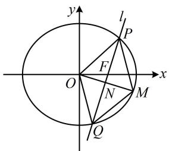
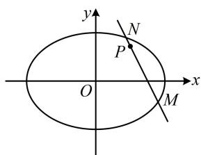
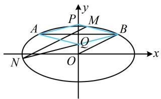
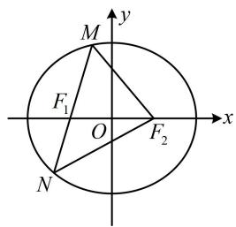
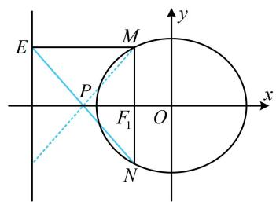

# 强化训练

##### 1. (2024·北京模拟·★★★☆)

已知椭圆 $C: \frac{x^2}{a^2} + \frac{y^2}{b^2} = 1 (a > b > 0)$ 经过点 $(0, \sqrt{3})$ ，离心率为 $\frac{1}{2}$ ，过右焦点 $F$ 且与 $x$ 轴不垂直的直线 $l$ 交椭圆 $C$ 于 $P$ ， $Q$ 两点.

（1） 求椭圆 C 的方程;

（2）在椭圆 $C$ 上是否存在点 $M$ ，使四边形OPMQ为平行四边形？若存在，求出直线 $l$ 的方程；若不存在，请说明理由.

##### 1. 解：（1）因为椭圆 C 经过 $(0, \sqrt{3})$ ，所以 $b = \sqrt{3}$ ，

又因为椭圆的离心率 $e = \frac{\sqrt{a^2 - b^2}}{a} = \frac{1}{2}$ ，所以 $a = 2$

故椭圆 $C$ 的方程为 $\frac{x^2}{4} +\frac{y^2}{3} = 1$

（2）（如图，涉及平行四边形，考虑按对角线互相平分翻译，需要 $PQ$ 中点的坐标，我们先设直线 $l$ 的方程，与椭圆联立，结合韦达定理求 $PQ$ 中点坐标）

由（1）可得椭圆的半焦距 $c = \sqrt{a^2 - b^2} = 1$ ，所以 $F(1,0)$

若直线 $l$ 与 $y$ 轴垂直，则 $O, P, Q$ 共线，无法构成平行四边形 $OPMQ$ ，所以 $l$ 不与 $y$ 轴垂直，

又因为 l 不与 x 轴垂直，所以可设 $l: x = my + 1 (m \neq 0)$ ，

代入 $\frac{x^2}{4} +\frac{y^2}{3} = 1$ 整理得： $(3m^{2} + 4)y^{2} + 6my - 9 = 0$

判别式 $\Delta = (6m)^2 - 4(3m^2 + 4) \cdot (-9) = 144(m^2 + 1) > 0$

由韦达定理， $y_{1} + y_{2} = -\frac{6m}{3m^{2} + 4}$

所以 $x_{1} + x_{2} = my_{1} + 1 + my_{2} + 1 = m(y_{1} + y_{2}) + 2$

$= m \cdot \left(- \frac {6 m}{3 m ^ {2} + 4}\right) + 2 = \frac {8}{3 m ^ {2} + 4},$

故 $PQ$ 中点为 $N\left(\frac{4}{3m^2 + 4}, - \frac{3m}{3m^2 + 4}\right)$

(怎样建立方程求 $m$ ？可由 $N$ 也是 $OM$ 中点，求出 $M$ 的坐标，代入椭圆方程，即可建立关于 $m$ 的方程)

若四边形 $OPMQ$ 为平行四边形，则 $N$ 是 $OM$ 中点，

所以 $M\left(\frac{8}{3m^{2}+4},-\frac{6m}{3m^{2}+4}\right)$ ,

代入椭圆方程得： $\frac{\left(\frac{8}{3m^2 + 4}\right)^2}{4} +\frac{\left(-\frac{6m}{3m^2 + 4}\right)^2}{3} = 1$

解得： $m = 0$ ，与 $m\neq 0$ 矛盾，所以椭圆 $C$ 上不存在点 $M$ ，使四边形OPMQ为平行四边形.

##### 2. (2024·四川模拟·★★★★)

已知椭圆 $C: \frac{x^2}{a^2} + \frac{y^2}{b^2} = 1 (a > b > 0)$ 过点 $(2,0)$ ，离心率为 $\frac{\sqrt{2}}{2}$ .

（1） 求椭圆 C 的方程;  
（2） 直线 $l$ 过点 $P(1,1)$ , 且 $l$ 与椭圆 $C$ 交于 $M$ , $N$ 两点, 若 $\left|PM\right| \cdot \left|PN\right| = \frac{5}{9}$ , 求直线 $l$ 的方程.

##### 2. 解：（1）因为椭圆 C 过点 $(2,0)$ ，所以 a=2，

又椭圆 $C$ 的离心率 $e = \frac{c}{a} = \frac{\sqrt{2}}{2}$ ，所以 $c = \sqrt{2}$ ，

从而 $b = \sqrt{a^2 - c^2} = \sqrt{2}$ ，故椭圆 $C$ 的方程为 $\frac{x^2}{4} + \frac{y^2}{2} = 1$ .

（2） (|PM| 和 |PN| 可用弦长公式计算, 需要 $M$ , $N$ 的坐标和 $l$ 的方程, 故先把它们设出来)

当直线 $l$ 的斜率不存在时，其方程为 $x = 1$

代入 $\frac{x^2}{4} +\frac{y^2}{2} = 1$ 可求得 $y = \pm \frac{\sqrt{6}}{2}$

所以 $\left|PM\right|\cdot\left|PN\right|=\left|1-\frac{\sqrt{6}}{2}\right|\cdot\left|1-\left(-\frac{\sqrt{6}}{2}\right)\right|=\frac{1}{2}$

不满足 $\left|PM\right|\cdot\left|PN\right|=\frac{5}{9}$ ;

当直线 $l$ 斜率存在时，设其方程为 $y - 1 = k(x - 1)$

即 $y = kx + 1 - k$ ，设 $M(x_{1},y_{1})$ ， $N(x_{2},y_{2})$ ，则 $\left|PM\right|\cdot \left|PN\right| =$

$\sqrt {1 + k ^ {2}} \cdot \left| x _ {1} - 1 \right| \cdot \sqrt {1 + k ^ {2}} \cdot \left| x _ {2} - 1 \right| = (1 + k ^ {2}) \cdot \left| (x _ {1} - 1) (x _ {2} - 1) \right| \quad ①,$

(由此式的结构特征想到联立直线 l 和椭圆 C 的方程)

将 $y = kx + 1 - k$ 代入 $\frac{x^2}{4} + \frac{y^2}{2} = 1$ 消去 $y$ 整理得：

$(1 + 2 k ^ {2}) x ^ {2} + 4 k (1 - k) x + 2 (1 - k) ^ {2} - 4 = 0 \quad ②,$

(将 $(x_{1}-1)(x_{2}-1)$ 化为 $x_{1}x_{2}-(x_{1}+x_{2})+1$ ，用韦达定理计算当然可行，但这样算偏麻烦，涉及 $(x_{1}-1)(x_{2}-1)$ 这种结构，可考虑用点乘双根法来巧算)

因为 $x_{1}$ 和 $x_{2}$ 是方程②的两根，所以 $(1 + 2k^{2})x^{2} + 4k(1 - k)x+$

$2 (1 - k) ^ {2} - 4 = (1 + 2 k ^ {2}) (x - x _ {1}) (x - x _ {2}),$

令 x=1 化简得： $-1=(1+2k^{2})(1-x_{1})(1-x_{2})$

所以 $(x_{1} - 1)(x_{2} - 1) = -\frac{1}{1 + 2k^{2}}$

代入①得 $\left|PM\right|\cdot\left|PN\right|=(1+k^{2})\left|-\frac{1}{1+2k^{2}}\right|=\frac{1+k^{2}}{1+2k^{2}}$

由题意， $\frac{1+k^{2}}{1+2k^{2}}=\frac{5}{9}$ ，解得： $k=\pm2$ ，

经检验，满足方程②的判别式 $\Delta > 0$

所以直线 $l$ 的方程为 $y - 1 = 2(x - 1)$ 或 $y - 1 = -2(x - 1)$ ，

化简得： $y = 2x - 1$ 或 $y = -2x + 3$

# 3. (2024·江苏南京模拟·★★★★)

已知椭圆 $C: \frac{x^2}{a^2} + \frac{y^2}{b^2} = 1 (a > b > 0)$ 过点 $A(-2,1)$ ，离心率为 $\frac{\sqrt{3}}{2}$ .

（1） 求椭圆 C 的方程;  
（2） 设点 $A$ 关于 $y$ 轴的对称点为 $B$ , 直线 $l$ 与 $OB$ 平行, 且与椭圆 $C$ 相交于 $M$ , $N$ 两点, 直线 $BM$ , $BN$ 分别与 $y$ 轴交于 $P$ , $Q$ 两点, 求证: 四边形 $APBQ$ 为菱形.

##### 3. 解：（1）由题意， $\left\{\begin{aligned}\frac{(-2)^{2}}{a^{2}}+\frac{1^{2}}{b^{2}}=1\\\frac{\sqrt{a^{2}-b^{2}}}{a}=\frac{\sqrt{3}}{2}\end{aligned}\right.$ ，解得： $\left\{\begin{aligned}a=2\sqrt{2}\\ b=\sqrt{2}\end{aligned}\right.$

所以椭圆 $C$ 的方程为 $\frac{x^2}{8} +\frac{y^2}{2} = 1$

（2） 解法 1: (证菱形即证对角线垂直平分, 这里垂直显然成立, 故只需证平分, 即 $AB$ 中点也是 $PQ$ 中点, $AB$ 中点显然是 $(0,1)$ , 结合图形不难发现只需证 $PQ$ 中点纵坐标为 1. 求 $PQ$ 中点纵坐标需要 $P$ , $Q$ 的坐标, 可分别用 $BM$ , $BN$ 的方程与 $y$ 轴联立来求它们)

由题意， $B(2,1)$ ，设 $M(x_{1},y_{1})$ ， $N(x_{2},y_{2})$

当 $BM \perp x$ 轴时， $BM$ 与 $y$ 轴没有交点，不合题意；

当 $BM$ 不与 $x$ 轴垂直时， $k_{BM} = \frac{y_1 - 1}{x_1 - 2}$ ，

所以直线 BM 的方程为 $y-1=\frac{y_{1}-1}{x_{1}-2}(x-2)$ ,

令 $x = 0$ 得 $y = 1 - \frac{2(y_1 - 1)}{x_1 - 2}$ ，所以 $y_{P} = 1 - \frac{2(y_{1} - 1)}{x_{1} - 2}$

同理可得， $y_{Q}=1-\frac{2(y_{2}-1)}{x_{2}-2}$

所以 $y_{P} + y_{Q} = 2 - 2\left(\frac{y_{1} - 1}{x_{1} - 2} +\frac{y_{2} - 1}{x_{2} - 2}\right)$ ①，

(怎样计算上式？有 $x$ 有 $y$ , 变量较多, 考虑消元, 可设直线 $MN$ 的方程, 利用该方程来消元)

设直线 l 的方程为 $y=\frac{1}{2}x+m(m\neq0)$ ，则 $\left\{\begin{aligned}y_{1}&=\frac{1}{2}x_{1}+m\\ y_{2}&=\frac{1}{2}x_{2}+m\end{aligned}\right.$

代入①得 $y_{P} + y_{Q} = 2 - 2\left(\frac{\frac{1}{2}x_{1} + m - 1}{x_{1} - 2} + \frac{\frac{1}{2}x_{2} + m - 1}{x_{2} - 2}\right)$

$= 2 - \left(\frac {x _ {1} + 2 m - 2}{x _ {1} - 2} + \frac {x _ {2} + 2 m - 2}{x _ {2} - 2}\right) = 2 - \left(1 + \frac {2 m}{x _ {1} - 2} + 1 + \frac {2 m}{x _ {2} - 2}\right)$

$= - 2 m \left(\frac {1}{x _ {1} - 2} + \frac {1}{x _ {2} - 2}\right) = - 2 m \cdot \frac {x _ {2} - 2 + x _ {1} - 2}{(x _ {1} - 2) (x _ {2} - 2)}$

$= -2m\cdot \frac{x_1 + x_2 - 4}{x_1x_2 - 2(x_1 + x_2) + 4}$ ②，（看到 $x_{1} + x_{2}$ 和 $x_{1}x_{2}$ ，想到联立直线 $l$ 与椭圆方程，用韦达定理计算它们）

联立 $\left\{ \begin{array}{l} y = \frac{1}{2} x + m \\ \frac{x^2}{8} + \frac{y^2}{2} = 1 \end{array} \right.$ 可得 $x^{2} + 2mx + 2m^{2} - 4 = 0$

$\Delta = (2m)^{2} - 4(2m^{2} - 4) = 16 - 4m^{2} > 0$ ，所以 $-2 < m < 2$

结合 $m \neq 0$ 可得 $-2 < m < 0$ 或 $0 < m < 2$ ,

由韦达定理， $x_{1} + x_{2} = -2m$ ， $x_{1}x_{2} = 2m^{2} - 4$

代入②得 $y_{P} + y_{Q} = -2m\cdot \frac{-2m - 4}{2m^{2} - 4 - 2(-2m) + 4}$

$= \frac {2 m (2 m + 4)}{2 m ^ {2} + 4 m} = 2,$

所以 $\frac{y_P + y_Q}{2} = 1$ ，故 $PQ$ 中点为(0,1)，

所以 $PQ$ 中点与 $AB$ 中点重合，

又因为 $AB \perp PQ$ ，所以四边形 APBQ 为菱形.

【解法2】（按解法1得到式①后，由其结构联想到可用齐次化方法快速求出它：在联立直线 $l$ 与椭圆方程时，刻意将其化为 $A\left(\frac{y - 1}{x - 2}\right)^2 + B \cdot \frac{y - 1}{x - 2} + C = 0$ 这种形式，则可用韦达定理直接求出 $\frac{y_1 - 1}{x_1 - 2} + \frac{y_2 - 1}{x_2 - 2}$ ，下面我们先将直线 $l$ 和椭圆方程凑出 $y - 1$ 和 $x - 2$ 这两个结构）

直线 l 的方程 $y=\frac{1}{2}x+m$ 可化为 $y-1=\frac{1}{2}(x-2)+m$ ，

即 $2(y-1)-(x-2)=2m$ ③,

椭圆的方程 $\frac{x^2}{8} +\frac{y^2}{2} = 1$ 可化为 $\frac{(x - 2 + 2)^2}{8} +\frac{(y - 1 + 1)^2}{2} = 1$

即 $(x - 2)^{2} + 4(y - 1)^{2} + 4(x - 2) + 8(y - 1) = 0$ ④，

(上式关于 $x - 2$ 和 $y - 1$ 不齐次, 可利用方程③来把一次项 $4(x - 2)$ 和 $8(y - 1)$ 化为二次式, 实现齐次化)

在式④两端乘以 $m$ 可得

$m (x - 2) ^ {2} + 4 m (y - 1) ^ {2} + 4 m (x - 2) + 8 m (y - 1) = 0,$

结合式③得 $m(x - 2)^{2} + 4m(y - 1)^{2} + 2[2(y - 1) -$

$(x - 2) ] (x - 2) + 4 [ 2 (y - 1) - (x - 2) ] (y - 1) = 0,$

整理得： $(4m + 8)(y - 1)^{2} + (m - 2)(x - 2)^{2} = 0$

两端同除以 $(x - 2)^{2}$ 得 $(4m + 8)\left(\frac{y - 1}{x - 2}\right)^{2} + m - 2 = 0$

因为 $M$ ， $N$ 的坐标满足上述方程，所以由韦达定理，

$\frac{y_{1}-1}{x_{1}-2}+\frac{y_{2}-1}{x_{2}-2}=-\frac{0}{4m+8}=0$ ，代入①得 $y_{P}+y_{Q}=2$ ，

接下来同解法1.

##### 4.（2024·北京模拟·★★★★）

已知椭圆 $\frac{x^2}{a^2} +\frac{y^2}{b^2} = 1(a > b > 0)$ 的左、右焦点分别为 $F_{1}$ ， $F_{2}$ ，离心率为 $\frac{1}{2}$ ，过椭圆的左焦点 $F_{1}$ 作不与 $x$ 轴重合的直线与椭圆相交于 $M$ ， $N$ 两点， $\triangle MNF_{2}$ 的周长为8，过点 $M$ 作直线 $x = -2a$ 的垂线ME，垂足为E.

（1） 求椭圆 C 的标准方程;  
（2） 证明: 直线 $EN$ 经过定点 $P$ , 并求定点 $P$ 的坐标.

##### 4. 解：（1）如图1， $\triangle MNF_{2}$ 的周长为 $\left|MF_1\right| + \left|MF_2\right| +$

$\left| N F _ {1} \right| + \left| N F _ {2} \right| = 2 a + 2 a = 4 a,$

由题意， $\triangle MNF_{2}$ 的周长为8，所以 $4a = 8$ ，故 $a = 2$ 又椭圆的离心率 $e = \frac{\sqrt{a^2 - b^2}}{a} = \frac{1}{2}$ ，所以 $b = \sqrt{3}$ ，

故椭圆的标准方程为 $\frac{x^2}{4} +\frac{y^2}{3} = 1$

图1

图2

（2） (E 在直线 $x = -4$ 上, N 在椭圆上, 显然不方便直接设直线 $EN$ 的方程来找定点, 故考虑用坐标来找, 先设坐标) 设 $M(x_{1}, y_{1})$ , $N(x_{2}, y_{2})$ , 由题意可得, $E(-4, y_{1})$ ,

（怎样由上述 $E$ ， $N$ 的坐标找直线 $EN$ 过的定点？可以想象，若直接写出 $EN$ 的方程，漫无目的地寻找，则方程较复杂，不容易找到定点，可考虑先取特值探路，明确方向）

如图2，当 $MN \perp x$ 轴时， $EN$ 如图（蓝色实线），若交换 $M$ 和 $N$ 的位置，则 $EN$ 会沿 $x$ 轴对称（变成图2蓝色虚线），上述两种 $EN$ 的交点在 $x$ 轴上，所以若直线 $EN$ 过定点 $P$ ，则 $P$ 只能在 $x$ 轴上，

(有了 P 在 x 轴上，方向就明确了，可以用 E, N 的坐标写出直线 EN 的方程，与 x 轴联立求交点)

直线 $EN$ 的方程为 $y - y_{1} = \frac{y_{2} - y_{1}}{x_{2} + 4} (x + 4)$

令 $y = 0$ 得 $x = \frac{y_1(x_2 + 4)}{y_1 - y_2} - 4$ ①，（既有 $x$ ，又有 $y$ ，考虑消元，可设直线 $MN$ 的方程，并用它来消元）

由题意，MN 过 $F_{1}(-1,0)$ 且不与 x 轴重合，所以可设其方程为 x=my-1，则 $x_{2}=my_{2}-1$ ，

代入①得 $x = \frac{y_1(my_2 - 1 + 4)}{y_1 - y_2} - 4 = \frac{my_1y_2 + 3y_1}{y_1 - y_2} - 4$ ②，

(看到式中的 $y_{1}y_{2}$ ，想到联立直线 MN 和椭圆的方程，写出韦达定理)

联立 $\left\{ \begin{array}{l} x = my - 1 \\ \frac{x^2}{4} + \frac{y^2}{3} = 1 \end{array} \right.$ 可得 $(3m^2 + 4)y^2 - 6my - 9 = 0$

判别式 $\Delta = (-6m)^2 - 4(3m^2 + 4) \cdot (-9) = 144(m^2 + 1) > 0$

由韦达定理， $y_{1} + y_{2} = \frac{6m}{3m^{2} + 4}$ ， $y_{1}y_{2} = -\frac{9}{3m^{2} + 4}$ ，

(我们发现式②分子有个单独的 $y_{1}$ , 没有与之系数对称的 $y_{2}$ , 不能直接用韦达定理计算, 怎么办呢? 既然不能直接将韦达定理代入消去 $y_{1}$ 和 $y_{2}$ , 那就考虑消 $m$ )

$m y _ {1} y _ {2} = - \frac {9 m}{3 m ^ {2} + 4} = - \frac {3}{2} (y _ {1} + y _ {2}),$

代入②得 $x = \frac{-\frac{3}{2}(y_1 + y_2) + 3y_1}{y_1 - y_2} - 4 = \frac{\frac{3}{2}y_1 - \frac{3}{2}y_2}{y_1 - y_2} - 4 = -\frac{5}{2}$ ,

所以直线 EN 过定点 $P\left(-\frac{5}{2},0\right)$ .

【反思】分析变动的图形时，若方向不明，可考虑先取特值探路，找到解决问题的方向.

