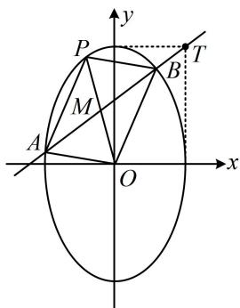
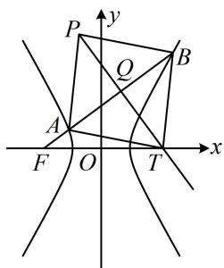
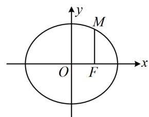
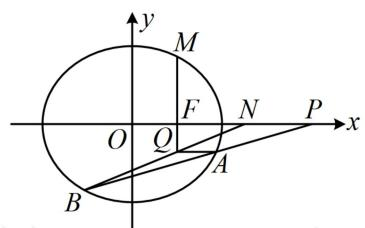
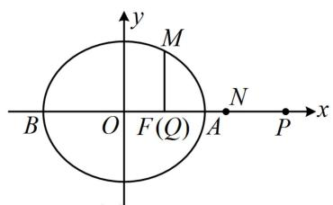
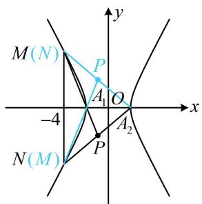
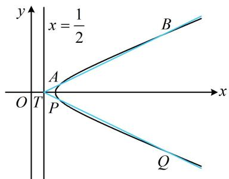

# 内容提要

本节归纳一些相对具有代表性的解析几何综合性的大题题型与方法，有下面三类：

# 1. 特殊四边形

①平行四边形：常按对角线互相平分来翻译。例如，若ABCD是平行四边形，则对角线AC的中点也是BD的中点，由此可建立方程，求解需要的量。  
②菱形：常抓住其对角线互相垂直平分来进行翻译.

# 2. 非对称韦达定理

在某些问题中，联立直线和椭圆（双曲线、抛物线）后，可能会涉及到需计算两根系数不相同的代数式。例如，遇到 $x_{1} - 2x_{2}$ ， $2x_{1} + 3x_{2}$ 等结构，且无法直接通过合并同类项化为系数相同的情况处理。像这种系数不对称的结构，通常无法根据韦达定理直接求出，此时一般有两种情况：

①如果式子中既有 $x$ ，又有 $y$ ，可考虑利用直线的方程消去 $x$ 或 $y$ ，看整合后能否化为对称结构处理；  
②如果式子中只有 $x$ （只有 $y$ 时类似处理即可），可抓住 $x_{1} + x_{2}$ 和 $x_{1}x_{2}$ 的关系将两根之积向两根之和转化，通过局部替换、整体约分的方法求出结果。这种做法本质上是消元，但消的是韦达定理中直线的参数，而不是 $x_{1}, x_{2}$ （详见例2的变式）。

# 3. 点乘双根法的应用

遇到诸如 $(x_{1} - m)(x_{2} - m)$ 这类结构时，除了展开为 $x_{1}x_{2} - m(x_{1} + x_{2}) + m^{2}$ ，结合韦达定理来计算外，还可以采用点乘双根法来快速计算，具体的计算方法请参考本节例3.

# 类型 I：特殊四边形

##### 【例1】已知椭圆 $C: 9x^{2} + y^{2} = m^{2} (m > 0)$ ，直线 $l$ 不过原点 $O$ 且不平行于坐标轴， $l$ 与 $C$ 有两个交点 $A, B$ ，线段 $AB$ 的中点为 $M$ .

（1） 证明: 直线 $O M$ 的斜率与 $l$ 的斜率的乘积为定值;  
（2）若 $l$ 过点 $\left(\frac{m}{3}, m\right)$ ，延长线段 $OM$ 与 $C$ 交于点 $P$ ，四边形 $OAPB$ 能否为平行四边形？若能，求此时 $l$ 的斜率；若不能，说明理由.

解: （1） (要证的结论是中点弦斜率积结论, 可以用点差法证, 但考虑到第 （2） 问可能也要联立直线 $l$ 与椭圆方程, 所以这里我们直接联立, 用韦达定理求出中点 $M$ 的坐标, 再证结论)

由题意，可设直线 $l$ 的方程为 $y = kx + b (k \neq 0, b \neq 0)$ ，设 $A(x_{1}, y_{1})$ ， $B(x_{2}, y_{2})$ ，

联立 $\left\{ \begin{array}{l} y = kx + b \\ 9x^{2} + y^{2} = m^{2} \end{array} \right.$ 消去 $y$ 整理得： $(9 + k^{2})x^{2} + 2kbx + b^{2} - m^{2} = 0$

所以 $x_{1} + x_{2} = -\frac{2kb}{9 + k^{2}}$ ， $x_{1}x_{2} = \frac{b^{2} - m^{2}}{9 + k^{2}}$ ，从而 $y_{1} + y_{2} = k(x_{1} + x_{2}) + 2b = \frac{18b}{9 + k^{2}}$ ，故 $M\left(-\frac{kb}{9 + k^2},\frac{9b}{9 + k^2}\right)$

所以直线 $OM$ 的斜率为 $k_{OM} = -\frac{9}{k}$ ，故 $k_{OM} \cdot k = -9$ 为定值.

（2） 解法 1: (涉及 $OAPB$ 为平行四边形, 可按对角线互相平分翻译. 这里已有 $M$ 为 $AB$ 中点, 所以 $OAPB$ 为平行四边形等价于 $M$ 也是 $OP$ 中点, 故可由 $O$ , $M$ 的坐标求 $P$ 的坐标, 代入椭圆方程)

记 $T\left(\frac{m}{3},m\right)$ ，椭圆C的方程可化为 $\frac{y^{2}}{m^{2}}+\frac{x^{2}}{\frac{m^{2}}{9}}=1$ ，所以T的位置如图所示，因为l过点T且不过原点，并与

椭圆 $C$ 有2个交点，所以其斜率 $k > 0$ 且 $k \neq 3$ ，将 $\left(\frac{m}{3}, m\right)$ 代入 $y = kx + b$ 得 $b = \frac{(3 - k)m}{3}$ ①，

由（1）知 $M\left(-\frac{kb}{9 + k^2}, \frac{9b}{9 + k^2}\right)$ ，若四边形 OAPB 为平行四边形，则 $M$ 为 $OP$ 中点，所以 $P\left(-\frac{2kb}{9 + k^2}, \frac{18b}{9 + k^2}\right)$ ，代入椭圆方程得 $9 \cdot \left(-\frac{2kb}{9 + k^2}\right)^2 + \left(\frac{18b}{9 + k^2}\right)^2 = m^2$ ②，

将式①代入式②消去 $b$ 可得 $9 \cdot \frac{4k^2}{(9 + k^2)^2} \cdot \frac{(3 - k)^2 m^2}{9} + \frac{18^2}{(9 + k^2)^2} \cdot \frac{(3 - k)^2 m^2}{9} = m^2$

所以 $\frac{4k^2(3 - k)^2}{(9 + k^2)^2} +\frac{36(3 - k)^2}{(9 + k^2)^2} = 1$ ，从而 $\frac{4(3 - k)^2(k^2 + 9)}{(9 + k^2)^2} = 1$ ，故 $4(3 - k)^2 = 9 + k^2$ ，解得： $k = 4\pm \sqrt{7}$

都满足 $k > 0$ 且 $k \neq 3$ ，所以四边形 OAPB 能为平行四边形，此时直线 $l$ 的斜率为 $4 \pm \sqrt{7}$ .

【解法2】: (解法1将 $P$ 代入椭圆得到的方程较复杂, 有没有其它更好的建立方程的方法? 如图, 根据（1）问的结论, 容易写出 $O M$ 的方程, 与椭圆联立可求出 $P$ 的坐标, 再翻译 $M$ 为 $O P$ 中点, 可能更简单)

因为 l 过点 $\left(\frac{m}{3}, m\right)$ 且不过原点，并与椭圆 C 有 2 个交点，所以其斜率 k > 0 且 $k \neq 3$ ，由（1）知 $k_{OM} = -\frac{9}{k}$ ，

所以 $OM$ 的方程为 $y = -\frac{9}{k} x$ ，代入 $9x^{2} + y^{2} = m^{2}$ 可解得： $x^{2} = \frac{m^{2}k^{2}}{9k^{2} + 81}$

所以 $x_{P} = \pm \frac{km}{3\sqrt{k^{2} + 9}}$ ，将点 $\left(\frac{m}{3}, m\right)$ 代入直线 $l$ 的方程 $y = kx + b$ 得 $b = \frac{(3 - k)m}{3}$

由（1）知 $x_{M} = -\frac{kb}{9 + k^{2}} = -\frac{k(3 - k)m}{3(9 + k^{2})}$

四边形 OAPB 为平行四边形等价于 M 也为 OP 中点，即 $x_{P}=2x_{M}$ ，

也即 $\pm \frac{km}{3\sqrt{k^2 + 9}} = 2\cdot \left[-\frac{k(3 - k)m}{3(9 + k^2)}\right]$ ，解得： $k = 4\pm \sqrt{7}$ ，满足 $k > 0$ 且 $k\neq 3$

所以四边形 OAPB 能为平行四边形，此时直线 l 的斜率为 $4 \pm \sqrt{7}$ .

【反思】解析几何大题中, 遇到平行四边形, 常按对角线互相平分来翻译. 具体操作时, 建立方程的方法是多样的. 例如本题解法 1 根据 $M$ 为 $OP$ 中点求 $P$ 的坐标, 代入椭圆建立方程, 解法 2 则用直线 $OM$ 与椭圆联立求出 $P$ 的坐标, 根据 $M$ 为 $OP$ 中点建立方程. 虽然都是按对角线互相平分翻译, 但计算量略有差别.

##### 【变式】已知双曲线 $C: \frac{x^2}{a^2} - \frac{y^2}{b^2} = 1 (a > 0, b > 0)$ 的一条渐近线的斜率为 $\sqrt{3}$ ，且过点(2,3).

（1） 求双曲线 C 的方程;

（2） 过 $C$ 的左焦点 $F$ 且不与坐标轴垂直的直线 $l$ 与 $C$ 交于 $A, B$ 两点, 点 $T$ 在 $x$ 轴上, 点 $P$ 在 $C$ 上, 四边形 $TAPB$ 能否为菱形? 若能, 求出此时直线 $l$ 的方程和点 $T$ 的坐标; 否则, 说明理由.

解：（1）由题意， $\left\{ \begin{array}{l} \frac{b}{a} = \sqrt{3}\\  \frac{4}{a^2} -\frac{9}{b^2} = 1 \end{array} \right.$ ，解得： $\left\{ \begin{array}{l} a = 1\\ b = \sqrt{3} \end{array} \right.$ ，所以双曲线 $C$ 的方程为 $x^{2} - \frac{y^{2}}{3} = 1$

（2） 由 （1） 可得双曲线的半焦距 $c = \sqrt{a^2 + b^2} = 2$ ，所以 $F(-2,0)$ ，

(怎样翻译 TAPB 为菱形? 如图, TAPB 为菱形意味着 AB 与 PT 垂直平分, 要翻译此几何关系, 需要 AB, PT 中点 Q 的坐标, 故考虑设直线 l 的方程, 与双曲线方程联立, 结合韦达定理求 Q 的坐标)

直线 $l$ 过 $F$ 且不与坐标轴垂直，可设其方程为 $x = my - 2(m \neq 0)$ ，设 $A(x_{1}, y_{1})$ ， $B(x_{2}, y_{2})$

联立 $\left\{ \begin{array}{l} x = my - 2 \\ 3x^{2} - y^{2} = 3 \end{array} \right.$ 消去 $x$ 整理得： $(3m^{2} - 1)y^{2} - 12my + 9 = 0$ ，因为直线 $l$ 与双曲线 $C$ 有 2 个交点，

所以 $\left\{ \begin{array}{l} 3m^2 - 1 \neq 0 \\ \Delta = (-12m)^2 - 4(3m^2 - 1) \cdot 9 = 36(m^2 + 1) > 0 \end{array} \right.$ ，解得： $m \neq \pm \frac{\sqrt{3}}{3}$ ，

由韦达定理， $y_{1} + y_{2} = \frac{12m}{3m^{2} - 1}$ ，所以 $x_{1} + x_{2} = m(y_{1} + y_{2}) - 4 = \frac{4}{3m^{2} - 1}$ ，故 $AB$ 中点为 $Q\left(\frac{2}{3m^2 - 1}, \frac{6m}{3m^2 - 1}\right)$ ，

(接下来怎样建立方程求 $m$ ? 注意到 $PT$ 是 $AB$ 的中垂线, 其方程容易写出, 将该方程与 $x$ 轴联立可求 $T$ 的坐标, 结合 $Q$ 为 $PT$ 中点又能求 $P$ 的坐标, 代入双曲线即可建立方程)

线段 $AB$ 的中垂线为 $y - \frac{6m}{3m^2 - 1} = -m\left(x - \frac{2}{3m^2 - 1}\right)$ ，即 $y = -mx + \frac{8m}{3m^2 - 1}$ ①，

若四边形 $TAPB$ 为菱形，则点 $T$ 必为线段 $AB$ 的中垂线与 $x$ 轴的交点，

在①中令 $y = 0$ 可得 $x = \frac{8}{3m^2 - 1}$ ，所以 $T\left(\frac{8}{3m^2 - 1}, 0\right)$ ，

又 $Q$ 为 $PT$ 的中点，所以 $P\left(-\frac{4}{3m^2 - 1}, \frac{12m}{3m^2 - 1}\right)$ ，

代入双曲线 $C$ 的方程得 $\frac{16}{(3m^2 - 1)^2} -\frac{1}{3}\cdot \frac{144m^2}{(3m^2 - 1)^2} = 1$ ，所以 $\frac{16(1 - 3m^2)}{(3m^2 - 1)^2} = 1$

化简得： $m^{2} = -5$ ，无解，所以四边形 TAPB 不可能为菱形.

【反思】解析几何大题中，菱形常抓住对角线互相垂直平分这一特征来翻译.

# 类型 II：非对称韦达定理

【例 2】(2024·全国甲卷) 设椭圆 $C: \frac{x^{2}}{a^{2}} + \frac{y^{2}}{b^{2}} = 1 (a > b > 0)$ 的右焦点为 F，点 $M\left(1, \frac{3}{2}\right)$ 在 C 上，且 $MF \perp x$ 轴.

（1） 求 C 的方程;

（2）过点 $P(4,0)$ 的直线交 $C$ 于 $A, B$ 两点， $N$ 为线段 $FP$ 的中点，直线 $NB$ 交直线 $MF$ 与点 $Q$ 。证明： $AQ \perp y$ 轴。

解：（1）如图1，因为 $M\left(1, \frac{3}{2}\right)$ ， $MF \perp x$ 轴，所以 $F(1,0)$ ，故 $a^2 - b^2 = 1$ ①，

又因为 $M$ 在椭圆 $C$ 上，所以 $\frac{1}{a^2} +\frac{9}{4b^2} = 1$ ，结合①解得： $a = 2$ ， $b = \sqrt{3}$ ，所以 $C$ 的方程为 $\frac{x^2}{4} +\frac{y^2}{3} = 1$

（2） (要证 $AQ \perp y$ 轴, 只需证 $A, Q$ 纵坐标相等, 可考虑设 $A, B$ 的坐标, 用于求 $Q$ 的坐标) 设 $A(x_{1}, y_{1})$ , $B(x_{2}, y_{2})$ , 由题意, $P(4,0)$ , $F(1,0)$ , 所以 $FP$ 中点为 $N\left(\frac{5}{2}, 0\right)$ , 从而 $k_{NB} = \frac{y_2}{x_2 - \frac{5}{2}} = \frac{2y_2}{2x_2 - 5}$ ,

故直线 $NB$ 的方程为 $y = \frac{2y_2}{2x_2 - 5}\left(x - \frac{5}{2}\right)$ ，令 $x = 1$ 得 $y = -\frac{3y_2}{2x_2 - 5}$ ，所以 $y_{Q} = -\frac{3y_2}{2x_2 - 5}$ ，

要证 $AQ \perp y$ 轴，只需证 $-\frac{3y_2}{2x_2 - 5} = y_1$ ，即证 $-3y_2 = 2x_2y_1 - 5y_1$ ②，

(式②中 $x_{1}$ 和 $x_{2}$ , $y_{1}$ 和 $y_{2}$ 系数不对称, 不方便直接计算, 怎么办呢? 既有 $x$ 又有 $y$ , 可考虑设直线 $AB$ 的方程, 并利用该方程将式②消元, 再观察怎样计算. 直线 $AB$ 过 $x$ 轴上的定点, 考虑设横截式方程)

当 $AB \perp y$ 轴时，如图 3，A，Q 都在 x 轴上，满足 $AQ \perp y$ 轴；

当 $AB$ 不与 $y$ 轴垂直时，可设其方程为 $x = my + 4$ ，则 $x_{2} = my_{2} + 4$

代入②得 $-3y_{2} = 2(my_{2} + 4)y_{1} - 5y_{1}$ ，整理得： $2my_{1}y_{2} + 3(y_{1} + y_{2}) = 0$ ③，

(此时发现有 $y_{1} + y_{2}$ 和 $y_{1}y_{2}$ , 故联立直线 $AB$ 和椭圆方程, 用韦达定理计算它们)

联立 $\left\{ \begin{array}{l} x = my + 4 \\ \frac{x^2}{4} + \frac{y^2}{3} = 1 \end{array} \right.$ 消去 $x$ 整理得： $(3m^2 + 4)y^2 + 24my + 36 = 0$ ， $\Delta = (24m)^2 - 4(3m^2 + 4) \cdot 36 = 144(m^2 - 4) > 0$ ，

解得： $m < -2$ 或 $m > 2$ ，由韦达定理， $y_{1} + y_{2} = -\frac{24m}{3m^{2} + 4}$ ， $y_{1}y_{2} = \frac{36}{3m^{2} + 4}$

所以 $2m \cdot \frac{36}{3m^2 + 4} + 3\left(-\frac{24m}{3m^2 + 4}\right) = 0$ ，从而式③成立，故 $AQ \perp y$ 轴；综上所述， $AQ \perp y$ 轴.

图1

图2

图3

【反思】当式子中既有 $x$ ，又有 $y$ 时，若遇到系数不对称的情况，可考虑利用直线的方程消元，将变量统一成 $x$ 或 $y$ ，也许系数就对称了，此时可再结合韦达定理计算.

##### 【变式】（2023·新课标Ⅱ卷）双曲线 C 的中心为坐标原点，左焦点为 $(-2\sqrt{5},0)$ ，离心率为 $\sqrt{5}$ .

（1） 求 C 的方程;

（2）记 $C$ 的左、右顶点分别为 $A_{1}$ ， $A_{2}$ ，过点 $(-4,0)$ 的直线与 $C$ 的左支交于 $M$ ， $N$ 两点， $M$ 在第二象限，直线 $MA_{1}$ 与 $NA_{2}$ 交于点 $P$ ，证明：点 $P$ 在定直线上.

解：（1）设双曲线 $C$ 的方程为 $\frac{x^2}{a^2} -\frac{y^2}{b^2} = 1(a > 0,b > 0)$ ，则由题意， $a^2 +b^2 = (2\sqrt{5})^2 = 20$

离心率 $e = \frac{c}{a} = \frac{2\sqrt{5}}{a} = \sqrt{5}$ ，所以 $a = 2$ ， $b = 4$ ，故 $C$ 的方程为 $\frac{x^2}{4} - \frac{y^2}{16} = 1$ .

（2） (点 $P$ 在哪条定直线上? 我们先用特殊情况寻找计算的思路. 尽管题干规定了 $M$ 在第二象限, 但直观感觉可知即使 $M$ , $N$ 交换位置, 也不影响结论. 如图, 考虑 $MN \perp x$ 轴的情形, 由图形的对称性不难发现交换 $M$ , $N$ 后得到的点 $P$ 与原来的 $P$ 关于 $x$ 轴对称, 故可猜测 $P$ 在某条与 $x$ 轴垂直的定直线上, 这意味着 $x_{P}$ 为定值, 故只需求 $x_{P}$ . 由于 $P$ 是 $MA_{1}$ 与 $NA_{2}$ 的交点, 而 $A_{1}$ , $A_{2}$ 坐标已知, 所以可考虑设 $M$ , $N$ 的坐标, 写出 $MA_{1}$ 和 $NA_{2}$ 的方程, 并联立求 $x_{P}$ ) 设 $M(x_{1}, y_{1})$ , $N(x_{2}, y_{2})$ , 由 （1） 知 $A_{1}(-2,0)$ , $A_{2}(2,0)$ ,

所以直线 $MA_{1}$ 的方程为 $y = \frac{y_1}{x_1 + 2} (x + 2)$ ，直线 $NA_{2}$ 的方程为 $y = \frac{y_2}{x_2 - 2} (x - 2)$ ，

联立 $\left\{ \begin{array}{l} y = \frac{y_1}{x_1 + 2} (x + 2) \\ y = \frac{y_2}{x_2 - 2} (x - 2) \end{array} \right.$ 消去 $y$ 得： $\frac{y_1}{x_1 + 2} (x + 2) = \frac{y_2}{x_2 - 2} (x - 2)$ ，所以 $\frac{x + 2}{x - 2} = \frac{(x_1 + 2)y_2}{(x_2 - 2)y_1}$ ①，

(只要求出式①的右侧, 就能得到 $P$ 的横坐标, 怎样计算? 既有 $x$ 又有 $y$ , 不好处理, 可考虑设直线 $MN$ 的方程, 并用于消元) 如图, 直线 $MN$ 不与 $y$ 轴垂直, 可设其方程为 $x = my - 4$ , 则 $\left\{ \begin{array}{l} x_{1} = my_{1} - 4 \\ x_{2} = my_{2} - 4 \end{array} \right.$ ,代入式①可得 $\frac{x + 2}{x - 2} = \frac{(my_1 - 2)y_2}{(my_2 - 6)y_1} = \frac{my_1y_2 - 2y_2}{my_1y_2 - 6y_1}$ ②，

(上式中有 $y_{1} y_{2}$ , 想到联立直线 $M N$ 和双曲线的方程, 结合韦达定理处理)

联立 $\left\{ \begin{array}{l} x = my - 4 \\ \frac{x^2}{4} - \frac{y^2}{16} = 1 \end{array} \right.$ 消去 $x$ 整理得： $(4m^2 - 1)y^2 - 32my + 48 = 0$

由韦达定理， $y_{1} + y_{2} = \frac{32m}{4m^{2} - 1}$ ③， $y_{1}y_{2} = \frac{48}{4m^{2} - 1}$ ④，

因为直线 $MN$ 与双曲线左支有2个交点，所以 $\left\{ \begin{array}{l}4m^{2} - 1\neq 0\\ \Delta = (-32m)^{2} - 4(4m^{2} - 1)\cdot 48 > 0,\\ y_{1}y_{2} = \frac{48}{4m^{2} - 1} < 0 \end{array} \right.$ 解得： $-\frac{1}{2} < m < \frac{1}{2},$

(可以想象, 式②中有 $-2y_{2}$ 和 $-6y_{1}$ , 这两部分由于无法凑成系数对称的结构, 故不能用韦达定理计算, 而若将 $y_{1}y_{2} = \frac{48}{4m^{2} - 1}$ 代入式②, 则仍有 $y_{1}, y_{2}, m$ 三个变量, 怎么办呢? 消元的方向肯定没错, 既然无法用韦达定理消 $y_{1}, y_{2}$ , 那我们转换思路, 改为消 $m$ 试试)

由③④可得 $my_{1}y_{2} = \frac{48m}{4m^{2} - 1} = \frac{3}{2}\cdot \frac{32m}{4m^{2} - 1} = \frac{3}{2} (y_{1} + y_{2})$ ，代入②得 $\frac{x + 2}{x - 2} = \frac{\frac{3}{2}(y_1 + y_2) - 2y_2}{\frac{3}{2}(y_1 + y_2) - 6y_1} = \frac{\frac{3}{2}y_1 - \frac{1}{2}y_2}{-\frac{9}{2}y_1 + \frac{3}{2}y_2}$ $= \frac{\frac{3}{2}y_1 - \frac{1}{2}y_2}{-3\left(\frac{3}{2}y_1 - \frac{1}{2}y_2\right)} = -\frac{1}{3}$ ，解得： $x = -1$ ，所以直线 $MA_{1}$ 与 $NA_{2}$ 的交点 $P$ 在定直线 $x = -1$ 上.

【反思】遇到像 $\frac{my_{1}y_{2}-2y_{2}}{my_{1}y_{2}-6y_{1}}$ 这种含有 $-2y_{2}$ 和 $-6y_{1}$ 的系数不对称结构，用韦达定理消 $y_{1}$ ， $y_{2}$ 往往行不通，可转为消 m，具体操作方法是找到 $my_{1}y_{2}$ 与 $y_{1}+y_{2}$ 的关系，再替换掉式中的 $my_{1}y_{2}$ ，往往就能约分，求得结果.

# 类型III：点乘双根法的应用

【例 3】(2021·新高考 I 卷) 在平面直角坐标系 xOy 中, 已知点 $F_{1}(-\sqrt{17}, 0)$ , $F_{2}(\sqrt{17}, 0)$ , 点 M 满足 $\left|MF_{1}\right| - \left|MF_{2}\right| = 2$ , 记 M 的轨迹为 C.

（1） 求 C 的方程;

（2）设点 $T$ 在直线 $x = \frac{1}{2}$ 上，过 $T$ 的两条直线分别交 $C$ 于 $A$ ， $B$ 两点和 $P$ ， $Q$ 两点，且 $\left|TA\right| \cdot \left|TB\right| = \left|TP\right| \cdot \left|TQ\right|$ ，求直线 $AB$ 的斜率与直线 $PQ$ 的斜率之和.

解：（1）由题意， $\left|MF_{1}\right|-\left|MF_{2}\right|=2$ ，由双曲线定义，点M的轨迹是以 $F_{1}$ ， $F_{2}$ 为焦点的双曲线的右支，设其实半轴长为a，则 $\left|MF_{1}\right|-\left|MF_{2}\right|=2a=2$ ，所以a=1，由 $F_{1}$ ， $F_{2}$ 的坐标可知双曲线C的半焦距 $c=\sqrt{17}$ ，所以虚半轴长 $b=\sqrt{c^{2}-a^{2}}=4$ ，故C的方程为 $x^{2}-\frac{y^{2}}{16}=1(x\geq1)$ .

（2） (目标是求 $AB$ , $PQ$ 的斜率和, 故设出斜率; 条件中的 $|TA|$ , $|TB|$ 等长度可用公式 $\sqrt{1 + k^2} \cdot |x_1 - x_2|$ 算, 故再设出坐标)

设 $T\left(\frac{1}{2},m\right)$ ，设直线 $AB$ ， $PQ$ 的斜率分别为 $k_{1}$ ， $k_{2}(k_{1}\neq k_{2})$ ，设 $A(x_{1},y_{1})$ ， $B(x_{2},y_{2})$ ， $x_{1}\geq 1$ ， $x_{2}\geq 1$

由弦长公式， $|TA| = \sqrt{1 + k_1^2}\left|x_1 - \frac{1}{2}\right| = \sqrt{1 + k_1^2}\left(x_1 - \frac{1}{2}\right),\quad |TB| = \sqrt{1 + k_1^2}\left|x_2 - \frac{1}{2}\right| = \sqrt{1 + k_1^2}\left(x_2 - \frac{1}{2}\right),$

所以 $|TA|\cdot |TB| = (1 + k_1^2)\left(x_1 - \frac{1}{2}\right)\left(x_2 - \frac{1}{2}\right)$ ①，（式①中 $k_{1}$ 为计算的目标，所以需化简 $\left(x_{1} - \frac{1}{2}\right)\left(x_{2} - \frac{1}{2}\right)$ ，故写出 $AB$ 的方程，并与双曲线联立，将其变为含 $k_{1}$ 和 $m$ 的代数式）

直线 $AB$ 的方程为 $y - m = k_{1}\left(x - \frac{1}{2}\right)$ ，即 $y = k_{1}x + m - \frac{k_{1}}{2}$ ，

代入 $x^{2} - \frac{y^{2}}{16} = 1$ 消去 $y$ 整理得： $(16 - k_1^2)x^2 -2k_1\left(m - \frac{k_1}{2}\right)x - \left(m - \frac{k_1}{2}\right)^2 -16 = 0$ ②，

(若写出韦达定理, 再按 $\left(x_{1} - \frac{1}{2}\right)\left(x_{2} - \frac{1}{2}\right) = x_{1}x_{2} - \frac{x_{1} + x_{2}}{2} +\frac{1}{4}$ 来算则较麻烦, 可用 “点乘双根法 (见反思)” 直接算目标式 $\left(x_{1} - \frac{1}{2}\right)\left(x_{2} - \frac{1}{2}\right)$ , 先把方程②化为双根式)

由 $x_{1}$ ， $x_{2}$ 是方程②的两根知该方程可化为 $(16 - k_1^2)x^2 -2k_1\left(m - \frac{k_1}{2}\right)x - \left(m - \frac{k_1}{2}\right)^2 -16 = (16 - k_1^2)(x - x_1)(x - x_2)$ ，两端同时取 $x = \frac{1}{2}$ 得 $\frac{16 - k_1^2}{4} -k_1\left(m - \frac{k_1}{2}\right) - \left(m - \frac{k_1}{2}\right)^2 -16 = (16 - k_1^2)\left(\frac{1}{2} -x_1\right)\left(\frac{1}{2} -x_2\right),$

所以 $\left(x_{1} - \frac{1}{2}\right)\left(x_{2} - \frac{1}{2}\right) = \frac{\frac{16 - k_1^2}{4} - k_1\left(m - \frac{k_1}{2}\right) - \left(m - \frac{k_1}{2}\right)^2 - 16}{16 - k_1^2} = \frac{m^2 + 12}{k_1^2 - 16}$ ，代入①得 $|TA|\cdot |TB| = (1 + k_1^2)\cdot \frac{m^2 + 12}{k_1^2 - 16}$ ，

（再算 $|TP|\cdot|TQ|$ ，需要重复上述过程吗？不用，它与上面的差别只是 $k_{1}$ 变成了 $k_{2}$ ，故直接在上述结果中将 $k_{1}$ 换成 $k_{2}$ 即可）同理， $|TP|\cdot|TQ|=(1+k_{2}^{2})\cdot\frac{m^{2}+12}{k_{2}^{2}-16}$ ，

因为 $\left|TA\right|\cdot\left|TB\right|=\left|TP\right|\cdot\left|TQ\right|$ ，所以 $(1+k_{1}^{2})\cdot\frac{m^{2}+12}{k_{1}^{2}-16}=(1+k_{2}^{2})\cdot\frac{m^{2}+12}{k_{2}^{2}-16}$

从而 $\frac{1 + k_1^2}{k_1^2 - 16} = \frac{1 + k_2^2}{k_2^2 - 16}$ ，故 $\frac{(k_1^2 - 16) + 17}{k_1^2 - 16} = \frac{(k_2^2 - 16) + 17}{k_2^2 - 16}$ ，

所以 $1 + \frac{17}{k_1^2 - 16} = 1 + \frac{17}{k_2^2 - 16}$ ，故 $\frac{17}{k_1^2 - 16} = \frac{17}{k_2^2 - 16}$ ，化简得： $k_1^2 = k_2^2$ ，

结合 $k_{1} \neq k_{2}$ 知 $k_{1} = -k_{2}$ ，所以 $k_{1} + k_{2} = 0$ ，

故直线 $AB$ 的斜率与直线 $PQ$ 的斜率之和为0.

【反思】若将直线与圆锥曲线方程联立，得到关于 $x$ 的一元二次方程 $ax^2 + bx + c = 0 (a \neq 0)$ ，设该方程的两根为 $x_1$ ， $x_2$ ，现在要算 $(x_1 - t)(x_2 - t)$ ，将其展开为 $x_1 x_2 - t(x_1 + x_2) + t^2$ ，结合韦达定理来算可行，但有时这样做计算量较大，更简单的方法是根据 $x_1$ ， $x_2$ 是该方程的两根，将该方程左侧的 $ax^2 + bx + c$ 化为两根式，得到 $ax^2 + bx + c = a(x - x_1)(x - x_2)$ ，观察发现在上式两端同时令 $x = t$ ，即可得到 $at^2 + bt + c = a(t - x_1)(t - x_2)$ ，从而 $(x_1 - t)(x_2 - t) = \frac{at^2 + bt + c}{a}$ ，这样就快速求出了目标量 $(x_1 - t)(x_2 - t)$ ，此法叫做“点乘双根法”。

# 强化训练

##### 1. (2024·北京模拟·★★★☆)

已知椭圆 $C: \frac{x^2}{a^2} + \frac{y^2}{b^2} = 1 (a > b > 0)$ 经过点 $(0, \sqrt{3})$ ，离心率为 $\frac{1}{2}$ ，过右焦点 $F$ 且与 $x$ 轴不垂直的直线 $l$ 交椭圆 $C$ 于 $P$ ， $Q$ 两点.

（1） 求椭圆 C 的方程;  
（2）在椭圆 $C$ 上是否存在点 $M$ ，使四边形OPMQ为平行四边形？若存在，求出直线 $l$ 的方程；若不存在，请说明理由.

##### 2. (2024·四川模拟·★★★★)

已知椭圆 $C: \frac{x^2}{a^2} + \frac{y^2}{b^2} = 1 (a > b > 0)$ 过点 $(2,0)$ ，离心率为 $\frac{\sqrt{2}}{2}$ .

（1） 求椭圆 C 的方程;  
（2） 直线 $l$ 过点 $P(1,1)$ , 且 $l$ 与椭圆 $C$ 交于 $M$ , $N$ 两点, 若 $\left|PM\right| \cdot \left|PN\right| = \frac{5}{9}$ , 求直线 $l$ 的方程.

##### 3. (2024·江苏南京模拟·★★★★)

已知椭圆 $C: \frac{x^2}{a^2} + \frac{y^2}{b^2} = 1 (a > b > 0)$ 过点 $A(-2,1)$ ，离心率为 $\frac{\sqrt{3}}{2}$ .

（1） 求椭圆 C 的方程;  
（2） 设点 $A$ 关于 $y$ 轴的对称点为 $B$ , 直线 $l$ 与 $OB$ 平行, 且与椭圆 $C$ 相交于 $M$ , $N$ 两点, 直线 $BM$ , $BN$ 分别与 $y$ 轴交于 $P$ , $Q$ 两点, 求证: 四边形 $APBQ$ 为菱形.

##### 4.（2024·北京模拟·★★★★）

已知椭圆 $\frac{x^2}{a^2} +\frac{y^2}{b^2} = 1(a > b > 0)$ 的左、右焦点分别为 $F_{1}$ ， $F_{2}$ ，离心率为 $\frac{1}{2}$ ，过椭圆的左焦点 $F_{1}$ 作不与 $x$ 轴重合的直线与椭圆相交于 $M$ ， $N$ 两点， $\triangle MNF_{2}$ 的周长为8，过点 $M$ 作直线 $x = -2a$ 的垂线ME，垂足为E.

（1） 求椭圆 C 的标准方程;  
（2） 证明: 直线 $EN$ 经过定点 $P$ , 并求定点 $P$ 的坐标.

