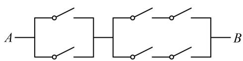
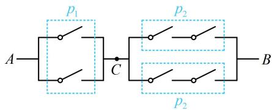

# 强化训练

##### 1. (2022·陕西汉中模拟·★★)

对于事件 $A, B$ , 下列命题不正确的是 ( )

$\quad$A. 若 $A, B$ 互斥，则 $P(A) + P(B) \leq 1$   
$\quad$B. 若 $A, B$ 对立，则 $P(A) + P(B) = 1$   
$\quad$C. 若 $A, B$ 独立，则 $P(\overline{A}) P(\overline{B}) = P(\overline{A} \overline{B})$   
$\quad$D. 若 $A, B$ 独立，则 $P(A) + P(B) \leq 1$

##### 1. D

解析A项，若 $A$ ， $B$ 互斥，则 $P(A) + P(B) = P(A \cup B) \leq 1$ ，故A项正确；

B 项，若 A，B 对立，则由内容提要第 3 点④的公式可得

$P(A)+P(B)=1$ ，故 B 项正确；

C项，若 $A$ ， $B$ 独立，则 $\overline{A}$ 与 $\overline{B}$ 也独立，所以 $P(\overline{A})P(\overline{B})$

$= P(\overline{A}\overline{B})$ ，故C项正确；

D 项，若 A, B 独立，则 $P(A) + P(B) \leq 1$ 不一定成立。例如，连续掷两次骰子，记事件 A 为第一次掷出的点数大于 1，事件 B 为第二次掷出的点数大于 1，两次试验结果显然互不影响，所以满足 A，B 独立，但 $P(A) + P(B) = \frac{5}{6} + \frac{5}{6} = \frac{5}{3}$

>1，故D项错误.

##### 2. (2023·甘肃天水模拟·★★)

从 2, 3, 4, 9 中任取两个不同的数，分别记为 $a$ , $b$ ，则 $\log_a b = 2$ 的概率为（）

$\quad$A. $\frac{1}{12}$

$\quad$B. $\frac{1}{6}$

$\quad$C. $\frac{1}{3}$

$\quad$D. $\frac{2}{3}$

##### 2. B

解析4 个中取 2 个，样本点个数不多，可直接罗列，

由题意，样本空间 $\Omega = \{(2,3),(2,4),(2,9),(3,4),(3,9),$

$(4,9),(3,2),(4,2),(9,2),(4,3),(9,3),(9,4)\}$

其中满足 $\log_a b = 2$ 的样本点是(2,4)，(3,9)，

故所求概率 $P=\frac{2}{n(\Omega)}=\frac{2}{12}=\frac{1}{6}$ .

##### 3. (2023·重庆二诊·★★)

饺子是我国的传统美食，不仅味道鲜美而且寓意美好。现锅中煮有白菜馅饺子4个，韭菜馅饺子3个，这两种饺子的外形完全相同。从中任意舀取3个饺子，则每种口味的饺子都至少舀取到1个的概率为\_\_\_\_。

##### 3. $\frac{6}{7}$

解析每种至少舀到1个，可能的情况有白菜饺子1个韭菜饺子2个，白菜饺子2个韭菜饺子1个两种，分别考虑即可，

若舀到白菜饺子1个韭菜饺子2个，则有 $\mathrm{C}_4^1\mathrm{C}_3^2 = 12$ 种；

若舀到白菜饺子2个韭菜饺子1个，则有 $\mathrm{C}_4^2\mathrm{C}_3^1 = 18$ 种；

而随意舀3个饺子，全部的结果有 $C_{7}^{3}=35$ 种，

故所求概率 $P=\frac{12+18}{35}=\frac{6}{7}$ .

##### 4. (2023·四川绵阳二诊·★★★)

寒假来临，秀秀将从《西游记》、《童年》、《巴黎圣母院》、《战争与和平》、《三国演义》、《水浒传》这六部著作中选四部（其中国外两部，国内两部），每周看一部，连续四周看完，则《三国演义》与《水浒传》被选中且在相邻两周看完的概率为（）

$\quad$A. $\frac{1}{12}$

$\quad$B. $\frac{1}{6}$

$\quad$C. $\frac{1}{3}$

$\quad$D. $\frac{2}{3}$

##### 4. B

解析样本点个数较多，罗列困难，故用排列组合方法计算，先求 $n(\Omega)$ ，记让求概率的事件为 $A$ ，因为六部著作中国内国外各有三部，所以选出著作的方法有 $\mathrm{C}_3^2\mathrm{C}_3^2$ 种，

选出书后，还要安排看书的顺序，有 $\mathrm{A}_4^4$ 种排法，

所以 $n(\Omega)=\mathrm{C}_{3}^{2}\mathrm{C}_{3}^{2}\mathrm{A}_{4}^{4}=216$

若《三国演义》与《水浒传》被选中，则只需再从三部外国著作选2部，有 $\mathrm{C}_3^2$ 种选法，

选好后，再安排看的顺序，《三国演义》与《水浒传》要在相邻两周看完，用捆绑法，

将《三国演义》与《水浒传》捆绑，并与另外两部外国著作一起排序，有 $\mathrm{A}_2^2\mathrm{A}_3^3$ 种排法，

由分步乘法计数原理， $n(A) = \mathrm{C}_3^2\mathrm{A}_2^2\mathrm{A}_3^3 = 36$

所以 $P(A) = \frac{n(A)}{n(\Omega)} = \frac{36}{216} = \frac{1}{6}$ .

##### 5. (2023·四川成都模拟·★★)

口袋中装有编号为①、②的2个红球和编号为①、②、③、④、⑤的5个黑球，小球除颜色、编号外，形状、大小完全相同。现从中取出1个小球，记事件A为“取到的小球的编号为②”，事件B为“取到的小球是黑球”，则下列说法正确的是（）

$\quad$A. $A$ 与 $B$ 互斥

$\quad$B. $A$ 与 $B$ 对立

$\quad$C. $P(A\cap B) = \frac{6}{7}$

$\quad$D. $P(A \cup B) = \frac{6}{7}$

##### 5. D

解析样本点总数不多，可直接罗列来看，

记2个红球分别为 $r_1, r_2$ ，5个黑球分别为 $k_1, k_2, k_3, k_4, k_5$ ，

则样本空间 $\Omega=\{r_{1},r_{2},k_{1},k_{2},k_{3},k_{4},k_{5}\}$ ， $A=\{r_{2},k_{2}\}$ ，

$B = \{k_{1}, k_{2}, k_{3}, k_{4}, k_{5}\}$ ，所以 $A \cap B = \{k_{2}\} \neq \emptyset$ ，

从而 $A$ 与 $B$ 不互斥，也不对立，故A项、B项错误；

再看 C、D 两项，涉及的概率为古典概型，故只需计算 $A \cap B$ 和 $A \cup B$ 包含的样本点个数即可，

因为 $n(A \cap B) = 1$ ， $n(\Omega) = 7$ ，所以 $P(A \cap B) = \frac{n(A \cap B)}{n(\Omega)}$

$= \frac{1}{7}$ ，故C项错误；

又 $A \cup B = \{r_2, k_1, k_2, k_3, k_4, k_5\}$ ，所以 $P(A \cup B) = \frac{n(A \cup B)}{n(\Omega)}$

$= \frac{6}{7}$ ，故D项正确.

##### 6. (2023·吉林模拟·★★)

掷一颗质地均匀的骰子，记随机事件 $A_{i} =$ “向上的点数为 $i$ ”，其中 $i = 1,2,3,4,5,6$ ， $B =$ “向上的点数为奇数”，则下列说法正确的是（）

$\quad$A. $\overline{A}_{1}$ 与 $B$ 互斥

$\quad$B. $A_{2} + B = \Omega$

$\quad$C. $A_{3}$ 与 $\bar{B}$ 相互独立

$\quad$D. $A_{4} \cap B = \emptyset$

##### 6. D

解析样本空间的样本点个数不多，可通过罗列来判断选项，由题意， $\Omega = \{1,2,3,4,5,6\}$ ，

A 项， $A_{1}=\{1\}\Rightarrow\overline{A}_{1}=\{2,3,4,5,6\}$ ，又 $B=\{1,3,5\}$ ，所以

$\overline{A}_1 \cap B = \{3, 5\} \neq \emptyset$ ，从而 $\overline{A}_1$ 与 $B$ 不互斥，故 A 项错误；

B 项， $A_{2}=\{2\}$ ，所以 $A_{2}+B=A_{2}\cup B=\{1,2,3,5\}\neq\varOmega$

故 B 项错误;

C 项， $A_{3}=\{3\}$ ， $\overline{B}=\{2,4,6\}$ ，所以 $P(A_{3})=\frac{n(A_{3})}{n(\Omega)}=\frac{1}{6}$ ，

$P(\overline{B}) = \frac{n(\overline{B})}{n(\Omega)} = \frac{1}{2}$ ，又 $A_{3}\cap \overline{B} = \varnothing$ ，所以 $P(A_3\cap \overline{B}) = 0$

$\neq P(A_{3})P(\overline{B})$ ，从而 $A_{3}$ 与 $\overline{B}$ 不独立，故C项错误；

D 项， $A_{4}=\{4\}$ ，所以 $A_{4}\cap B=\varnothing$ ，故 D 项正确.

##### 7. (2024·湖北武汉模拟·★★★)

抛掷一枚质地均匀的硬币 $n$ 次，记事件 $A =$ “ $n$ 次中既有正面朝上又有反面朝上”， $B =$ “ $n$ 次中至多有一次正面朝上”，下列说法不正确的是（）

$\quad$A. 当 $n = 2$ 时， $P(AB) = \frac{1}{2}$

$\quad$B. 当 $n = 2$ 时, 事件 $A$ 与事件 $B$ 不独立

$\quad$C. 当 $n = 3$ 时， $P(A + B) = \frac{7}{8}$

$\quad$D. 当 $n = 3$ 时, 事件 $A$ 与事件 $B$ 不独立

##### 7. D

解析A项，当 $n = 2$ 时，若事件 $A$ ， $B$ 同时发生，则2次抛掷中朝上的面为一正一反，

所以 $P(AB) = \mathrm{C}_2^1 \times \left(\frac{1}{2}\right)^1 \times \left(\frac{1}{2}\right)^1 = \frac{1}{2}$ ，故A项正确；

B 项，直观感觉不易看出 $A$ ， $B$ 是否独立，考虑用定义式 $P(AB) = P(A)P(B)$ 来判断，已有 $P(AB)$ ，下面计算 $P(A)$ 和 $P(B)$ ，当 $n = 2$ 时，事件 $A$ 表示 2 次抛掷中朝上的面为一正一反，与事件 $AB$ 相同，所以 $P(A) = P(AB) = \frac{1}{2}$ ，

事件 $B$ 即0次或1次正面朝上，所以 $P(B) =$

$\mathrm{C} _ {2} ^ {0} \times \left(\frac {1}{2}\right) ^ {0} \times \left(\frac {1}{2}\right) ^ {2} + \mathrm{C} _ {2} ^ {1} \times \left(\frac {1}{2}\right) ^ {1} \times \left(\frac {1}{2}\right) ^ {1} = \frac {1}{4} + \frac {1}{2} = \frac {3}{4},$

从而 $P(A)P(B)=\frac{1}{2}\times\frac{3}{4}=\frac{3}{8}\neq P(AB)$ ,

故事件 A 与事件 B 不独立，故 B 项正确；

C 项，看到 $P(A+B)$ ，想到按公式 $P(A+B)=P(A)+P(B)-$

$P(AB)$ 来计算它，当 $n = 3$ 时，事件 $A$ 即1次正面朝上，2次反面朝上，或2次正面朝上，1次反面朝上，所以 $P(A)$

$= \mathrm{C} _ {3} ^ {1} \times \left(\frac {1}{2}\right) ^ {1} \times \left(\frac {1}{2}\right) ^ {2} + \mathrm{C} _ {3} ^ {2} \times \left(\frac {1}{2}\right) ^ {2} \times \left(\frac {1}{2}\right) ^ {1} = \frac {3}{8} + \frac {3}{8} = \frac {3}{4},$

事件 $B$ 即0次或1次正面朝上，所以 $P(B) =$

$\mathrm{C} _ {3} ^ {0} \times \left(\frac {1}{2}\right) ^ {0} \times \left(\frac {1}{2}\right) ^ {3} + \mathrm{C} _ {3} ^ {1} \times \left(\frac {1}{2}\right) ^ {1} \times \left(\frac {1}{2}\right) ^ {2} = \frac {1}{8} + \frac {3}{8} = \frac {1}{2},$

事件 $AB$ 表示1次正面朝上，2次反面朝上，

所以 $P(AB) = \mathrm{C}_3^1\times \left(\frac{1}{2}\right)^1\times \left(\frac{1}{2}\right)^2 = \frac{3}{8}$ ，从而 $P(A + B) =$

$P(A)+P(B)-P(AB)=\frac{3}{4}+\frac{1}{2}-\frac{3}{8}=\frac{7}{8}$ ，故C项正确；

D 项，在 C 项的分析中已求得 $P(A)$ ， $P(B)$ ， $P(AB)$ ，故直接用 $P(AB)=P(A)P(B)$ 判断 A，B 是否独立，

当 $n = 3$ 时， $P(A)P(B) = \frac{3}{4} \times \frac{1}{2} = \frac{3}{8} = P(AB)$ ，

所以事件 A 与事件 B 相互独立，故 D 项错误.

##### 8. (2020·天津卷·★★☆)

已知甲、乙两球落入盒子的概率分别为 $\frac{1}{2}$ 和 $\frac{1}{3}$ ，假定两球是否落入盒子互不影响，则甲、乙两球都落入盒子的概率为\_\_\_\_；甲、乙两球至少有一个落入盒子的概率为\_\_\_\_。

##### 8. $\frac{1}{6}$ ; $\frac{2}{3}$

解析设甲、乙落入盒子分别为事件 A, B，则两球都落入盒子的概率为 $P(AB) = P(A)P(B) = \frac{1}{2} \times \frac{1}{3} = \frac{1}{6}$ ;

两球至少有一个落入盒子有 $A \overline{B}$ , $\overline{A} B$ , $AB$ 三种情况, 其对立事件只有 $\overline{A} \overline{B}$ 一种情况, 故用对立事件求概率, 甲、乙两球至少有一个落入盒子的概率为 $1 - P(\overline{A} \overline{B}) =$

$1 - P (\overline {{{A}}}) P (\overline {{{B}}}) = 1 - \left(1 - \frac {1}{2}\right) \times \left(1 - \frac {1}{3}\right) = \frac {2}{3}.$

##### 9. (2022·广东佛山模拟·★★★)

如图，电路从 $A$ 到 $B$ 上共连接了6个开关，每个开关闭合的概率都为 $\frac{2}{3}$ ，若每个开关是否闭合相互之间没有影响，则从 $A$ 到 $B$ 通路的概率是（）

$\quad$A. $\frac{10}{27}$

$\quad$B. $\frac{100}{243}$

$\quad$C. $\frac{448}{729}$

$\quad$D. $\frac{40}{81}$

##### 9. C

解析如图，把电路分成两部分，先看 $A$ 到 $C$ . 两个开关应至少闭合1个，可能的情况较多，但其对立事件只有两个开关都断开这一种情况，故考虑用对立事件求概率，

从 $A$ 到 $C$ 通路的概率 $p_1 = 1 - \left(1 - \frac{2}{3}\right) \times \left(1 - \frac{2}{3}\right) = \frac{8}{9}$ ,

再看从 $C$ 到 $B$ , 又分完全相同的上、下两部分, 要使从 $C$ 到 $B$ 通路, 上、下应至少有一条是通路, 仍用对立事件求概率, 先计算上、下各自通路的概率,

从 $C$ 到 $B$ 上、下各自通路的概率 $p_2 = \frac{2}{3} \times \frac{2}{3} = \frac{4}{9}$ ,

所以从 $C$ 到 $B$ 通路的概率为 $1 - \left(1 - \frac{4}{9}\right) \times \left(1 - \frac{4}{9}\right) = \frac{56}{81}$ ,

而从 $A$ 到 $B$ 要通路，需 $A$ 到 $C$ ， $C$ 到 $B$ 均通路，

故所求概率 $P=\frac{8}{9}\times\frac{56}{81}=\frac{448}{729}$ .

##### 10. (2023·江苏模拟·★★★☆)

甲、乙两队进行篮球比赛，采取五场三胜制（先胜三场者获胜，比赛结束），根据前期比赛成绩，甲队的主客场安排依次为“客客主主客”，设甲队主场取胜的概率为0.5，客场取胜的概率为0.4，且各场比赛相互独立，则甲队在0:1落后的情况下，最终获胜的概率为（）

$\quad$A. 0.24

$\quad$B. 0.25

$\quad$C. 0.2

$\quad$D. 0.3

##### 10. A

解析设甲队第二、三、四、五场获胜分别为事件 $A_{2}$

$A_{3}$ ， $A_{4}$ ， $A_{5}$ ，甲队最终获胜为事件A，

要求甲队最终获胜的概率，应先从各局比赛胜负情况考虑，分析有哪些获胜的方式，

甲队获胜的方式有四种： $A_{2}A_{3}A_{4}$ ， $A_{2}A_{3}\overline{A}_{4}A_{5}$ ， $A_{2}\overline{A}_{3}A_{4}A_{5}$

$\overline{A}_{2}A_{3}A_{4}A_{5}$ , 四种情况彼此互斥, 可用加法公式求概率, 下面先分别计算概率, 计算时需注意主客场的切换,

$\begin{array}{l} P (A _ {2} A _ {3} A _ {4}) = P (A _ {2}) P (A _ {3}) P (A _ {4}) = 0. 4 \times 0. 5 \times 0. 5 = 0. 1, \\ P (A _ {2} A _ {3} \overline {{{A}}} _ {4} A _ {5}) = P (A _ {2}) P (A _ {3}) P (\overline {{{A}}} _ {4}) P (A _ {5}) \\ = 0. 4 \times 0. 5 \times (1 - 0. 5) \times 0. 4 = 0. 0 4, \\ P (A _ {2} \overline {{{A}}} _ {3} A _ {4} A _ {5}) = P (A _ {2}) P (\overline {{{A}}} _ {3}) P (A _ {4}) P (A _ {5}) \\ = 0. 4 \times (1 - 0. 5) \times 0. 5 \times 0. 4 = 0. 0 4, \\ P (\overline {{{A}}} _ {2} A _ {3} A _ {4} A _ {5}) = P (\overline {{{A}}} _ {2}) P (A _ {3}) P (A _ {4}) P (A _ {5}) \\ = (1 - 0. 4) \times 0. 5 \times 0. 5 \times 0. 4 = 0. 0 6, \text {所以} \\ P (A) = P ((A _ {2} A _ {3} A _ {4}) \cup (A _ {2} A _ {3} \overline {{{A}}} _ {4} A _ {5}) \cup (A _ {2} \overline {{{A}}} _ {3} A _ {4} A _ {5}) \cup (\overline {{{A}}} _ {2} A _ {3} A _ {4} A _ {5})) \\ = P (A _ {2} A _ {3} A _ {4}) + P (A _ {2} A _ {3} \overline {{{{A}}}} _ {4} A _ {5}) + P (A _ {2} \overline {{{{A}}}} _ {3} A _ {4} A _ {5}) + P (\overline {{{{A}}}} _ {2} A _ {3} A _ {4} A _ {5}) \\ = 0. 1 + 0. 0 4 + 0. 0 4 + 0. 0 6 = 0. 2 4. \\ \end{array}$

##### 11. (★★★)

甲乙两人进行乒乓球比赛，约定每局胜者得1分，负者得0分，比赛进行到有一人比对方多2分或打满6局时停止。设甲在每局中获胜的概率为 $\frac{2}{3}$ ，乙在每局中获胜的概率为 $\frac{1}{3}$ ，且各局胜负相互独立。

（1） 求乙赢得比赛（不含平局）的概率;   
（2） 求比赛停止时已打局数 $\xi$ 的数学期望.

##### 11. 解: （1） (要计算所求概率, 需分析各场比赛的胜负情况,

首先应考虑乙赢得比赛时共打了几局，故先分类）

乙赢得比赛有3种情形：2局后赢得比赛，4局后赢得比赛，6局后赢得比赛，

若打完2局后，乙赢得比赛，其概率为 $p_{1}=\left(\frac{1}{3}\right)^{2}=\frac{1}{9}$ ;

若打完4局后，乙赢得比赛，则前2局乙1胜1负，第3，4局都获胜，其概率为 $p_2 = C_2^1 \times \frac{1}{3} \times \left(1 - \frac{1}{3}\right) \times \left(\frac{1}{3}\right)^2 = \frac{4}{81}$ ；

若打完6局后，乙赢得比赛，则前2局乙必定1胜1负，第3，4局乙必定也是1胜1负，最后2局乙都胜，

其概率为 $p_3 = \mathrm{C}_2^1\times \frac{1}{3}\times \left(1 - \frac{1}{3}\right)\times \mathrm{C}_2^1\times \frac{1}{3}\times \left(1 - \frac{1}{3}\right)\times \left(\frac{1}{3}\right)^2 = \frac{16}{729};$

所以乙赢球的概率 $P = p_{1} + p_{2} + p_{3} = \frac{133}{729}$

（2） 由题意, $\xi$ 可能的取值为 2, 4, 6,

且 $P(\xi = 2) = \left(\frac{2}{3}\right)^2 +\left(\frac{1}{3}\right)^2 = \frac{5}{9},$

(对于 $\xi = 4$ 的情形, 前2局甲乙各胜1局, 第3, 4局甲连胜或乙连胜)

$P (\xi = 4) = \mathrm{C} _ {2} ^ {1} \times \frac {2}{3} \times \left(1 - \frac {2}{3}\right) \times \left[ \left(\frac {1}{3}\right) ^ {2} + \left(\frac {2}{3}\right) ^ {2} \right] = \frac {2 0}{8 1},$

(对于 $\xi = 6$ 的情形, 第1,2局甲乙各胜1局, 第3,4局甲乙各胜1局, 第5,6局的胜负情况无需考虑, 因为只要第4局没有决出胜负, 一定会打6局结束)

$P (\xi = 6) = \mathrm{C} _ {2} ^ {1} \times \frac {2}{3} \times \left(1 - \frac {2}{3}\right) \times \mathrm{C} _ {2} ^ {1} \times \frac {2}{3} \times \left(1 - \frac {2}{3}\right) = \frac {1 6}{8 1},$

所以 $\xi$ 的分布列为

<table><tr><td>ξ</td><td>2</td><td>4</td><td>6</td></tr><tr><td>P</td><td>5/9</td><td>20/81</td><td>16/81</td></tr></table>

故 $E(\xi) = 2 \times \frac{5}{9} + 4 \times \frac{20}{81} + 6 \times \frac{16}{81} = \frac{266}{81}$ .

##### 12. (2024·新课标Ⅱ卷(节选)·★★★☆)

某投篮比赛分为两个阶段，每个参赛队由两名队员组成，比赛具体规则如下：第一阶段由参赛队中一名队员投篮3次，若3次都未投中，则该队被淘汰，比赛成员为0分，若至少投中1次，则该队进入第二阶段，由该队的另一名队员投篮3次，每次投中得5分，未投中得0分，该队的比赛成绩为第二阶段的得分总和。

某参赛队由甲、乙两名队员组成，设甲每次投中的概率为 $p$ ，乙每次投中的概率为 $q$ ，各次投中与否相互独立.

（1） 若 $p = 0.4, q = 0.5$ , 甲参加第一阶段比赛, 求甲、乙所在队的比赛成绩不少于 5 的概率;  
（2）假设 $0 < p < q$ ，为使得甲、乙所在队的比赛成绩为15分的概率最大，则该由谁参加第一阶段的比赛？

##### 12. 解: （1） (成绩不少于 5 分, 则第一阶段甲至少投中 1 个

球, 第二阶段乙至少投中 1 个球, 正面计算这两个概率需考虑的情况较多, 而它们的反面又都只有 3 个球均没投中这一种情况, 故用对立事件求它们的概率)

由题意，第一阶段甲3次投篮均未投中的概率为 $(1 - p)^{3} =$

$(1 - 0.4)^{3} = 0.216$ ，第二阶段乙3次投篮均未投中的概率为 $(1 - q)^{3} = (1 - 0.5)^{3} = 0.125$ ，所以甲、乙所在队的比赛成绩不少于5的概率为 $(1 - 0.216)\times (1 - 0.125) = 0.686$ ：

（2） (两种情况下, 该队得 15 分的概率都可求, 故先求此概率, 再进行比较)

设甲参加第一阶段的比赛，该队得15分的概率为 $p_{\text{甲}}$ ，则 $p_{\text{甲}} = [1 - (1 - p)^3]q^3$

设乙参加第一阶段的比赛，该队得15分的概率为 $p_{\text{乙}}$ ，则 $p_{\text{乙}} = [1 - (1 - q)^3]p^3$ ，（直接观察不易看出 $p_{\text{甲}}$ 和 $p_{\text{乙}}$ 谁大，怎样比较？

可考虑将它们作差来看）

$\begin{array}{l} p _ {\text {甲}} - p _ {\text {乙}} = [ 1 - (1 - p) ^ {3} ] q ^ {3} - [ 1 - (1 - q) ^ {3} ] p ^ {3} \\ = [ 1 - (1 - 3 p + 3 p ^ {2} - p ^ {3}) ] q ^ {3} - [ 1 - (1 - 3 q + 3 q ^ {2} - q ^ {3}) ] p ^ {3} \\ = (3 p - 3 p ^ {2} + p ^ {3}) q ^ {3} - (3 q - 3 q ^ {2} + q ^ {3}) p ^ {3} \\ = 3 p q ^ {3} - 3 p ^ {2} q ^ {3} + p ^ {3} q ^ {3} - 3 q p ^ {3} + 3 q ^ {2} p ^ {3} - q ^ {3} p ^ {3} \\ \end{array}$

$\begin{array}{l} = 3 (p q ^ {3} - p ^ {2} q ^ {3} - q p ^ {3} + q ^ {2} p ^ {3}) = 3 p q (q ^ {2} - p q ^ {2} - p ^ {2} + p ^ {2} q) \\ = 3 p q [ (q + p) (q - p) + p q (p - q) ] \\ = 3 p q (p - q) (p q - p - q) = 3 p q (p - q) [ (p - 1) (q - 1) - 1 ], \\ \end{array}$

因为 $0 < p < q$ ，所以 $0 < p < q < 1$

从而 $p - q < 0$ ， $(p - 1)(q - 1) - 1 < 0$ ，故 $p_{\text{甲}} - p_{\text{乙}} > 0$

所以 $p_{\text{甲}} > p_{\text{乙}}$ ，故应由甲参加第一阶段的比赛.

一数·必刷100讲

