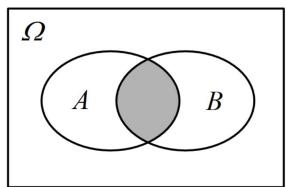
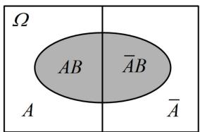
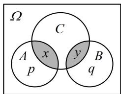
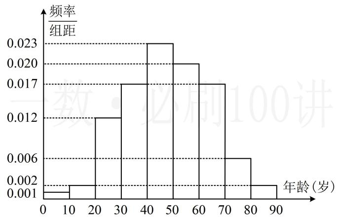
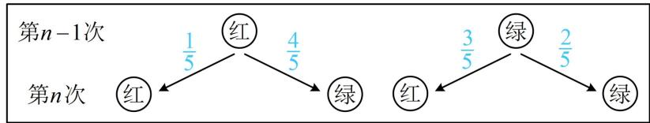

# 模块三 离散型随机变量及其分布

# 第1节 条件概率公式、全概率公式（★★★）

# 内容提要

本节包含条件概率公式、乘法公式、全概率公式三部分内容，考试的重点是能够用它们去求概率，以及证明一些概率恒等式。下面先梳理这些公式及有关性质。

##### 1. 条件概率公式：在事件 $A$ 发生的条件下，事件 $B$ 发生的概率 $P(B|A) = \frac{P(AB)}{P(A)}$ 。计算条件概率常用两种方法。

①基于样本空间 $\Omega$ ，分别计算 $P(A)$ 和 $P(AB)$ ，代上述条件概率公式求 $P(B|A)$   
②根据条件概率的直观意义，以事件 $A$ 作为新的样本空间，来求事件 $B$ 发生的概率。如图1， $P(B|A)$ 即为在 $A$ 中考虑 $B$ 发生的概率，所以 $P(B|A)$ 等于阴影部分的样本点个数除以事件 $A$ 的样本点个数。

##### 2. 条件概率的性质:

① $P(\Omega \mid A) = 1$ ；②若 $B, C$ 互斥，则 $P(B \cup C \mid A) = P(B \mid A) + P(C \mid A)$ ；③ $P(B \mid A) = 1 - P(\overline{B} \mid A)$ .   
##### 3. 乘法公式: $P(AB) = P(A)P(B|A)$ , 这一公式就是条件概率公式的变形. 实际上, $P(AB)$ 也可写成 $P(B)P(A|B)$ , 实际应用时选择 $A$ 还是 $B$ 作为条件, 要看问题中 $P(B|A)$ , $P(A|B)$ 哪个好算, 通常情况下, 已知前面的试验结果, 计算后面试验结果的概率比较好算, 所以我们常选择以前面的试验结果为条件.  
##### 4. 全概率公式：设 $A_{1}, A_{2}, \cdots, A_{n}$ 两两互斥， $A_{1} \cup A_{2} \cup \cdots \cup A_{n} = \Omega$ ，且 $P(A_{i}) > 0 (i = 1, 2, \cdots, n)$ ，则对任意的事件 $B \subseteq \Omega$ ，有 $P(B) = \sum_{i=1}^{n} P(A_{i}) P(B | A_{i})$ 。用全概率公式求概率，其本质是将样本空间划分成若干个部分，如图2，在每一部分上分别求事件 $B$ 的概率，再相加，所以找到合适的划分样本空间的方法是解题的关键。若把样本空间 $\Omega$ 按某一事件 $A$ 是否发生来划分，如图3，则可以得出 $P(B) = P(A) P(B | A) + P(\overline{A}) P(B | \overline{A})$ ，这是全概率公式的一种特殊情况。

图1

图2

图3

# 类型 I：公式计算、化简与判断

【例 1】若 $P(A)=0.2$ ， $P(B|A)=0.15$ ，则 $P(AB)=$ \_\_\_\_； $P(A\overline{B})=$ \_\_\_\_.

解析 $A$ ， $B$ 不独立，求 $P(AB)$ 和 $P(A\overline{B})$ 用乘法公式， $P(AB) = P(A)P(B|A) = 0.2\times 0.15 = 0.03$

$P (A \overline {{{B}}}) = P (A) P (\overline {{{B}}} \mid A) = P (A) [ 1 - P (B \mid A) ] = 0. 2 \times (1 - 0. 1 5) = 0. 1 7.$

答案0.03；0.17

【例 2】已知 $P(A) > 0$ ， $P(B) > 0$ ， $P(C) > 0$ ，则下列说法错误的是（）

$\quad$A. 若事件 $A, B$ 独立，则 $P(A) = P(A \mid B)$   
$\quad$B. 若事件 $A, B$ 互斥, 则 $P((A + B) \mid C) = P(A \mid C) + P(B \mid C)$   
$\quad$C. 设事件 $B$ 与 $\overline{B}$ 互为对立事件, 则 $P(B \mid A) + P(\overline{B} \mid A) = 1$   
$\quad$D. 若事件 $A, B$ 互斥，则 $P(C \mid (A + B)) = P(C \mid A) + P(C \mid B)$

解析A 项，若事件 A, B 独立，则 $P(A \mid B) = \frac{P(AB)}{P(B)} = \frac{P(A)P(B)}{P(B)} = P(A)$ ，故 A 项正确；

B项，若事件 $A$ ， $B$ 互斥，则由内容提要第2点的公式②可知B项正确；

C 项，由内容提要第 2 点的公式③可知 C 项正确；

D 项，此项不易通过公式变形来阐释，我们画图来看，

如图，不妨设样本空间中每个样本点发生的可能性相等，

图中 $p = n(A)$ ， $q = n(B)$ ， $x = n(A\cap C)$ ， $y = n(B\cap C)$

则 $P(C\mid (A + B)) = \frac{x + y}{p + q}$ ，而 $P(C\mid A) + P(C\mid B) = \frac{x}{p} +\frac{y}{q},$

一般而言， $\frac{x+y}{p+q}\neq\frac{x}{p}+\frac{y}{q}$ ，所以 $P(C|(A+B))=P(C|A)+P(C|B)$ 不一定成立，故D项错误.

答案: D

# 类型 II：计算条件概率

【例 3】设 100 件产品中有 70 件一等品, 25 件二等品, 规定一、二等品为合格品, 从中任取 1 件, 在已知取得的是合格品的条件下, 它是一等品的概率为 \_\_\_\_.

解法 1: 算条件概率, 可套用条件概率公式 $P(B \mid A) = \frac{P(AB)}{P(A)}$ , 下面先分别求 $P(AB)$ 和 $P(A)$ ,

设取到合格品为事件 $A$ ，取到一等品为事件 $B$ ，因为 $B \subseteq A$ ，所以 $AB = B$ ，故 $P(AB) = P(B) = \frac{n(B)}{n(\Omega)} = \frac{70}{100}$ 又 $P(A) = \frac{n(A)}{n(\Omega)} = \frac{70 + 25}{100} = \frac{95}{100}$ ，所以 $P(B|A) = \frac{P(AB)}{P(A)} = \frac{14}{19}$ .

解法 2: 也可根据条件概率的直观意义, 以取到合格品为新的样本空间来考虑,

因为已经确定取到的是合格品，那么它必定是95件合格品中的1件，这其中一等品有70件，

所以取到的是一等品的概率为 $\frac{\mathrm{C}_{70}^{1}}{\mathrm{C}_{95}^{1}} = \frac{70}{95} = \frac{14}{19}$ .

答案: $\frac{14}{19}$

##### 【变式】从 1, 2, 3, 4, 5, 6, 7, 8, 9 中不放回地依次取 2 个数，记事件 $A$ 为 “第一次取到的是奇数”，事件 $B$ 为 “第二次取到的是 3 的整数倍”，则 $P(B \mid A) =$ \_\_\_\_.

解析算条件概率可用条件概率公式 $P(B \mid A) = \frac{P(AB)}{P(A)}$ ，故只需算 $P(AB)$ 和 $P(A)$ ，先算简单的 $P(A)$ ，

由题意，样本空间包含的样本点数 $n(\Omega) = \mathrm{C}_9^1\mathrm{C}_8^1 = 72$ ，第一次取到的是奇数，则第一次有 $\mathbf{C}_5^1$ 种取法，

第二次可从余下的8个数字中取1个，有 $\mathrm{C}_{8}^{1}$ 种取法，所以 $n(A) = \mathrm{C}_{5}^{1}\mathrm{C}_{8}^{1} = 40$ ，故 $P(A) = \frac{n(A)}{n(\Omega)} = \frac{40}{72}$

再算 $P(AB)$ ， $P(AB)=\frac{n(AB)}{n(\Omega)}$ ，分母已知，接下来求 $n(AB)$ ，第一次取到的为 1, 3, 5, 7, 9，取到 3, 9

与另外三个，对第二次的取法有影响，故分类，

若第一次取到3或9，则第一次有 $\mathrm{C}_2^1$ 种取法，此时3，6，9中已经取走了1个，

所以第二次也有 $\mathrm{C}_2^1$ 种取法，故共有 $\mathrm{C}_2^1\mathrm{C}_2^1 = 4$ 种取法；

若第一次取到1，5，7，则第一次有 $\mathrm{C}_3^1$ 种取法，此时3，6，9都还没被取走，

所以第二次有 $\mathrm{C}_3^1$ 种取法，故共有 $\mathrm{C}_3^1\mathrm{C}_3^1 = 9$ 种取法；

所以 $n(AB) = 4 + 9 = 13$ ，从而 $P(AB) = \frac{n(AB)}{n(\Omega)} = \frac{13}{72}$ ，故 $P(B|A) = \frac{P(AB)}{P(A)} = \frac{13}{40}$

答案 $\frac{13}{40}$

【总结】计算条件概率，常用两种方法：①套用条件概率公式；②用条件的直观意义来缩小样本空间，以条件为新的样本空间，分析事件的概率.

# 类型III: 用乘法公式求 $P(AB)$

【例 4】市场上供应的灯泡中，甲厂产品占 70%，乙厂产品占 30%，甲厂产品的合格率是 95%，乙厂产品的合格率是 80%，则从市场上随机买一个灯泡，买到甲厂合格灯泡的概率是（）

$\quad$A. 0.665

$\quad$B. 0.56

$\quad$C. 0.24

$\quad$D. 0.285

解析设买到甲厂灯泡为事件 $A$ ，买到合格灯泡为事件 $B$

我们要算的即为 $P(AB)$ , $A$ 和 $B$ 不独立, 不能用 $P(A)P(B)$ 来算, 可用乘法公式,

由题意， $P(A) = 0.7$ ， $P(B|A) = 0.95$ ，所以 $P(AB) = P(A)P(B|A) = 0.7\times 0.95 = 0.665$

答案: A

【总结】当事件 $A$ ， $B$ 不独立时，可用乘法公式 $P(AB) = P(A)P(B|A)$ 来计算 $P(AB)$ ；而当 $A$ ， $B$ 相互独立时，由于 $P(B|A) = P(B)$ ，所以 $P(AB) = P(A)P(B) = P(A)P(B|A)$ ，故这一公式其实是乘法公式的特例.

# 类型IV：用全概率公式计算概率

【例 5】甲、乙为完全相同的两个不透明袋子，袋内均装有除颜色外完全相同的球。甲袋中装有 5 个白球，7 个红球，乙袋中装有 4 个白球，2 个红球，从两个袋中随机抽取一袋，再从该袋中随机摸出 1 个球，则摸出的球是红球的概率为（）

$\quad$A. $\frac{1}{2}$

$\quad$B. $\frac{11}{24}$

$\quad$C. $\frac{7}{12}$

$\quad$D. $\frac{1}{3}$

解析两袋中各自摸出红球的概率是已知的，故可按取到哪一袋来划分样本空间，套用全概率公式，记取到甲袋为事件 $A_{1}$ ，取到乙袋为事件 $A_{2}$ ，取到红球为事件 $B$ ，

由全概率公式， $P(B) = P(A_{1})P(B|A_{1}) + P(A_{2})P(B|A_{2}) = \frac{1}{2}\times \frac{7}{12} +\frac{1}{2}\times \frac{2}{6} = \frac{11}{24}.$

答案: B

【反思】用全概率公式求事件 B 的概率，关键是选择合适的方法将样本空间 $\Omega$ 划分成 $A_{1}, A_{2}, \cdots, A_{n}$ ，在各部分上分别计算事件 B 的概率，再相加。例如，本题将样本空间划分成了摸出的球来自甲袋和摸出的球来自乙袋两种情况，这样一划分，分别计算摸到红球的概率就简单了。

##### 【变式1】某芯片制造厂有甲、乙、丙三条生产线均生产 $5 \mathrm{~mm}$ 规格的芯片, 现有25块该规格的芯片, 其中甲、乙、丙生产的芯片分别为5块、10块、10块, 若甲、乙、丙生产该芯片的次品率分别为0.1, 0.2, 0.3, 则从这25块芯片中任取一块芯片, 取到正品的概率为 ( )

$\quad$A. 0.78

$\quad$B. 0.64

$\quad$C. 0.58

$\quad$D. 0.48

解析甲、乙、丙的次品率不同，故应按取到的芯片来自甲、乙、丙划分样本空间，套用全概率公式，记取到的芯片来自甲、乙、丙分别为事件 $A_{1}$ ， $A_{2}$ ， $A_{3}$ ，取到正品为事件 $B$ ，则由全概率公式，

$P (B) = P \left(A _ {1}\right) P \left(B \mid A _ {1}\right) + P \left(A _ {2}\right) P \left(B \mid A _ {2}\right) + P \left(A _ {3}\right) P \left(B \mid A _ {3}\right) = \frac {5}{2 5} \times (1 - 0. 1) + \frac {1 0}{2 5} \times (1 - 0. 2) + \frac {1 0}{2 5} \times (1 - 0. 3) = 0. 7 8.$

答案: A

##### 【变式2】某人连续两次对同一目标进行射击，若第一次击中目标，则第二次也击中目标的概率为0.7，若第一次未击中目标，则第二次击中目标的概率为0.5，已知第一次击中目标的概率是0.8，则在第二次击中目标的条件下，第一次也击中目标的概率为（）

$\quad$A. $\frac{14}{25}$

$\quad$B. $\frac{14}{33}$

$\quad$C. $\frac{28}{33}$

$\quad$D. $\frac{25}{39}$

解析设第一次击中目标为事件 A，第二次击中目标为事件 B，则所求概率 $P(A \mid B) = \frac{P(AB)}{P(B)}$ ,

故接下来要求 $P(AB)$ 和 $P(B)$ ，先罗列条件。已知的即为 $P(A) = 0.8$ ， $P(B|A) = 0.7$ ， $P(B|\overline{A}) = 0.5$ 。对比所求，故可用 $P(AB) = P(A)P(B|A)$ 算 $P(AB)$ ，用 $P(B) = P(A)P(B|A) + P(\overline{A})P(B|\overline{A})$ 算 $P(B)$ ，

$P (A B) = P (A) P (B \mid A) = 0. 8 \times 0. 7 = 0. 5 6, \quad P (B) = P (A) P (B \mid A) + P (\bar {A}) P (B \mid \bar {A}) = 0. 8 \times 0. 7 + (1 - 0. 8) \times 0. 5 = 0. 6 6,$

所以 $P(A\mid B) = \frac{P(AB)}{P(B)} = \frac{0.56}{0.66} = \frac{28}{33}$

答案: C

【反思】本题的流程其实是求包含条件概率问题的通法，分三步：①先设出涉及的事件；②将题目的条件用概率符号罗列出来；③对比条件概率公式与全概率公式，选择合适的公式套用已知的数据.

【例 6】有研究显示，人体内某部位的直径约 10mm 的结节约有 0.2% 的可能性会在 1 年内发展为恶性肿瘤，某医院引进一台检测设备，可以通过无创的血液检测，估计患者体内直径约 10mm 的结节是否会在 1 年内发展为恶性肿瘤，若检测结果为阳性，则提示该结节会在 1 年内发展为恶性肿瘤，若检测结果为阴性，则提示该结节不会在 1 年内发展为恶性肿瘤。这种检测的准确率为 85%，即一个会在 1 年内发展为恶性肿瘤的患者有 85% 的可能性被检测出阳性，一个不会在 1 年内发展为恶性肿瘤的患者有 85% 的可能性被检测出阴性。患者甲被检查出体内长了一个直径约 10mm 的结节，他做了该项无创血液检测。

（1） 求患者甲检测结果为阴性的概率;

（2） 若患者甲的检测结果为阴性, 求他的这个结节在 1 年内发展为恶性肿瘤的概率. (保留 5 位小数)

解：（1）（检测结果为阴性，而实际是否会在1年内发展为恶性肿瘤都有可能，故可按此划分样本空间，套用全概率公式）

设患者甲的该结节在1年内发展为恶性肿瘤为事件A，患者甲的检测结果为阴性为事件B，由全概率公式， $P(B)=P(A)P(B\mid A)+P(\overline{A})P(B\mid\overline{A})=0.2\%\times(1-85\%)+(1-0.2\%)\times85\%=0.8486$

（2）由（1）可得 $P(A|B) = \frac{P(AB)}{P(B)} = \frac{P(AB)}{0.8486}$ ，（要算 $P(AB)$ ，可用乘法公式，且应转换成以 $A$ 为条件）因为 $P(AB) = P(A)P(B|A) = 0.2\% \times (1 - 85\%) = 0.0003$ ，所以 $P(A|B) = \frac{0.0003}{0.8486} \approx 0.00035$ .

【总结】从上述几题可以看出，问题的情境可能简单，可能复杂，用全概率公式求概率的关键都是结合所给信息划分样本空间，可能划分成两部分（如例5等），也可能划分成三部分（如变式1等），甚至更多.

# 类型V：条件概率、全概率公式综合题

【例 7】(2022·新课标Ⅱ卷) 在某地区进行某种疾病调查, 随机调查了 100 位这种疾病患者的年龄, 得到如下样本数据的频率分布直方图.

（1） 估计该地区这种疾病患者的平均年龄; (同一组数据用该区间的中点值作代表)  
（2） 估计该地区一位这种疾病患者年龄位于区间[20,70)的概率;  
（3）已知该地区这种疾病的患病率为 $0.1\%$ ，该地区年龄位于[40,50)的人口数占该地区总人口数的 $16\%$ ，从该地区选出1人，若此人的年龄位于[40,50)，求此人患这种疾病的概率.(精确到0.0001)  
解：（1）由图可知，从左至右，各组的频率依次为0.01，0.02，0.12，0.17，0.23，0.2，0.17，0.06，0.02，所以 $\overline{x} = 5\times 0.01 + 15\times 0.02 + 25\times 0.12 + 35\times 0.17 + 45\times 0.23 + 55\times 0.2 + 65\times 0.17 + 75\times 0.06 + 85\times 0.02 = 47.9$ 故该地区这种疾病患者的平均年龄约为47.9岁.

（2）由图可知该地区一位这种疾病患者年龄位于区间[20,70)的概率为 $1 - (0.01 + 0.02 + 0.06 + 0.02) = 0.89$   
（3） (读完题可知要算的是年龄位于[40,50)的条件下患这种疾病的概率. 求条件概率, 当然考虑套用条件概率公式, 先设作为条件的事件和求概率的事件)

设事件 A 为 “任选一人年龄位于[40,50)”，事件 B 为 “任选一人患这种疾病”，

则所求概率为 $P(B \mid A) = \frac{P(AB)}{P(A)}$ ，由题意， $P(A) = 16\% = 0.16$ ，所以 $P(B \mid A) = \frac{P(AB)}{0.16}$ ①，

(由频率分布直方图能得到的是患病者的年龄分布, 所以在患病的条件下, 年龄位于各区间的概率都已知,

即 $P(A \mid B)$ 已知, 故应转换条件为 $B$ , 用乘法公式 $P(AB) = P(B)P(A \mid B)$ 求 $P(AB)$

由题意， $P(B)=0.1\%$ ，由频率分布直方图可知 $P(A|B)=0.23$ ，所以 $P(AB)=P(B)P(A|B)=0.1\%\times0.23$ ，代入①得 $P(B|A)=\frac{0.1\%\times0.23}{0.16}\approx0.0014$ .

【例 8】某种电子玩具按下按钮后, 会出现亮红灯或绿灯. 已知按钮第一次按下后, 出现红灯与绿灯的概率都是 $\frac{1}{2}$ , 从第二次按下按钮起, 若前一次出现红灯, 则下一次出现红灯的概率为 $\frac{1}{5}$ , 若前一次出现绿灯, 则下一次出现红灯的概率为 $\frac{3}{5}$ , 记第 $n (n \in \mathbf{N}^{*})$ 次按下按钮后出现红灯的概率为 $P_{n}$ .

（1）求 $P_{2}$ 的值；（2）证明： $\left\{P_n - \frac{3}{7}\right\}$ 为等比数列，并求 $P_{n}$

解: （1） $(P_{2}$ 表示第 2 次按下按钮后, 亮红灯的概率, 这一概率受第一次的结果影响, 可按第一次亮红灯、绿灯划分样本空间, 用全概率公式计算)

记第 $n$ 次亮红灯为事件 $A_{n}$ ，则 $P_{2} = P(A_{2}) = P(A_{1})P(A_{2}|A_{1}) + P(\overline{A}_{1})P(A_{2}|\overline{A}_{1}) = \frac{1}{2}\times \frac{1}{5} +\frac{1}{2}\times \frac{3}{5} = \frac{2}{5}.$

（2） (应先建立 $\{P_{n}\}$ 的递推公式, 如图, 第 $n - 1$ 次的亮灯结果不同, 第 $n$ 次亮红灯的概率也不同, 故应按第 $n - 1$ 次的亮灯情况划分样本空间, 套用全概率公式算 $P_{n}$ , 第 $n - 1$ 次的亮灯情况有 $A_{n - 1}$ 和 $\overline{A}_{n - 1}$ 两种)由全概率公式, $P_{n} = P(A_{n}) = P(A_{n - 1})P(A_{n} \mid A_{n - 1}) + P(\overline{A}_{n - 1})P(A_{n} \mid \overline{A}_{n - 1}) = P_{n - 1} \cdot \frac{1}{5} + (1 - P_{n - 1}) \cdot \frac{3}{5} = -\frac{2}{5}P_{n - 1} + \frac{3}{5}(n \geq 2)$ ,

所以 $P_{n} - \frac{3}{7} = -\frac{2}{5} P_{n - 1} + \frac{3}{5} -\frac{3}{7} = -\frac{2}{5} P_{n - 1} + \frac{6}{35} = -\frac{2}{5}\left(P_{n - 1} - \frac{3}{7}\right)$ ，又 $P_{1} - \frac{3}{7} = \frac{1}{2} -\frac{3}{7} = \frac{1}{14}$

所以 $\left\{P_n - \frac{3}{7}\right\}$ 是首项为 $\frac{1}{14}$ ，公比为 $-\frac{2}{5}$ 的等比数列，从而 $P_n - \frac{3}{7} = \frac{1}{14} \times \left(-\frac{2}{5}\right)^{n-1}$ ，故 $P_n = \frac{3}{7} + \frac{1}{14} \times \left(-\frac{2}{5}\right)^{n-1}$ .

【反思】这种概率递推问题较新颖，但只要分析清第 $n$ 次和第 $n - 1$ 次的事件联系，即可建立递推公式.

【例 9】某大学有 A, B 两个餐厅为学生提供午餐与晚餐服务，甲、乙两位学生每天午餐和晚餐都在学校就餐，近 100 天选择餐厅就餐的情况统计如下：

<table><tr><td>选择餐厅情况(午餐,晚餐)</td><td>(A,A)</td><td>(A,B)</td><td>(B,A)</td><td>(B,B)</td></tr><tr><td>甲</td><td>30天</td><td>20天</td><td>40天</td><td>10天</td></tr><tr><td>乙</td><td>20天</td><td>25天</td><td>15天</td><td>40天</td></tr></table>

假设甲、乙选择餐厅相互独立，用频率估计概率.

（1） 分别估计一天中甲午餐和晚餐都选择餐厅 $A$ 就餐的概率, 乙午餐和晚餐都选择餐厅 $B$ 就餐的概率;  
（2） 假设 $E$ 表示事件 “ $A$ 餐厅推出优惠套餐”， $F$ 表示事件 “某学生去 $A$ 餐厅就餐”， $P(E) > 0$ ，一般来说在推出优惠套餐的情况下学生去该餐厅就餐的概率会比不推出优惠套餐的情况下去该餐

厅就餐的概率要大，证明： $P(E \mid F) > P(E \mid \bar{F})$ .

解: （1） 由表中数据可估计一天中甲午餐和晚餐都选择餐厅 $A$ 就餐的概率为 $\frac{30}{100} = \frac{3}{10}$ ,

乙午餐和晚餐都选择 B 餐厅就餐的概率为 $\frac{40}{100} = \frac{2}{5}$ .

（2） (先把所给的文字条件翻译出来) 由题意, 推出优惠套餐的情况下学生去该餐厅就餐的概率比不推出优惠套餐的情况下去该餐厅就餐的概率大, 所以 $P(F \mid E) > P(F \mid \overline{E})$ ①,

(要证 $P(E \mid F) > P(E \mid \overline{F})$ , 可作差转化为证明 $P(E \mid F) - P(E \mid \overline{F}) > 0$ , 该不等式是以 $F$ 和 $\overline{F}$ 为条件的条件概率, 而已知的不等式①的条件是 $E$ 和 $\overline{E}$ , 故应转换条件)

$\begin{array}{l} P (E \mid F) - P (E \mid \bar {F}) = \frac {P (E F)}{P (F)} - \frac {P (E \bar {F})}{P (\bar {F})} = \frac {P (E) P (F \mid E)}{P (F)} - \frac {P (E) P (\bar {F} \mid E)}{1 - P (F)} = P (E) \cdot \left[ \frac {P (F \mid E)}{P (F)} - \frac {P (\bar {F} \mid E)}{1 - P (F)} \right] \\ = P (E) \cdot \frac {P (F \mid E) [ 1 - P (F) ] - P (F) P (\overline {{{F}}} \mid E)}{P (F) [ 1 - P (F) ]} = P (E) \cdot \frac {P (F \mid E) - P (F) [ P (F \mid E) + P (\overline {{{F}}} \mid E) ]}{P (F) [ 1 - P (F) ]} \quad ②, \\ \end{array}$

因为 $P(F|E) + P(\overline{F}|E) = 1$ ，所以式②可化为 $P(E|F) - P(E|\overline{F}) = P(E)\cdot \frac{P(F|E) - P(F)}{P(F)[1 - P(F)]}$ ③，

(要判断式③的正负, 只需比较 $P(F \mid E)$ 和 $P(F)$ 的大小, 已知的不等式①还没用到, 故将样本空间划分成 $E$ 和 $\overline{E}$ , 用全概率公式代换分子的 $P(F)$ 来看)

由全概率公式， $P(F) = P(E)P(F|E) + P(\overline{E})P(F|\overline{E})$

所以 $P(F\mid E) - P(F) = P(F\mid E) - P(E)P(F\mid E) - P(\overline{E})P(F\mid \overline{E})$

$= P (F \mid E) [ 1 - P (E) ] - P (\bar {E}) P (F \mid \bar {E}) = P (F \mid E) P (\bar {E}) - P (\bar {E}) P (F \mid \bar {E}) = P (\bar {E}) [ P (F \mid E) - P (F \mid \bar {E}) ],$

由①知 $P(F|E) > P(F|\overline{E})$ ，所以 $P(F|E) - P(F) = P(\overline{E})[P(F|E) - P(F|\overline{E})] > 0$

结合③可得 $P(E|F) - P(E|\bar{F}) = P(E)\cdot \frac{P(F|E) - P(F)}{P(F)[1 - P(F)]} >0$ ，所以 $P(E|F) > P(E|\bar{F})$

# 强化训练

##### 1. (★★)

有 50 人报名足球俱乐部，60 人报名乒乓球俱乐部，70 人报名足球或乒乓球俱乐部。若已知某人报足球俱乐部，则其报乒乓球俱乐部的概率为（）

$\quad$A. 0.8

$\quad$B. 0.6

$\quad$C. 0.5

$\quad$D. 0.4

##### 2. (2023·浙江温州二模·★★★)

一枚质地均匀的骰子，其六个面的点数分别为1，2，3，4，5，6. 现将此骰子任意抛掷2次，正面向上的点数分别为 $X_{1}, X_{2}$ . 设 $Y_{1} = \begin{cases} X_{1}, & X_{1} \geq X_{2} \\ X_{2}, & X_{1} < X_{2} \end{cases}$ ，设 $Y_{2} = \begin{cases} X_{1}, & X_{1} \leq X_{2} \\ X_{2}, & X_{1} > X_{2} \end{cases}$ ，记事件 $A = "Y_{1} = 5"$ ， $B = "Y_{2} = 3"$ ，则 $P(B|A) =$ （）

$\quad$A. $\frac{1}{9}$

$\quad$B. $\frac{2}{9}$

$\quad$C. $\frac{1}{5}$

$\quad$D. $\frac{2}{11}$

##### 3. (2022·湖南模拟·★★☆)

某人忘记了一个电话号码的最后一个数字，只好去试拨，则他第一次失败，第二次成功的概率是\_\_\_\_。

##### 4.（2024·江苏南京模拟·★★★）（多选）

对于随机事件 $A$ ， $B$ ，若 $P(A) = \frac{2}{5}$ ， $P(B) = \frac{3}{5}$ ， $P(B|A) = \frac{1}{4}$ ，则（）

$\quad$A. $P(AB) = \frac{3}{20}$

$\quad$B. $P(A\mid B) = \frac{1}{6}$

$\quad$C. $P(A + B) = \frac{9}{10}$

$\quad$D. $P(\overline{A} B) = \frac{1}{2}$

##### 5. (2023·河北石家庄模拟·★★★)

某种疾病的患病率为 $5\%$ ，通过验血诊断该疾病的误诊率为 $2\%$ ，即非患者中有 $2\%$ 的人诊断为阳性，患者中有 $2\%$ 的人诊断为阴性。随机抽取 1 人进行验血，则其诊断结果为阳性的概率为（）

$\quad$A. 0.46

$\quad$B. 0.046

$\quad$C. 0.68

$\quad$D. 0.068

##### 6. (2024·湖南长沙模拟·★★★) (多选)

甲罐中有 5 个红球, 5 个白球, 乙罐中有 3 个红球, 7 个白球. 先从甲罐中随机取出一球放入乙罐, 再从乙罐中随机取出一球. $A_{1}$ 表示事件 “从甲罐取出的球是红球”, $A_{2}$ 表示事件 “从甲罐取出的球是白球”, $B$ 表示事件 “从乙罐取出的球是红球”. 则下列结论正确的是 ( )

$\quad$A. $A_{1}$ ， $A_{2}$ 为对立事件
$\quad$B. $P(B\mid A_1) = \frac{4}{11}$

$\quad$C. $P(B) = \frac{3}{10}$ 
$\quad$D. $P(B\mid A_1) + P(B\mid A_2) = 1$

##### 7. (2025·天津卷·★★★)

小桐操场跑圈, 一周两次, 一次 5 圈或 6 圈. 第一次跑 5 圈或 6 圈的概率均为 0.5, 若第一次跑 5 圈, 则第二次跑 5 圈的概率为 0.4, 6 圈的概率为 0.6; 若第一次跑 6 圈, 则第二次跑 5 圈的概率为 0.6, 6 圈的概率为 0.4. 小桐一周跑 11 圈的概率为\_\_\_\_; 若一周至少跑 11 圈为运动量达标, 则连续跑 4 周, 记运动量达标的周数为 $X$ , 则期望 $E(X) =$ \_\_\_\_.

##### 8. (2023·广东深圳模拟·★★★)

某厂生产的产品每10件包装成一箱，每箱含0，1，2件次品的概率分别为0.8，0.1，0.1．在出厂前需要对每箱产品进行检测，质检员甲拟定了一种检测方案：开箱随机检测该箱中的3件产品，若无次品，则认定该箱产品合格，否则认定该箱产品不合格.

（1）在质检员甲认定一箱产品合格的条件下，求该箱产品不含次品的概率；  
（2）若质检员甲随机检测一箱中的3件产品，抽到次品的件数为 $X$ ，求 $X$ 的分布列及期望.

##### 9. (2023·新课标Ⅰ卷·★★★★)

甲乙两人投篮，每次由其中一人投篮，规则如下：若命中则此人继续投篮，若未命中则换为对方投篮。无论之前投篮情况如何，甲每次投篮的命中率均为0.6，乙每次投篮的命中率均为0.8，由抽签确定第一次投篮的人选，第一次投篮的人是甲、乙的概率各为0.5。

（1） 求第二次投篮的人是乙的概率;  
（2）求第 $i$ 次投篮的人是甲的概率；  
（3）已知：若随机变量 $X_{i}$ 服从两点分布，且 $P(X_{i}=1)=1-P(X_{i}=0)=q_{i}, i=1,2,\cdots,n$ ，则 $E\left(\sum_{i=1}^{n}X_{i}\right)=\sum_{i=1}^{n}q_{i}$ ，记前 n 次（即从第 1 次到第 n 次）投篮中甲投篮的次数为 Y，求 $E(Y)$ .

##### 10.（2023·湖北模拟·★★★★）

从有 3 个红球和 3 个蓝球的袋中, 每次随机摸出 1 个球, 摸出的球不放回, 记 $A_{i}$ 表示事件 “第 $i$ 次摸到红球”, $i = 1,2,\cdots,6$ .

（1） 求第一次摸到蓝球的条件下, 第二次摸到红球的概率;  
（2）在同一试验下，记 $P(B_{1}B_{2}B_{3})$ 表示 $B_{1}$ ， $B_{2}$ ， $B_{3}$ 同时发生的概率， $P(B_{3}|B_{1}B_{2})$ 表示在 $B_{1}$ 和 $B_{2}$ 都发生的条件下， $B_{3}$ 发生的概率，若 $P(B_{1}) > 0$ ， $P(B_{1}B_{2}) > 0$ ，证明： $P(B_{1}B_{2}B_{3}) = P(B_{1})P(B_{2}|B_{1})P(B_{3}|B_{1}B_{2})$ ；  
（3） 求 $P(A_{3})$ .

