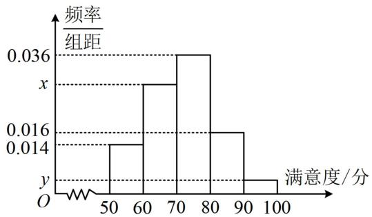
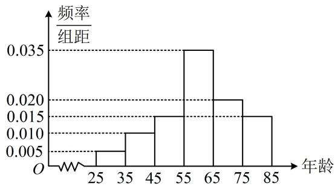

# 强化训练

##### 1. (★★)

某人参加一次考试，共3道题，至少答对其中2道才能合格，若他答对每道题的概率均为0.6，则他能合格的概率为\_\_\_\_。

##### 1. 0.648

解析: 答 3 题可看成三次独立试验, 答对每题概率相同满足重复性, 所以这是独立重复试验, 故答对题目的个数服从二项分布, 可用其概率分布计算所求概率,

设该人答对的题的个数为随机变量 $X$ ，则 $X\sim B(3,0.6)$

所以他能合格的概率为 $P(X\geq 2) = P(X = 2) + P(X = 3)$

$= \mathrm{C} _ {3} ^ {2} \times 0. 6 ^ {2} \times (1 - 0. 6) + \mathrm{C} _ {3} ^ {3} \times 0. 6 ^ {3} = 0. 6 4 8.$

##### 2. (2021·天津卷·★★)

甲、乙两人在每次猜谜活动中各猜一个谜语，若一方猜对且另一方猜错，则猜对的一方获胜，否则本次平局。已知每次活动中，甲、乙猜对的概率分别为 $\frac{5}{6}$ 和 $\frac{1}{5}$ ，且每次活动中甲、乙猜对与否互不影响，各次活动也互不影响，则1次活动中，甲获胜的概率为\_\_\_\_；3次活动中，甲至少获胜2次的概率为\_\_\_\_。

##### 2. $\frac{2}{3}$ ; $\frac{20}{27}$

解析由题意，1次活动中甲获胜，即甲猜对且乙未猜对，

其概率为 $\frac{5}{6}\times\left(1-\frac{1}{5}\right)=\frac{2}{3}$ ;

所以 3 次活动中，甲获胜的次数 $X \sim B\left(3, \frac{2}{3}\right)$ ,

故甲至少获胜2次的概率为 $P(X\geq 2) = P(X = 2) +$

$P (X = 3) = \mathrm{C} _ {3} ^ {2} \times \left(\frac {2}{3}\right) ^ {2} \times \left(1 - \frac {2}{3}\right) + \mathrm{C} _ {3} ^ {3} \times \left(\frac {2}{3}\right) ^ {3} = \frac {2 0}{2 7}.$

##### 3. (2022·福建福州模拟·★★★)

为了保障我国民众的身体健康, 某产品在进入市场前必须进行两轮检测, 只有两轮检测都合格才能进行销售, 否则不能销售. 已知该产品第一轮检测不合格的概率为 $\frac{1}{9}$ , 第二轮检测不合格的概率为 $\frac{1}{10}$ , 两轮检测是否合格相互之间没有影响, 若产品可以销售, 则每件产品获利 40 元, 若产品不能销售, 则每件亏损 80 元, 已知一箱中有尚未检测的 4 件产品, 记该箱产品总共获利 $X$ 元, 则 $P(X \geq -80) = (\quad)$

$\quad$A. $\frac{96}{625}$

$\quad$B. $\frac{256}{625}$

$\quad$C. $\frac{608}{625}$

$\quad$D. $\frac{209}{625}$

##### 3. C

解析4 件产品中能够销售的件数服从二项分布，先求一件产品可以销售的概率，

由题意，一件产品可以销售的概率为 $\left(1-\frac{1}{9}\right)\times\left(1-\frac{1}{10}\right)=\frac{4}{5}$ ，

所以该4件产品中，可以销售的件数 $Y \sim B\left(4, \frac{4}{5}\right)$ ，

该箱产品的获利 $X$ 与可以销售的件数 $Y$ 有关，找到此关系，即可把 $P(X \geq -80)$ 化为 $Y$ 的取值概率来算，

由题意， $X = 40Y - 80(4 - Y) = 120Y - 320$

所以 $P(X \geq -80) = P(120Y - 320 \geq -80) = P(Y \geq 2)$

$\begin{array}{l} = 1 - P (Y = 0) - P (Y = 1) \\ = 1 - \mathrm{C} _ {4} ^ {0} \times \left(1 - \frac {4}{5}\right) ^ {4} - \mathrm{C} _ {4} ^ {1} \times \frac {4}{5} \times \left(1 - \frac {4}{5}\right) ^ {3} = \frac {6 0 8}{6 2 5}. \\ \end{array}$

##### 4.（2023·新课标Ⅱ卷·★★★★）（多选）

在信道内传输 0,1 信号,信号的传输相互独立. 发送 0 时,收到 1 的概率为 $\alpha (0 < \alpha < 1)$ , 收到 0 的概率为 $1 - \alpha$ ; 发送 1 时,收到 0 的概率为 $\beta (0 < \beta < 1)$ , 收到 1 的概率为 $1 - \beta$ . 考虑两种传输方案: 单次传输和三次传输. 单次传输是指每个信号只发送 1 次,三次传输是指每个信号重复发送 3 次. 收到的信号需要译码,译码规则如下: 单次传输时,收到的信号即为译码;三次传输时,收到的信号中出现次数多的即为译码(例如,若依次收到 1,0,1,则译码为 1).()

$\quad$A. 采用单次传输方案，若依次发送 1, 0, 1，则依次收到 1, 0, 1 的概率为 $(1 - \alpha)(1 - \beta)^{2}$   
$\quad$B. 采用三次传输方案, 若发送 1 , 则依次收到 1 , 0 , 1 的概率为 $\beta (1 - \beta)^{2}$   
$\quad$C. 采用三次传输方案, 若发送 1 , 则译码为 1 的概率为 $\beta (1 - \beta)^{2} + (1 - \beta)^{3}$   
$\quad$D. 当 $0 < \alpha < 0.5$ 时, 若发送 0 , 则采用三次传输方案译码为 0 的概率大于采用单次传输方案译码为 0 的概率

##### 4. ABD

解析A项，由题意，若采用单次传输方案，则发送1收到1的概率为 $1-\beta$ ，发送0收到0的概率为 $1-\alpha$ ，

所以依次发送 1，0，1，则依次收到 1，0，1 的概率为 $(1-\beta)(1-\alpha)(1-\beta)=(1-\alpha)(1-\beta)^{2}$ ，故 A 项正确；

B项，三次传输方案中发送1即独立重复发送3次1，

由于是依次收到1，0，1，顺序不能交换，所以分别计算每次对应的概率，相乘即可，由题意，依次收到1，0，1的概率为 $(1 - \beta)\beta (1 - \beta) = \beta (1 - \beta)^{2}$ ，故B项正确；

C 项，采用三次传输方案，由 B 项的分析过程可知若发送 1，则收到 1 的个数 $X \sim B(3,1 - \beta)$ ，

而译码为1需收到2个1，或3个1，所以译码为1的

概率为 $P(X = 2) + P(X = 3) = \mathrm{C}_3^2 (1 - \beta)^2\beta +\mathrm{C}_3^3 (1 - \beta)^3$

$= 3(1 - \beta)^{2}\beta +(1 - \beta)^{3}$ ，故C项错误；

D项，若采用单次传输方案，则发送0译码为0的概率为 $1 - \alpha$ ；若采用三次传输方案，则发送0等同于发3个0，

收到0的个数 $Y \sim B(3,1 - \alpha)$ ，译码为0的概率为

$\begin{array}{l} P (Y = 2) + P (Y = 3) = \mathrm{C} _ {3} ^ {2} (1 - \alpha) ^ {2} \alpha + \mathrm{C} _ {3} ^ {3} (1 - \alpha) ^ {3} \\ = 3 (1 - \alpha) ^ {2} \alpha + (1 - \alpha) ^ {3}, \\ \end{array}$

要比较上述两个概率的大小，可将它们作差来看，

$\begin{array}{l} 3 (1 - \alpha) ^ {2} \alpha + (1 - \alpha) ^ {3} - (1 - \alpha) = (1 - \alpha) [ 3 (1 - \alpha) \alpha + (1 - \alpha) ^ {2} - 1 ] \\ = (1 - \alpha) (1 - 2 \alpha) \alpha , \\ \end{array}$

因为 $0 < \alpha < 0.5$ ，所以 $3(1 - \alpha)^2\alpha +(1 - \alpha)^3 -(1 - \alpha) =$

$(1 - \alpha) (1 - 2 \alpha) \alpha > 0,$

从而 $3(1 - \alpha)^2\alpha +(1 - \alpha)^3 > 1 - \alpha$ ，故D项正确.

# 5. (2023·四川成都七中模拟·★★★)

随着人民生活水平的不断提高，“衣食住行”愈发被人们所重视，其中对饮食的要求也越来越高。某地区为了解当地餐饮情况，随机抽取了100人对该地区的餐饮情况进行了问卷调查。请根据下面尚未完成并有局部污损的频率分布表和频率分布直方图解决下列问题。

<table><tr><td>组别</td><td>分组</td><td>频数</td><td>频率</td></tr><tr><td>第1组</td><td>[50,60)</td><td>14</td><td>0.14</td></tr><tr><td>第2组</td><td>[60,70)</td><td>m</td><td></td></tr><tr><td>第3组</td><td>[70,80)</td><td>36</td><td>0.36</td></tr><tr><td>第4组</td><td>[80,90)</td><td></td><td>0.16</td></tr><tr><td>第5组</td><td>[90,100]</td><td>4</td><td>n</td></tr></table>

（1） 求 m, n, x, y 的值;  
（2） 若将满意度在 80 分以上的人群称为 “美食客”, 将频率视为概率, 用样本估计总体, 从该地区中随机抽取 3 人, 记其中 “美食客” 的人数为 $\xi$ , 求 $\xi$ 的分布列和期望.

##### 5. 解: （1） (表中给出了[90,100]这组的频数, 可求频率 $n$ ,

进而求得频率分布直方图中的 $y$

由表中数据可知 $n = \frac{4}{100} = 0.04$ ，所以频率分布直方图中

$y = \frac{0.04}{10} = 0.004$ ，（到此只有[60,70)这一组的频率不知道

了，可用频率和为1来求）

[60,70)这一组的频率为 $1 - 0.14 - 0.36 - 0.16 - 0.04 = 0.3$

所以 $m = 100 \times 0.3 = 30$ ， $x = \frac{0.3}{10} = 0.03$

（2） 由题意, 样本的 100 人中 “美食客” 的频率为

$0.16 + 0.04 = 0.2$ ，（由于是从该地区中抽取3人，该地区总人数很多，所以看成3重伯努利试验，用二项分布处理）

随机变量 $\xi \sim B(3,0.2)$ ，所以 $P(\xi = 0) = \mathrm{C}_3^0\times (1 - 0.2)^3$

$= 0. 5 1 2, \quad P (\xi = 1) = \mathrm{C} _ {3} ^ {1} \times 0. 2 \times (1 - 0. 2) ^ {2} = 0. 3 8 4,$

$P (\xi = 2) = \mathrm{C} _ {3} ^ {2} \times 0. 2 ^ {2} \times (1 - 0. 2) = 0. 0 9 6,$

$P(\xi=3)=C_{3}^{3}\times0.2^{3}=0.008$ ，所以 $\xi$ 的分布列为：

<table><tr><td>ξ</td><td>0</td><td>1</td><td>2</td><td>3</td></tr><tr><td>P</td><td>0.512</td><td>0.384</td><td>0.096</td><td>0.008</td></tr></table>

因为 $\xi \sim B(3,0.2)$ ，所以 $\xi$ 的期望 $E(\xi) = 3 \times 0.2 = 0.6$ 。

##### 6. (2023·青海模拟·★★★)

2021年国庆期间，某县书画协会在县宣传部门的领导下组织了国庆书画展，参展的200幅书画作品反映了该县人民在党的领导下进行国家建设中的艰苦卓绝，这些书画作品的作者的年龄都在[25,85]内，根据统计结果，得到如图所示的频率分布直方图：

（1） 求这 200 位作者年龄的平均数 $\bar{x}$ 和方差 $s^2$ ; (同一组数据用该区间的中点值作代表)  
（2）县委宣传部从年龄在[35,45)和[65,75)的作者中，用按比例分配的分层抽样方法抽取6人参加县委组织的表彰大会，现要从6人中选出3人作为代表发言，设这3位发言者的年龄落在区间[35,45)的人数为 $X$ ，求 $X$ 的分布列和数学期望.

##### 6. 解：（1）由图可知， $\overline{x}=30\times0.05+40\times0.1+50\times0.15+$

$\begin{array}{l} 6 0 \times 0. 3 5 + 7 0 \times 0. 2 + 8 0 \times 0. 1 5 = 6 0, \\ s ^ {2} = (3 0 - 6 0) ^ {2} \times 0. 0 5 + (4 0 - 6 0) ^ {2} \times 0. 1 + (5 0 - 6 0) ^ {2} \times 0. 1 5 + \\ (6 0 - 6 0) ^ {2} \times 0. 3 5 + (7 0 - 6 0) ^ {2} \times 0. 2 + (8 0 - 6 0) ^ {2} \times 0. 1 5 = 1 8 0. \\ \end{array}$

（2） (先求出样本中 [35,45) 和 [65,75) 这两组的人数，才能找到选出的 6 人的组成情况)

由频率分布直方图可知[35,45)这一组有 $200 \times 0.1 = 20$ 人，[65,75)这一组有 $200 \times 0.2 = 40$ 人，

所以抽取的6人中[35,45)有2人，[65,75)有4人，

(再从这6人中取3人, 取到[35,45)的人数服从超几何分布, 可用古典概率求其分布列)

故 $X$ 可能的取值有0，1，2，且 $P(X = 0) = \frac{\mathrm{C}_4^3}{\mathrm{C}_6^3} = \frac{1}{5}$

$P (X = 1) = \frac {\mathrm{C} _ {4} ^ {2} \mathrm{C} _ {2} ^ {1}}{\mathrm{C} _ {6} ^ {3}} = \frac {3}{5}, P (X = 2) = \frac {\mathrm{C} _ {4} ^ {1} \mathrm{C} _ {2} ^ {2}}{\mathrm{C} _ {6} ^ {3}} = \frac {1}{5},$

所以 $X$ 的分布列为：

<table><tr><td>X</td><td>0</td><td>1</td><td>2</td></tr><tr><td>P</td><td> $\frac{1}{5}$ </td><td> $\frac{3}{5}$ </td><td> $\frac{1}{5}$ </td></tr></table>

故 $X$ 的期望 $E(X) = 0 \times \frac{1}{5} + 1 \times \frac{3}{5} + 2 \times \frac{1}{5} = 1$ .

【反思】求期望也可直接用超几何分布的期望公式 $E(X) = n \cdot \frac{M}{N}$ ，本题的期望即为 $E(X) = 3 \times \frac{2}{6} = 1$ .

##### 7. (2023·江西模拟·★★★)

党的二十大是全党全国各族人民迈上全面建设社会主义现代化国家的新征程、向第二个百年奋斗目标进军的关键时刻召开的一次十分重要的大会，认真学习宣传和全面贯彻落实党的二十大精神，是当前和今后一个时期的首要政治任务和头等大事。某校计划举行党的二十大知识竞赛，对前来报名者进行初试，初试合格者进入正赛。初试有备选题6道，从备选题中随机挑出4道题进行测试，至少答对3道题者视为合格。已知甲、乙两人报名参加初试，在这6道题中甲能答对4道，乙能答对每道题的概率均为 $\frac{2}{3}$ ，且甲、乙两人各题是否答对相互独立。

（1） 分别求甲、乙两人进入正赛的概率;  
（2） 记甲、乙两人中进入正赛的人数为 $\xi$ ，求 $\xi$ 的分布列及 $E(2\xi - 1)$ .

##### 7. 解：（1）甲能进入正赛即选出的4道题中，至少有3道是

会答的，可分两类：答对3道，有 $\mathrm{C}_4^3\mathrm{C}_2^1$ 种，答对4道，有 $\mathrm{C}_4^4$ 种，总的方法数为 $\mathrm{C}_6^4$

所以甲能进入正赛的概率 $p_{1}=\frac{C_{4}^{3}C_{2}^{1}+C_{4}^{4}}{C_{6}^{4}}=\frac{3}{5}$ ,

（对于乙，答4道题可看成4重伯努利试验，答对题目的个数应服从二项分布）设抽出的4道题中，乙能正确回答的个数为 $X$ 则 $X \sim B\left(4, \frac{2}{3}\right)$ ，

所以乙能通过测试的概率 $p_2 = P(X \geq 3) = P(X = 3) +$

$P (X = 4) = \mathrm{C} _ {4} ^ {3} \times \left(\frac {2}{3}\right) ^ {3} \times \left(1 - \frac {2}{3}\right) + \mathrm{C} _ {4} ^ {4} \times \left(\frac {2}{3}\right) ^ {4} = \frac {1 6}{2 7}.$

（2） 由题意, $\xi$ 可能的取值为 $0, 1, 2$ ,

且 $P(\xi = 0) = (1 - p_{1})(1 - p_{2}) = \frac{22}{135}$

$P (\xi = 1) = p _ {1} (1 - p _ {2}) + (1 - p _ {1}) p _ {2} = \frac {1 3}{2 7},$

$P(\xi=2)=p_{1}p_{2}=\frac{16}{45}$ ，所以 $\xi$ 的分布列为：

<table><tr><td>ξ</td><td>0</td><td>1</td><td>2</td></tr><tr><td>P</td><td> $\frac{22}{135}$ </td><td> $\frac{13}{27}$ </td><td> $\frac{16}{45}$ </td></tr></table>

从而 $E(\xi) = 0 \times \frac{22}{135} + 1 \times \frac{13}{27} + 2 \times \frac{16}{45} = \frac{161}{135}$ ,

故 $E(2\xi -1) = 2E(\xi) - 1 = \frac{187}{135}$

##### 8. (2023·浙江温州三模·★★★☆)

某校开展“学习二十大，永远跟党走”网络知识竞赛。每人可参加多轮答题活动，每轮答题情况互不影响。每轮比赛共有两组题，每组都有两道题，只有第一组的两道题均答对，方可进行第二组答题，否则本轮答题结束。已知甲同学第一组每道题答对的概率均为 $\frac{3}{4}$ ，第二组每道题答对的概率均为 $\frac{1}{2}$ ，两组题至少答对3题才可获得一枚纪念章。

（1）记甲同学在一轮比赛答对的题目数为 $X$ ，请写出 $X$ 的分布列，并求 $E(X)$ ；  
（2） 若甲同学进行了 10 轮答题, 试问获得多少枚纪念章的概率最大.

##### 8. 解：（1）由题意， $X$ 可能的取值有0，1，2，3，4，

且 $P(X = 0) = \left(1 - \frac{3}{4}\right)\times \left(1 - \frac{3}{4}\right) = \frac{1}{16},$

$P (X = 1) = \mathrm{C} _ {2} ^ {1} \times \frac {3}{4} \times \left(1 - \frac {3}{4}\right) = \frac {3}{8},$

(X=2是什么情况？只能是第一组两题都答对，第二组两题都答错) $P(X=2)=\frac{3}{4}\times\frac{3}{4}\times\left(1-\frac{1}{2}\right)\times\left(1-\frac{1}{2}\right)=\frac{9}{64}$

$P (X = 3) = \frac {3}{4} \times \frac {3}{4} \times C _ {2} ^ {1} \times \frac {1}{2} \times \left(1 - \frac {1}{2}\right) = \frac {9}{3 2},$

$P(X=4)=\frac{3}{4}\times\frac{3}{4}\times\frac{1}{2}\times\frac{1}{2}=\frac{9}{64}$ ，所以X的分布列为：

<table><tr><td>X</td><td>0</td><td>1</td><td>2</td><td>3</td><td>4</td></tr><tr><td>P</td><td> $\frac{1}{16}$ </td><td> $\frac{3}{8}$ </td><td> $\frac{9}{64}$ </td><td> $\frac{9}{32}$ </td><td> $\frac{9}{64}$ </td></tr></table>

故 $E(X) = 0 \times \frac{1}{16} + 1 \times \frac{3}{8} + 2 \times \frac{9}{64} + 3 \times \frac{9}{32} + 4 \times \frac{9}{64} = \frac{33}{16}$ .

（2） (10 轮答题可看成 10 重伯努利试验, 获得纪念章的枚数服从二项分布, 故先求每轮答题获得纪念章的概率)

由（1）可得每轮答题获得纪念章的概率为 $\frac{9}{32} +\frac{9}{64} = \frac{27}{64}$

设10轮答题获得纪念章的枚数为 $Y$ ，则 $Y\sim B\left(10,\frac{27}{64}\right)$

（问题即为寻找 $k$ 取何值时 $P(Y = k)$ 最大，可抓住 $Y$ 取 $k$ 的概率不小于取 $k - 1$ 和 $k + 1$ 的概率来建立不等式组求 $k$ 的范围）设 $P(Y = k)$ 最大，则 $\left\{ \begin{array}{l}P(Y = k)\geq P(Y = k + 1)\\ P(Y = k)\geq P(Y = k - 1) \end{array} \right.$

所以 $\left\{ \begin{array}{l} \mathrm{C}_{10}^{k}\left(\frac{27}{64}\right)^{k}\left(1 - \frac{27}{64}\right)^{10 - k} \geq \mathrm{C}_{10}^{k + 1}\left(\frac{27}{64}\right)^{k + 1}\left(1 - \frac{27}{64}\right)^{9 - k} \\ \mathrm{C}_{10}^{k}\left(\frac{27}{64}\right)^{k}\left(1 - \frac{27}{64}\right)^{10 - k} \geq \mathrm{C}_{10}^{k - 1}\left(\frac{27}{64}\right)^{k - 1}\left(1 - \frac{27}{64}\right)^{11 - k} \end{array} \right.$

化简得： $\left\{ \begin{array}{l} \mathrm{C}_{10}^{k}\frac{37}{64}\geq \mathrm{C}_{10}^{k + 1}\frac{27}{64}\\ \mathrm{C}_{10}^{k}\frac{27}{64}\geq \mathrm{C}_{10}^{k - 1}\frac{37}{64} \end{array} \right.$

所以 $\left\{ \begin{array}{l} \frac{10!}{k!(10 - k)!} \times 37 \geq \frac{10!}{(k + 1)!(9 - k)!} \times 27 \\ \frac{10!}{k!(10 - k)!} \times 27 \geq \frac{10!}{(k - 1)!(11 - k)!} \times 37 \end{array} \right.$

故 $\left\{\begin{aligned}\frac{37}{10-k}&\geq\frac{27}{k+1}\\ \frac{27}{k}&\geq\frac{37}{11-k}\end{aligned}\right.$ ，解得： $\frac{233}{64}\leq k\leq\frac{297}{64}$

结合 $k$ 为整数可得 $k = 4$ ，所以获得4枚纪念章的概率最大.

##### 9. (2023·四省联考·★★★★)

一个池塘里的鱼的数目记为 $N$ ，从池塘里捞出200尾鱼，并给鱼作上标记，然后把鱼放回池塘里，过一小段时间后再从池塘里捞出500尾鱼， $X$ 表示捞出的500尾鱼中有标识的鱼的数目.

（1）若 $N = 5000$ ，求 $X$ 的数学期望；  
（2）已知捞出的500尾鱼中15尾有标识，试给出 $N$ 的估计值。（以使得 $P(X = 15)$ 最大的 $N$ 的值作为 $N$ 的估计值）

##### 9. 解：（1）（数字较大，先求分布列再算期望很繁琐，故直接

代超几何分布期望公式 $E(X) = n\cdot \frac{M}{N}$ 求期望）

由题意， $X$ 服从超几何分布，且 $N = 5000$ ， $M = 200$

$n = 5 0 0, \text {所以} E (X) = n \cdot \frac {M}{N} = 5 0 0 \times \frac {2 0 0}{5 0 0 0} = 2 0.$

（2）(要分析何时 $P(X = 15)$ 最大, 需计算 $P(X = 15)$ , 从题意来看, 应按超几何分布求此概率, 三个关键参数 $M = 200$ , $n = 500$ , $N$ 的情况未知, 先结合抽取结果初步分析 $N$ 的范围)

捞出的500尾鱼中有15尾有标识，则无标识的有485尾，结合总共有200尾有标识，

所以可推断 $N \geq 685$ ，故 $P(X = 15) = \frac{\mathrm{C}_{200}^{15}\mathrm{C}_{N - 200}^{485}}{\mathrm{C}_N^{500}}$

（此式随 $N$ 的变化而改变，由于 $N$ 只能取正整数，故可看成数列。要分析数列的最大项，可用相邻项作差或作商比较，此处涉及组合数计算，作商更方便）

记 $a_{N} = P(X = 15) = \frac{\mathrm{C}_{200}^{15}\mathrm{C}_{N - 200}^{485}}{\mathrm{C}_{N}^{500}}$ ，则 $a_{N + 1} = \frac{\mathrm{C}_{200}^{15}\mathrm{C}_{N - 199}^{485}}{\mathrm{C}_{N + 1}^{500}}$

所以 $\frac{a_{N + 1}}{a_N} = \frac{\mathrm{C}_{200}^{15}\mathrm{C}_{N - 199}^{485}}{\mathrm{C}_{N + 1}^{500}}\cdot \frac{\mathrm{C}_N^{500}}{\mathrm{C}_{200}^{15}\mathrm{C}_{N - 200}^{485}} = \frac{\mathrm{C}_{N - 199}^{485}\cdot\mathrm{C}_N^{500}}{\mathrm{C}_{N + 1}^{500}\cdot\mathrm{C}_{N - 200}^{485}}$

$\begin{array}{l} = \frac {\frac {(N - 1 9 9) !}{(4 8 5 !) \times (N - 6 8 4) !} \cdot \frac {N !}{(5 0 0 !) \times (N - 5 0 0) !}}{\frac {(N + 1) !}{(5 0 0 !) \times (N - 4 9 9) !} \cdot \frac {(N - 2 0 0) !}{(4 8 5 !) \times (N - 6 8 5) !}} \\ = \frac {(N - 1 9 9) (N - 4 9 9)}{(N - 6 8 4) (N + 1)}, \\ \end{array}$

令 $\frac{a_{N + 1}}{a_N} >1$ 可得 $\frac{(N - 199)(N - 499)}{(N - 684)(N + 1)} >1$

解得： $685\leq N <   \frac{99985}{15}\approx 6665.7$

结合 $N \in \mathbf{N}^*$ 可得 $685 \leq N \leq 6665$ ，此时 $a_{N+1} > a_N$ ；

同理，令 $\frac{a_{N + 1}}{a_N} < 1$ 可得 $N\geq 6666$ ，此时， $a_{N + 1} < a_N$

所以 $a_{685}<a_{686}<a_{687}<\cdots<a_{6666}>a_{6667}>a_{6668}>\cdots$ ，故当 $a_{N}$ 取得最大值时，N=6666，即 N 的估计值为 6666.

