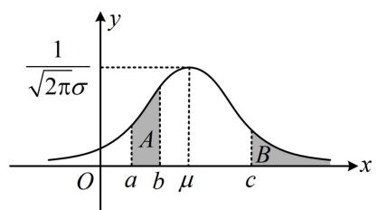
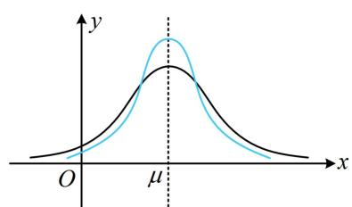
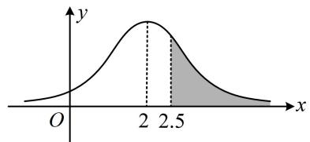
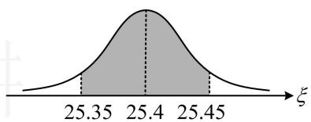
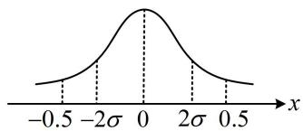
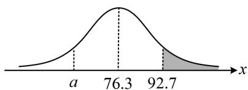
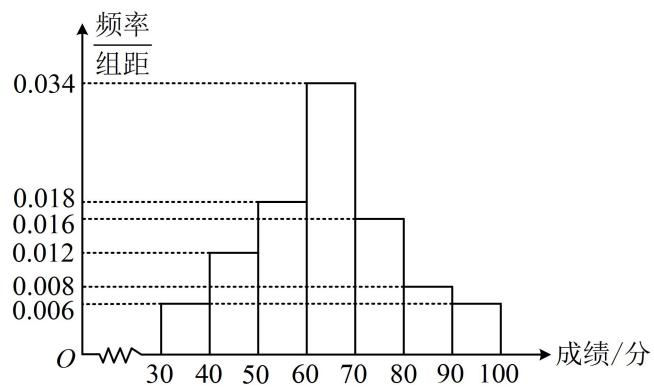
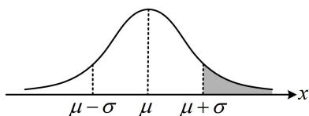
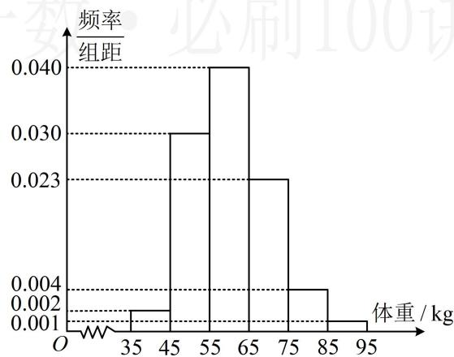

# 内容提要

本节归纳正态分布有关题型，先梳理会用到的一些基础知识。

##### 1. 正态分布的概念：设函数 $f(x) = \frac{1}{\sqrt{2\pi}\sigma} \mathrm{e}^{-\frac{(x - \mu)^2}{2\sigma^2}} (x \in \mathbf{R})$ ，其中 $\mu \in \mathbf{R}$ ， $\sigma > 0$ 为参数。若随机变量 $X$ 的概率分布密度函数为 $f(x)$ ，则称 $X$ 服从正态分布，记作 $X \sim N(\mu, \sigma^2)$ ，其中 $\mu$ 和 $\sigma^2$ 分别是 $X$ 的均值和方差。特别地，当 $\mu = 0$ ， $\sigma = 1$ 时，称随机变量 $X$ 服从标准正态分布。我们称函数 $f(x)$ 为正态密度函数，称它的图象为正态密度曲线，简称正态曲线，如图1。

图1

图2

##### 2. 取值概率: 服从正态分布的随机变量取任何一个值的概率均为 0, 我们更关注它在某区间内取值的概率, 如上图 1, 若 $X \sim N(\mu, \sigma^2)$ , 则 $P(a \leq X \leq b)$ 等于区域 $A$ 的面积, $P(X \geq c)$ 等于区域 $B$ 的面积; 由于正态曲线关于 $x = \mu$ 对称, 所以 $P(X \geq \mu) = 0.5$ .  
##### 3. 调整参数对正态曲线的影响:

①取定 $\sigma$ ，调整 $\mu$ ，则正态曲线的形状不变，但会沿 $x$ 轴方向平移；  
②取定 $\mu$ ，调整 $\sigma$ ，则正态曲线的位置不变，但形状会发生变化。若 $\sigma$ 增大，则峰值 $\frac{1}{\sqrt{2\pi}\sigma}$ 减小，结合正态曲线与 $x$ 轴围成的面积始终为 1 可知曲线会变得“矮胖”， $X$ 的取值变得更分散，如上图 2 中黑色曲线；反之，若 $\sigma$ 减小，则曲线会变得“瘦高”， $X$ 的取值变得更集中，如上图 2 中蓝色曲线。  
##### 4. 3σ 原则：若 $X \sim N(\mu, \sigma^2)$ ，则对给定的 $k \in \mathbf{N}^*$ ， $P(\mu - k\sigma \leq X \leq \mu + k\sigma)$ 是一个只与 $k$ 有关的定值。特别地，当 $k$ 取 1, 2, 3 时的情况在统计中有广泛的应用，尤其重要：

$P (\mu - \sigma \leq X \leq \mu + \sigma) \approx 0. 6 8 2 7,$

$P (\mu - 2 \sigma \leq X \leq \mu + 2 \sigma) \approx 0. 9 5 4 5,$

$P (\mu - 3 \sigma \leq X \leq \mu + 3 \sigma) \approx 0. 9 9 7 3.$

可以看到， $X$ 在 $[\mu - 3\sigma, \mu + 3\sigma]$ 外取值的概率只有0.0027，在实际应用中，通常认为服从正态分布 $N(\mu, \sigma^2)$ 的随机变量只取 $[\mu - 3\sigma, \mu + 3\sigma]$ 内的值.

# 类型 I：用正态曲线求概率

【例 1】(2022·新课标 II 卷) 随机变量 X 服从正态分布 $N(2, \sigma^{2})$ ，若 $P(2 < X \leq 2.5) = 0.36$ ，则 $P(X > 2.5) =$ \_\_\_\_ .

解析可画正态曲线来分析，如图，求正态分布在某区间取值的概率，只需求该区间那部分的面积，由题意， $\mu = 2$ ，如图，

$P (X > 2. 5) = P (X > 2) - P (2 <   X \leq 2. 5) = 0. 5 - 0. 3 6 = 0. 1 4.$

答案: 0.14

【变式 1】（多选）已知某批零件的质量指标 $\xi$ （单位：毫米）服从正态分布 $N(25.4, \sigma^2)$ ，且 $P(\xi \geq 25.45) = 0.1$ ，现从该批零件中随机取 3 件，用 $X$ 表示这 3 件零件中质量指标值 $\xi$ 落在区间 (25.35, 25.45) 外的件数，则（）

$\quad$A. $P(25.35 < \xi < 25.45) = 0.8$

$\quad$B. $E(X) = 2.4$

$\quad$C. $D(X) = 0.48$

$\quad$D. $P(X\geq 1) = 0.488$

解析A项，如图，由对称性， $P(\xi \leq 25.35) = P(\xi \geq 25.45) = 0.1$

所以 $P(25.35 < \xi < 25.45) = 1 - P(\xi \leq 25.35) - P(\xi \geq 25.45) = 1 - 0.1 - 0.1 = 0.8$ ，故A项正确；

B项，要分析3件产品中落在(25.35,25.45)外的件数，需先求出1件产品落在该区间外的概率，

随机取1件零件，质量指标值位于区间(25.35,25.45)外的概率为0.2，所以 $X\sim B(3,0.2)$

从而 $E(X) = 3\times 0.2 = 0.6$ ， $D(X) = 3\times 0.2\times (1 - 0.2) = 0.48$

故 B 项错误，C 项正确；

D项，因为 $X \sim B(3,0.2)$ ，所以 $P(X \geq 1) = 1 - P(X = 0)$

$= 1 - \mathrm{C}_{3}^{0}\times (1 - 0.2)^{3} = 0.488$ ，故D项正确.

答案: ACD

##### 【变式2】对一个物理量做 $n$ 次测量，并以测量结果的平均值作为该物理量的最后结果。已知最后结果的误差 $\varepsilon_{n} \sim N\left(0, \frac{2}{n}\right)$ ，为使误差 $\varepsilon_{n}$ 在 $(-0.5, 0.5)$ 的概率不低于 0.9545，至少要测量 \_\_\_\_ 次。（若 $X \sim N(\mu, \sigma^{2})$ ，则 $P(|X - \mu| < 2\sigma) = 0.9545$ ）

解析 $\varepsilon_{n}\sim N\left(0,\frac{2}{n}\right)\Rightarrow \mu = 0$ ， $\sigma = \sqrt{\frac{2}{n}}$ ，由题意， $P(-0.5 <   \varepsilon_n <   0.5)\geq 0.9545$ ①，

涉及正态分布的区间取值概率，可画正态曲线来看，

如图，结合所给数据可知 $P(-2\sigma < \varepsilon_{n} < 2\sigma) = 0.9545$ ，

所以不等式①等价于 $(-2\sigma, 2\sigma) \subseteq (-0.5, 0.5)$ ，从而 $2\sigma \leq 0.5$ ，故 $2\sqrt{\frac{2}{n}} \leq \frac{1}{2}$ ，

解得： $n \geq 32$ ，所以至少要测量32次.

答案: 32

【变式 3】某省 2021 年开始将全面实施新高考方案，在 6 门选择性考试科目中，物理、历史这两门科目采用原始分计分；政治、地理、化学、生物这 4 门科目采用等级转换赋分，将每科考生的原始分从高到低划分为 A, B, C, D, E 共 5 个等级，各等级人数所占比例分别为 15%，35%，

35%, 13%和2%, 并按给定的公式进行转换赋分. 该省组织了一次高一年级统一考试, 并对政治、地理、化学、生物这4门科目的原始分进行了等级转换赋分. 假设该省此次高一学生化学学科原始分Y服从正态分布N(76.3,64), 若以此次高一学生化学学科原始分D等级的最低分为实施分层教学的划线分, 试估计该划线分大约为\_\_\_\_分.

附：若 $Y \sim N(\mu, \sigma^2)$ ，令 $\eta = \frac{Y - \mu}{\sigma}$ ，则 $\eta \sim N(0,1)$ ， $P(\eta \leq 2.05) \approx 0.98$ 。

解析所给数据是标准正态分布 $\eta$ 的取值概率，要求的是 $Y$ 的情况，故应先把 $\eta \leq 2.05$ 转换成 $Y$ 的范围，由 $\eta = \frac{Y - \mu}{\sigma}$ 可得 $\eta \leq 2.05$ 即为 $\frac{Y - \mu}{\sigma} \leq 2.05$ ，又 $Y \sim N(76.3, 64)$ ，所以 $\mu = 76.3$ ， $\sigma = 8$ ，故 $\frac{Y - 76.3}{8} \leq 2.05$ ，解得： $Y \leq 92.7$ ，所以 $P(\eta \leq 2.05) \approx 0.98$ 即为 $P(Y \leq 92.7) \approx 0.98$ ，故 $P(Y > 92.7) \approx 1 - 0.98 = 0.02$ ，从所给的各等级的人数占比来看，原始分 $D$ 等级最低分应为从低到高的 $2\%$ 处，故只需求出使 $P(Y \leq a) \approx 0.02$ 的 $a$ ，即为估计的划线分，涉及正态分布取值概率，可画正态曲线来看，

如图，阴影部分的面积恰好为0.02，所以要使 $P(Y\leq a)\approx 0.02$ ，

应有 $a$ 和92.7应关于76.3对称，即 $\frac{a + 92.7}{2} = 76.3$ ，解得： $a = 59.9$ 故可估计该划线分大约为59.9分.

答案59.9

【总结】涉及正态分布算区间概率，可画正态曲线，利用其对称性和 $3\sigma$ 区间取值概率来分析即可.

# 类型Ⅱ：正态分布在实际问题中的综合应用

【例 2】某车间生产一批零件，现从中随机取 10 个，测量其内径（单位：mm）的数据如下：192，192，193，197，200，202，203，204，208，209，设这 10 个数据的均值为 $\mu$ ，标准差为 $\sigma$ ：

（1） 求 $\mu$ 和 $\sigma$ ;

（2）已知这批零件的内径 $X$ 服从正态分布 $N(\mu, \sigma^2)$ ，若该车间又新购一台设备，安装调试后，试生产了5个零件，测量其内径分别为：181，190，198，204，213，如果你是该车间的负责人，以原设备生产性能为标准，试根据 $3\sigma$ 原则判断这台设备是否需要进一步调试？并说明你的理由.

附：若 $X \sim N(\mu, \sigma^2)$ ，则 $P(\mu - \sigma < X < \mu + \sigma) \approx 0.6827$ ， $P(\mu - 2\sigma < X < \mu + 2\sigma) \approx 0.9545$ ，

$P (\mu - 3 \sigma <   X <   \mu + 3 \sigma) \approx 0. 9 9 7 3, \quad 0. 9 9 7 3 ^ {4} \approx 0. 9 9.$

解：（1）由题意， $\mu = \frac{192 + 192 + 193 + 197 + 200 + 202 + 203 + 204 + 208 + 209}{10} = 200$

$\begin{array}{l} \sigma^ {2} = \frac {1}{1 0} [ (1 9 2 - 2 0 0) ^ {2} + (1 9 2 - 2 0 0) ^ {2} + (1 9 3 - 2 0 0) ^ {2} + (1 9 7 - 2 0 0) ^ {2} + (2 0 0 - 2 0 0) ^ {2} + (2 0 2 - 2 0 0) ^ {2} + (2 0 3 - 2 0 0) ^ {2} \\ + (2 0 4 - 2 0 0) ^ {2} + (2 0 8 - 2 0 0) ^ {2} + (2 0 9 - 2 0 0) ^ {2} ] = 3 6, \text {所以} \sigma = 6. \\ \end{array}$

（2） (要检验设备是否正常, 先看试生产的零件的内径是否有落在区间 $[\mu - 3\sigma, \mu + 3\sigma]$ 外的)

由（1）可得 $X \sim N(200,36)$ ，所以 $[\mu - 3\sigma, \mu + 3\sigma]$ 即为[182,218]，且 $P(182 < X < 218) \approx 0.9973$ ，试生产的5个零件中有一个内径为 $181\mathrm{mm}$ ，落在了[182,218]外，

(此时应再计算试生产的 5 个零件, 恰有 1 个落在 [182,218] 外的概率, 看此概率大不大)

记生产5个零件，落在[182,218]外的个数为 $Y$ ，则 $Y\sim B(5,0.0027)$

所以 $P(Y=1)=C_{5}^{1}\times0.0027\times0.9973^{4}\approx0.013$ ，此概率很小，而小概率事件发生了，故该设备需进一步调试.

【反思】由于服从正态分布的随机变量在区间 $[\mu - 3\sigma, \mu + 3\sigma]$ 外取值的概率很小，所以试生产零件数不多的情况下，出现该区间外的值的概率也较小，故可按是否出现区间外的值来检验设备是否异常.

【例 3】某市为了传承发展中华优秀传统文化，组织该市中学生进行了一次文化知识有奖竞赛，竞赛奖励规则如下：得分在[70,80)内的学生获三等奖，得分在[80,90)内的学生获二等奖，得分在[90,100]内的学生获一等奖，其他学生不获奖。为了解学生对相关知识的掌握情况，随机抽取100名学生的竞赛成绩，并以此为样本绘制了样本频率分布直方图，如图。

（1） 现从该样本中随机抽取两名学生的竞赛成绩, 求这两名学生中恰有一名学生获奖的概率;  
（2） 若该市所有参赛学生的成绩 $X$ 近似服从正态分布 $N(\mu, \sigma^2)$ , 其中 $\sigma \approx 15$ , $\mu$ 为样本平均数的估计值, 利用所得正态分布模型解决以下问题:  
(i) 若该市共有 10000 名学生参加了竞赛, 试估计参赛学生中成绩超过 79 分的学生数; (结果四舍五入到整数)  
（ii）若从所有参赛学生中（参赛学生数大于10000）随机取3名学生进行访谈，设其中竞赛成绩在64分以上的学生数为 $\xi$ ，求 $\xi$ 的分布列和期望.

附：若随机变量 $X \sim N(\mu, \sigma^2)$ ，则 $P(\mu - \sigma < X < \mu + \sigma) \approx 0.6827$

$P (\mu - 2 \sigma <   X <   \mu + 2 \sigma) \approx 0. 9 5 4 5, P (\mu - 3 \sigma <   X <   \mu + 3 \sigma) \approx 0. 9 9 7 3.$

解：（1）由题意，样本100人的成绩中，获奖的有 $100\times(0.016+0.008+0.006)\times10=30$ 人，

所以抽到的两名学生中恰有一名学生获奖的概率 $P = \frac{\mathrm{C}_{70}^{1}\mathrm{C}_{30}^{1}}{\mathrm{C}_{100}^{2}} = \frac{14}{33}$ .

（2） (i) (要估算成绩超过 79 分的人数, 应先求 $P(X > 79)$ , 而要求此概率, 需找到 79 与 $\mu$ 和 $\sigma$ 的关系)由题意, $\mu = 35 \times 0.06 + 45 \times 0.12 + 55 \times 0.18 + 65 \times 0.34 + 75 \times 0.16 + 85 \times 0.08 + 95 \times 0.06 = 64$ , 所以 $X \sim N(64,15^{2})$ ,如图, $P(X > 79) = P(X > \mu + \sigma) = \frac{1 - P(\mu - \sigma < X < \mu + \sigma)}{2} \approx \frac{1 - 0.6827}{2} = 0.15865$ ,

该市共有 10000 名学生参加了竞赛，所以参赛学生中成绩超过 79 分的学生数约为 $10000 \times 0.15865 \approx 1587$ .

(ii) (抽取人数远小于总人数, 故可用二项分布来近似处理)

因为 $\mu = 64$ ，所以 $P(X > 64) = \frac{1}{2}$ ，故 $\xi \sim B\left(3, \frac{1}{2}\right)$ ，所以 $P(\xi = 0) = C_3^0 \times \left(1 - \frac{1}{2}\right)^3 = \frac{1}{8}$

$P(\xi = 1) = \mathrm{C}_3^1\times \frac{1}{2}\times \left(1 - \frac{1}{2}\right)^2 = \frac{3}{8},\quad P(\xi = 2) = \mathrm{C}_3^2\times \left(\frac{1}{2}\right)^2\times \left(1 - \frac{1}{2}\right) = \frac{3}{8},\quad P(\xi = 3) = \mathrm{C}_3^3\times \left(\frac{1}{2}\right)^3 = \frac{1}{8},$ 故 $\xi$ 的分布列为：

<table><tr><td>ξ</td><td>0</td><td>1</td><td>2</td><td>3</td></tr><tr><td>P</td><td> $\frac{1}{8}$ </td><td> $\frac{3}{8}$ </td><td> $\frac{3}{8}$ </td><td> $\frac{1}{8}$ </td></tr></table>

因为 $\xi \sim B\left(3, \frac{1}{2}\right)$ ，所以 $\xi$ 的期望 $E(\xi) = 3 \times \frac{1}{2} = \frac{3}{2}$ .

【总结】在实际问题中，计算正态分布在某区间取值的概率，关键是找到区间端点与 $\mu$ 和 $\sigma$ 的关系，借助正态曲线和 $P(\mu - \sigma < X < \mu + \sigma)$ ， $P(\mu - 2\sigma < X < \mu + 2\sigma)$ ， $P(\mu - 3\sigma < X < \mu + 3\sigma)$ 这些参考数据来计算，所以凡是涉及正态分布，务必关注 $\mu$ 和 $\sigma$ 。

# 强化训练

##### 1. (2024·江西模拟·★☆)

已知某地区高考二检数学共有 8000 名考生参与，且二检的数学成绩 $X$ 近似服从正态分布 $N(95, \sigma^2)$ ，若成绩在 80 分以下的有 1500 人，则可以估计 $P(95 \leq X \leq 110) = (\quad)$

$\quad$A. $\frac{5}{32}$

$\quad$B. $\frac{5}{16}$

$\quad$C. $\frac{11}{32}$

$\quad$D. $\frac{3}{16}$

##### 2. (2024·新课标Ⅰ卷·★★☆)(多选)

为了解推动出口后的亩收入（单位：万元）情况，从该种植区抽取样本，得到推动出口后亩收入的样本均值 $\overline{x} = 2.1$ ，样本方差 $s^2 = 0.01$ ，已知该种植区以往的亩收入 $X$ 服从正态分布 $N(1.8,0.1^2)$ ，假设推动出口后的亩收入 $Y$ 服从正态分布 $N(\overline{x},s^2)$ ，则（）（若随机变量 $Z$ 服从正态分布 $N(\mu ,\sigma^2)$ ，则 $P(Z < \mu +\sigma)\approx 0.8413$ ）

$\quad$A. $P(X > 2) > 0.2$

$\quad$B. $P(X > 2) <   0.5$

$\quad$C. $P(Y > 2) > 0.5$

$\quad$D. $P(Y > 2) <   0.8$

##### 3. (2023·四省联考·★★★)

某工厂生产的产品的质量指标服从正态分布 $N(100, \sigma^2)$ ，质量指标介于99至101之间的产品为良品，为使这种产品的良品率达到 $95.45\%$ ，则需调整生产工艺，使得 $\sigma$ 至多为 \_\_\_\_。（附：若 $X \sim N(\mu, \sigma^2)$ ，则 $P(|X - \mu| < 2\sigma) = 0.9545$ ）

##### 4. (2023·河南洛阳模拟·★★★☆)

某汽车公司最近研发了一款新能源汽车，以单次最大续航里程500公里为标准进行测试，且每辆汽车是否达到标准相互独立，设每辆新能源汽车达到标准的概率为 $p(0 < p < 1)$ ，当100辆汽车中恰有80辆达到标准的概率取最大值时，若预测该款新能源汽车的单次最大续航里程为 $X$ ，且 $X \sim N(550, \sigma^2)$ ，则预测这款汽车的单次最大续航里程不低于600公里的概率为（）

$\quad$A. 0.2

$\quad$B. 0.3

$\quad$C. 0.6

$\quad$D. 0.8

##### 5. (2023·安徽模拟·★★★)

为贯彻落实《健康中国行动（2019\~2030年）》、《关于全面加强和改进新时代学校体育工作的意见》等文件的精神，确保2030年学生体质达到规定要求，各地将认真做好学生的体质健康检测。某市决定对某中学学生的身体健康状况进行调查，现从该校抽取200名学生测量他们的体重，得到如下的样本数据的频率分布直方图。

（1） 求这 200 名学生体重的平均数 $\bar{x}$ 和方差 $s^2$ ; (同一组数据用该区间的中点值作代表)

（2）由频率分布直方图可知，该校学生的体重 $Z$ 服从正态分布 $N(\mu, \sigma^2)$ ，其中 $\mu$ 近似为样本平均数 $\overline{x}$ ， $\sigma^2$ 近似为样本方差 $s^2$ 。

①利用该正态分布，求 $P(50.73 < Z \leq 69.27)$ ；

②若从该校随机抽取50名学生，记 $X$ 表示这50名学生的体重位于区间(50.73,69.27]内的人数，利用①的结果，求 $E(X)$ ：

参考数据： $\sqrt{86} \approx 9.27$ ，若 $Z \sim N(\mu, \sigma^2)$ ，则 $P(\mu - \sigma < Z \leq \mu + \sigma) \approx 0.6827$ ， $P(\mu - 2\sigma < Z \leq \mu + 2\sigma) \approx 0.9545$ ， $P(\mu - 3\sigma < Z \leq \mu + 3\sigma) \approx 0.9973$ ：

##### 6. (2017·新课标Ⅰ卷·★★★★)

为了监控某种零件的一条生产线的生产过程，检验员每天从该生产线上随机抽取16个零件，并测量其尺寸（单位：cm）。根据长期生产经验，可以认为这条生产线正常状态下生产的零件的尺寸服从正态分布 $N(\mu, \sigma^2)$ 。

（1） 假设生产状态正常, 记 $X$ 表示一天内抽取的 16 个零件中其尺寸在 $(\mu - 3\sigma, \mu + 3\sigma)$ 之外的零件数, 求 $P(X \geq 1)$ 及 $X$ 的数学期望;

（2）一天内抽检的零件中，如果出现了尺寸在 $(\mu - 3\sigma, \mu + 3\sigma)$ 之外的零件，就认为这条生产线在这一天的生产过程可能出现了异常情况，需对当天的生产过程进行检查.

(i) 试说明上述监控生产过程方法的合理性;

（ii）下面是检验员在一天内抽取的16个零件的尺寸：

<table><tr><td>9.95</td><td>10.12</td><td>9.96</td><td>9.96</td><td>10.01</td><td>9.92</td><td>9.98</td><td>10.04</td></tr><tr><td>10.26</td><td>9.91</td><td>10.13</td><td>10.02</td><td>9.22</td><td>10.04</td><td>10.05</td><td>9.95</td></tr></table>

经计算得 $\overline{x}=\frac{1}{16}\sum_{i=1}^{16}x_{i}=9.97,\quad s=\sqrt{\frac{1}{16}\sum_{i=1}^{16}(x_{i}-\overline{x})^{2}}=\sqrt{\frac{1}{16}\left(\sum_{i=1}^{16}x_{i}^{2}-16\overline{x}^{2}\right)}\approx0.212$ ，其中 $x_{i}$ 为抽取的第 i 个零件的尺寸， $i=1,2,\cdots,16$

用样本平均数 $\bar{x}$ 作为 $\mu$ 的估计值 $\hat{u}$ ，用样本标准差 $s$ 作为 $\sigma$ 的估计值 $\hat{\sigma}$ ，利用估计值判断是否需对当天的生产过程进行检查？剔除 $(\hat{\mu} - 3\hat{\sigma}, \hat{\mu} + 3\hat{\sigma})$ 之外的数据，用剩下的数据估计 $\mu$ 和 $\sigma$ （精确到0.01）.

附：若随机变量 $Z \sim N(\mu, \sigma^2)$ ，则 $P(\mu - 3\sigma < Z < \mu + 3\sigma) = 0.9974$ ， $0.9974^{16} \approx 0.9592$ ， $\sqrt{0.008} \approx 0.09$ 。

