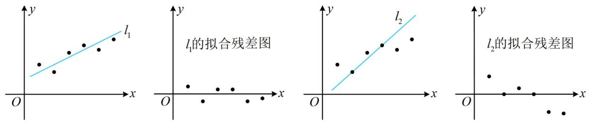
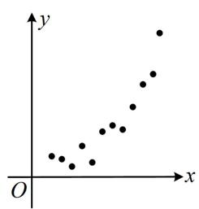
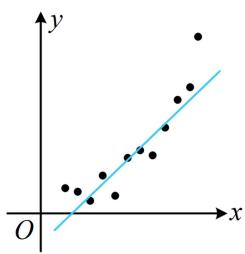
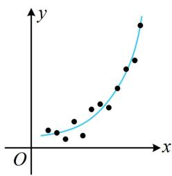
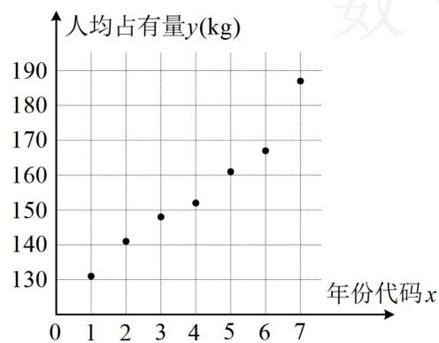
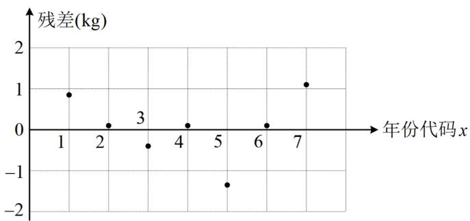
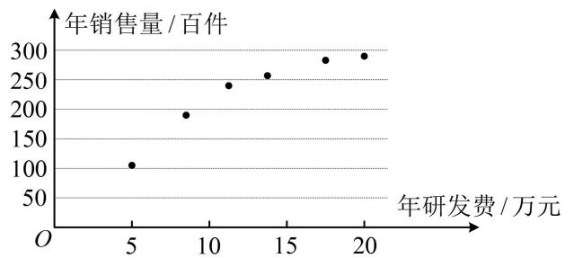
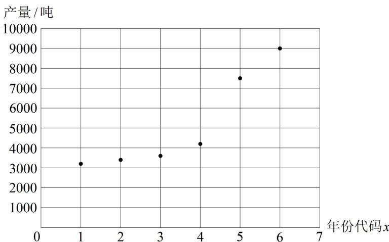
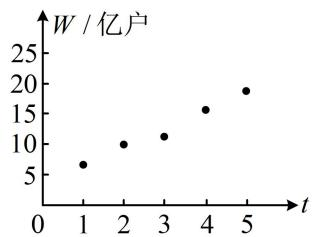

# 第1节 一元线性回归模型及其应用（★★★）

# 内容提要

本节主要归纳变量的相关关系、一元线性回归模型及其应用等内容，先梳理一些基本概念.

##### 1. 样本相关系数 $r$ : 用于判断线性相关关系的强弱, 以及是正相关还是负相关.

① 计算公式： $r = \frac{\sum_{i=1}^{n}(x_i - \overline{x})(y_i - \overline{y})}{\sqrt{\sum_{i=1}^{n}(x_i - \overline{x})^2} \cdot \sqrt{\sum_{i=1}^{n}(y_i - \overline{y})^2}} = \frac{\sum_{i=1}^{n} x_i y_i - n \overline{x} \overline{y}}{\sqrt{\sum_{i=1}^{n} x_i^2 - n \overline{x}^2} \cdot \sqrt{\sum_{i=1}^{n} y_i^2 - n \overline{y}^2}}$ ，且按此求得的 r 必在 [-1,1] 上；

②当 $r > 0$ 时，变量 $x$ 和 $y$ 正相关，当 $r < 0$ 时，变量 $x$ 和 $y$ 负相关；  
③ $|r|$ 越接近1，变量x与y的线性相关程度越大； $|r|$ 越接近0，x与y的线性相关程度越小.

##### 2. 一元线性回归模型参数的最小二乘估计：在 $y$ 关于 $x$ 的经验回归方程 $\hat{y} = \hat{b} x + \hat{a}$ 中，参数 $\hat{b}$ 和 $\hat{a}$ 的最小二乘估计公式分别为 $\hat{b} = \frac{\sum_{i=1}^{n}(x_i - \overline{x})(y_i - \overline{y})}{\sum_{i=1}^{n}(x_i - \overline{x})^2} = \frac{\sum_{i=1}^{n}x_iy_i - n\overline{x}\overline{y}}{\sum_{i=1}^{n}x_i^2 - n\overline{x}^2}, \quad \hat{a} = \overline{y} - \hat{b}\overline{x}$ .

注：上式中 $\sum_{i=1}^{n}(x_i - \overline{x})(y_i - \overline{y}) = \sum_{i=1}^{n} x_i y_i - n\overline{x}\overline{y}$ ， $\sum_{i=1}^{n}(x_i - \overline{x})^2 = \sum_{i=1}^{n} x_i^2 - n\overline{x}^2$ ，这种公式的转换需熟悉，可能出现给的是其中一种形式，但计算时却必须用另一种的情况，下面给出 $\sum_{i=1}^{n}(x_i - \overline{x})(y_i - \overline{y}) = \sum_{i=1}^{n} x_i y_i - n\overline{x}\overline{y}$ 的证明过程.

证明： $\sum_{i = 1}^{n}(x_{i} - \overline{x})(y_{i} - \overline{y}) = \sum_{i = 1}^{n}(x_{i}y_{i} - \overline{y} x_{i} - \overline{x} y_{i} + \overline{x}\overline{y}) = \sum_{i = 1}^{n}x_{i}y_{i} - \sum_{i = 1}^{n}\overline{y} x_{i} - \sum_{i = 1}^{n}\overline{x} y_{i} + \sum_{i = 1}^{n}\overline{x}\overline{y}$

$= \sum_ {i = 1} ^ {n} x _ {i} y _ {i} - \bar {y} \sum_ {i = 1} ^ {n} x _ {i} - \bar {x} \sum_ {i = 1} ^ {n} y _ {i} + n \overline {{{{x}}}} \overline {{{{y}}}} = \sum_ {i = 1} ^ {n} x _ {i} y _ {i} - \bar {y} \cdot n \overline {{{{x}}}} - \bar {x} \cdot n \overline {{{{y}}}} + n \overline {{{{x}}}} \overline {{{{y}}}} = \sum_ {i = 1} ^ {n} x _ {i} y _ {i} - n \overline {{{{x}}}} \overline {{{{y}}}}.$

##### 3. 残差: 用回归方程拟合两个变量 $x$ 和 $y$ 的关系时, 对于样本点 $(x_{1}, y_{1}), (x_{2}, y_{2}), \cdots, (x_{n}, y_{n})$ , 称观测值 $y_{i}$ 与预测值 $\hat{y}_{i}$ 的差 $y_{i} - \hat{y}_{i}$ 为相对于样本点 $(x_{i}, y_{i})$ 的残差, 其中 $i = 1, 2, \cdots, n$ . 将所有样本点的残差绘制成图形即可得到残差图, 残差点比较均匀地落在水平带状区域中, 且这样的区域越窄, 模型的拟合效果越好. 例如, 下面是用两个不同的线性回归模型 $l_{1}$ 和 $l_{2}$ 对同一组观测数据进行拟合以及对应的残差图, 对比可得线性回归模型 $l_{1}$ 的残差点分布在 $x$ 轴附近狭窄的带状区域内, 拟合效果比 $l_{2}$ 好.

##### 4. 决定系数： $R^{2} = 1 - \frac{\sum_{i=1}^{n}(y_{i} - \hat{y}_{i})^{2}}{\sum_{i=1}^{n}(y_{i} - \overline{y})^{2}}$ ，对于已经获取的样本数据，分母部分 $\sum_{i=1}^{n}(y_{i} - \overline{y})^{2}$ 是确定

的数, 分子部分 $\sum_{i=1}^{n}(y_i - \hat{y}_i)^2$ 是残差平方和, 决定系数 $R^2$ 越大, 意味着残差平方和越小, 拟合效果越好. 当要比较两种回归模型的拟合效果时, 可计算决定系数 $R^2$ 加以对比.

##### 5. 非线性回归模型：通过变换（取对数、取指数、平方等）转化为线性回归模型计算，有关考题一般会给出参考数据。例如下图的这组观测数据 $(x_{1},y_{1}),(x_{2},y_{2}),\cdots,(x_{n},y_{n})$ ，若用线性回归模型 $\hat{y}=\hat{b}x+\hat{a}$ 拟合，效果就比用指数模型 $\hat{y}=\hat{a}\mathrm{e}^{\hat{b}x}$ 拟合差。而欲求模型 $\hat{y}=\hat{a}\mathrm{e}^{\hat{b}x}$ 中的 $\hat{a}$ 和 $\hat{b}$ ，可两端取自然对数，得到 $\ln\hat{y}=\hat{b}x+\ln\hat{a}$ ，若设 $\left\{\begin{aligned}\hat{z}&=\ln\hat{y}\\ \hat{c}&=\ln\hat{a}\end{aligned}\right.$ ，则 $\hat{z}=\hat{b}x+\hat{c}$ ，这样就将y关于x的非线性拟合转化成了z关于x的线性拟合。这里用到的变换，就是取对数，我们可以将观测数据 $(x_{1},y_{1}),(x_{2},y_{2}),\cdots,(x_{n},y_{n})$ 变换成 $(x_{1},z_{1}),(x_{2},z_{2}),\cdots,(x_{n},z_{n})$ ，再用最小二乘法求得z关于x的线性回归方程，最后将z换回成 $\ln y$ 即可。

# 类型I：概念、计算类小题

##### 【例1】关于线性回归的描述，下列说法不正确的是（）

$\quad$A. 经验回归方程 $\hat{y} = -1.8x + 2.1$ 中变量 $x, y$ 成正相关关系  
$\quad$B. 相关系数 $r$ 的绝对值越接近 1，线性相关程度越强  
$\quad$C. 经验回归方程 $\hat{y} = 1.1x - 1.6$ 中变量 $x, y$ 成正相关关系  
$\quad$D. 残差平方和越小，拟合效果越好

解析A项，经验回归方程 $\hat{y} = -1.8x + 2.1$ 的斜率 $\hat{b} = -1.8 < 0 \Rightarrow x$ ， $y$ 成负相关关系，故A项错误；B项， $|r|$ 越接近1，成对样本数据的线性相关程度越强，越接近0，线性相关程度越弱，故B项正确；

C项，经验回归方程 $\hat{y} = 1.1x - 1.6$ 的斜率 $\hat{b} = 1.1 > 0$ ，所以 $x, y$ 成正相关关系，故C项正确；

D项，残差平方和越小，则回归模型的拟合效果越好，故D项正确.

答案: A

【例 2】某同学在研究性学习中，收集到某制药厂今年前 5 个月甲胶囊生产产量（单位：万盒）的数据如下表所示：

<table><tr><td>x</td><td>1</td><td>2</td><td>3</td><td>4</td><td>5</td></tr><tr><td>y</td><td>5</td><td>6</td><td>5</td><td>6</td><td>8</td></tr></table>

若 $x, y$ 线性相关，经验回归方程为 $\hat{y} = 0.7x + \hat{a}$ ，则以下判断正确的是（）

$\quad$A. $x$ 增加1个单位, 则 $y$ 必增加0.7个单位  
$\quad$B. $x$ 减少 1 个单位, 则 $y$ 必减少 0.7 个单位  
$\quad$C. 当 $x = 6$ 时, $y$ 的预测值为 8.1 万盒  
$\quad$D. 经验回归直线 $\hat{y} = 0.7x + \hat{a}$ 经过点(2,6)

解析A项，由经验回归方程 $\hat{y} = 0.7x + \hat{a}$ 可知当 $x$ 增加1个单位时， $y$ 大约增加0.7个单位，不是必增加0.7个单位，故A项错误，同理也可得B项错误；

C项，要求 $x = 6$ 时 $y$ 的预测值，需先求出 $\hat{a}$ ，可将样本中心点 $(\overline{x},\overline{y})$ 代入经验回归方程，

由表中数据， $\overline{x} = \frac{1 + 2 + 3 + 4 + 5}{5} = 3$ ， $\overline{y} = \frac{5 + 6 + 5 + 6 + 8}{5} = 6$ ，将(3,6)代入 $\hat{y} = 0.7x + \hat{a}$ 可得 $6 = 0.7\times 3 + \hat{a}$

解得： $\hat{a}=3.9$ ，所以 $\hat{y}=0.7x+3.9$ ，当 $x=6$ 时， $\hat{y}=0.7\times6+3.9=8.1$ ，故 C 项正确；

D 项, 经验回归直线经过点(3,6), 不过点(2,6), 故 D 项错误.

答案: C

【反思】 $(\bar{x},\bar{y})$ 叫做样本数据 $(x_{1},y_{1}),(x_{2},y_{2}),\cdots,(x_{n},y_{n})$ 的样本中心点，样本中心点一定在经验回归直线上.

##### 【例3】某部门统计了某地区今年前7个月在线外卖的规模如下表：

<table><tr><td>月份代号x</td><td>1</td><td>2</td><td>3</td><td>4</td><td>5</td><td>6</td><td>7</td></tr><tr><td>在线外卖规模y(百万元)</td><td>11</td><td>13</td><td>18</td><td>★</td><td>28</td><td>★</td><td>35</td></tr></table>

其中 4、6 两个月的在线外卖规模数据模糊，但这 7 个月的平均值为 23，若利用经验回归方程 $\hat{y} = \hat{b} x + \hat{a}$ 来拟合预测，且 7 月相应于点 (7,35) 的残差为 -0.6，则 $\hat{a} - \hat{b} =$ （）

$\quad$A. 1

$\quad$B. 2

$\quad$C. 3

$\quad$D. 4

解析要求 $\hat{a} -\hat{b}$ ，应建立关于 $\hat{a}$ 和 $\hat{b}$ 的方程组，由题意， $\overline{x} = \frac{1 + 2 + 3 + 4 + 5 + 6 + 7}{7} = 4$ ， $\overline{y} = 23$

所以样本中心点(4,23)满足经验回归方程 $\hat{y} = \hat{b} x + \hat{a}$ ，故 $4\hat{b} + \hat{a} = 23$ ①，

题干还给了一个残差数据，可由此建立第二个方程，

因为 7 月相应于点 $(7,35)$ 的残差为 -0.6，所以 $35-(7\hat{b}+\hat{a})=-0.6$ ②，

联立①②解得： $\hat{a}=6.2$ ， $\hat{b}=4.2$ ，所以 $\hat{a}-\hat{b}=2$ 。

答案: B

【例 4】据一组样本数据 $(x_{1},y_{1}),(x_{2},y_{2}),\cdots,(x_{n},y_{n})$ 求得经验回归方程为 $\hat{y}=1.2x+0.4$ ，且 $\bar{x}=3$ ，现发现这组样本数据中有两个样本点(1.2,0.5)和(4.8,7.5)误差较大，去除后重新求得的经验回归直线 $l$ 的斜率为1.1，则（）

$\quad$A. 去除两个误差较大的样本点后， $y$ 的估计值增加速度变快  
$\quad$B. 去除两个误差较大的样本点后, 重新求得的回归方程对应直线一定过点 (3,5)  
$\quad$C. 去除两个误差较大的样本点后, 重新求得的回归方程为 $\hat {y} = 1.1 x + 0.7$   
$\quad$D. 去除两个误差较大的样本点后, 相应于样本点(2,2.7)的残差为 0.1

解析A项，去除两个误差较大的样本点后，经验回归直线的斜率由1.2变成了1.1，

所以 $y$ 的估计值增加速度变慢了，故A项错误；

B项，经验回归直线一定过样本中心点，所以只需看新样本数据的 $\overline{x}$ 和 $\overline{y}$ 是否分别为3和5，

由题意，原样本数据中， $\overline{x}=\frac{x_{1}+x_{2}+\cdots+x_{n}}{n}=3$ ，所以 $x_{1}+x_{2}+\cdots+x_{n}=3n$ ，

又 $\overline{y}=\frac{y_{1}+y_{2}+\cdots+y_{n}}{n}=1.2\overline{x}+0.4=4$ ，所以 $y_{1}+y_{2}+\cdots+y_{n}=4n$

故去除两个误差较大的样本点后， $\overline{x}=\frac{x_{1}+x_{2}+\cdots+x_{n}-1.2-4.8}{n-2}=\frac{3n-6}{n-2}=3$ ，

$\overline{y}=\frac{y_{1}+y_{2}+\cdots+y_{n}-0.5-7.5}{n-2}=\frac{4n-8}{n-2}=4$ ，所以重新求得的回归直线一定过点(3,4)，故B项错误；

C项，给出了新的经验回归直线的斜率为1.1，故只需再求出截距，可将新的样本中心点(3,4)代入，

将(3,4)代入 $\hat{y} = 1.1x + \hat{a}$ 可得 $4 = 1.1\times 3 + \hat{a}$ ，解得： $\hat{a} = 0.7$ ，所以新回归方程为 $\hat{y} = 1.1x + 0.7$ ，故C项正确；

D 项，新回归方程中，当 x=2 时， $\hat{y}=1.1\times2+0.7=2.9$ ，所以残差为 2.7-2.9=-0.2，故 D 项错误.

答案: C

# 类型Ⅱ：线性回归综合大题

【例 5】某种机械设备随着使用年限的增加, 它的使用功能逐渐减退, 使用价值逐年减少, 通常把它使用价值逐年减少的 “量” 换算成费用, 称之为 “失效费”。该种机械设备的使用年限 $x$ (单位: 年) 与失效费 $y$ (单位: 万元) 的统计数据如下表所示:

<table><tr><td>使用年限x(年)</td><td>1</td><td>2</td><td>3</td><td>4</td><td>5</td><td>6</td><td>7</td></tr><tr><td>失效费y(万元)</td><td>2.9</td><td>3.3</td><td>3.6</td><td>4.4</td><td>4.8</td><td>5.2</td><td>5.9</td></tr></table>

（1）由上表数据可知，可用线性回归模型拟合 $y$ 与 $x$ 的关系，请用样本相关系数加以说明；  
（2）求出 $y$ 关于 $x$ 的经验回归方程，并估算该种机械设备使用10年的失效费.

参考公式：相关系数 $r = \frac{\sum_{i=1}^{n}(x_i - \overline{x})(y_i - \overline{y})}{\sqrt{\sum_{i=1}^{n}(x_i - \overline{x})^2} \cdot \sqrt{\sum_{i=1}^{n}(y_i - \overline{y})^2}}$ ，经验回归方程 $\hat{y} = \hat{b} x + \hat{a}$ 中的 $\hat{b}$ 和 $\hat{a}$ 的最小二

乘估计公式为 $\hat{b} = \frac{\sum_{i=1}^{n}(x_i - \overline{x})(y_i - \overline{y})}{\sum_{i=1}^{n}(x_i - \overline{x})^2}$ , $\hat{a} = \overline{y} - \hat{b}\overline{x}$ .

参考数据： $\sum_{i = 1}^{7}(x_i - \overline{x})(y_i - \overline{y}) = 14$ ， $\sum_{i = 1}^{7}(y_i - \overline{y})^2 = 7.08$ ， $\sqrt{198.24}\approx 14.08$

解: （1） (相关系数的公式中, 只有 $\sum_{i=1}^{7}(x_i - \overline{x})^2$ 这部分参考数据未给出, 需用表中数据来计算它)

由表中数据， $\overline{x}=\frac{1+2+3+4+5+6+7}{7}=4$ ，所以 $\sum_{i=1}^{7}(x_{i}-\overline{x})^{2}=(1-4)^{2}+(2-4)^{2}+\cdots+(7-4)^{2}=28$ ，

结合所给参考数据可得相关系数 $r = \frac{\sum_{i=1}^{7}(x_i - \overline{x})(y_i - \overline{y})}{\sqrt{\sum_{i=1}^{7}(x_i - \overline{x})^2} \cdot \sqrt{\sum_{i=1}^{7}(y_i - \overline{y})^2}} = \frac{14}{\sqrt{28} \times \sqrt{7.08}} = \frac{14}{\sqrt{198.24}} \approx \frac{14}{14.08} \approx 0.99$

因为 $r$ 很接近1，所以 $y$ 与 $x$ 有很强的线性相关关系，可用线性回归模型拟合 $y$ 与 $x$ 的关系.

（2）（从公式看，算 $\hat{b}$ 需要用到的量都有了，故先求 $\hat{b}$ ）由（1）得 $\hat{b} = \frac{\sum_{i=1}^{7}(x_i - \overline{x})(y_i - \overline{y})}{\sum_{i=1}^{7}(x_i - \overline{x})^2} = \frac{14}{28} = 0.5$

（算 $\hat{a}$ 要用 $\overline{x}$ 和 $\overline{y}$ ，故再算 $\overline{y}$ ）由表中数据， $\overline{y} = \frac{2.9 + 3.3 + 3.6 + 4.4 + 4.8 + 5.2 + 5.9}{7} = 4.3$ ，

所以 $\hat{a} = \overline{y} -\hat{b}\overline{x} = 4.3 - 0.5\times 4 = 2.3$ ，故 $y$ 关于 $x$ 的经验回归方程为 $\hat{y} = 0.5x + 2.3$

当 $x = 10$ 时， $\hat{y} = 0.5\times 10 + 2.3 = 7.3$ ，所以该种机械设备使用10年的失效费约为7.3万元

【例 6】下面给出了根据我国 2016 年\~2022 年水果人均占有量 y（单位：kg）和年份代码 x 绘制的散点图（图 1）和线性回归方程的残差图（图 2），其中 2016 年\~2022 年的年份代码 x 分别为 1\~7.

图1

图2

（1）根据散点图分析 $y$ 与 $x$ 之间的相关关系；  
（2）根据散点图相应数据计算得 $\sum_{i=1}^{7} y_i = 1074$ ， $\sum_{i=1}^{7} x_i y_i = 4517$ ，求 $y$ 关于 $x$ 的经验回归方程；（精确到 0.01）  
（3） 根据经验回归方程的残差图, 分析线性回归方程的拟合效果.

附：经验回归方程 $\hat{y} = \hat{b} x + \hat{a}$ 中的 $\hat{b}$ 和 $\hat{a}$ 的最小二乘估计公式为 $\hat{b} = \frac{\sum_{i=1}^{n}(x_i - \overline{x})(y_i - \overline{y})}{\sum_{i=1}^{n}(x_i - \overline{x})^2}, \quad \hat{a} = \overline{y} - \hat{b}\overline{x}$ .

解：（1）由散点图可知，样本点均匀地分布在一条直线附近，且随着 $x$ 的增大， $y$ 也增大，所以 $y$ 与 $x$ 有较强的线性相关关系，且为正相关.

（2） (先由所给公式求 $\hat{b}$ , 观察参考数据发现公式的分子分母都没给, 故都得算, 先算较简单的分母)

由题意， $\overline{x}=\frac{1+2+3+4+5+6+7}{7}=4$ ，所以 $\sum_{i=1}^{7}(x_{i}-\overline{x})^{2}=(1-4)^{2}+(2-4)^{2}+(3-4)^{2}+\cdots+(7-4)^{2}=28$ ，

(再算分子, 从图中我们无法读出准确的样本点纵坐标 $y_{i} (i = 1,2,\cdots,7)$ , 故应结合参考数据来算, 参考数据中给了 $\sum_{i=1}^{7} x_{i} y_{i} = 4517$ , 于是将 $\sum_{i=1}^{7} (x_{i} - \overline{x})(y_{i} - \overline{y})$ 转换成 $\sum_{i=1}^{7} x_{i} y_{i} - n \overline{x} \overline{y}$ 来算, 见反思)

由所给参考数据， $\overline{y} = \frac{1}{7}\sum_{i = 1}^{7}y_{i} = \frac{1074}{7}$ ， $\sum_{i = 1}^{7}(x_i - \overline{x})(y_i - \overline{y}) = \sum_{i = 1}^{7}x_iy_i - 7\overline{x}\overline{y} = 4517 - 7\times 4\times \frac{1074}{7} = 221$

所以 $\hat{b} = \frac{\sum_{i=1}^{7}(x_i - \overline{x})(y_i - \overline{y})}{\sum_{i=1}^{7}(x_i - \overline{x})^2} = \frac{221}{28}\approx 7.89,\quad \hat{a} = \overline{y} -\hat{b}\overline{x} = \frac{1074}{7} -\frac{221}{28}\times 4 = \frac{853}{7}\approx 121.86,$

故 $y$ 关于 $x$ 的经验回归方程为 $\hat{y} = 7.89x + 121.86$ .

（3）由残差图可以看出，观测数据的残差点分布在水平带状区域内，且宽度较窄，说明拟合效果较好.

【反思】 $\sum_{i=1}^{n}(x_i - \overline{x})(y_i - \overline{y})$ 和 $\sum_{i=1}^{n} x_i y_i - n\overline{x}\overline{y}$ 的转化务必熟悉，本题公式给的是 $\hat{b} = \frac{\sum_{i=1}^{n}(x_i - \overline{x})(y_i - \overline{y})}{\sum_{i=1}^{n}(x_i - \overline{x})^2}$ ，但实际计算却必须把分子转化成 $\sum_{i=1}^{n} x_i y_i - n\overline{x}\overline{y}$ .

# 类型III：非线性回归综合大题

【例 7】某公司为确定下一年度投入某种产品的研发费，需了解年研发费 x（单位：万元）对年销售量 y（单位：百件）和年利润 z（单位：万元）的影响，现对近 6 年的年研发费 $x_{i}$ 和年销售量 $y_{i}(i=1,2,\cdots,6)$ 数据做了初步处理，得到下面的散点图以及一些统计量的值.

<table><tr><td> $\overline{x}$ </td><td> $\overline{y}$ </td><td> $\overline{u}$ </td><td> $\sum_{i=1}^{6}(x_i - \overline{x})^2$ </td><td> $\sum_{i=1}^{6}(u_i - \overline{u})^2$ </td><td> $\sum_{i=1}^{6}(x_i - \overline{x})(y_i - \overline{y})$ </td><td> $\sum_{i=1}^{6}(u_i - \overline{u})(y_i - \overline{y})$ </td></tr><tr><td>12.5</td><td>222</td><td>3.5</td><td>157.5</td><td>4.5</td><td>1854</td><td>270</td></tr></table>

表中 $u_{i} = \ln x_{i}$ ， $\overline{u} = \frac{1}{6}\sum_{i = 1}^{6}u_{i}$

（1）根据散点图判断 $\hat{y} = \hat{a} +\hat{b} x$ 与 $\hat{y} = \hat{c} +\hat{d}\ln x$ 哪一个更适合作为年销售量 $y$ 关于年研发费 $x$ 的回归方程类型；（给出判断即可，不必说明理由）  
（2）根据（1）的判断结果及表中数据，建立 $y$ 关于 $x$ 的回归方程；

（3）已知这种产品的年利润 $z = 0.5y - x$ ，根据（2）的结果，求出当年研发费为多少时，年利润 $z$ 的预测值最大？

附：经验回归方程 $\hat{y} = \hat{b} x + \hat{a}$ 中的 $\hat{b}$ 和 $\hat{a}$ 的最小二乘估计公式为 $\hat{b} = \frac{\sum_{i=1}^{n}(x_i - \overline{x})(y_i - \overline{y})}{\sum_{i=1}^{n}(x_i - \overline{x})^2}, \quad \hat{a} = \overline{y} - \hat{b}\overline{x}$ .

解：（1） (由散点图选回归模型, 就看哪种回归模型的函数图象和散点图的趋势比较接近)

由散点图可知， $\hat{y} = \hat{c} + \hat{d}\ln x$ 更适合作为年销售量 $y$ 关于年研发费 $x$ 的回归方程类型.

（2）（把 $\ln x$ 看作整体 $u$ ，则 $\hat{y} = \hat{c} + \hat{d}\ln x$ 即为 $\hat{y} = \hat{c} + \hat{d}u$ ，故可按线性回归方程的最小二乘估计求 $\hat{d}$ 和 $\hat{c}$ ）

设 $u = \ln x$ ，则 $\hat{y} = \hat{c} +\hat{d} u$ ，由所给表中数据， $\hat{d} = \frac{\sum_{i = 1}^{6}(u_i - \overline{u})(y_i - \overline{y})}{\sum_{i = 1}^{6}(u_i - \overline{u})^2} = \frac{270}{4.5} = 60$ ， $\hat{c} = \overline{y} -\hat{d}\overline{u} = 222 - 60\times 3.5 = 12$ 所以 $\hat{y} = 12 + 60u$ ，故 $y$ 关于 $x$ 的回归方程为 $\hat{y} = 12 + 60\ln x.$

（3）由（2）可知 $z = 0.5y - x = 0.5(12 + 60\ln x) - x = 6 + 30\ln x - x$ ，所以 $z' = \frac{30}{x} -1 = \frac{30 - x}{x}$

从而 $z' > 0 \Leftrightarrow 0 < x < 30$ ， $z' < 0 \Leftrightarrow x > 30$ ，故 $z = 6 + 30 \ln x - x$ 在 $(0,30)$ 上单调递增，在 $(30, +\infty)$ 上单调递减，所以当年研发费为30万元时，年利润 $z$ 的预测值最大.

【例 8】近年来，云南省保山市龙陵县紧紧围绕打造“中国石斛之乡”的发展定位，大力发展石斛产业，该产业带动龙陵县近四分之一人口脱贫致富。2022 年 8 月，龙陵紫皮石斛获国家地理标志运用促进工程重点项目，并被评为优秀等次。在政府的大力扶持下，龙陵紫皮石斛产量逐年增长，2017 年底到 2022 年底龙陵县石斛产量统计表和散点图如下。

<table><tr><td>年份</td><td>2017</td><td>2018</td><td>2019</td><td>2020</td><td>2021</td><td>2022</td></tr><tr><td>年份代码x</td><td>1</td><td>2</td><td>3</td><td>4</td><td>5</td><td>6</td></tr><tr><td>紫皮石斛产量y(吨)</td><td>3200</td><td>3400</td><td>3600</td><td>4200</td><td>7500</td><td>9000</td></tr></table>

（1）根据散点图判断， $\hat{y} = \hat{b} x + \hat{a}$ 与 $\hat{y} = \hat{c} e^{\hat{d} x}$ （ $\hat{a}, \hat{b}, \hat{c}, \hat{d}$ 均为常数）哪一个更适合作为龙陵县紫皮石斛产量 $y$ 关于年份代码 $x$ 的回归模型？（给出判断即可，不必说明理由）  
（2）经计算得下表中数据，根据（1）中结果，求出 $y$ 关于 $x$ 的回归方程；

<table><tr><td> $\overline{x}$ </td><td> $\overline{y}$ </td><td> $\overline{u}$ </td><td> $\sum_{i=1}^{6}(x_i - \overline{x})^2$ </td><td> $\sum_{i=1}^{6}(x_i - \overline{x})(y_i - \overline{y})$ </td><td> $\sum_{i=1}^{6}(x_i - \overline{x})(u_i - \overline{u})$ </td></tr><tr><td>3.5</td><td>5150</td><td>8.46</td><td>17.5</td><td>20950</td><td>3.85</td></tr></table>

其中 $u_{i} = \ln y_{i}(i = 1,2,3,4,5,6)$

（3）龙陵县计划到2025年底实现紫皮石斛年产量达1.5万吨，根据（2）所求得的回归方程，预测该目标是否能完成？（参考数据： $e^{9.45} \approx 12708$ ， $e^{9.67} \approx 15835$ ）

附：经验回归方程 $\hat{y} = \hat{b} x + \hat{a}$ 中的 $\hat{b}$ 和 $\hat{a}$ 的最小二乘估计公式为 $\hat{b} = \frac{\sum_{i=1}^{n}(x_i - \overline{x})(y_i - \overline{y})}{\sum_{i=1}^{n}(x_i - \overline{x})^2}, \quad \hat{a} = \overline{y} - \hat{b}\overline{x}$ .

解：（1）（由散点图选回归模型，就看哪种回归模型的函数图象和散点图更接近）

由散点图可知， $\hat{y} = \hat{c}\mathrm{e}^{dx}$ 更适合作为龙陵县紫皮石斛产量 $y$ 关于年份代码 $x$ 的回归模型.

（2）（要作变换 $\hat{u} = \ln \hat{y}$ ，故先在回归方程两端取对数）由 $\hat{y} = \hat{c}\mathrm{e}^{\hat{d}x}$ 可得 $\ln \hat{y} = \ln (\hat{c}\mathrm{e}^{\hat{d}x}) = \ln \hat{c} +\hat{d}x$

令 $\hat{u} = \ln \hat{y}$ ， $\hat{h} = \ln \hat{c}$ ，则 $\hat{u} = \hat{h} +\hat{dx}$ ，（ $u$ 关于 $x$ 即为线性回归模型，可代最小二乘估计公式算 $\hat{h}$ 和 $\hat{d}$ ）

由表中数据， $\hat{d} = \frac{\sum_{i = 1}^{6}(x_i - \overline{x})(u_i - \overline{u})}{\sum_{i = 1}^{6}(x_i - \overline{x})^2} = \frac{3.85}{17.5} = 0.22$ ， $\hat{h} = \overline{u} -\hat{d}\overline{x} = 8.46 - 0.22\times 3.5 = 7.69$

所以 $u$ 关于 $x$ 的回归方程为 $\hat{u} = 7.69 + 0.22x$ ，故 $y$ 关于 $x$ 的回归方程为 $\ln \hat{y} = 7.69 + 0.22x$ ，即 $\hat{y} = e^{7.69 + 0.22x}$

（3）2025年对应年份代码9，将 $x = 9$ 代入 $\hat{y} = \mathrm{e}^{7.69 + 0.22x}$ 可得 $\hat{y} = \mathrm{e}^{7.69 + 0.22\times 9} = \mathrm{e}^{9.67}\approx 15835 > 15000$

所以预测到 2025 年底实现紫皮石斛年产量达 1.5 万吨的目标能够完成.

【总结】从上面两道题可以看出，求非线性回归方程，常通过代换转化为线性回归方程，用最小二乘估计公式来算，且这类题往往会给出大量参考数据，所以实际计算量不大.

# 强化训练

##### 1. (2023·河南模拟·★)

为了研究汽车减重对降低油耗的作用，对一组样本数据 $(x_{1},y_{1}),(x_{2},y_{2}),\cdots,(x_{n},y_{n})$ 进行分析，其中 $x_{i}$ 表示减重质量（单位：kg）， $y_{i}$ 表示每行驶一百公里降低的油耗（单位：升）， $i=1,2,\cdots,n$ ，由此得到的经验回归方程为 $\hat{y}=\hat{b}x+\hat{a}(\hat{b}>0)$ ，有下列四个说法：

① $\hat{a}$ 的值一定为0；② $\hat{b}$ 越大，减重对降低油耗的作用越大；③决定系数 $R^{2}$ 越大，拟合效果越好；④至少有一个数据点在经验回归直线上．其中所有正确说法的编号是（）

$\quad$A. ①④

$\quad$B. ②③

$\quad$C. ②③④

$\quad$D. ①②④

##### 2. (2024·浙江宁波二模·★)

某校数学建模兴趣小组为研究本地区儿子身高 $y(\mathrm{cm})$ 与父亲身高 $x(\mathrm{cm})$ 之间的关系，抽样调查后得出 $y$ 与 $x$ 线性相关，且经验回归方程为 $\hat{y} = 0.85x + 29.5$ 。调查所得的部分样本数据如下：

<table><tr><td>父亲身高x(cm)</td><td>164</td><td>166</td><td>170</td><td>173</td><td>173</td><td>174</td><td>180</td></tr><tr><td>儿子身高y(cm)</td><td>165</td><td>168</td><td>176</td><td>170</td><td>172</td><td>176</td><td>178</td></tr></table>

则下列说法正确的是（）

$\quad$A. 儿子身高 $y(\mathrm{cm})$ 是关于父亲身高 $x(\mathrm{cm})$ 的函数  
$\quad$B. 当父亲身高增加 $1 \mathrm{~cm}$ 时, 儿子身高增加 $0.85 \mathrm{~cm}$   
$\quad$C. 儿子身高为 $172 \mathrm{~cm}$ 时, 父亲身高一定为 $173 \mathrm{~cm}$   
$\quad$D. 父亲身高为 $170 \mathrm{~cm}$ 时, 儿子身高的均值为 $174 \mathrm{~cm}$

##### 3. (2023·吉林模拟·★★)

某地以“绿水青山就是金山银山”理念为引导，推进绿色发展，现要订购一批苗木，苗木长度与售价如下表：

<table><tr><td>苗木长度x(cm)</td><td>38</td><td>48</td><td>58</td><td>68</td><td>78</td><td>88</td></tr><tr><td>售价y(元)</td><td>16.8</td><td>18.8</td><td>20.8</td><td>22.8</td><td>24</td><td>25.8</td></tr></table>

若苗木长度 $x$ （cm）与售价 $y$ （元）之间存在线性相关关系，其经验回归方程为 $\hat{y} = \hat{b} x + 8.9$ ，则当售价大约为38.9元时，苗木长度大约为（）

$\quad$A. $148 \mathrm{~cm}$

$\quad$B. $150 \mathrm{~cm}$

$\quad$C. $152 \mathrm{~cm}$

$\quad$D. $154 \mathrm{~cm}$

# 4. (2022·贵州模拟·★★★)

某企业新研发了一种产品，产品的成本由原料成本及非原料成本组成，每件产品的非原料成本 $y$ （元）与生产的产品数量 $x$ （千件）有关，经统计得到如下数据：

<table><tr><td>x</td><td>2</td><td>5</td><td>8</td><td>9</td><td>11</td></tr><tr><td>y</td><td>12</td><td>10</td><td>8</td><td>8</td><td>7</td></tr></table>

（1）根据表中的数据，运用相关系数进行分析说明，可以用一元线性回归模型拟合 $y$ 与 $x$ 的关系，并指出是正相关还是负相关；  
（2） 求 $y$ 关于 $x$ 的经验回归方程, 并预测生产该产品 13 千件时, 每件产品的非原料成本为多少元?

参考公式：相关系数 $r = \frac{\sum_{i=1}^{n}(x_i - \overline{x})(y_i - \overline{y})}{\sqrt{\sum_{i=1}^{n}(x_i - \overline{x})^2} \cdot \sqrt{\sum_{i=1}^{n}(y_i - \overline{y})^2}}$ ，经验回归方程 $\hat{y} = \hat{b} x + \hat{a}$ 中的 $\hat{b}$ 和 $\hat{a}$ 的最小二乘估计公式

为 $\hat{b} = \frac{\sum_{i=1}^{n}(x_i - \overline{x})(y_i - \overline{y})}{\sum_{i=1}^{n}(x_i - \overline{x})^2}$ , $\hat{a} = \overline{y} - \hat{b}\overline{x}$ ; 参考数据: $\sqrt{2} \approx 1.414$ .

# 5. (2024·浙江温州二模·★★★☆)

红旗淀粉厂2024年之前只生产食品淀粉，下表为年投入资金 $x$ （万元）与年收益 $y$ （万元）的8组数据：

<table><tr><td>x</td><td>10</td><td>20</td><td>30</td><td>40</td><td>50</td><td>60</td><td>70</td><td>80</td></tr><tr><td>y</td><td>12.8</td><td>16.5</td><td>19</td><td>20.9</td><td>21.5</td><td>21.9</td><td>23</td><td>25.4</td></tr></table>

（1）用 $\hat{y} = \hat{b}\ln x + \hat{a}$ 模拟生产食品淀粉年收益 $y$ 与年投入资金 $x$ 的关系，求出回归方程；（2）为响应国家“加快调整产业结构”的号召，该企业又自主研发出一种药用淀粉，预计其收益为投入的 $10\%$ 。2024年该企业计划投入200万元用于生产两种淀粉，求年收益的最大值。（精确到0.1万元）

附：①回归直线方程 $\hat{u} = \hat{b} v + \hat{a}$ 中斜率和截距的最小二乘估计公式分别为 $\hat{b} = \frac{\sum_{i=1}^{n}v_iu_i - n\overline{v}\cdot\overline{u}}{\sum_{i=1}^{n}v_i^2 - n\overline{v}^2},\quad \hat{a} = \overline{u} -\hat{b}\cdot\overline{v}$ .

②参考数据：

<table><tr><td> $\mathop{\sum }\limits_{{i = 1}}^{8}{y}_{i}$ </td><td> $\mathop{\sum }\limits_{{i = 1}}^{8}\ln {x}_{i}$ </td><td> $\mathop{\sum }\limits_{{i = 1}}^{8}{x}_{i}^{2}$ </td><td> $\mathop{\sum }\limits_{{i = 1}}^{8}{\left( \ln {x}_{i}\right) }^{2}$ </td><td> $\mathop{\sum }\limits_{{i = 1}}^{8}{y}_{i}\ln {x}_{i}$ </td></tr><tr><td>161</td><td>29</td><td>20400</td><td>109</td><td>603</td></tr></table>

③ $\ln 2\approx 0.7,\ln 5\approx 1.6$

##### 6. (2023·福建厦门模拟·★★★★)

移动物联网广泛应用于生产制造、公共服务、个人消费等领域. 截至 2022 年底, 我国移动物联网连接数达 18.45 亿户, 成为全球主要经济体中首个实现 “物超人” 的国家. 如图是 2018\~2022 年移动物联网连接数 $W$ 与年份代码 $t$ 的散点图, 其中年份 2018\~2022 对应的 $t$ 分别为 1\~5.

（1）根据散点图推断两个变量是否线性相关．计算样本相关系数（精确到0.01），并推断它们的相关程度；（2）（i）假设变量 $x$ 与变量 $Y$ 的 $n$ 对观测数据为 $(x_{1},y_{1})$ ， $(x_{2},y_{2})$ ，…， $(x_{n},y_{n})$ ，两个变量满足一元线性回归模型 $\left\{ \begin{array}{l}Y = bx + e\\ E(e) = 0,D(e) = \sigma^2 \end{array} \right.$ （随机误差 $e_i = y_i - bx_i$ ）．请推导：当随机误差平方和 $Q = \sum_{i = 1}^{n}e_i^2$ 取得最小值时，参数 $b$ 的最小二乘估计；  
（ii）令变量 $x = t - \overline{t}$ ， $y = w - \overline{w}$ ，则变量 $x$ 与变量 $Y$ 满足一元线性回归模型 $\left\{ \begin{array}{l} Y = bx + e \\ E(e) = 0, D(e) = \sigma^2 \end{array} \right.$ . 利用（i）中结论求 $y$ 关于 $x$ 的经验回归方程，并预测2024年移动物联网连接数.

附：样本相关系数 $r = \frac{\sum_{i=1}^{n}(t_i - \overline{t})(w_i - \overline{w})}{\sqrt{\sum_{i=1}^{n}(t_i - \overline{t})^2}\sqrt{\sum_{i=1}^{n}(w_i - \overline{w})^2}}$ ， $\sum_{i=1}^{5}(w_i - \overline{w})^2 = 76.9$ ， $\sum_{i=1}^{5}(t_i - \overline{t})(w_i - \overline{w}) = 27.2$ ， $\sum_{i=1}^{5} w_i = 60.8$ ， $\sqrt{769} \approx 27.7$ 。

# 7. (2023·广东七校联考·★★★★)

规定抽球试验规则如下：盒子中初始装有白球和红球各一个，每次有放回地任取一个，连续取两次，将以上过程记为一轮。如果每一轮取到的两个球都是白球，则记该轮为成功，否则记为失败。在抽取过程中，如果某一轮成功，则停止；否则，在盒子中再放入一个红球，然后接着进行下一轮抽球，如此不断继续下去，直至成功。

（1）某人进行该抽球试验时，最多进行三轮，即使第三轮不成功，也停止抽球，记其进行抽球试验的轮数为随机变量 $X$ ，求 $X$ 的分布列和数学期望；  
（2）为验证抽球试验成功的概率不超过 $\frac{1}{2}$ ，有1000名数学爱好者独立的进行该抽球试验，记 $t$ 表示成功时抽球试验的轮数， $y$ 表示对应的人数，部分统计数据如下：

<table><tr><td>t</td><td>1</td><td>2</td><td>3</td><td>4</td><td>5</td></tr><tr><td>y</td><td>232</td><td>98</td><td>60</td><td>40</td><td>20</td></tr></table>

求 $y$ 关于 $t$ 的回归方程 $\hat{y} = \frac{\hat{b}}{t} +\hat{a}$ ，并预测成功的总人数（精确到1）；

（3）证明： $\frac{1}{2^2} +\left(1 - \frac{1}{2^2}\right)\frac{1}{3^2} +\left(1 - \frac{1}{2^2}\right)\left(1 - \frac{1}{3^2}\right)\frac{1}{4^2} +\dots +\left(1 - \frac{1}{2^2}\right)\left(1 - \frac{1}{3^2}\right)\dots \left(1 - \frac{1}{n^2}\right)\frac{1}{(n + 1)^2} <  \frac{1}{2}.$

附：经验回归方程系数 $\hat{b} = \frac{\sum_{i=1}^{n} x_i y_i - n\overline{x} \cdot \overline{y}}{\sum_{i=1}^{n} x_i^2 - n\overline{x}^2}$ ， $\hat{a} = \overline{y} - \hat{b}\overline{x}$ ；参考数据： $\sum_{i=1}^{5} x_i^2 = 1.46$ ， $\overline{x} = 0.46$ ， $\overline{x}^2 = 0.212$ ，其中 $x_i = \frac{1}{t_i}$ ， $\overline{x} = \frac{1}{5}\sum_{i=1}^{5} x_i$ 。

