# 模块一 集合（★☆）

# 内容提要

在全国高考中，本节主要考查集合的概念、关系、运算等，下面梳理一些常考知识点.

##### 1. 集合中元素的性质：确定性，互异性，无序性.

##### 2. 集合间的基本关系

<table><tr><td>关系</td><td>自然语言</td><td>符号语言</td><td>Venn图</td></tr><tr><td>子集</td><td>集合A中所有元素都在集合B中</td><td>A⊆B</td><td>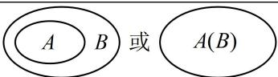</td></tr><tr><td>真子集</td><td>集合A是集合B的子集,且集合B中至少有一个元素不在集合A中</td><td>A⊆B</td><td>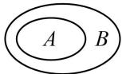</td></tr><tr><td>集合相等</td><td>集合A,B中的元素相同或集合A,B互为子集</td><td>A=B</td><td>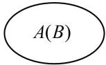</td></tr></table>

##### 3. 子集个数：含有 $n$ 个元素的集合的子集有 $2^{n}$ 个，非空子集有 $2^{n} - 1$ 个，真子集有 $2^{n} - 1$ 个，非空真子集有 $2^{n} - 2 (n \geq 1)$ 个.

##### 4. 集合的基本运算

<table><tr><td>运算</td><td>自然语言</td><td>符号语言</td><td>Venn图</td></tr><tr><td>并集</td><td>由所有属于集合A或属于集合B的元素组成的集合</td><td> $A \cup B = \{ x \mid x \in A \text{ 或 } x \in B \}$ </td><td>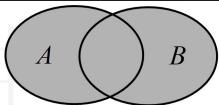</td></tr><tr><td>交集</td><td>由属于集合A且属于集合B的所有元素组成的集合</td><td> $A \cap B = \{ x \mid x \in A \text{ 且 } x \in B \}$ </td><td>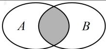</td></tr><tr><td>补集</td><td>由全集U中不属于集合A的所有元素组成的集合</td><td> $C_U A = \{ x \mid x \in U \text{ 且 } x \notin A \}$ </td><td>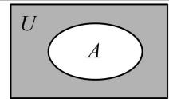</td></tr></table>

# 类型Ⅰ：集合的概念、集合中元素的性质

【例 1】设集合 $A=\{2,a^{2}-a+2,1-a\}$ ，若 $4\in A$ ，则 a 的值为 \_\_\_\_.

解析 $4 \in A$ 意味着 $A$ 中有元素 4，那谁是 4？ $a^{2} - a + 2$ 和 $1 - a$ 都有可能，可先由此分别求出 $a$ ，

因为 $4 \in A$ ，所以 $a^2 - a + 2 = 4$ 或 $1 - a = 4$ ，解得： $a = 2$ 或 $-1$ 或 $-3$ ；

上述三个解都可取吗？不一定，还需代回去检验集合 $A$ 是否满足元素互异，

当 $a = 2$ 时， $A = \{2,4, - 1\}$ ，满足题意；当 $a = -1$ 时， $1 - a = 2$ ，不满足元素互异，舍去；

当 $a = -3$ 时， $A = \{2,14,4\}$ ，满足题意；综上所述， $a$ 的值为 2 或 -3。

答案: 2 或 -3

【反思】如果集合中元素含参，我们在求出参数后，请务必检验是否满足集合中元素的互异性，这类问题在后面还会看到.

# 类型Ⅱ：根据集合相等求参

##### 【例2】已知集合 $A = \{a,b,1\}$ ， $B = \{-1,2,a^2\}$ ，若 $A = B$ ，则 $a^b = (\quad)$

$\quad$A. 1 
$\quad$B. $\frac{1}{2}$ 
$\quad$C. -1 
$\quad$D. 1或 $\frac{1}{2}$

解析集合 $B$ 中只有1个待定元素 $a^2$ ，故先考虑它是集合 $A$ 中的谁，观察发现只能是1，

因为 $1 \in A$ ，且 $A = B$ ，所以 $1 \in B$ ，故 $a^2 = 1$ ，解得： $a = \pm 1$ ，

求出两个值，还需检验是否满足元素互异，当 $a = 1$ 时，集合 $A$ 中有相同元素，舍去，所以 $a = -1$ 此时 $A = \{-1, b, 1\}$ ， $B = \{-1, 2, 1\}$ ，对比可得 $b = 2$ ，所以 $a^b = (-1)^2 = 1$ 。

答案: A

##### 【变式】已知集合 $A = \{x\in \mathbf{R}\mid x^2 +ax + 1 = 0\}$ ， $B = \{x\in \mathbf{R}\mid x^2 +2x - a + 3 = 0\}$ ，若 $A = B$ ，则实数 $a$ 的取值范围是

解析 $A, B$ 都是一元二次方程的解集， $A = B$ 意味着两个方程同解，先考虑它们都无解的情况，

若 $A = B = \emptyset$ ，则 $\left\{ \begin{array}{l} \Delta_1 = a^2 - 4 < 0 \\ \Delta_2 = 2^2 - 4(-a + 3) < 0 \end{array} \right.$ ，解得： $-2 < a < 2$ ；

再考虑 $A$ ， $B$ 不是空集的情形，此时两个一元二次方程应同解，直接算出解显然偏麻烦，所以考虑由韦达定理建立方程求 $a$ ，若 $A = B \neq \emptyset$ ，设方程 $x^{2} + ax + 1 = 0$ 和 $x^{2} + 2x - a + 3 = 0$ 的解分别为 $x_{1}$ ， $x_{2}$

则首先应有 $\left\{ \begin{array}{l} \Delta_1 = a^2 - 4 \geq 0 \\ \Delta_2 = 2^2 - 4(-a + 3) \geq 0 \end{array} \right.$ ，解得： $a \geq 2$ ，其次，由韦达定理， $\left\{ \begin{array}{l} x_1 + x_2 = -a = -2 \\ x_1x_2 = 1 = -a + 3 \end{array} \right.$ ，

解得： $a = 2$ ，满足 $a\geq 2$ ；综上所述，实数 $a$ 的取值范围是 $(-2,2]$

答案: $(-2, 2]$

【反思】在分析含参方程的解集时，一定要考虑无解的情况，此时对应集合为空集，且空集是可能满足题意的.

# 类型III：根据集合间的包含关系求参

【例 3】若集合 $A = \{1,2,3,m\}$ , $B = \{2,3,m^{2}\}$ , 若 $B \subseteq A$ , 则实数 $m$ 的值为 \_\_\_\_.

解析集合 $B$ 中 2, 3 这两个元素 $A$ 中已经有了，故只需考虑元素 $m^2$ 是 $A$ 中的谁即可，

因为 $B \subseteq A$ 且 $m^2 \in B$ ，所以 $m^2 \in A$ ，故 $m^2 = 1$ 或 $m^2 = m$ ，解得： $m = -1, 1$ 或 $0$

别忘了检验是否满足集合中元素互异，经检验，当 $m = 1$ 时，集合 $A$ 中有相同元素，舍去；

当 $m = -1$ 或0时，集合 $A, B$ 均满足元素互异；所以实数 $m$ 的值为-1或0.

答案: -1 或 0

##### 【变式】设 $A = \{x \mid x < -1 \text{ 或 } x \geq 3\}$ ， $B = \{x \mid ax + 1 \leq 0\}$ ，若 $B \subseteq A$ ，则实数 $a$ 的取值范围是 \_\_\_\_.

解析先解 $B$ 中的不等式 $ax + 1 \leq 0$ ，再通过数轴分析 $A$ 和 $B$ 的包含关系会比较直观，解此不等式可能要两端同除以 $a$ ，需先讨论 $a$ 的正负，

当 $a = 0$ 时，不等式 $ax + 1 \leq 0$ 无解，所以 $B = \emptyset$ ，满足 $B \subseteq A$ ；

当 $a > 0$ 时，由 $ax + 1 \leq 0$ 可得 $x \leq -\frac{1}{a}$ ，所以 $B = \left(-\infty, -\frac{1}{a}\right]$ ，

要分析怎样能使 $B \subseteq A$ ，可画数轴来看，注意单独考虑端点能否重合，

$B \subseteq A$ 的情形如图1，应有 $-\frac{1}{a} < -1$ ，解得： $0 < a < 1$

当 $a < 0$ 时，由 $ax + 1 \leq 0$ 得 $x \geq -\frac{1}{a} \Rightarrow B = \left[-\frac{1}{a}, +\infty\right)$ ， $B \subseteq A$ 的情形如图2，应有 $-\frac{1}{a} \geq 3$ ，故 $-\frac{1}{3} \leq a < 0$ ；

综上所述，实数 $a$ 的取值范围是 $\left[-\frac{1}{3}, 1\right)$ .

答案 $\left[-\frac{1}{3},1\right)$

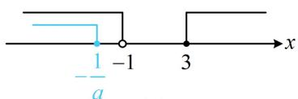

图1

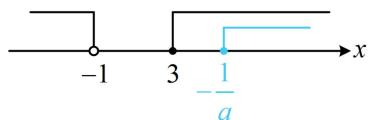

图2

【总结】分析列举法表示的集合间的包含关系，对比两个集合中的元素即可；而对于连续取值的集合间的包含关系，常画数轴分析，需重点关注端点能否重合；另外，当子集含参时，一定注意讨论子集为空集的情况.

# 类型IV：子集个数

【例 4】若集合 $A=\{1,2,3\}$ ，集合 $B=\{(x,y)\mid x\in A,y\in A,\left|x-y\right|\in A\}$ ，则 B 的子集个数为 \_\_\_\_.

解析求子集个数，需先求集合中元素的个数，观察发现 $x, y$ 各自都只有3种取值，可列表来看，

<table><tr><td>x</td><td>1</td><td>1</td><td>1</td><td>2</td><td>2</td><td>2</td><td>3</td><td>3</td><td>3</td></tr><tr><td>y</td><td>1</td><td>2</td><td>3</td><td>1</td><td>2</td><td>3</td><td>1</td><td>2</td><td>3</td></tr><tr><td> $|x-y|$ </td><td>0</td><td>1</td><td>2</td><td>1</td><td>0</td><td>1</td><td>2</td><td>1</td><td>0</td></tr></table>

由上表可知集合 B 的元素有 $(1,2)$ ， $(1,3)$ ， $(2,1)$ ， $(2,3)$ ， $(3,1)$ ， $(3,2)$ ，共 6 个，故 B 的子集有 $2^{6}=64$ 个.

答案64

【总结】求集合的子集个数，需先分析集合中有几个元素，再代结论即可（见内容提要第3点）.

# 类型V：集合的基本运算

【例 5】（2022·浙江卷）设集合 $A=\{1,2\}$ ， $B=\{2,4,6\}$ ，则 $A \cup B = (\quad)$

$\quad$A. $\{2\}$

$\quad$B. $\{1,2\}$

$\quad$C. $\{2,4,6\}$

$\quad$D. $\{1,2,4,6\}$

解析求并集，把两集合的元素合在一起即可，需注意相同元素只计一次，由题意， $A \cup B = \{1, 2, 4, 6\}$ .

答案: D

##### 【变式】已知集合 $A = \{x \mid a - 2 < x < a + 3\}$ ， $B = \{x \mid x^2 - 5x + 4 > 0\}$ ，若 $A \cup B = \mathbf{R}$ ，则 $a$ 的取值范围是（）

$\quad$A. $(- \infty, 1)$

$\quad$B. (1,3)

$\quad$C. [1,3]

$\quad$D. $[3, +\infty)$

解析 $x^{2} - 5x + 4 > 0\Leftrightarrow (x - 1)(x - 4) > 0\Leftrightarrow x <   1$ 或 $x > 4$ ，所以 $B = (-\infty ,1)\bigcup (4, + \infty)$

分析连续取值集合的集合关系，常画数轴来看，其中端点能否重合需重点关注，

如图，要使 $A \cup B = \mathbf{R}$ ， $a - 2$ 与1， $a + 3$ 与4都不能重合，否则并集就取不到端点处的元素，

所以应有 $\left\{ \begin{array}{l}a - 2 <   1\\ a + 3 > 4 \end{array} \right.$ ，解得： $1 <   a <   3$ ，故 $a$ 的取值范围是(1,3).

答案: B

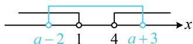

【反思】对于连续取值的集合的包含关系或交并补运算，一般优先考虑画数轴分析，需要尤其注意端点取值哦.

##### 【例6】（2022·新高考I卷）若集合 $M = \{x\mid \sqrt{x} < 4\}$ ， $N = \{x\mid 3x\geq 1\}$ ，则 $M\cap N =$ （

$\quad$A. $\{x\mid 0\leq x <   2\}$

$\quad$B. $\left\{x\mid \frac{1}{3}\leq x <   2\right\}$

$\quad$C. $\{x\mid 3\leq x <   16\}$

$\quad$D. $\left\{x\left|\frac{1}{3} \leq x < 16\right.\right\}$

解析 $\sqrt{x} < 4\Leftrightarrow 0\leq x < 16$ ，所以 $M = \{x\mid 0\leq x <   16\}$ ， $3x\geq 1\Leftrightarrow x\geq \frac{1}{3}$ ，所以 $N = \left\{x\Big|x\geq \frac{1}{3}\right\}$

求连续取值的集合的交集，可画数轴来看，如图， $M\cap N = \left\{x\left|\frac{1}{3}\leq x <   16\right.\right\} .$

答案: D

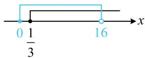

##### 【变式】已知集合 $A = \{x \mid x^2 - x - 2 \leq 0\}$ ， $B = \{x \mid 2a < x < a^2\}$ ，若 $A \cap B = \varnothing$ ，则实数 $a$ 的取值范围是 \_\_\_\_.

解析 $x^{2} - x - 2\leq 0\Leftrightarrow (x + 1)(x - 2)\leq 0\Leftrightarrow -1\leq x\leq 2$ ，所以 $A = [-1,2]$

怎样能使 $A \cap B = \emptyset$ ？观察发现集合 $B$ 的左右端点含参，大小不定，可能为空集，先讨论这种情况，

当 $B = \emptyset$ 时， $2a \geq a^2$ ，解得： $0 \leq a \leq 2$ ，此时满足 $A \cap B = \emptyset$ ；

再考虑 B 非空的情形，此时可画数轴来看，当 $B \neq \varnothing$ 时，首先应有 $2a < a^{2}$ ，解得：a < 0 或 a > 2 ①；

其次，图形应为图1或图2所示的情形，若为图1，则 $a^{2} \leq -1$ ，无解；

若为图2，则 $2a \geq 2$ ，解得： $a \geq 1$ ，结合①可得a > 2；

综上所述，实数 $a$ 的取值范围是 $[0, +\infty)$ 。

答案: $[0, +\infty)$

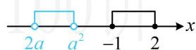  
图1

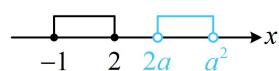  
图2

【反思】根据交集为空集求参，一定要考虑含参集合本身为空集的情况.

【例 7】(2023·全国甲卷) 设集合 $A = \{x \mid x = 3k + 1, k \in \mathbf{Z}\}$ , $B = \{x \mid x = 3k + 2, k \in \mathbf{Z}\}$ , $U$ 为整数集, 则 $\complement_U(A \cup B) = (\quad)$

$\quad$A. $\{x\mid x = 3k,k\in \mathbf{Z}\}$

$\quad$B. $\{x\mid x = 3k - 1,k\in \mathbf{Z}\}$

$\quad$C. $\{x\mid x = 3k - 2,k\in \mathbf{Z}\}$

$\quad$D. $\varnothing$

【解法1】 $A\bigcup B = \{x|x = 3k + 1$ 或 $x = 3k + 2,k\in \mathbf{Z}\}$ ，所以它包括除以3后余数为1或2的整数，

整数除以3余数只能是0，1，2，所以取补集后剩余的即为余数为0的，故 $\complement_U(A \cup B) = \{x \mid x = 3k, k \in \mathbf{Z}\}$ .

【解法2】若想象不出 $\complement_U(A\cup B)$ 中的元素有哪些，也可通过罗列部分元素来观察规律，小题可用此技巧，由题意，集合 $A = \{\dots , - 5, - 2,1,4,7,\dots \}$ ，集合 $B = \{\dots , - 4, - 1,2,5,8,\dots \}$

所以 $A \cup B = \{\cdots, -5, -4, -2, -1, 1, 2, 4, 5, 7, 8, \cdots\}$ ，故 $\complement_{U}(A \cup B) = \{\cdots, -3, 0, 3, 6, \cdots\} = \{x \mid x = 3k, k \in \mathbf{Z}\}$ .

答案: A

##### 【变式】若全集 $U = \mathbf{R}$ , 集合 $A = \{x \mid x^2 - (2m + 1)x + m^2 + m < 0\}$ , 集合 $B = \{x \mid -2 < x < 1\}$ , 若集合 $(C_U A) \cap B$ 中有且仅有 1 个整数, 则实数 $m$ 的取值范围是 \_\_\_\_.

解法 1: $x^{2} - (2m + 1)x + m^{2} + m < 0 \Leftrightarrow (x - m)(x - m - 1) < 0 \Leftrightarrow m < x < m + 1$ ,

所以 $A = (m, m + 1)$ ，故 $\complement_U A = (-\infty, m] \cup [m + 1, +\infty)$ ，

再分析 $C_U A$ 与 $B$ 的交集，可画数轴来看，尤其需要关注端点能否重合，

要使 $(\complement_U A) \cap B$ 中有且仅有1个整数，则可能的情形如图1和图2所示，

若为图1， $m$ 不能与-1，0重合，否则交集中有2个整数，所以 $-1 < m < 0 < m + 1 < 1$ ，故 $-1 < m < 0$

若为图2， $m$ 不能与-2，-1重合，否则交集中有2个整数，所以 $-2 < m < -1 < m + 1 < 0$ ，故 $-2 < m < -1$

综上所述，实数 $m$ 的取值范围是 $(-2, -1) \cup (-1, 0)$ .

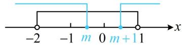  
图1

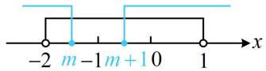  
图2

【解法2】求出 $\complement_U A = (-\infty, m] \cup [m + 1, +\infty)$ 后，由于 $B$ 中的整数只有-1，0，故也可讨论它们谁在 $\complement_U A$ 中，

若 $\left\{ \begin{array}{l} -1 \in \complement_U A \\ 0 \notin \complement_U A \end{array} \right.$ ，则 $\left\{ \begin{array}{l} -1 \leq m \text{或} -1 \geq m + 1 \\ m < 0 < m + 1 \end{array} \right.$ ，解得： $-1 < m < 0$ ；

若 $\left\{ \begin{array}{l} -1 \notin \complement_U A \\ 0 \in \complement_U A \end{array} \right.$ ，则 $\left\{ \begin{array}{l} m < -1 < m + 1 \\ 0 \leq m \text{或} 0 \geq m + 1 \end{array} \right.$ ，解得： $-2 < m < -1$ ；

综上所述，实数 $m$ 的取值范围是 $(-2, -1) \cup (-1, 0)$ .

答案: $(-2, - 1)\cup (-1,0)$

【总结】从上面两道题可以看出，分析列举法表示的集合的并集、交集、补集，直接从元素来看即可；而对于连续取值的集合，则常画数轴来分析，且往往需要重点关注端点.

# 类型VI: Venn 图

##### 【例8】设集合 $U = \{1,2,3,4,5\}$ ，若 $(\complement_U A) \cup (\complement_U B) = \{1,2,3\}$ ，则 $A \cap B =$ （ ）

$\quad$A. $\{4,5\}$

$\quad$B. $\{3,4,5\}$

$\quad$C. $\{1,2,5\}$

$\quad$D. $\{5\}$

解析直接由 $(\complement_U A) \cup (\complement_U B) = \{1, 2, 3\}$ 分析 $A$ ， $B$ 的情况比较抽象，这时常考虑画 Venn 图来观察，

如图， $(\complement_U A) \cup (\complement_U B)$ 表示在全集 $U$ 中，把 $A \cap B$ 的部分去掉，余下的部分，即 $(\complement_U A) \cup (\complement_U B) = \complement_U (A \cap B)$ ，因为 $(\complement_U A) \cup (\complement_U B) = \{1, 2, 3\}$ ，所以 $\complement_U (A \cap B) = \{1, 2, 3\}$ ，故 $A \cap B = \{4, 5\}$ .

答案: A

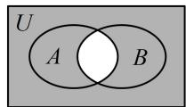

【反思】当集合间的运算较抽象时，不妨画 Venn 图来分析，往往可使问题明朗化.

【例 9】学校举办运动会时, 高一 1 班共有 28 名同学参加比赛, 有 15 人参加游泳比赛, 8 人参加田径比赛, 14 人参加球类比赛, 同时参加游泳和田径比赛的有 3 人, 同时参加游泳和球类比赛的有 3 人, 没有人同时参加三项比赛, 那么只参加游泳一项比赛的有\_\_\_\_人; 同时参加田径和球类比赛的有\_\_\_\_人.

解析题干的信息较复杂，不妨画出图形，并根据题意把各部分的人数标注出来，

如图, 图中的 15, 14, 8 是参加三项运动各自的总人数, 所以只参加游泳一项比赛的有 $15 - 3 - 3 = 9$ 人; 再求同时参加田径和球类比赛的人数, 观察图形发现只有这部分不知道了, 于是只需将其设为 $x$ , 就能表示出图中各小块的人数, 由共 28 人参赛来建立方程求 $x$ ,

由图可知只参加田径比赛的有 $8 - 3 - x = 5 - x$ 人，

只参加球类比赛的有 $14 - 3 - x = 11 - x$ 人，

所以 $9 + (5 - x) + (11 - x) + 3 + 3 + x = 28$ ，解得： $x = 3$

故同时参加田径和球类比赛的有3人.

答案9；3

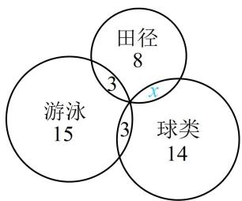

【反思】涉及多个集合关系的文字题目中，常常通过画图将文字信息直观地呈现出来，使问题明朗化.

# 类型VII：集合综合题

【例 10】在数学漫长的发展过程中, 数学家发现在数学中存在着神秘的 “黑洞” 现象. 数学黑洞: 无论怎样设值, 最终都将得到固定的一个值, 再也跳不出去, 就像宇宙中的黑洞一样. 目前已发现的数字黑洞有 “123 黑洞”、“卡普雷卡尔黑洞”、“自恋性数字黑洞” 等. 定义: 若一个 $n$ 位正整数的所有数位上数字的 $n$ 次方和等于这个数本身, 则称这个数是自恋数. 已知所有一位正整数的自恋数组成集合 $A$ , 集合 $B = \{x \mid -3 < x < 4, x \in \mathbf{Z}\}$ , 则 $A \cap B$ 的子集个数为 ( )

$\quad$A. 3 
$\quad$B. 4 
$\quad$C. 7 
$\quad$D. 8

解析已知 $B$ ，求 $A \cap B$ 只差 $A$ ，而求 $A$ 需从题干的信息弄懂什么是一位正整数自恋数，

一位正整数有 1, 2, 3, …, 9，它们都满足所有数位上数字的 1 次方和等于这个数本身，

所以它们都是自恋数，故 $A = \{1,2,3,4,5,6,7,8,9\}$ ，又 $B = \{x \mid -3 < x < 4, x \in \mathbf{Z}\} = \{-2, -1,0,1,2,3\}$ ，

所以 $A \cap B = \{1, 2, 3\}$ ，故 $A \cap B$ 的子集个数为 $2^3 = 8$ .

答案: D

##### 【例11】设 $x_{1}, x_{2}, x_{3}, x_{4} \in \mathbf{R}$ ，集合 $A = \{x_{i}x_{j} \mid 1 \leq i < j \leq 4$ 且 $i, j \in \mathbf{N}\}$ ，若 $A = \left\{-18, -3, -1, -\frac{1}{6}, \frac{1}{2}, 6\right\}$ ，则 $x_{1}x_{2}x_{3}x_{4} =$ \_\_\_\_.

解析直接观察集合 $\{x_{i}x_{j}|1\leq i < j\leq 4$ 且 $i,j\in \mathbf{N}\}$ 中的元素显然较困难，所以我们不妨按 $i,j$ 的可能取值将其所有元素都罗列出来，再分析怎么算 $x_{1}x_{2}x_{3}x_{4}$ ，由题意，集合 $A$ 中的元素 $x_{i}x_{j}$ 所有可能的情况如下表：

<table><tr><td>i</td><td>1</td><td>1</td><td>1</td><td>2</td><td>2</td><td>3</td></tr><tr><td>j</td><td>2</td><td>3</td><td>4</td><td>3</td><td>4</td><td>4</td></tr><tr><td> $x_{i}x_{j}$ </td><td> $x_{1}x_{2}$ </td><td> $x_{1}x_{3}$ </td><td> $x_{1}x_{4}$ </td><td> $x_{2}x_{3}$ </td><td> $x_{2}x_{4}$ </td><td> $x_{3}x_{4}$ </td></tr></table>

由所给条件知集合 $A$ 中有6个元素，所以上表中所列的 $x_{i}x_{j}$ 的6种情况即为该6个元素，

分析上表中的 $x_{i}x_{j}$ 与所给6个元素是如何对应的显然偏麻烦，但考虑到要求的是 $x_{1}x_{2}x_{3}x_{4}$ ，观察发现只要将上表 $x_{i}x_{j}$ 全部相乘，就可以出现目标式，因为集合 $A = \left\{-18, -3, -1, -\frac{1}{6}, \frac{1}{2}, 6\right\}$ ，

所以 $(x_{1}x_{2})\cdot (x_{1}x_{3})\cdot (x_{1}x_{4})\cdot (x_{2}x_{3})\cdot (x_{2}x_{4})\cdot (x_{3}x_{4}) = (x_{1}x_{2}x_{3}x_{4})^{3} = -18\times (-3)\times (-1)\times \left(-\frac{1}{6}\right)\times \frac{1}{2}\times 6 = 27$ ，故 $x_{1}x_{2}x_{3}x_{4} = 3$

答案3

##### 【例12】设 $S$ 为实数集 $\mathbf{R}$ 上的非空子集，若对任意的 $x, y \in S$ ，都有 $x + y$ ， $x - y$ ， $xy \in S$ ，则称 $S$ 为封闭集。下面是关于封闭集的4个判断：

①自然数集 $\mathbf{N}$ 为封闭集；  
②整数集 $\mathbf{Z}$ 为封闭集;  
③若 $S$ 为封闭集，则一定有 $0 \in S$ ;  
④封闭集一定是无限集.

其中正确的判断是（）

$\quad$A. ②③

$\quad$B. ②④

$\quad$C. ③④

$\quad$D. ①②

解析①项，自然数之差不一定是自然数，所以结合封闭集的定义知N不是封闭集，下面举个反例，因为 $2\in N$ ， $3\in N$ ，但 $2-3=-1\notin N$ ，所以自然数集N不是封闭集，故①项错误；

②项，对任意的 $x, y \in \mathbf{Z}$ ， $x + y$ ， $x - y$ ， $xy$ 都为整数，所以整数集 $\mathbf{Z}$ 是封闭集，故②项正确；  
③项，要判断 $0 \in S$ 是否正确，可尝试结合已知条件构造出0，观察发现由 $x - y \in S$ 容易产生0，若 $S$ 为封闭集，取 $x = y \in S$ ，则 $x - y = 0 \in S$ ，故③项正确；

④项，正面推证结论不易，尝试寻找反例，受③的启发，我们考虑只有0的单元素集合，

设 $S = \{0\}$ ，则对任意的 $x, y \in S$ ，必有 $x = y = 0$ ，此时， $x + y = x - y = xy = 0 \in S$

所以 S 为封闭集，但 S 不是无限集，故④项错误.

答案: A

【反思】集合综合题千变万化，各种新定义层出不穷，我们主要通过上述3道题，让大家简单体悟它的分析思路.

# 强化训练

##### 1. (2025·全国Ⅱ卷·★)

已知集合 $A = \{-4,0,1,2,8\}$ ， $B = \{x\mid x^3 = x\}$ ，则 $A\cap B =$ （

$\quad$A. $\{0,1,2\}$

$\quad$B. $\{1,2,8\}$

$\quad$C. $\{2,8\}$

$\quad$D. $\{0,1\}$

##### 2. (2024·江西模拟·★)

已知集合 $A = \{-1, a^2 - 2a + 1, a - 4\}$ ，若 $4 \in A$ ，则 $a$ 的值可能为（）

$\quad$A. -1, 3

$\quad$B. -1

$\quad$C. -1, 3, 8

$\quad$D. -1, 8

##### 3. (2025·四川内江模拟·★★)

已知实数集合 $A = \{1, a, b\}$ ， $B = \{a^2, a, ab\}$ ，若

$A = B$ ，则 $a^{2025} + b^{2025} =$ （

$\quad$A. -1

$\quad$B. 0

$\quad$C. 1

$\quad$D. 2

##### 4. (2024·九省联考·★)

已知集合 $A = \{-2,0,2,4\}$ ， $B = \{x\mid |x - 3|\leq m\}$ ，若

$A \cap B = A$ ，则 m 的最小值为 \_\_\_\_.

##### 5.（2024·重庆模拟·★☆）（多选）

已知全集 $U = \mathbf{Z}$ ，集合 $A = \{1,2,3\}$ ， $B = \{a + b$

$|a,b\in A\}$ ，则下列结论正确的是（）

$\quad$A. 集合 $B$ 中有 6 个元素

$\quad$B. $A \cup B = \{1, 2, 3, 4, 5, 6\}$

$\quad$C. $(\complement_U A) \cap B = \{4, 5, 6\}$

$\quad$D. $A \cap B$ 的真子集个数是 3

##### 6. (2024·浙江绍兴模拟·★★)

若集合 $A = \{x\mid x^2 +mx\leq 0\}$ ， $B = \left\{-\frac{1}{3},m - 1\right\}$ ，且 $A\cap B$ 有4个子集，则实数 $m$ 的最小值是

##### 7. (2024·新课标Ⅰ卷·★)

已知集合 $A = \{x\mid -5 <   x^3 <  5\} ,B = \{-3, - 1,0,2,3\}$ ，则 $A\cap B =$ （

$\quad$A. $\{-1,0\}$

$\quad$B. $\{2,3\}$

$\quad$C. $\{-3, -1, 0\}$

$\quad$D. $\{-1,0,2\}$

##### 8. (2021·全国乙卷·★☆)

已知集合 $S = \{s\mid s = 2n + 1,n\in \mathbf{Z}\}$ ， $T = \{t\mid t = 4n + 1,$

$n\in \mathbf{Z}\}$ ，则 $S\cap T =$ （

$\quad$A. $\varnothing$

$\quad$B. $S$

$\quad$C. $T$

$\quad$D. Z

##### 9. (2023·福建模拟·★★)

已知全集 $U = \mathbf{R}$ ，集合 $A = \{x\mid |x - 1|\leq 1\}$

$B = \left\{x\left|\frac{x - 4}{x - 1} >0\right.\right\}$ ，则 $A\cap (\complement_UB) =$ （）

$\quad$A. [1,2]

$\quad$B. (1,2)

$\quad$C. $[0,1)$

$\quad$D. (1,2]

##### 10. (2024·全国甲卷·★★)

集合 $A = \{1,2,3,4,5,9\}$ ， $B = \{x|\sqrt{x}\in A\}$ ，则 $\complement_A(A\cap$

$B) = (\quad)$

$\quad$A. $\{1,4,9\}$

$\quad$B. $\{3,4,9\}$

$\quad$C. $\{1,2,3\}$

$\quad$D. $\{2,3,5\}$

##### 11.（2023·江苏苏州模拟·★★☆）

已知 $f(x) = \sqrt{x^2 - 1}$ 的定义域为 $A$ ，集合 $B = \{x \in \mathbf{R} \mid 1 < ax < 2\}$ ，若 $B \subseteq A$ ，则实数 $a$ 的取值范围是（）

$\quad$A. $[-2,1]$   
$\quad$B. $[-1, 1]$   
$\quad$C. $(- \infty, -2] \cup [1, +\infty)$   
$\quad$D. $(- \infty, -1] \cup [1, +\infty)$

##### 12. (2023·江苏扬州期末·★★★)

已知集合 $A = \left\{x\left|\frac{4 - x}{x + 1}\geq 0\right.\right\} ,B = \{x\mid x^2 -(a + 1)^2 x +$

$2a(a^{2} + 1) < 0\}$ ，若 $A \cap B = \varnothing$ ，则实数 $a$ 的取值范围是（）

$\quad$A. $(2, +\infty)$

$\quad$B. $\{1\} \cup (2, +\infty)$

$\quad$C. $\{1\} \cup [2, +\infty)$

$\quad$D. $[2, +\infty)$

##### 13.（2024·江苏南通模拟·★★）

已知 $M, N$ 为集合 $I$ 的非空真子集，且 $M, N$ 不相等，若 $N \cap (\complement_I M) = \emptyset$ ，则 $M \cup N = (\quad)$

$\quad$A. $M$

$\quad$B. $N$

$\quad$C. $I$

$\quad$D. $\varnothing$

##### 14. (2023·广东广州一模·★★)

已知集合 $M = \{x \mid x(x - 2) < 0\}$ ， $N = \{x \mid x - 1 < 0\}$ ，则下列Venn图中，阴影部分可以表示集合 $\{x \mid 1 \leq x < 2\}$ 的是（）

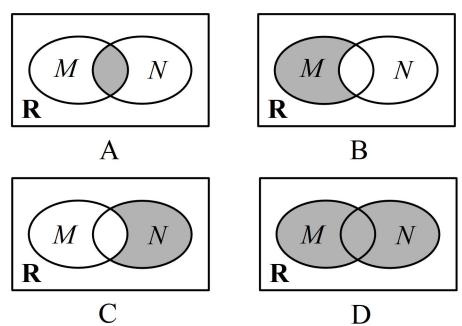

##### 15. (2023·重庆模拟·★★)

某班有 40 名同学参加数学、物理、化学课外研究小组, 每名同学至多参加两个小组. 已知参加数学、物理、化学小组的人数分别为 26、15、13, 同时参加数学和化学小组的有 6 人, 同时参加物理和化学小组的有 4 人, 则同时参加数学和物理小组的人数为 \_\_\_\_.

##### 16. (2024·江苏泰州2月调研·★★☆)

已知集合 $A = \{(x,y) | x + y = 2\}$ ， $B = \{(x,y) | (x - 1)^2$

$+y^{2}=1\}$ ，则 $A \cap B$ 中元素的个数为 \_\_\_\_.

##### 17. (2025·陕西模拟·★★★)

给定数集 $M$ ，若对于任意 $a, b \in M$ ，有 $a + b \in M$ ，且 $a - b \in M$ ，则称集合 $M$ 为闭集合，则下列说法中正确的是（）

$\quad$A. 自然数集是闭集合  
$\quad$B. 无理数集是闭集合  
$\quad$C. 集合 $M = \{x \mid x = 3k, k \in \mathbf{Z}\}$ 为闭集合  
$\quad$D. 若集合 $M_{1}$ , $M_{2}$ 为闭集合, 则 $M_{1} \cup M_{2}$ 为闭集合

##### 18. (2022·江苏南京模拟·★★★☆)

对于集合 $A$ ， $B$ ，我们把集合 $\{(a,b)\mid a\in A,b\in B\}$ 记作 $A\times B$ ．例如， $A = \{1,2\}$ ， $B = \{3,4\}$ ， $C = \{1,3\}$ ，则 $A\times B = \{(1,3),(1,4),(2,3),(2,4)\}$ ， $A\times C = \{(1,1),$

(1,3),(2,1),(2,3)}. 现已知 $M = \{0,1,2,3,4,5,6,7,8,9\}$ , 集合 $A, B$ 是 $M$ 的子集, 且当 $(a,b) \in A \times B$ 时, $(b,a) \notin A \times B$ , 则 $A \times B$ 内的元素最多有 ( ) 个.

$\quad$A. 20 
$\quad$B. 25 
$\quad$C. 50 
$\quad$D. 75

