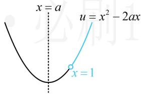

# 强化训练

##### 1. (2023·湖北模拟·★★)

设 $a, b$ 是实数，则“ $a > |b|$ ”是“ $\ln (a^2 + 1) >$

$\ln (b^{2} + 1)$ ”的（）

$\quad$A. 充分不必要条件  
$\quad$B. 必要不充分条件  
$\quad$C. 充分必要条件  
$\quad$D. 既不充分也不必要条件

##### 1. A

解析观察发现 $\ln (a^2 + 1) > \ln (b^2 + 1)$ 左右同底，故可化简，不妨将其化简，再判断它与 $a > |b|$ 的关系，

$\ln (a ^ {2} + 1) > \ln (b ^ {2} + 1) \Leftrightarrow a ^ {2} + 1 > b ^ {2} + 1 \Leftrightarrow a ^ {2} > b ^ {2} \Leftrightarrow | a | > | b |,$

所以问题等价于判断 $a > |b|$ 是 $\left|a\right| > \left|b\right|$ 的什么条件，

当 $a > |b|$ 时，由于 $|a| \geq a$ ，所以 $|a| > |b|$ ，充分性成立；

当 $|a|>|b|$ 时， $a>|b|$ 不一定成立，

##### 例如，取 $a = -2$ ， $b = -1$ ，满足 $\left|a\right| > \left|b\right|$ ，但 $a < \left|b\right|$

所以必要性不成立，故选A.

##### 2. (2024·全国甲卷·★★)

设向量 $\boldsymbol{a}=(x+1,x)$ ， $\boldsymbol{b}=(x,2)$ ，则（）

$\quad$A. “x = -3” 是 “ $a \perp b$ ” 的必要条件  
$\quad$B. “x = -3” 是 “a // b” 的必要条件  
$\quad$C. “ $x = 0$ ”是“ $\pmb{a} \perp \pmb{b}$ ”的充分条件   
$\quad$D. “ $x = -1 + \sqrt{3}$ ” 是 “ $a // b$ ” 的充分条件

##### 2. C

解析选项涉及的不外乎向量的平行与垂直，可考虑先根据 $a$ ， $b$ 平行、垂直分别求出 $x$ ，再判断选项，

$a \perp b \Leftrightarrow a \cdot b = (x + 1)x + x \cdot 2 = x^2 + 3x = 0 \Leftrightarrow x = -3$ 或 0 ①,

$\boldsymbol {a} / / \boldsymbol {b} \Leftrightarrow (x + 1) \cdot 2 = x \cdot x \Leftrightarrow x ^ {2} - 2 x - 2 = 0 \Leftrightarrow x = 1 \pm \sqrt {3} \quad ②,$

A 项，由①可知 “x = -3” 是 “ $a \perp b$ ” 的充分不必要条件，必要性不成立，故 A 项错误；  
B项，由②可知“ $x = -3$ ”是“ $\mathbf{a} / / \mathbf{b}$ ”的既不充分也不必要条件，必要性不成立，故B项错误；   
C项，由①可知“ $x = 0$ ”是“ $\pmb{a}\bot \pmb{b}$ ”的充分不必要条件，充分性成立，故C项正确；   
D 项，由②可知 “ $x = -1 + \sqrt{3}$ ” 是 “a // b” 的既不充分也不必要条件，充分性不成立，故 D 项错误.

##### 3. (2023·全国甲卷·★★)

“ $\sin^2\alpha +\sin^2\beta = 1$ ”是“ $\sin \alpha +\cos \beta = 0$ ”的（）

$\quad$A. 充分条件但不是必要条件  
$\quad$B. 必要条件但不是充分条件  
$\quad$C. 充要条件  
$\quad$D. 既不是充分条件也不是必要条件

##### 3. B

解析对比两式发现，将 $\sin^2\beta$ 换成 $1 - \cos^2\beta$ ，可统一函数名，

$\sin^ {2} \alpha + \sin^ {2} \beta = 1 \Leftrightarrow \sin^ {2} \alpha = 1 - \sin^ {2} \beta \Leftrightarrow \sin^ {2} \alpha = \cos^ {2} \beta$

$\Leftrightarrow \sin \alpha = \pm \cos \beta \Leftrightarrow \sin \alpha \pm \cos \beta = 0,$

所以“ $\sin^2\alpha + \sin^2\beta = 1$ ”是“ $\sin \alpha + \cos \beta = 0$ ”的必要不充分条件.

##### 4. (2023·山东青岛模拟·★★)

设数列 $\{a_{n}\}$ 是等比数列，则“ $a_1 < a_3 < a_5$ ”是“数列 $\{a_{n}\}$ 是递增数列”的（）

$\quad$A. 充分不必要条件  
$\quad$B. 必要不充分条件  
$\quad$C. 充分必要条件  
$\quad$D. 既不充分也不必要条件

##### 4. B

解析公比为负的等比数列正负交替，所以单看奇数项，不能得出单调性，充分性肯定不成立，下面我们举个反例，取 $a_{n} = (-2)^{n - 1}$ ，满足 $\{a_{n}\}$ 是等比数列，

且 $a_1 = 1$ ， $a_3 = 4$ ， $a_5 = 16$ ，所以 $a_1 < a_3 < a_5$

但注意到 $\{a_{n}\}$ 的偶数项全部为负数，所以 $\{a_{n}\}$ 不是递增数列，例如 $a_1 > a_2$ ，故充分性不成立；

若 $\{a_{n}\}$ 是递增数列，则 $a_{1}<a_{2}<a_{3}<a_{4}<a_{5}<\cdots$

所以 $a_{1}<a_{3}<a_{5}$ ，从而必要性成立，故选 B.

##### 5. (2023·辽宁模拟·★★☆)

“对任意的 $x \in \mathbf{R}$ ，都有 $2kx^{2} + kx - \frac{3}{8} < 0$ ”的一个充分不必要条件是（）

$\quad$A. $-3 < k < 0$

$\quad$B. $-3 < k \leq 0$

$\quad$C. $-3 < k < 1$

$\quad$D. $k > - 3$

##### 5. A

解析可先求出充要条件，再选答案.由于所给不等式的平方项系数含字母，所以需讨论它为0的情形，

当 $k = 0$ 时， $2kx^{2} + kx - \frac{3}{8} < 0$ 即为 $-\frac{3}{8} < 0$ ，显然恒成立；

当 $k \neq 0$ 时，要使 $2kx^{2} + kx - \frac{3}{8} < 0$ 恒成立，

应有 $\left\{ \begin{array}{l} 2k < 0 \\ \Delta = k^2 - 4 \times 2k \times \left(-\frac{3}{8}\right) < 0 \end{array} \right.$ ，解得： $-3 < k < 0$ ；

综上所述， $2kx^{2} + kx - \frac{3}{8} < 0$ 对任意的 $x\in \mathbf{R}$ 恒成立的充要条件是 $-3 < k\leq 0$

让选的是充分不必要条件，应取上述范围的一个真子集，

因为 $(-3,0)\subsetneq (-3,0]$ ，所以选A.

##### 6. (2024·广东惠州二调·★★★)

若函数 $f(x) = \log_2(x^2 - 2ax)$ ， $a \in \mathbf{R}$ ，则“ $a \leq 0$ ”是“函数 $f(x)$ 在 $(1, +\infty)$ 上单调递增”的（）

$\quad$A. 充分不必要条件  
$\quad$B. 必要不充分条件  
$\quad$C. 充要条件

$\quad$D. 既不充分也不必要条件

##### 6. A

解析 $f(x)$ 由 $y=\log_{2}u$ 与 $u=x^{2}-2ax$ 复合而成，可由同增异减准则分析单调性，

外层的 $y=\log_{2}u$ 在 u 的范围内 $\nearrow$ ,

所以要使 $f(x)$ 在 $(1, +\infty)$ 上 $\nearrow$

则内层的 $u = x^{2} - 2ax$ 在 $(1, +\infty)$ 上 $\nearrow$ ，如图，应有 $a \leq 1$

所以 “ $a \leq 1$ ” 是 “ $f(x)$ 在 $(1, +\infty)$ 上 $\nearrow$ ” 的充要条件吗？不一定，还要考虑定义域的要求，

$f(x)$ 在 $(1, +\infty)$ 上 $\nearrow$ 隐含了 $f(x)$ 在 $(1, +\infty)$ 上有定义，

所以 $x^{2} - 2ax > 0$ 在 $(1, + \infty)$ 上恒成立，

在 $a \leq 1$ 的条件下， $u = x^2 - 2ax$ 在 $(1, +\infty)$ 上 $\nearrow$

所以只需 $1^{2} - 2a\cdot 1\geq 0$ ，解得： $a\leq \frac{1}{2}$

所以“ $f(x)$ 在 $(1, +\infty)$ 上 $\nearrow$ ”的充要条件是“ $a \leq \frac{1}{2}$ ”，

又 “ $a \leq 0$ ” 是 “ $a \leq \frac{1}{2}$ ” 的充分不必要条件，所以 “ $a \leq 0$ ” 是 “ $f(x)$ 在 $(1, +\infty)$ 上↗” 的充分不必要条件.

##### 7. (2024·新疆乌鲁木齐一模·★)

命题 “ $\exists x > 1, x > 2$ ” 的否定是（）

$\quad$A. $\exists x\leq 1$ ， $x > 2$   
$\quad$B. $\exists x\leq 1$ ， $x\leq 2$   
$\quad$C. $\forall x > 1, x \leq 2$   
$\quad$D. $\forall x > 1, x > 2$

##### 7. C

解析否定存在量词命题，先“存在”改“任意”，再否定结论，所给命题的否定是“ $\forall x > 1$ ， $x \leq 2$ ”.

##### 8. (2024·新课标II卷·★☆)

已知命题： $p:\forall x\in \mathbf{R}$ ， $\left|x + 1\right| > 1$ ，命题 $q:\exists x > 0$ ， $x^{3} = x$ ，则（）

$\quad$A. $p$ 和 $q$ 都是真命题  
$\quad$B. $\neg p$ 和 $q$ 都是真命题  
$\quad$C. $p$ 和 $\neg q$ 都是真命题  
$\quad$D. $\neg p$ 和 $\neg q$ 都是真命题

##### 8. B

解析对于命题 $p$ ，取 $x = 0$ 可得 $\left|x + 1\right| = \left|0 + 1\right| = 1$ ，不满足 $\left|x + 1\right| > 1$ ，所以 $p$ 为假命题， $\neg p$ 为真命题，

对于命题 $q$ ， $x^{3} = x\Leftrightarrow x^{3} - x = x(x^{2} - 1) = x(x + 1)(x - 1)$

$= 0 \Leftrightarrow x = 0$ 或-1或1，其中 $1 > 0$

所以命题 q 为真命题， $\neg q$ 为假命题，故选 B.

##### 9. (2022·广西玉林模拟·★★)

若命题 $p: \exists x \in \mathbf{R}$ , $x^2 + 2(a + 1)x + 1 < 0$ 是假命题, 则实数 $a$ 的取值范围是 \_\_\_\_.

##### 9. $[-2,0]$

解析命题 $p$ 为假命题，正面考虑不易，可从反面来看，

命题 $p$ 是假命题等价于其否定为真命题，

命题 p 的否定为 $\forall x \in R$ ， $x^{2} + 2(a + 1)x + 1 \geq 0$ ，

所以 $\Delta = 4(a + 1)^2 - 4 \leq 0$ ，解得： $-2 \leq a \leq 0$ 。

##### 10. (2022·河北承德模拟·★★★)

命题 $p: \exists x \in [-1, 1]$ ，使 $x^2 + 1 < a$ 成立；命题 $q: \forall x$

>0, $ax < x^2 + 1$ 恒成立. 若命题 $p$ 与 $q$ 有且只有一个为真命题, 则实数 $a$ 的取值范围是 \_\_\_\_.

##### 10. $(-∞,1]∪[2,+∞)$

解析 $p$ 与 $q$ 有且只有一个为真命题有 $p$ 假 $q$ 真、 $p$ 真 $q$ 假两种情况，分别讨论即可，

当 $p$ 为假命题， $q$ 为真命题时，其中 $p$ 为假命题等价于 $p$ 的否定“ $\forall x \in [-1, 1]$ ， $x^2 + 1 \geq a$ ”为真命题，

因为 $x^{2} + 1$ 在 $[-1,1]$ 上的最小值为1，所以 $a\leq 1$ ①，

对命题 $q$ ， $\forall x > 0$ ， $ax <   x^{2} + 1\Leftrightarrow a <   x + \frac{1}{x}$

因为 $x + \frac{1}{x} \geq 2\sqrt{x \cdot \frac{1}{x}} = 2$ ，当且仅当 $x = 1$ 时取等号，

所以 $\left(x + \frac{1}{x}\right)_{\min} = 2$ ，因为 $a <   x + \frac{1}{x}$ 对任意的 $x > 0$ 都成立，

所以 $a < 2$ ，结合①可得 $a \leq 1$

当 $p$ 为真命题， $q$ 为假命题时，无需重复计算，在上面 $p$ 为假， $q$ 为真的结果中各自取补集即可，

由前面的分析过程知 $p$ 为假命题时 $a \leq 1$

所以 p 为真命题时应有 a > 1 ②,

同理， $q$ 为真命题时， $a <   2$

所以 $q$ 为假命题时，应有 $a \geq 2$ ，结合②可得 $a \geq 2$

综上所述，实数 $a$ 的取值范围是 $(- \infty, 1] \cup [2, +\infty)$ .

