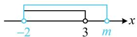

# 模块二 常用逻辑用语（★★）

# 内容提要

常用逻辑用语包括充分条件和必要条件、全称量词命题和存在量词命题两部分内容，有关考题由于涉及其它板块的知识，所以有一定的综合性，下面先归纳本节涉及到的一些知识点.

##### 1. 充分条件、必要条件的判断

<table><tr><td colspan="2">概念:命题“若p,则q”为真命题,则称p是q的充分条件,q是p的必要条件</td></tr><tr><td>p⇒q且q⇒p</td><td>p是q的充分不必要条件</td></tr><tr><td>p⇒q且q⇒p</td><td>p是q的必要不充分条件</td></tr><tr><td>p⇒q且q⇒p</td><td>p是q的充要条件,记作p⇔q</td></tr><tr><td>p⇒q且q⇒p</td><td>p是q的既不充分也不必要条件</td></tr></table>

##### 2. 集合角度看充分条件和必要条件：若 $A \subsetneq B$ ，则 $x \in A$ 是 $x \in B$ 的充分不必要条件。我们将这一结论简记为“小可推大，大不推小”。

##### 3. 含有一个量词的命题的否定:

①全称量词命题“ $\forall x \in M$ ， $p(x)$ ”的否定为“ $\exists x \in M$ ， $\neg p(x)$ ”.  
②存在量词命题 “ $\exists x \in M, p(x)$ ” 的否定为 “ $\forall x \in M, \neg p(x)$ ”.

##### 4. 命题及其否定的真假关系：命题 $p$ 与该命题的否定的真假性必定相反.

# 类型Ⅰ：判断充分条件、必要条件

【例 1】设 $x \in R$ ，则 “ $|x-1| < 1$ ” 是 “ $\frac{x+4}{x-5} < 0$ ” 的（）

$\quad$A. 充分不必要条件

$\quad$B. 必要不充分条件

$\quad$C. 充要条件

$\quad$D. 既不充分也不必要条件

解析所给的两个不等式都能解，先把不等式解出来再看，

由 $|x - 1| < 1$ 可得 $-1 < x - 1 < 1$ ，所以 $0 < x < 2$ ，由 $\frac{x + 4}{x - 5} < 0$ 可得 $(x + 4)(x - 5) < 0$ ，所以 $-4 < x < 5$

故问题等价于判断 “0 < x < 2” 是 “-4 < x < 5” 的什么条件，下面从充分性、必要性分别来看，

若 $0 < x < 2$ ，则必有 $-4 < x < 5$ ，所以充分性成立；

若 $-4 < x < 5$ ，则不一定有 $0 < x < 2$ ，例如， $x = -1$ 满足 $-4 < x < 5$ ，但不满足 $0 < x < 2$ ，故必要性不成立；

所以 “ $|x-1|<1$ ” 是 “ $\frac{x+4}{x-5}<0$ ” 的充分不必要条件.

答案: A

【反思】通过本题可得出一个重要结论：若 $A \subsetneq B$ ，则 $x \in A$ 是 $x \in B$ 的充分不必要条件，简称“小推大”。

##### 【变式1】若 $a, b$ 为非零实数，则“ $2^a > 2^b$ ”是“ $\ln a^2 > \ln b^2$ ”的（）

$\quad$A. 充分不必要条件

$\quad$B. 必要不充分条件

$\quad$C. 充要条件

$\quad$D. 既不充分也不必要条件

解析两个不等式虽不能解，但都能化简，为了便于判断充分性、必要性，先将它们化简再看，

$2 ^ {a} > 2 ^ {b} \Leftrightarrow a > b, \quad \ln a ^ {2} > \ln b ^ {2} \Leftrightarrow 2 \ln | a | > 2 \ln | b | \Leftrightarrow | a | > | b | > 0,$

所以问题等价于判断 “a > b” 是 “ $|a| > |b| > 0$ ” 的什么条件，下面分析两者能否互推，

当 $a > b$ 时， $|a| > |b| > 0$ 不一定成立，例如 $a = 1$ ， $b = -2$ 时，满足 $a > b$ ，但 $|a| < |b|$ ，所以充分性不成立；

当 $|a| > |b| > 0$ 时， $a > b$ 也不一定成立，例如 $a = -2$ ， $b = 1$ 时，满足 $|a| > |b| > 0$ ，但 $a < b$ ，所以必要性不成立；

故 “ $2^{a}>2^{b}$ ” 是 “ $\ln a^{2}>\ln b^{2}$ ” 的既不充分也不必要条件.

答案: D

【反思】判断两个复杂不等式之间的充分条件、必要条件关系，可先通过等价变形将不等式化简再看.

##### 【变式2】已知 $a, b \in \mathbf{R}$ ，则“ $a > b$ ”的一个充分不必要条件为（）

$\quad$A. $a^2 > b^2$

$\quad$B. $\ln a > \ln b$

$\quad$C. $\frac{1}{a} < \frac{1}{b}$

$\quad$D. $2^{a} > 2^{b}$

解析注意审题，选项是 $a > b$ 的充分不必要条件，故选项能推出 $a > b$ ，但 $a > b$ 不能推出选项，

A项， $a^2 > b^2 \Leftrightarrow |a| > |b|$ ，由上面的变式1可知 $|a| > |b|$ 是 $a > b$ 的既不充分也不必要条件，故A项错误；

B 项， $\ln a > \ln b \Leftrightarrow a > b > 0$ ，于是只需判断 a > b > 0 是否为 a > b 的充分不必要条件，

当 $a > b > 0$ 时， $a > b$ 成立；但当 $a > b$ 时， $a > b > 0$ 不一定成立，例如 $a = -1$ ， $b = -2$ 时，满足 $a > b$ ，

但不满足 $a > b > 0$ ，所以 $a > b > 0$ 是 $a > b$ 的充分不必要条件，故B项正确；

C项，由 $\frac{1}{a} < \frac{1}{b}$ 不能得出 $a > b$ ，例如，取 $a = -1$ ， $b = 1$ ，满足 $\frac{1}{a} < \frac{1}{b}$ ，但 $a < b$

所以 $\frac{1}{a} < \frac{1}{b}$ 不是 $a > b$ 的充分条件，故C项错误；

D 项， $2^{a}>2^{b}\Leftrightarrow a>b$ ，所以 $2^{a}>2^{b}$ 是 a>b 的充要条件，故 D 项错误.

答案: B

# 类型Ⅱ：根据充分条件、必要条件求参

【例 2】若 “-2 < x < m” 是 “ $x^{2} - x - 6 < 0$ ” 的必要不充分条件，则 m 的取值范围是 \_\_\_\_.

解析不等式的解集容易写出，故可将题设的“必要不充分条件”翻译成集合的包含关系来处理，

$x ^ {2} - x - 6 <   0 \Leftrightarrow (x + 2) (x - 3) <   0 \Leftrightarrow - 2 <   x <   3, \text {记} A = \{x \mid - 2 <   x <   3 \}, B = \{x \mid - 2 <   x <   m \},$

因为 $-2 < x < m$ 是 $x^{2} - x - 6 < 0$ 的必要不充分条件等价于 $x^{2} - x - 6 < 0$ 是 $-2 < x < m$ 的充分不必要条件，

所以 $A \subsetneq B$ ，如图，应有 $m > 3$ ，此处 $m$ 不能等于 3，否则两个不等式应为充要条件关系.

答案 $(3, + \infty)$

【反思】p 是 q 的必要不充分条件 $\Leftrightarrow q$ 是 p 的充分不必要条件 $\Leftrightarrow q$ 代表的范围 $\subsetneq p$ 代表的范围；对必要不充分条件不熟悉的同学可按此先转化为充分不必要条件，再分析参数范围.

##### 【变式】关于 $x$ 的不等式 $ax^2 - 2x + 1 > 0$ 在 $\mathbf{R}$ 上恒成立的充要条件是（）

$\quad$A. $0 < a < 1$

$\quad$B. $0 \leq a < 1$

$\quad$C. $a > 1$

$\quad$D. $a <   0$ 或 $a > 1$

解析所给不等式的平方项系数为字母 $a$ ， $a = 0$ 与 $a \neq 0$ 时，研究该不等式的方法不同，故据此讨论，

当 $a = 0$ 时， $ax^2 - 2x + 1 > 0$ 即为 $-2x + 1 > 0$ ，该不等式只在 $x < \frac{1}{2}$ 时成立，不合题意；

当 $a \neq 0$ 时，要使 $ax^2 - 2x + 1 > 0$ 恒成立，需满足二次函数 $y = ax^2 - 2x + 1$ 开口向上，且与 $x$ 轴没有交点，所以 $\left\{ \begin{array}{l} a > 0 \\ \Delta = 4 - 4a < 0 \end{array} \right.$ ，解得： $a > 1$ ；综上所述， $ax^2 - 2x + 1 > 0$ 在 $\mathbf{R}$ 上恒成立的充要条件是 $a > 1$ .

答案: C

【总结】由充分不必要、必要不充分条件求参，可用集合包含关系来分析；由充要条件求参，则直接等价考虑.

类型III：全称量词命题、存在量词命题的否定

##### 【例3】命题 $p: \forall x \in \mathbf{R}$ ， $x^3 - x^2 + 1 \leq 0$ 的否定是（）

$\quad$A. $\exists x \notin \mathbf{R}, x^3 - x^2 + 1 > 0$

$\quad$B. $\exists x\in \mathbf{R}$ ， $x^{3} - x^{2} + 1\leq 0$

$\quad$C. $\forall x\in \mathbf{R}$ ， $x^{3} - x^{2} + 1 > 0$

$\quad$D. $\exists x\in \mathbf{R}$ ， $x^{3} - x^{2} + 1 > 0$

解析否定全称量词命题，先将“∀”改为“∃”，再否定结论，命题p的否定为 $\exists x\in R,\quad x^{3}-x^{2}+1>0$ .

答案D

##### 【例4】设命题 $p: \exists x \in \mathbf{R}$ ， $x^2 + 1 = 0$ ，则命题 $p$ 的否定是（）

$\quad$A. $\forall x\notin\mathbf{R}$ , $x^{2}+1=0$

$\quad$B. $\forall x\in \mathbf{R},\quad x^{2} + 1\neq 0$

$\quad$C. $\exists x \notin \mathbf{R}, x^2 + 1 = 0$

$\quad$D. $\exists x\in \mathbf{R}$ ， $x^{2} + 1\neq 0$

解析否定存在量词命题，先将“∃”改为“∀”，再否定结论，命题p的否定为 $\forall x\in R,\quad x^{2}+1\neq0$

答案: B

【总结】否定全称量词命题，先把“任意”改为“存在”，再否定结论；否定存在量词命题，先把“存在”改为“任意”，再否定结论.

类型IV：判断全称量词命题、存在量词命题的真假

##### 【例5】（多选）下列命题中，真命题有（）

$\quad$A. $\forall x\in \mathbf{R}$ ， $x^{2} - x + \frac{1}{4}\geq 0$

$\quad$B. $\exists x > 0, \ln x + \frac{1}{\ln x} < 2$

$\quad$C. $\exists x\in \mathbf{R}$ ， $\mathrm{e}^x < 2x$

$\quad$D. $\forall x\in \mathbf{R}$ ， $2^{x}\geq x^{2}$

解析A项， $\forall x\in \mathbf{R}$ ， $x^{2} - x + \frac{1}{4} = \left(x - \frac{1}{2}\right)^{2}\geq 0$ ，故A项为真命题；

B 项，观察发现当 $\ln x < 0$ 时，结论成立，故只需找到使 $\ln x < 0$ 的一种情形，即可判断该命题为真，当 $x = \mathrm{e}^{-1}$ 时， $\ln x + \frac{1}{\ln x} = \ln \mathrm{e}^{-1} + \frac{1}{\ln \mathrm{e}^{-1}} = -2 < 2$ ，故 B 项为真命题；

C项， $e^{x}<2x$ 为超越不等式，不易直接判断，故考虑构造函数，通过求导分析，

设 $f(x) = \mathrm{e}^{x} - 2x(x\in \mathbf{R})$ ，则 $f'(x) = \mathrm{e}^{x} - 2$ ，所以 $f'(x) > 0\Leftrightarrow x > \ln 2$ ， $f'(x) <   0\Leftrightarrow x <   \ln 2$

从而 $f(x)$ 在 $(- \infty, \ln 2)$ 上 $\searrow$ ，在 $(\ln 2, +\infty)$ 上 $\nearrow$ ，故 $f(x) \geq f(\ln 2) = e^{\ln 2} - 2\ln 2 = 2 - 2\ln 2 > 0$ ，

所以 $\forall x\in \mathbf{R}$ ，都有 $\mathrm{e}^x -2x > 0$ ，即 $\mathrm{e}^x >2x$ ，故C项为假命题；

D 项，当 $x \to -\infty$ 时， $2^x \to 0$ ， $x^2 \to +\infty$ ， $2^x \geq x^2$ 不成立，故所给命题为假命题，下面举个反例，当 $x = -1$ 时， $2^x = 2^{-1} = \frac{1}{2}$ ， $x^2 = (-1)^2 = 1$ ，所以 $2^x < x^2$ ，故 D 项为假命题.

答案: AB

【总结】判断全称量词命题为真，需论证所有情形下结论都成立，而要判断其为假，则只需寻找一种使结论不成立的反例即可；判断存在量词命题为真，只需寻找一种使结论成立的情况即可，而要判断其为假，则需证明所有情形下，结论都不成立.

# 类型V：由全称量词命题、存在量词命题的真假求参

【例 6】已知命题 $p: \forall x \in R$ ， $3^{x} + 3^{-x} > a$ 是假命题，则实数 a 的取值范围是 \_\_\_\_.

解析直接由命题 $p$ 为假不易求 $a$ 的范围，而 $p$ 为假等价于 $p$ 的否定为真，故可从反面考虑，

因为 $p$ 为假命题，所以 $p$ 的否定“ $\exists x \in \mathbf{R}$ ， $3^x + 3^{-x} \leq a$ ”为真命题，所以 $a \geq (3^x + 3^{-x})_{\min}$ ，

因为 $3^{x} + 3^{-x}\geq 2\sqrt{3^{x}\cdot 3^{-x}} = 2$ ，当且仅当 $3^{x} = 3^{-x}$ ，即 $x = 0$ 时取等号，所以 $(3^{x} + 3^{-x})_{\min} = 2$ ，故 $a\geq 2$

答案 $[2, + \infty)$

【反思】①全称量词命题或存在量词命题与其否定的真假性一定相反；②遇到根据命题为假求参的问题，可考虑转化为由该命题否定为真来分析.

##### 【变式1】若命题 $p: \exists x \in \mathbf{R}$ , $ax^2 + 2ax + 1 \leq 0$ 是假命题, 则实数 $a$ 的取值范围是 \_\_\_\_.

解析正面考虑命题 $p$ 为假，不易求 $a$ 的范围，故可从反面考虑， $p$ 为假等价于 $p$ 的否定为真，

由题意，命题 $p$ 的否定为 $\forall x\in \mathbf{R}$ ， $ax^{2} + 2ax + 1 > 0$ ，且此命题为真命题，

看到一元二次不等式的平方项系数带字母，想到讨论平方项系数是否为0，

当 $a = 0$ 时， $ax^2 + 2ax + 1 > 0$ 即为 $1 > 0$ ，显然恒成立，满足题意；

当 $a \neq 0$ 时， $ax^2 + 2ax + 1 > 0$ 恒成立等价于 $\left\{ \begin{array}{l} a > 0 \\ \Delta = 4a^2 - 4a < 0 \end{array} \right.$ ，解得： $0 < a < 1$ ；

综上所述，实数 $a$ 的取值范围是[0,1).

答案[0,1)

##### 【变式2】已知命题 $p: \forall x \in \mathbf{R}$ , $ax^2 - ax + 1 > 0$ 恒成立, 命题 $q: \exists x \in \mathbf{R}$ , $x^2 + x + a = 0$ , 若 $p, q$ 中有且仅有一个为真命题, 则实数 $a$ 的取值范围是 \_\_\_\_.

解析 $p$ 与 $q$ 有且只有一个为真命题有 $p$ 真 $q$ 假、 $p$ 假 $q$ 真两种情况，分别讨论即可，

当 $p$ 真 $q$ 假时，首先， $p$ 为真命题，所以 $ax^2 - ax + 1 > 0$ 恒成立，平方项系数为字母，需讨论其是否为0，

①若 a=0，则 $ax^{2}-ax+1>0$ 即为 1>0，显然恒成立；

②若 $a \neq 0$ ，则 $ax^2 - ax + 1 > 0$ 恒成立 $\Leftrightarrow \begin{cases} a > 0 \\ \Delta = (-a)^2 - 4a < 0 \end{cases}$ ，解得： $0 < a < 4$ ；

综合①②可得当 $p$ 为真命题时，应有 $0 \leq a < 4$ ；

其次， $q$ 为假命题，所以 $q$ 的否定“ $\forall x \in \mathbf{R}$ ， $x^2 + x + a \neq 0$ ”为真命题，

从而方程 $x^{2} + x + a = 0$ 没有实数解，故 $\Delta = 1 - 4a < 0$ ，解得： $a > \frac{1}{4}$

与前面 $p$ 为真命题的 $0 \leq a < 4$ 取公共部分可得 $\frac{1}{4} < a < 4$ ;

$p$ 真 $q$ 假分析完了，再看 $p$ 假 $q$ 真的情形，此时无需重复计算，在 $p$ 真 $q$ 假的结果中各自取补集即可，由前面的分析过程知当 $p$ 为真命题时， $0 \leq a < 4$ ，所以 $p$ 为假命题时应有 $a < 0$ 或 $a \geq 4$ ，

同理，当 q 为假命题时，有 $a > \frac{1}{4}$ ，所以当 q 为真命题时，应有 $a \leq \frac{1}{4}$ ，所以当 p 假 q 真时，a < 0；

综上所述，实数 $a$ 的取值范围是 $(- \infty, 0) \cup \left( \frac{1}{4}, 4 \right)$ .

答案 $(-\infty ,0)\cup \left(\frac{1}{4},4\right)$

【反思】当两个命题一真一假，且未确定谁为真，谁为假时，可选其中一种情况来求参数范围，另一种情形直接在此基础上各自取补集再考虑即可.

# 强化训练

##### 1. (2023·湖北模拟·★★)

设 $a, b$ 是实数，则“ $a > |b|$ ”是“ $\ln (a^2 + 1) >$

$\ln(b^{2}+1)$ 的（）

$\quad$A. 充分不必要条件  
$\quad$B. 必要不充分条件  
$\quad$C. 充分必要条件  
$\quad$D. 既不充分也不必要条件

##### 2. (2024·全国甲卷·★★)

设向量 $\boldsymbol{a}=(x+1,x)$ ， $\boldsymbol{b}=(x,2)$ ，则（）

$\quad$A. “ $x = -3$ ”是“ $\pmb{a} \perp \pmb{b}$ ”的必要条件   
$\quad$B. “x = -3” 是 “a // b” 的必要条件  
$\quad$C. “ $x = 0$ ”是“ $\pmb{a} \perp \pmb{b}$ ”的充分条件   
$\quad$D. “ $x = -1 + \sqrt{3}$ ” 是 “ $a // b$ ” 的充分条件

##### 3. (2023·全国甲卷·★★)

“ $\sin^2\alpha +\sin^2\beta = 1$ ”是“ $\sin \alpha +\cos \beta = 0$ ”的（）

$\quad$A. 充分条件但不是必要条件  
$\quad$B. 必要条件但不是充分条件  
$\quad$C. 充要条件  
$\quad$D. 既不是充分条件也不是必要条件

##### 4. (2023·山东青岛模拟·★★)

设数列 $\{a_{n}\}$ 是等比数列，则“ $a_1 < a_3 < a_5$ ”是“数列 $\{a_{n}\}$ 是递增数列”的（）

$\quad$A. 充分不必要条件  
$\quad$B. 必要不充分条件  
$\quad$C. 充分必要条件  
$\quad$D. 既不充分也不必要条件

##### 5. (2023·辽宁模拟·★★☆)

“对任意的 $x \in \mathbf{R}$ ，都有 $2kx^{2} + kx - \frac{3}{8} < 0$ ”的一个充分不必要条件是（）

$\quad$A. $-3 < k < 0$

$\quad$B. $-3 < k \leq 0$

$\quad$C. $-3 < k < 1$

$\quad$D. $k > - 3$

##### 6. (2024·广东惠州二调·★★★)

若函数 $f(x) = \log_2(x^2 - 2ax)$ ， $a \in \mathbf{R}$ ，则“ $a \leq 0$ ”是“函数 $f(x)$ 在 $(1, +\infty)$ 上单调递增”的（）

$\quad$A. 充分不必要条件  
$\quad$B. 必要不充分条件  
$\quad$C. 充要条件  
$\quad$D. 既不充分也不必要条件

##### 7. (2024·新疆乌鲁木齐一模·★)

命题“ $\exists x > 1$ ， $x > 2$ ”的否定是（）

$\quad$A. $\exists x\leq 1$ ， $x > 2$   
$\quad$B. $\exists x \leq 1, x \leq 2$   
$\quad$C. $\forall x > 1, x \leq 2$   
$\quad$D. $\forall x > 1, x > 2$

##### 8. (2024·新课标II卷·★☆)

已知命题： $p:\forall x\in \mathbf{R}$ ， $\left|x + 1\right| > 1$ ，命题 $q:\exists x > 0$ ， $x^{3} = x$ ，则（）

$\quad$A. $p$ 和 $q$ 都是真命题  
$\quad$B. $\neg p$ 和 $q$ 都是真命题  
$\quad$C. $p$ 和 $\neg q$ 都是真命题  
$\quad$D. $\neg p$ 和 $\neg q$ 都是真命题

##### 9. (2022·广西玉林模拟·★★)

若命题 $p: \exists x \in \mathbf{R}$ , $x^{2} + 2(a + 1)x + 1 < 0$ 是假命题, 则实数 $a$ 的取值范围是 \_\_\_\_.

##### 10. (2022·河北承德模拟·★★★)

命题 $p: \exists x \in [-1, 1]$ ，使 $x^{2} + 1 < a$ 成立；命题 $q: \forall x$

>0, $ax < x^2 + 1$ 恒成立. 若命题 $p$ 与 $q$ 有且只有一个为真命题, 则实数 $a$ 的取值范围是 \_\_\_\_.

