# 强化训练

# 类型 I：单调性、奇偶性判断与求参

##### 1. (2025·全国Ⅰ卷·★★)

设 $f(x)$ 是定义在 $\mathbf{R}$ 上且周期为2的偶函数，当 $2 \leq x \leq 3$ 时， $f(x) = 5 - 2x$ ，则 $f\left(-\frac{3}{4}\right) = (\quad)$

$\quad$A. $-\frac{1}{2}$

$\quad$B. $- \frac{1}{4}$

$\quad$C. $\frac{1}{4}$

$\quad$D. $\frac{1}{2}$

##### 1. A

解析所求式的自变量取值不在给了解析式的[2,3]上，故考虑利用奇偶性和周期将其化到[2,3]上，再代解析式，

因为 $f(x)$ 为偶函数，且周期为2，所以 $f\left(-\frac{3}{4}\right) = f\left(\frac{3}{4}\right)$

$= f \left(\frac {3}{4} + 2\right) = f \left(\frac {1 1}{4}\right) = 5 - 2 \times \frac {1 1}{4} = - \frac {1}{2}.$

##### 2. (2022·河南模拟·★★)

若函数 $f(x) = \ln (\sqrt{x^2 + a} - x)$ 为奇函数，则 $a =$ （）

$\quad$A. $\frac{1}{4}$

$\quad$B. $\frac{1}{2}$

$\quad$C. 1

$\quad$D. 2

##### 2. C

【解法1】此处不确定0是否在定义域内，由 $f(0) = 0$ 求 $a$ 不严谨，可用奇函数的代数定义处理，

由题意， $f(-x) + f(x) = \ln (\sqrt{x^2 + a} + x) + \ln (\sqrt{x^2 + a} - x)$

$= \ln [(\sqrt{x^2 + a} + x)(\sqrt{x^2 + a} - x)] = \ln a = 0$ ，所以 $a = 1$

【解法2】在内容提要第5点，我们归纳了 $y = \ln (\sqrt{x^2 + 1} \pm x)$ 为奇函数，与 $f(x)$ 对比即得 $a = 1$ .

##### 3. (2024·天津卷·★★)

下列函数是偶函数的是（）

$\quad$A. $y = \frac{\mathrm{e}^x - x^2}{x^2 + 1}$

$\quad$B. $y = \frac{\cos x + x^2}{x^2 + 1}$

$\quad$C. $y = \frac{\mathrm{e}^x - x}{x + 1}$

$\quad$D. $y = \frac{\sin x + 4x}{\mathrm{e}^{|x|}}$

##### 3. B

解析A项，观察发现分子为非奇非偶函数，所以可猜想分式整体不是偶函数，可通过取特值来论证猜想，

记 $f(x) = \frac{\mathrm{e}^x - x^2}{x^2 + 1}$ ，则 $f(-1) = \frac{\mathrm{e}^{-1} - 1}{2}$ ， $f(1) = \frac{\mathrm{e} - 1}{2}$ ，

所以 $f(-1) \neq f(1)$ ，从而 $f(x)$ 不是偶函数，故A项错误；

B项，观察发现局部的 $\cos x$ ， $x^{2}$ 都是偶函数，所以 $g(x)$

为偶函数，下面我们用定义来证明，

记 $g(x) = \frac{\cos x + x^2}{x^2 + 1}$ ，则 $g(x)$ 定义域为 $\mathbf{R}$ ，

且 $g(-x) = \frac{\cos(-x) + (-x)^2}{(-x)^2 + 1} = \frac{\cos x + x^2}{x^2 + 1} = g(x)$ ，

所以 $g(x)$ 为偶函数，故B项正确；

C 项， $x+1 \neq 0 \Rightarrow x \neq -1 \Rightarrow$ 函数 $y = \frac{e^{x} - x}{x + 1}$ 的定义域不关于原点对称，所以该函数不是偶函数，故 C 项错误；

D项，观察发现分子为奇函数，分母为偶函数，整体应为奇函数，下面我们用定义证明，

记 $h(x) = \frac{\sin x + 4x}{\mathrm{e}^{|x|}}$ ，则 $h(x)$ 定义域为 $\mathbf{R}$ ，且 $h(-x) =$

$\frac {\sin (- x) + 4 (- x)}{\mathrm{e} ^ {| - x |}} = \frac {- \sin x - 4 x}{\mathrm{e} ^ {| x |}} = - \frac {\sin x + 4 x}{\mathrm{e} ^ {| x |}} = - h (x),$

所以 $h(x)$ 为奇函数，故 D 项错误.

##### 4. (2023·新课标Ⅰ卷·★★)

设函数 $f(x) = 2^{x(x - a)}$ 在区间(0,1)单调递减，则 $a$ 的取值范围是（）

$\quad$A. $(- \infty, -2]$

$\quad$B. $[-2,0)$

$\quad$C. $(0,2]$

$\quad$D. $[2, +\infty)$

##### 4. D

解析函数 $y = f(x)$ 由 $y = 2^{u}$ 和 $u = x(x - a)$ 复合而成，可由同增异减准则分析单调性，

因为 $y = 2^{u}$ 在 $\mathbf{R}$ 上 $\nearrow$ ，所以要使 $f(x) = 2^{x(x - a)}$ 在(0,1)上

↘，只需 $u = x(x - a)$ 在(0,1)上↘，

二次函数 $u = x(x - a) = x^2 - ax$ 的对称轴为 $x = \frac{a}{2}$ ，

如图，由图可知应有 $\frac{a}{2} \geq 1$ ，解得： $a \geq 2$

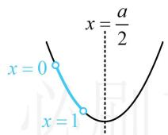

##### 5. (2023·广东模拟·★★)

函数 $f(x) = 2|x - a| + 3$ 在区间 $[1, +\infty)$ 上不单调，则 $a$ 的取值范围是（）

$\quad$A. $[1, +\infty)$

$\quad$B. $(1, +\infty)$

$\quad$C. $(- \infty, 1)$

$\quad$D. $(- \infty, 1]$

##### 5. B

解析 $f(x)$ 不复杂，可考虑画图分析单调性，由于有绝对值，不妨先讨论 $x$ 与 $a$ 的大小，去掉绝对值，

当 $x < a$ 时， $x - a < 0$ ， $f(x) = 2(a - x) + 3 = -2x + 2a + 3$ ；

当 $x \geq a$ 时， $x - a \geq 0$ ， $f(x) = 2(x - a) + 3 = 2x - 2a + 3$ ；

所以 $f(x)$ 在 $(- \infty, a)$ 上 $\searrow$ ，在 $[a, +\infty)$ 上 $\nearrow$

如图，要使 $f(x)$ 在 $[1, +\infty)$ 上不单调，应有 $a > 1$

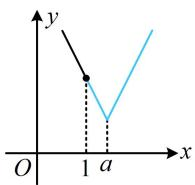

##### 6. (2024·河南模拟·★★★) (多选)

若定义在 $\mathbf{R}$ 上的偶函数 $y = f(x)$ ，对任意两个不相等的实数 $x_{1}, x_{2} \in (0, +\infty)$ ，都有 $x_{1}f(x_{1}) + x_{2}f(x_{2}) < x_{1}f(x_{2}) + x_{2}f(x_{1})$ ，则称 $y = f(x)$ 为“A函数”，下列函数为“A函数”的是（）

$\quad$A. $f(x) = 4 - x^{2}$

$\quad$B. $f(x) = \ln (4 + x^2)$

$\quad$C. $f(x) = 1 - 2|x|$

$\quad$D. $f(x) = \left\{ \begin{array}{ll}\mathrm{e}^{-x} - \mathrm{e}^{x},x > 0\\ \mathrm{e}^{x} - \mathrm{e}^{-x},x\leq 0 \end{array} \right.$

##### 6. ACD

解析怎样翻译 $x_{1}f(x_{1}) + x_{2}f(x_{2}) < x_{1}f(x_{2}) + x_{2}f(x_{1})$ ？此不等式结构较复杂，但观察发现若将左边的两项分别与右边的两项组合，则有公因式可提，故按此尝试，看能否将其化简，不妨设 $0 < x_{1} < x_{2}$ ，则 $x_{1} - x_{2} < 0$

$x _ {1} f (x _ {1}) + x _ {2} f (x _ {2}) <   x _ {1} f (x _ {2}) + x _ {2} f (x _ {1}) \Leftrightarrow x _ {1} f (x _ {1}) + x _ {2} f (x _ {2}) -$

$x _ {1} f (x _ {2}) - x _ {2} f (x _ {1}) <   0 \Leftrightarrow (x _ {1} - x _ {2}) f (x _ {1}) + (x _ {2} - x _ {1}) f (x _ {2}) <   0$

$\Leftrightarrow (x _ {1} - x _ {2}) [ f (x _ {1}) - f (x _ {2}) ] <   0,$

因为 $x_{1} - x_{2} < 0$ ，所以 $f(x_{1}) - f(x_{2}) > 0$

从而 $f(x_{1}) > f(x_{2})$ ，故 $f(x)$ 在 $(0, + \infty)$ 上 $\searrow$

所以只需判断选项中哪些 $f(x)$ 是定义在 $\mathbf{R}$ 上的偶函数，且在 $(0, +\infty)$ 上 $\searrow$ ，下面我们依次分析，

A 项， $f(x)=4-x^{2}$ 的定义域为 R，且 $f(-x)=4-(-x)^{2}$

$= 4 - x^{2} = f(x)$ ，所以 $f(x)$ 为偶函数，

由二次函数的性质可知 $f(x)$ 开口向下，且对称轴为 $y$ 轴，所以 $f(x)$ 在 $(0, +\infty)$ 上 $\searrow$ ，故A项正确；

B项， $f(x)$ 的定义域为 $\mathbf{R}$ ，且 $f(-x) = \ln [4 + (-x)^2 ]$

$= \ln (4 + x^{2}) = f(x)$ ，所以 $f(x)$ 是偶函数，

又 $f(x)$ 由 $y = \ln t$ 与 $t = 4 + x^2$ 复合而成，

当 $x > 0$ 时， $t = 4 + x^2 \nearrow$

$y = \ln t$ 在 $t$ 的取值范围内也 $\nearrow$ ，由复合函数的同增异减准则可知 $f(x)$ 在 $(0, +\infty)$ 上 $\nearrow$ ，故 B 项错误；

C 项， $f(x)$ 的定义域为 R，且 $f(-x)=1-2|-x|$

$= 1 - 2|x| = f(x)$ ，所以 $f(x)$ 是偶函数，

当 $x > 0$ 时， $f(x) = 1 - 2x$

因为 $-2 < 0$ ，所以 $f(x)$ 在 $(0, +\infty)$ 上 $\searrow$ ，故C项正确；

D 项，先看奇偶性， $f(x)$ 为分段函数，在不确定 $x$ 和 $-x$ 在哪一段的情况下，无法代解析式验证 $f(-x) = f(x)$ ，怎么办？那就假设 $x > 0$ （或 $x < 0$ ），再进行验证，

不妨设 $x > 0$ ，则 $-x < 0$ ， $f(-x) = \mathrm{e}^{-x} - \mathrm{e}^{-(x)} = \mathrm{e}^{-x} - \mathrm{e}^{x}$

$f(x) = \mathrm{e}^{-x} - \mathrm{e}^{x}$ ，所以 $f(-x) = f(x)$ ，故 $f(x)$ 是偶函数，

当 $x > 0$ 时， $f(x) = \mathrm{e}^{-x} - \mathrm{e}^x$ ，因为 $y = \mathrm{e}^{-x}$ 和 $y = -\mathrm{e}^x$ 在 $(0, +\infty)$ 上都 $\searrow$ ，所以 $f(x)$ 在 $(0, +\infty)$ 上 $\searrow$ ，故 D 项正确.

# 类型 II：奇函数+常数结论的应用

# 7. (★★)

设 $f(x)$ 为定义在 $\mathbf{R}$ 上的奇函数， $g(x) = f(x) - 1$ ， $g(1) = -2$ ，则 $g(-1) = \underline{\quad}$ .

##### 7.0

解析因为 $f(x)$ 为奇函数且 $g(x) = f(x) - 1$

所以 $g(-x) + g(x) = f(-x) - 1 + f(x) - 1 = -2$

从而 $g(-1) + g(1) = -2$ ，故 $g(-1) = -2 - g(1) = -2 - (-2) = 0$

##### 8. (2022·四川乐山模拟·★★)

设 $f(x)=|x|\sin x+1$ ，若 $f(a)=2$ ，则 $f(-a)=$ \_\_\_\_.

##### 8.0

解析设 $g(x) = |x|\sin x$ ，则 $g(x)$ 为奇函数， $f(x) = g(x) + 1$

所以 $f(a) + f(-a) = g(a) + 1 + g(-a) + 1 = 2$

又 $f(a) = 2$ ，所以 $f(-a) = 2 - f(a) = 0$

##### 9. (★★★)

若函数 $f(x) = \frac{(x + 1)^2 + \sin x}{x^2 + 1}$ 的最大值为 $M$ ，最小值为 $m$ ，则 $M + m =$ \_\_\_\_.

##### 9.2

解析 $f(x)$ 的最值不好求，怎样求 $M + m$ ？观察发现若将 $(x + 1)^2$ 展开，则上下都有 $x^{2} + 1$ ，可拆项化简再看，

由题意， $f(x) = \frac{(x + 1)^2 + \sin x}{x^2 + 1} = \frac{x^2 + 2x + 1 + \sin x}{x^2 + 1}$

$= 1 + \frac{2x + \sin x}{x^2 + 1}$ ，注意到 $y = \frac{2x + \sin x}{x^2 + 1}$ 为奇函数，

所以 $f(x)_{\mathrm{max}} + f(x)_{\mathrm{min}} = M + m = 2$ （理由见内容提要11）.

# 类型III：函数值不等式的解法

##### 10. (2017·新课标Ⅰ卷·★★)

奇函数 $f(x)$ 在 $\mathbf{R}$ 上单调递减，若 $f(1) = -1$ ，则满足 $-1 \leq f(x - 2) \leq 1$ 的 $x$ 的取值范围是（）

$\quad$A. $[-2, 2]$

$\quad$B. $[-1, 1]$

$\quad$C. $[0,4]$

$\quad$D. [1,3]

##### 10. D

解析没有解析式，只能用单调性解 $-1 \leq f(x - 2) \leq 1$ 。需先把原不等式中的-1和1也化成 $f(x)$ 的某个函数值，因为 $f(x)$ 为奇函数且 $f(1) = -1$ ，所以 $f(-1) = -f(1) = 1$ ，

从而 $-1 \leq f(x - 2) \leq 1$ 即为 $f(1) \leq f(x - 2) \leq f(-1)$ ，

结合 $f(x)$ 在 $\mathbf{R}$ 上 $\searrow$ 可得 $-1 \leq x - 2 \leq 1$ ，故 $1 \leq x \leq 3$ .

##### 11. (2022·湖北五校联考·★★★)

已知函数 $f(x) = \begin{cases} e^x, & x \leq 0 \\ x^2 + 2, & x > 0 \end{cases}$ ，若 $f(|x|) > f(x^2 - 2)$ ，则实数 $x$ 的取值范围为 \_\_\_\_.

##### 11. $(-2,2)$

解析看到函数值不等式 $f(|x|) > f(x^2 - 2)$ ，首先考虑判断单调性，此处为分段函数，可作图看单调性，

函数 $f(x)$ 的大致图象如图，由图可知 $f(x)$ 在 $\mathbf{R}$ 上 $\nearrow$

所以 $f(|x|) > f(x^2 - 2) \Leftrightarrow |x| > x^2 - 2$ ①,

怎样解上述不等式？将 $x^{2}$ 看成 $\left|x\right|^2$ ，移项可分解因式，

不等式①可化为 $\left|x\right|^{2}-\left|x\right|-2<0$ ，即 $(|x|+1)(|x|-2)<0$ ，

因为 $|x|+1>0$ ，所以 $|x|<2$ ，故-2<x<2。

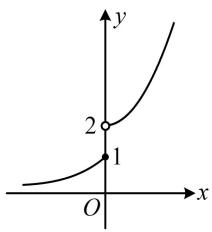

##### 12. (2022·福建漳州模拟·★★★)

已知函数 $f(x) = \begin{cases} 2^x - 1, & x > 0 \\ -1, & x \leq 0 \end{cases}$ ，若 $f(3a - 2) < f(a)$ ，则 $a$ 的取值范围为 \_\_\_\_.

##### 12. (0,1)

解析若代解析式解 $f(3a - 2) < f(a)$ ，则 $f(3a - 2)$ 和 $f(a)$ 该代哪段都不确定，需讨论较多情况，可考虑画图用单调性分析，函数 $f(x)$ 的大致图象如图，要使 $f(3a - 2) < f(a)$ ，

只需 $a$ 在 $(0, +\infty)$ 这一段，且 $3a - 2$ 在 $a$ 左侧，

所以 $\left\{ \begin{array}{l}a > 0\\ 3a - 2 <   a \end{array} \right.$ ，解得： $0 <   a <   1$

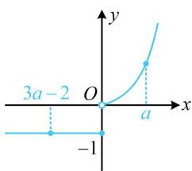

##### 13. (★★)

已知偶函数 $f(x)$ 在 $[0, +\infty)$ 上单调递减，则满足 $f(x^2 - 1) < f(3)$ 的 $x$ 的取值范围是 \_\_\_\_.

##### 13. $(- \infty, -2) \cup (2, +\infty)$

解析偶函数给了 $y$ 轴一侧的单调性，可画出草图，用图象来分析 $f(x^{2} - 1) < f(3)$ ，

由题意，函数 $f(x)$ 的草图如图，

可以看到，图象上离 $y$ 轴越远的点，对应的函数值越小，

所以 $f(x^{2} - 1) < f(3) \Leftrightarrow |x^{2} - 1| > 3$ ，故 $x < -2$ 或 $x > 2$

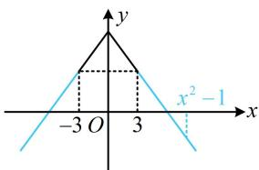

##### 14. (★★★)

设 $f(x) = \ln (1 + |x|) - \frac{1}{1 + x^2}$ ，则使 $f(x^{2} - x) > f(2x$

-2) 成立的 $x$ 的取值范围是（）

$\quad$A. $(- \infty, -2) \cup (2, +\infty)$   
$\quad$B. $(- \infty, -2) \cup (0, 2)$   
$\quad$C. $(-2, 2)$   
$\quad$D. $(- \infty, -2) \cup (1, +\infty)$

##### 14. A

解析 $f(x) = \ln (1 + |x|) - \frac{1}{1 + x^2}$ 是定义在 $\mathbf{R}$ 上的偶函数，

虽给了解析式，但将 $f(x^{2} - x) > f(2x - 2)$ 代入解析式求解较麻烦，故考虑先判断 $y$ 轴一侧的单调性，再画草图来看，此处要求导吗？其实不用，拆分分析即可，

当 $x \geq 0$ 时， $f(x) = \ln (1 + x) - \frac{1}{1 + x^2}$ ，

而 $y = \ln (1 + x)$ 和 $y = -\frac{1}{1 + x^2}$ 在 $[0, +\infty)$ 上都 $\nearrow$

所以 $f(x)$ 在 $[0, +\infty)$ 上 $\nearrow$ ，故 $f(x)$ 的草图如图，

可以看到，图象上离 $y$ 轴越远的点，对应的函数值越大，

所以 $f(x^{2} - x) > f(2x - 2)\Leftrightarrow \left|x^{2} - x\right| > \left|2x - 2\right|\Leftrightarrow \left\{ \begin{array}{ll}x\neq 1\\ |x| > 2 \end{array} \right.$

解得： $x < -2$ 或 $x > 2$

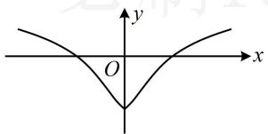

##### 15. (★★★)

定义在 $\mathbf{R}$ 上的函数 $f(x)$ 在 $[-2, +\infty)$ 上单调递增，且 $f(x - 2)$ 是偶函数，则 $f(x + 2) > f(x)$ 的解集是

##### 15. $(-3, +\infty)$

解析 $f(x - 2)$ 是偶函数 $\Rightarrow f(x - 2)$ 的图象关于 $y$ 轴对称，

而 $f(x - 2)$ 的图象可由 $f(x)$ 的图象向右平移2个单位得到，所以 $f(x)$ 的图象关于直线 $x = -2$ 对称，

因为 $f(x)$ 在 $[-2, +\infty)$ 上 $\nearrow$ ，所以 $f(x)$ 的草图如图所示，

由图可知 $f(x)$ 的图象上离对称轴 $x = -2$ 越远的点，其函数值越大，故可将 $f(x + 2) > f(x)$ 翻译成 $x + 2$ 比 $x$ 离-2更远，所以 $f(x + 2) > f(x) \Leftrightarrow |x + 2 - (-2)| > |x - (-2)|$ ，

两端平方可解得： $x > -3$

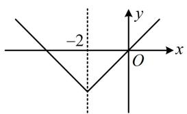

##### 16. (2024·广西模拟·★★★)

定义在 $\mathbf{R}$ 上的奇函数 $f(x)$ 在 $(0, +\infty)$ 上单调递增，且 $f\left(\frac{1}{3}\right) = 0$ ，则不等式 $\frac{f(x)}{x^2 - 2} \leq 0$ 的解集为（）

$\quad$A. $\left(-\sqrt{2}, -\frac{1}{3}\right] \cup (\sqrt{2}, +\infty)$   
$\quad$B. $(- \infty, -\sqrt{2}) \cup \left[-\frac{1}{3}, 0\right) \cup \left[\frac{1}{3}, \sqrt{2}\right)$   
$\quad$C. $\left(-\sqrt{2}, -\frac{1}{3}\right] \cup \{0\} \cup (\sqrt{2}, +\infty)$   
$\quad$D. $(- \infty, -\sqrt{2}) \cup \left[-\frac{1}{3}, 0\right] \cup \left[\frac{1}{3}, \sqrt{2}\right)$

##### 16. D

解析由已知条件容易画出 $f(x)$ 的草图，故考虑画图分析不等式 $\frac{f(x)}{x^2 - 2} \leq 0$ 的解集，

因为 $f(x)$ 为奇函数，且在 $(0, +\infty)$ 上 $\nearrow$ ， $f\left(\frac{1}{3}\right) = 0$

所以 $f(x)$ 的草图如图，怎样解不等式 $\frac{f(x)}{x^2 - 2} \leq 0$ ？注意到 $f(x)$ 和 $x^2 - 2$ 各自的正负都容易分析，故直接将其拆分成 $f(x)$ 和 $x^2 - 2$ 的正负分别考虑，

$\frac{f(x)}{x^{2}-2}\leq0\Leftrightarrow\left\{\begin{aligned}f(x)\geq0\\ x^{2}-2<0\end{aligned}\right.$ 或 $\left\{\begin{aligned}f(x)\leq0\\ x^{2}-2>0\end{aligned}\right.$

若 $\left\{ \begin{array}{l} f(x) \geq 0 \\ x^2 - 2 < 0 \end{array} \right.$ ，则 $\left\{ \begin{array}{l} -\frac{1}{3} \leq x \leq 0 \text{或} x \geq \frac{1}{3} \\ -\sqrt{2} < x < \sqrt{2} \end{array} \right.$ ，

所以 $-\frac{1}{3} \leq x \leq 0$ 或 $\frac{1}{3} \leq x < \sqrt{2}$ ;

若 $\left\{ \begin{array}{l} f(x) \leq 0 \\ x^2 - 2 > 0 \end{array} \right.$ ，则 $\left\{ \begin{array}{l} x \leq -\frac{1}{3} \text{或} 0 \leq x \leq \frac{1}{3} \\ x < -\sqrt{2} \text{或} x > \sqrt{2} \end{array} \right.$ ，所以 $x < -\sqrt{2}$ ；

综上， $\frac{f(x)}{x^2 - 2}\leq 0$ 的解集为 $(- \infty , - \sqrt{2})\cup \left[-\frac{1}{3},0\right]\cup \left[\frac{1}{3},\sqrt{2}\right)$

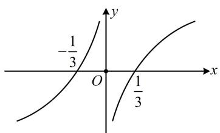

##### 17. (2022·江苏盐城模拟·★★★)

若函数 $f(x) = \mathrm{e}^{x} - \mathrm{e}^{-x} + \ln (\sqrt{x^2 + 1} + x)$ ，则不等式 $f(x) + f(2x - 1) > 0$ 的解集是（）

$\quad$A. $(1, +\infty)$ 
$\quad$B. $\left(\frac{1}{3}, +\infty\right)$

$\quad$C. $\left(-\infty, \frac{1}{3}\right)$ 
$\quad$D. $(- \infty, 1)$

##### 17. B

解析看到 $f(x) + f(2x - 1) > 0$ 这种结构，猜想 $f(x)$ 为奇函数，移项后才能将负号拿到括号里面，利用单调性求解，所给函数解析式较复杂，整体分析不易，可尝试将其拆分成 $\mathrm{e}^x - \mathrm{e}^{-x}$ 和 $\ln (\sqrt{x^2 + 1} + x)$ 分别研究奇偶性和单调性，

设 $g(x) = \mathrm{e}^{x} - \mathrm{e}^{-x}(x\in \mathbf{R})$ ， $h(x) = \ln (\sqrt{x^2 + 1} +x)(x\in \mathbf{R})$

因为 $g(-x) = \mathrm{e}^{-x} - \mathrm{e}^{x} = -g(x)$ ，所以 $g(x)$ 为奇函数，

又 $g'(x) = \mathrm{e}^{x} - (-\mathrm{e}^{-x}) = \mathrm{e}^{x} + \mathrm{e}^{-x} > 0$ ，所以 $g(x)$ 在 $\mathbf{R}$ 上 $\nearrow$

因为 $h(-x) + h(x) = \ln (\sqrt{x^2 + 1} - x) + \ln (\sqrt{x^2 + 1} + x)$

$= \ln [ (\sqrt {x ^ {2} + 1} - x) (\sqrt {x ^ {2} + 1} + x) ] = \ln 1 = 0,$

所以 $h(x)$ 为奇函数，

在 $[0, +\infty)$ 上， $h(x)$ 随着 $x$ 的增大而增大，

所以 $h(x)$ 在 $[0, +\infty)$ 上 $\nearrow$

结合奇函数图象的对称性知 $h(x)$ 在 $\mathbf{R}$ 上 $\nearrow$

因为 $f(x) = g(x) + h(x)$ ，所以 $f(x)$ 是奇函数且在 $\mathbf{R}$ 上 $\nearrow$

故 $f(x) + f(2x - 1) > 0 \Leftrightarrow f(x) > -f(2x - 1)$

$\Leftrightarrow f(x) > f(1 - 2x) \Leftrightarrow x > 1 - 2x$ ，解得： $x > \frac{1}{3}$ .

【反思】①函数 $y = \log_a(\sqrt{1 + m^2x^2} \pm mx)$ 是定义在 $\mathbf{R}$ 上的奇函数，熟悉这一结论对解题有帮助；②奇函数若在 $[0, +\infty)$ 上 $\nearrow$ 则它必定在 $\mathbf{R}$ 上 $\nearrow$ .

##### 18. (2023·江苏模拟·★★★)

已知 $f(x)$ 是定义在 $\mathbf{R}$ 上的偶函数，当 $x \geq 0$ 时， $f(x) = \mathrm{e}^x + \sin x$ ，则不等式 $f(2x - 1) < \mathrm{e}^\pi$ 的解集是（）

$\quad$A. $\left(\frac{1 + \pi}{2}, +\infty\right)$

$\quad$B. $\left(0, \frac{1 + \pi}{2}\right)$

$\quad$C. $\left(0, \frac{1 + \mathrm{e}^{\pi}}{2}\right)$

$\quad$D. $\left(\frac{1 - \pi}{2},\frac{1 + \pi}{2}\right)$

##### 18. D

解析代解析式求解目标不等式较麻烦，故看看能否将 $\mathrm{e}^{\pi}$ 也化为函数值，用单调性、奇偶性处理，

由题意， $f(\pi) = \mathrm{e}^{\pi} + \sin \pi = \mathrm{e}^{\pi}$

所以 $f(2x-1)<\mathrm{e}^{\pi}$ 即为 $f(2x-1)<f(\pi)$ ①,

有 $f(x)$ 在 $[0, +\infty)$ 上的解析式，可先分析这部分的单调性，再画出草图来解不等式①，

当 $x \geq 0$ 时， $f(x) = \mathrm{e}^x + \sin x$ ，所以 $f'(x) = \mathrm{e}^x + \cos x$

$\geq 1 + \cos x \geq 0$ ，故 $f(x)$ 在 $[0, +\infty)$ 上 $\nearrow$

结合 $f(x)$ 为偶函数可得 $f(x)$ 的草图如图，由图可知不等

式①等价于 $-\pi < 2x - 1 < \pi$ ，解得： $\frac{1 - \pi}{2} < x < \frac{1 + \pi}{2}$

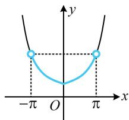

【反思】本题虽然不是 $f(\cdots) < f(\cdots)$ 的形式，但直接代入解析式较复杂时，也可尝试看是否能化为该形式，进而用单调性处理.

##### 19. (2023·四省联考·★★★) (多选)

已知 $f(x)$ 是定义在 $\mathbf{R}$ 上的偶函数， $g(x)$ 是定义在 $\mathbf{R}$ 上的奇函数，且 $f(x), g(x)$ 在 $(- \infty, 0]$ 单调递减，则（）

$\quad$A. $f(f(1)) <   f(f(2))$

$\quad$B. $f(g(1)) < f(g(2))$

$\quad$C. $g(f(1)) < g(f(2))$

$\quad$D. $g(g(1)) < g(g(2))$

##### 19. BD

解析给了两函数 $(- \infty, 0]$ 上的单调性，可用奇偶性得出 $[0, +\infty)$ 上的单调性，

因为 $f(x)$ 是偶函数且在 $(- \infty, 0]$ 上 $\searrow$ ，

所以 $f(x)$ 在 $[0, +\infty)$ 上 $\nearrow$ ①，

又 $g(x)$ 是奇函数，且在 $(- \infty, 0]$ 上 $\searrow$

所以 $g(x)$ 在 R 上 $\searrow$ ②,

A项，由①可得 $f(1) < f(2)$ ，但 $f(1)$ 和 $f(2)$ 的正负不明，

$f(x)$ 在 $\mathbf{R}$ 上又不单调，故 $f(f(1)) < f(f(2))$ 不一定成立，

反例如图1和图2，故A项错误；

B 项， $g(x)$ 的草图如图3，由图知 $g(2) < g(1) < 0$ ，结合 $f(x)$ 在 $(-\infty, 0]$ 上 $\searrow$ 得 $f(g(1)) < f(g(2))$ ，如图4，故B项正确；C项，分析A项时已得 $f(1) < f(2)$ ，

结合②可得 $g(f(1)) > g(f(2))$ ，故C项错误；

D 项，分析 B 项时已得 $g(1) > g(2)$ ，

结合②可得 $g(g(1)) < g(g(2))$ ，故D项正确.

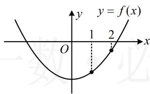

图1

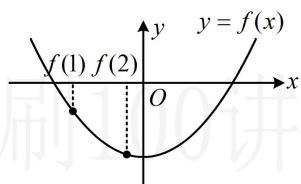

图2

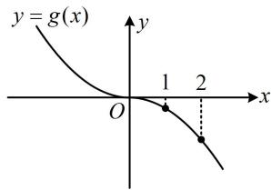

图3

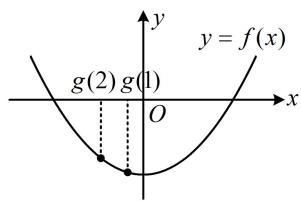

图4

