# 强化训练

##### 1. (2023·山东烟台模拟·★★)

函数 $y = x(\sin x - \sin 2x)$ 的部分图象大致为（）

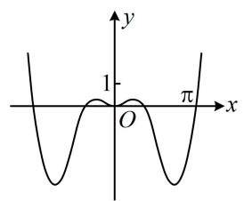

A

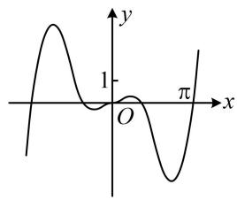

B

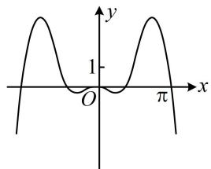

C

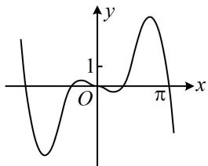

D

##### 1. C

解析观察选项发现选项A、C关于 $y$ 轴对称，选项B、D关于原点对称，故可通过判断奇偶性排除两个选项，

设 $f(x) = x(\sin x - \sin 2x)$ ，则 $f(-x) = -x[\sin (-x) - \sin 2(-x)]$

$= - x [ - \sin x - (- \sin 2 x) ] = x (\sin x - \sin 2 x) = f (x),$

所以 $f(x)$ 为偶函数，其图象关于 $y$ 轴对称，排除B、D；

而A、C的差异是函数值的正负，故可通过计算 $x = 0$ 右侧附近的函数值来排除选项，

因为 $f(x) = x(\sin x - \sin 2x) = x(\sin x - 2\sin x\cos x)$

$= x \sin x (1 - 2 \cos x),$

所以在 $x = 0$ 右侧附近， $x > 0$ ， $\sin x > 0$ ， $1 - 2\cos x < 0$

从而 $f(x) < 0$ ，排除A，故选C.

##### 2. (2024·福建模拟·★★)

函数 $f(x) = \frac{1}{2} x^2 +\cos x$ 在 $[- \pi ,\pi ]$ 的图象大致为（）

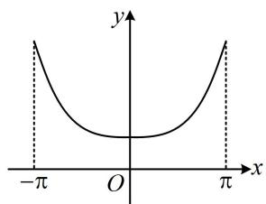

A

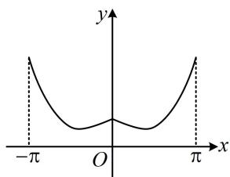

B

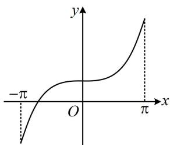

C

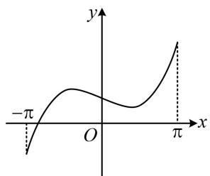

D

##### 2. A

解析A、B项的图象关于y轴对称，C、D项的图象是中心对称图形，故可通过判断 $f(x)$ 是否为偶函数排除两个选项， $f(-x)=\frac{1}{2}(-x)^{2}+\cos(-x)=\frac{1}{2}x^{2}+\cos x=f(x)\Rightarrow f(x)$ 是偶函数，其图象关于y轴对称，排除C、D两项；

观察发现A、B项最大的差异是 $x = 0$ 附近的单调性，故可通过求导来分析，

由题意， $f'(x) = x - \sin x$ ，所以 $f'（0） = 0$ ，故 $f(x)$ 在 $x = 0$ 处的切线是水平的，而B选项在 $x = 0$ 处左右两边的切线不同，排除B，故选A.

# 3. (2024·全国甲卷·★★☆)

函数 $y = -x^{2} + (\mathrm{e}^{x} - \mathrm{e}^{-x})\sin x$ 在区间[-2.8,2.8]的图象大致为（）

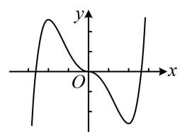

A

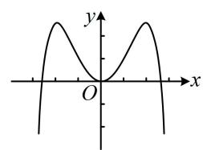

B

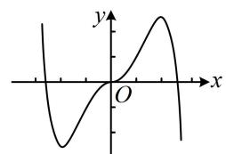

C

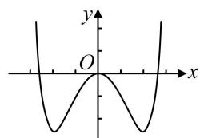

D

##### 3. B

解析观察发现A、C两项关于原点对称，B、D两项关于 $y$ 轴对称，故可通过判断奇偶性排除2个选项，

记 $f(x) = -x^{2} + (\mathrm{e}^{x} - \mathrm{e}^{-x})\sin x$ ，则 $f(-x) = -(-x)^{2}+$

$(\mathrm{e} ^ {- x} - \mathrm{e} ^ {x}) \sin (- x) = - x ^ {2} + (\mathrm{e} ^ {- x} - \mathrm{e} ^ {x}) (- \sin x)$

$= -x^{2} + (\mathrm{e}^{x} - \mathrm{e}^{-x})\sin x = f(x)$ ，所以 $f(x)$ 为偶函数，

其图象关于 $y$ 轴对称，排除A、C；

B、D的差异主要是函数值的正负，故可通过代值计算排除一个选项，为了让 $\sin x$ 好算，我们算 $f\left(\frac{\pi}{2}\right)$

$f \left(\frac {\pi}{2}\right) = - \left(\frac {\pi}{2}\right) ^ {2} + \left(\mathrm{e} ^ {\frac {\pi}{2}} - \mathrm{e} ^ {- \frac {\pi}{2}}\right) \sin \frac {\pi}{2} = - \frac {\pi^ {2}}{4} + \mathrm{e} ^ {\frac {\pi}{2}} - \mathrm{e} ^ {- \frac {\pi}{2}}$

$= \mathrm{e}^{\frac{\pi}{2}} - \left(\frac{\pi^2}{4} + \mathrm{e}^{-\frac{\pi}{2}}\right)$ ，直观感觉， $\mathrm{e}^{\frac{\pi}{2}}$ 比 $\frac{\pi^2}{4}$ 大挺多的（差值大于1），而 $\mathrm{e}^{-\frac{\pi}{2}}$ 比较小（接近0），所以 $f\left(\frac{\pi}{2}\right)$ 为正，我们通过适度放缩来严格论证这一结果，

$\mathrm{e} ^ {\frac {\pi}{2}} > \mathrm{e} ^ {1. 5} = \mathrm{e} \sqrt {\mathrm{e}} > \mathrm{e} \times 1. 5 > 2. 7 \times 1. 5 > 4, \text {又} \frac {\pi^ {2}}{4} <   3, \mathrm{e} ^ {- \frac {\pi}{2}} <   1,$

所以 $\frac{\pi^2}{4} +\mathrm{e}^{-\frac{\pi}{2}} < 3 + 1 = 4$ ，故 $f\left(\frac{\pi}{2}\right) > 0$ ，排除D.

##### 4. (2022·全国乙卷·★★★)

右图是下列四个函数中的某个函数在 $[-3, 3]$ 的大致图象，则该函数是（）

$\quad$A. $y = \frac{-x^3 + 3x}{x^2 + 1}$

$\quad$B. $y = \frac{x^3 - x}{x^2 + 1}$

$\quad$C. $y = \frac{2x\cos x}{x^2 + 1}$

$\quad$D. $y = \frac{2\sin x}{x^2 + 1}$

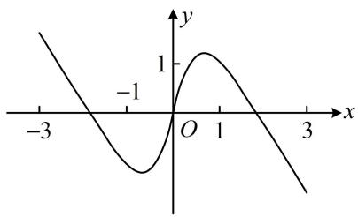

##### 4. A

解析先看看能从所给图象上挖掘出一些什么样的性质，再来验证选项是否满足这些性质，

从图象可以看出，当 $x = 3$ 时， $y < 0$ ，选项B、D不满足这一点，排除掉；

那A、C两个选项怎么选呢？图中还标了 $x = 1$ 这个位置，可以用(0,1)上函数值的情况来鉴别，

对于选项C，当 $0 < x \leq 1$ 时， $\frac{2x}{x^2 + 1} = \frac{2}{x + \frac{1}{x}} \leq \frac{2}{2\sqrt{x \cdot \frac{1}{x}}} = 1$

$0 < \cos x < 1$ ，所以 $y = \frac{2x\cos x}{x^2 + 1} < 1$ ，与图象不符，排除掉，

故选A.（此处也可直接算 $x = 1$ 处的函数值来排除C项）

##### 5. (2024·浙江模拟·★★★☆)

函数 $f(x) = a\ln |x| + \frac{1}{x}$ 的图象不可能是（）

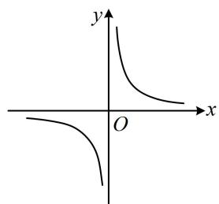

A

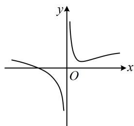

B

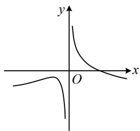

C

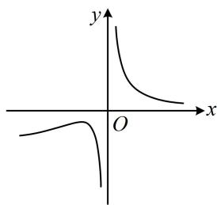

D

##### 5. D

【解法1】当 $a = 0$ 时， $f(x) = \frac{1}{x}$ ， $f(x)$ 的图象为A项，

而当 $a \neq 0$ 时, 观察发现 B、C 有零点, D 没有零点, 故可尝试分析 $f(x)$ 的零点情况, 来排除选项,当 $a \neq 0$ 时， $f(x) = 0 \Leftrightarrow a \ln |x| + \frac{1}{x} = 0 \Leftrightarrow a \ln |x| = -\frac{1}{x}$ ，

若 $a > 0$ ，如图1， $y = a\ln |x|$ 和 $y = -\frac{1}{x}$ 在 $y$ 轴左侧必有一个交点，所以 $f(x)$ 在 $(-\infty ,0)$ 上必有一个零点，若 $a <   0$ ，如图2， $y = a\ln |x|$ 和 $y = -\frac{1}{x}$ 在 $y$ 轴右侧必有一个交点，所以 $f(x)$ 在 $(0, + \infty)$ 上必有一个零点，所以 $f(x)$ 始终有零点 $\Rightarrow f(x)$ 的图象不可能是D选项.

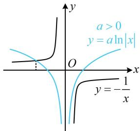

图1

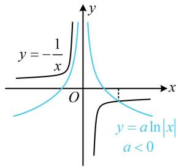

图2

【解法2】 $a = 0$ 的分析方法同解法1， $a \neq 0$ 时，选项B、C、D的图象往 $x$ 轴正向的趋势不同，故也可用极限来分析，若 $a > 0$ ，则当 $x\to +\infty$ 时， $f(x) = a\ln |x| + \frac{1}{x}\rightarrow +\infty$

若 $a < 0$ ，则当 $x \to +\infty$ 时， $f(x) = a \ln |x| + \frac{1}{x} \to -\infty$ ；

而对于D项，当 $x\to +\infty$ 时， $f(x)\rightarrow 0$

与上述结果不符，所以图象不可能是D选项.

