# 第2节 选解析式与选图象（★★）

# 内容提要

本节归纳选解析式与选图象的有关考题，这类题考查的是函数的性质，用排除法选答案是通法，一般可以从以下的一些角度考虑：

①奇偶性；②特殊点（或某区间）的函数值；③单调性；④图象趋势（极限情况）等.

# 类型I：给解析式选图象

##### 【例1】（2022·全国甲卷）函数 $y = (3^{x} - 3^{-x})\cos x$ 在区间 $\left[-\frac{\pi}{2},\frac{\pi}{2}\right]$ 的大致图象为（）

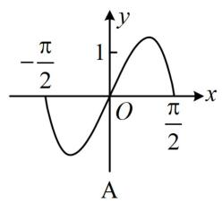

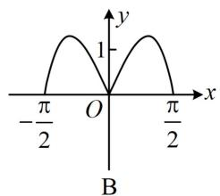

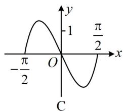

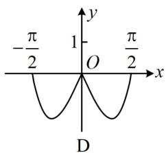

解析观察发现A、C为奇函数，B、D为偶函数，故可通过判断奇偶性排除两个选项，记 $f(x) = (3^{x} - 3^{-x})\cos x$ ，则 $f(-x) = (3^{-x} - 3^{x})\cos (-x) = (3^{-x} - 3^{x})\cos x = -f(x)\Rightarrow f(x)$ 是奇函数，排除B、D；还剩选项A、C，对比可发现它们在 $\left(0,\frac{\pi}{2}\right)$ 上函数值的正负不同，故可据此再排除一个选项，当 $0 <   x <   \frac{\pi}{2}$ 时， $3^{x} - 3^{-x} > 0$ ， $\cos x > 0$ ，所以 $f(x) > 0$ ，排除C，故选A.

答案: A

##### 【例2】函数 $f(x) = \frac{\sin 3x}{1 + \cos x} (-\pi < x < \pi)$ 的大致图象为（）

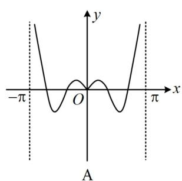

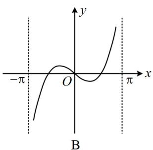

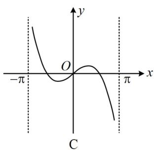

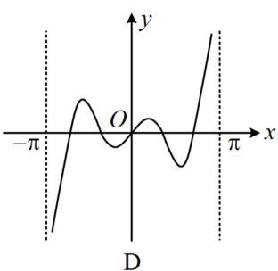

解析选项 A 关于 y 轴对称，B、C、D 关于原点对称，所以不妨先判断奇偶性，

$f(-x)=\frac{\sin3(-x)}{1+\cos(-x)}=-\frac{\sin3x}{1+\cos x}=-f(x)\Rightarrow f(x)$ 为奇函数，排除 A；

观察发现 B 和 C、D 在 y 轴右侧附近函数值正负不同，于是又计算 y 轴右侧附近某处的函数值，例如， $f(0.1)=\frac{\sin 0.3}{1+\cos 0.1}>0$ ，从而可排除 B；

选项 C、D 怎么看呢？它们的明显差异是 $(0,\pi)$ 上的零点个数不同，故可通过分析零点个数来排除， $f(x)=0\Leftrightarrow\sin3x=0\Leftrightarrow3x=k\pi\Leftrightarrow x=\frac{k\pi}{3}(k\in\mathbf{Z})$ ，所以 $f(x)$ 在 $(0,\pi)$ 上有零点 $\frac{\pi}{3}$ 和 $\frac{2\pi}{3}$ ，排除C，故选D.

答案: D

##### 【例3】函数 $f(x) = \frac{|x|x^2 - \ln|x|}{x^2}$ 的大致图象为（）

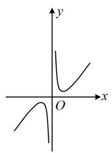

A

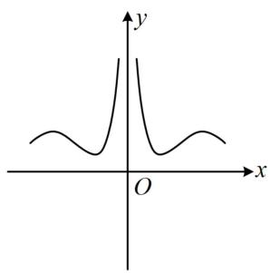

B

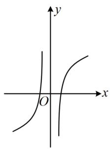

C

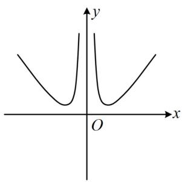

D

解析所给图象中有的关于原点对称，有的关于 $y$ 轴对称，所以可先判断奇偶性，排除部分选项，

$f(-x) = \frac{|-x|(-x)^2 - \ln |-x|}{(-x)^2} = \frac{|x|x^2 - \ln |x|}{x^2} = f(x)\Rightarrow f(x)$ 为偶函数，排除A、C；

选项B、D在 $x\to +\infty$ 时趋势不同，可分析极限来排除选项，当 $x\to +\infty$ 时， $f(x) = \frac{|x|x^2 - \ln|x|}{x^2} = x - \frac{\ln x}{x^2}$ ，注意到 $\frac{\ln x}{x^2}$ 这个部分，尽管分子分母都趋于 $+\infty$ ，但我们知道 $\ln x$ 趋于 $+\infty$ 的速率比 $x^{2}$ 慢，所以这部分极限为0，从而 $f(x) = x - \frac{\ln x}{x^2}\rightarrow +\infty$ ，排除B，故选D.

答案: D

【反思】 $y = a^{x}(a > 1)$ ， $y = \log_{b} x (b > 1)$ ， $y = x^{m} (m > 1)$ 这三类函数，当 $x \to +\infty$ 时，函数值 $y$ 都趋于 $+\infty$ ，但从增长速率来看， $y = a^{x}$ 最快， $y = x^{m}$ 其次， $y = \log_{b} x$ 最慢.

# 类型 II：给图象选解析式

【例 4】(2021·浙江卷) 已知函数 $f(x)=x^{2}+\frac{1}{4}$ ， $g(x)=\sin x$ ，则图象为右图的函数可能是（）

$\quad$A. $y = f(x) + g(x) - \frac{1}{4}$

$\quad$B. $y = f(x) - g(x) - \frac{1}{4}$

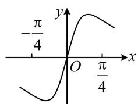

$\quad$C. $y = f(x)g(x)$

$\quad$D. $y = \frac{g(x)}{f(x)}$

解析这道题是给了图象，反过来让选解析式，我们应挖掘所给图象的性质，并用它们来验证选项是否与之吻合，这里图象反映的信息有奇偶性、 $\left(0,\frac{\pi}{4}\right)$ 上的单调性等方面，

A 项， $y = f(x) + g(x) - \frac{1}{4} = x^2 + \sin x$ 为非奇非偶函数，与图象不符，故 A 项错误；

B项， $y = f(x) - g(x) - \frac{1}{4} = x^2 - \sin x$ 为非奇非偶函数，与图象不符，故B项错误；

C 项，令 $h(x) = f(x)g(x)$ ，则 $h(x) = \left(x^{2} + \frac{1}{4}\right)\sin x$ ，所以 $h'(x) = 2x\sin x + \left(x^{2} + \frac{1}{4}\right)\cos x$ ，

从而 $h^' \left(\frac{\pi}{4}\right) = \frac{\sqrt{2}\pi}{4} +\left(\frac{\pi^2}{16} +\frac{1}{4}\right)\times \frac{\sqrt{2}}{2} >0$ ，即 $h(x)$ 在 $x = \frac{\pi}{4}$ 处的切线斜率为正，与图象不符，排除C，选D.

也可直接分析选项 C 的函数在 $\left(0,\frac{\pi}{4}\right)$ 上的单调性，当 $x\in\left(0,\frac{\pi}{4}\right)$ 时， $f(x)$ 和 $g(x)$ 均 $\nearrow$ ，且 $f(x)>0$ ， $g(x)>0$ ，
所以 $y = f(x)g(x)$ 在 $\left(0, \frac{\pi}{4}\right)$ 上为增函数，与图象不符，从而得出 C 项错误.

答案: D

# 强化训练

##### 1. (2023·山东烟台模拟·★★)

函数 $y = x(\sin x - \sin 2x)$ 的部分图象大致为（）

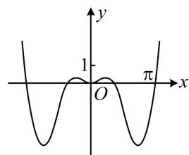

A

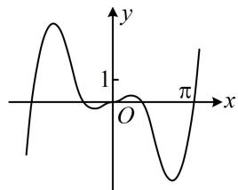

B

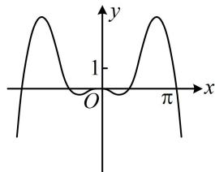

C

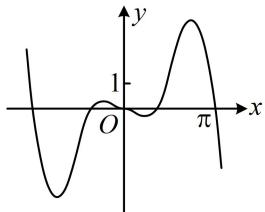

D

##### 2. (2024·福建模拟·★★)

函数 $f(x) = \frac{1}{2} x^2 +\cos x$ 在 $[- \pi ,\pi ]$ 的图象大致为（）

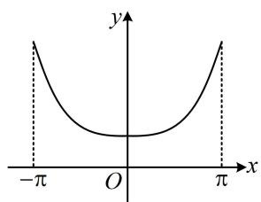

A

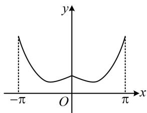

B

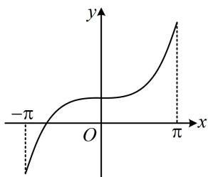

C

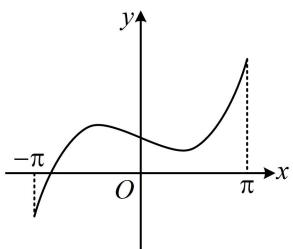

D

##### 3. (2024·全国甲卷·★★☆)

函数 $y = -x^{2} + (\mathrm{e}^{x} - \mathrm{e}^{-x})\sin x$ 在区间[-2.8,2.8]的图象大致为（）

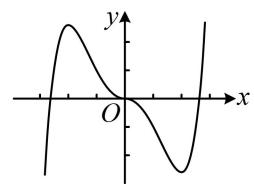

A

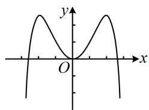

B

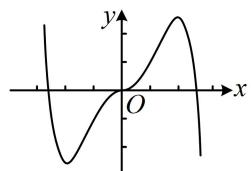

C

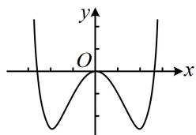

D

##### 4. (2022·全国乙卷·★★★)

右图是下列四个函数中的某个函数在[-3,3]的大致图象，则该函数是（）

$\quad$A. $y = \frac{-x^3 + 3x}{x^2 + 1}$

$\quad$B. $y = \frac{x^3 - x}{x^2 + 1}$

$\quad$C. $y = \frac{2x\cos x}{x^2 + 1}$

$\quad$D. $y = \frac{2\sin x}{x^2 + 1}$

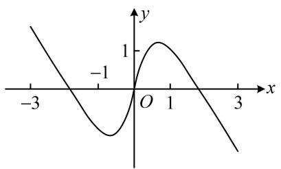

##### 5. (2024·浙江模拟·★★★☆)

函数 $f(x) = a\ln |x| + \frac{1}{x}$ 的图象不可能是（）

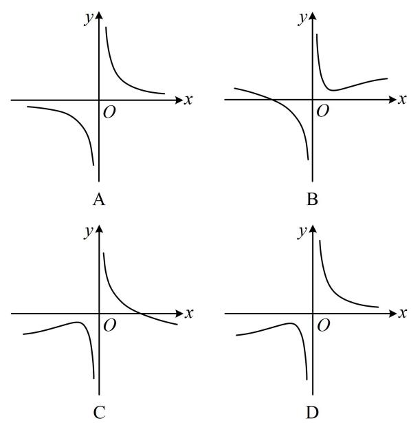

