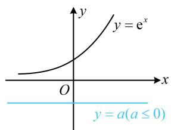
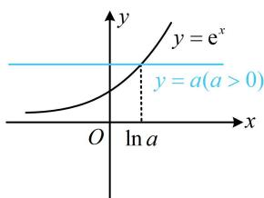
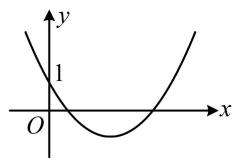
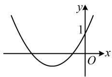
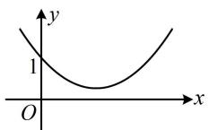
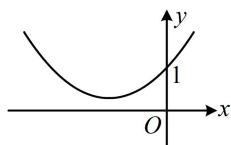

# 强化训练

##### 1. (2024·广西模拟·★★)

已知函数 $f(x) = ax - \frac{1}{a} +\ln x$

（1） 讨论 $f(x)$ 的单调性;  
（2） 若 $f(x)$ 存在最大值，且最大值小于 0，求 $a$ 的取值范围.

##### 1. 解：（1）由题意， $f'(x)=a+\frac{1}{x}=\frac{ax+1}{x},\quad x>0,\quad a\neq0,$

(观察发现 $f'(x)$ 有零点 $-\frac{1}{a}$ ，但 $-\frac{1}{a}$ 是否在定义域内，由 a 的正负决定，故据此讨论)

当 $a > 0$ 时， $f'(x) > 0$ ，所以 $f(x)$ 在 $(0, +\infty)$ 上单调递增；

当 $a < 0$ 时， $f'(x) > 0 \Leftrightarrow 0 < x < -\frac{1}{a}$ ， $f'(x) < 0 \Leftrightarrow x > -\frac{1}{a}$ ，

所以 $f(x)$ 在 $\left(0, -\frac{1}{a}\right)$ 上单调递增，在 $\left(-\frac{1}{a}, +\infty\right)$ 上单调递减.

（2） (第 （1） 问已经讨论了 $f(x)$ 的单调性, 可在此基础上分析 $f(x)$ 的最大值)

由（1）可知当 $a > 0$ 时， $f(x)$ 在 $(0, +\infty)$ 上单调递增，

所以 $f(x)$ 没有最大值，不合题意，故 $a < 0$

此时 $f(x)$ 在 $\left(0, -\frac{1}{a}\right)$ 上单调递增，在 $\left(-\frac{1}{a}, +\infty\right)$ 上单调递减，

所以 $f(x)_{\max} = f\left(-\frac{1}{a}\right) = -1 - \frac{1}{a} -\ln (-a),$

由题意， $-1 - \frac{1}{a} -\ln (-a) <   0$ ，（此不等式不方便直接求解，可把 $a$ 看成变量，构造函数求导分析）

设 $g(a) = -1 - \frac{1}{a} - \ln(-a)$ ，a < 0，则 $g'(a) = \frac{1}{a^{2}} - \frac{-1}{-a}$

$= \frac{1 - a}{a^2} > 0$ ，所以 $g(a)$ 在 $(- \infty, 0)$ 上单调递增，

又 $g(-1) = -1 - \frac{1}{-1} - \ln[-(-1)] = 0$ ，所以当且仅当 $a < -1$ 时， $g(a) < 0$ ，故 $a$ 的取值范围为 $(- \infty, -1)$ .

##### 2. (★★)

设 $f(x) = \frac{1}{2}\mathrm{e}^{2x} + (2 - a)\mathrm{e}^x - 2ax - 1(a\in \mathbf{R})$ ，讨论

$f(x)$ 的单调性.

##### 2. 解： $f'(x) = \mathrm{e}^{2x} + (2 - a)\mathrm{e}^x - 2a = (\mathrm{e}^x + 2)(\mathrm{e}^x - a)$ ，

(观察可知 $f'(x)$ 的符号与 $e^{x}-a$ 这个因式的符号相同，该因式是否有零点由 a 的正负决定，如图，故据此讨论)

①当 $a \leq 0$ 时， $\mathrm{e}^{x} - a > 0$ ， $\mathrm{e}^{x} + 2 > 0$ ，所以 $f'(x) > 0$ ，

故 $f(x)$ 在 $\mathbf{R}$ 上单调递增；

②当 $a > 0$ 时， $f'(x) > 0 \Leftrightarrow x > \ln a$ ， $f'(x) < 0 \Leftrightarrow x < \ln a$

所以 $f(x)$ 在 $(-\infty, \ln a)$ 单调递减，在 $(\ln a, +\infty)$ 单调递增.

##### 3. (★★☆)

已知函数 $f(x) = \frac{2}{3} x^3 +\frac{a - 2}{2} x^2 -ax + 1(a\in \mathbf{R})$ ，讨论 $f(x)$ 的单调性.

##### 3. 解：由题意， $f'(x)=2x^{2}+(a-2)x-a=(2x+a)(x-1)$

(两根 $-\frac{a}{2}$ 和1的大小不确定，故讨论两根的大小)

①当 $a < -2$ 时， $-\frac{a}{2} > 1$ ， $f'(x) > 0 \Leftrightarrow x < 1$ 或 $x > -\frac{a}{2}$

$f'(x) < 0 \Leftrightarrow 1 < x < -\frac{a}{2}$ ，所以 $f(x)$ 在 $(- \infty, 1)$ 上单调递增，

在 $\left(1, -\frac{a}{2}\right)$ 上单调递减，在 $\left(-\frac{a}{2}, +\infty\right)$ 上单调递增；

②当 $a = -2$ 时， $f'(x) = 2(x - 1)^2 \geq 0$

所以 $f(x)$ 在 $\mathbf{R}$ 上单调递增；

③当 $a > -2$ 时， $-\frac{a}{2} < 1$ ，所以 $f'(x) > 0\Leftrightarrow x <   - \frac{a}{2}$ 或 $x > 1$

$f'(x) < 0 \Leftrightarrow -\frac{a}{2} < x < 1$ ，故 $f(x)$ 在 $\left(-\infty, -\frac{a}{2}\right)$ 上单调递增，

在 $\left(-\frac{a}{2},1\right)$ 上单调递减，在 $(1,+\infty)$ 上单调递增.

##### 4. (2023·河北石家庄模拟(节选)·★★★)

伯努利不等式，又称贝努力不等式，由数学家伯努利提出：对任意的 $x > -1$ 且 $x \neq 0$ ，正整数 $n$ 不小于2，那么 $(1 + x)^n > 1 + nx$ 。研究发现，伯努利不等式可以推广，请证明：当 $\alpha \in [1, +\infty)$ 时， $(1 + x)^{\alpha} \geq 1 + \alpha x$ 对任意的 $x > -1$ 恒成立。

##### 4. 证明：（要证的不等式结构不算复杂，可尝试直接移项，构

造函数求导分析)

设 $f(x) = (1 + x)^{\alpha} - 1 - \alpha x$ ， $x > -1$

则 $f'(x) = \alpha (1 + x)^{\alpha -1} - \alpha = \alpha [(1 + x)^{\alpha -1} - 1]$

（要判断正负，只需比较 $(1 + x)^{\alpha - 1}$ 与1的大小，注意到 $\alpha - 1 \geq 0$ ，所以又只需看底数 $1 + x$ 与1的大小）

由 $\alpha \in [1, +\infty)$ 得 $\alpha - 1 \geq 0$ ，当 $-1 < x < 0$ 时， $0 < 1 + x < 1$

所以 $(1 + x)^{\alpha - 1} \leq 1$ ， $(1 + x)^{\alpha - 1} - 1 \leq 0$ ，故 $f'(x) \leq 0$

当 $x > 0$ 时， $1 + x > 1$ ， $(1 + x)^{\alpha - 1} \geq 1$

所以 $(1+x)^{\alpha-1}-1\geq0$ ，故 $f'(x)\geq0$ ，

所以 $f(x)$ 在 $(-1,0)$ 上单调递减，在 $(0, +\infty)$ 上单调递增，

从而 $f(x)\geq f(0) = 0$ ，即 $(1 + x)^{\alpha} - 1 - \alpha x\geq 0$

故 $(1 + x)^{\alpha}\geq 1 + \alpha x$

##### 5. (2024·湖北武汉四调·★★★)

已知函数 $f(x) = \ln x - ax + x^2$

（1）若 $a = -1$ ，求 $f(x)$ 在点 $(1, f(1))$ 处的切线方程；

（2） 讨论 $f(x)$ 的单调性.

##### 5. 解：（1）当 $a = -1$ 时， $f(x) = \ln x + x + x^2$

$f'(x)=\frac{1}{x}+1+2x$ ，所以 $f'（1）=4$ ， $f(1)=2$ ，

故 $f(x)$ 在 $(1, f(1))$ 处的切线方程为 $y - 2 = 4(x - 1)$ ，

整理得： $y = 4x - 2$

（2）由题意， $f'(x)=\frac{1}{x}-a+2x=\frac{2x^{2}-ax+1}{x}$ ，x>0，

(能影响 $f'(x)$ 正负的是分子的二次函数 $y = 2x^{2} - ax + 1$ ，其开口向上，对称轴是 $x = \frac{a}{4}$ ，过定点 $(0,1)$ ，要使其在 $(0, +\infty)$ 上有变号零点，其图象只能是图 1 的情况，其它情形，如图 2，3，4 等，在 $(0, +\infty)$ 上，都有 $2x^{2} - ax + 1 \geq 0$ ，可统一讨论。而对于图 1，应有 $\Delta = a^{2} - 8 > 0$ 且对称轴 $x = \frac{a}{4}$ 在 y 轴右侧，两者结合可得 $a > 2\sqrt{2}$ ，故就分 $a > 2\sqrt{2}$ 和 $a \leq 2\sqrt{2}$ 两种情况讨论）

  
图1

  
图2

  
图3

  
图4

(i)当 $a > 2\sqrt{2}$ 时，令 $f'(x) = 0$ 得 $2x^{2} - ax + 1 = 0$

解得： $x = \frac{a\pm\sqrt{a^2 - 8}}{4}$ ，且 $\frac{a + \sqrt{a^2 - 8}}{4} >\frac{a - \sqrt{a^2 - 8}}{4} >0$

所以 $f'(x) > 0\Leftrightarrow 0 <   x <   \frac{a - \sqrt{a^{2} - 8}}{4}$ 或 $x > \frac{a + \sqrt{a^2 - 8}}{4},$

$f ^ {'} (x) <   0 \Leftrightarrow \frac {a - \sqrt {a ^ {2} - 8}}{4} <   x <   \frac {a + \sqrt {a ^ {2} - 8}}{4},$

故 $f(x)$ 在 $\left(0, \frac{a - \sqrt{a^2 - 8}}{4}\right)$ ， $\left(\frac{a + \sqrt{a^2 - 8}}{4}, +\infty\right)$ 单调递增，在 $\left(\frac{a - \sqrt{a^2 - 8}}{4}, \frac{a + \sqrt{a^2 - 8}}{4}\right)$ 单调递减；

(ii)当 $a \leq 2\sqrt{2}$ 时， $2x^{2} - ax + 1 \geq 2x^{2} - 2\sqrt{2}x + 1 = (\sqrt{2}x - 1)^{2}$

≥0，所以 $f'(x) \geq 0$ ，故 $f(x)$ 在 $(0, +\infty)$ 上单调递增.

##### 6. (2024·新课标II卷·★★★)

已知函数 $f(x) = \mathrm{e}^{x} - ax - a^{3}$

（1）当 $a = 1$ 时，求曲线 $y = f(x)$ 在点 $(1, f(1))$ 处的切线方程；  
（2） 若 $f(x)$ 有极小值, 且极小值小于 0 , 求 $a$ 的取值范围.

##### 6. 解：（1）当 $a = 1$ 时， $f(x) = \mathrm{e}^x - x - 1$ ， $f'(x) = \mathrm{e}^x - 1$

所以 $f'（1）=\mathrm{e}-1$ ， $f(1)=\mathrm{e}-2$ ，

故曲线 $y = f(x)$ 在 $(1, f(1))$ 处的切线方程为

$y - (\mathrm{e} - 2) = (\mathrm{e} - 1)(x - 1)$ ，化简得： $y = (\mathrm{e} - 1)x - 1$

（2）由题意， $f'(x)=\mathrm{e}^{x}-a$ ，（观察发现 $f'(x)=0\Rightarrow x=$

$\ln a$ ，但 $\ln a$ 只在 $a > 0$ 时才有意义，故据此讨论）

当 $a \leq 0$ 时， $f'(x) > 0$ ，所以 $f(x)$ 在 $\mathbf{R}$ 上单调递增，

故 $f(x)$ 没有极值，不合题意；

当 $a > 0$ 时， $f'(x) > 0 \Leftrightarrow \mathrm{e}^x - a > 0 \Leftrightarrow \mathrm{e}^x > a \Leftrightarrow x > \ln a$

$f'(x) < 0 \Leftrightarrow x < \ln a$ ，所以 $f(x)$ 在 $(-\infty, \ln a)$ 上单调递减，

在 $(\ln a, +\infty)$ 上单调递增，故 $f(x)$ 有极小值 $f(\ln a) =$

$\mathrm{e} ^ {\ln a} - a \ln a - a ^ {3} = a - a \ln a - a ^ {3} = a (1 - \ln a - a ^ {2}),$

由题意， $a(1 - \ln a - a^2) < 0$ ，所以 $1 - \ln a - a^2 < 0$

(上述不等式不方便直接求解, 可再把 $a$ 看成自变量, 构造函数求导分析)

设 $g(a) = 1 - \ln a - a^2$ ， $a > 0$ ，则 $g'(a) = -\frac{1}{a} - 2a < 0$

所以 $g(a)$ 在 $(0, +\infty)$ 上单调递减，

又因为 $g(1) = 1 - \ln 1 - 1^2 = 0$ ，所以当且仅当 $a > 1$ 时，

$g(a)<0$ ，即 $1-\ln a-a^{2}<0$ ；

综上所述，a 的取值范围是 $(1, +\infty)$ .

# 7. (★★★)

已知函数 $f(x) = (x - 3)\mathrm{e}^x - ax^2 + 4ax + 1 (a \in \mathbf{R})$ ，讨论 $f(x)$ 的单调性.

##### 7. 解： $f'(x) = (x - 2)e^{x} - 2ax + 4a = (x - 2)(e^{x} - 2a)$

（接下来对 $a$ 讨论，先按 $\mathrm{e}^x - 2a$ 有无零点，分 $a \leq 0$ 和 $a > 0$ 两类考虑）

①当 $a \leq 0$ 时， $\mathrm{e}^x - 2a > 0$ ，所以 $f'(x) > 0 \Leftrightarrow x > 2$ ，

$f'(x) < 0 \Leftrightarrow x < 2$ ，故 $f(x)$ 在 $(- \infty, 2)$ 上单调递减，

在 $(2, +\infty)$ 上单调递增；

（当 $a > 0$ 时， $f'(x)$ 有零点2和 $\ln (2a)$ ，故再讨论2与 $\ln (2a)$ 的大小，即讨论 $a$ 与 $\frac{\mathrm{e}^2}{2}$ 的大小）

②当 $0 < a < \frac{\mathrm{e}^2}{2}$ 时， $\ln (2a) < 2$ ，（2和 $\ln (2a)$ 将实数集划分成了三段，故分三段分别判断 $f'(x)$ 的正负）

若 $x < \ln (2a)$ ，则 $x - 2 < 0$ ， $\mathrm{e}^x -2a <   \mathrm{e}^{\ln (2a)} - 2a = 0$

所以 $f'(x) > 0$ ，

若 $\ln (2a) < x < 2$ ，则 $x - 2 < 0$ ， $\mathrm{e}^x -2a > \mathrm{e}^{\ln (2a)} - 2a = 0$

所以 $f'(x) < 0$ ，

若 $x > 2$ ，则 $x - 2 > 0$ ， $\mathrm{e}^x -2a > \mathrm{e}^2 -2a > 0$

所以 $f'(x) > 0$ ，

故 $f(x)$ 在 $(- \infty, \ln(2a))$ 上单调递增，在 $(\ln(2a), 2)$ 上单调递减，在 $(2, +\infty)$ 上单调递增；

③当 $a = \frac{\mathrm{e}^2}{2}$ 时， $f'(x) = (x - 2)(\mathrm{e}^x - \mathrm{e}^2)$ ，

若 $x < 2$ ，则 $x - 2 < 0$ ， $\mathrm{e}^x -\mathrm{e}^2 < 0$ ，所以 $f'(x) > 0$

若 $x > 2$ ，则 $x - 2 > 0$ ， $\mathrm{e}^x -\mathrm{e}^2 >0$ ，所以 $f'(x) > 0$

结合 $f'（2）=0$ 知 $f'(x)\geq0$ 在 R 上恒成立，

所以 $f(x)$ 在 R 上单调递增；

④当 $a > \frac{\mathrm{e}^2}{2}$ 时， $\ln (2a) > 2$ ，若 $x < 2$ ，则 $x - 2 < 0$ ，

$e^{x}-2a<e^{2}-2a<0$ ，所以 $f'(x)>0$ ，

若 $2 < x < \ln (2a)$ ，则 $x - 2 > 0$

$e^{x}-2a<e^{\ln(2a)}-2a=0$ ，所以 $f'(x)<0$ ，

若 $x > \ln (2a)$ ，则 $x - 2 > 0$

$e^{x}-2a>e^{\ln(2a)}-2a=0$ ，所以 $f'(x)>0$ ，

故 $f(x)$ 在 $(- \infty, 2)$ 上单调递增，在 $(2, \ln(2a))$ 上单调递减，在 $(\ln(2a), +\infty)$ 上单调递增.

