内容提要

本节来学习分析带参函数的方法. 当函数解析式中有参数时, 分析函数的单调区间往往需要讨论, 这类题函数可能千变万化, 但本质上讨论的流程可归纳为如下的流程图:

$f ^ {'} (x) \rightarrow \left\{\begin{array}{l l}\text {无零点}\\\text {有零点}\end{array}\right.\left\{\begin{array}{l l}\text {只有一个零点}\\\text {有多个零点} \rightarrow \text {讨论零点的大小}\end{array}\right.$

类型 I: $f'(x)$ 最多一个零点

##### 【例1】设 $f(x) = \ln x - ax (a \in \mathbf{R})$ ，讨论 $f(x)$ 的单调性.

解：由题意， $f'(x) = \frac{1}{x} -a = \frac{1 - ax}{x} (x > 0),$

(由 $f'(x)=0$ 可得 $x=\frac{1}{a}$ ，但 $\frac{1}{a}$ 可能没有意义或不在定义域 $(0,+\infty)$ 上，故据此讨论)

①当 $a \leq 0$ 时， $1 - ax > 0$ ，所以 $f'(x) > 0$ ，故 $f(x)$ 在 $(0, +\infty)$ 上单调递增；  
②当 $a > 0$ 时，如图，结合图象知 $f'(x) > 0 \Leftrightarrow 1 - ax > 0 \Leftrightarrow 0 < x < \frac{1}{a}$ ，

$f'(x) < 0 \Leftrightarrow x > \frac{1}{a}$ ，所以 $f(x)$ 在 $\left(0, \frac{1}{a}\right)$ 上单调递增，在 $\left(\frac{1}{a}, +\infty\right)$ 上单调递减.

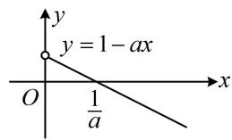

##### 【变式1】设 $f(x) = \mathrm{e}^{2x} - (a - 2)\mathrm{e}^x - ax + 1 (a \in \mathbf{R})$ ，讨论 $f(x)$ 的单调性.

解：由题意， $f'(x)=2\mathrm{e}^{2x}-(a-2)\mathrm{e}^{x}-a=(2\mathrm{e}^{x}-a)(\mathrm{e}^{x}+1)$ ，（此处 $f'(x)$ 虽比例1复杂，但其符号与 $2\mathrm{e}^{x}-a$ 这部分的符号相同， $2\mathrm{e}^{x}-a=0\Leftrightarrow2\mathrm{e}^{x}=a$ ，如图，该因式是否有零点由a的正负决定，故据此讨论）

①当 $a \leq 0$ 时， $2e^{x} - a > 0$ ， $e^{x} + 1 > 0$ ，

所以 $f'(x) > 0$ ，故 $f(x)$ 在 $\mathbf{R}$ 上单调递增；

②当 a > 0 时， $e^{x} + 1 > 0$ ，

所以 $f'(x) > 0 \Leftrightarrow 2\mathrm{e}^{x} - a > 0 \Leftrightarrow x > \ln \frac{a}{2}$ ,

$f ^ {'} (x) <   0 \Leftrightarrow 2 \mathrm{e} ^ {x} - a <   0 \Leftrightarrow x <   \ln \frac {a}{2},$

故 $f(x)$ 在 $\left(-\infty, \ln \frac{a}{2}\right)$ 上单调递减，在 $\left(\ln \frac{a}{2}, +\infty\right)$ 上单调递增.

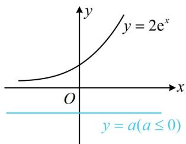

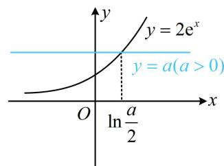

##### 【变式2】已知函数 $f(x) = ax - (a - 1)\ln x + 1(a\in \mathbf{R})$ ，讨论 $f(x)$ 的单调性.

解：由题意， $f'(x)=a-\frac{a-1}{x}=\frac{ax-a+1}{x}$ ，x>0，（由 $f'(x)=0$ 可得 $x=\frac{a-1}{a}$ ，若导函数在定义域内有零点，则 $\frac{a-1}{a}>0$ ，故a<0或a>1，余下即为 $f'(x)$ 在定义域内没有零点的情形，讨论的标准就有了）

①当 $a < 0$ 时，直线 $y = ax - a + 1$ 如图1，由图可知 $f'(x) > 0 \Leftrightarrow 0 < x < \frac{a - 1}{a}$ ， $f'(x) < 0 \Leftrightarrow x > \frac{a - 1}{a}$ ，所以 $f(x)$ 在 $\left(0, \frac{a - 1}{a}\right)$ 上单调递增，在 $\left(\frac{a - 1}{a}, +\infty\right)$ 上单调递减；

②当 $a > 1$ 时，直线 $y = ax - a + 1$ 如图2，由图可知 $f'(x) < 0 \Leftrightarrow 0 < x < \frac{a - 1}{a}$ ， $f'(x) > 0 \Leftrightarrow x > \frac{a - 1}{a}$ ，

所以 $f(x)$ 在 $\left(0, \frac{a - 1}{a}\right)$ 上单调递减，在 $\left(\frac{a - 1}{a}, +\infty\right)$ 上单调递增；

（余下的部分就是 $f'(x)$ 在定义域上无零点的情形，此时 $f'(x)$ 必定不变号）

③当 $0 \leq a \leq 1$ 时， $ax \geq 0$ ， $-a + 1 \geq 0$ ，所以 $ax - a + 1 \geq 0$ ，从而 $f'(x) \geq 0$ ，故 $f(x)$ 在 $(0, +\infty)$ 上单调递增.

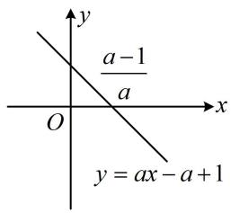

图1

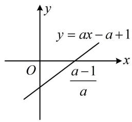

图2

【总结】从例1和上面的几个变式可以看出，当 $f'(x)$ 最多1个零

点时，寻找讨论依据的方法是先令 $f'(x)=0$ ，求出 x，再看它何时在定义域内，何时不在定义域内.

# 类型 II: $f'(x)$ 多个零点的讨论

##### 【例2】已知函数 $f(x) = \frac{1}{3} x^3 + \frac{2a - 1}{2} x^2 - 2ax + 1 (a \in \mathbf{R})$ ，讨论 $f(x)$ 的单调性.

解：由题意， $f'(x) = x^{2} + (2a - 1)x - 2a = (x + 2a)(x - 1)$

(观察发现 $f'(x)$ 有 -2a 和 1 两个零点，但这两个零点的大小不定，所以讨论的依据是零点的大小)

①当 $a < -\frac{1}{2}$ 时， $-2a > 1$ ， $f'(x)$ 的草图如图1， $f'(x) > 0\Leftrightarrow x < 1$ 或 $x > -2a$ ， $f'(x) < 0\Leftrightarrow 1 < x < -2a$   
所以 $f(x)$ 在 $(- \infty, 1)$ 上单调递增，在 $(1, -2a)$ 上单调递减，在 $(-2a, +\infty)$ 上单调递增；  
②当 $a = -\frac{1}{2}$ 时， $f'(x) = (x - 1)^2 \geq 0$ ，所以 $f(x)$ 在 $\mathbf{R}$ 上单调递增；  
③当 $a > -\frac{1}{2}$ 时， $-2a < 1$ ， $f'(x)$ 的草图如图2，

$f'(x) > 0\Leftrightarrow x <   - 2a$ 或 $x > 1$ ， $f'(x) <   0\Leftrightarrow -2a <   x <   1$

所以 $f(x)$ 在 $(- \infty, -2a)$ 上单调递增，在 $(-2a, 1)$ 上单调递减，在 $(1, +\infty)$ 上单调递增.

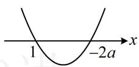  
图1

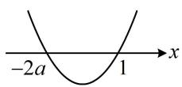  
图2

##### 【变式1】（2021·全国乙卷（节选））已知函数 $f(x) = x^{3} - x^{2} + ax + 1$ ，讨论 $f(x)$ 的单调性.

解：由题意， $f'(x) = 3x^{2} - 2x + a$ ，（本题 $f'(x)$ 不易分解因式， $f'(x)$ 的零点个数由判别式 $\Delta = 4 - 12a$ 的正负决定，故据此讨论，结合求根公式给出单调性）

① 当 $a \geq \frac{1}{3}$ 时， $f'(x) = 3x^2 - 2x + a \geq 3x^2 - 2x + \frac{1}{3} = 3\left(x - \frac{1}{3}\right)^2 \geq 0$ ，所以 $f(x)$ 在 $\mathbf{R}$ 上单调递增；  
②当 $a < \frac{1}{3}$ 时，令 $f'(x) = 0$ 可得 $x = \frac{1 \pm \sqrt{1 - 3a}}{3}$ ，且 $f'(x) > 0 \Leftrightarrow x < \frac{1 - \sqrt{1 - 3a}}{3}$ 或 $x > \frac{1 + \sqrt{1 - 3a}}{3}$ ，

$f'(x) < 0 \Leftrightarrow \frac{1 - \sqrt{1 - 3a}}{3} < x < \frac{1 + \sqrt{1 - 3a}}{3}$ ，所以 $f(x)$ 在 $\left(-\infty, \frac{1 - \sqrt{1 - 3a}}{3}\right)$ 上单调递增，

在 $\left(\frac{1-\sqrt{1-3a}}{3},\frac{1+\sqrt{1-3a}}{3}\right)$ 上单调递减，在 $\left(\frac{1+\sqrt{1-3a}}{3},+\infty\right)$ 上单调递增.

##### 【变式2】(2021·全国乙卷) 设 $a \neq 0$ ，若 $x = a$ 为函数 $f(x) = a(x - a)^2(x - b)$ 的极大值点，则（）

$\quad$A. $a < b$

$\quad$B. $a > b$

$\quad$C. $ab < a^2$

$\quad$D. $ab > a^2$

【解法1】题干涉及极值点，可从 $f'(x)$ 的角度出发分析极值的情况，下面先求导，

由题意， $f'(x) = a[2(x - a)(x - b) + (x - a)^2] = a(x - a)(3x - a - 2b)$ ， $f'(x) = 0 \Rightarrow x = a$ 或 $\frac{a + 2b}{3}$ ，因为 $f(x)$ 有极值, 所以必有 $a \neq \frac{a + 2b}{3}$ , $a$ 的正负影响二次函数开口, 故要判断导函数的正负, 得先讨论 $a$ 的正负, 再由 $x = a$ 是极大值点来判断 $a$ 和 $\frac{a + 2b}{3}$ 的大小,

当 $a > 0$ 时，因为 $x = a$ 是 $f(x)$ 的极大值点，所以 $f'(x)$ 在 $x = a$ 附近应为左正右负，故 $f'(x)$ 的图象如图1，由图可知 $a < \frac{a + 2b}{3}$ ，故 $a < b$ ，两端同乘以 $a$ 可得 $a^2 < ab$ ；

当 $a < 0$ 时，因为 $x = a$ 是 $f(x)$ 的极大值点，所以 $f'(x)$ 在 $x = a$ 附近应为左正右负，故 $f'(x)$ 的图象如图2，由图可知 $a > \frac{a + 2b}{3}$ ，故 $a > b$ ，两端同乘以 $a$ 可得 $a^2 < ab$ ；故选D.

【解法2】: 注意到 $f(x)$ 有 $a$ 和 $b$ 两个零点, 而 $x = a$ 也是 $f(x)$ 的极大值点, 这些都是 $f(x)$ 图象上的关键特征,据此已经能把 $f(x)$ 的大致图象画出来了, 所以本题也可直接从 $f(x)$ 的图象出发考虑, $a$ 的正负不同会导致图象的整体趋势不同, 故讨论 $a$ 的正负,

当 $a > 0$ 时， $f(x) = 0 \Rightarrow x = a$ 或 $b$ ，要使 $x = a$ 是 $f(x)$ 的极大值点，则 $f(x)$ 的大致图象如图3，

由图可知 $a < b$ ，两端同乘以 $a$ 可得 $a^2 < ab$ ；

当 $a < 0$ 时， $f(x) = 0 \Rightarrow x = a$ 或 $b$ ，要使 $x = a$ 是 $f(x)$ 的极大值点，则 $f(x)$ 的大致图象如图4，

由图可知 $a > b$ ，两端同乘以 $a$ 可得 $a^2 < ab$ ；故选D.

答案: D

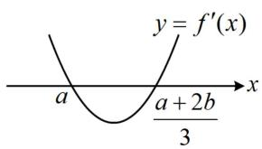

图1

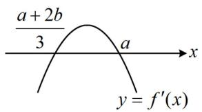

图2

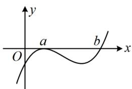

图3

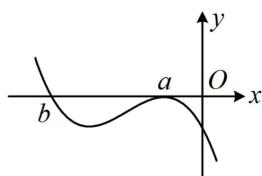

图4

【反思】数形结合是一种重要的思想方法，零点和极值点是三次函数图象上的关键信息，若能从题干分析出这些信息，往往可以结合图象来简化计算过程.

【例 3】(2021·新高考 II 卷（节选）) 已知函数 $f(x)=(x-1)e^{x}-ax^{2}+b$ ，讨论 $f(x)$ 的单调性.

解：由题意， $f'(x)=xe^{x}-2ax=x(e^{x}-2a)$ ，

(观察发现当 $a \leq 0$ 时, 因式 $\mathrm{e}^{x} - 2a$ 无零点; 当 $a > 0$ 时, 该因式有零点, 所以先按 $a$ 的正负讨论)

①当 $a \leq 0$ 时， $\mathrm{e}^x - 2a > 0$ ，所以 $f'(x) > 0 \Leftrightarrow x > 0$ ， $f'(x) < 0 \Leftrightarrow x < 0$

故 $f(x)$ 在 $(- \infty, 0)$ 上单调递减，在 $(0, +\infty)$ 上单调递增；

(当 a > 0 时， $f'(x)$ 有零点 0 和 $\ln(2a)$ ，故讨论的逻辑是比较它们的大小，也即比较 a 与 $\frac{1}{2}$ 的大小)

②当 $0 < a < \frac{1}{2}$ 时, $\ln (2a) < 0$ , (0 和 $\ln (2a)$ 又把实数集划分成三段, 故分三段分别判断 $f'(x)$ 的正负)

若 $x < \ln (2a)$ ，则 $x < 0$ ， $\mathrm{e}^x - 2a < \mathrm{e}^{\ln (2a)} - 2a = 0$ ，所以 $f'(x) > 0$

若 $\ln (2a) < x < 0$ ，则 $\mathrm{e}^x - 2a > \mathrm{e}^{\ln (2a)} - 2a = 0$ ，所以 $f'(x) < 0$

若 $x > 0$ ，则 $\mathrm{e}^x -2a > 1 - 2a > 0$ ，所以 $f'(x) > 0$

故 $f(x)$ 在 $(- \infty, \ln(2a))$ 上单调递增，在 $(\ln(2a), 0)$ 上单调递减，在 $(0, +\infty)$ 上单调递增；

③当 $a = \frac{1}{2}$ 时， $f'(x) = x(\mathrm{e}^x - 1)$ ，若 $x < 0$ ，则 $\mathrm{e}^x - 1 < 0$ ，所以 $f'(x) > 0$ ，

若 $x > 0$ ，则 $\mathrm{e}^x -1 > 0$ ，故 $f'(x) > 0$ ，又 $f'（0） = 0$ ，所以 $f'(x)\geq 0$ 在 $\mathbf{R}$ 上恒成立，故 $f(x)$ 在 $\mathbf{R}$ 上单调递增；

④当 $a > \frac{1}{2}$ 时， $\ln (2a) > 0$ ，若 $x < 0$ ，则 $\mathrm{e}^x - 2a < 1 - 2a < 0$ ，所以 $f'(x) > 0$ ，

若 $0 < x < \ln (2a)$ ，则 $\mathrm{e}^x - 2a < \mathrm{e}^{\ln (2a)} - 2a = 0$ ，所以 $f'(x) < 0$ ，

若 $x > \ln (2a)$ ，则 $x > 0$ ， $\mathrm{e}^x -2a > \mathrm{e}^{\ln (2a)} - 2a = 0$ ，所以 $f'(x) > 0$

故 $f(x)$ 在 $(- \infty, 0)$ 上单调递增，在 $(0, \ln(2a))$ 上单调递减，在 $(\ln(2a), +\infty)$ 上单调递增.

【反思】当 $f'(x)$ 有多个因式时，可先看含参的因式在定义域上是否有零点，作为讨论的依据之一；有零点时，又要和其它因式的零点比较大小，细化讨论。讨论虽然可能复杂，但思维难度并不大，所以题目的条件与问题有时不会给的这么“纯粹”，我们在本节练习题中设置了一些变化，去试试看吧！

# 强化训练

##### 1. (2024·广西模拟·★★)

已知函数 $f(x) = ax - \frac{1}{a} +\ln x$

（1） 讨论 $f(x)$ 的单调性;  
（2）若 $f(x)$ 存在最大值，且最大值小于0，求 $\pmb{a}$ 的取值范围.

##### 2. (★★)

设 $f(x) = \frac{1}{2}\mathrm{e}^{2x} + (2 - a)\mathrm{e}^x - 2ax - 1(a\in \mathbf{R})$ ，讨论

$f(x)$ 的单调性.

##### 3. (★★☆)

已知函数 $f(x) = \frac{2}{3} x^3 +\frac{a - 2}{2} x^2 -ax + 1(a\in \mathbf{R})$ ，讨

论 $f(x)$ 的单调性.

##### 4. (2023·河北石家庄模拟（节选）·★★★)

伯努利不等式，又称贝努力不等式，由数学家伯努利提出：对任意的 $x > -1$ 且 $x \neq 0$ ，正整数 $n$ 不小于2，那么 $(1 + x)^n > 1 + nx$ 。研究发现，伯努利不等式可以推广，请证明：当 $\alpha \in [1, +\infty)$ 时， $(1 + x)^{\alpha} \geq 1 + \alpha x$ 对任意的 $x > -1$ 恒成立。

##### 5. (2024·湖北武汉四调·★★★)

已知函数 $f(x) = \ln x - ax + x^2$

（1）若 $a = -1$ ，求 $f(x)$ 在点 $(1, f(1))$ 处的切线方程；  
（2） 讨论 $f(x)$ 的单调性.

##### 6. (2024·新课标Ⅱ卷·★★★)

已知函数 $f(x) = \mathrm{e}^{x} - ax - a^{3}$

（1）当 $a = 1$ 时，求曲线 $y = f(x)$ 在点 $(1, f(1))$ 处的切线方程；  
（2） 若 $f(x)$ 有极小值, 且极小值小于 0 , 求 $a$ 的取值范围.

##### 7. (★★★)

已知函数 $f(x) = (x - 3)\mathrm{e}^x - ax^2 + 4ax + 1 (a \in \mathbf{R})$ ，讨论 $f(x)$ 的单调性.

