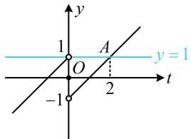
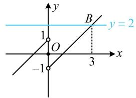
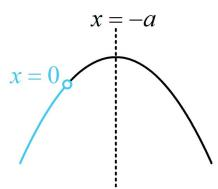
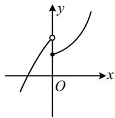
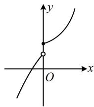
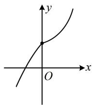
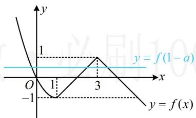
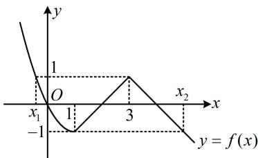

# 强化训练

##### 1. (2021·浙江卷·★)

已知 $a \in \mathbf{R}$ ，函数 $f(x) = \begin{cases} x^2 - 4, & x > 2 \\ |x - 3| + a, & x \leq 2 \end{cases}$ ，若

$f(f(\sqrt{6})) = 3$ ，则 $a =$

##### 1. 2

解析双层函数值计算，先算里面那一层，

由题意， $f(\sqrt{6}) = (\sqrt{6})^2 - 4 = 2$

所以 $f(f(\sqrt{6}))=f(2)=\left|2-3\right|+a=1+a=3$ ，故 a=2 .

##### 2. (2024·江苏南通三模·★☆)

已知函数 $f(x) = \begin{cases} 2^x, & x < 0 \\ \sin \left(2x + \frac{\pi}{6}\right), & x \geq 0 \end{cases}$ ，则 $f\left(f\left(\frac{\pi}{2}\right)\right) =$ \_\_\_\_.

##### 2. $\frac{\sqrt{2}}{2}$

解析由题意， $f\left(\frac{\pi}{2}\right) = \sin \left(2\times \frac{\pi}{2} +\frac{\pi}{6}\right)$

$= \sin \left(\pi + \frac {\pi}{6}\right) = - \sin \frac {\pi}{6} = - \frac {1}{2},$

所以 $f\left(f\left(\frac{\pi}{2}\right)\right) = f\left(-\frac{1}{2}\right) = 2^{-\frac{1}{2}} = \frac{1}{2^{\frac{1}{2}}} = \frac{1}{\sqrt{2}} = \frac{\sqrt{2}}{2}.$

##### 3. (2022·河北模拟·★★)

已知函数 $f(x) = \begin{cases} 2^{x - 1} - 2, & x \leq 1 \\ -\log_2 (x + 1), & x > 1 \end{cases}$ ，且 $f(a) = -3$ ，则 $f(6 - a) = (\quad)$

$\quad$A. $-\frac{7}{4}$

$\quad$B. $-\frac{5}{4}$

$\quad$C. $-\frac{3}{4}$

$\quad$D. $-\frac{1}{4}$

##### 3. A

解析不确定 $a$ 与 1 的大小, 故分类讨论, 代解析式,

若 $a \leq 1$ ，则 $f(a) = 2^{a - 1} - 2 = -3$ ，故 $2^{a - 1} = -1$ ，无解；

若 $a > 1$ ，则 $f(a) = -\log_2(a + 1) = -3$ ，解得： $a = 7$

所以 $f(6 - a) = f(-1) = 2^{-1 - 1} - 2 = -\frac{7}{4}$ .

##### 4. (★★★)

已知 $f(x)$ 是定义在 $\mathbf{R}$ 上的奇函数，当 $x > 0$ 时， $f(x) = x - 1$ ，若 $f(f(x)) = 1$ ，则 $x = \underline{\quad}$ .

##### 4.3

解析看到复合结构的方程，先将内层的 $f(x)$ 换元成 $t$ ，化整为零，令 $t = f(x)$ ，则 $f(f(x)) = 1$ 即为 $f(t) = 1$

因为 $f(x)$ 的解析式较为简单，容易画图，所以可画图象来解方程 $f(t) = 1$ ，

函数 $y = f(t)$ 的图象如图1，直线 $y = 1$ 与该图象只有1个横坐标为2的交点 $A$ ，所以 $t = 2$ ，故 $f(x) = 2$ ，函数 $y = f(x)$ 的图象如图2，直线 $y = 2$ 与该图象只有1个横坐标为3的交点 $B$ ，所以 $x = 3$ .

图1

图2

##### 5. (2017·山东卷·★★★)

设函数 $f(x) = \begin{cases} \sqrt{x}, & 0 < x < 1 \\ 2(x - 1), & x \geq 1 \end{cases}$ ，若 $f(a) = f(a + 1)$ ，则 $f\left(\frac{1}{a}\right) = (\quad)$

$\quad$A. 2 
$\quad$B. 4

$\quad$C. 6 
$\quad$D. 8

##### 5. C

解析代解析式前应先判断 $a$ 和 $a + 1$ 分别在哪一段，若不考虑其它信息，则可能的情况较多，但若注意到 $f(x)$ 的两段分别都 $\nearrow$ ，故若 $a$ 和 $a + 1$ 在同一段，则 $f(a) < f(a + 1)$ ，所以 $a$ 和 $a + 1$ 不可能在同一段，由于 $a < a + 1$ ，所以 $\left\{ \begin{array}{l}0 < a < 1 \\ a + 1 > 1 \end{array} \right.$ ， $f(a) = f(a + 1) \Rightarrow \sqrt{a} = 2(a + 1 - 1)$ ，解得： $a = \frac{1}{4}$ ，

所以 $f\left(\frac{1}{a}\right) = f(4) = 2 \times (4 - 1) = 6.$

##### 6. (2024·新课标Ⅰ卷·★★)

已知函数 $f(x) = \begin{cases} -x^2 - 2ax - a, & x < 0 \\ \mathrm{e}^x + \ln (x + 1), & x \geq 0 \end{cases}$ 在 $\mathbf{R}$ 上单调递增，则 $a$ 的取值范围是（）

$\quad$A. $(- \infty, 0]$

$\quad$B. $[-1,0]$

$\quad$C. $[-1, 1]$

$\quad$D. $[0, +\infty)$

##### 6. B

解析分段函数在 $\mathbf{R}$ 上 $\nearrow$ ，先考虑各段上分别 $\nearrow$

当 $x < 0$ 时， $f(x) = -x^2 - 2ax - a$ ，如图1，

要使 $f(x)$ 在 $(-\infty,0)$ 上 $\nearrow$ ，应有 $-a\geq 0$ ，所以 $a\leq 0$ ①，

当 $x \geq 0$ 时，因为 $y = \mathrm{e}^x$ 和 $y = \ln (x + 1)$ 都 $\nearrow$

所以 $f(x) = \mathrm{e}^{x} + \ln (x + 1)$ 也 $\nearrow$

结束了吗？没有，还需考虑分段点处的拼接情况，图2的情形不满足 $f(x)$ 在R上，图3或图4满足，

要使 $f(x)$ 在 $\mathbf{R}$ 上 $\nearrow$ ，应有 $-0^{2} - 2a\cdot 0 - a\leq \mathrm{e}^{0} + \ln (0 + 1)$

解得： $a \geq -1$ ，结合①得 $a$ 的取值范围是 $[-1, 0]$

图1

  
图2

图3

图4

##### 7. (★★★)

已知函数 $f(x) = \begin{cases} ax - 1, & x \leq 1 \\ \ln (2x^2 - ax), & x > 1 \end{cases}$ 在 $\mathbf{R}$ 上为增函数，则实数 $a$ 的取值范围是 \_\_\_\_.

##### 7. (0,1]

解析 $x > 1$ 那一段有对数，故先考虑定义域的要求，

对任意的 $x \in (1, +\infty)$ ，都有 $2x^{2} - ax > 0$ ，故 $2x - a > 0$ ，

所以 $a < 2x$ ，显然 $2x$ 的取值范围是 $(2, +\infty)$ ，故 $a \leq 2$

再考虑 $f(x)$ 两段各自为增函数，

应有 $\left\{ \begin{array}{l}a > 0\\ \frac{a}{4}\leq 1 \end{array} \right.$ ，所以 $0 < a\leq 4$ ，结合 $a\leq 2$ 得 $0 < a\leq 2$

最后考虑间断点处左右两侧的要求，

应有 $a - 1 \leq \ln(2 - a)$ ，所以 $a - 1 - \ln(2 - a) \leq 0$ ①，

$a = 2$ 不满足不等式①，故只需在(0,2)上求解不等式①，对于超越不等式或超越方程，若能判断单调性，观察出根，则可据此求得结果，

注意到函数 $\varphi(a) = a - 1 - \ln(2 - a)$ 在 $(0,2)$ 上 $\nearrow$

且 $\varphi(1) = 0$ ，所以 $\varphi(a) \leq 0 \Leftrightarrow 0 < a \leq 1$

##### 8. (2022·四川达州二诊·★★★)

已知单调递增的数列 $\{a_{n}\}$ 满足 $a_{n} = \left\{ \begin{array}{l}m^{n - 9},n\geq 10\\ \left(\frac{2m}{9} +1\right)n - 21,n <   10 \end{array} \right.$ ，则实数 $m$ 的取值范围是（）

$\quad$A. $[12, +\infty)$

$\quad$B. (1,12)

$\quad$C. (1,9)

$\quad$D. $[9, +\infty)$

##### 8. B

解析先考虑 $\{a_{n}\}$ 在两段上都单调递增，

由题意，应有 $\left\{ \begin{array}{l} m > 1 \\ \frac{2m}{9} + 1 > 0 \end{array} \right.$ ，所以 $m > 1$ ；

其次，在分段处，应满足 $a_{9} < a_{10}$

所以 $\left(\frac{2m}{9} + 1\right) \times 9 - 21 < m$ ，解得： $m < 12$ ，故 $1 < m < 12$ 。

##### 9. (2024·安徽合肥二模·★★★☆)

已知函数 $f(x) = \begin{cases} x^2 - 2x, & x \leq 1 \\ 1 - |x - 3|, & x > 1 \end{cases}$ ，若关于 $x$ 的方程 $f(x) - f(1 - a) = 0$ 至少有两个不同的实数根，则 $a$ 的取值范围是（）

$\quad$A. $(- \infty, -4] \cup [\sqrt{2}, +\infty)$

$\quad$B. $[-1, 1]$

$\quad$C. $(-4, \sqrt{2})$

$\quad$D. $[-4, \sqrt{2}]$

##### 9. D

解析 $f(x) - f(1 - a) = 0\Leftrightarrow f(x) = f(1 - a)$

此式右边与 $x$ 无关, 可将其整体看成常数, 则题设条件 $\Leftrightarrow$ 水平直线 $y = f(1 - a)$ 与 $f(x)$ 的图象至少有 2 个交点, 故考虑画出 $f(x)$ 的图象来分析. 为了方便画图, 我们先去掉 $x > 1$ 那段解析式的绝对值,

当 $1 < x < 3$ 时， $x - 3 < 0$ ， $f(x) = 1 - (3 - x) = x - 2$ ，当 $x \geq 3$ 时， $x - 3 \geq 0$ ， $f(x) = 1 - (x - 3) = -x + 4$ ，

所以 $f(x) = \left\{ \begin{array}{ll}x^{2} - 2x,x\leq 1\\ x - 2,1 <   x <   3,\\ -x + 4,x\geq 3 \end{array} \right.$

故函数 $f(x)$ 的大致图象如图1所示，

图1

注意到 $f(1) = -1$ ， $f(3) = 1$ ，故要使直线 $y = f(1 - a)$ 与 $f(x)$ 的图象至少有2个交点，则 $-1\leq f(1 - a)\leq 1$ ①，

怎样解上述不等式？已有 $f(x)$ 的图象，可直接结合图象来看，如图2，要使不等式①成立，应有 $x_{1} \leq 1 - a \leq x_{2}$ ，下面求 $x_{1}$ 和 $x_{2}$ ，令 $x^{2} - 2x = 1$ 得 $x = 1 \pm \sqrt{2}$ ，

由图 2 可知 $x_{1}<0$ ，所以 $x_{1}=1-\sqrt{2}$ ，

令 $-x + 4 = -1$ 得 $x = 5$ ，所以 $x_{2} = 5$

故 $1 - \sqrt{2} \leq 1 - a \leq 5$ ，解得： $-4 \leq a \leq \sqrt{2}$

图2

