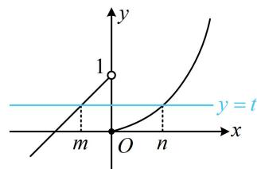
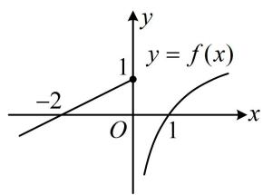
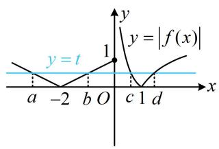

# 第 3 节 等高线问题（★★★☆）

# 内容提要

本节归纳分段函数中的等高线问题. 例如, 题干给出分段函数 $f(x)$ 满足 $f(m) = f(n)$ , 让求某个关于 $m$ 和 $n$ 的式子的取值范围, 这类题常设 $f(m) = f(n) = t$ , 将 $m$ 与 $n$ 都用 $t$ 表示, 再代入目标代数式求范围.

##### 【例题】已知函数 $f(x) = \begin{cases} \mathrm{e}^x - 1, & x \geq 0 \\ x + 1, & x < 0 \end{cases}$ ，若 $m < n$ ，且 $f(m) = f(n)$ ，则 $n - m$ 的最大值是（）

$\quad$A. $\ln 2$

$\quad$B. 1

$\quad$C. 2

$\quad$D. $\ln 3$

解析设 $f(m) = f(n) = t$ ，如图，由图可知 $0 \leq t < 1$ ，且 $m < 0 \leq n$ ，所以 $f(m) = m + 1 = t \Rightarrow m = t - 1$

$f(n) = \mathrm{e}^{n} - 1 = t\Rightarrow n = \ln (t + 1)$ ，故 $n - m = \ln (t + 1) - t + 1$

变量统一了，可把 $n - m$ 看成关于 $t$ 的函数，求导研究最值，

设 $\varphi(t) = \ln (t + 1) - t + 1 (0 \leq t < 1)$ ，则 $\varphi'(t) = \frac{1}{t + 1} - 1 = -\frac{t}{t + 1} \leq 0$ ，

所以 $\varphi(t)$ 在 $[0,1)$ 上 $\searrow$ ，从而 $\varphi(t)_{\max} = \varphi(0) = 1$ ，故 $n - m$ 的最大值为 1.

答案: B

【总结】如果分段函数下出现了函数值相等条件，如 $f(m)=f(n)$ ，或 $f(a)=f(b)=f(c)$ ，这类问题我们称为等高线问题，往往会将这个“高”设出来，达到消元的目的。如本题我们令 $f(m)=f(n)=t$ ，进而将 m 与 n 都用一个变量 t 表示出来，后续的分析就方便了。

##### 【变式】已知函数 $f(x) = \begin{cases} \frac{1}{2} x + 1, & x \leq 0 \\ \lg x, & x > 0 \end{cases}$ ，若存在不相等的实数 $a, b, c, d$ 满足 $|f(a)| = |f(b)| = |f(c)| = |f(d)|$ ，则 $a + b + c + d$ 的取值范围为（）

$\quad$A. $(0, +\infty)$

$\quad$B. $\left(-2,\frac{81}{10}\right]$

$\quad$C. $\left(-2,\frac{61}{10}\right]$

$\quad$D. $\left(0, \frac{81}{10}\right]$

解析条件给的是函数 $y = |f(x)|$ 在 $a, b, c, d$ 处函数值相等，故用 $y = |f(x)|$ 的图象来分析问题，先画图，函数 $y = f(x)$ 的大致图象如图1， $y = |f(x)|$ 的大致图象如图2，设 $|f(a)| = |f(b)| = |f(c)| = |f(d)| = t$ ，

不妨设 $a < b < c < d$ ，由图2知 $0 < t \leq 1$ ， $0 < c < 1 < d$

直线 $y = t$ 与 $y = |f(x)|$ 的图象在 $y$ 轴左侧的两个交点关于直线 $x = -2$ 对称，所以 $a + b = -4$

再来看 $c$ 和 $d$ , 可将 $\left|f(c)\right|=t$ 和 $\left|f(d)\right|=t$ 代入解析式, 把 $c, d$ 用 $t$ 表示, 从而统一变量,

因为 $0 < c < 1$ ，所以 $\lg c < 0$ ，从而 $\left|f(c)\right| = \left|\lg c\right| = -\lg c = t$ ，故 $c = 10^{-t}$

又因为 $d > 1$ ，所以 $\lg d > 0$ ，从而 $\left|f(d)\right| = \left|\lg d\right| = \lg d = t$ ，故 $d = 10^{t}$ ，所以 $a + b + c + d = -4 + 10^{-t} + 10^{t}$

注意到 $10^{-t}=\frac{1}{10^{t}}$ ，故将 $10^{t}$ 换元，可简化表达式，

令 $u = 10^{t}$ ，则 $1 < u \leq 10$ ，且 $a + b + c + d = -4 + \frac{1}{u} + u$

设 $\varphi(u) = -4 + \frac{1}{u} + u (1 < u \leq 10)$ ，则 $\varphi'(u) = -\frac{1}{u^2} + 1 > 0$ ，

所以 $\varphi(u)$ 在 $(1,10]$ 上 $\nearrow$ ,

又 $\varphi(1) = -2$ ， $\varphi(10) = \frac{61}{10}$ ，所以 $\varphi(u)$ 的值域为 $\left(-2, \frac{61}{10}\right]$ ，

故 $a + b + c + d$ 的取值范围是 $\left(-2, \frac{61}{10}\right]$ .

图1

图2

答案: C

【反思】题干中关于 $|f(a)|$ 的连等式容易让人困扰，但为了使该条件与已知函数形式统一，自然想到研究函数 $y = |f(x)|$ ；另外，若函数有对称性，结合对称性往往能简化步骤，本题 $a + b$ 就是通过对称性快速求出的.

# 强化训练

##### 1. (2022·江西赣州期末·★★★)

已知函数 $f(x) = \begin{cases} \frac{1}{\mathrm{e}} (x + 2), & x < 1 \\ \ln x, & x \geq 1 \end{cases}$ ，若 $f(x_{1}) = f(x_{2})$ ，且 $x_{2} > x_{1}$ ，则 $x_{2} - x_{1}$ 的最小值为 \_\_\_\_.

##### 2. (2023·湖北八市联考·★★★☆)

已知函数 $f(x) = \begin{cases} -x^2 - 2x, & x \leq 0 \\ |1 - \ln x|, & x > 0 \end{cases}$ ，若 $f(x) = m$ 存在四个不相等的实根 $x_1, x_2, x_3, x_4$ ，且 $x_1 < x_2 < x_3 < x_4$ ，则 $x_4 - (x_1 + x_2)x_3$ 的最小值是 \_\_\_\_.

