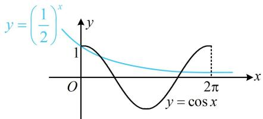
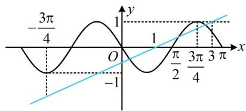
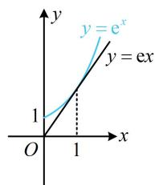
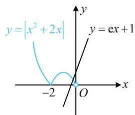
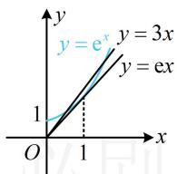
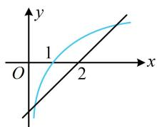
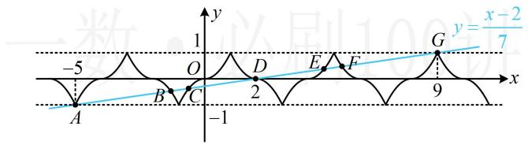

# 强化训练

##### 1. (2022·四川模拟·★★)

已知函数 $f(x) = \left(\frac{1}{2}\right)^x - \cos x$ ，则 $f(x)$ 在 $[0, 2\pi]$ 上的零点个数为（）

$\quad$A. 4

$\quad$B. 3

$\quad$C. 2

$\quad$D. 1

##### 1. B

解析直接分析 $f(x)$ 的零点不易，考虑将 $f(x) = 0$ 变形，便于作图分析交点个数， $f(x) = 0 \Leftrightarrow \left(\frac{1}{2}\right)^x = \cos x$

作出 $y = \left(\frac{1}{2}\right)^x$ 和 $y = \cos x$ 在 $[0, 2\pi]$ 上的图象如图，

两图象有3个交点 $\Rightarrow f(x)$ 在 $[0,2\pi]$ 上有3个零点.

##### 2. (2023·全国甲卷·★★★)

已知 $f(x)$ 为函数 $y = \cos \left(2x + \frac{\pi}{6}\right)$ 的图象向左平移 $\frac{\pi}{6}$ 个单位长度后所得图象的函数，则 $y = f(x)$ 的图象与直线 $y = \frac{1}{2} x - \frac{1}{2}$ 的交点个数为（一）

$\quad$A. 1

$\quad$B. 2

$\quad$C. 3

$\quad$D. 4

##### 2. C

解析由题意， $f(x) = \cos \left[2\left(x + \frac{\pi}{6}\right) + \frac{\pi}{6}\right] = \cos \left(2x + \frac{\pi}{2}\right)$

$=-\sin2x,\quad f(x)$ 的最小正周期 $T=\pi$ ，

如图，容易看出 $y$ 轴左侧二者没有交点，而 $y$ 轴右侧， $y = -\sin 2x$ 在直线 $y = 1$ 上方没有图象，故可抓住蓝色直线穿出 $y = 1$ 的位置来分析，

在 $y = \frac{1}{2} x - \frac{1}{2}$ 中令 $y = 1$ 可得 $x = 3$ ，如图， $\frac{3\pi}{4} < 3 < \pi$

所以直线 $y = \frac{1}{2} x - \frac{1}{2}$ 与 $f(x)$ 的图象共3个交点.

##### 3. (★★★)

设 $f(x) = \begin{cases} \mathrm{e}^x + 1, & x \geq 0 \\ |x^2 + 2x|, & x < 0 \end{cases}$ ，则 $g(x) = f(x) - \mathrm{e}x - 1$ 的零点个数为（）

$\quad$A. 4

$\quad$B. 3

$\quad$C. 2

$\quad$D. 1

##### 3. C

解析分段函数研究零点个数，可分段考虑，

当 $x \geq 0$ 时， $g(x) = f(x) - \mathrm{e}x - 1 = \mathrm{e}^x - \mathrm{e}x$

所以 $g(x) = 0 \Leftrightarrow \mathrm{e}^x = \mathrm{e}x$ ，接下来借助图象分析交点，

如图1，直线 $y = \mathrm{e}x$ 与曲线 $y = \mathrm{e}^x$ 正好相切于 $x = 1$ 处，它们只有1个交点 $\Rightarrow g(x)$ 在 $[0, +\infty)$ 上有1个零点；

当 $x < 0$ 时， $g(x) = 0 \Leftrightarrow |x^2 + 2x| = \mathrm{e}x + 1$

此方程不易求解，故作图看交点，

如图2，由图可知直线 $y = \mathrm{e}x + 1$ 与函数 $y = \left|x^{2} + 2x\right|(x < 0)$ 的图象有1个交点，所以 $g(x)$ 在 $(- \infty, 0)$ 上有1个零点，故 $g(x)$ 共有2个零点.

图1

图2

【反思】本题若将 $g(x)=f(x)-\mathrm{e}x-1$ 换成 $g(x)=f(x)-3x-1$ ，你会做吗？在 $[0,+\infty)$ 上，原来的曲线 $y=e^{x}$ 的切线 $y=ex$ 变成割线 y=3x，如图3，交点增加1个.

  
图3

##### 4. (2023·四川绵阳二诊·★★★☆)

若函数 $f(x) = \begin{cases} 2 + \ln x, & x > 0 \\ x, & x \leq 0 \end{cases}$ ， $g(x) = f(x) + f(-x)$ ，则函数 $g(x)$ 的零点个数为 \_\_\_\_.

##### 4.5

解析若先求 $g(x)$ 的解析式，再来分析零点，则较麻烦，注意到 $g(x)$ 为偶函数，故可用对称性来简化分析，

因为 $g(-x) = f(-x) + f(x) = g(x)$ ，所以 $g(x)$ 为偶函数，

下面先看 $g(x)$ 在 $[0, +\infty)$ 上的零点个数，

首先， $g(0) = 2f(0) = 0$ ，所以0是 $g(x)$ 的一个零点，

其次，当 $x > 0$ 时， $-x < 0$ ，所以 $g(x) = f(x) + f(-x)$

$= 2 + \ln x + (- x) = 2 + \ln x - x,$

此时零点无法求出，故变形后画图看交点，

$g(x) = 0\Leftrightarrow x - 2 = \ln x$ ，函数 $y = x - 2$ 和 $y = \ln x$ 的大致

图象如图，由图可知 $g(x)$ 在 $(0, +\infty)$ 上有2个零点，结合偶函数的图象关于 $y$ 轴对称可知 $g(x)$ 在 $(- \infty, 0)$ 上有2个零点；综上所述， $g(x)$ 共有5个零点.

【反思】遇见 $f(x) \pm f(-x)$ 这类函数，一般可先分析其奇偶性，把研究的范围缩小在 $[0, +\infty)$ 上. 后面还会遇到.

##### 5. (2022·江西南昌模拟·★★★☆)

定义在 $\mathbf{R}$ 上的函数 $f(x)$ 满足 $f(-x) + f(x) = 0$ ， $f(x) = f(2 - x)$ ，且当 $x \in [0,1]$ 时， $f(x) = x^2$ ，则函数 $y = 7f(x) - x + 2$ 的所有零点之和为（）

$\quad$A. 7 
$\quad$B. 14 
$\quad$C. 21 
$\quad$D. 28

##### 5. B

解析 $7f(x)-x+2=0\Leftrightarrow f(x)=\frac{x-2}{7}$

为了作图，先由已知条件分析 $f(x)$ 的性质，

$f(-x) + f(x) = 0 \Rightarrow f(x)$ 为奇函数，所以 $f(x)$ 的图象关于原点对称，

又 $f(x) = f(2 - x)$ ，所以 $f(x)$ 的图象关于直线 $x = 1$ 对称，

从而 $f(x)$ 是以4为周期的周期函数，

结合当 $x \in [0,1]$ 时， $f(x) = x^2$ 可作出 $f(x)$ 的图象如图，

注意到 $f(x)$ 只在直线 $y = -1$ 和 $y = 1$ 之间有图象，故作图时注意直线 $y = \frac{x - 2}{7}$ 穿出此两水平线的位置，

由图可知两图象有 $A, B, C, D, E, F, G$ 共7个交点，

因为两个图象都关于点(2,0)对称，所以它们的交点也关于点(2,0)对称，从而 $A$ 与 $G$ ， $B$ 与 $F$ ， $C$ 与 $E$ 都关于 $D(2,0)$ 对称，故

$\frac {x _ {A} + x _ {G}}{2} = 2, \quad \frac {x _ {B} + x _ {F}}{2} = 2, \quad \frac {x _ {C} + x _ {E}}{2} = 2,$

所以 $x_{A} + x_{B} + x_{C} + x_{D} + x_{E} + x_{F} + x_{G} = 4\times 3 + 2 = 14$

即函数 $y=7f(x)-x+2$ 的所有零点之和为 14.

