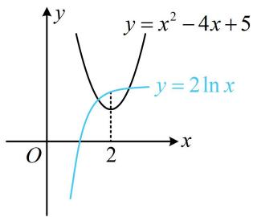
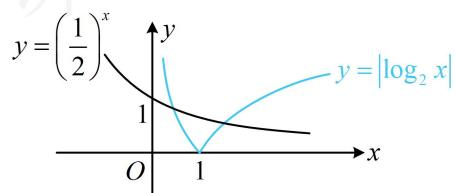
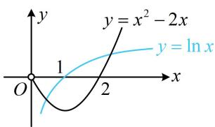
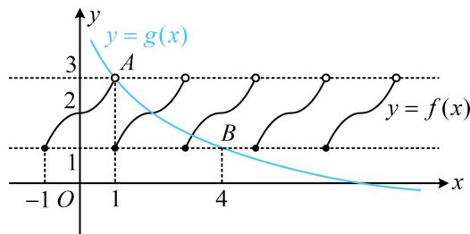
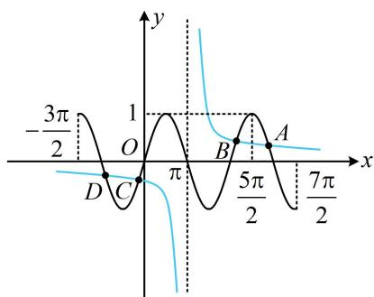

# 模块五 零点与不等式

# 第1节 函数零点小题策略：不含参（★★☆）

# 内容提要

不含参的函数零点小题一般有两种处理方法：

##### 1. 令 $f(x) = 0$ ，解方程，得出零点个数。

##### 2. 若方程 $f(x) = 0$ 不好解，可将其等价变形成 $g(x) = h(x)$ ，则 $y = g(x)$ 和 $y = h(x)$ 图象的交点个数，即为 $f(x)$ 的零点个数。等价变形成什么样子，应该以便于作图分析为考虑方向。

##### 【例1】函数 $f(x) = 2\ln x$ 的图象与 $g(x) = x^{2} - 4x + 5$ 的图象的交点个数为（）

$\quad$A. 3

$\quad$B. 2

$\quad$C. 1

$\quad$D. 0

解析直接画图看交点，因为 $g(x)$ 的对称轴是 $x = 2$ ，所以画图时应重点关注这个位置，

如图，因为 $f(2) = 2\ln 2 > g(2) = 1$ ，所以两图象有2个交点.

答案: B

【例 2】函数 $f(x)=2^{x}\cdot\left|\log_{2}x\right|-1$ 的零点个数为 \_\_\_\_.

解析 $f(x)$ 的图象不好画，故考虑先将 $f(x)=0$ 等价变形，把 $2^{x}$ 和 $\left|\log_{2}x\right|$ 分开，再画图看交点，

$f (x) = 0 \Leftrightarrow 2 ^ {x} \cdot \left| \log_ {2} x \right| - 1 = 0 \Leftrightarrow \left| \log_ {2} x \right| = \left(\frac {1}{2}\right) ^ {x},$

如图，两图象有2个交点 $\Rightarrow f(x)$ 有2个零点.

答案: 2

【反思】当直接画 $f(x)$ 的图象来看零点个数不方便时, 可考虑将方程 $f(x)=0$ 等价变形成 $g(x)=h(x)$ 的形式, 画 $g(x)$ 和 $h(x)$ 的图象看交点个数, 变形应注意 “等价” 和 “作图方便” 两点.

##### 【变式】函数 $f(x)=\left\{\begin{aligned}&4x+1,x\leq0\\&\ln x-x^{2}+2x,x>0\end{aligned}\right.$ 的零点个数为 \_\_\_\_.

解析研究分段函数的零点个数，可分段来看，第一段比较简单，直接解方程 $f(x) = 0$ ，

当 $x \leq 0$ 时， $f(x) = 4x + 1 = 0 \Rightarrow x = -\frac{1}{4} \Rightarrow f(x)$ 在 $(- \infty, 0]$ 上有 1 个零点；

第二段的零点解不出来，所以等价变形，再画图看交点，

当 $x > 0$ 时， $f(x) = \ln x - x^2 + 2x = 0 \Leftrightarrow \ln x = x^2 - 2x$

作出 $y = \ln x$ 和 $y = x^{2} - 2x(x > 0)$ 的大致图象如图，

由图可知二者有2个交点，所以 $f(x)$ 在 $(0, +\infty)$ 上有2个零点；

故 $f(x)$ 共有3个零点.

答案3

【反思】分段函数的零点可分段研究，在每一段上，若零点能求出，则直接求，否则等价变形看交点.

【例 3】定义在 R 上的函数 $f(x)$ 周期为 2，当 $-1 \leq x < 1$ 时， $f(x) = \begin{cases} x^{2} + 2, & 0 \leq x < 1 \\ 2 - x^{2}, & -1 \leq x < 0 \end{cases}$ ，设 $g(x) = 3 - \log_{2} x$ ，则函数 $y = f(x) - g(x)$ 的零点个数为（）

$\quad$A. 1 
$\quad$B. 2 
$\quad$C. 3 
$\quad$D. 4

解析: $f(x) - g(x) = 0 \Leftrightarrow f(x) = g(x)$ , 下面作图看交点, 由于 $f(x)$ 只在直线 $y = 1$ 和 $y = 3$ 之间部分有图象, 所以作图时需注意 $g(x)$ 的图象与该两直线的交点 $A, B$ 的位置,

令 $g(x) = 3$ 可得 $3 - \log_2 x = 3$ ，所以 $x = 1$ ，故 $A(1,3)$ ；

令 $g(x) = 1$ 可得 $3 - \log_2 x = 1$ ，所以 $x = 4$ ，故 $B(4,1)$ ，

所以 $y = f(x)$ 和 $y = g(x)$ 的大致图象如图，

由图可知它们有 2 个交点，故选 B.

答案: B

【反思】务必注意空心点和实心点，空心点处必定不是交点.

##### 【变式】函数 $f(x) = 1 - (x - \pi)\sin x$ 在区间 $\left[-\frac{3\pi}{2},\frac{7\pi}{2}\right]$ 上的所有零点之和为（）

$\quad$A. 0 
$\quad$B. $2 \pi$ 
$\quad$C. $4 \pi$ 
$\quad$D. $6 \pi$

解析零点无法求出， $f(x)$ 的图象也不好画，故考虑等价变形看交点， $f(x)=0\Leftrightarrow(x-\pi)\sin x=1$ ①，为了便于作图，把 $x-\pi$ 除过去，先考虑其能否为 0，当 $x=\pi$ 时，方程①不成立；

当 $x \neq \pi$ 时，方程①等价于 $\sin x = \frac{1}{x - \pi}$ ，接下来作图看交点，

不难发现 $y = \sin x$ 和 $y = \frac{1}{x - \pi}$ 的图象都关于点 $(\pi, 0)$ 对称，所以它们的交点也关于点 $(\pi, 0)$ 对称，

曲线 $y = \sin x$ 的波峰与 $y = \frac{1}{x - \pi}$ 的位置关系对判断交点个数很重要，故应抓住 $x = \frac{5\pi}{2}$ 这个关键位置，

当 $x = \frac{5\pi}{2}$ 时， $\frac{1}{x - \pi} = \frac{2}{3\pi} <   \sin x = 1$ ，所以两图象如图，

由图可知它们共有 $A, B, C, D$ 这4个交点，

其中 $A$ 与 $D$ ， $B$ 与 $C$ 关于 $(\pi ,0)$ 对称，所以 $\frac{x_A + x_D}{2} = \pi$ ， $\frac{x_B + x_C}{2} = \pi$

故 $x_{A} + x_{B} + x_{C} + x_{D} = 4\pi$ ，即 $f(x)$ 在 $\left[-\frac{3\pi}{2},\frac{7\pi}{2}\right]$ 上所有零点之和为 $4\pi$

答案: C

【反思】当题干让求零点之和时，可以考虑利用图象的对称性求解.

# 强化训练

##### 1. (2022·四川模拟·★★)

已知函数 $f(x) = \left(\frac{1}{2}\right)^x - \cos x$ ，则 $f(x)$ 在 $[0, 2\pi]$ 上的零点个数为（）

$\quad$A. 4 
$\quad$B. 3 
$\quad$C. 2 
$\quad$D. 1

##### 2. (2023·全国甲卷·★★★)

已知 $f(x)$ 为函数 $y = \cos \left(2x + \frac{\pi}{6}\right)$ 的图象向左平移 $\frac{\pi}{6}$ 个单位长度后所得图象的函数，则 $y = f(x)$ 的图象与直线 $y = \frac{1}{2} x - \frac{1}{2}$ 的交点个数为（）

$\quad$A. 1

$\quad$B. 2

$\quad$C. 3

$\quad$D. 4

##### 3. (★★★)

设 $f(x) = \left\{ \begin{array}{l} \mathrm{e}^{x} + 1, x \geq 0 \\ \left| x^{2} + 2x \right|, x < 0 \end{array} \right.$ ，则 $g(x) = f(x) - \mathrm{e}x - 1$ 的零点个数为（）

$\quad$A. 4

$\quad$B. 3

$\quad$C. 2

$\quad$D. 1

##### 4. (2023·四川绵阳二诊·★★★☆)

若函数 $f(x) = \begin{cases} 2 + \ln x, & x > 0 \\ x, & x \leq 0 \end{cases}$ ， $g(x) = f(x) + f(-x)$ ，则函数 $g(x)$ 的零点个数为 \_\_\_\_.

##### 5. (2022·江西南昌模拟·★★★☆)

定义在 $\mathbf{R}$ 上的函数 $f(x)$ 满足 $f(-x) + f(x) = 0$ ， $f(x) = f(2 - x)$ ，且当 $x \in [0,1]$ 时， $f(x) = x^2$ ，则函数 $y = 7f(x) - x + 2$ 的所有零点之和为（）

$\quad$A. 7

$\quad$B. 14

$\quad$C. 21

$\quad$D. 28

