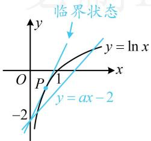
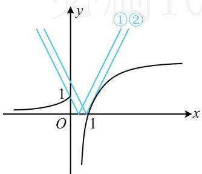

# 强化训练

# 1. (★★☆)

存在 $x > 0$ ，使得 $\ln x - ax + 2 > 0$ ，则实数 $a$ 的取值范围为

##### 1. $(- \infty, e)$

解法 1: 所给不等式的 $a$ 能完全分离出来, 先尝试全分离,

$\ln x - a x + 2 > 0 \Leftrightarrow a x <   2 + \ln x \Leftrightarrow a <   \frac {2 + \ln x}{x},$

所以问题等价于存在 $x > 0$ ，使得 $a < \frac{2 + \ln x}{x}$

故只需求右侧的最大值，可构造函数求导分析，

设 $f(x) = \frac{2 + \ln x}{x} (x > 0)$ ，则 $f'(x) = -\frac{1 + \ln x}{x^{2}}$

所以 $f'(x) > 0 \Leftrightarrow 0 < x < \mathrm{e}^{-1}$ , $f'(x) < 0 \Leftrightarrow x > \mathrm{e}^{-1}$ ,

从而 $f(x)$ 在 $(0, \mathrm{e}^{-1})$ 上 $\nearrow$ ，在 $(\mathrm{e}^{-1}, +\infty)$ 上 $\searrow$ ，

故 $f(x)_{\mathrm{max}} = f(\mathbf{e}^{-1}) = \mathbf{e}$ ，所以 $a <   \mathbf{e}$

【解法2】将 $\ln x - ax + 2 > 0$ 中的 $-ax + 2$ 移至右侧，就能作图分析，故也可尝试半分离， $\ln x - ax + 2 > 0 \Leftrightarrow \ln x > ax - 2$

如图，临界状态为 $y = ax - 2$ 恰与曲线 $y = \ln x$ 相切的情形，先求此临界状态。直线 $y = ax - 2$ 过定点(0, -2)，所以先求曲线 $y = \ln x$ 过点(0, -2)的切线，不知道切点，故设切点，

设切点为 $P(x_0, \ln x_0)$ ，因为 $(\ln x)' = \frac{1}{x}$ ，所以曲线 $y = \ln x$ 在点 $P$ 处的切线方程为 $y - \ln x_0 = \frac{1}{x_0}(x - x_0)$ ，

将点 $(0, -2)$ 代入可得： $-2 - \ln x_0 = \frac{1}{x_0} (0 - x_0)$

解得： $x_0 = \mathrm{e}^{-1}$ ，所以切线的斜率为 $\mathbf{e}$

由图可知，当且仅当 $a < \mathrm{e}$ 时，曲线 $y = \ln x$ 才有位于直线 $y = ax - 2$ 上方的部分，也即存在 $x > 0$ ，使 $\ln x > ax - 2$ 成立，所以 $a < \mathrm{e}$

# 2.（2023·新课标Ⅱ卷·★★★）

已知函数 $f(x) = ae^{x} - \ln x$ 在区间(1,2)单调递增，则 $a$ 的最小值为（）

$\quad$A. $\mathrm{e}^2$

$\quad$B. e

$\quad$C. $\mathrm{e}^{-1}$

$\quad$D. $\mathrm{e}^{-2}$

##### 2. C

解析 $f(x)$ 的解析式较复杂，看不出单调性，故求导，

由题意， $f'(x)=ae^{x}-\frac{1}{x}$ ，因为 $f(x)$ 在 $(1,2)$ 上 $\nearrow$ ，

所以 $f'(x) \geq 0$ 在 $(1,2)$ 上恒成立，即 $ae^{x} - \frac{1}{x} \geq 0$ ①，

观察发现参数 $a$ 容易分离出来，故可尝试用全分离处理，

不等式①等价于 $a \geq \frac{1}{x\mathrm{e}^x}$ ，令 $g(x) = x\mathrm{e}^{x}(1 < x < 2)$ ，

则 $g'(x) = (x + 1)\mathrm{e}^{x} > 0$ ，所以 $g(x)$ 在(1,2)上

又 $g(1) = \mathbf{e}$ ， $g(2) = 2\mathrm{e}^2$ ，所以 $g(x)\in (\mathrm{e},2\mathrm{e}^2)$

故 $\frac{1}{g(x)} = \frac{1}{xe^x}\in \left(\frac{1}{2\mathrm{e}^2},\frac{1}{\mathrm{e}}\right)$ ，因为 $a\geq \frac{1}{xe^x}$ 在(1,2)上恒成立，

所以 $a \geq \frac{1}{\mathrm{e}} = \mathrm{e}^{-1}$ ，故 $a$ 的最小值为 $\mathrm{e}^{-1}$ .

##### 3. (2022·天津模拟·★★★☆)

函数 $f(x) = \begin{cases} \mathrm{e}\ln x, & x > 0 \\ \mathrm{e}^x, & x \leq 0 \end{cases}$ ，若不等式 $f(x) \leq 2|x - a|$ 恒成立，则实数 $a$ 的取值范围为 \_\_\_\_.

##### 3. $\left[\frac{1}{2},\frac{\mathrm{e}\ln 2}{2}\right]$

解析参数 $a$ 在绝对值内，不易分离，考虑直接作图分析，

作出 $y = f(x)$ 和 $y = 2|x - a|$ 的图象如图，临界状态为图中

的①和②，

对于①，折线 $y = 2|x - a|$ 左侧部分 $y = 2(a - x)$ 过点(0,1)，

所以 $1 = 2(a - 0)$ ，解得： $a = \frac{1}{2}$

对于②， $y=2|x-a|$ 右侧部分 $y=2(x-a)$ 与 $y=e\ln x$ 相切，

因为 $(\mathrm{e}\ln x)' = \frac{\mathrm{e}}{x}$ ，所以令 $\frac{\mathrm{e}}{x} = 2$ 得： $x = \frac{\mathrm{e}}{2}$

故切点为 $\left(\frac{\mathrm{e}}{2},\mathrm{e}\ln \frac{\mathrm{e}}{2}\right)$ ，代入 $y = 2(x - a)$ 可解得： $a = \frac{\mathrm{e}\ln 2}{2}$

由图可知，当且仅当 $\frac{1}{2} \leq a \leq \frac{\mathrm{e}\ln 2}{2}$ 时， $f(x) \leq 2|x - a|$ 恒成

立，所以 $a$ 的取值范围为 $\left[\frac{1}{2},\frac{\mathrm{e}\ln 2}{2}\right]$

##### 4. (2022·江西南昌三模·★★★☆)

已知 $a$ 和 $x$ 是正数，若不等式 $x^{\frac{1}{a}} \geq a^{\frac{1}{x}}$ 恒成立，则 $a$ 的取值范围是（）

$\quad$A. $\left(0, \frac{1}{\mathrm{e}}\right]$

$\quad$B. $\left[\frac{1}{e},1\right)$

$\quad$C. $\left[\frac{1}{\mathrm{e}}, 1\right) \cup (1, \mathrm{e})$

$\quad$D. $\left\{\frac{1}{\mathrm{e}}\right\}$

##### 4. D

解析原不等式左右两侧均为指数结构，参数不易分离，也不好直接画图分析，可考虑先取对数，将指数剥离下来再看，由题意， $x^{\frac{1}{a}} \geq a^{\frac{1}{x}} \Leftrightarrow \ln x^{\frac{1}{a}} \geq \ln a^{\frac{1}{x}} \Leftrightarrow \frac{1}{a} \ln x \geq \frac{1}{x} \ln a$

$\Leftrightarrow x\ln x \geq a\ln a$ ，此时参数 $a$ 已经全分离了，而且比较巧妙的是左右两侧恰好同构，可构造函数分析，

设 $f(x) = x\ln x(x > 0)$ ，则 $f'(x) = \ln x + 1$ 所以 $f'(x) > 0\Leftrightarrow x > \frac{1}{\mathfrak{e}}$ ， $f'(x) <   0\Leftrightarrow 0 <   x <   \frac{1}{\mathfrak{e}}$

从而 $f(x)$ 在 $\left(0, \frac{1}{\mathrm{e}}\right)$ 上单调递减，在 $\left(\frac{1}{\mathrm{e}}, +\infty\right)$ 上单调递增，

故 $f(x)_{\min} = f\left(\frac{1}{\mathbf{e}}\right) = -\frac{1}{\mathbf{e}}$ ，因为 $x\ln x\geq a\ln a$ 恒成立，

所以 $f(x)\geq f(a)$ ，从而 $f(a)$ 是 $f(x)$ 的最小值，故 $a = \frac{1}{\mathrm{e}}$

##### 5. (2023·全国乙卷·★★★★)

设 $a \in (0,1)$ 若函数 $f(x) = a^x + (1 + a)^x$ 在 $(0, +\infty)$ 上单调递增，则 $a$ 的取值范围是 \_\_\_\_.

##### 5. $\left[\frac{\sqrt{5} - 1}{2}, 1\right)$

解析直接分析 $f(x)$ 的单调性不易，可求导来看，

由题意， $f'(x)=a^{x}\ln a+(1+a)^{x}\ln(1+a)$ ，

因为 $f(x)$ 在 $(0, +\infty)$ 上 $\nearrow$ ，所以 $f'(x) \geq 0$ 在 $(0, +\infty)$ 上恒

成立，即 $a^x\ln a + (1 + a)^x\ln (1 + a)\geq 0$

观察发现参数 $a$ 较多，没法集中，但 $x$ 只有两处，且观察发现可同除以 $a^x$ 把含 $x$ 的部分集中起来，故按此处理，

所以 $\ln a + \frac{(1 + a)^x}{a^x}\ln (1 + a)\geq 0$

故 $\ln a + \left(1 + \frac{1}{a}\right)^x\ln (1 + a)\geq 0$ ①，

想让①恒成立，只需左侧最小值≥0，故分析其单调性，

因为 $1+\frac{1}{a}>1$ ， $1+a>1$ ，所以 $\ln(1+a)>0$ ，

从而 $y = \ln a + \left(1 + \frac{1}{a}\right)^x\ln (1 + a)$ 在 $(0, + \infty)$ 上 $\nearrow$

故 $\ln a + \left(1 + \frac{1}{a}\right)^x\ln (1 + a) > \ln a + \left(1 + \frac{1}{a}\right)^0\ln (1 + a)$

$= \ln a + \ln (1 + a),$

所以①恒成立 $\Leftrightarrow \ln a + \ln (1 + a)\geq 0$ ，从而 $\ln [a(1 + a)]\geq 0$

故 $a(1 + a)\geq 1$ ，结合 $0 <   a <   1$ 解得： $\frac{\sqrt{5} - 1}{2}\leq a <   1.$

【反思】有的时候变量不易分离，如本题的 $a$ 和 $x$ ，那就不分离，直接变形成易分析的形式来研究函数.

