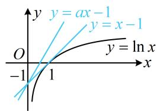
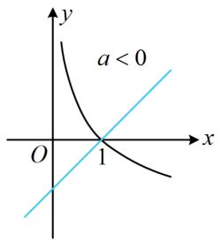
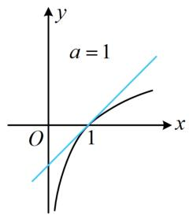
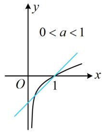
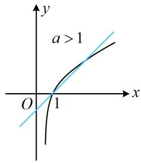
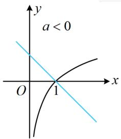
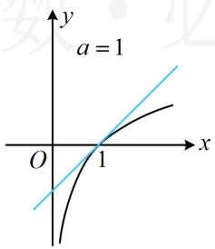
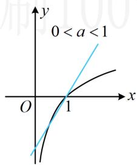
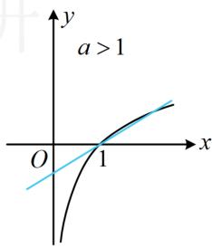
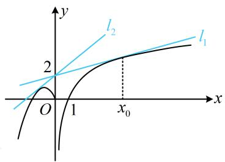

# 内容提要

本节主要涉及含参不等式恒成立、存在性问题，难度整体偏高.

##### 1. 含参不等式小题常用的解题方法和上一节类似，有全分离和半分离两种：

①全分离: 将原含参不等式等价变形成 $a \leq f(x)$ 这类形式, 进而转化为求 $f(x)$ 的最值问题. 当参变分离后的函数 $f(x)$ 不复杂, 容易求最值时, 可采用此法.  
② 半分离：将原含参不等式等价变形成 $f(x) \leq g(a, x)$ 这类形式，画图分析参数 $a$ 如何取值才能满足该不等式，这种方法往往需要关注切线、端点等临界状态.

##### 2. 全分离后几种常见情况的处理方法：（假设以下涉及到的 $f(x)$ 的最值均存在）

① $\forall x\in D,\quad a\leq f(x)$ 恒成立，则 $a\leq f(x)_{\min}$ ；② $\exists x\in D$ ，使 $a\leq f(x)$ 成立，则 $a\leq f(x)_{\max}$ ;  
③ $\forall x\in D$ ， $a\geq f(x)$ 恒成立，则 $a\geq f(x)_{\max}$ ；④ $\exists x\in D$ ，使 $a\geq f(x)$ 成立，则 $a\geq f(x)_{\min}$

# 类型 I：全分离、半分离处理简单的含参不等式问题

【例 1】不等式 $\ln x - ax + 1 \leq 0$ 恒成立，则实数 a 的取值范围为 \_\_\_\_.

【解法1】观察发现所给不等式中的参数 $a$ 容易分离出来，故先试试全分离，转化为最值问题来分析，

$\ln x - ax + 1 \leq 0 \Leftrightarrow ax \geq 1 + \ln x \Leftrightarrow a \geq \frac{1 + \ln x}{x}$ ，此不等式要恒成立，只需 $a \geq \left( \frac{1 + \ln x}{x} \right)_{\max}$ ，故构造函数求最值，设 $f(x)=\frac{1+\ln x}{x}(x>0)$ ，则 $f'(x)=-\frac{\ln x}{x^{2}}$ ，所以 $f'(x)>0\Leftrightarrow0<x<1$ ， $f'(x)<0\Leftrightarrow x>1$ ，

从而 $f(x)$ 在 $(0,1)$ 上 $\nearrow$ ，在 $(1, +\infty)$ 上 $\searrow$ ，故 $f(x)_{\max} = f(1) = 1$ ，因为 $a \geq f(x)$ 恒成立，所以 $a \geq 1$

注：此处也可由 $\frac{1 + \ln x}{x} \leq \frac{1 + (x - 1)}{x} = 1$ （当且仅当 $x = 1$ 时取等号）得出 $f(x)$ 的最大值为1.

解法 2：只要将 $\ln x - ax + 1 \leq 0$ 中的 $-ax + 1$ 移至右侧，就能作图分析，故也可尝试半分离，

$\ln x - ax + 1 \leq 0 \Leftrightarrow \ln x \leq ax - 1$ ，如图， $y = ax - 1$ 是绕点 $(0, -1)$ 旋转的直线，

注意到函数 $y = \ln x$ 的图象过点 $(0, -1)$ 的切线是 $y = x - 1$ ，

所以当且仅当 $a \geq 1$ 时， $\ln x \leq ax - 1$ 恒成立.

答案 $[1, + \infty)$

##### 【变式】不等式 $a \ln x - x + 1 \leq 0$ 恒成立，则实数 a = \_\_\_\_.

分析：本题若全分离，则需同除以 $\ln x$ ，但 $\ln x$ 不恒为正，得讨论，所以半分离较好.

解法 1: $a \ln x - x + 1 \leq 0 \Leftrightarrow a \ln x \leq x - 1$ ，接下来画图分析，a 的正负决定是否需要将 $y = \ln x$ 的图象沿 x 轴翻折，所以 0 是一个讨论的分界点；而当 a > 0 时，改变 a 就是对 $y = \ln x$ 的图象进行不同的纵向伸缩，临界状态是 $y = a \ln x$ 恰与直线 y = x - 1 相切的情形（此时 a = 1），所以 1 是一个讨论的分界点；

当 a=0 时，不等式 $a \ln x \leq x-1$ 即为 $0 \leq x-1$ ，故 $x \geq 1$ ，不合题意；

当 a<0 时，如图 1，不等式 $a \ln x \leq x-1$ 在 $(0,1)$ 上不成立，不合题意；

当 a=1 时，如图 2，不等式 $a \ln x \leq x-1$ 恒成立；

当 0 < a < 1 时，如图 3，不等式 $a \ln x \leq x - 1$ 在 x = 1 的左侧附近有一段不成立，不合题意；

当 $a > 1$ 时，如图4，不等式 $a\ln x \leq x - 1$ 在 $x = 1$ 的右侧附近有一段不成立，不合题意；

综上所述，实数 $a = 1$

图1

图2

图3

图4

【解法2】在解法1中，将原不等式等价变形成 $a \ln x \leq x - 1$ 后，也可进一步将 $a$ 除到右边，转化为直线旋转模型，但需讨论 $a$ 的正负，

当 a<0 时， $a\ln x\leq x-1\Leftrightarrow\ln x\geq\frac{1}{a}(x-1)$ ，如图 5，该不等式在 $(0,1)$ 上不成立，不合题意；

当 a=0 时， $a\ln x \leq x-1$ 即为 $0 \leq x-1$ ，所以 $x \geq 1$ ，不合题意；

而当 a > 0 时， $a \ln x \leq x - 1 \Leftrightarrow \ln x \leq \frac{1}{a}(x - 1)$ ， $y = \frac{1}{a}(x - 1)$ 表示过定点 $(1,0)$ 且斜率为 $\frac{1}{a}$ 的直线，所以临界状态是 $y = \frac{1}{a}(x - 1)$ 与 $y = \ln x$ 相切的时候，此时 a = 1，故又讨论 a 与 1 的大小，

当 $a = 1$ 时，如图6， $y = x - 1$ 与 $y = \ln x$ 相切，由图可知不等式 $\ln x \leq x - 1$ 恒成立，满足题意；

当 $0 < a < 1$ 时， $\frac{1}{a} > 1$ ，如图7， $\ln x \leq \frac{1}{a} (x - 1)$ 在 $x = 1$ 左侧附近有一段不成立，不合题意；

当 $a > 1$ 时， $0 < \frac{1}{a} < 1$ ，如图8， $\ln x \leq \frac{1}{a} (x - 1)$ 在 $x = 1$ 右侧附近有一段不成立，不合题意；

综上所述，实数 $a = 1$

图5

图6

图7

图8

答案1

【反思】①像 $af(x)$ 这种结构，若 $a$ 在 $(0, +\infty)$ 上变化，则对 $f(x)$ 的图象进行纵向伸缩；若 $a$ 在 $(- \infty, 0)$ 上变化，则先将 $f(x)$ 的图象沿 $x$ 轴翻折，再纵向伸缩；②半分离常有多种方向，一般研究动直线比动曲线简单.

【总结】从上面两道题可以看到，无论参数在哪个位置，全分离、半分离都是解决含参不等式问题的基本方法.

# 类型 II：涉及分段函数的含参不等式问题

【例 2】设 $f(x)=\left\{\begin{aligned}&2\ln x,x>0\\&-x^{2}-2x,x\leq0\end{aligned}\right.$ ，若 $f(x)\leq ax+2$ 对 $\forall x\in R$ 恒成立，则实数 a 的取值范围为 \_\_\_\_.

解法 1: $f(x)$ 为分段函数, 可以考虑分两段分别研究不等式 $f(x) \leq ax + 2$ ,

①当 $x \leq 0$ 时， $f(x) \leq ax + 2 \Leftrightarrow ax \geq -x^{2} - 2x - 2$ ；两端同除以 x 即可全分离，先考虑 x = 0 的情形，

当 x=0 时，不等式 $ax \geq -x^{2}-2x-2$ 对任意的 $a \in R$ 都成立；

当 $x < 0$ 时， $ax \geq -x^2 - 2x - 2 \Leftrightarrow a \leq -x + \frac{2}{-x} - 2$ ，因为 $-x + \frac{2}{-x} - 2 \geq 2\sqrt{(-x) \cdot \frac{2}{-x}} - 2 = 2\sqrt{2} - 2$ ，

当且仅当 $x = -\sqrt{2}$ 时等号成立，所以 $\left(-x + \frac{2}{-x} - 2\right)_{\min} = 2\sqrt{2} - 2$ ，故 $a \leq 2\sqrt{2} - 2$

②当 $x > 0$ 时， $f(x) \leq ax + 2$ 即为 $2\ln x \leq ax + 2$ ，也即 $a \geq \frac{2\ln x - 2}{x}$ ，

设 $g(x) = \frac{2\ln x - 2}{x} (x > 0)$ ，则 $g'(x) = \frac{2(2 - \ln x)}{x^2}$ ，所以 $g'(x) > 0 \Leftrightarrow 0 < x < e^2$ ， $g'(x) < 0 \Leftrightarrow x > e^2$ ，

从而 $g(x)$ 在 $(0, e^{2})$ 上 $\nearrow$ ，在 $(e^{2}, +\infty)$ 上 $\searrow$ ，故 $g(x)_{\max} = g(e^{2}) = \frac{2}{e^{2}}$ ，因为 $a \geq g(x)$ 恒成立，所以 $a \geq \frac{2}{e^{2}}$ ；综上所述，实数 a 的取值范围是 $\left[\frac{2}{e^{2}}, 2\sqrt{2} - 2\right]$ .

解法 2: $f(x) \leq ax + 2$ 的左右两侧的函数图象都好画, 故也可保持这种半分离状态, 直接作图分析, 如图, 当且仅当直线 $y = ax + 2$ 从 $l_{1}$ 绕点(0,2)逆时针旋转至 $l_{2}$ 时, 不等式 $f(x) \leq ax + 2$ 恒成立, 下面求解这两个临界状态, 设 $l_{1}: y = a_{1}x + 2$ , $l_{2}: y = a_{2}x + 2$ , 先求 $l_{1}$ 的斜率 $a_{1}$ ,

直线 $l_{1}$ 与 $y=2\ln x$ 相切，设切点为 $(x_{0},2\ln x_{0})$ ，因为 $(2\ln x)'=\frac{2}{x}$ ，所以 $\left\{\begin{aligned}\frac{2}{x_{0}}&=a_{1}\\ 2\ln x_{0}&=a_{1}x_{0}+2\end{aligned}\right.$ ，解得： $a_{1}=\frac{2}{e^{2}}$ ；再求 $l_{2}$ 的斜率 $a_{2}$ ， $l_{2}$ 与曲线 $y=-x^{2}-2x(x\leq0)$ 相切， $\left\{\begin{aligned}y=a_{2}x+2\\ y=-x^{2}-2x\end{aligned}\right.\Rightarrow x^{2}+(a_{2}+2)x+2=0$ ，

判别式 $\Delta=(a_{2}+2)^{2}-8=0\Rightarrow a_{2}=2\sqrt{2}-2$ 或 $-2\sqrt{2}-2$ （舍去），（过点 $(0,2)$ 能作抛物线 $y=-x^{2}-2x$ 的两条切线，图中的 $l_{2}$ 是斜率为正的那条，故将 $-2\sqrt{2}-2$ 舍去）

由图可知，当且仅当 $a \in \left[\frac{2}{\mathrm{e}^2}, 2\sqrt{2} - 2\right]$ 时， $f(x) \leq ax + 2$ 恒成立.

答案 $\left[\frac{2}{\mathrm{e}^2}, 2\sqrt{2} - 2\right]$

【反思】全分离重在等价变形和求最值，半分离重在分析图象的运动过程，求解临界状态.

# 类型III：不分离直接带参讨论求导研究

【例 3】已知 $x_{1} > x_{2}$ ，若不等式 $\frac{e^{2x_{1}} - e^{2x_{2}}}{x_{1} - x_{2}} > m e^{x_{1} + x_{2}}$ 恒成立，则实数 m 的取值范围为（）

$\quad$A. $(- \infty, 2)$

$\quad$B. $(-∞,2]$

$\quad$C. $(- \infty, 0)$

$\quad$D. $(-∞,0]$

解析由 $x_{1}>x_{2}$ 知 $x_{1}-x_{2}>0$ ，所以 $\frac{e^{2x_{1}}-e^{2x_{2}}}{x_{1}-x_{2}}>me^{x_{1}+x_{2}}\Leftrightarrow\frac{e^{x_{1}-x_{2}}-e^{x_{2}-x_{1}}}{x_{1}-x_{2}}>m\Leftrightarrow e^{x_{1}-x_{2}}-e^{x_{2}-x_{1}}>m(x_{1}-x_{2})$ ①，

设 $t = x_{1} - x_{2}$ ，则 $t > 0$ ，且不等式①即为 $\mathrm{e}^t -\mathrm{e}^{-t} > mt$

接下来若全分离，转化成 $m < \frac{e^{t} - e^{-t}}{t}$ ，则在研究 $\frac{e^{t} - e^{-t}}{t}$ 的取值范围时，需求当 $t \to 0$ 时， $\frac{e^{t} - e^{-t}}{t}$ 的极限，得用到超纲的洛必达法则，故尝试不分离直接作差构造函数求导研究，

设 $f(t) = \mathrm{e}^{t} - \mathrm{e}^{-t} - mt(t > 0)$ ，则题设条件等价于 $f(t) > 0$ 恒成立，

因为 $f'(t)=\mathrm{e}^{t}+\mathrm{e}^{-t}-m,\quad f''(t)=\mathrm{e}^{t}-\mathrm{e}^{-t}>0$ ，所以 $f'(t)$ 在 $(0,+\infty)$ 上 $\nearrow$

注意到 $f'（0） = 2 - m$ ，所以 $m$ 与 2 的大小就决定了 $f'(t)$ 在 $(0, +\infty)$ 上是否有零点，所以据此讨论，

当 $m \leq 2$ 时， $f'（0） = 2 - m \geq 0$ ，结合 $f'(t)$ 在 $(0, +\infty)$ 上 $\nearrow$ 可得 $f'(t) > 0$ 恒成立，

所以 $f(t)$ 在 $(0,+\infty)$ 上 $\nearrow$ ，又 $f(0)=0$ ，所以 $f(t)>0$ 恒成立，满足题意；

当 $m > 2$ 时， $f'（0） = 2 - m < 0$ ，且当 $t \to +\infty$ 时， $f'(t) \to +\infty$ ，所以 $f'(t)$ 有唯一的零点 $t_0$ ，

当 $0 < t < t_0$ 时， $f'(t) < 0$ ，所以 $f(t)$ 在 $(0, t_0)$ 上 $\searrow$ ，又 $f(0) = 0$ ，故当 $t \in (0, t_0)$ 时， $f(t) < 0$ ，不合题意；

综上所述，m 的取值范围是 $(-∞,2]$ .

答案B

【总结】有时候恒成立问题分离可能不好做或涉及超纲知识，就考虑不分离，直接变形后求导研究.

# 强化训练

##### 1. (★★☆)

存在 x > 0，使得 $\ln x - ax + 2 > 0$ ，则实数 a 的取值范围为 \_\_\_\_.

##### 2.（2023·新课标Ⅱ卷·★★★）

已知函数 $f(x) = ae^{x} - \ln x$ 在区间(1,2)单调递增，则 $a$ 的最小值为（）

$\quad$A. $e^{2}$

$\quad$B. e

$\quad$C. $e^{-1}$

$\quad$D. $e^{-2}$

##### 3.（2022·天津模拟·★★★☆）

函数 $f(x) = \begin{cases} \mathrm{e}\ln x, & x > 0 \\ \mathrm{e}^x, & x \leq 0 \end{cases}$ ，若不等式 $f(x) \leq 2|x - a|$ 恒成立，则实数 $a$ 的取值范围为 \_\_\_\_.

##### 4.（2022·江西南昌三模·★★★☆）

已知 $a$ 和 $x$ 是正数，若不等式 $x^{\frac{1}{a}} \geq a^{\frac{1}{x}}$ 恒成立，则 $a$ 的取值范围是（）

$\quad$A. $\left(0,\frac{1}{e}\right]$

$\quad$B. $\left[\frac{1}{\mathrm{e}},1\right)$

$\quad$C. $\left[\frac{1}{e},1\right)\cup(1,e)$

$\quad$D. $\left\{\frac{1}{e}\right\}$

##### 5.（2023·全国乙卷·★★★★）

设 $a \in (0,1)$ 若函数 $f(x) = a^x + (1 + a)^x$ 在 $(0, +\infty)$ 上单调递增，则 $a$ 的取值范围是 \_\_\_\_.

