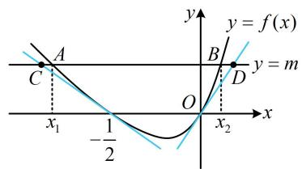
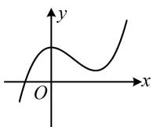
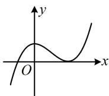
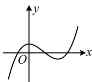
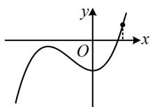

# 强化训练

##### 1. (2020·新课标Ⅰ卷·★★★☆)

已知函数 $f(x)=\mathrm{e}^{x}-a(x+2)$ .

（1） 当 a=1 时，讨论 $f(x)$ 单调性；  
（2） 若 $f(x)$ 有两个零点，求 a 的取值范围.

##### 1. 解：（1）当 $a = 1$ 时， $f(x) = \mathrm{e}^x - x - 2$ ， $f'(x) = \mathrm{e}^x - 1$

由 $f'(x) > 0$ 得 $x > 0$ ，由 $f'(x) <   0$ 得 $x <   0$

所以 $f(x)$ 在 $(-∞,0)$ 上单调递减，在 $(0,+∞)$ 上单调递增.

（2） (研究 $f(x)$ 的零点个数, 先分析其单调性, $f'(x) = \mathrm{e}^x - a$ , 不难发现 $f'(x)$ 的正负情况受 $a$ 的正负影响, 故讨论)

由题意， $f'(x) = \mathrm{e}^{x} - a$ ，当 $a\leq 0$ 时， $f'(x) > 0$ 恒成立，

所以 $f(x)$ 在 $\mathbf{R}$ 上单调递增， $f(x)$ 最多1个零点，不合题意；

当 $a > 0$ 时，由 $f'(x) > 0$ 得 $x > \ln a$ ，由 $f'(x) < 0$ 得 $x < \ln a$

所以 $f(x)$ 在 $(-\infty, \ln a)$ 上单调递减，在 $(\ln a, +\infty)$ 上单调递增，

因为 $f(x)$ 有2个零点，所以 $f(\ln a) = \mathrm{e}^{\ln a} - a(\ln a + 2)$

$= -a - a\ln a = -a(1 + \ln a) < 0$ ，解得： $a > \mathrm{e}^{-1}$

（需注意， $f(\ln a) < 0$ 只是 $f(x)$ 有两个零点的必要条件，要论证充分性，还需在 $x = \ln a$ 的左右两侧取出使 $f(x) > 0$ 的点，先看左边的点怎么取，注意到当 $a > e^{-1}$ 时， $\ln a > -1$ ，故可在-1的左边取个常数试试，例如取 $x = -2$ ）

因为 $f(-2) = \mathrm{e}^{-2} > 0$ ，且 $\ln a > \ln \mathrm{e}^{-1} = -1 > -2$

所以 $f(x)$ 在 $(-2, \ln a)$ 上有一个零点，

（再看 $\ln a$ 右边的点怎么取，由于 $\ln a \in (-1, +\infty)$ ，所以不能像左边那样取常数，否则取出来的点不一定在 $\ln a$ 右边，怎么办呢？要满足取出来的点总是比 $\ln a$ 大，同时结构又尽可能简单，可以考虑 a, 2a 这样的点，经尝试，取 2a 可行，下面先证明 $2a > \ln a$ 设 $p(a) = 2a - \ln a$ ，a > 0，则 $p'(a) = 2 - \frac{1}{a} = \frac{2a - 1}{a}$ ，

$p ^ {'} (a) <   0 \Leftrightarrow 0 <   a <   \frac {1}{2}, \quad p ^ {'} (a) > 0 \Leftrightarrow a > \frac {1}{2},$

所以 $p(a)$ 在 $\left(0, \frac{1}{2}\right)$ 上单调递减，在 $\left(\frac{1}{2}, +\infty\right)$ 上单调递增，

故 $p(a)\geq p\left(\frac{1}{2}\right) = 2\times \frac{1}{2} -\ln \frac{1}{2} = 1 + \ln 2 > 0$ ，即 $2a - \ln a > 0$

所以 $2a > \ln a$ ，由题意， $f(2a) = \mathrm{e}^{2a} - a(2a + 2)$

设 $g(a) = \mathrm{e}^{2a} - a(2a + 2)$ ， $a > 0$ ，则 $g'(a) = 2\mathrm{e}^{2a} - 4a - 2$

$g''(a) = 4\mathrm{e}^{2a} - 4 > 0$ ，所以 $g'(a)$ 在 $(0, + \infty)$ 上单调递增，

又 $g'（0） = 0$ ，所以 $g'(a) > 0$ ，故 $g(a)$ 在 $(0, + \infty)$ 上单调递增，

结合 $g(0) = 1$ 知 $g(a) > 0$ 恒成立，所以 $f(2a) > 0$

结合 $2a > \ln a$ 和 $f(\ln a) < 0$ 得 $f(x)$ 在 $(\ln a, 2a)$ 上有1个零点，

故 $f(x)$ 在 R 上共有 2 个零点;

综上所述，若 $f(x)$ 有2个零点，则 $a$ 的取值范围为 $(\mathrm{e}^{-1}, + \infty)$

##### 2. (2016·新课标Ⅱ卷·★★★★)

（1）讨论函数 $f(x) = \frac{x - 2}{x + 2} \cdot \mathrm{e}^x$ 的单调性，并证明当 $x > 0$ 时， $(x - 2)\mathrm{e}^{x} + x + 2 > 0$

（2）证明：当 $a \in [0,1)$ 时， $g(x) = \frac{\mathrm{e}^x - ax - a}{x^2} (x > 0)$ 有最小值。设 $g(x)$ 的最小值为 $h(a)$ ，求函数 $h(a)$ 的值域。

##### 2. 解：（1）由题意， $f(x)$ 的定义域是 $(-∞,-2)∪(-2,+∞)$ ，

且 $f'(x) = \frac{x^{2}\mathrm{e}^{x}}{(x + 2)^{2}}$ ，所以 $f'(x)\geq 0$ 恒成立，

故 $f(x)$ 在 $(- \infty, -2)$ 上单调递增，在 $(-2, +\infty)$ 上单调递增，

所以当 $x > 0$ 时， $f(x) > f(0)$ ，即 $\frac{x - 2}{x + 2} \cdot \mathrm{e}^x > -1$

故 $(x-2)e^{x}>-(x+2)$ ，即 $(x-2)e^{x}+x+2>0$ 。

（2）由题意， $g'(x) = \frac{(x - 2)\mathrm{e}^{x} + ax + 2a}{x^{3}}$ ， $x > 0$

（不易判断正负，考虑继续求导，直接求导显然很复杂，注意到分母的 $x^{3} > 0$ ，所以只需把分子单独拿出来求导分析）

设 $u(x) = (x - 2)\mathrm{e}^{x} + ax + 2a$ ， $x > 0$

则 $u'(x) = (x - 1)\mathrm{e}^{x} + a$ ， $u''(x) = x\mathrm{e}^x >0$

所以 $u'(x)$ 在 $(0, + \infty)$ 上单调递增，

又 $u'（0） = a - 1 <   0$ ， $u'（1） = a\geq 0$

所以 $u'(x)$ 在 $(0, + \infty)$ 上有唯一的零点，设该零点为 $\alpha$

当 $0 < x < \alpha$ 时， $u'(x) < 0$ ，当 $x > \alpha$ 时， $u'(x) > 0$ ，

所以 $u(x)$ 在 $(0, \alpha)$ 上单调递减，在 $(\alpha, +\infty)$ 上单调递增，

又 $u(0) = 2(a - 1) < 0$ ， $u(2) = 4a\geq 0$

所以 $u(x)$ 在 $(0, +\infty)$ 上有唯一的零点，设该零点为 $x_0$

则 $(x_0 - 2)\mathrm{e}^{x_0} + ax_0 + 2a = 0$ ①，

且当 $x \in (0, x_0)$ 时， $u(x) < 0$ ，所以 $g'(x) < 0$ ；

当 $x \in (x_0, +\infty)$ 时， $u(x) > 0$ ，所以 $g'(x) > 0$ ，

故 $g(x)$ 在 $(0, x_0)$ 上单调递减，在 $(x_0, +\infty)$ 上单调递增，

所以函数 $g(x)$ 有最小值，且 $g(x)_{\mathrm{min}} = g(x_0)$ ，

即 $h(a) = g(x_0) = \frac{\mathrm{e}^{x_0} - ax_0 - a}{x_0^2}$ ②，

（式②含 $a$ 和 $x_0$ 两个变量，不方便直接求 $h(a)$ 的值域，考虑消元，怎么消？注意到 $a$ 和 $x_0$ 满足式①，故考虑由式①来消元，消谁？显然由①容易反解出 $a$ ，代入②即可消去 $a$ ）

由式①得 $a = -\frac{x_0 - 2}{x_0 + 2}\mathrm{e}^{x_0}$ ，代入式②整理得： $h(a) = \frac{\mathrm{e}^{x_0}}{x_0 + 2}$

因为 $a \in [0,1)$ ，所以 $0 \leq -\frac{x_0 - 2}{x_0 + 2} \mathrm{e}^{x_0} < 1$ ，即 $0 \leq -f(x_0) < 1$ ，

所以 $-1 < f(x_0) \leq 0$ ，由（1）知 $f(x)$ 在 $(0, +\infty)$ 上单调递增，

又 $f(0) = -1$ ， $f(2) = 0$ ，所以 $0 < x_0 \leq 2$

(有了 $x_0$ 的范围，可将 $h(a)$ 看成关于 $x_0$ 的函数，已有其解析式，故直接构造函数求导分析值域)

令 $r(x_0) = \frac{\mathrm{e}^{x_0}}{x_0 + 2}$ ， $0 < x_0 \leq 2$ ，则 $r'(x_0) = \frac{(x_0 + 1)\mathrm{e}^{x_0}}{(x_0 + 2)^2} > 0$

所以 $r(x_0)$ 在 $(0,2]$ 上单调递增，

结合 $r(0) = \frac{1}{2}$ ， $r(2) = \frac{\mathrm{e}^2}{4}$ 知 $r(x_0)$ 的值域为 $\left(\frac{1}{2}, \frac{\mathrm{e}^2}{4}\right]$ ，

又 $h(a) = r(x_0)$ ，所以 $h(a)$ 的值域为 $\left(\frac{1}{2},\frac{\mathrm{e}^2}{4}\right]$

# 3. (2024·山东济南二模·★★★★)

已知函数 $f(x) = ax^{2} - \ln x - 1$ ， $g(x) = xe^{x} - ax^{2}$

$a \in \mathbf {R}.$

（1） 讨论 $f(x)$ 的单调性;  
（2） 证明: $f(x) + g(x) \geq x$ .

##### 3. 解：（1）由题意， $f'(x)=2ax-\frac{1}{x}=\frac{2ax^{2}-1}{x}$ ，x>0，

$(f'(x)$ 的正负由 $2ax^{2}-1$ 决定，a 与 0 的大小关系会影响 $f'(x)$ 是否有零点， $f'(x)$ 的正负情况也随之不同，故据此讨论）当 $a \leq 0$ 时， $2ax^{2} \leq 0$ ，所以 $2ax^{2}-1 < 0$ ，

因为 $x > 0$ ，所以 $f'(x) = \frac{2ax^{2} - 1}{x} < 0$

故 $f(x)$ 在 $(0,+\infty)$ 上单调递减；

当 $a > 0$ 时， $f'(x) < 0 \Leftrightarrow 2ax^2 - 1 < 0 \Leftrightarrow 0 < x < \frac{1}{\sqrt{2a}}$

$f'(x) > 0\Leftrightarrow x > \frac{1}{\sqrt{2a}}$ ，所以 $f(x)$ 在 $\left(0,\frac{1}{\sqrt{2a}}\right)$ 上单调递减，

在 $\left(\frac{1}{\sqrt{2a}},+\infty\right)$ 上单调递增.

（2）证法1： $f(x) + g(x)\geq x\Leftrightarrow ax^{2} - \ln x - 1 + x\mathrm{e}^{x} - ax^{2}\geq x$

$\Leftrightarrow x\mathrm{e}^{x} - \ln x - x - 1 \geq 0$ ①，（故只需证不等式①，该不等式不算复杂，可尝试直接构造函数，求导分析）

令 $F(x) = x\mathrm{e}^{x} - \ln x - x - 1$ ， $x > 0$ ，则 $F'(x) =$

$\mathrm{e} ^ {x} + x \mathrm{e} ^ {x} - \frac {1}{x} - 1 = (1 + x) \mathrm{e} ^ {x} - \frac {x + 1}{x} = (x + 1) \left(\mathrm{e} ^ {x} - \frac {1}{x}\right),$

（显然 $x + 1 > 0$ ，故 $F'(x)$ 的正负由 $\mathrm{e}^x -\frac{1}{x}$ 决定，这部分的正负情况不易直接看出，考虑单独拿出来求导分析）

令 $h(x) = \mathrm{e}^{x} - \frac{1}{x}$ ， $x > 0$ ，则 $h'(x) = \mathrm{e}^{x} + \frac{1}{x^{2}} >0$

所以 $h(x)$ 在 $(0, +\infty)$ 上单调递增，

又 $h\left(\frac{1}{2}\right) = \mathrm{e}^{\frac{1}{2}} - 2 = \sqrt{\mathrm{e}} - 2 <   \sqrt{4} -2 = 0$ ， $h(1) = \mathrm{e}^{1} - 1 > 0$

所以存在唯一的 $x_0 \in \left(\frac{1}{2}, 1\right)$ ，使 $h(x_0) = \mathrm{e}^{x_0} - \frac{1}{x_0} = 0$ ②，

且当 $x \in (0, x_0)$ 时， $h(x) < 0$ ，所以 $F'(x) = (x + 1)h(x) < 0$

故 $F(x)$ 在 $(0, x_{0})$ 上单调递减；

当 $x \in (x_0, +\infty)$ 时， $h(x) > 0$ ，所以 $F'(x) = (x + 1)h(x) > 0$

故 $F(x)$ 在 $(x_{0},+\infty)$ 上单调递增，

所以 $F(x)_{\min} = F(x_0) = x_0\mathrm{e}^{x_0} - \ln x_0 - x_0 - 1$ ③，

（接下来只需证 $F(x_0) \geq 0$ ，怎么证？这里 $x_0$ 无法求出，可尝试先由 $h(x_0) = 0$ 去化简式③，再进行证明）

由②可知 $\mathrm{e}^{x_0} = \frac{1}{x_0}$ ，两端取对数得 $\ln \mathrm{e}^{x_0} = \ln \frac{1}{x_0}$

所以 $x_0 = -\ln x_0$ ，故 $\ln x_0 = -x_0$ ，将 $\mathrm{e}^{x_0} = \frac{1}{x_0}$ 和 $\ln x_0 = -x_0$ 代入③得 $F(x_0) = x_0\mathrm{e}^{x_0} - \ln x_0 - x_0 - 1 = x_0\cdot \frac{1}{x_0} -(-x_0) - x_0 - 1 = 0$

所以 $F(x)\geq 0$ ，即 $x\mathrm{e}^{x} - \ln x - x - 1\geq 0$

从而不等式①成立，故 $f(x)+g(x)\geq x$ 成立.

证法2：（按证法1得到只需证不等式①后，注意到有 $x\mathrm{e}^{x}$ 这一结构，它可调整为 $\mathrm{e}^{\ln x + x}$ ，此时发现若将 $\ln x + x$ 看作整体，则不等式①恰好符合经典切线放缩不等式 $\mathrm{e}^{x} \geq x + 1$ 的形式，故也可按此速证不等式①，下面先证 $\mathrm{e}^{x} \geq x + 1$ ）

设 $r(x) = \mathrm{e}^{x} - x - 1$ ， $x\in \mathbf{R}$ ，则 $r^' (x) = \mathrm{e}^x -1$

所以 $r'(x) > 0 \Leftrightarrow x > 0$ ， $r'(x) < 0 \Leftrightarrow x < 0$

从而 $r(x)$ 在 $(- \infty, 0)$ 上单调递减，在 $(0, +\infty)$ 上单调递增，

故 $r(x)\geq r(0) = 0$ ，即 $\mathrm{e}^x -x - 1\geq 0$ ，所以 $\mathrm{e}^x\geq x + 1$

所以 $x\mathrm{e}^{x} - \ln x - x - 1 = \mathrm{e}^{\ln x}\cdot \mathrm{e}^{x} - \ln x - x - 1$

$= \mathrm{e} ^ {\ln x + x} - \ln x - x - 1 \geq (\ln x + x + 1) - \ln x - x - 1 = 0,$

即不等式①成立，故 $f(x)+g(x)\geq x$ 成立.

##### 4. (2023·辽宁沈阳三模·★★★★☆)

已知 $f(x) = (x + b)(\mathrm{e}^{2x} - a)$ 在点 $\left(-\frac{1}{2}, f\left(-\frac{1}{2}\right)\right)$ 处的切线方程为 $(\mathrm{e} - 1)x + \mathrm{e}y + \frac{\mathrm{e} - 1}{2} = 0$ ，其中 $b > 0$ 。

（1） 求 a, b;

（2） 函数 $f(x)$ 的图象与 $x$ 轴负半轴的交点为 $P$ ，且在点 $P$ 处的切线方程为 $y = h(x)$ ，函数 $F(x) = f(x) - h(x)$ ， $x \in \mathbf{R}$ ，求 $F(x)$ 的最小值；

（3）关于 $x$ 的方程 $f(x) = m$ 有两个实根 $x_{1}$ ， $x_{2}$ ，且 $x_{1} < x_{2}$ ，证明： $x_{2} - x_{1} \leq \frac{1 + 2m}{2} - \frac{me}{1 - e}$ .

##### 4. 解: （1） (给了 $x = -\frac{1}{2}$ 处的切线方程, 怎样翻译? 可从两方

面来看，一方面， $f'\left(-\frac{1}{2}\right)$ 等于所给切线的斜率，另一方面， $x=-\frac{1}{2}$ 处应为切线和函数 $f(x)$ 图象的交点，由此可建立两个关于a，b的方程组，求出a和b）

由题意， $f'(x) = \mathrm{e}^{2x} - a + (x + b)\cdot 2\mathrm{e}^{2x} = (2x + 2b + 1)\mathrm{e}^{2x} - a$

所以 $f'\left(-\frac{1}{2}\right)=\frac{2b}{e}-a$

所给切线方程 $(\mathrm{e} - 1)x + \mathrm{e}y + \frac{\mathrm{e} - 1}{2} = 0$ 可化为

$y=\frac{1-\mathrm{e}}{\mathrm{e}}x+\frac{1-\mathrm{e}}{2\mathrm{e}}$ ，其斜率为 $\frac{1-\mathrm{e}}{\mathrm{e}}$ ，故 $\frac{2b}{\mathrm{e}}-a=\frac{1-\mathrm{e}}{\mathrm{e}}$ ①，

将 $x = -\frac{1}{2}$ 代入 $y = \frac{1 - \mathrm{e}}{\mathrm{e}} x + \frac{1 - \mathrm{e}}{2\mathrm{e}}$ 可得 $y = 0$

又 $f\left(-\frac{1}{2}\right) = \left(b - \frac{1}{2}\right)\left(\frac{1}{\mathbf{e}} -a\right)$ ，所以 $\left(b - \frac{1}{2}\right)\left(\frac{1}{\mathbf{e}} -a\right) = 0$ ②，

由②可得 $b=\frac{1}{2}$ 或 $a=\frac{1}{e}$ ，

若 $a = \frac{1}{\mathrm{e}}$ ，则代入①可得 $b = 1 - \frac{\mathrm{e}}{2} < 0$ ，不合题意，

所以只能 $b=\frac{1}{2}$ ，代入①得a=1。

（2）由（1）可得 $f(x) = \left(x + \frac{1}{2}\right)(\mathrm{e}^{2x} - 1)$

令 $f(x)=0$ 可得 $x=-\frac{1}{2}$ 或 0,

所以 $f(x)$ 的图象与 x 轴负半轴的交点为 $P\left(-\frac{1}{2},0\right)$ ,

由（1）可得 $h(x) = \frac{1 - \mathrm{e}}{\mathrm{e}} x + \frac{1 - \mathrm{e}}{2\mathrm{e}}$

因为 $F(x) = f(x) - h(x)$ ，所以 $F'(x) = f'(x) - h'(x)$

$= (2 x + 2) \mathrm{e} ^ {2 x} - 1 - \frac {1 - \mathrm{e}}{\mathrm{e}} = (2 x + 2) \mathrm{e} ^ {2 x} - \frac {1}{\mathrm{e}},$

（上式虽较复杂，但观察发现 $F'\left(-\frac{1}{2}\right)=0$ ，所以可尝试判断 $F'(x)$ 在 $-\frac{1}{2}$ 两侧的正负）

当 $x < -\frac{1}{2}$ 时， $2x + 2 < 1$ ， $0 < \mathrm{e}^{2x} < \frac{1}{\mathrm{e}}$

所以 $(2x + 2)\mathrm{e}^{2x} <   \frac{1}{\mathrm{e}}$ ，故 $F'(x) <   0$

当 $x > -\frac{1}{2}$ 时， $2x + 2 > 1$ ， $\mathrm{e}^{2x} > \frac{1}{\mathrm{e}}$

所以 $(2x+2)e^{2x}>\frac{1}{e}$ ，故 $F'(x)>0$ ，

所以 $F(x)$ 在 $\left(-\infty, -\frac{1}{2}\right)$ 单调递减，在 $\left(-\frac{1}{2}, +\infty\right)$ 单调递增，

故 $F(x)_{\min} = F\left(-\frac{1}{2}\right) = f\left(-\frac{1}{2}\right) - h\left(-\frac{1}{2}\right) = 0.$

（3） (要证的不等式有三个变量, 常规的想法是消元, 但经尝试, 由 $f(x_{1}) = f(x_{2}) = m$ 不易统一变量, 怎么办呢? 不妨从图形上找思路. $f(x)$ 有 $-\frac{1}{2}$ 和 0 两个零点, 且第 （2） 问已证 $x = -\frac{1}{2}$ 处的切线在 $f(x)$ 图象下方, 受此启发, 我们猜想 $x = 0$ 处的切线也在下方, 如图, 可发现 $x_{2} - x_{1}$ 即为图中的 $|AB|$ , 而由图还可看出 $|AB| \leq |CD|$ , 于是我们猜想 $|CD|$ 会不会恰好等于目标不等式的右侧, 思路就出来了. 容易求得 $x = 0$ 处的切线方程为 $y = x$ , 下面先证明该切线在 $f(x)$ 图象的下方)

设 $g(x) = f(x) - x$ ，则 $g'(x) = f'(x) - 1 = (2x + 2)\mathrm{e}^{2x} - 2$

（观察发现 $g'（0） = 0$ ，故尝试分析 $g'(x)$ 在0的左右两侧的正负）当 $x < 0$ 时， $2x + 2 < 2$ ， $0 < \mathrm{e}^{2x} < 1$

所以 $(2x + 2)\mathrm{e}^{2x} < 2$ ，故 $g'(x) < 0$

当 $x > 0$ 时， $2x + 2 > 2$ ， $\mathrm{e}^{2x} > 1$

所以 $(2x+2)e^{2x}>2$ ，故 $g'(x)>0$ ，

所以 $g(x)$ 在 $(-\infty,0)$ 单调递减，在 $(0, + \infty)$ 单调递增，

故 $g(x)\geq g(0) = f(0) - 0 = 0$

所以 $f(x)-x \geq 0$ ，故 $f(x) \geq x$ ③，

由（2）可得 $F(x) = f(x) - h(x)\geq 0$ ，所以 $f(x)\geq h(x)$

故 $f(x)\geq \frac{1 - \mathrm{e}}{\mathrm{e}} x + \frac{1 - \mathrm{e}}{2\mathrm{e}}$ ④，

（由上图知可将要证的不等式拆分成 $x_{2} \leq x_{D}$ 和 $x_{1} \geq x_{C}$ 来证，故在③④中分别取 $x = x_{2}$ ， $x = x_{1}$ ）

由题意， $x_{1}$ ， $x_{2}$ 是 $f(x) = m$ 的两根，

所以 $f(x_{1}) = f(x_{2}) = m$ ，在③中取 $x = x_{2}$ 得 $f(x_{2})\geq x_{2}$

结合 $f(x_{2}) = m$ 可得 $x_{2}\leq m$ ⑤，

在④中取 $x = x_{1}$ 得 $f(x_{1})\geq \frac{1 - \mathrm{e}}{\mathrm{e}} x_{1} + \frac{1 - \mathrm{e}}{2\mathrm{e}},$

结合 $f(x_{1}) = m$ 可得 $m\geq \frac{1 - \mathrm{e}}{\mathrm{e}} x_1 + \frac{1 - \mathrm{e}}{2\mathrm{e}},$

所以 $\frac{1 - \mathrm{e}}{\mathrm{e}} x_1 \leq m - \frac{1 - \mathrm{e}}{2\mathrm{e}}$ ，从而 $x_1 \geq \frac{me}{1 - \mathrm{e}} - \frac{1}{2}$ ，

故 $-x_{1} \leq -\frac{me}{1 - e} + \frac{1}{2}$ ⑥,

将⑤⑥相加可得 $x_{2} - x_{1}\leq m - \frac{me}{1 - e} +\frac{1}{2} = \frac{1 + 2m}{2} -\frac{me}{1 - e}.$

# 5. (2021·新高考II卷·★★★★☆)

已知函数 $f(x)=(x-1)\mathrm{e}^{x}-ax^{2}+b$ .

（1） 讨论 $f(x)$ 的单调性;  
（2）从下面两个条件中选一个，证明： $f(x)$ 恰有一个零点.

① $\frac{1}{2} < a \leq \frac{\mathrm{e}^2}{2}, b > 2a$ ；② $0 < a < \frac{1}{2}, b \leq 2a$ 。

##### 5. 解：（1）由题意， $f'(x) = \mathrm{e}^{x} + (x - 1)\mathrm{e}^{x} - 2ax$

$= x\mathrm{e}^{x} - 2ax = x(\mathrm{e}^{x} - 2a)$ ，（由 $f'(x) = 0$ 可得 $x = 0$ 或 $\ln (2a)$ ，其中 $\ln (2a)$ 是否有意义由 $a$ 的正负决定，故据此讨论）

当 $a \leq 0$ 时， $\mathrm{e}^x - 2a > 0$ ，所以 $f'(x) > 0 \Leftrightarrow x > 0$ ，

$f ^ {'} (x) <   0 \Leftrightarrow x <   0,$

故 $f(x)$ 在 $(- \infty, 0)$ 上单调递减，在 $(0, +\infty)$ 上单调递增；

（当 $a > 0$ 时， $f'(x)$ 有0和 $\ln (2a)$ 两个零点，故又讨论它们的大小，即讨论 $a$ 与 $\frac{1}{2}$ 的大小）

当 $0 < a < \frac{1}{2}$ 时， $\ln (2a) < 0$ ，若 $x < \ln (2a)$ ，则 $x < 0$ ，

且 $\mathrm{e}^x - 2a < \mathrm{e}^{\ln (2a)} - 2a = 2a - 2a = 0$ ，所以 $f'(x) > 0$

若 $\ln (2a) < x < 0$ ，则 $\mathrm{e}^x - 2a > \mathrm{e}^{\ln (2a)} - 2a = 2a - 2a = 0$

所以 $f'(x) < 0$ ，

若 $x > 0$ ，则 $\mathrm{e}^x -2a > \mathrm{e}^0 -2a = 1 - 2a > 0$

所以 $f'(x) > 0$ ，故 $f(x)$ 在 $(-\infty ,\ln (2a))$ 上单调递增，

在 $(\ln (2a),0)$ 上单调递减，在 $(0, + \infty)$ 上单调递增；

当 $a = \frac{1}{2}$ 时， $f'(x) = x(\mathrm{e}^x - 1)$ ，若 $x < 0$ ，则 $\mathrm{e}^x - 1 < 0$

所以 $f'(x) > 0$ ，若 $x > 0$ ，则 $\mathrm{e}^x -1 > 0$ ，所以 $f'(x) > 0$

结合 $f'（0）=0$ 得 $f'(x)\geq0$ 恒成立，

当且仅当 $x = 0$ 时取等号，故 $f(x)$ 在 $\mathbf{R}$ 上单调递增；

当 $a > \frac{1}{2}$ 时， $\ln (2a) > 0$ ，若 $x < 0$ ，则 $\mathrm{e}^x - 2a < \mathrm{e}^0 - 2a$

$= 1 - 2a <   0$ ，所以 $f'(x) > 0$

若 $0 < x < \ln (2a)$ ，则 $\mathrm{e}^x - 2a < \mathrm{e}^{\ln (2a)} - 2a = 2a - 2a = 0$

所以 $f'(x) < 0$ ，

若 $x > \ln (2a)$ ，则 $x > 0$ ，且 $\mathrm{e}^x - 2a > \mathrm{e}^{\ln (2a)} - 2a$

$= 2a - 2a = 0$ ，所以 $f'(x) > 0$

故 $f(x)$ 在 $(-\infty,0)$ 上单调递增，在 $(0,\ln (2a))$ 上单调递减，

在 $(\ln(2a),+\infty)$ 上单调递增.

（2）解法1：选①，则 $\frac{1}{2} < a \leq \frac{\mathrm{e}^2}{2}$ ，且 $b > 2a$ ，

所以 $0 < \ln (2a) \leq 2$ ，由（1）知 $f(x)$ 在 $(- \infty, 0)$ 上单调递增，

在 $(0, \ln(2a))$ 上单调递减，在 $(\ln(2a), +\infty)$ 上单调递增，

(分析可得当 $x \to -\infty$ 时， $f(x) \to -\infty$ ，结合 $f(0) = b - 1 >$

2a-1>0 得 $f(x)$ 在 $(-∞,0)$ 上有 1 个零点，但作答时需在 $(-∞,0)$ 上取出使 $f(x)<0$ 的点，结合零点存在定理来论证，观察 $f(x)$ 的解析式，我们发现在 $(-∞,0)$ 上， $(x-1)e^{x}<0$ ，所以我们取出来的点只要满足余下的部分 $-ax^{2}+b$ 为 0 就行，故可取 $-\sqrt{\frac{b}{a}}$

因为 $f\left(-\sqrt{\frac{b}{a}}\right) = \left(-\sqrt{\frac{b}{a}} - 1\right)\mathrm{e}^{-\sqrt{\frac{b}{a}}} - a\left(-\sqrt{\frac{b}{a}}\right)^2 + b$

$= \left(- \sqrt {\frac {b}{a}} - 1\right) \mathrm{e} ^ {- \sqrt {\frac {b}{a}}} <   0, f （0） = b - 1 > 2 a - 1 > 0,$

所以 $f(x)$ 在 $\left(-\sqrt{\frac{b}{a}},0\right)$ 上有1个零点，结合 $f(x)$ 在 $(-\infty ,0)$ 单调递增知 $f(x)$ 在 $(-\infty ,0)$ 有且仅有1个零点，

（再看 $(0, +\infty)$ 的情况，这段上 $f(x)$ 先 $\searrow$ 后 $\nearrow$ ，且当 $x \to +\infty$ 时， $f(x) \to +\infty$ ，所以极小值 $f(\ln(2a))$ 的正负决定零点个数，有如图1、图2、图3所示的三种情况，故接下来算极小值）

  
图1

  
图2

  
图3

由 $b > 2a$ 得 $f(\ln (2a)) = [\ln (2a) - 1]\mathrm{e}^{\ln (2a)} - a\ln^2 (2a) + b$

$= 2 a [ \ln (2 a) - 1 ] - a \ln^ {2} (2 a) + b$

$> 2 a [ \ln (2 a) - 1 ] - a \ln^ {2} (2 a) + 2 a = a \ln (2 a) [ 2 - \ln (2 a) ] \geq 0,$

所以 $f(x)$ 在 $(0, +\infty)$ 上没有零点，

综上所述， $f(x)$ 有且仅有一个零点.

【解法2】选②，则 $0 < a < \frac{1}{2}$ ， $b \leq 2a$ ，所以 $\ln (2a) < 0$ ，

由（1）知 $f(x)$ 在 $(- \infty, \ln(2a))$ 上单调递增，在 $(\ln(2a), 0)$ 上单调递减，在 $(0, +\infty)$ 上单调递增，

(在 $(-∞,0)$ 上， $f(x)$ 的零点个数由极大值 $f(\ln(2a))$ 的正负决定，故先算它)

因为 $b \leq 2a$ ，所以 $f(\ln(2a)) = [\ln(2a) - 1]e^{\ln(2a)} - a\ln^{2}(2a) +$

$b = 2 a [ \ln (2 a) - 1 ] - a \ln^ {2} (2 a) + b$

$\leq 2 a [ \ln (2 a) - 1 ] - a \ln^ {2} (2 a) + 2 a = a \ln (2 a) [ 2 - \ln (2 a) ] <   0,$

所以 $f(x)$ 在 $(-\infty,0)$ 上没有零点，且由 $f(\ln (2a)) < 0$ 和

$f(x)$ 在 $(\ln (2a),0)$ 上单调递减可得 $f(0) = b - 1 <   0$

(到此结合当 $x \to +\infty$ 时, $f(x) \to +\infty$ , 我们可以想象 $f(x)$ 的大致图象如图4, $f(x)$ 的唯一零点在 $(0, +\infty)$ 上, 但要严格论证, 需在 $(0, +\infty)$ 上取出能使 $f(x) > 0$ 的点. 直接取点不易, 考虑通过放缩将解析式化简再取, 解析式中有 $\mathrm{e}^x$ , 可尝试用经典切线放缩不等式 $\mathrm{e}^x \geq x + 1$ 来放缩, 且为了使 $f(x)$ 解析式中与 $\mathrm{e}^x$ 相乘的部分为正, 我们考虑 $x > 1$ 的情形. 下面先证明此不等式)

  
图4

设 $u(x) = \mathrm{e}^{x} - x - 1$ ，其中 $x > 1$ ，则 $u'(x) = \mathrm{e}^{x} - 1 > 0$

所以 $u(x)$ 在 $(1, +\infty)$ 上单调递增，故 $u(x) > u(1) = \mathrm{e} - 2 > 0$

所以当 $x > 1$ 时， $\mathrm{e}^x >x + 1$ ，故 $f(x) = (x - 1)\mathrm{e}^x -ax^2 +b$

$> (x - 1) (x + 1) - a x ^ {2} + b = (1 - a) x ^ {2} + b - 1 \quad (\mathrm{i}),$

(观察发现只要在上述不等式中令 $x=\sqrt{\frac{1-b}{1-a}}$ ，则右侧恰好为 0， $f(x)>0$ 的点就取出来了，但 $\sqrt{\frac{1-b}{1-a}}$ 不一定大于 1，所以不能直接取 $\sqrt{\frac{1-b}{1-a}}$ ，怎么办呢？从图象来看，我们取的点可以往 $+\infty$ 去，故不妨取一个比 $\sqrt{\frac{1-b}{1-a}}$ 和 1 都大的点)

取 $x_0 > \max \left\{\sqrt{\frac{1 - b}{1 - a}}, 1\right\}$ ，则由(i)可得 $f(x_0) > (1 - a)x_0^2 + b - 1$

$> (1 - a) \left(\sqrt {\frac {1 - b}{1 - a}}\right) ^ {2} + b - 1 = 0,$

结合 $f(0) < 0$ 和 $f(x)$ 在 $(0, +\infty)$ 上单调递增可得 $f(x)$ 在

$(0, + \infty)$ 上有1个零点，

综上所述， $f(x)$ 有且仅有一个零点.

