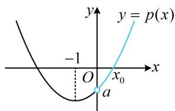
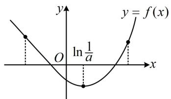
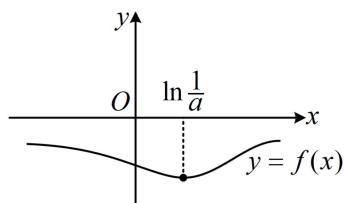
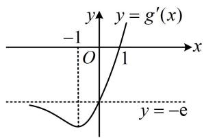
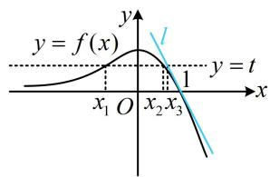
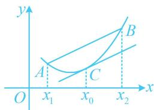
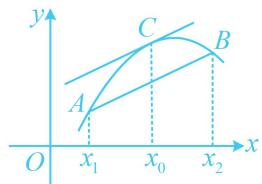

# 模块八 导数综合大题

# 第1节 隐零点、零点讨论、切割线放缩（★★★★）

# 内容提要

导数综合大题题型繁多，难度较广，要深入研究，需耗费大量的时间精力。本书主要精选了一部分难度适当、考频较高的题型供同学们学习。第一节我们先涉及隐零点问题、零点讨论、切割线放缩三个题型，请大家跟着例题和反思、总结去学习这些题型的解题方法吧。

# 类型 I：隐零点问题

##### 【例1】已知 $f(x) = \mathrm{e}^{x} + ax^{2}$ ， $f'(x)$ 是 $f(x)$ 的导函数，其中 $a \in \mathbf{R}$ .

（1）当 $a > 0$ 时，证明：存在唯一的 $x_0 \in \left(-\frac{1}{2a}, 0\right)$ ，使得 $f'(x_0) = 0$ ；  
（2）若存在实数 $a, b$ ，使得 $f(x) \geq b$ 恒成立，求 $a - b$ 的最小值.

解：（1）（研究 $f'(x)$ 的零点，考虑先对 $f'(x)$ 求导，分析其单调性，再取点论证）

由题意， $f'(x) = \mathrm{e}^x + 2ax$ ， $f''(x) = \mathrm{e}^x + 2a$ ，当 $a > 0$ 时， $f''(x) > 0$ ，所以 $f'(x)$ 在 $\mathbf{R}$ 上单调递增，

(要证的结论是 $f'(x)$ 在 $\left(-\frac{1}{2a},0\right)$ 上存在零点，所以只需证明 $f'(x)$ 在这两个端点处异号)

因为 $f'\left(-\frac{1}{2a}\right) = \mathrm{e}^{-\frac{1}{2a}} - 1 < 0$ ， $f'（0） = 1 > 0$ ，所以存在唯一的 $x_0 \in \left(-\frac{1}{2a}, 0\right)$ ，使得 $f'(x_0) = 0$ .

（2） (条件 $f(x) \geq b$ 恒成立怎样翻译? 可翻译成 $f(x)_{\min} \geq b$ , 于是求 $f(x)_{\min}$ , 可先讨论 $f(x)$ 的单调性, 观察发现 $f'(x)$ 是否有零点由 $a$ 的正负决定, 故据此讨论, 下面先看 $a = 0$ 这种最简单的情况)

当 $a = 0$ 时， $f(x) = \mathrm{e}^x$ ，要使 $f(x) \geq b$ 恒成立，只需 $b \leq 0$ ，所以 $a - b = -b \geq 0$

(再看 $a < 0$ 的情形, 可以想象, 当 $x \to -\infty$ 时, $f(x) = \mathrm{e}^{x} + ax^{2} \to -\infty$ , 所以 $f(x) \geq b$ 不可能恒成立, 怎样严格论证? 可考虑直接取出使 $f(x) < b$ 的 $x$ 来否定结论, 怎么取? 由于当 $x \to -\infty$ 时, $ax^{2}$ 是主要部分, $\mathrm{e}^{x}$ 是次要部分, 故可考虑将次要部分进行放缩, 以化简解析式, 方便取点)

当 $a < 0$ 时，考虑 $x < 0$ 的情形， $f(x) = \mathrm{e}^x + ax^2 < 1 + ax^2$ ①，

（此时要想 $f(x) < b$ ，只需 $1 + ax^2 < b$ ，即 $ax^2 < b - 1$ ，也即 $x^2 > \frac{b - 1}{a}$ ，此不等式在 $x < -\sqrt{\left|\frac{b - 1}{a}\right|}$ 时必定成立，满足要求的点就取出来了）任取满足 $\beta < -\sqrt{\left|\frac{b - 1}{a}\right|}$ 的实数 $\beta$ ，代入①得 $f(\beta) < 1 + a\beta^2 < 1 + a \cdot \left|\frac{b - 1}{a}\right| = 1 - |b - 1| \leq 1 - (1 - b) = b$ ，所以 $f(x) \geq b$ 不可能恒成立；

（最后来看 $a > 0$ 的情况，第（1）问已获得此时 $f'(x)$ 的单调性和零点，故直接判断 $f'(x)$ 的正负）

当 $a > 0$ 时，由（1）知存在唯一的 $x_0 \in \left(-\frac{1}{2a}, 0\right)$ ，使 $f'(x_0) = 0$ ，且 $f'(x) > 0 \Leftrightarrow x > x_0$ ， $f'(x) < 0 \Leftrightarrow x < x_0$ ，所以 $f(x)$ 在 $(- \infty, x_0)$ 上单调递减，在 $(x_0, +\infty)$ 上单调递增，故 $f(x)_{\min} = f(x_0) = e^{x_0} + ax_0^2$ ，

因为 $f(x)\geq b$ 恒成立，所以 $\mathrm{e}^{x_0} + ax_0^2\geq b$ ，故 $a - b\geq a - \mathrm{e}^{x_0} - ax_0^2$ ②，

(显然这里 $f'(x)$ 的零点 $x_0$ 无法求出, 怎样处理不等式②? 像这种零点不可求的情形, 若能注意到 $x_0$ 与 $a$ 不是孤立的, 它们有内在联系, 就会想到利用 $f'(x_0) = 0$ 来将不等式②消元, 化简后再作分析, 消谁? 观察发现由 $f'(x_0) = 0$ 容易反解出 $a$ , 代入不等式②即可消去 $a$ , 故考虑消去 $a$ )

因为 $f'(x_0) = \mathrm{e}^{x_0} + 2ax_0 = 0$ ，所以 $a = -\frac{\mathrm{e}^{x_0}}{2x_0}$

代入不等式②可得 $a - b \geq -\frac{\mathrm{e}^{x_0}}{2x_0} - \mathrm{e}^{x_0} - \left(-\frac{\mathrm{e}^{x_0}}{2x_0}\right)x_0^2$ ，整理得： $a - b \geq \frac{x_0^2 - 2x_0 - 1}{2x_0}\mathrm{e}^{x_0}$ ③，

(要求 a-b 的最小值，只需求 $\frac{x_{0}^{2}-2x_{0}-1}{2x_{0}}e^{x_{0}}$ 的最小值，于是把 $x_{0}$ 看成变量，构造函数求导分析)

设 $g(x) = \frac{x^2 - 2x - 1}{2x}\mathrm{e}^x$ ， $x < 0$ ，则 $g'(x) = \frac{(2x - 2)x - (x^{2} - 2x - 1)}{2x^{2}}\mathrm{e}^{x} + \frac{x^{2} - 2x - 1}{2x}\mathrm{e}^{x} = \frac{x^{3} - x^{2} - x + 1}{2x^{2}}\mathrm{e}^{x}$

$= \frac {x ^ {2} (x - 1) - (x - 1)}{2 x ^ {2}} \mathrm{e} ^ {x} = \frac {(x - 1) (x ^ {2} - 1)}{2 x ^ {2}} \mathrm{e} ^ {x} = \frac {(x - 1) ^ {2} (x + 1)}{2 x ^ {2}} \mathrm{e} ^ {x},$

所以 $g'(x)>0\Leftrightarrow-1<x<0$ ， $g'(x)<0\Leftrightarrow x<-1$ ，故 $g(x)$ 在 $(-∞,-1)$ 上单调递减，在 $(-1,0)$ 上单调递增，

所以 $g(x) \geq g(-1) = -\frac{1}{\mathrm{e}}$ ，结合③可得 $a - b \geq g(x_0) \geq -\frac{1}{\mathrm{e}}$ ，当 $a = \frac{1}{2\mathrm{e}}$ ， $b = \frac{3}{2\mathrm{e}}$ 时取等号；

因为 $-\frac{1}{\mathrm{e}} < 0$ ，所以 $a - b$ 的最小值为 $-\frac{1}{\mathrm{e}}$

【反思】在研究函数 $f(x)$ 的单调性时，常常会遇到 $f'(x)$ 零点不可求的情形，此时可先论证 $f'(x)$ 有零点，再虚设零点为 $x_{0}$ ，用 $f'(x_{0})=0$ 来化简 $f(x)$ 的极值，这是隐零点问题常用的处理方法。此法不仅可用于求最值，在不等式证明、零点讨论等各种题型中，都有应用，我们来看一个变式。

##### 【变式】已知函数 $f(x) = 2\ln x - \frac{4}{x} - \frac{a}{x^2} - 2$ .

（1） 当 a = -3 时，求 $f(x)$ 的极值；  
（2） 若函数 $f(x)$ 有唯一的极值点 $x_{0}$ .  
(i) 求实数 $a$ 的取值范围；(ii) 证明： $x_0^2 f(x_0) + 2x_0^2 \mathrm{e}^{1 - x_0} + 1 \geq 0$ .

解：（1）当 $a = -3$ 时， $f(x) = 2\ln x - \frac{4}{x} + \frac{3}{x^2} - 2, x > 0$ ，所以 $f'(x) = \frac{2}{x} + \frac{4}{x^2} - \frac{6}{x^3} = \frac{2x^2 + 4x - 6}{x^3} = \frac{2(x + 3)(x - 1)}{x^3}$ ，从而 $f'(x) < 0 \Leftrightarrow 0 < x < 1$ ， $f'(x) > 0 \Leftrightarrow x > 1$ ，故 $f(x)$ 在 $(0,1)$ 上单调递减，在 $(1, +\infty)$ 上单调递增，

所以 $f(x)$ 有极小值 $f(1) = 2\ln 1 - \frac{4}{1} +\frac{3}{1^2} -2 = -3$ ，无极大值.

（2） (i) (研究 $f(x)$ 的极值点, 考虑直接对 $f(x)$ 求导分析)

由题意， $f'(x) = \frac{2}{x} +\frac{4}{x^{2}} +\frac{2a}{x^{3}} = \frac{2(x^{2} + 2x + a)}{x^{3}},\quad x > 0,$

(观察发现 $f'(x)$ 的正负由 $x^{2}+2x+a$ 决定，这部分可看成二次函数，其开口向上，

对称轴为 $x = -1$ ，如图，要使 $f(x)$ 有唯一的极值点，应有 $a < 0$ ，于是我们就分 $a \geq 0$ 和 $a < 0$ 两种情况讨论）当 $a \geq 0$ 时， $f'(x) > 0$ ，所以 $f(x)$ 在 $(0, +\infty)$ 上单调递增，故 $f(x)$ 没有极值点，不合题意；

当 $a < 0$ 时，记 $p(x) = x^{2} + 2x + a$ ，则 $p(x)$ 在 $(0, + \infty)$ 上单调递增，

又 $p(0) = a < 0$ ， $p\left(-\frac{a}{2}\right) = \left(-\frac{a}{2}\right)^2 + 2\left(-\frac{a}{2}\right) + a = \frac{a^2}{4} > 0$ ，所以 $p(x)$ 在 $\left(0, -\frac{a}{2}\right)$ 上有唯一的零点 $x_0$

当 $x \in (0, x_0)$ 时， $p(x) < 0$ ，所以 $f'(x) < 0$ ， $f(x)$ 单调递减，

当 $x \in (x_0, +\infty)$ 时， $p(x) > 0$ ，所以 $f'(x) > 0$ ， $f(x)$ 单调递增，

从而 $f(x)$ 有唯一的极值点 $x_0$ ，故实数 $a$ 的取值范围是 $(- \infty, 0)$ .

（ii）要证 $x_0^2 f(x_0) + 2x_0^2\mathrm{e}^{1 - x_0} + 1\geq 0$ ，即证 $2x_0^2\ln x_0 - 4x_0 - a - 2x_0^2 +2x_0^2\mathrm{e}^{1 - x_0} + 1\geq 0$

也即证 $2x_0^2\ln x_0 - 4x_0 - 2x_0^2 + 2x_0^2\mathrm{e}^{1 - x_0} - a + 1 \geq 0$ ①,

（该不等式中既有 $x_0$ ，又有 $a$ ，不好处理，考虑消元．这里 $x_0$ 和 $a$ 不是无关的，它们要满足 $p(x_0) = 0$ ，故可由此消元）因为 $p(x_0) = x_0^2 + 2x_0 + a = 0$ ，所以 $a = -x_0^2 - 2x_0$

代入①知要证结论成立，只需证 $2x_0^2\ln x_0 - 2x_0 - x_0^2 + 2x_0^2\mathrm{e}^{1 - x_0} + 1 \geq 0$ ，即证 $\ln x_0 - \frac{1}{x_0} - \frac{1}{2} + \mathrm{e}^{1 - x_0} + \frac{1}{2x_0^2} \geq 0$ ②，（只有 $x_0$ 一个变量了，可尝试将 $x_0$ 看成自变量，构造函数求导分析）

令 $g(x) = \ln x - \frac{1}{x} -\frac{1}{2} +\mathrm{e}^{1 - x} + \frac{1}{2x^2},$ $x > 0$ ，则 $g'(x) = \frac{1}{x} +\frac{1}{x^{2}} -\mathrm{e}^{1 - x} - \frac{1}{x^{3}} = \frac{x^{2} + x - 1}{x^{3}} -\mathrm{e}^{1 - x} = \mathrm{e}^{1 - x}\left(\frac{x^2 + x - 1}{x^3}\mathrm{e}^{x - 1} - 1\right),$ （经尝试，无法直接判断 $g'(x)$ 的正负，考虑继续求导，直接求导显然比较复杂，观察发现 $g'(x)$ 的正负只由 $\frac{x^2 + x - 1}{x^3}\mathrm{e}^{x - 1} - 1$ 决定，故只需把这部分单独拿出来求导分析）

设 $h(x) = \frac{x^2 + x - 1}{x^3}\mathrm{e}^{x - 1} - 1$ ， $x > 0$ ，则 $h'(x) = \frac{(2x + 1)x^{3} - 3x^{2}(x^{2} + x - 1)}{x^{6}}\mathrm{e}^{x - 1} + \frac{x^{2} + x - 1}{x^{3}}\mathrm{e}^{x - 1} = \frac{x^{3} - 3x + 3}{x^{4}}\mathrm{e}^{x - 1},$

（上式能直接判断正负吗？若看不出来，可将 $x^{3} - 3x + 3$ 单独拿出来继续求导．实际上，可以想象，在(0,1)上， $x^{3} - 3x + 3$ 取值的主要部分是常数项3，而在 $[1, + \infty)$ 上，可能 $x^{3}$ 又变成了主要部分，故可尝试按此直接分段判断正负）当 $0 < x < 1$ 时， $x^{3} - 3x + 3 = x^{3} + 3(1 - x) > 0$ ，当 $x\geq 1$ 时， $x^{3} - 3x + 3 = [(x - 1) + 1]^{3} - 3(x - 1)$ $= \mathrm{C}_3^0 (x - 1)^3 +\mathrm{C}_3^1 (x - 1)^2 +\mathrm{C}_3^2 (x - 1) + \mathrm{C}_3^3 -3(x - 1) = (x - 1)^3 +3(x - 1)^2 +1 > 0$

所以 $x^{3} - 3x + 3 > 0$ 在 $(0, +\infty)$ 上恒成立，从而 $h'(x) > 0$ ，故 $h(x)$ 在 $(0, +\infty)$ 上单调递增，

又因为 $h(1) = 0$ ，所以当 $0 < x < 1$ 时， $h(x) < 0$ ，故 $g'(x) < 0$ ，当 $x > 1$ 时， $h(x) > 0$ ，所以 $g'(x) > 0$

所以 $g(x)$ 在 $(0,1)$ 上单调递减，在 $(1, +\infty)$ 上单调递增，故 $g(x) \geq g(1) = \ln 1 - \frac{1}{1} - \frac{1}{2} + e^{1 - 1} + \frac{1}{2 \times 1^2} = 0$

取 $x = x_0$ 得 $g(x_0) = \ln x_0 - \frac{1}{x_0} -\frac{1}{2} +\mathrm{e}^{1 - x_0} + \frac{1}{2x_0^2}\geq 0$ ，所以不等式②成立，故 $x_0^2 f(x_0) + 2x_0^2\mathrm{e}^{1 - x_0} + 1\geq 0$ 成立.

【总结】可以看到，与例1相比，尽管问题的形式由求最值变成了证明不等式，但核心方法是一样的，我们在证明不等式①时，仍然用了 $p(x_{0})=0$ 来将不等式①消元，化为单变量不等式来证明，这是零点不可求时常用的处理方法.

# 类型 II：零点讨论

##### 【例2】（2019·新课标Ⅱ卷）已知函数 $f(x) = (x - 1)\ln x - x - 1$ ，证明：

（1） $f(x)$ 存在唯一的极值点;  
（2） $f(x) = 0$ 有且仅有两个实根，且两个实根互为倒数.

证明: （1） (结论即为 $f'(x)$ 有唯一的变号零点, 研究 $f'(x)$ 的零点, 考虑求 $f''(x)$ , 分析 $f'(x)$ 的单调性)

由题意， $f'(x)=\ln x+\frac{x-1}{x}-1=\ln x-\frac{1}{x}$ ，x>0， $f''(x)=\frac{1}{x}+\frac{1}{x^{2}}>0$ ，所以 $f'(x)$ 在 $(0,+\infty)$ 上单调递增，

又 $f'（1） = -1 < 0$ ， $f'(\mathrm{e}) = 1 - \frac{1}{\mathrm{e}} >0$ ，所以 $f'(x)$ 在 $(0, + \infty)$ 上有唯一的零点 $x_0$ ，且 $1 < x_0 < \mathrm{e}$

当 $x \in (0, x_0)$ 时， $f'(x) < 0$ ，所以 $f(x)$ 单调递减，当 $x \in (x_0, +\infty)$ 时， $f'(x) > 0$ ，所以 $f(x)$ 单调递增，故 $f(x)$ 存在唯一的极值点.

（2） (已有 $f(x)$ 的单调性, 可通过取点来论证 $f(x)$ 的零点情况)

由（1）知 $f(x)$ 在 $(0, x_0)$ 上单调递减，在 $(x_0, +\infty)$ 上单调递增，

又 $f(\mathrm{e}^{-2}) = (\mathrm{e}^{-2} - 1)\ln \mathrm{e}^{-2} - \mathrm{e}^{-2} - 1 = 1 - \frac{3}{\mathrm{e}^2} >0$ ， $f(1) = -2 <   0$ ，所以 $f(x)$ 在 $(\mathrm{e}^{-2},1)$ 上有一个零点，

另一方面，由 $f(1) < 0$ ， $f(\mathrm{e}^2) = (\mathrm{e}^2 - 1)\ln \mathrm{e}^2 - \mathrm{e}^2 - 1 = \mathrm{e}^2 - 3 > 0$ 可得 $f(x)$ 在 $(1, \mathrm{e}^2)$ 上有一个零点，

所以 $f(x)$ 共有两个零点，即方程 $f(x) = 0$ 有且仅有两个实根，

（怎样证明两根互为倒数？可以假设其中一根为 $x_{1}$ ，再由此出发论证 $f\left(\frac{1}{x_1}\right) = 0$ ）

设 $f(x)$ 在 $(\mathrm{e}^{-2},1)$ 上的零点为 $x_{1}$ ，即 $f(x_{1}) = (x_{1} - 1)\ln x_{1} - x_{1} - 1 = 0$ ，

则 $f\left(\frac{1}{x_1}\right) = \left(\frac{1}{x_1} - 1\right)\ln \frac{1}{x_1} - \frac{1}{x_1} - 1 = -\left(\frac{1}{x_1} - 1\right)\ln x_1 - \frac{1}{x_1} - 1 = \frac{1}{x_1} [(x_1 - 1)\ln x_1 - 1 - x_1] = \frac{1}{x_1} f(x_1) = 0$

所以方程 $f(x) = 0$ 的两根分别为 $x_{1}$ 和 $\frac{1}{x_{1}}$ ，即两根互为倒数.

【反思】在零点问题中，分析出函数的单调性后，往往需要通过取点，结合零点存在定理来严格论证函数 $f(x)$ 的零点个数。本题的函数 $f(x)$ 不含参，取点比较简单，若是含参的情况，则取点就不那么容易，有时需要通过放缩才能看出该如何取点，我们来看下面的变式。

##### 【变式】(2017·新课标Ⅰ卷)已知函数 $f(x) = ae^{2x} + (a - 2)e^x - x$ .

（1） 讨论 $f(x)$ 的单调性;  
（2） 若 $f(x)$ 有两个零点, 求 $a$ 的取值范围.

解：（1）由题意， $f(x)$ 的定义域为R，且 $f'(x)=2ae^{2x}+(a-2)e^x-1=(2e^x+1)(ae^x-1)$

(观察发现 $f'(x)$ 的正负由 $ae^{x}-1$ 决定，而 $ae^{x}-1$ 的正负情况又受 a 的正负影响，故据此讨论)

当 $a \leq 0$ 时， $2\mathrm{e}^{x} + 1 > 0$ ， $a\mathrm{e}^{x} - 1 < 0$ ，所以 $f'(x) < 0$ 恒成立，故 $f(x)$ 在 $\mathbf{R}$ 上单调递减，

当 $a > 0$ 时， $f'(x) > 0 \Leftrightarrow ae^x - 1 > 0 \Leftrightarrow e^x > \frac{1}{a} \Leftrightarrow x > \ln \frac{1}{a}$ ， $f'(x) < 0 \Leftrightarrow x < \ln \frac{1}{a}$ ，

所以 $f(x)$ 在 $\left(-\infty, \ln \frac{1}{a}\right)$ 上单调递减，在 $\left(\ln \frac{1}{a}, +\infty\right)$ 上单调递增.

（2）当 $a \leq 0$ 时，由（1）知 $f(x)$ 在 $\mathbf{R}$ 上单调递减，故 $f(x)$ 至多1个零点，不合题意；

当 $a > 0$ 时，由（1）知 $f(x)$ 在 $\left(-\infty, \ln \frac{1}{a}\right)$ 上单调递减，在 $\left(\ln \frac{1}{a}, +\infty\right)$ 上单调递增，

若 $f(x)$ 有2个零点，则如图1，必有 $f\left(\ln \frac{1}{a}\right) = 1 - \frac{1}{a} +\ln a <   0$ ①

图1

图2

（怎样由此求 $a$ 的范围？观察发现当 $a = 1$ 时， $1 - \frac{1}{a} + \ln a$ 恰好为 0，故可尝试直接分析 $1 - \frac{1}{a} + \ln a$ 在 $a = 1$ 两侧的正负）若 $a \geq 1$ ，则 $1 - \frac{1}{a} \geq 0$ ， $\ln a \geq 0$ ，从而 $1 - \frac{1}{a} + \ln a \geq 0$ ，不等式①不成立，

若 $0 < a < 1$ ，则 $1 - \frac{1}{a} < 0$ ， $\ln a < 0$ ，所以 $1 - \frac{1}{a} + \ln a < 0$ ，故不等式①成立，

(结束了吗? 没有, 仅满足 $f(\ln \frac{1}{a}) < 0$ 时, $f(x)$ 不一定有 2 个零点, 如图 2. 若要严格论证 $f(x)$ 有 2 个零点, 如图 1, 还应在 $x = \ln \frac{1}{a}$ 左右两侧各取 1 个满足 $f(x) > 0$ 的点. 先看左边的点怎么取, 注意到 $\ln \frac{1}{a} > 0$ , 所以可尝试在 $(- \infty, 0)$ 上取一个点, 可以先试试取 -1, -2 这些比较简单的常数点, 经尝试, 取 -1 就行)

又因为 $f(-1) = ae^{-2} + (a - 2)e^{-1} + 1 = e^{-2}[a(e + 1) + e^2 -2e] > 0$ ，所以 $f(x)$ 在 $\left(-1,\ln \frac{1}{a}\right)$ 上有1个零点，

(再看 $x = \ln \frac{1}{a}$ 右侧的点怎么取, 由于当 $0 < a < 1$ 时, $\ln \frac{1}{a}$ 的值域是 $(0, +\infty)$ , 故可想象, 无论取哪个常数,都不一定比 $\ln \frac{1}{a}$ 大, 所以不能像左边那样操作, 可尝试先通过放缩将 $f(x)$ 的解析式化简, 再取点, 如何放

缩？不难发现当 $x \to +\infty$ 时， $f(x) \to +\infty$ ，且主要部分是 $a e^{2x}$ ，另外两项都是次要部分，为了便于判断 $f(x)$ 的正负，可考虑用 $e^x > x$ 放缩，这样放缩后，可提 $e^x$ ，从而使所得式子容易判断正负，下面先证 $e^x > x$ ）设 $p(x) = e^x - x$ ， $x \in \mathbf{R}$ ，则 $p'(x) = e^x - 1$ ，所以 $p'(x) < 0 \Leftrightarrow x < 0$ ， $p'(x) > 0 \Leftrightarrow x > 0$ ，

从而 $p(x)$ 在 $(- \infty, 0)$ 上单调递减，在 $(0, +\infty)$ 上单调递增，故 $p(x) \geq p(0) = 1 > 0$ ，即 $\mathrm{e}^x - x > 0$ ，所以 $\mathrm{e}^x > x$ ，故 $f(x) = a\mathrm{e}^{2x} + (a - 2)\mathrm{e}^x - x > a\mathrm{e}^{2x} + (a - 2)\mathrm{e}^x - \mathrm{e}^x = a\mathrm{e}^{2x} + (a - 3)\mathrm{e}^x = a\mathrm{e}^x\left(\mathrm{e}^x - \frac{3 - a}{a}\right)$ ，即 $f(x) > a\mathrm{e}^x\left(\mathrm{e}^x - \frac{3 - a}{a}\right)$ ②，（观察要使 $f(x) > 0$ ，只需 $\mathrm{e}^x - \frac{3 - a}{a} \geq 0$ ，即 $x \geq \ln \frac{3 - a}{a}$ ，故取 $x = \ln \frac{3 - a}{a}$ 就能满足要求）

在②中取 $x = \ln \frac{3 - a}{a}$ 得 $f\left(\ln \frac{3 - a}{a}\right) > a\mathrm{e}^{\ln \frac{3 - a}{a}}\left(\mathrm{e}^{\ln \frac{3 - a}{a}} - \frac{3 - a}{a}\right) = 0$

又 $\frac{3 - a}{a} = \frac{3}{a} - 1 = \frac{1}{a} + \left(\frac{2}{a} - 1\right) > \frac{1}{a}$ ，所以 $\ln \frac{3 - a}{a} > \ln \frac{1}{a}$ ，结合 $f\left(\ln \frac{1}{a}\right) < 0$ 得 $f(x)$ 在 $\left(\ln \frac{1}{a}, \ln \frac{3 - a}{a}\right)$ 上有 1 个零点，综上所述，当 $f(x)$ 有 2 个零点时，实数 $a$ 的取值范围是 (0,1).

【总结】研究函数的零点时, 直接取点和放缩取点是两种常用的取点方法. 当容易看出该如何取点时, 直接取点即可; 否则, 可先将函数的解析式进行适当的放缩, 使其容易判断正负, 再进行取点.

# 类型III：切割线放缩

##### 【例3】已知曲线 $C: f(x) = \mathrm{e}^{x} - x\mathrm{e}^{x}$ 在点 $A(1, f(1))$ 处的切线为 $l$ .

（1） 求直线 l 的方程;  
（2） 证明: 除点 $A$ 外, 曲线 $C$ 在直线 $l$ 的下方;  
（3）设 $f(x_{1}) = f(x_{2}) = t$ ， $x_{1}\neq x_{2}$ ，求证： $x_{1} + x_{2} <   2t - \frac{t}{\mathrm{e}} -1.$

解：（1）因为 $f(x)=\mathrm{e}^{x}-xe^{x}$ ，所以 $f(1)=0$ ， $f'(x)=\mathrm{e}^{x}-(\mathrm{e}^{x}+xe^{x})=-xe^{x}$ ，故 $f'（1）=-\mathrm{e}$ ，所以直线 l 的方程为 $y-0=-\mathrm{e}(x-1)$ ，即 $y=-\mathrm{e}x+\mathrm{e}$ 。

（2）（要证结论成立，即证 $f(x) \leq -\mathrm{e}x + \mathrm{e}$ ，当且仅当 $x = 1$ 时取等号，此不等式不算复杂，可考虑直接移项构造函数分析）令 $g(x) = -\mathrm{e}x + \mathrm{e} - f(x) = -\mathrm{e}x + \mathrm{e} - \mathrm{e}^x + x\mathrm{e}^x$ ，则 $g'(x) = -\mathrm{e} - \mathrm{e}^x + \mathrm{e}^x + x\mathrm{e}^x = -\mathrm{e} + x\mathrm{e}^x$ ，（不易直接判断正负，考虑二次求导）所以 $g''(x) = \mathrm{e}^x + x\mathrm{e}^x = (x + 1)\mathrm{e}^x$ ，从而 $g''(x) < 0 \Leftrightarrow x < -1$ ， $g''(x) > 0 \Leftrightarrow x > -1$ ，故 $g'(x)$ 在 $(- \infty, -1)$ 上单调递减，在 $(-1, +\infty)$ 上单调递增，

（为了判断 $g'(x)$ 的正负，我们可以先用极限做个分析，当 $x \to -\infty$ 时， $g'(x) = -\mathrm{e} + x\mathrm{e}^x = -\mathrm{e} + \frac{x}{\mathrm{e}^{-x}} \to -\mathrm{e}$ ，当 $x \to +\infty$ 时， $g'(x) \to +\infty$ ，结合 $g'（1） = 0$ 可知 $g'(x)$ 的大致图象如图1，其正负情况就明朗了，下面我们来严格论证）当 $x < 0$ 时， $g'(x) = -\mathrm{e} + x\mathrm{e}^x < 0$ ，又 $g'（1） = 0$ ，所以如图1， $g'(x) < 0 \Leftrightarrow x < 1$ ， $g'(x) > 0 \Leftrightarrow x > 1$ ，从而 $g(x)$ 在 $(- \infty, 1)$ 上单调递减，在 $(1, +\infty)$ 上单调递增，故 $g(x) \geq g(1) = 0$ ，当且仅当 $x = 1$ 时等号成立，所以除切点 $A(1, 0)$ 之外，曲线 $C$ 在直线 $l$ 的下方.

图1

图2

（3） (目标不等式涉及 $x_{1}, x_{2}, t$ 三个变量, 虽然 $x_{1}, x_{2}$ 由 $t$ 决定, 但显然由 $f(x_{1}) = f(x_{2}) = t$ 无法把 $x_{1}, x_{2}$ 用 $t$ 表示, 故无法由此统一变量, 怎么办呢? 若没有其他想法, 不妨画出 $f(x)$ 的图象, 从图上找思路)由 （1） 可得 $f'(x) = -x \mathrm{e}^{x}$ , 所以 $f'(x) > 0 \Leftrightarrow x < 0$ , $f'(x) < 0 \Leftrightarrow x > 0$ ,

故 $f(x)$ 在 $(- \infty, 0)$ 上单调递增，在 $(0, +\infty)$ 上单调递减，不妨设 $x_{1} < x_{2}$ ，则由 $f(x_{1}) = f(x_{2}) = t$ 得 $x_{1} < 0 < x_{2}$ ，因为当 $x_{1} < 0$ 时， $f(x_{1}) = e^{x_{1}} - x_{1}e^{x_{1}} = (1 - x_{1})e^{x_{1}} > 0$ ，所以 $f(x_{2}) > 0$ ，

又因为 $f(x)$ 在 $(0, +\infty)$ 上单调递减，且 $f(1) = 0$ ，所以 $0 < x_{2} < 1$

(由于当 $x \to -\infty$ 时, $f(x) \to 0$ , 当 $x \to +\infty$ 时, $f(x) \to -\infty$ , 所以 $f(x)$ 的草图如图2, 第（2）问我们证明了 $f(x)$ 的图象始终在切线 $l$ 的下方, 设 $l$ 与直线 $y = t$ 的交点横坐标为 $x_{3}$ , 不难求得 $x_{3} = 1 - \frac{t}{e}$ , 这个 $\frac{t}{e}$ 在目标不等式中也有, 且从图2可以看出 $x_{2} < x_{3}$ , 故尝试按此放缩, 下面先证明 $x_{2} < x_{3}$ )

由（2）可得 $g(x_{2}) = -\mathrm{e}x_{2} + \mathrm{e} - f(x_{2}) = -\mathrm{e}x_{2} + \mathrm{e} - t > 0$ ，所以 $x_{2} <   \frac{\mathrm{e} - t}{\mathrm{e}} = 1 - \frac{t}{\mathrm{e}}$ ，故 $x_{1} + x_{2} <   x_{1} + 1 - \frac{t}{\mathrm{e}}$

所以要证 $x_{1} + x_{2} < 2t - \frac{t}{\mathrm{e}} -1$ ，只需证 $x_{1} + 1 - \frac{t}{\mathrm{e}} < 2t - \frac{t}{\mathrm{e}} -1$ ，即证 $x_{1} < 2t - 2$ ①，

(只有 t 和 $x_{1}$ 两个变量了, 若能将它们统一, 就能构造函数求导分析, 能否统一? 可以, 注意到 $t = f(x_{1})$ , 所以代入上式即可将变量统一成 $x_{1}$ )

因为 $t = f(x_{1})$ ，所以代入①知要证原不等式成立，只需证 $x_{1} < 2f(x_{1}) - 2$

即证 $x_{1} < 2(\mathrm{e}^{x_{1}} - x_{1}\mathrm{e}^{x_{1}}) - 2$ ，化简得只需证 $2(1 - x_1)\mathrm{e}^{x_1} - x_1 - 2 > 0$ ②，

（不等式②已不复杂，可考虑直接构造函数求导分析）设 $F(x) = 2(1 - x)\mathrm{e}^{x} - x - 2$ ， $x < 0$

则 $F'(x) = 2[-\mathrm{e}^{x} + (1 - x)\mathrm{e}^{x}] - 1 = -2xe^{x} - 1$ ， $F''(x) = -2(\mathrm{e}^x +x\mathrm{e}^x) = -2(1 + x)\mathrm{e}^x$

所以 $F''(x) > 0 \Leftrightarrow x < -1$ ， $F''(x) < 0 \Leftrightarrow -1 < x < 0$ ，故 $F'(x)$ 在 $(- \infty, -1)$ 上单调递增，在 $(-1, 0)$ 上单调递减，

所以 $F'(x)\leq F'(-1) = \frac{2}{\mathrm{e}} -1 < 0$ ，从而 $F(x)$ 在 $(-\infty ,0)$ 上单调递减，故 $F(x) > F(0) = 0$ 成立，

取 $x = x_{1}$ 得 $F(x_{1}) = 2(1 - x_{1})\mathrm{e}^{x_{1}} - x_{1} - 2 > 0$ ，所以不等式②成立，故 $x_{1} + x_{2} <   2t - \frac{t}{\mathrm{e}} -1$ 成立.

【反思】当从代数的角度不方便找到证明不等式的方法时，还可尝试从图形出发寻找思路，利用切割线来放缩就是一种具有深刻图形背景的放缩方法，具体来说，有两种情况：

①下凸函数: 如图 1, 对于函数 $f(x)$ , 若在其图象上任取两点 $A(x_{1}, f(x_{1}))$ , $B(x_{2}, f(x_{2}))$ , 除端点外, 线段 $AB$ 始终在函数 $f(x)$ 的图象的上方, 在 $f(x)$ 的图象上任取点 $C$ , 函数 $f(x)$ 在点 $C$ 处的切线满足除切点外, 切线始终在 $f(x)$ 图象的下方, 我们称 $f(x)$ 为下凸函数, 满足 $f''(x) \geq 0$ 的函数 $f(x)$ 为下凸函数. 对于下凸函数, 有切线放缩: $f(x) \geq f'(x_{0})(x - x_{0}) + f(x_{0})$ , 以及割线放缩: 当 $x \in (x_{1}, x_{2})$ 时, $f(x) < \frac{f(x_{1}) - f(x_{2})}{x_{1} - x_{2}} (x - x_{1}) + f(x_{1})$ .

②上凸函数: 如图 2, 对于函数 $f(x)$ , 若在其图象上任取两点 $A(x_{1}, f(x_{1}))$ , $B(x_{2}, f(x_{2}))$ , 除端点外, 线段 $AB$ 始终在函数 $f(x)$ 的图象的下方, 在 $f(x)$ 的图象上任取点 $C$ , 函数 $f(x)$ 在点 $C$ 处的切线满足除切点外, 切线始终在 $f(x)$ 图象的上方, 我们称 $f(x)$ 为上凸函数, 满足 $f''(x) \leq 0$ 的函数 $f(x)$ 为上凸函数. 对于上凸函数, 有切线放缩: $f(x) \leq f'(x_{0})(x - x_{0}) + f(x_{0})$ , 以及割线放缩: 当 $x \in (x_{1}, x_{2})$ 时, $f(x) > \frac{f(x_{1}) - f(x_{2})}{x_{1} - x_{2}} (x - x_{1}) + f(x_{1})$ .

图1

图2

# 强化训练

##### 1. (2020·新课标Ⅰ卷·★★★☆)

已知函数 $f(x) = \mathrm{e}^{x} - a(x + 2)$

（1）当 $a = 1$ 时，讨论 $f(x)$ 单调性；  
（2） 若 $f(x)$ 有两个零点，求 a 的取值范围.

##### 2. (2016·新课标II卷·★★★★)

（1）讨论函数 $f(x) = \frac{x - 2}{x + 2} \cdot \mathrm{e}^x$ 的单调性，并证明当 $x > 0$ 时， $(x - 2)\mathrm{e}^{x} + x + 2 > 0$   
（2）证明：当 $a \in [0,1)$ 时， $g(x) = \frac{\mathrm{e}^x - ax - a}{x^2} (x > 0)$ 有最小值。设 $g(x)$ 的最小值为 $h(a)$ ，求函数 $h(a)$ 的值域。

##### 3. (2024·山东济南二模·★★★★)

已知函数 $f(x) = ax^{2} - \ln x - 1$ ， $g(x) = xe^{x} - ax^{2}$

$a \in \mathbf {R}.$

（1） 讨论 $f(x)$ 的单调性;  
（2） 证明: $f(x) + g(x) \geq x$ .

##### 4. (2023·辽宁沈阳三模·★★★★☆)

已知 $f(x) = (x + b)(\mathrm{e}^{2x} - a)$ 在点 $\left(-\frac{1}{2}, f\left(-\frac{1}{2}\right)\right)$ 处的切线方程为 $(\mathrm{e} - 1)x + \mathrm{e}y + \frac{\mathrm{e} - 1}{2} = 0$ ，其中 $b > 0$ 。

（1） 求 a, b;   
（2） 函数 $f(x)$ 的图象与 $x$ 轴负半轴的交点为 $P$ ，且在点 $P$ 处的切线方程为 $y = h(x)$ ，函数 $F(x) = f(x) - h(x)$ ， $x \in \mathbf{R}$ ，求 $F(x)$ 的最小值；  
（3）关于 $x$ 的方程 $f(x) = m$ 有两个实根 $x_{1}$ ， $x_{2}$ ，且 $x_{1} < x_{2}$ ，证明： $x_{2} - x_{1} \leq \frac{1 + 2m}{2} - \frac{me}{1 - e}$ .

##### 5. (2021·新高考II卷·★★★★☆)

已知函数 $f(x) = (x - 1)\mathrm{e}^{x} - ax^{2} + b$

（1）讨论 $f(x)$ 的单调性；  
（2） 从下面两个条件中选一个, 证明: $f(x)$ 恰有一个零点.

$① \frac {1}{2} <   a \leq \frac {\mathrm{e} ^ {2}}{2}, b > 2 a; ② 0 <   a <   \frac {1}{2}, b \leq 2 a.$

