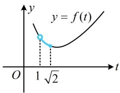

# 强化训练

##### 1. (2025·贵州模拟·★)

已知 $\cos \theta = -\frac{4}{5}$ ，且 $\theta \in \left(\frac{\pi}{2}, \pi\right)$ ，则 $\tan \theta = (\quad)$

$\quad$A. $\frac{4}{3}$

$\quad$B. $-\frac{4}{3}$

$\quad$C. $\frac{3}{4}$

$\quad$D. $-\frac{3}{4}$

##### 1. D

解析因为 $\cos \theta = -\frac{4}{5}$ ，且 $\theta \in \left(\frac{\pi}{2},\pi\right)$ ，所以 $\sin \theta >0$

故 $\sin \theta = \sqrt{1 - \cos^2\theta} = \frac{3}{5}$ ，故 $\tan \theta = \frac{\sin\theta}{\cos\theta} = -\frac{3}{4}$

##### 2. (2025·全国模拟·★★)

若 $2\sin \alpha + \cos \alpha = \sqrt{5}$ ，则 $\tan \alpha = (\quad)$

$\quad$A. $\frac{1}{2}$

$\quad$B. 2

$\quad$C. 2 或 $\frac{1}{2}$

$\quad$D. -2

##### 2. B

【解法1】可将已知的等式与 $\sin^2\alpha +\cos^2\alpha = 1$ 联立，求出 $\sin \alpha$ 和 $\cos \alpha$ ，再求 $\tan \alpha$

联立 $\left\{ \begin{array}{l}2\sin \alpha +\cos \alpha = \sqrt{5}\\ \sin^2\alpha +\cos^2\alpha = 1 \end{array} \right.$ 解得： $\left\{ \begin{array}{l}\sin \alpha = \frac{2\sqrt{5}}{5}\\ \cos \alpha = \frac{\sqrt{5}}{5} \end{array} \right.,$

所以 $\tan\alpha=\frac{\sin\alpha}{\cos\alpha}=2$

【解法2】将已知的式子平方，左侧可化为关于 $\sin \alpha$ 和 $\cos \alpha$ 的二次齐次式，这种式子可直接与正切联系起来，

因为 $2\sin \alpha + \cos \alpha = \sqrt{5}$ ，所以 $(2\sin \alpha + \cos \alpha)^2 =$

$4 \sin^ {2} \alpha + 4 \sin \alpha \cos \alpha + \cos^ {2} \alpha = 5,$

所以 $4\sin^2\alpha + 4\sin \alpha \cos \alpha + \cos^2\alpha = 5\sin^2\alpha + 5\cos^2\alpha$

化简得： $\sin^2\alpha -4\sin \alpha \cos \alpha +4\cos^2\alpha = 0$

所以 $\tan^{2}\alpha-4\tan\alpha+4=0$ ，故 $\tan\alpha=2$

##### 3. (2025·四川绵阳三模·★★)

已知 $\tan \alpha \sin \alpha = 3$ ，则 $\tan^2\alpha -\sin^2\alpha$ 的值为（）

$\quad$A. $\sqrt{3}$

$\quad$B. 3

$\quad$C. 9

$\quad$D. 81

##### 3. C

解析已知与所求有何关联？两式均涉及切和弦，不易直接看出关联，不妨先切化弦，再作对比，

由题意， $\tan \alpha \sin \alpha = \frac{\sin^2\alpha}{\cos\alpha} = 3$ ①，

所以 $\tan^2\alpha -\sin^2\alpha = \frac{\sin^2\alpha}{\cos^2\alpha} -\sin^2\alpha = \frac{\sin^2\alpha - \sin^2\alpha\cos^2\alpha}{\cos^2\alpha}$

$= \frac {\sin^ {2} \alpha (1 - \cos^ {2} \alpha)}{\cos^ {2} \alpha} = \frac {\sin^ {4} \alpha}{\cos^ {2} \alpha},$

结合式①可得 $\tan^2\alpha -\sin^2\alpha = 3^2 = 9$

##### 4. (2022·上海模拟·★★)

若 $\sin \theta = k\cos \theta$ ，则 $\sin \theta \cos \theta =$ \_\_\_\_.（用 $k$ 表示）

##### 4. $\frac{k}{k^2 + 1}$

解析因为 $\sin \theta = k\cos \theta$ ，所以 $\tan \theta = k$

故 $\sin \theta \cos \theta = \frac{\sin\theta\cos\theta}{\sin^2\theta + \cos^2\theta} = \frac{\tan\theta}{\tan^2\theta + 1} = \frac{k}{k^2 + 1}$

##### 5. (2024·全国甲卷·★★☆)

已知 $\frac{\cos\alpha}{\cos\alpha - \sin\alpha} = \sqrt{3}$ ，则 $\tan \left(\alpha + \frac{\pi}{4}\right) = (\quad)$

$\quad$A. $2 \sqrt{3} + 1$

$\quad$B. $2 \sqrt{3} - 1$

$\quad$C. $\frac{\sqrt{3}}{2}$

$\quad$D. $1 - \sqrt{3}$

##### 5. B

解析因为 $\frac{\cos\alpha}{\cos\alpha - \sin\alpha} = \sqrt{3}$ ，所以上下同除以 $\cos \alpha$ 可得 $\frac{1}{1 - \tan\alpha} = \sqrt{3}$ ，解得： $\tan \alpha = 1 - \frac{\sqrt{3}}{3}$ ，

故 $\tan \left(\alpha +\frac{\pi}{4}\right) = \frac{\tan\alpha + \tan\frac{\pi}{4}}{1 - \tan\alpha\tan\frac{\pi}{4}} = \frac{1 - \frac{\sqrt{3}}{3} + 1}{1 - \left(1 - \frac{\sqrt{3}}{3}\right)\times 1} = 2\sqrt{3} -1.$

##### 6. (2022·湖南模拟·★★★)

已知 $\sin \alpha + 2\cos \alpha = 0$ ，则 $\frac{\cos 2\alpha}{1 - \sin 2\alpha} =$ \_\_\_\_.

##### 6. $-\frac{1}{3}$

解析因为 $\sin \alpha + 2\cos \alpha = 0$ ，所以 $\tan \alpha = \frac{\sin \alpha}{\cos \alpha} = -2$ ，

目标式 $\frac{\cos 2\alpha}{1 - \sin 2\alpha}$ 怎么化？已有 $\tan \alpha$ ，所以考虑化单倍

角，分母可化为 $(\cos \alpha - \sin \alpha)^2$ ，故分子按 $\cos 2\alpha =$

$\cos^2\alpha - \sin^2\alpha$ 化，分解因式后恰好可以和分母约分，

$\begin{array}{l} \frac {\cos 2 \alpha}{1 - \sin 2 \alpha} = \frac {\cos^ {2} \alpha - \sin^ {2} \alpha}{(\cos \alpha - \sin \alpha) ^ {2}} = \frac {(\cos \alpha + \sin \alpha) (\cos \alpha - \sin \alpha)}{(\cos \alpha - \sin \alpha) ^ {2}} \\ = \frac {\cos \alpha + \sin \alpha}{\cos \alpha - \sin \alpha} = \frac {1 + \tan \alpha}{1 - \tan \alpha} = - \frac {1}{3}. \\ \end{array}$

##### 7. (2018·新课标Ⅱ卷·★★★)

已知 $\sin \alpha +\cos \beta = 1$ ， $\cos \alpha +\sin \beta = 0$ ，则

$\sin (\alpha + \beta) = \underline {{{\quad}}}.$

##### 7. $-\frac{1}{2}$

解析 $\sin (\alpha +\beta) = \sin \alpha \cos \beta +\cos \alpha \sin \beta$ ，怎样产生右边的两项？观察发现将所给等式平方即可，

$\left\{ \begin{array}{l} \sin \alpha + \cos \beta = 1 \\ \cos \alpha + \sin \beta = 0 \end{array} \Rightarrow \left\{ \begin{array}{l} \sin^ {2} \alpha + \cos^ {2} \beta + 2 \sin \alpha \cos \beta = 1 \\ \cos^ {2} \alpha + \sin^ {2} \beta + 2 \cos \alpha \sin \beta = 0 \end{array} , \right. \right.$

两式相加得： $2+2\sin(\alpha+\beta)=1$ ，所以 $\sin(\alpha+\beta)=-\frac{1}{2}$ .

##### 8. (★★★) (多选)

已知 $\alpha \in (0, \pi)$ ， $\sin \alpha + \cos \alpha = \frac{1}{5}$ ，以下选项正确的是（）

$\quad$A. $\sin 2\alpha = \frac{24}{25}$   
$\quad$B. $\sin \alpha -\cos \alpha = \frac{7}{5}$   
$\quad$C. $\cos 2\alpha = -\frac{7}{25}$   
$\quad$D. $\sin^4\alpha -\cos^4\alpha = -\frac{7}{25}$

##### 8. BC

解析A项， $\sin \alpha +\cos \alpha = \frac{1}{5}\Rightarrow (\sin \alpha +\cos \alpha)^2 =$

$\sin^ {2} \alpha + \cos^ {2} \alpha + 2 \sin \alpha \cos \alpha = 1 + \sin 2 \alpha = \frac {1}{2 5},$

所以 $\sin 2\alpha = -\frac{24}{25}$ ，故A项错误；

B项，将 $\sin \alpha -\cos \alpha$ 平方，可与 $\sin 2\alpha$ 联系起来，

$\begin{array}{l} (\sin \alpha - \cos \alpha) ^ {2} = \sin^ {2} \alpha + \cos^ {2} \alpha - 2 \sin \alpha \cos \alpha \\ = 1 - \sin 2 \alpha = 1 - \left(- \frac {2 4}{2 5}\right) = \frac {4 9}{2 5}, \\ \end{array}$

开根号取正还是取负？可由 $\sin 2\alpha$ 的符号结合 $\alpha$ 范围来看，

由A项的分析过程知 $\sin \alpha \cos \alpha = -\frac{12}{25} < 0$

结合 $\alpha \in (0,\pi)$ 可得 $\sin \alpha > 0$ ，所以 $\cos \alpha < 0$

从而 $\sin \alpha -\cos \alpha = \frac{7}{5}$ ，故B项正确；

C项， $\cos 2\alpha = \cos^2\alpha -\sin^2\alpha = (\cos \alpha +\sin \alpha)(\cos \alpha -\sin \alpha)$

$= \frac{1}{5}\times \left(-\frac{7}{5}\right) = -\frac{7}{25}$ ，故C项正确；

D 项， $\sin^{4}\alpha-\cos^{4}\alpha=(\sin^{2}\alpha+\cos^{2}\alpha)(\sin^{2}\alpha-\cos^{2}\alpha)$

$= \sin^2\alpha -\cos^2\alpha = -\cos 2\alpha = \frac{7}{25}$ ，故D项错误.

##### 9. (2022·湖北四校联考·★★★☆)

若 $a(\sin x + \cos x) \leq 2 + \sin x \cos x$ 对 $\forall x \in \left(0, \frac{\pi}{2}\right)$ 恒成立，则实数 $a$ 的最大值为 \_\_\_\_.

##### 9. $\frac{5\sqrt{2}}{4}$

解析看到 $\sin x + \cos x$ 和 $\sin x\cos x$ 出现在一个式子里，想

到将 $\sin x + \cos x$ 换元成 $t$ ，通过平方把 $\sin x\cos x$ 也用 $t$ 表示，

设 $t = \sin x + \cos x$ ，则 $t = \sqrt{2}\sin \left(x + \frac{\pi}{4}\right)$ ，当 $x\in \left(0,\frac{\pi}{2}\right)$ 时，

$x + \frac{\pi}{4}\in \left(\frac{\pi}{4},\frac{3\pi}{4}\right)$ ，所以 $1 < t = \sqrt{2}\sin \left(x + \frac{\pi}{4}\right)\leq \sqrt{2}$

又 $t^2 = (\sin x + \cos x)^2 = \sin^2 x + \cos^2 x + 2\sin x\cos x$

$= 1 + 2\sin x\cos x$ ，所以 $\sin x\cos x = \frac{t^2 - 1}{2}$

故 $a(\sin x + \cos x) \leq 2 + \sin x\cos x$ 即为 $at \leq 2 + \frac{t^2 - 1}{2}$ ,

也即 $a \leq \frac{1}{2}\left(t + \frac{3}{t}\right)$ ，如图， $f(t) = \frac{1}{2}\left(t + \frac{3}{t}\right)$ 在 $(1, \sqrt{2}]$ 上 $\searrow$ ，

所以 $f(t)_{\min} = f(\sqrt{2}) = \frac{5\sqrt{2}}{4}$ ，因为 $a \leq f(t)$ 恒成立，

所以 $a \leq \frac{5\sqrt{2}}{4}$ ，故 $a$ 的最大值为 $\frac{5\sqrt{2}}{4}$ .

