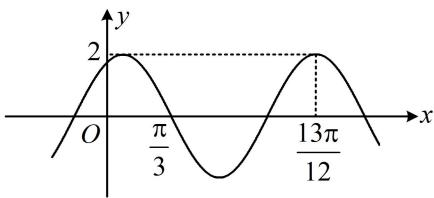
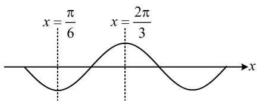
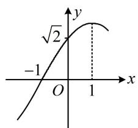
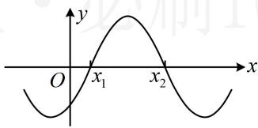
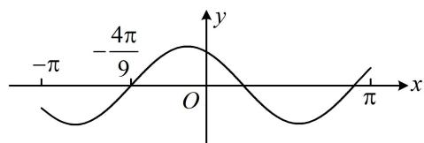
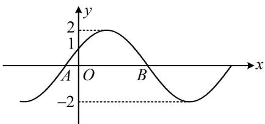
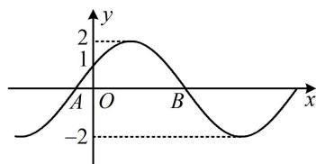

# 强化训练

##### 1. (★★)

已知函数 $f(x) = \sin^2\left(x + \frac{\pi}{3}\right) + \cos^2 x (x \in \mathbf{R})$ ，则 $f(x)$ 的最小正周期为 \_\_\_\_，值域为 \_\_\_\_.

##### 1. $\pi, \left[1 - \frac{\sqrt{3}}{2}, 1 + \frac{\sqrt{3}}{2}\right]$

解析先把解析式化简，两项均为平方，所以降次，

由题意， $f(x) = \frac{1 - \cos\left(2x + \frac{2\pi}{3}\right)}{2} +\frac{1 + \cos 2x}{2}$

$= 1 - \frac {1}{2} \cos \left(2 x + \frac {2 \pi}{3}\right) + \frac {1}{2} \cos 2 x,$

把 $\cos \left(2x + \frac{2\pi}{3}\right)$ 拆开，就可以用辅助角公式合并，

$f (x) = 1 - \frac {1}{2} \left(\cos 2 x \cos \frac {2 \pi}{3} - \sin 2 x \sin \frac {2 \pi}{3}\right) + \frac {1}{2} \cos 2 x$

$= 1 + \frac {\sqrt {3}}{4} \sin 2 x + \frac {3}{4} \cos 2 x = 1 + \frac {\sqrt {3}}{2} \sin \left(2 x + \frac {\pi}{3}\right),$

故 $f(x)$ 的最小正周期 $T = \frac{2\pi}{2} = \pi$ ，值域为 $\left[1 - \frac{\sqrt{3}}{2}, 1 + \frac{\sqrt{3}}{2}\right]$ .

##### 2. (2021·全国甲卷·★★)

已知函数 $f(x) = 2\cos (\omega x + \varphi)$ 的部分图象如图所示，则 $f\left(\frac{\pi}{2}\right) =$ \_\_\_\_.

##### 2. $-\sqrt{3}$

解析: 欲求 $f\left(\frac{\pi}{2}\right)$ , 先把解析式中的 $\omega$ 和 $\varphi$ 求出来, 图上标了一个零点 $\frac{\pi}{3}$ , 一个最大值点 $\frac{13\pi}{12}$ , 由它们可求出 $f(x)$ 的最小正周期, 从而求得 $\omega$ ,

设 $f(x)$ 的最小正周期为 $T$ ，由图可知， $\frac{13\pi}{12} - \frac{\pi}{3} = \frac{3}{4} T$

所以 $T = \pi$ ，从而 $\frac{2\pi}{|\omega|} = \pi$ ，故 $\omega = \pm 2$

不妨取 $\omega = 2$ ，则 $f(x) = 2\cos (2x + \varphi)$

再求 $\varphi$ ，首选代最值点，图中有最大值点 $x = \frac{13\pi}{12}$ 可代，

由图知 $f\left(\frac{13\pi}{12}\right) = 2\cos \left(2\times \frac{13\pi}{12} +\varphi\right) = 2\Rightarrow \cos \left(\frac{13\pi}{6} +\varphi\right) = 1$

所以 $\frac{13\pi}{6} +\varphi = 2k\pi$ ，故 $\varphi = 2k\pi -\frac{13\pi}{6} (k\in \mathbf{Z})$

所以 $f(x) = 2\cos \left(2x + 2k\pi -\frac{13\pi}{6}\right) = 2\cos \left(2x - \frac{\pi}{6}\right),$

故 $f\left(\frac{\pi}{2}\right) = 2\cos \frac{5\pi}{6} = -\sqrt{3}$

【反思】同一个图象可以有不同的解析式，所以本题 $\omega$ 取-2也行，如果取-2，答案会变吗？不会，因为求得的解析式必定能用诱导公式化为与 $\omega = 2$ 相同.

##### 3. (2023·全国乙卷·★★☆)

已知函数 $f(x) = \sin (\omega x + \varphi)$ 在区间 $\left(\frac{\pi}{6},\frac{2\pi}{3}\right)$ 单调递增，直线 $x = \frac{\pi}{6}$ 和 $x = \frac{2\pi}{3}$ 为函数 $y = f(x)$ 的图象的两条对称轴，则 $f\left(-\frac{5\pi}{12}\right) = ()$

$\quad$A. $-\frac{\sqrt{3}}{2}$

$\quad$B. $-\frac{1}{2}$

$\quad$C. $\frac{1}{2}$

$\quad$D. $\frac{\sqrt{3}}{2}$

##### 3. D

解析条件中有两条对称轴，以及它们之间的单调性，由此容易画出大致图象，故考虑画图来分析，

如图， $\frac{2\pi}{3} -\frac{\pi}{6} = \frac{T}{2}\Rightarrow T = \pi$ ，所以 $|\omega | = \frac{2\pi}{T} = 2\Rightarrow \omega = \pm 2$

同上题一样， $\omega$ 取哪个值均可，得到的解析式都可用诱导公式化为相同，不妨取 $\omega = 2$ ，则 $f(x) = \sin (2x + \varphi)$ ，再求 $\varphi$ ，代一个最值点即可，

由图可知， $f\left(\frac{\pi}{6}\right) = \sin \left(2\times \frac{\pi}{6} +\varphi\right) = \sin \left(\frac{\pi}{3} +\varphi\right) = -1$

所以 $\frac{\pi}{3} +\varphi = 2k\pi -\frac{\pi}{2}$ ，从而 $\varphi = 2k\pi -\frac{5\pi}{6} (k\in \mathbf{Z})$

故 $f(x) = \sin \left(2x + 2k\pi -\frac{5\pi}{6}\right) = \sin \left(2x - \frac{5\pi}{6}\right),$

所以 $f\left(-\frac{5\pi}{12}\right) = \sin \left[2\times \left(-\frac{5\pi}{12}\right) - \frac{5\pi}{6}\right]$

$= \sin \left(- \frac {5 \pi}{3}\right) = \sin \frac {\pi}{3} = \frac {\sqrt {3}}{2}.$

##### 4. (2023·海南模拟·★★★)

函数 $f(x) = A\cos (\omega x + \varphi)\left(A > 0,\omega >0,|\varphi | <   \frac{\pi}{2}\right)$ 的部分图象如图所示，则 $f\left(\frac{7}{3}\right) =$ （）

$\quad$A. $\frac{1}{2}$

$\quad$B. $\frac{\sqrt{2}}{2}$

$\quad$C. $\frac{\sqrt{3}}{3}$

$\quad$D. 1

##### 4. D

解析图上标注了零点-1和最大值点1，可由此求出周期，进而求得 $\omega$ ，由图可知， $1 - (-1) = \frac{T}{4}$ ，所以 $T = 8$

从而 $\omega = \frac{2\pi}{T} = \frac{\pi}{4}$ ，故 $f(x) = A\cos \left(\frac{\pi}{4} x + \varphi\right)$

求 $A$ 一般看最值, 但图中没有标注最大值和最小值, 观察发现图象上标了 $(-1,0)$ 和 $(0, \sqrt{2})$ 这两个点, 故尝试把它们代入解析式, 建立关于 $A$ 和 $\varphi$ 的方程组并求解,

$\left\{ \begin{array}{l l} {f (- 1) = A \cos \left(- \frac {\pi}{4} + \varphi\right) = 0 \quad ①} \\ {f （0） = A \cos \varphi = \sqrt {2} \quad ②} \end{array} \right., \text {由} ① \text {得} \cos \left(\varphi - \frac {\pi}{4}\right) = 0 ,$

结合 $\left|\varphi\right|<\frac{\pi}{2}$ 可得 $\varphi=-\frac{\pi}{4}$ ，代入②得 $A\cos\left(-\frac{\pi}{4}\right)=\sqrt{2}$ ，

所以 A=2 ，从而 $f(x)=2\cos\left(\frac{\pi}{4}x-\frac{\pi}{4}\right)$ ,

故 $f\left(\frac{7}{3}\right) = 2\cos \left(\frac{\pi}{4} \times \frac{7}{3} - \frac{\pi}{4}\right) = 2\cos \frac{\pi}{3} = 1.$

# 5.（2023·湖北武汉二调·★★★☆）

已知函数 $f(x) = A\sin (\omega x + \varphi)$ 的部分图象如图所示，其中 $A > 0$ ， $\omega > 0$ ， $-\frac{\pi}{2} < \varphi < 0$ 。在已知 $\frac{x_2}{x_1}$ 的条件下，则下列选项中可以确定其值的量为（）

$\quad$A. $\omega$

$\quad$B. $\varphi$

$\quad$C. $\frac{\varphi}{\omega}$

$\quad$D. $A \sin \varphi$

##### 5. B

解析观察发现 $x_{1}$ ， $x_{2}$ 是 $f(x)$ 的零点，所以可先求出它们，用于计算 $\frac{x_{2}}{x_{1}}$ ，由 $f(x) = 0$ 可得 $\sin (\omega x + \varphi) = 0$ ，

所以 $\omega x + \varphi = k\pi$ ，故 $x = \frac{k\pi - \varphi}{\omega} (k \in \mathbf{Z})$

由图可知 $x_{1}$ 和 $x_{2}$ 是最小的两个正零点，结合 $-\frac{\pi}{2} < \varphi < 0$ 可知它们分别对应 $k = 0$ 和 $k = 1$ 的情形，

所以 $x_{1} = -\frac{\varphi}{\omega}$ ， $x_{2} = \frac{\pi - \varphi}{\omega}$ ，从而 $\frac{x_2}{x_1} = -\frac{\pi - \varphi}{\varphi}$

故已知 $\frac{x_2}{x_1}$ 可求出 $\varphi$ ，选B.

##### 6. (2020·新课标Ⅰ卷·★★★☆)

设 $f(x) = \cos \left(\omega x + \frac{\pi}{6}\right)$ 在 $[- \pi, \pi]$ 的图象大致如下图，则 $f(x)$ 的最小正周期为（）

$\quad$A. $\frac{10\pi}{9}$

$\quad$B. $\frac{7\pi}{6}$

$\quad$C. $\frac{4\pi}{3}$

$\quad$D. $\frac{3 \pi}{2}$

##### 6. C

解析要求最小正周期，就是要求 $\omega$ ，怎么构造方程？图上只有 $\left(-\frac{4\pi}{9},0\right)$ 这一个点可代入解析式，故把它代进去，

由图可知， $f\left(-\frac{4\pi}{9}\right) = \cos \left(-\frac{4\pi}{9}\omega +\frac{\pi}{6}\right) = 0$

所以 $-\frac{4\pi}{9}\omega +\frac{\pi}{6} = k\pi +\frac{\pi}{2}$ ，解得： $\omega = -\frac{3 + 9k}{4} (k\in \mathbf{Z})$ ①，

图中 $x$ 轴上还标记了 $-\pi$ 和 $\pi$ ，它们虽不能代入解析式，但可用于估算周期的范围，从而得到 $\omega$ 的范围。例如， $-\frac{4\pi}{9}$ 与 $\pi$ 之间超过 1 个周期， $-\pi$ 与 $-\frac{4\pi}{9}$ 之间不足半个周期，

设 $f(x)$ 的最小正周期为 $T$ ，由图可知， $\frac{T}{2} > - \frac{4\pi}{9} -(-\pi)$

所以 $T > \frac{10\pi}{9}$ ，从而 $\frac{2\pi}{|\omega|} >\frac{10\pi}{9}$ ，故 $|\omega | <   \frac{9}{5}$ ②，

另一方面， $\pi -\left(-\frac{4\pi}{9}\right) > T$ ，所以 $T <   \frac{13\pi}{9}$ ，故 $\frac{2\pi}{|\omega|} <  \frac{13\pi}{9}$

所以 $|\omega| > \frac{18}{13}$ ，结合②可得 $\frac{18}{13} < |\omega| < \frac{9}{5}$ ，

此时再看式①，只要尝试 $k = \pm 2$ ， $\pm 1$ ，0等值，就会发现只有 $k = -1$ 才能满足上述范围，

所以 $\omega = -\frac{3 + 9\times(-1)}{4} = \frac{3}{2}$ ，故 $T = \frac{2\pi}{\omega} = \frac{4\pi}{3}$

##### 7. (2022·福建福州模拟·★★★☆)

如图， $A$ ， $B$ 是 $f(x) = 2\sin (\omega x + \varphi)\left(\omega >0,|\varphi | <   \frac{\pi}{2}\right)$ 的图象与 $x$ 轴的两个交点，若 $\left|OB\right| - \left|OA\right| = \frac{4\pi}{3}$ ，则 $\omega =$ （）

$\quad$A. 1

$\quad$B. $\frac{1}{2}$

$\quad$C. 2

$\quad$D. $\frac{2}{3}$

##### 7. B

【解法1】图象上横纵坐标都已知的点只有(0,1)这一个，先把它代入解析式，求得 $\varphi$

由图可知， $f(0) = 2\sin \varphi = 1$ ，所以 $\sin \varphi = \frac{1}{2}$

又 $\left|\varphi\right|<\frac{\pi}{2}$ ，所以 $\varphi=\frac{\pi}{6}$ ，故 $f(x)=2\sin\left(\omega x+\frac{\pi}{6}\right)$ ，

接下来求 $\omega$ ， $|OB| - |OA| = \frac{4\pi}{3}$ 这个条件肯定要用，所以我们求出 $A$ ， $B$ 的横坐标来表示 $|OB|$ 和 $|OA|$

令 $f(x) = 0$ 可得 $\sin \left(\omega x + \frac{\pi}{6}\right) = 0$ ，所以 $\omega x + \frac{\pi}{6} = k\pi$

故 $x = \frac{1}{\omega}\left(k\pi -\frac{\pi}{6}\right)(k\in \mathbf{Z})$

从图象来看，点 $A$ 处是 $f(x)$ 从 $y$ 轴往左边的第一个零点，必定为 $k = 0$ 的情形，

令 $k = 0$ 得： $x = -\frac{\pi}{6\omega}$ ，所以 $x_{A} = -\frac{\pi}{6\omega}$

点 $B$ 处是 $f(x)$ 从 $y$ 轴往右边的第一个零点，必为 $k = 1$ 的

情形，令 $k = 1$ 得： $x = \frac{5\pi}{6\omega}$ ，所以 $x_{B} = \frac{5\pi}{6\omega}$

从而 $\left|OA\right|=\frac{\pi}{6\omega}$ ， $\left|OB\right|=\frac{5\pi}{6\omega}$ ，故 $\left|OB\right|-\left|OA\right|=\frac{5\pi}{6\omega}-\frac{\pi}{6\omega}$

$= \frac{2\pi}{3\omega}$ ，由题意， $\frac{2\pi}{3\omega} = \frac{4\pi}{3}$ ，解得： $\omega = \frac{1}{2}$

【解法2】 $f(x)$ 的图象可由 $y = 2\sin x$ 横向平移和伸缩得来， $y = 2\sin x$ 的图象如图2，横向平移和伸缩不会改变水平方向上的线段长度比例，所以图1中 $\frac{|OA|}{|OB|}$ 与图2中 $\frac{|OM|}{|MN|}$ 相等，由图2可知， $\frac{|OM|}{|MN|} = \frac{\frac{\pi}{6} - 0}{\pi - \frac{\pi}{6}} = \frac{1}{5}$ ，所以 $\frac{|OA|}{|OB|} = \frac{1}{5}$ ，

结合 $\left|OB\right|-\left|OA\right|=\frac{4\pi}{3}$ 可得 $\left|OA\right|=\frac{\pi}{3}$ ， $\left|OB\right|=\frac{5\pi}{3}$ ，

所以 $|AB| = |OA| + |OB| = 2\pi$

由图1可知 $\left|AB\right| = \frac{T}{2}$ ，其中 $T$ 为 $f(x)$ 的最小正周期，

所以 $\frac{T}{2} = 2\pi$ ，从而 $T = 4\pi$ ，故 $\omega = \frac{2\pi}{T} = \frac{1}{2}$

图1

图2

