# 模块三 三角函数的图象性质

# 第1节 求三角函数解析式 $f(x) = A\sin (\omega x + \varphi) + B$ （★★★）

# 内容提要

求三角函数解析式 $f(x) = A\sin (\omega x + \varphi) + B$ 的常见题型有恒等变换化简、根据图象求解析式等.

##### 1. 恒等变换化简得到 $f(x) = A\sin (\omega x + \varphi) + B$ ：一般分“拆”、“降”、“合”三步.

①拆：若解析式中有 $\cos \left(2x - \frac{\pi}{6}\right)$ 这类结构，通常先拆开；  
②降：遇到 $\sin^2 x$ ， $\cos^2 x$ ， $\sin x\cos x$ ，可降次；（“拆”和“降”的顺序要视情况而定）  
③合：完成前两步后，通常就化为了 $f(x) = a\sin \omega x + b\cos \omega x + B$ 这类结构，最后可利用辅助角公式合并.

##### 2. 根据图象求解析式 $f(x) = A\sin (\omega x + \varphi) + B$ :

①用最大值和最小值求 $A$ ： $\left\{ \begin{array}{l}f(x)_{\max} = |A| + B\\ f(x)_{\min} = -|A| + B \end{array} \right.\Rightarrow \left|A\right| = \frac{f(x)_{\max} - f(x)_{\min}}{2};$   
②用最大值和最小值求 $B$ ： $\left\{ \begin{array}{l}f(x)_{\max} = |A| + B\\ f(x)_{\min} = -|A| + B \end{array} \right.\Rightarrow B = \frac{f(x)_{\max} + f(x)_{\min}}{2};$   
③用最小正周期 $T$ 求 $\omega: |\omega| = \frac{2\pi}{T}$ ;  
④最值点求 $\varphi$ ：将函数图象上的最大值或最小值点代入解析式，求出 $\varphi$ ．若图象上没有标最值点，也无法通过简单的推理得出最值点，则考虑代其它已知点求 $\varphi$ ．之所以首选最值点，是因为一个周期内，只有最大值或最小值点是唯一的，若代其它点，可能会有增根需要舍去.

##### 3. $y = \sin x$ 和 $y = \cos x$ 的图象及性质

<table><tr><td>函数</td><td>y=sin x</td><td>y=cos x</td></tr><tr><td>图象</td><td>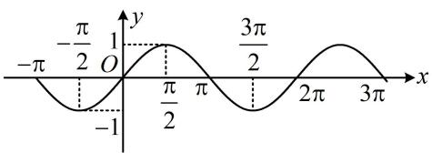</td><td>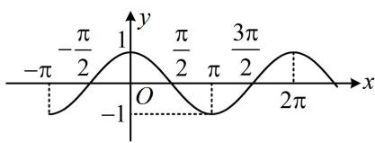</td></tr><tr><td>定义域</td><td>R</td><td>R</td></tr><tr><td>值域</td><td>[-1,1]</td><td>[-1,1]</td></tr><tr><td>周期性</td><td>最小正周期为2π</td><td>最小正周期为2π</td></tr><tr><td>奇偶性</td><td>奇函数</td><td>偶函数</td></tr><tr><td>单调性</td><td>单调递增区间: [2kπ-π/2,2kπ+π/2](k∈Z)单调递减区间: [2kπ+π/2,2kπ+3π/2](k∈Z)</td><td>单调递增区间: [2kπ-π,2kπ](k∈Z)单调递减区间: [2kπ,2kπ+π](k∈Z)</td></tr><tr><td>最值</td><td>当 $x = {2k\pi } + \frac{\pi }{2}\left( {k \in  \mathbf{Z}}\right)$ 时,  ${y}_{\max } = 1$  当  $x = {2k\pi } - \frac{\pi }{2}\left( {k \in  \mathbf{Z}}\right)$  时,  ${y}_{\min } =  - 1$ </td><td>当  $x = {2k\pi }\left( {k \in  \mathbf{Z}}\right)$  时,  ${y}_{\max } = 1$  当  $x = {2k\pi } + \pi \left( {k \in  \mathbf{Z}}\right)$  时,  ${y}_{\min } =  - 1$ </td></tr><tr><td>对称轴</td><td> $x = {k\pi } + \frac{\pi }{2}\left( {k \in  \mathbf{Z}}\right)$ </td><td> $x = {k\pi }\left( {k \in  \mathbf{Z}}\right)$ </td></tr><tr><td>对称中心</td><td> $\left( {{k\pi },0}\right) \left( {k \in  \mathbf{Z}}\right)$ </td><td> $\left( {{k\pi } + \frac{\pi }{2},0}\right) \left( {k \in  \mathbf{Z}}\right)$ </td></tr></table>

##### 4. $y = \tan x$ 的图象及性质

<table><tr><td>函数</td><td> $y = \tan x$ </td><td> $y = A\tan (\omega x + \varphi)(A > 0, \omega > 0)$ </td></tr><tr><td>图象</td><td>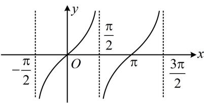</td><td>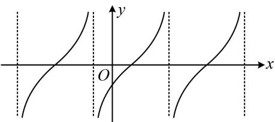</td></tr><tr><td>定义域</td><td> $\left\{x \mid x \neq k\pi + \frac{\pi}{2}, k \in \mathbf{Z}\right\}$ </td><td> $\left\{x \mid \omega x + \varphi \neq k\pi + \frac{\pi}{2}, k \in \mathbf{Z}\right\}$ </td></tr><tr><td>值域</td><td>R</td><td>R</td></tr><tr><td>最小正周期</td><td> $\pi$ </td><td> $\frac{\pi}{\omega}$ </td></tr><tr><td>奇偶性</td><td>奇函数</td><td>当 $\varphi = \frac{k\pi}{2}(k \in \mathbf{Z})$ 时为奇函数,否则为非奇非偶函数</td></tr><tr><td>增区间</td><td> $(k\pi - \frac{\pi}{2}, k\pi + \frac{\pi}{2})(k \in \mathbf{Z})$ </td><td> $\left(\frac{1}{\omega}(k\pi - \frac{\pi}{2} - \varphi), \frac{1}{\omega}(k\pi + \frac{\pi}{2} - \varphi)\right)(k \in \mathbf{Z})$ </td></tr><tr><td>对称中心</td><td> $\left(\frac{k\pi}{2}, 0\right)(k \in \mathbf{Z})$ </td><td> $\left(\frac{1}{\omega}\left(\frac{k\pi}{2} - \varphi\right), 0\right)(k \in \mathbf{Z})$ </td></tr></table>

##### 5. 设 $A > 0$ ， $\omega > 0$ ，则函数 $y = A\sin (\omega x + \varphi)$ 和 $y = A\cos (\omega x + \varphi)$ 的性质如下表：

<table><tr><td>函数</td><td> $y = A\sin(\omega x + \varphi)$ </td><td> $y = A\cos(\omega x + \varphi)$ </td></tr><tr><td>定义域</td><td> $\mathbf{R}$ </td><td> $\mathbf{R}$ </td></tr><tr><td>值域</td><td> $[-A, A]$ </td><td> $[-A, A]$ </td></tr><tr><td>周期性</td><td>最小正周期为 $\frac{2\pi}{\omega}$ </td><td>最小正周期为 $\frac{2\pi}{\omega}$ </td></tr><tr><td>单调性</td><td>增区间:  $2k\pi - \frac{\pi}{2} \leq \omega x + \varphi \leq 2k\pi + \frac{\pi}{2}(k \in \mathbf{Z})$ 减区间:  $2k\pi + \frac{\pi}{2} \leq \omega x + \varphi \leq 2k\pi + \frac{3\pi}{2}(k \in \mathbf{Z})$ </td><td>增区间:  $2k\pi - \pi \leq \omega x + \varphi \leq 2k\pi (k \in \mathbf{Z})$ 减区间:  $2k\pi \leq \omega x + \varphi \leq 2k\pi + \pi (k \in \mathbf{Z})$ </td></tr><tr><td>最值</td><td>当  $\omega x + \varphi = 2k\pi + \frac{\pi}{2}(k \in \mathbf{Z})$  时, $y_{\max } = A$ 当  $\omega x + \varphi = 2k\pi - \frac{\pi}{2}(k \in \mathbf{Z})$  时, $y_{\min } = -A$ </td><td>当  $\omega x + \varphi = 2k\pi (k \in \mathbf{Z})$  时, $y_{\max } = A$ 当  $\omega x + \varphi = 2k\pi + \pi (k \in \mathbf{Z})$  时, $y_{\min } = -A$ </td></tr><tr><td>对称轴</td><td> $\omega x + \varphi = k\pi + \frac{\pi}{2}(k \in \mathbf{Z})$ </td><td> $\omega x + \varphi = k\pi (k \in \mathbf{Z})$ </td></tr><tr><td>对称中心</td><td> $\left( \frac{1}{\omega}(k\pi - \varphi), 0 \right)(k \in \mathbf{Z})$ </td><td> $\left( \frac{1}{\omega}\left( k\pi + \frac{\pi}{2} - \varphi \right), 0 \right)(k \in \mathbf{Z})$ </td></tr></table>

# 类型 I：化简求解析式

【例 1】已知函数 $f(x)=\sin x\cos\left(x+\frac{\pi}{6}\right)$ ，则 $f(x)$ 的最小正周期为 \_\_\_\_，值域为 \_\_\_\_.解析：要求周期和值域，得把解析式化为 $y = A\sin (\omega x + \varphi) + B$ 这种形式，先拆 $\cos \left(x + \frac{\pi}{6}\right)$ 这部分，由题意， $f(x) = \sin x\left(\cos x\cos \frac{\pi}{6} -\sin x\sin \frac{\pi}{6}\right) = \frac{\sqrt{3}}{2}\sin x\cos x - \frac{1}{2}\sin^2 x$ ，再对 $\sin x\cos x$ 和 $\sin^2 x$ 降次，所以 $f(x) = \frac{\sqrt{3}}{4}\sin 2x - \frac{1}{2}\cdot \frac{1 - \cos 2x}{2} = \frac{\sqrt{3}}{4}\sin 2x + \frac{1}{4}\cos 2x - \frac{1}{4},$ 最后用辅助角公式合并，故 $f(x) = \frac{1}{2}\sin \left(2x + \frac{\pi}{6}\right) - \frac{1}{4}$ ，所以 $f(x)$ 的最小正周期 $T = \frac{2\pi}{2} = \pi$ ，最小值为 $-\frac{3}{4}$ ，最大值为 $\frac{1}{4}$ ，故 $f(x)$ 的值域为 $\left[-\frac{3}{4}, \frac{1}{4}\right]$ .

答案 $\pi$ ， $\left[-\frac{3}{4},\frac{1}{4}\right]$

【反思】化简三角函数解析式的步骤：①拆：例如本题遇到 $\cos\left(x+\frac{\pi}{6}\right)$ 这种结构，将其拆开；②降：用降次公式对 $\sin^{2}x$ ， $\cos^{2}x$ ， $\sin x\cos x$ 这类项降次；③合：用辅助角公式合并.

##### 【变式】(2019·浙江卷（节选）) 设 $f(x) = \sin x (x \in \mathbf{R})$ ，求 $y = \left[ f\left( x + \frac{\pi}{12} \right) \right]^2 + \left[ f\left( x + \frac{\pi}{4} \right) \right]^2$ 的值域.解：由题意， $y=\left[f\left(x+\frac{\pi}{12}\right)\right]^{2}+\left[f\left(x+\frac{\pi}{4}\right)\right]^{2}=\sin^{2}\left(x+\frac{\pi}{12}\right)+\sin^{2}\left(x+\frac{\pi}{4}\right)$

(要求该函数的值域, 应将其化为 $y = A \sin (\omega x + \varphi) + B$ 的形式, 先用降次公式降次)

$y = \sin^ {2} \left(x + \frac {\pi}{1 2}\right) + \sin^ {2} \left(x + \frac {\pi}{4}\right) = \frac {1 - \cos \left(2 x + \frac {\pi}{6}\right)}{2} + \frac {1 - \cos \left(2 x + \frac {\pi}{2}\right)}{2} = \frac {1 - \cos \left(2 x + \frac {\pi}{6}\right)}{2} + \frac {1 + \sin 2 x}{2},$

(接下来拆 $\cos\left(2x+\frac{\pi}{6}\right)$ 这部分，随后再用辅助角公式合并)

$y = 1 - \frac {1}{2} \left(\cos 2 x \cos \frac {\pi}{6} - \sin 2 x \sin \frac {\pi}{6}\right) + \frac {1}{2} \sin 2 x = 1 + \frac {3}{4} \sin 2 x - \frac {\sqrt {3}}{4} \cos 2 x = 1 + \frac {\sqrt {3}}{2} \sin \left(2 x - \frac {\pi}{6}\right),$

因为 $-1 \leq \sin \left(2x - \frac{\pi}{6}\right) \leq 1$ ，所以函数 $y = \left[f\left(x + \frac{\pi}{12}\right)\right]^2 + \left[f\left(x + \frac{\pi}{4}\right)\right]^2$ 的值域是 $\left[1 - \frac{\sqrt{3}}{2}, 1 + \frac{\sqrt{3}}{2}\right]$ .

【反思】若解析式中有像 $\sin^{2}\left(x+\frac{\pi}{12}\right)$ 这类平方项，应先降次，而不是先拆角，再平方展开，降次，合并.

# 类型Ⅱ：由部分图象求解析式

【例 2】如图是 $f(x)=A\sin(\omega x+\varphi)\left(A>0,\omega>0,|\varphi|<\frac{\pi}{2}\right)$ 的部分图象，
则 $f(x)=$ \_\_\_\_.

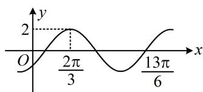

解析从图象可以看出 $f(x)$ 的最大值，可由此求出 $A$ ，由图可知 $f(x)_{\mathrm{max}} = A = 2$

图象上 $\frac{2\pi}{3}$ 到 $\frac{13\pi}{6}$ 这一段是 $\frac{3}{4}$ 个周期，所以周期可求，那么 $\omega$ 也就有了，

$\frac{13\pi}{6}-\frac{2\pi}{3}=\frac{3\pi}{2}=\frac{3}{4}T$ ，所以 $T=2\pi$ ，故 $\omega=\frac{2\pi}{T}=1$ ；

最后代点求 $\varphi$ ，首选最值点，此处本身就给出 $\frac{2\pi}{3}$ 这个最大值点，就代它，

由图可知， $f\left(\frac{2\pi}{3}\right) = 2\sin \left(\frac{2\pi}{3} +\varphi\right) = 2\Rightarrow \sin \left(\frac{2\pi}{3} +\varphi\right) = 1\Rightarrow \frac{2\pi}{3} +\varphi = 2k\pi +\frac{\pi}{2}\Rightarrow \varphi = 2k\pi -\frac{\pi}{6} (k\in \mathbf{Z})$

又 $\left|\varphi\right|<\frac{\pi}{2}$ ，所以k只能取0， $\varphi=-\frac{\pi}{6}$ ，故 $f(x)=2\sin\left(x-\frac{\pi}{6}\right)$ .

答案 $2\sin \left(x - \frac{\pi}{6}\right)$

##### 【变式1】已知函数 $f(x) = A\sin (\omega x + \varphi) + B\left(\omega > 0, |\varphi| < \frac{\pi}{2}\right)$ 的部分图象如图所示，则（）

$\quad$A. $f(x) = -4\sin \left(\frac{\pi}{8} x + \frac{\pi}{4}\right) + 2$

$\quad$B. $f(x) = 4\sin \left(\frac{\pi}{8} x - \frac{\pi}{4}\right) + 2$

$\quad$C. $f(x) = -4\sin \left(\frac{\pi}{8} x - \frac{\pi}{4}\right) + 2$

$\quad$D. $f(x) = 4\sin \left(\frac{\pi}{8} x + \frac{\pi}{4}\right) + 2$

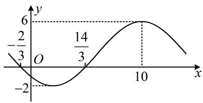

【解法1】: 图上只有一个最大值点, 求周期还不够, 观察发现可由 $x$ 轴上的两个点推断出最小值点, 由所给图象可知, $x = -\frac{2}{3}$ 和 $x = \frac{14}{3}$ 的中间 $x = 2$ 必为最小值点, 所以 $\frac{T}{2} = 10 - 2 = 8$ ,

从而 $T = 16$ ，故 $\omega = \frac{2\pi}{T} = \frac{\pi}{8}$ ，所以 $f(x) = A\sin \left(\frac{\pi}{8} x + \varphi\right) + B$

从图象可以看出最大、最小值分别为6和-2，可由此求 $A$ 和 $B$ ，但由于没给 $A$ 的正负，故需讨论，

①当 $A > 0$ 时，由图可知， $\left\{ \begin{array}{l} A + B = 6 \\ -A + B = -2 \end{array} \right.$ ，解得： $A = 4$ ， $B = 2$ ，所以 $f(x) = 4\sin \left(\frac{\pi}{8} x + \varphi\right) + 2$ 最后求 $\varphi$ ，首选最值点，代最小值点 $x = 2$ 或最大值点 $x = 10$ 均可，不妨代 $x = 2$

故 $f(2) = 4\sin \left(\frac{\pi}{8}\times 2 + \varphi\right) + 2 = -2$ ，所以 $\sin \left(\frac{\pi}{4} +\varphi\right) = -1$

因为 $|\varphi| < \frac{\pi}{2}$ ，所以 $-\frac{\pi}{2} < \varphi < \frac{\pi}{2}$ ，从而 $-\frac{\pi}{4} < \frac{\pi}{4} + \varphi < \frac{3\pi}{4}$ ，故 $\sin \left(\frac{\pi}{4} + \varphi\right) = -1$ 无解；

②当 $A < 0$ 时，由图可知， $\left\{ \begin{array}{l} - A + B = 6 \\ A + B = -2 \end{array} \right.$ ，解得： $A = -4$ ， $B = 2$ ，所以 $f(x) = -4\sin \left(\frac{\pi}{8} x + \varphi\right) + 2$

接下来再求 $\varphi$ ，还是代最小值点 $x = 2$ ， $f(2) = -4\sin \left(\frac{\pi}{4} +\varphi\right) + 2 = -2\Rightarrow \sin \left(\frac{\pi}{4} +\varphi\right) = 1$

结合 $-\frac{\pi}{4} < \frac{\pi}{4} + \varphi < \frac{3\pi}{4}$ 可得 $\frac{\pi}{4} + \varphi = \frac{\pi}{2}$ ，所以 $\varphi = \frac{\pi}{4}$ ，故 $f(x) = -4\sin \left(\frac{\pi}{8} x + \frac{\pi}{4}\right) + 2$ 。

【解法2】: 这种给出部分图象, 选解析式的题, 有时也可结合图象的一些特征, 用排除法来选答案,由图可知, $f \left(- \frac{2}{3}\right) = 0$ , 经检验, 选项B、C、D均不满足, 故选A.

答案: A

【反思】①不确定 A 的正负时，可讨论；②选择题抓住图中关键信息，用排除法选答案也是好方法.

##### 【变式2】下图是函数 $f(x) = A\sin (\omega x + \varphi)\left(A > 0, \omega > 0, |\varphi| < \frac{\pi}{2}\right)$ 的部分

图象，则 $f\left(\frac{3\pi}{4}\right)=$ \_\_\_\_.

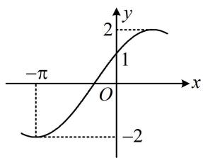

解析图中标注了最大、最小值，可由此求 $A$ ，

由图可知， $f(x)_{\mathrm{max}} = 2$ ，结合 $A > 0$ 可得 $A = 2$

接下来一般的想法是由图上的关键点（最值点、零点）求周期，但本题的关键点只有一个最小值点，也无法推断其它关键点，所以求不出周期，故只能尝试把图中标出的 $(- \pi, -2)$ 和(0,1)这两个点代进解析式，

由图可知， $\left\{\begin{aligned}f(-\pi)&=2\sin(-\omega\pi+\varphi)=-2①\\ f(0)&=2\sin\varphi=1②\end{aligned}\right.$ ，我们发现式②是关于 $\varphi$ 的单变量方程，可先求出 $\varphi$ ，

由②可得 $\sin \varphi = \frac{1}{2}$ ，结合 $|\varphi| < \frac{\pi}{2}$ 可得 $\varphi = \frac{\pi}{6}$ ，代入①化简得： $\sin \left(-\omega \pi + \frac{\pi}{6}\right) = -1$ ，

所以 $-\omega \pi + \frac{\pi}{6} = 2k\pi - \frac{\pi}{2}$ ，故 $\omega = \frac{2}{3} - 2k (k \in \mathbf{Z})$ ，

要求 $\omega$ ，还需筛选 $k$ ，怎么办呢？由图虽无法看出周期，但能看出周期的范围，进而得到 $\omega$ 的范围，

如图，P，M两点的横向距离是 $\frac{T}{4}$ ，此距离小于点P到y轴的距离 $\pi$ ，所以 $\frac{T}{4}<\pi$ ，故 $T<4\pi$ ，

又 $P, Q$ 两点的横向距离为 $\frac{T}{2}$ , 此距离大于点 $P$ 到 $y$ 轴的距离, 所以 $\frac{T}{2} > \pi$ , 故 $T > 2\pi$ ,

所以 $2\pi < T < 4\pi$ ，从而 $2\pi < \frac{2\pi}{\omega} < 4\pi$ ，故 $\frac{1}{2} < \omega < 1$

结合 $\omega = \frac{2}{3} - 2k$ 可得 $k$ 只能取0，此时 $\omega = \frac{2}{3}$ ，

所以 $f(x) = 2\sin \left(\frac{2}{3} x + \frac{\pi}{6}\right)$ ，故 $f\left(\frac{3\pi}{4}\right) = 2\sin \left(\frac{2}{3} \times \frac{3\pi}{4} + \frac{\pi}{6}\right) = 2\sin \frac{2\pi}{3} = \sqrt{3}$ .

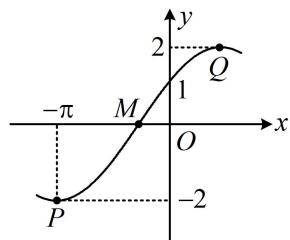

答案: $\sqrt{3}$

【反思】当无法从图上直接观察或推断出周期时，可以考虑利用最值点、零点这些关键点的横向距离构造不等式限定周期的范围，从而得出 $\omega$ 的范围.

# 类型III：由伸缩比例求周期

【例 3】(2023·新课标Ⅱ卷) 已知函数 $f(x) = \sin (\omega x + \varphi)$ ，如图， $A, B$ 是直线 $y = \frac{1}{2}$ 与曲线 $y = f(x)$ 的两个交点，若 $|AB| = \frac{\pi}{6}$ ，则 $f(\pi) =$ \_\_\_\_.

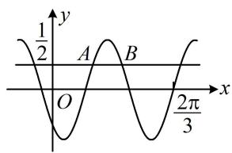

【解法1】: 条件 $|AB| = \frac{\pi}{6}$ 怎么翻译? 可由 $\sin (\omega x + \varphi) = \frac{1}{2}$ 求 $A, B$ 横坐标的通解, 得到 $|AB|$ , 建立方程求 $\omega$ , 不妨设 $\omega > 0$ , 令 $\sin (\omega x + \varphi) = \frac{1}{2}$ 可得 $\omega x + \varphi = 2k\pi + \frac{\pi}{6}$ 或 $2k\pi + \frac{5\pi}{6}$ , 其中 $k \in \mathbf{Z}$ ,

由所给图象可知， $\omega x_{A} + \varphi = 2k\pi +\frac{\pi}{6}$ ， $\omega x_{B} + \varphi = 2k\pi +\frac{5\pi}{6}$ ，将上述两式作差得： $\omega (x_B - x_A) = \frac{2\pi}{3}$

所以 $x_{B} - x_{A} = \frac{2\pi}{3\omega}$ ，又 $\left|AB\right| = x_{B} - x_{A} = \frac{\pi}{6}$ ，所以 $\frac{2\pi}{3\omega} = \frac{\pi}{6}$ ，解得： $\omega = 4$ ，故 $f(x) = \sin (4x + \varphi)$

再求 $\varphi$ ，由所给图象知 $\frac{2\pi}{3}$ 是零点，可代入解析式。注意， $\frac{2\pi}{3}$ 是增区间上的零点，且 $y = \sin x$ 的增区间上的零点是 $2n\pi$ ，故应按它来求 $\varphi$ 的通解，所以 $\frac{8\pi}{3} + \varphi = 2n\pi (n \in \mathbf{Z})$ ，从而 $\varphi = 2n\pi - \frac{8\pi}{3}$ ，

故 $f(x) = \sin \left(4x + 2n\pi -\frac{8\pi}{3}\right) = \sin \left(4x - \frac{2\pi}{3}\right)$ ，所以 $f(\pi) = \sin \left(4\pi -\frac{2\pi}{3}\right) = \sin \left(-\frac{2\pi}{3}\right) = -\sin \frac{2\pi}{3} = -\frac{\sqrt{3}}{2}.$

【解法2】: 若注意到横向伸缩虽会改变图象在水平方向上的线段长度, 但不改变长度比例, 则可先分析 $y = \sin x$ 与 $y = \frac{1}{2}$ 交点的情况, 再按比例对应到本题的图中来,

如图1，直线 $y = \frac{1}{2}$ 与 $y = \sin x$ 在 $y$ 轴右侧的三个交点 $I, J, K$ 的横坐标分别为 $\frac{\pi}{6}, \frac{5\pi}{6}, \frac{13\pi}{6}$ ，

所以 $\left|IJ\right|=\frac{5\pi}{6}-\frac{\pi}{6}=\frac{2\pi}{3}$ ， $\left|JK\right|=\frac{13\pi}{6}-\frac{5\pi}{6}=\frac{4\pi}{3}$ ， $\left|IJ\right|:\left|JK\right|=1:2$ ，故在图2中 $\left|AB\right|:\left|BC\right|=1:2$ ，

因为 $|AB| = \frac{\pi}{6}$ ，所以 $|BC| = \frac{\pi}{3}$ ，故 $|AC| = |AB| + |BC| = \frac{\pi}{2}$ ，又由图2可知 $|AC| = T$ ，所以 $T = \frac{\pi}{2}$ ，

故 $\omega = \frac{2\pi}{T} = 4$ ，接下来同解法1.

答案 $-\frac{\sqrt{3}}{2}$

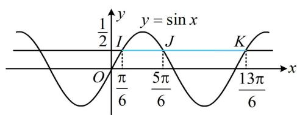

图1

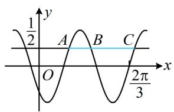

图2

【反思】①对于函数 $y = \sin (\omega x + \varphi)(\omega > 0)$ ，若只能用零点来求解析式，则需尽量确定零点是在增区间还是减区间。增区间的零点用 $\omega x + \varphi = 2n\pi$ 来求，减区间的零点用 $\omega x + \varphi = 2n\pi + \pi$ 来求；②对图象进行横向伸缩时，水平方向的线段长度比例关系不变，当涉及水平线与图象交点的距离时，我们常抓住这一特征来求周期。

# 强化训练

##### 1. (★★)

已知函数 $f(x) = \sin^2\left(x + \frac{\pi}{3}\right) + \cos^2 x (x \in \mathbf{R})$ ，则 $f(x)$ 的最小正周期为 \_\_\_\_，值域为 \_\_\_\_.

##### 2. (2021·全国甲卷·★★)

已知函数 $f(x) = 2\cos (\omega x + \varphi)$ 的部分图象如图所示，则 $f\left(\frac{\pi}{2}\right) =$ \_\_\_\_.

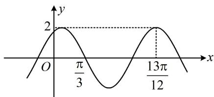

##### 3. (2023·全国乙卷·★★☆)

已知函数 $f(x) = \sin (\omega x + \varphi)$ 在区间 $\left(\frac{\pi}{6},\frac{2\pi}{3}\right)$ 单调递增，直线 $x = \frac{\pi}{6}$ 和 $x = \frac{2\pi}{3}$ 为函数 $y = f(x)$ 的图象的两条对称轴，则 $f\left(-\frac{5\pi}{12}\right) = ()$

$\quad$A. $-\frac{\sqrt{3}}{2}$

$\quad$B. $-\frac{1}{2}$

$\quad$C. $\frac{1}{2}$

$\quad$D. $\frac{\sqrt{3}}{2}$

##### 4. (2023·海南模拟·★★★)

函数 $f(x) = A\cos (\omega x + \varphi)\left(A > 0,\omega >0,|\varphi | <   \frac{\pi}{2}\right)$ 的部分图象如图所示，则 $f\left(\frac{7}{3}\right) =$ （）

$\quad$A. $\frac{1}{2}$

$\quad$B. $\frac{\sqrt{2}}{2}$

$\quad$C. $\frac{\sqrt{3}}{3}$

$\quad$D. 1

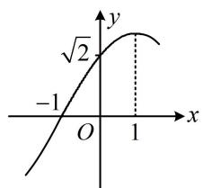

##### 5. (2023·湖北武汉二调·★★★☆)

已知函数 $f(x) = A\sin (\omega x + \varphi)$ 的部分图象如图所示，其中 $A > 0$ ， $\omega > 0$ ， $-\frac{\pi}{2} < \varphi < 0$ 。在已知 $\frac{x_2}{x_1}$ 的条件下，则下列选项中可以确定其值的量为（）

$\quad$A. $\omega$

$\quad$B. $\varphi$

$\quad$C. $\frac{\varphi}{\omega}$

$\quad$D. $A \sin \varphi$

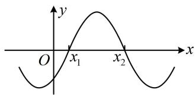

##### 6. (2020·新课标Ⅰ卷·★★★☆)

设 $f(x) = \cos \left(\omega x + \frac{\pi}{6}\right)$ 在 $[- \pi, \pi]$ 的图象大致如下图，则 $f(x)$ 的最小正周期为（）

$\quad$A. $\frac{10\pi}{9}$

$\quad$B. $\frac{7\pi}{6}$

$\quad$C. $\frac{4\pi}{3}$

$\quad$D. $\frac{3\pi}{2}$

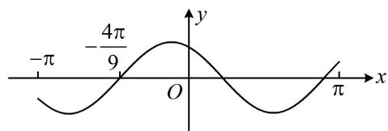

##### 7.（2022·福建福州模拟·★★★☆）

如图， $A$ ， $B$ 是 $f(x) = 2\sin (\omega x + \varphi)\left(\omega >0,|\varphi | <   \frac{\pi}{2}\right)$ 的图象与 $x$ 轴的两个交点，若 $\left|OB\right| - \left|OA\right| = \frac{4\pi}{3}$ ，则 $\omega =$ （）

$\quad$A. 1

$\quad$B. $\frac{1}{2}$

$\quad$C. 2

$\quad$D. $\frac{2}{3}$

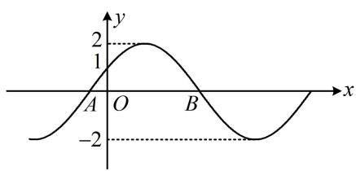

