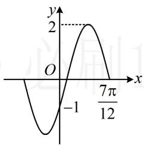

# 强化训练

##### 1. (2022·四川成都模拟·★)

要得到函数 $y = \cos \left(2x - \frac{\pi}{4}\right)$ 的图象，只需要将函数 $y = \cos 2x$ 的图象（）

$\quad$A. 向左平移 $\frac{\pi}{8}$ 个单位  
$\quad$B. 向右平移 $\frac{\pi}{8}$ 个单位  
$\quad$C. 向左平移 $\frac{\pi}{4}$ 个单位  
$\quad$D. 向右平移 $\frac{\pi}{4}$ 个单位

##### 1. B

解析先将系数化1， $y = \cos \left(2x - \frac{\pi}{4}\right) = \cos 2\left(x - \frac{\pi}{8}\right)$ ，

在 $y = \cos 2x$ 中将 x 换成 $x - \frac{\pi}{8}$ 即得 $y = \cos\left(2x - \frac{\pi}{4}\right)$ ,

所以将 $y = \cos 2x$ 的图象右移 $\frac{\pi}{8}$ 可得到 $y = \cos \left(2x - \frac{\pi}{4}\right)$ .

##### 2. (2022·山西模拟·★★)

为了得到函数 $y = \cos\left(2x - \frac{\pi}{6}\right)$ 的图象，需把函数 $y = \sin 2x$ 的图象上的所有点至少向左平移 \_\_\_\_ 个单位.

##### 2. $\frac{\pi}{6}$

解析先化同名，二者 $x$ 的系数相同，可利用 $\cos \alpha =$

$\sin\left(\frac{\pi}{2}+\alpha\right)$ 将余弦化正弦，

$y = \cos \left(2 x - \frac {\pi}{6}\right) = \sin \left[ \frac {\pi}{2} + \left(2 x - \frac {\pi}{6}\right) \right] = \sin 2 \left(x + \frac {\pi}{6}\right),$

在 $y = \sin 2x$ 中将 $x$ 换成 $x + \frac{\pi}{6}$ 即得 $y = \sin 2\left(x + \frac{\pi}{6}\right)$ ,

所以将 $y = \sin 2x$ 的图象至少向左平移 $\frac{\pi}{6}$ 个单位，可以得到 $y = \cos \left(2x - \frac{\pi}{6}\right)$ 的图象.

##### 3. (2022·山东潍坊模拟·★★)

为了得到函数 $y=\sin\left(2x+\frac{\pi}{3}\right)$ 的图象，需把 $y=\sin\left(\frac{\pi}{4}-2x\right)$ 的图象上所有点至少向右平移 \_\_\_\_ 个单位.

##### 3. $\frac{5\pi}{24}$

解析函数名相同， $x$ 的系数相反，得先将 $x$ 的系数化为相同，可用 $\sin \alpha = \sin (\pi -\alpha)$ 来化，

$\sin \left(\frac {\pi}{4} - 2 x\right) = \sin \left[ \pi - \left(\frac {\pi}{4} - 2 x\right) \right] = \sin \left(2 x + \frac {3 \pi}{4}\right)$

$= \sin 2 \left(x + \frac {3 \pi}{8}\right), \quad \sin \left(2 x + \frac {\pi}{3}\right) = \sin 2 \left(x + \frac {\pi}{6}\right),$

为了看出平移的量，可用 $x + \frac{3\pi}{8}$ 与 $x + \frac{\pi}{6}$ 作差，

$\left(x + \frac {3 \pi}{8}\right) - \left(x + \frac {\pi}{6}\right) = \frac {5 \pi}{2 4} \Rightarrow \left(x - \frac {5 \pi}{2 4}\right) + \frac {3 \pi}{8} = x + \frac {\pi}{6},$

即在 $y = \sin 2\left(x + \frac{3\pi}{8}\right)$ 中将 $x$ 换成 $x - \frac{5\pi}{24}$ ，可得到 $y = \sin$

$2\left(x + \frac{\pi}{6}\right)$ ，故至少把 $y = \sin \left(\frac{\pi}{4} - 2x\right)$ 的图象向右平移 $\frac{5\pi}{24}$ 个单位，可以得到 $y = \sin \left(2x + \frac{\pi}{3}\right)$ 的图象.

##### 4. (2022·河南模拟·★★★)

已知函数 $f(x) = \sin (\omega x + \varphi)\left(\omega > 0, 0 < \varphi < \frac{\pi}{2}\right)$ 的最小正周期为 $\pi$ ，且满足 $f(x + \varphi) = f(\varphi - x)$ ，则要得到函数 $f(x)$ 的图象，可将 $g(x) = \cos \omega x$ 的图象（）

$\quad$A. 向左平移 $\frac{\pi}{3}$ 个单位长度  
$\quad$B. 向右平移 $\frac{\pi}{3}$ 个单位长度  
$\quad$C. 向左平移 $\frac{\pi}{6}$ 个单位长度  
$\quad$D. 向右平移 $\frac{\pi}{6}$ 个单位长度

##### 4. D

解析由题意， $f(x)$ 的最小正周期 $T = \frac{2\pi}{\omega} = \pi$

所以 $\omega = 2$ ，故 $f(x) = \sin (2x + \varphi)$ ， $g(x) = \cos 2x$

因为 $f(x + \varphi) = f(\varphi -x)$ ，所以 $f(x)$ 的图象关于直线 $x = \varphi$

对称，从而 $2\varphi + \varphi = k\pi + \frac{\pi}{2}$ ，故 $\varphi = \frac{k\pi}{3} + \frac{\pi}{6} (k \in \mathbf{Z})$

又 $0 < \varphi < \frac{\pi}{2}$ ，所以 $\varphi = \frac{\pi}{6}$ ，故 $f(x) = \sin \left(2x + \frac{\pi}{6}\right)$ ，

为了看出平移的量，先化同名，两者 $x$ 的系数相同，可用 $\sin \alpha = \cos \left(\alpha -\frac{\pi}{2}\right)$ 将 $f(x)$ 化余弦，

$f (x) = \sin \left(2 x + \frac {\pi}{6}\right) = \cos \left[ \left(2 x + \frac {\pi}{6}\right) - \frac {\pi}{2} \right] = \cos \left(2 x - \frac {\pi}{3}\right)$

$= \cos 2\left(x - \frac{\pi}{6}\right)$ ，所以将 $g(x) = \cos 2x$ 向右平移 $\frac{\pi}{6}$ 个单位长度，可得到 $f(x)$ 的图象.

##### 5. (2022·福建厦门模拟·★★)

将 $y = \sin \left(2x + \frac{\pi}{3}\right)$ 的图象向左平移 $\frac{\pi}{6}$ 个单位，再向上平移两个单位，最后将所有点的横坐标缩短为原来的 $\frac{1}{2}$ 倍，则所得的函数图象的解析式为（）

$\quad$A. $y = \sin \left(x + \frac{2\pi}{3}\right) + 2$   
$\quad$B. $y = \sin \left(4x - \frac{2\pi}{3}\right) + 2$   
$\quad$C. $y = \cos 4x + 2$   
$\quad$D. $y = \sin \left(4x + \frac{2\pi}{3}\right) + 2$

##### 5. D

解析将 $y = \sin \left(2x + \frac{\pi}{3}\right)$ 左移 $\frac{\pi}{6}$ ，得到 $y =$

$\sin \left[2\left(x + \frac{\pi}{6}\right) + \frac{\pi}{3}\right] = \sin \left(2x + \frac{2\pi}{3}\right);$

再上移2个单位，得到 $y = \sin \left(2x + \frac{2\pi}{3}\right) + 2$

最后横坐标变为 $\frac{1}{2}$ 倍，得到 $y = \sin \left(4x + \frac{2\pi}{3}\right) + 2$

##### 6. (2025·全国Ⅰ卷·★★)

若点 $(a,0)(a > 0)$ 是函数 $y = 2\tan \left(x - \frac{\pi}{3}\right)$ 的图象的一个对称中心，则 $a$ 的最小值为（）

$\quad$A. $\frac{\pi}{6}$

$\quad$B. $\frac{\pi}{3}$

$\quad$C. $\frac{\pi}{2}$

$\quad$D. $\frac{5\pi}{6}$

##### 6. B

解析: 函数 $y = \tan x$ 的对称中心横坐标是 $\frac{k\pi}{2}$ ，故可将所给解析式中的 $x - \frac{\pi}{3}$ 看作整体，把 a 代入，建立关于 a 的方程，因为 $(a,0)$ 是 $y = 2\tan\left(x - \frac{\pi}{3}\right)$ 的一个对称中心，

所以 $a - \frac{\pi}{3} = \frac{k\pi}{2} (k\in \mathbf{Z})\Rightarrow a = \frac{k\pi}{2} +\frac{\pi}{3},$

结合 a > 0 可得当 k = 0 时，a 取得最小值 $\frac{\pi}{3}$ .

##### 7.（2022·安徽模拟·★★★）（多选）

为了得到函数 $y = 2\tan \left(2x - \frac{\pi}{3}\right)$ 的图象，只需把 $y = 2\tan \left(\frac{\pi}{4} -2x\right)$ 的图象（）

$\quad$A. 先沿 $x$ 轴翻折, 再向右平移 $\frac{\pi}{12}$ 个单位  
$\quad$B. 先沿 $x$ 轴翻折，再向右平移 $\frac{\pi}{24}$ 个单位  
$\quad$C. 先沿 $y$ 轴翻折, 再向右平移 $\frac{7\pi}{24}$ 个单位  
$\quad$D. 先沿 $y$ 轴翻折，再向右平移 $\frac{\pi}{24}$ 个单位

##### 7. BC

解析A项，将 $f(x)$ 沿 $x$ 轴翻折，得到的是 $-f(x)$ ，

将 $y = 2\tan \left(\frac{\pi}{4} -2x\right)$ 沿 $x$ 轴翻折，得到 $y = -2\tan \left(\frac{\pi}{4} -2x\right)$

$= 2 \tan \left(2 x - \frac {\pi}{4}\right) = 2 \tan 2 \left(x - \frac {\pi}{8}\right) \tag {①}$

而 $y = 2\tan \left(2x - \frac{\pi}{3}\right) = 2\tan 2\left(x - \frac{\pi}{6}\right)$ ②，

为了看出由①到②的平移量，可将括号内的部分作差，

因为 $\left(x - \frac{\pi}{8}\right) - \left(x - \frac{\pi}{6}\right) = \frac{\pi}{24}$ ，所以 $\left(x - \frac{\pi}{24}\right) - \frac{\pi}{8} = x - \frac{\pi}{6}$ ，

即在 $y = 2\tan 2\left(x - \frac{\pi}{8}\right)$ 中将 $x$ 换成 $x - \frac{\pi}{24}$ ，可得到 $y =$

$2\tan 2\left(x - \frac{\pi}{6}\right)$ ，所以把 $y = 2\tan 2\left(x - \frac{\pi}{8}\right)$ 右移 $\frac{\pi}{24}$ 个单位，

得到 $y = 2\tan \left(2x - \frac{\pi}{3}\right)$ ，故A项错误，B正确；

C项，将 $f(x)$ 沿 $y$ 轴翻折，得到的是 $f(-x)$ ，

将 $y = 2\tan \left(\frac{\pi}{4} -2x\right)$ 沿 $y$ 轴翻折，得到 $y = 2\tan \left[\frac{\pi}{4} -2(-x)\right]$

$= 2 \tan \left(\frac {\pi}{4} + 2 x\right) = 2 \tan 2 \left(x + \frac {\pi}{8}\right),$

同上述分析方法可知将 $y = 2\tan 2\left(x + \frac{\pi}{8}\right)$ 右移 $\frac{7\pi}{24}$ 个单位，

得到 $y = 2\tan \left(2x - \frac{\pi}{3}\right)$ ，故C项正确，D项错误.

##### 8.（2023·福建厦门四模·★★★）

已知 $f(x) = \sin (2x + \varphi)\left(-\frac{\pi}{2} < \varphi < \frac{\pi}{2}\right)$ ，将 $f(x)$ 的图象向左平移 $\frac{\pi}{6}$ 个单位后得到 $g(x)$ 的图象，若 $f(x)$ 与 $g(x)$ 的图象关于 $y$ 轴对称，则 $\varphi =$ \_\_\_\_.

##### 8. $\frac{\pi}{3}$

解析由题意， $g(x) = f\left(x + \frac{\pi}{6}\right) = \sin \left[2\left(x + \frac{\pi}{6}\right) + \varphi \right]$

$= \sin \left(2 x + \frac {\pi}{3} + \varphi\right),$

题干给出 $f(x)$ 与 $g(x)$ 关于 $y$ 轴对称，可翻译为横坐标相反时函数值相等，即是 $f(-x) = g(x)$ ，由此建立方程求 $\varphi$ ，

由 $f(-x) = g(x)$ 可得 $\sin (-2x + \varphi) = \sin \left(2x + \frac{\pi}{3} +\varphi\right)$ ①，

两侧 $x$ 的系数符号相反，可先由诱导公式 $\sin \alpha = \sin (\pi -\alpha)$ 化为相同，

又 $\sin (-2x + \varphi) = \sin [\pi -(-2x + \varphi)] = \sin (2x + \pi -\varphi)$

所以代入①得 $\sin (2x + \pi -\varphi) = \sin \left(2x + \frac{\pi}{3} +\varphi\right),$

上式要恒成立，只能 $2x + \pi -\varphi -\left(2x + \frac{\pi}{3} +\varphi\right) = 2k\pi$ ，其中

$k \in Z$ ，所以 $\varphi = \frac{\pi}{3} - k\pi$ ，结合 $-\frac{\pi}{2} < \varphi < \frac{\pi}{2}$ 可得 $\varphi = \frac{\pi}{3}$ .

【反思】 $f(x)$ 与 $g(x)$ 关于 $y$ 轴对称可翻译为 $f(-x) = g(x)$ ，画图即可知原理；若关于 $x$ 轴对称，则 $f(x) = -g(x)$ .

##### 9. (2024·广东惠州二调·★★★☆)(多选)

函数 $f(x) = A \sin (\omega x + \varphi) \left( A > 0, \omega > 0, |\varphi| < \frac{\pi}{2} \right)$ 的部分图象如图所示，现将 $f(x)$ 的图象向左平移 $\frac{\pi}{6}$ 个单位长度，得到函数 $g(x)$ 的图象，则下列结论正确的是（）

$\quad$A. $\varphi = -\frac{\pi}{6}$

$\quad$B. $\omega = 2$

$\quad$C. 函数 $y = xf\left(x + \frac{\pi}{12}\right)$ 是奇函数

$\quad$D. $g(x) = 2\cos \left(2x - \frac{\pi}{3}\right)$

##### 9. ABD

解析A 项，求 $\varphi$ 考虑代点，代谁呢？观察图形可发现， $A$ 容易由最大值直接得出，那么将 $(0, -1)$ 代入解析式，就能得到只含 $\varphi$ 的方程，从而求出 $\varphi$ ，

由图可知 $f(x)$ 的最大值为2，所以 $\left|A\right| = 2$

结合 $A > 0$ 可得 $A = 2$ ，所以 $f(x) = 2\sin (\omega x + \varphi)$

又 $f(0) = 2\sin \varphi = -1$ ，所以 $\sin \varphi = -\frac{1}{2}$

结合 $\left|\varphi\right|<\frac{\pi}{2}$ 可得 $\varphi=-\frac{\pi}{6}$ ，故A项正确；

B 项，求 $\omega$ 一般考虑先从图上看周期，但这里最值点、零点这两类关键点只有 $\frac{7\pi}{12}$ 一个，不方便直接看出周期，怎么办呢？可

考虑把 $\left(\frac{7\pi}{12},0\right)$ 代入解析式，建立 $\omega$ 的通解，再由图观察周期的范围，得到 $\omega$ 的范围，两者结合求出 $\omega$

$\begin{array}{l} f \left(\frac {7 \pi}{1 2}\right) = 2 \sin \left(\omega \cdot \frac {7 \pi}{1 2} - \frac {\pi}{6}\right) = 0 \Rightarrow \omega \cdot \frac {7 \pi}{1 2} - \frac {\pi}{6} = k \pi \\ \Rightarrow \omega = \frac {1 2 k + 2}{7} (k \in \mathbf {Z}) \quad ①, \\ \end{array}$

由图可知，图上的点 $\left(\frac{7\pi}{12},0\right)$ 到y轴的距离大于半个周期，小于 $\frac{3}{4}$ 个周期，即 $\frac{T}{2}<\frac{7\pi}{12}<\frac{3}{4}T$ ，

所以 $\frac{1}{2} \times \frac{2\pi}{\omega} < \frac{7\pi}{12} < \frac{3}{4} \times \frac{2\pi}{\omega}$ ，解得： $\frac{12}{7} < \omega < \frac{18}{7}$ ，

结合①得 $k$ 只能取1，所以 $\omega = 2$ ，故B项正确；

C 项，令 $h(x) = xf\left(x + \frac{\pi}{12}\right) = x \cdot 2\sin \left[2\left(x + \frac{\pi}{12}\right) - \frac{\pi}{6}\right]$

$= 2x\sin 2x$ ，则 $h(-x) = 2(-x)\cdot \sin (-2x) = 2x\sin 2x = h(x)$

所以 $h(x) = xf\left(x + \frac{\pi}{12}\right)$ 为偶函数，故C项错误；

D项，由题意， $g(x) = f\left(x + \frac{\pi}{6}\right) = 2\sin \left[2\left(x + \frac{\pi}{6}\right) - \frac{\pi}{6}\right]$

$= 2 \sin \left(2 x + \frac {\pi}{6}\right),$

这与选项所给函数名称不同，考虑用诱导公式化同名再看，为了便于观察，我们先凑出选项中的 $2x - \frac{\pi}{3}$ 这一结构，

所以 $g(x) = 2\sin \left(2x + \frac{\pi}{6}\right) = 2\sin \left[\left(2x - \frac{\pi}{3}\right) + \frac{\pi}{2}\right]$

$= 2\cos \left(2x - \frac{\pi}{3}\right)$ ，故D项正确.

