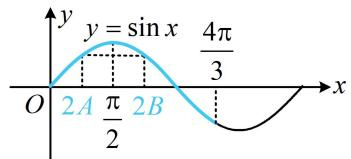

# 内容提要

本节归纳三角恒等式的常见变形.

##### 1. 恒等变换：除了三角恒等变换公式，还需注意三角形内角和为 $\pi$

##### 例如， $\sin (A + B) = \sin (\pi -C) = \sin C$ ， $\cos (A + B) = \cos (\pi -C) = -\cos C$

##### 2. 正弦定理边角互化及外接圆半径 $R$ :

①齐次的边与内角正弦值互化： $a = b\Leftrightarrow \sin A = \sin B$   
②分式转化： $\frac{a}{b} = \frac{\sin A}{\sin B}$   
③涉及外接圆半径： $2R=\frac{a}{\sin A}$ .

##### 3. 余弦定理及其推论:

① 涉及 $b^{2} + c^{2} - a^{2}$ ， $b^{2} + c^{2}$ 这类含边的平方的结构，考虑利用余弦定理及其推论；  
②等式中有 $\cos A$ ，且边化角不易，可考虑将 $\cos A$ 换成 $\frac{b^2 + c^2 - a^2}{2bc}$ ，角化边处理；  
③涉及 $a \pm b$ 和 $ab$ 的关系，考虑将余弦定理配方处理，即 $c^2 = (a \pm b)^2 - 2ab(\cos C \pm 1)$ .

# 类型 I：正弦定理边角互化

【例 1】(2021·北京卷（节选）) 在 $\triangle ABC$ 中， $c = 2b \cos B$ ， $C = \frac{2\pi}{3}$ ，求 B.

解：（等式 $c = 2b\cos B$ 左右两侧有齐次的边，结合要求的是角，所以考虑边化角）

因为 $c = 2b\cos B$ ，所以 $\sin C = 2\sin B\cos B$ ，故 $\sin C = \sin 2B$ ，又 $C = \frac{2\pi}{3}$ ，所以 $\sin 2B = \sin \frac{2\pi}{3} = \frac{\sqrt{3}}{2}$ ①，由 $C = \frac{2\pi}{3}$ 可得 $0 < B < \frac{\pi}{3}$ ，所以 $0 < 2B < \frac{2\pi}{3}$ ，结合①得 $2B = \frac{\pi}{3}$ ，故 $B = \frac{\pi}{6}$ .

【反思】当所给等式左右两侧有齐次的边或内角正弦值时，可考虑用正弦定理边角互化；类似的，像 $\frac{b}{a}$ 和 $\frac{\sin A}{\sin B}$ 这类齐次分式，也可用正弦定理来互化.

##### 【变式1】在 $\triangle ABC$ 中，内角 $A, B, C$ 的对边分别为 $a, b, c$ ，若 $\cos C = \frac{b}{a} - \frac{c}{2a}$ ，则 $A =$ \_\_\_\_. 解析：等式 $\cos C = \frac{b}{a} - \frac{c}{2a}$ 右侧为两个边的齐次分式，可以考虑将分式边化角，

因为 $\cos C = \frac{b}{a} -\frac{c}{2a}$ ，所以 $\cos C = \frac{\sin B}{\sin A} -\frac{\sin C}{2\sin A}$ ，两边同乘以 $2\sin A$ 得： $2\sin A\cos C = 2\sin B - \sin C$ ①，接下来可考虑拆右侧的 $\sin B$ 或 $\sin C$ ，左边是 $2\sin A\cos C$ ，所以拆 $\sin B$ 会出现与左边相同的项， $\sin B = \sin [\pi -(A + C)] = \sin (A + C) = \sin A\cos C + \cos A\sin C$

代入式①可得 $2\sin A\cos C = 2\sin A\cos C + 2\cos A\sin C - \sin C$ ，整理得： $2\cos A\sin C - \sin C = 0$ ②，

因为 $0 < C < \pi$ ，所以 $\sin C > 0$ ，对②约去 $\sin C$ 得： $2\cos A - 1 = 0$ ，故 $\cos A = \frac{1}{2}$ ，又 $0 < A < \pi$ ，所以 $A = \frac{\pi}{3}$ .

答案 $\frac{\pi}{3}$

【反思】变形时可以考虑利用三角形内角和为 $\pi$ ，拆掉像 $\sin B$ 这种单独的项，拆 $\sin B$ 的标志是等式的其余项中有或.

##### 【变式2】在中，角 $A, B, C$ 的对边分别为 $a, b, c$ ，若，，

，求的值.

解：（已知边 $a$ 和角 $A$ ，可利用正弦定理求出外接圆直径 $2R$ ，再用它进行边角转化）

因为，，所以的外接圆直径，

(要求的是, 已知的是, 故将已知向目标转化, 用正弦定理角化边)

由正弦定理，，所以，，

代入可得，所以，

两端同除以 bc 可得.

【反思】可以发现，即使是非齐次的边或内角正弦值，在已知了外接圆半径 R 的条件下，也可用来边化角，用来角化边，其它边角同理.

# 类型 II：余弦定理边角互化

【例 2】在中，角 A, B, C 的对边分别为 a, b, c，已知，，求的面积.

解：（涉及，考虑余弦定理推论）因为，所以，

由余弦定理推论，①，（要求面积，由于已知，所以只需求 $ac$ ，可由求出，代入式①来算）因为，结合式①可得，所以，

代入式①可得，故，所以.

【反思】出现像这种结构，是运用余弦定理及其推论的标志.

##### 【变式1】在中，角 $A, B, C$ 的对边分别为 $a, b, c$ ，已知，求 $A$ .

解法 1: (题干给了一个边角等式, 考虑的方向不外乎边化角, 或者角化边, 先试试边化角)

因为，所以 ①，

(注意到右边有和, 所以拆左边的, 能出现右边相同的结构)

又，

代入式①可得 $\sin A\cos B + \cos A\sin B - \sin B = \sin A\cos B - \sin B\cos A$ ，整理得： $2\cos A\sin B - \sin B = 0$ 因为 $0 < B < \pi$ ，所以 $\sin B > 0$ ，从而 $2\cos A - 1 = 0$ ，故 $\cos A = \frac{1}{2}$ ，结合 $0 < A < \pi$ 可得 $A = \frac{\pi}{3}$

【解法2】（也可以考虑用余弦定理推论，将 $\cos B$ 和 $\cos A$ 进行角化边，寻找边的关系）

因为 $c - b = a\cos B - b\cos A$ ，所以 $c - b = a\cdot \frac{a^2 + c^2 - b^2}{2ac} -b\cdot \frac{b^2 + c^2 - a^2}{2bc}$ ，整理得： $b^{2} + c^{2} - a^{2} = bc$ 所以 $\cos A = \frac{b^2 + c^2 - a^2}{2bc} = \frac{bc}{2bc} = \frac{1}{2}$ ，结合 $0 < A < \pi$ 可得 $A = \frac{\pi}{3}$

【反思】像 $c - b = a\cos B - b\cos A$ 这类边角等式，考虑的方向不外乎边化角，寻找角的关系；或者角化边，寻找边的关系。在选择方法时，应先预判计算量。

##### 【变式2】在 $\triangle ABC$ 中，角 $A, B, C$ 的对边分别为 $a, b, c$ ，已知 $a=\sqrt{5}$ ， $\cos A=\frac{5}{6}$ ， $\triangle ABC$ 的面积为 $\frac{\sqrt{11}}{4}$ ，则 $\triangle ABC$ 的周长为（）

$\quad$A. $4 + \sqrt{5}$

$\quad$B. $2 \sqrt{5} + \sqrt{2}$

$\quad$C. $5 + \sqrt{5}$

$\quad$D. $\sqrt{5} + 2\sqrt{2}$

解析已知 a，所以要求周长，只需求出 $b+c$ 。先翻译面积这个条件，由于 A 已知，为了不引入新的未知数，用 $S=\frac{1}{2}bc\sin A$ 算面积，因为 $0<A<\pi$ ，所以 $\sin A>0$ ，又 $\cos A=\frac{5}{6}$ ，所以 $\sin A=\sqrt{1-\cos^{2}A}=\frac{\sqrt{11}}{6}$ ，从而 $S_{\triangle ABC}=\frac{1}{2}bc\sin A=\frac{\sqrt{11}}{12}bc=\frac{\sqrt{11}}{4}$ ，故 bc=3 ①，

求出了 bc，结合已知边 a 和角 A，可用余弦定理沟通 $b + c$ 和 bc，

由余弦定理， $a^2 = b^2 +c^2 -2bc\cos A$ ，将 $a = \sqrt{5}$ ， $\cos A = \frac{5}{6}$ 代入整理得： $b^{2} + c^{2} - \frac{5}{3} bc = 5$ ②，

由②可得 $(b + c)^2 -\frac{11}{3} bc = 5$ ，将①代入可求得 $b + c = 4$ ，所以 $\triangle ABC$ 的周长为 $4 + \sqrt{5}$

答案: A

【反思】将余弦定理 $a^2 = b^2 + c^2 - 2bc\cos A$ 配方，可沟通 $b + c$ 和 $bc$ ，这是给出 $A$ 和 $a$ 时常用的处理方法.

# 类型III：综合应用

【例 3】在 $\triangle ABC$ 中，角 $A, B, C$ 的对边分别为 $a, b, c$ ，若 $a \cos A = b \cos B$ ， $a^{2} + b^{2} - ab = c^{2}$ ， $a = 2$ ，则 $\triangle ABC$ 的面积为（）

$\quad$A. $\frac{\sqrt{3}}{2}$

$\quad$B. 1

$\quad$C. $\sqrt{3}$

$\quad$D. 2

解析题干给出 $a^2 + b^2 - ab = c^2$ 这个式子，联想到余弦定理推论，

$a^2 + b^2 - ab = c^2 \Rightarrow a^2 + b^2 - c^2 = ab$ ，所以 $\cos C = \frac{a^2 + b^2 - c^2}{2ab} = \frac{ab}{2ab} = \frac{1}{2}$ ，结合 $0 < C < \pi$ 可得 $C = \frac{\pi}{3}$ ，

再看 $a \cos A = b \cos B$ ，用余弦定理推论化边的后续式子显然偏麻烦，而两边都有边，故考虑用正弦定理边化角， $a \cos A = b \cos B \Rightarrow \sin A \cos A = \sin B \cos B \Rightarrow \sin 2A = \sin 2B$ ，要分析 $A, B$ 的关系，需先研究角的范围，

因为 $C = \frac{\pi}{3}$ ，所以 $A + B = \pi - C = \frac{2\pi}{3}$ ，从而 $A$ ， $B$ 都在 $\left(0, \frac{2\pi}{3}\right)$ 上，故 $2A$ ， $2B$ 都在 $\left(0, \frac{4\pi}{3}\right)$ 上，

结合 $\sin 2A = \sin 2B$ 可得 $2A = 2B$ 或 $2A + 2B = \pi$ （如图），

若 $2A + 2B = \pi$ ，则 $A + B = \frac{\pi}{2}$ ，与 $A + B = \frac{2\pi}{3}$ 矛盾，舍去，

所以 $2A = 2B$ ，从而 $A = B = \frac{\pi}{3}$ ，故 $\triangle ABC$ 是边长为2的正三角形，

所以 $S_{\triangle ABC} = \frac{1}{2}\times 2\times 2\times \sin 60^{\circ} = \sqrt{3}$

答案: C

##### 【变式】(2022·全国乙卷) 记 $\triangle ABC$ 的内角 $A, B, C$ 的对边分别为 $a, b, c$ , 已知 $\sin C \sin (A - B) = \sin B \sin (C - A)$ .

（1）证明： $2a^{2}=b^{2}+c^{2}$ ；（2）若 a=5， $\cos A=\frac{25}{31}$ ，求 $\triangle ABC$ 的周长.

解：（1）（观察结构，可发现所给等式中 $\sin C$ ， $\sin B$ 不易操作，故尝试把 $\sin (A - B)$ 和 $\sin (C - A)$ 展开）

由 $\sin C\sin (A - B) = \sin B\sin (C - A)$ 可得 $\sin C(\sin A\cos B - \cos A\sin B) = \sin B(\sin C\cos A - \cos C\sin A)$

所以 $\sin C\sin A\cos B - \sin C\cos A\sin B = \sin B\sin C\cos A - \sin B\cos C\sin A$

(观察发现左侧和右侧有相同的项 $\sin C \cos A \sin B$ ，其余两项也可提公因式 $\sin A$ ，故移项调整)

从而 $\sin C\sin A\cos B+\sin B\cos C\sin A=\sin C\cos A\sin B+\sin B\sin C\cos A$

故 $\sin A(\sin C\cos B + \cos C\sin B) = 2\sin B\sin C\cos A$ ，所以 $\sin A\sin (B + C) = 2\sin B\sin C\cos A$ ①，

又 $\sin (B + C) = \sin (\pi - A) = \sin A$ ，代入①可得 $\sin^2 A = 2\sin B\sin C\cos A$ ，

(化到此处, 从角的层面来看已是最简了, 考虑到我们要证明的是关于边的等式, 所以将角全部化边)

所以 $a^2 = 2bc\cdot \frac{b^2 + c^2 - a^2}{2bc}$ ，整理得： $2a^{2} = b^{2} + c^{2}$

（2） (结合第 （1） 问结论可求得 $b^{2} + c^{2}$ , 于是用余弦定理再建立一个边的方程, 通过配方来计算 $b + c$ ) 将 $a = 5$ 代入 $2a^{2} = b^{2} + c^{2}$ 可得: $b^{2} + c^{2} = 50$ ②,

由余弦定理， $a^2 = b^2 +c^2 -2bc\cos A$ ，将式②和 $\cos A = \frac{25}{31}$ 代入可得 $25 = 50 - \frac{50}{31} bc$ ，所以 $bc = \frac{31}{2}$

由②可得 $50 = b^{2} + c^{2} = (b + c)^{2} - 2bc = (b + c)^{2} - 31$ ，从而 $b + c = 9$ ，故 $\triangle ABC$ 的周长为 $a + b + c = 14$

【总结】从本节的几道例题可以看出，三角恒等式变形的核心是边角转化，用正弦定理来边角转化的特征是“齐次”，用余弦定理来边角转化的特征是“形式”.

# 强化训练

##### 1.（2022·福建漳州期末（改）·★）

在 $\triangle ABC$ 中，内角 $A, B, C$ 的对边分别为 $a, b, c$ ，且 $\sqrt{3} a \cos B = b \sin A$ ，则 $B = (\quad)$

$\quad$A. $\frac{\pi}{6}$

$\quad$B. $\frac{\pi}{4}$

$\quad$C. $\frac{\pi}{3}$

$\quad$D. $\frac{2\pi}{3}$

##### 2. (2022·福建闽侯县期末·★★)

在 $\triangle ABC$ 中，内角 $A, B, C$ 的对边分别为 $a, b, c$ ，且 $b = a\cos C$ ，则 $\triangle ABC$ 是（）

$\quad$A. 等腰三角形

$\quad$B. 直角三角形

$\quad$C. 等腰直角三角形

$\quad$D. 等边三角形

##### 3. (2022·安徽宣城开学·★★☆)

在 $\triangle ABC$ 中，角 $A, B, C$ 的对边分别为 $a, b, c$ ，若 $A = \frac{\pi}{3}$ ， $b = 2$ ， $c = 3$ ，则 $\frac{a - 2b + 2c}{\sin A - 2\sin B + 2\sin C}$ 的值等于（）

$\quad$A. $\sqrt{21}$

$\quad$B. $\frac{2\sqrt{21}}{3}$

$\quad$C. $\frac{4\sqrt{7}}{3}$

$\quad$D. $\frac{4\sqrt{3}}{3}$

##### 4. (2024·湖北武汉二调·★★)

在 $\triangle ABC$ 中，角 $A, B, C$ 所对的边分别为 $a, b, c$ ，若 $B = \frac{3\pi}{4}$ ， $b = 6$ ， $a^2 + c^2 = 2\sqrt{2}ac$ ，则 $\triangle ABC$ 的面积为 \_\_\_\_.

##### 5. (2021·全国乙卷·★★☆)

记 $\triangle ABC$ 的内角 $A, B, C$ 的对边分别为 $a, b, c$ , 面积为 $\sqrt{3}$ , $B = 60^{\circ}$ , $a^{2} + c^{2} = 3ac$ , 则 $b =$ \_\_\_\_.

##### 6. (2025·江苏无锡模拟（节选）·★★)

在 $\triangle ABC$ 中，角 $A, B, C$ 的对边分别为 $a, b, c$ ，且 $\frac{\sqrt{2}b - c}{a} = \sqrt{2}\cos C$ ，求角 $A$ 的大小.

##### 7. (2024·新课标II卷·★★☆)

记 $\triangle ABC$ 的内角 $A, B, C$ 的对边分别为 $a, b, c$ , 已知 $\sin A + \sqrt{3} \cos A = 2$ .

（1） 求 A;

（2） 若 a=2， $\sqrt{2}b\sin C=c\sin 2B$ ，求 $\triangle ABC$ 的周长.

##### 8. (2023·湖北武汉四调（节选）·★★★)

设 $\triangle ABC$ 的内角 $A, B, C$ 所对的边分别为 $a, b, c$ ，且有 $2\sin \left(B + \frac{\pi}{6}\right) = \frac{b + c}{a}$ ，求角 $A$ .

##### 9. (2024·广东模拟·★★★)

在 $\triangle ABC$ 中， $a, b, c$ 分别是内角 $A, B, C$ 的对边，且 $b^{2} + c^{2} = 5$ .

（1）若 $\sqrt{2}\sin B = \sqrt{3}\sin C$ ，且 $\triangle ABC$ 的面积为 $\frac{\sqrt{6}}{4}$ ，求 $A$

（2）若 $b + c = 3$ ， $\cos A = \frac{1}{4}$ ， $\sin B > \sin C$ ，求

$\overrightarrow{AC}\cdot\overrightarrow{CB}$

##### 10.（2023·浙南名校联盟第一次联考·★★★☆）

记 $\triangle ABC$ 的内角 $A, B, C$ 所对的边分别为 $a, b, c$ , 已知 $c \sin (A - B) = b \sin (C - A)$ .

（1）若 $a^2 = bc$ ，求 $A$   
（2）若 $a = 2$ ， $\cos A = \frac{4}{5}$ ，求 $\triangle ABC$ 的周长.

一数·必刷100讲

