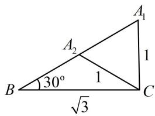

# 第3节 角的取舍（★★☆）

# 内容提要

解三角形问题中，计算角时，可能会出现增根，常通过以下方式舍增根：

##### 1. 大边对大角, 若 $a > b$ , 则 $A > B$ , 所以必有 $B$ 为锐角;  
##### 2. 三角形内角和为 $\pi$ ，所以任意两角的内角和小于 $\pi$ ;  
##### 3. 已知角 $A = \alpha$ ，则 $B + C = \pi - \alpha$ ，所以 $B, C \in (0, \pi - \alpha)$ .

# 类型Ⅰ：通过大边对大角舍增根

##### 【例1】在 $\triangle ABC$ 中， $B = 30^{\circ}$ ， $a = \sqrt{3}$ ， $b = 1$ ，则 $A = (\quad)$

$\quad$A. $60^{\circ}$

$\quad$B. ${120}^{ \circ  }$

$\quad$C. $60^{\circ}$ 或 $120^{\circ}$

$\quad$D. $30^{\circ}$

解析已知的和要求的合在一起，是两边两对角，可用正弦定理建立方程求 $A$

由正弦定理， $\frac{a}{\sin A} = \frac{b}{\sin B}$ ，所以 $\sin A = \frac{a\sin B}{b} = \frac{\sqrt{3}\sin 30^{\circ}}{1} = \frac{\sqrt{3}}{2},$

又 $0^{\circ} < A < 180^{\circ}$ ，所以 $A = 60^{\circ}$ 或 $120^{\circ}$ .

答案: C

【反思】本题由于 $a > b$ ，所以 $A > B$ ，故 $A$ 可取锐角或钝角，两个都不能舍，两种情况的图形如图所示，其中顶点 $A$ 可以在 $A_{1}$ 或 $A_{2}$ 处.

##### 【变式1】在 $\triangle ABC$ 中， $a = 6$ ， $b = 4$ ， $\sin A = \frac{3}{4}$ ，则 $B = (\quad)$

$\quad$A. $30^{\circ}$

$\quad$B. $30^{\circ}$ 或 $150^{\circ}$

$\quad$C. ${120}^{ \circ  }$

$\quad$D. ${150}^{ \circ  }$

解析已知的和要求的合在一起，是两边两对角，可用正弦定理建立方程求 $B$

由正弦定理， $\frac{a}{\sin A} = \frac{b}{\sin B}$ ，所以 $\sin B = \frac{b\sin A}{a} = \frac{4\times\frac{3}{4}}{6} = \frac{1}{2}$ ，因为 $0^{\circ} <   B <   180^{\circ}$ ，所以 $B = 30^{\circ}$ 或 $150^{\circ}$

两个解都能取吗？可通过分析 $A$ ， $B$ 的大小来判断，因为 $b < a$ ，所以 $B < A$ ，故 $B$ 为锐角，故 $B = 30^{\circ}$

答案: A

【反思】在知道边长的条件下，可根据大边对大角来决定是否舍根，在例1中 $a > b$ ，所以 $A > B$ ，则 $A$ 可取钝角或锐角，有两解；而在变式1中，由于 $b < a$ ，所以 $B < A$ ，故 $B$ 只能取锐角.

##### 【变式2】在 $\triangle ABC$ 中， $C=\frac{\pi}{3}$ ， $c=\sqrt{3}$ ， $a=x(x>0)$ ，若 $\triangle ABC$ 有两解，则 $x$ 的取值范围是\_\_\_\_.

【解法1】把 $x$ 看成已知量，这是已知两边一对角的情形，可用正弦定理先求另一边对角的正弦值，

$\frac{a}{\sin A} = \frac{c}{\sin C} \Rightarrow \sin A = \frac{a \sin C}{c} = \frac{x}{2}$ ，若 $\triangle ABC$ 有两解，则由 $\sin A$ 求角 $A$ 时，应可取锐角或钝角，所以需满足两点：(i) $\sin A$ 的值应在 (0,1) 上；(ii) $a > c$ ，也即 $A > C$ ，否则 $A$ 只能取锐角，

所以 $\left\{ \begin{array}{l} 0 < \frac{x}{2} < 1 \\ x > \sqrt{3} \end{array} \right.$ ，解得： $\sqrt{3} < x < 2$ 。

【解法2】已知两边一对角，也可对已知的角用余弦定理，建立关于第三边的方程并求解，

由余弦定理， $c^2 = a^2 +b^2 -2ab\cos C$ ，将所给数据代入整理得： $b^{2} - xb + x^{2} - 3 = 0$ ①，

把式①看成关于 $b$ 的一元二次方程, $\triangle ABC$ 有两解等价于方程①有两个不相等的正根 $b_{1}, b_{2}$ ,

所以 $\left\{ \begin{array}{l} \Delta = (-x)^2 - 4(x^2 - 3) > 0 \\ b_1 + b_2 = x > 0 \\ b_1b_2 = x^2 - 3 > 0 \end{array} \right.$ ，解得： $\sqrt{3} < x < 2$ 。

答案: $(\sqrt{3}, 2)$

【总结】大边对大角，记住只有大边所对的角，才可能有多解.

# 类型 II：通过分析角的范围取解

##### 【例2】在 $\triangle ABC$ 中， $c = 2b\cos B$ ， $C = \frac{\pi}{3}$ ，求 $B$

解：（题干给出 $c = 2b\cos B$ 这个式子，结合要求的是角，故可考虑边化角分析）

因为 $c = 2b\cos B$ ，所以 $\sin C = 2\sin B\cos B$ ，故 $\sin C = \sin 2B$ ，又 $C = \frac{\pi}{3}$ ，所以 $\sin 2B = \frac{\sqrt{3}}{2}$

（要由此求 $B$ ，应先分析 $B$ 的范围）因为 $C = \frac{\pi}{3}$ ，所以 $A + B = \pi - C = \frac{2\pi}{3}$ ，故 $B \in \left(0, \frac{2\pi}{3}\right)$ ①，

又 $c = 2b\cos B$ ，所以 $\cos B = \frac{c}{2b} >0$ ，从而 $B\in \left(0,\frac{\pi}{2}\right)$ ，与①取交集可得 $B\in \left(0,\frac{\pi}{2}\right)$ ，故 $2B\in (0,\pi)$

结合 $\sin 2B = \frac{\sqrt{3}}{2}$ 可得 $2B = \frac{\pi}{3}$ 或 $\frac{2\pi}{3}$ ，所以 $B = \frac{\pi}{6}$ 或 $\frac{\pi}{3}$ .

【反思】在解三角形问题中，已知三角函数值求角时，常通过内容提要第3点和其它条件来分析角的范围.

##### 【变式】(2023·全国乙卷) 在 $\triangle ABC$ 中, 内角 $A, B, C$ 的对边分别为 $a, b, c$ , 若 $a \cos B - b \cos A = c$ , 且 $C = \frac{\pi}{5}$ , 则 $B = (\quad)$

$\quad$A. $\frac{\pi}{10}$

$\quad$B. $\frac{\pi}{5}$

$\quad$C. $\frac{3\pi}{10}$

$\quad$D. $\frac{2\pi}{5}$

解析所给边角等式每一项都有齐次的边，要求的是角，故用正弦定理边化角分析，

因为 $a\cos B - b\cos A = c$ ，所以 $\sin A\cos B - \sin B\cos A = \sin C$ ，故 $\sin (A - B) = \sin C$ ①，

已知 $C$ , 先将 $C$ 代入, 再结合要求的是 $B$ , 可利用 $A + B + C = \pi$ 将①中的 $A$ 换成 $B$ 消元,

因为 $C = \frac{\pi}{5}$ ，所以 $A + B = \pi - C = \frac{4\pi}{5}$ ，故 $A = \frac{4\pi}{5} - B$ ，代入①得 $\sin \left(\frac{4\pi}{5} - 2B\right) = \sin \frac{\pi}{5}$ ②，

因为 $A + B = \frac{4\pi}{5}$ ，所以 $0 < B < \frac{4\pi}{5}$ ，故 $-\frac{4\pi}{5} < \frac{4\pi}{5} - 2B < \frac{4\pi}{5}$ ，结合②可得 $\frac{4\pi}{5} - 2B = \frac{\pi}{5}$ ，所以 $B = \frac{3\pi}{10}$ .

答案: C

# 强化训练

##### 1. (2022·四川雅安期末·★★)

记 $\triangle ABC$ 的内角 $A, B, C$ 的对边分别为 $a, b, c, (a^2 - b^2 + c^2) \tan B = \sqrt{3} ac$ ，则 $B = \_$ .

##### 2. (2022·浙江台州期末·★★)

在 $\triangle ABC$ 中， $a = 3\sqrt{2}$ ， $c = 3$ ， $A = 45^{\circ}$ ，则 $\triangle ABC$ 的最大内角为（）

$\quad$A. ${105}^{ \circ  }$

$\quad$B. ${120}^{ \circ  }$

$\quad$C. ${135}^{ \circ  }$

$\quad$D. $150^{\circ}$

##### 3. (★★★☆)

已知 $\triangle ABC$ 的内角 $A, B, C$ 所对的边分别为 $a$ ,

b, c, 若 a=1, $a+b+c=3$ , 且 $c\sin A\cos B+$

$a\sin B\cos C = \frac{\sqrt{3}}{2} a$ ，则 $\triangle ABC$ 的面积为（）

$\quad$A. $\frac{\sqrt{3}}{4}$ 或 $\frac{3\sqrt{3}}{4}$

$\quad$B. $\frac{3\sqrt{3}}{4}$

$\quad$C. $\frac{2\sqrt{3}}{3}$

$\quad$D. $\frac{\sqrt{3}}{4}$

##### 4. (2022·全国乙卷（节选）·★★★)

记 $\triangle ABC$ 的内角 $A, B, C$ 的对边分别为 $a, b, c$ , 已知 $\sin C \sin (A - B) = \sin B \sin (C - A)$ , 若 $A = 2B$ , 求 $C$ .

##### 5. (★★★)

已知锐角 $\triangle ABC$ 的三个内角 $A, B, C$ 的对边分别是 $a, b, c$ , 且 $\frac{a + b}{\cos A + \cos B} = \frac{c}{\cos C}$ , 求角 $C$ .

