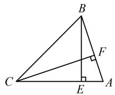

# 强化训练

##### 1. (★★)

$\triangle ABC$ 的角 $A, B, C$ 的对边分别为 $a, b, c$ , 已知 $B = 150^{\circ}$ , $\sin A + \sqrt{3} \sin C = \frac{\sqrt{2}}{2}$ , 则 $C =$ \_\_\_\_.

##### 1. ${15}^{ \circ  }$

解析已知 $B$ ，可求出 $A$ 和 $C$ 的关系，用来将所给的关于 $A$ 和 $C$ 的方程消元， $B = 150^{\circ} \Rightarrow A + C = 180^{\circ} - B = 30^{\circ}$

所以 $0^{\circ} < C < 30^{\circ}$ ，且 $A = 30^{\circ} - C$ ，故 $\sin A + \sqrt{3}\sin C =$

$\begin{array}{l} \sin (3 0 ^ {\circ} - C) + \sqrt {3} \sin C = \frac {1}{2} \cos C - \frac {\sqrt {3}}{2} \sin C + \sqrt {3} \sin C \\ = \frac {1}{2} \cos C + \frac {\sqrt {3}}{2} \sin C = \sin (C + 3 0 ^ {\circ}) = \frac {\sqrt {2}}{2}, \\ \end{array}$

因为 $0^{\circ} < C < 30^{\circ}$ ，所以 $30^{\circ} < C + 30^{\circ} < 60^{\circ}$

结合 $\sin (C + 30^{\circ}) = \frac{\sqrt{2}}{2}$ 可得 $C + 30^{\circ} = 45^{\circ}$ ，故 $C = 15^{\circ}$ .

##### 2. (2022·黑龙江期中·★★☆)

已知 $\triangle ABC$ 的内角 $A, B, C$ 的对边分别为 $a, b, c$ , 且 $C = \frac{\pi}{3}$ , 则 $\frac{\cos B}{\cos A}$ 的取值范围是 \_\_\_\_.

##### 2. $(- \infty, -2) \cup \left(-\frac{1}{2}, +\infty\right)$

解析已知 $C$ ，可找到 $A$ 和 $B$ 的关系，将目标消元，

$\begin{array}{l} C = \frac {\pi}{3} \Rightarrow B = \pi - A - C = \frac {2 \pi}{3} - A, \text {故} \frac {\cos B}{\cos A} = \frac {\cos \left(\frac {2 \pi}{3} - A\right)}{\cos A} \\ = \frac {- \frac {1}{2} \cos A + \frac {\sqrt {3}}{2} \sin A}{\cos A} = - \frac {1}{2} + \frac {\sqrt {3}}{2} \tan A, \\ \end{array}$

下面分析 $A$ 的范围，由 $A + B = \frac{2\pi}{3}$ 可得 $A \in \left(0, \frac{2\pi}{3}\right)$ ，

又 $\cos A \neq 0$ ，所以 $A \neq \frac{\pi}{2}$ ，故 $A \in \left(0, \frac{\pi}{2}\right) \cup \left(\frac{\pi}{2}, \frac{2\pi}{3}\right)$ ，

所以 $\tan A > 0$ 或 $\tan A < -\sqrt{3}$

故 $\frac{\cos B}{\cos A} = -\frac{1}{2} +\frac{\sqrt{3}}{2}\tan A\in (-\infty , - 2)\cup \left(-\frac{1}{2}, + \infty\right).$

##### 3. (2022·浙江模拟·★★★)

在 $\triangle ABC$ 中，内角 $A, B, C$ 的对边分别为 $a, b, c$ ，已知 $a \tan B = b \tan A$ ，则 $\sin^2 \frac{A}{2} + \sin^2 \frac{B}{2} + \sin^2 \frac{C}{2}$ 的取值范围是 \_\_\_\_.

##### 3. $\left[\frac{3}{4}, 1\right)$

解析考虑到所求目标为弦，先将所给等式切化弦，

因为 $a\tan B = b\tan A$ ，所以 $a\cdot \frac{\sin B}{\cos B} = b\cdot \frac{\sin A}{\cos A}$

从而 $a \cdot \frac{b}{\cos B} = b \cdot \frac{a}{\cos A}$ ，故 $\cos B = \cos A$

又 $A, B \in (0, \pi)$ ，所以 $B = A$ 求最值的式子中有 A, B, C 三个变量，得消元，不妨由 B = A 和 $A + B + C = \pi$ 将变量统一为 A，

因为 $C = \pi - A - B = \pi - 2A$ ，所以 $\sin^2\frac{A}{2} + \sin^2\frac{B}{2} + \sin^2\frac{C}{2}$

$\begin{array}{l} = \frac {1 - \cos A}{2} + \frac {1 - \cos B}{2} + \frac {1 - \cos C}{2} \\ = \frac {3}{2} - \frac {1}{2} (\cos A + \cos B + \cos C) \\ = \frac {3}{2} - \frac {1}{2} [ \cos A + \cos A + \cos (\pi - 2 A) ] \\ = \frac {3}{2} - \frac {1}{2} (2 \cos A - \cos 2 A) \\ = \frac {3}{2} - \frac {1}{2} [ 2 \cos A - (2 \cos^ {2} A - 1) ] = \cos^ {2} A - \cos A + 1, \\ \end{array}$

将 $\cos A$ 换元成 $t$ , 可转化为二次函数求区间值域,

令 $t = \cos A$ ，由 $B = A$ 知 $A$ 为锐角，所以 $t\in (0,1)$

故 $\sin^2\frac{A}{2} +\sin^2\frac{B}{2} +\sin^2\frac{C}{2} = t^2 -t + 1 = \left(t - \frac{1}{2}\right)^2 +\frac{3}{4}\in \left[\frac{3}{4},1\right).$

##### 4. (2022·黑龙江模拟（改）·★★★)

在锐角 $\triangle ABC$ 中，已知 $A = \frac{\pi}{3}$ ，则 $\frac{c}{b}$ 的取值范围为 \_\_\_\_.

##### 4. $\left(\frac{1}{2}, 2\right)$

解析由正弦定理， $\frac{c}{b} = \frac{\sin C}{\sin B}$ ①，

已知 $A$ ，可找到 $B, C$ 的关系，将上式消元，

$A = \frac{\pi}{3} \Rightarrow C = \pi - A - B = \frac{2\pi}{3} - B$ ，代入①得 $\frac{c}{b} =$

$\frac {\sin \left(\frac {2 \pi}{3} - B\right)}{\sin B} = \frac {\frac {\sqrt {3}}{2} \cos B - \left(- \frac {1}{2}\right) \sin B}{\sin B} = \frac {\sqrt {3}}{2 \tan B} + \frac {1}{2} \quad ②,$

因为 $\triangle ABC$ 是锐角三角形，所以 $\left\{ \begin{array}{l} 0 < B < \frac{\pi}{2} \\ 0 < C = \frac{2\pi}{3} - B < \frac{\pi}{2} \end{array} \right.$

从而 $\frac{\pi}{6} < B < \frac{\pi}{2}$ ，故 $\tan B > \frac{\sqrt{3}}{3}$ ，代入②得 $\frac{1}{2} < \frac{c}{b} < 2$ 。

##### 5.（2022·山东济南期末（改）·★★★☆）

在锐角 $\triangle ABC$ 中，内角 $A, B, C$ 的对边分别为 $a, b, c$ ，向量 $\boldsymbol{m} = (b + a + c, \sqrt{3}b)$ ， $\boldsymbol{n} = (\sqrt{3}c, b - a + c)$ ，且 $\boldsymbol{m} // \boldsymbol{n}$ ， $a = 3$ ，则 $\triangle ABC$ 的周长的取值范围是 \_\_\_\_.

##### 5. $(3 + 3\sqrt{3},9]$

解析因为 $m \parallel n$ ，所以 $(b + a + c)(b - a + c) = \sqrt{3}c \cdot \sqrt{3}b$ ，

整理得： $b^{2}+c^{2}-a^{2}=bc$ ，（设 $\boldsymbol{m}=(x_{1},y_{1})$ ， $\boldsymbol{n}=(x_{2},y_{2})$ ，

则 $m / / n \Leftrightarrow x_1y_2 = x_2y_1$

所以 $\cos A = \frac{b^2 + c^2 - a^2}{2bc} = \frac{bc}{2bc} = \frac{1}{2}$

又 $0 < A < \pi$ ，所以 $A = \frac{\pi}{3}$ ，有了 $A$ 和 $a$ ，可求出外接圆直径，并用它来将周长边化角，再求范围，

又 $a = 3$ ，所以 $\frac{b}{\sin B} = \frac{c}{\sin C} = \frac{a}{\sin A} = 2\sqrt{3}$

从而 $b = 2\sqrt{3}\sin B$ ， $c = 2\sqrt{3}\sin C$

故 $\triangle ABC$ 的周长 $L = a + b + c = 3 + 2\sqrt{3}\sin B + 2\sqrt{3}\sin C$

要求上式范围，先用 B 和 C 的关系消元，

因为 $A = \frac{\pi}{3}$ ，所以 $C = \pi - A - B = \frac{2\pi}{3} - B$

故 $L = 3 + 2\sqrt{3}\sin B + 2\sqrt{3}\sin \left(\frac{2\pi}{3} -B\right)$

$= 3 + 2 \sqrt {3} \sin B + 2 \sqrt {3} \left[ \frac {\sqrt {3}}{2} \cos B - \left(- \frac {1}{2}\right) \sin B \right]$

$= 3 + 3 \sqrt {3} \sin B + 3 \cos B = 3 + 6 \sin \left(B + \frac {\pi}{6}\right),$

因为 $\triangle ABC$ 是锐角三角形，所以 $\left\{ \begin{array}{l}0 < B < \frac{\pi}{2}\\ 0 < C = \frac{2\pi}{3} -B <   \frac{\pi}{2} \end{array} \right.$

解得： $\frac{\pi}{6} < B < \frac{\pi}{2}$ ，故 $\frac{\pi}{3} < B + \frac{\pi}{6} < \frac{2\pi}{3}$

所以 $\frac{\sqrt{3}}{2} < \sin \left(B + \frac{\pi}{6}\right) \leq 1$ ，故 $3 + 3\sqrt{3} < 3 + 6\sin \left(B + \frac{\pi}{6}\right) \leq 9$ ，

所以 $\triangle ABC$ 的周长的取值范围是 $(3 + 3\sqrt{3}, 9]$ .

# 6. (2022·福建厦门期末·★★★★)

在锐角 $\triangle ABC$ 中， $\sin B \sin C + \cos^2 B = \sin^2 C + \cos^2 A$ ，若 $BE, CF$ 是 $\triangle ABC$ 的两条高，则 $\frac{BE}{CF}$ 的取值范围是 \_\_\_\_.

##### 6. $\left(\frac{1}{2}, 2\right)$

解析已知的等式中有 $\cos^2 B$ 和 $\cos^2 A$ ，可先将其化为正弦，以便于角化边，

因为 $\sin B\sin C + \cos^{2}B = \sin^{2}C + \cos^{2}A$ ,

所以 $\sin B\sin C + 1 - \sin^2 B = \sin^2 C + 1 - \sin^2 A$

整理得： $\sin^2 B + \sin^2 C - \sin^2 A = \sin B\sin C$

所以 $b^{2} + c^{2} - a^{2} = bc$ ，故 $\cos A = \frac{b^2 + c^2 - a^2}{2bc} = \frac{bc}{2bc} = \frac{1}{2}$

又 $0 < A < \pi$ ，所以 $A = \frac{\pi}{3}$ ，有了 $A$ ，则 $\triangle ABC$ 的内角可统一，故考虑把 $\frac{BE}{CF}$ 用 $\triangle ABC$ 的内角表示出来，

如图，在 $\triangle ABE$ 中， $BE = AB\cdot \sin A = c\sin A$

在 $\triangle ACF$ 中， $CF = AC\cdot \sin A = b\sin A$

所以 $\frac{BE}{CF} = \frac{c\sin A}{b\sin A} = \frac{c}{b} = \frac{\sin C}{\sin B} = \frac{\sin(\pi - A - B)}{\sin B}$

$= \frac {\sin \left(\frac {2 \pi}{3} - B\right)}{\sin B} = \frac {\frac {\sqrt {3}}{2} \cos B + \frac {1}{2} \sin B}{\sin B} = \frac {\sqrt {3}}{2 \tan B} + \frac {1}{2},$

因为 $\triangle ABC$ 是锐角三角形，所以 $\left\{ \begin{array}{l} 0 < B < \frac{\pi}{2} \\ 0 < C = \frac{2\pi}{3} - B < \frac{\pi}{2} \end{array} \right.$

解得： $\frac{\pi}{6} < B < \frac{\pi}{2}$ ，故 $\tan B > \frac{\sqrt{3}}{3}$

所以 $0 < \frac{1}{\tan B} < \sqrt{3}$ ，故 $\frac{1}{2} < \frac{\sqrt{3}}{2\tan B} + \frac{1}{2} < 2$ ，即 $\frac{1}{2} < \frac{BE}{CF} < 2$ 。

【反思】本题将 $\frac{BE}{CF}$ 化为 $\frac{c}{b}$ 是核心，当我们要求范围的目标不是直接的边角代数式时，也可以考虑先用边角来表示它，再求范围.

##### 7.（2023·河北石家庄一模·★★★）

$\triangle ABC$ 的内角 $A, B, C$ 的对边分别为 $a, b, c,$ 设 $\frac{a + b}{c - b} = \frac{\sin C + \sin B}{\sin A}$ .

（1） 求 C;   
（2） 若 $(\sqrt{3}+1)a+2b=\sqrt{6}c$ ，求 $\sin A$ .

##### 7. 解：（1）（所给等式边化角、角化边都可以，但经尝试，若

边化角，则下一步继续按角化简较难，故考虑角化边分析）

因为 $\frac{a + b}{c - b} = \frac{\sin C + \sin B}{\sin A}$ ，所以 $\frac{a + b}{c - b} = \frac{c + b}{a}$

化简得： $a^2 + b^2 - c^2 = -ab$ ①，（看到 $a^2 + b^2 - c^2$ ，想到余弦定理推论）由余弦定理推论， $\cos C = \frac{a^2 + b^2 - c^2}{2ab}$ ，

将式①代入上式得 $\cos C = \frac{-ab}{2ab} = -\frac{1}{2}$

结合 $0 < C < \pi$ 可得 $C = \frac{2\pi}{3}$ .

（2） (所给等式每项都有齐次的边, 而要求的是与角有关的量, 故可考虑用正弦定理边化角分析)

因为 $(\sqrt{3} + 1)a + 2b = \sqrt{6} c$

所以 $(\sqrt{3} + 1)\sin A + 2\sin B = \sqrt{6}\sin C$ ②,

(已有 C，可借助内角和为 $\pi$ 将 A 和 B 统一成要求的角 A)

因为 $C = \frac{2\pi}{3}$ ，所以 $A + B = \pi - C = \frac{\pi}{3}$ ，故 $B = \frac{\pi}{3} - A$

代入②得 $(\sqrt{3} + 1)\sin A + 2\sin \left(\frac{\pi}{3} - A\right) = \sqrt{6}\sin \frac{2\pi}{3}$

所以 $(\sqrt{3} + 1)\sin A + 2\left(\frac{\sqrt{3}}{2}\cos A - \frac{1}{2}\sin A\right) = \frac{3\sqrt{2}}{2}$

化简得： $\sin A + \cos A = \frac{\sqrt{6}}{2}$ ，所以 $\sqrt{2}\sin \left(A + \frac{\pi}{4}\right) = \frac{\sqrt{6}}{2}$

故 $\sin\left(A+\frac{\pi}{4}\right)=\frac{\sqrt{3}}{2}$ ③,

因为 $A + B = \frac{\pi}{3}$ ，所以 $0 < A < \frac{\pi}{3}$ ，故 $\frac{\pi}{4} < A + \frac{\pi}{4} < \frac{7\pi}{12}$

结合③可得 $A + \frac{\pi}{4} = \frac{\pi}{3}$ ，所以 $A = \frac{\pi}{3} -\frac{\pi}{4}$

故 $\sin A = \sin \left(\frac{\pi}{3} -\frac{\pi}{4}\right) = \sin \frac{\pi}{3}\cos \frac{\pi}{4} -\cos \frac{\pi}{3}\sin \frac{\pi}{4} = \frac{\sqrt{6} - \sqrt{2}}{4}.$

##### 8. (2023·安徽合肥模拟·★★★)

$\triangle ABC$ 的内角 $A, B, C$ 的对边分别为 $a, b, c$ , 已知 $c + a = 2b \cos A$ .

（1） 证明: $B = 2A$ ;   
（2）若 $\triangle ABC$ 是锐角三角形， $a = 1$ ，求 $b$ 的取值范围.

##### 8. 解: （1） (所给等式有齐次的边, 且要证的是角的关系, 故

用正弦定理边化角分析）

因为 $c + a = 2b\cos A$ ，所以 $\sin C + \sin A = 2\sin B\cos A$ ①，

(右侧有 $\sin B \cos A$ , 故拆左边的 $\sin C$ 可进一步化简)

$\sin C = \sin [ \pi - (A + B) ] = \sin (A + B) = \sin A \cos B + \cos A \sin B,$

代入①可得 $\sin A\cos B + \cos A\sin B + \sin A = 2\sin B\cos A$

整理得： $\sin A = \sin B\cos A - \sin A\cos B$

所以 $\sin A = \sin(B - A)$ ，因为 $A, B \in (0, \pi)$ ，

所以 $B - A\in (-\pi ,\pi)$ ，故 $A = B - A$ 或 $A + (B - A) = \pi$

若 $A + (B - A) = \pi$ ，则 $B = \pi$ ，舍去，

所以 A = B - A ，故 B = 2A .

（2） (有 $B = 2A$ 和锐角三角形条件, 容易分析角的范围, 故用正弦定理边化角来分析 $b$ 的范围)

由正弦定理， $\frac{a}{\sin A}=\frac{b}{\sin B}$ ，所以 $b=\frac{a\sin B}{\sin A}$ ，

结合 $\left\{\begin{aligned}a=1\\ B=2A\end{aligned}\right.$ 可得 $b=\frac{\sin2A}{\sin A}=\frac{2\sin A\cos A}{\sin A}=2\cos A$ ②,

因为 $B = 2A$ ，所以 $C = \pi - A - B = \pi - A - 2A = \pi - 3A$

又 $\Delta ABC$ 是锐角三角形，所以 $\left\{ \begin{array}{l}0 < A < \frac{\pi}{2}\\ 0 < B = 2A < \frac{\pi}{2}\\ 0 < C = \pi -3A < \frac{\pi}{2} \end{array} \right.$

从而 $\frac{\pi}{6} < A < \frac{\pi}{4}$ ，故 $\frac{\sqrt{2}}{2} < \cos A < \frac{\sqrt{3}}{2}$ ，

代入②得 $\sqrt{2} < b < \sqrt{3}$ .

##### 9. (2023·全国模拟·★★★☆)

记 $\triangle ABC$ 的内角 $A, B, C$ 的对边分别为 $a, b, c$ , 已知 $\tan A = \frac{\sin C + \sin B}{\cos C + \cos B}$ .

（1） 求 A 的值;  
（2）若 $\triangle ABC$ 是锐角三角形，求 $\frac{b^2 - bc}{a^2}$ 的取值范围.

##### 9. 解: （1） (所给等式既有弦, 又有切, 考虑互化, 但观察发

现弦化切不易，故考虑切化弦，再进一步变形）

由题意， $\tan A = \frac{\sin A}{\cos A} = \frac{\sin C + \sin B}{\cos C + \cos B}$

所以 $\sin A\cos C + \sin A\cos B = \sin C\cos A + \sin B\cos A$

从而 $\sin A\cos C - \sin C\cos A = \sin B\cos A - \sin A\cos B$

故 $\sin (A - C) = \sin (B - A)$

(要由此找 A-C 和 B-A 的关系，应先研究它们的范围)

因为 $A, B, C \in (0, \pi)$ ，所以 $A - C \in (-\pi, \pi)$ ， $B - A \in (-\pi, \pi)$ ，

故 $A - C = B - A$ 或 $(A - C) + (B - A) = -\pi$ 或

$(A - C) + (B - A) = \pi ,$

所以 $B + C = 2A$ 或 $C - B = \pi$ （舍去）或 $B - C = \pi$ （舍去），

又 $B + C = \pi - A$ ，所以 $\pi - A = 2A$ ，故 $A = \frac{\pi}{3}$

（2） (目标式为边的齐次分式, 可边化角分析)

$\frac {b ^ {2} - b c}{a ^ {2}} = \frac {\sin^ {2} B - \sin B \sin C}{\sin^ {2} A} = \frac {4}{3} (\sin^ {2} B - \sin B \sin C) \quad ①,$

(有 B, C 两个变量，已知 A，可用 $B + C = \pi - A$ 来消元)

因为 $A = \frac{\pi}{3}$ ，所以 $B + C = \pi - A = \frac{2\pi}{3}$ ，故 $C = \frac{2\pi}{3} - B$

代入①得： $\frac{b^2 - bc}{a^2} = \frac{4}{3}\left[\sin^2 B - \sin B\sin \left(\frac{2\pi}{3} -B\right)\right]$

$= \frac {4}{3} \left[ \frac {1 - \cos 2 B}{2} - \sin B \left(\frac {\sqrt {3}}{2} \cos B + \frac {1}{2} \sin B\right) \right]$

$= \frac {4}{3} \left(\frac {1}{2} - \frac {1}{2} \cos 2 B - \frac {\sqrt {3}}{2} \sin B \cos B - \frac {1}{2} \sin^ {2} B\right)$

$= \frac {4}{3} \left(\frac {1}{2} - \frac {1}{2} \cos 2 B - \frac {\sqrt {3}}{4} \sin 2 B - \frac {1}{2} \times \frac {1 - \cos 2 B}{2}\right)$

$= \frac {4}{3} \left(\frac {1}{4} - \frac {\sqrt {3}}{4} \sin 2 B - \frac {1}{4} \cos 2 B\right) = \frac {1}{3} - \frac {2}{3} \sin \left(2 B + \frac {\pi}{6}\right) \tag {②},$

因为 $\triangle ABC$ 是锐角三角形，所以 $\left\{ \begin{array}{l} 0 < B < \frac{\pi}{2} \\ 0 < C = \frac{2\pi}{3} - B < \frac{\pi}{2} \end{array} \right.$

从而 $\frac{\pi}{6} < B < \frac{\pi}{2}$ ，故 $\frac{\pi}{2} < 2B + \frac{\pi}{6} < \frac{7\pi}{6}$ ，

所以 $-\frac{1}{2} < \sin \left(2B + \frac{\pi}{6}\right) < 1$ ，结合②得 $-\frac{1}{3} < \frac{b^2 - bc}{a^2} < \frac{2}{3}$

故 $\frac{b^{2}-bc}{a^{2}}$ 的取值范围是 $\left(-\frac{1}{3},\frac{2}{3}\right)$ .

