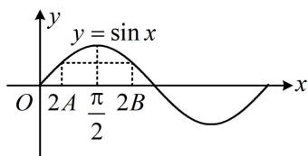
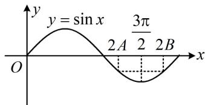

# 第 3 节 代数式的恒等变形（★★★☆）

# 内容提要

本节是对解三角形中稍微复杂一点的代数式的恒等化简，通过各种形式的变化，加深对正余弦定理以及三角公式的理解。虽然本节有一定难度，但仍建议大家掌握好。

# 类型 I：判定三角形的形状

【例 1】在 $\triangle ABC$ 中，角 $A, B, C$ 的对边分别为 $a, b, c$ ，若 $c - a \cos B = (2a - b) \cos A$ ，则 $\triangle ABC$ 为（）

$\quad$A. 等腰三角形

$\quad$B. 直角三角形

$\quad$C. 等腰直角三角形

$\quad$D. 等腰或直角三角形

解法 1: 题干所给的边角等式每一项都有齐次的边, 可用正弦定理边化角,

因为 $c - a\cos B = (2a - b)\cos A$ ，所以 $\sin C - \sin A\cos B = (2\sin A - \sin B)\cos A$ ①，

为了减少变量个数，且注意到左侧有 $-\sin A \cos B$ 这一项，可将 $\sin C$ 拆掉，再化简，

因为 $\sin C = \sin [\pi -(A + B)] = \sin (A + B) = \sin A\cos B + \cos A\sin B$

代入式①可得： $\sin A\cos B + \cos A\sin B - \sin A\cos B = (2\sin A - \sin B)\cos A$ ，整理得： $\cos A(\sin B - \sin A) = 0$

所以 $\cos A = 0$ 或 $\sin B - \sin A = 0$ ，若 $\cos A = 0$ ，则 $A = \frac{\pi}{2}$ ，故 $\triangle ABC$ 为直角三角形；

若 $\sin B - \sin A = 0$ ，则 $\sin A = \sin B$ ，所以 $a = b$ ，故 $\triangle ABC$ 为等腰三角形；

综上所述， $\triangle ABC$ 为等腰或直角三角形.

解法 2: 也可将题干所给等式角化边, 从边的层面来分析三角形形状,

因为 $c - a\cos B = (2a - b)\cos A$ ，所以 $c - a\cdot \frac{a^2 + c^2 - b^2}{2ac} = (2a - b)\cdot \frac{b^2 + c^2 - a^2}{2bc}$

两端乘以 $2c$ 整理得： $b^{2} + c^{2} - a^{2} = (2a - b) \cdot \frac{b^{2} + c^{2} - a^{2}}{b}$ ，所以 $(b^{2} + c^{2} - a^{2})\left(1 - \frac{2a - b}{b}\right) = 0$ ，

故 $b^{2}+c^{2}-a^{2}=0$ 或 $1-\frac{2a-b}{b}=0$ ，若 $b^{2}+c^{2}-a^{2}=0$ ，则 $b^{2}+c^{2}=a^{2}$ ，所以 $\triangle ABC$ 为直角三角形；

若 $1 - \frac{2a - b}{b} = 0$ ，则 $a = b$ ，所以 $\triangle ABC$ 为等腰三角形；综上所述， $\triangle ABC$ 为等腰或直角三角形.

答案: D

##### 【变式】（多选） $\triangle ABC$ 的内角 $A, B, C$ 的对边分别为 $a, b, c$ ，则下列说法中正确的是（）

$\quad$A. 若 $\frac{a}{\cos A} = \frac{b}{\cos B} = \frac{c}{\cos C}$ ，则 $\triangle ABC$ 一定是等边三角形  
$\quad$B. 若 $a \cos A = b \cos B$ ，则 $\triangle ABC$ 一定是等腰三角形  
$\quad$C. 若 $b \cos C + c \cos B = b$ ，则△ABC一定是等腰三角形  
$\quad$D. 若 $a^2 + b^2 - c^2 > 0$ ，则 $\triangle ABC$ 一定是锐角三角形

解析A 项，所给等式每一项都有齐次的边，可考虑用正弦定理边化角分析，

因为 $\frac{a}{\cos A} = \frac{b}{\cos B} = \frac{c}{\cos C}$ ，所以 $\frac{\sin A}{\cos A} = \frac{\sin B}{\cos B} = \frac{\sin C}{\cos C}$ ，故 $\tan A = \tan B = \tan C$ ，

又 $A, B, C \in (0, \pi)$ ，所以 $A = B = C$ ，从而 $\triangle ABC$ 一定是正三角形，故 A 项正确；

B项，因为 $a\cos A = b\cos B$ ，所以 $\sin A\cos A = \sin B\cos B$ ，故 $\sin 2A = \sin 2B$ 因为 $A, B \in (0, \pi)$ ，所以 $2A, 2B \in (0, 2\pi)$ ，从而 $2A = 2B$ 或 $2A + 2B = \pi$ （如图1）或 $2A + 2B = 3\pi$ （如图2），故 $A = B$ 或 $A + B = \frac{\pi}{2}$ 或 $A + B = \frac{3\pi}{2}$ （舍去），

若 $A = B$ ，则 $\triangle ABC$ 是等腰三角形；若 $A + B = \frac{\pi}{2}$ ，则 $C = \pi -(A + B) = \frac{\pi}{2}$ ，所以 $\triangle ABC$ 是直角三角形；

从而 $\triangle ABC$ 是等腰三角形或直角三角形，故 B 项错误；

C 项，因为 $b \cos C + c \cos B = b$ ，所以 $\sin B \cos C + \sin C \cos B = \sin B$ ，故 $\sin (B + C) = \sin B$ ，

又 $\sin (B + C) = \sin (\pi - A) = \sin A$ ，所以 $\sin A = \sin B$ ，故 $a = b$ ，所以 $\triangle ABC$ 一定是等腰三角形，故 C 项正确；D 项，看到 $a^2 + b^2 - c^2$ 这一结构，想到余弦定理推论， $a^2 + b^2 - c^2 > 0 \Rightarrow \cos C = \frac{a^2 + b^2 - c^2}{2ab} > 0$ ，

结合 $0 < C < \pi$ 得 $C$ 为锐角，但 $A$ 和 $B$ 的情况无法判断，所以 $\triangle ABC$ 不一定是锐角三角形，故 D 项错误. 答案：AC

图1

图2

【总结】判断三角形形状时, 若出现边角混合等式, 考虑的方向和之前所学一样, 不外乎边化角, 寻找角的关系; 或角化边, 分析边的关系.

# 类型 II：恒等变形综合

【例 2】在 $\triangle ABC$ 中，角 A, B, C 的对边分别为 a, b, c，且 $(a+b):(a+c):(b+c)=9:10:11$ ，则（）

$\quad$A. $\sin A: \sin B: \sin C = 4:5:8$   
$\quad$B. $\triangle ABC$ 的最大内角是最小内角的两倍  
$\quad$C. $\triangle ABC$ 是钝角三角形  
$\quad$D. 若 $c = 6$ ，则 $\triangle ABC$ 的外接圆直径是 $\frac{8\sqrt{7}}{7}$

解析A 项，题干给出连比式，一般考虑设 k，由题意，可设 $a + b = 9k$ ， $a + c = 10k$ ， $b + c = 11k$ ，k > 0，则 a = 4k，b = 5k，c = 6k，所以 $\sin A : \sin B : \sin C = a : b : c = 4 : 5 : 6$ ，故 A 项错误；

B项，因为 $a < b < c$ ，所以 $A < B < C$ ，要判断 $C = 2A$ 是否成立，可先看 $\cos C = \cos 2A$ 是否成立，

$\cos A = \frac {b ^ {2} + c ^ {2} - a ^ {2}}{2 b c} = \frac {2 5 k ^ {2} + 3 6 k ^ {2} - 1 6 k ^ {2}}{2 \times 5 k \times 6 k} = \frac {3}{4}, \quad \cos C = \frac {a ^ {2} + b ^ {2} - c ^ {2}}{2 a b} = \frac {1 6 k ^ {2} + 2 5 k ^ {2} - 3 6 k ^ {2}}{2 \times 4 k \times 5 k} = \frac {1}{8},$

从而 $\cos 2A = 2\cos^2 A - 1 = 2\times \left(\frac{3}{4}\right)^2 -1 = \frac{1}{8} = \cos C$ ，还需分析 $C$ 和 $2A$ 的范围，才能判断 $C = 2A$ 是否成立，因为 $\cos A > 0$ ， $\cos C > 0$ ，所以 $A$ 和 $C$ 均为锐角，故 $2A\in (0,\pi)$ ，所以 $C = 2A$ ，故B项正确；

C项，由B项的分析过程知最大的内角 $C$ 是锐角，所以 $\triangle ABC$ 是锐角三角形，故C项错误；

D 项， $\cos C = \frac{1}{8} \Rightarrow \sin C = \sqrt{1 - \cos^2 C} = \frac{3\sqrt{7}}{8}$ ，又 $c = 6$ ，所以 $\frac{c}{\sin C} = \frac{16\sqrt{7}}{7}$ ，

从而 $\triangle ABC$ 的外接圆直径是 $\frac{16\sqrt{7}}{7}$ ，故D项错误.

答案: B

【反思】看到连比式或连等式，常通过设 $k$ 来将变量全部用 $k$ 表示；再次提醒：已知三边关系用余弦定理.

【例 3】在 $\triangle ABC$ 中，内角 $A, B, C$ 的对边分别为 $a, b, c$ ，已知 $a=6, c=\frac{5}{4}b, A=2B$ ，则 $\triangle ABC$ 的内切圆的面积为\_\_\_\_.

解析已知 $a$ 和 $c = \frac{5}{4} b$ ，若再建立一个边的方程，就能求出 $b$ 和 $c$ ，可对 $A = 2B$ 两端取正弦，再角化边， $A = 2B \Rightarrow \sin A = \sin 2B \Rightarrow \sin A = 2\sin B\cos B \Rightarrow a = 2b \cdot \frac{a^2 + c^2 - b^2}{2ac}$ ，

将 $a = 6$ 和 $c = \frac{5}{4} b$ 代入整理得： $b = 4$ ，所以 $c = 5$ ，已知三边了，可求出 $\triangle ABC$ 的面积和周长，从而求得内切圆半径，由余弦定理推论， $\cos A = \frac{b^2 + c^2 - a^2}{2bc} = \frac{1}{8}$ ，又 $0 < A < \pi$ ，所以 $\sin A = \sqrt{1 - \cos^2 A} = \frac{3\sqrt{7}}{8}$ ，

故 $S_{\triangle ABC} = \frac{1}{2} bc\sin A = \frac{1}{2}\times 4\times 5\times \frac{3\sqrt{7}}{8} = \frac{15\sqrt{7}}{4}$ ，所以 $\triangle ABC$ 的内切圆半径 $r = \frac{2S_{\triangle ABC}}{a + b + c} = \frac{\sqrt{7}}{2}$ 故内切圆的面积 $S = \pi r^2 = \frac{7\pi}{4}$

答案: $\frac{7\pi}{4}$

【反思】①像 A=2B 这种条件，除了对角消元，还可考虑两端取正弦、余弦、正切，其中取正弦后分别用正弦定理和余弦定理推论角化边较简单，另外两种常较复杂；②△ABC 的内切圆半径 r 一般用公式 $r=\frac{2S}{L}$ 来计算，其中 S 和 L 分别为 △ABC 的面积和周长，由 $S=\frac{1}{2}AB\cdot r+\frac{1}{2}AC\cdot r+\frac{1}{2}BC\cdot r$ 即可证明该公式.

【例 4】(2021·上海卷) 在 $\triangle ABC$ 中，已知 a=3，b=2c。

（1） 若 $A = \frac{2 \pi}{3}$ , 求 $\triangle ABC$ 的面积; （2） 若 $2 \sin B - \sin C = 1$ , 求 $\triangle ABC$ 的周长.

解：（1）（已知 $a$ ，又有 $b = 2c$ ，只需再建立一个边的方程，就可求出 $b$ 和 $c$ ，可对 $A$ 用余弦定理）

由余弦定理， $a^2 = b^2 + c^2 - 2bc\cos A$ ，将 $A = \frac{2\pi}{3}$ 和 $a = 3$ 代入可得： $b^2 + c^2 + bc = 9$

将 $b = 2c$ 代入上式可得 $7c^{2} = 9$ ，所以 $c = \frac{3\sqrt{7}}{7}$ ， $b = \frac{6\sqrt{7}}{7}$ ，故 $S_{\triangle ABC} = \frac{1}{2} bc\sin A = \frac{1}{2}\times \frac{6\sqrt{7}}{7}\times \frac{3\sqrt{7}}{7}\times \frac{\sqrt{3}}{2} = \frac{9\sqrt{3}}{14}.$

（2） (只要求出一个角, 就能像 （1） 问那样建立一个边的方程, 求出 $b$ 和 $c$ , 观察发现可将已知的 $b = 2c$ 边化角, 与 $2 \sin B - \sin C = 1$ 联立求角) 因为 $b = 2c$ , 所以 $\sin B = 2 \sin C$ , 结合 $2 \sin B - \sin C = 1$ 得 $\sin C = \frac{1}{3}$ , (要用余弦定理建立边的方程, 得求 $\cos C$ , 先判断 $C$ 是钝角还是锐角) 由 $b = 2c$ 知 $b > c$ , 所以 $B > C$ , 从而 $C$ 为锐角, 故 $\cos C = \sqrt{1 - \sin^2 C} = \frac{2 \sqrt{2}}{3}$ , 由余弦定理, $c^2 = a^2 + b^2 - 2ab \cos C$ ,

将 $\cos C = \frac{2\sqrt{2}}{3}$ ， $a = 3$ 和 $b = 2c$ 代入上式整理得： $3c^2 - 8\sqrt{2} c + 9 = 0$ ，解得： $c = \frac{4\sqrt{2} \pm \sqrt{5}}{3}$ ，

当 $c = \frac{4\sqrt{2} + \sqrt{5}}{3}$ 时， $b = \frac{8\sqrt{2} + 2\sqrt{5}}{3}$ ，所以 $\triangle ABC$ 的周长 $a + b + c = 3 + 4\sqrt{2} + \sqrt{5}$ ；

当 $c = \frac{4\sqrt{2} - \sqrt{5}}{3}$ 时， $b = \frac{8\sqrt{2} - 2\sqrt{5}}{3}$ ，所以 $\triangle ABC$ 的周长 $a + b + c = 3 + 4\sqrt{2} - \sqrt{5}$ .

【例 5】 $\triangle ABC$ 的内角 $A, B, C$ 的对边分别为 $a, b, c$ , 已知 $\triangle ABC$ 的面积为 $\frac{a^2}{3\sin A}$ .

（1） 求 $\sin B \sin C$ ; （2） 若 $6 \cos B \cos C = 1, a = 3$ , 求 $\triangle ABC$ 的周长.

解：（1）（先把已知条件翻译出来，此处求面积用角 $A, B, C$ 均可）

由题意， $S_{\triangle ABC} = \frac{1}{2} bc\sin A = \frac{a^2}{3\sin A}$ ，所以 $bc = \frac{2a^2}{3\sin^2A}$ ，故 $\sin B\sin C = \frac{2\sin^2A}{3\sin^2A} = \frac{2}{3}$

（2） 因为 $6 \cos B \cos C = 1$ , 所以 $\cos B \cos C = \frac{1}{6}$ , (结合第 （1） 问求出的 $\sin B \sin C$ , 我们发现两式相加可求出 $\cos (B - C)$ , 但下一步就不好推进了; 两式相减可求出 $\cos (B + C)$ , 进而可求得 $\cos A$ , 故相减)

由（1）知 $\sin B\sin C = \frac{2}{3}$ ，所以 $\cos B\cos C - \sin B\sin C = \frac{1}{6} -\frac{2}{3} = -\frac{1}{2},$

又 $\cos B\cos C - \sin B\sin C = \cos (B + C) = \cos (\pi -A) = -\cos A$ ，所以 $-\cos A = -\frac{1}{2}$ ，故 $\cos A = \frac{1}{2}$

结合 $0 < A < \pi$ 可得 $A = \frac{\pi}{3}$ ，由（1）知 $bc = \frac{2a^2}{3\sin^2 A} = \frac{2 \times 3^2}{3\sin^2 \frac{\pi}{3}} = 8$ ，（求得了 $bc$ ，可用余弦定理来沟通 $b + c$ 和 $bc$ ，

进而求出 $b + c$ ）由余弦定理， $a^2 = b^2 +c^2 -2bc\cos A = b^2 +c^2 -bc = (b + c)^2 -3bc$

将 $a = 3$ 和 $bc = 8$ 代入上式可求得 $b + c = \sqrt{33}$ ，所以 $\triangle ABC$ 的周长为 $3 + \sqrt{33}$ .

【反思】第二问的核心是对 $6 \cos B \cos C = 1$ 这一条件的处理, 看到这一结构应联想到余弦的和差角公式, 于是还需要 $\sin B \sin C$ , 第 （1） 问的结果恰好也提示了这一考虑的方向.

【例 6】在锐角 $\triangle ABC$ 中，角 A, B, C 的对边分别为 a, b, c，若 $\triangle ABC$ 的面积 $S = \frac{a^{2}}{4}$ ，给出下面两个结论：① $\sin A = 2\sin B\sin C$ ; ② $\tan A\tan B\tan C$ 的最小值为 8. 则（）

$\quad$A. ①正确，②错误

$\quad$B. ①错误，②正确

$\quad$C. ①②都正确

$\quad$D. ①②都错误

【解法1】因为 $S = \frac{a^2}{4}$ ，所以 $\frac{1}{2} bc\sin A = \frac{a^2}{4}$ ，从而 $a^2 = 2bc\sin A$ ，故 $\sin^2 A = 2\sin B\sin C\sin A$ (i)，

由题意， $0 < A < \frac{\pi}{2}$ ，所以 $\sin A > 0$ ，在式(i)中约去 $\sin A$ 可得： $\sin A = 2\sin B\sin C$ ，故①正确；

$\tan A \tan B \tan C$ 中有 3 个变量, 可利用内角和为 $\pi$ 消去一个变量, 由①的结论又可以建立余下两个变量之间的关系, 因为求最值的代数式是正切, 所以先将①的结论化为正切, 可将 $\sin A$ 拆掉,

$\sin A = \sin [ \pi - (B + C) ] = \sin (B + C) = \sin B \cos C + \cos B \sin C,$

代入结论①可得： $\sin B\cos C+\cos B\sin C=2\sin B\sin C$ (ii),

因为 $\triangle ABC$ 为锐角三角形，所以 $\cos B > 0$ ， $\cos C > 0$

在式(ii)两端同除以 $\cos B\cos C$ 可得： $\tan B + \tan C = 2\tan B\tan C$ (iii)，

我们得到的是 $\tan B$ 和 $\tan C$ 的关系, 所以 $\tan A \tan B \tan C$ 中应消去 $\tan A$ ,

又 $\tan A = \tan [\pi - (B + C)] = -\tan (B + C) = \frac{\tan B + \tan C}{\tan B \tan C - 1}$ ,

所以 $\tan A\tan B\tan C = \frac{\tan B + \tan C}{\tan B\tan C - 1}\cdot \tan B\tan C$ ，将式(iii)代入可得 $\tan A\tan B\tan C = \frac{2(\tan B\tan C)^2}{\tan B\tan C - 1}$

此式若将 $\tan B \tan C$ 看作整体, 它是一个 $\frac{\text{二次函数}}{\text{一次函数}}$ 的结构, 可将 $\tan B \tan C - 1$ 换元成 $u$ , 简化表达式,

令 $u = \tan B\tan C - 1$ ，则 $\tan A\tan B\tan C = \frac{2(u + 1)^2}{u} = \frac{2(u^2 + 2u + 1)}{u} = 2\left(u + \frac{1}{u} +2\right),$

求 $\tan A \tan B \tan C$ 的最小值还差 $u$ 的范围，可由式(iii)来分析，因为 $\tan B > 0$ ， $\tan C > 0$ ，所以由(iii)可得： $2\tan B\tan C = \tan B + \tan C\geq 2\sqrt{\tan B\tan C}$ ，故 $\tan B\tan C\geq 1$ 当且仅当 $\tan B = \tan C = 1$ 时取等号，此时 $B = C = \frac{\pi}{4}$ ，故 $A = \frac{\pi}{2}$ ，与△ABC为锐角三角形矛盾，

所以 $\tan B\tan C > 1$ ，从而 $u > 0$ ，故 $\tan A\tan B\tan C = 2\left(u + \frac{1}{u} +2\right)\geq 2\left(2\sqrt{u\cdot\frac{1}{u}} +2\right) = 8$

当且仅当 $u = 1$ 时取等号，所以 $\tan A\tan B\tan C$ 的最小值为8，故②正确.

【解法2】: 按解法1判断出①正确, 且得到 $\tan B + \tan C = 2 \tan B \tan C$ 后, 也可以考虑用三角形中的正切恒等式 $\tan A \tan B \tan C = \tan A + \tan B + \tan C$ 速解此题, 下面先推导这个等式,

因为 $\tan A = \tan [\pi -(B + C)] = -\tan (B + C) = -\frac{\tan B + \tan C}{1 - \tan B\tan C},$

所以 $\tan A(1 - \tan B\tan C) = -\tan B - \tan C$ ，故 $\tan A\tan B\tan C = \tan A + \tan B + \tan C$ (iv),

要求的是 $\tan A\tan B\tan C$ 的最小值，故将上式右侧化和为积，先把 $\tan B + \tan C$ 代换成 $2\tan B\tan C$

由题意， $\triangle ABC$ 为锐角三角形，所以 $\tan A > 0$ ， $\tan B > 0$ ， $\tan C > 0$ ，将 $\tan B + \tan C = 2\tan B\tan C$ 代入式(iv)

可得： $\tan A\tan B\tan C = \tan A + 2\tan B\tan C\geq 2\sqrt{\tan A\cdot 2\tan B\tan C} = 2\sqrt{2}\cdot \sqrt{\tan A\tan B\tan C}$

所以 $\tan A\tan B\tan C\geq 8$ ，当且仅当 $\tan A = 2\tan B\tan C$ 时取等号，故②正确.

答案: C

【反思】在非直角 $\triangle ABC$ 中， $\tan A \tan B \tan C = \tan A + \tan B + \tan C$ ，熟悉这一正切恒等式，可以速解一些有类似结构的三角形问题.

# 强化训练

##### 1. (2022·山东滨州期末·★★)

在 $\triangle ABC$ 中，若 $\cos C = \frac{b}{2a}$ ，则此三角形一定是（）

$\quad$A. 等腰三角形  
$\quad$B. 直角三角形  
$\quad$C. 等腰直角三角形  
$\quad$D. 既非等腰也非直角三角形

##### 2. (2022·河南安阳模拟·★★☆)

在 $\triangle ABC$ 中，角 $A, B, C$ 的对边分别为 $a, b, c$ ，且 $2b^{2} - 3c^{2} - ac = 0$ ， $\sin C = 2\sin A$ ，则 $\cos C =$ \_\_\_\_.

##### 3. (2022·河南濮阳模拟·★★★)

设 $\triangle ABC$ 的内角 $A, B, C$ 的对边分别为 $a, b, c$ , 且 $(a + b + c)(a + b - c) = 3ab$ , $2\cos A\sin B = \sin C$ , 则 $\triangle ABC$ 是（）

$\quad$A. 直角三角形

$\quad$B. 等边三角形

$\quad$C. 钝角三角形

$\quad$D. 等腰直角三角形

##### 4. (★★★☆)

在 $\triangle ABC$ 中，角 $A, B, C$ 的对边分别为 $a, b, c$ ，已知 $ac=\frac{3\sqrt{2}}{4}$ ， $\sin A\sin C=\frac{\sqrt{2}}{3}$ ， $\sin B=\frac{1}{3}$ ，则 $b=$ \_\_\_\_.

##### 5. (2022·四川绵阳期末·★★★☆)

在 $\triangle ABC$ 中，角 $A, B, C$ 的对边分别为 $a, b, c$ ，已知 $\sin (C - B) = 2\sin B\cos C$ ，且 $2\sin A + b\sin B = c\sin C$ ，则 $a = (\quad)$

$\quad$A. 2

$\quad$B. 4

$\quad$C. 6

$\quad$D. 8

##### 6. (2024·全国甲卷·★★★☆)

记 $\triangle ABC$ 的内角 $A, B, C$ 的对边分别为 $a, b, c$ , 已知 $B = \frac{\pi}{3}$ , $b^2 = \frac{9}{4} ac$ , 则 $\sin A + \sin C = (\quad)$

$\quad$A. $\frac{3}{2}$

$\quad$B. $\sqrt{2}$

$\quad$C. $\frac{\sqrt{7}}{2}$

$\quad$D. $\frac{\sqrt{3}}{2}$

##### 7. (2025·全国Ⅰ卷·★★★★★) (多选)

已知 $\triangle ABC$ 的面积为 $\frac{1}{4}$ ，若 $\cos 2A + \cos 2B +$

$2\sin C = 2$ ， $\cos A\cos B\sin C = \frac{1}{4}$ ，则（）

$\quad$A. $\sin C = \sin^2 A + \sin^2 B$   
$\quad$B. ${AB} = \sqrt{2}$   
$\quad$C. $\sin A + \sin B = \frac{\sqrt{6}}{2}$   
$\quad$D. $A C^{2} + B C^{2} = 3$

##### 8. (2024·江苏模拟·★★★)

在 $\triangle ABC$ 中，角 $A, B, C$ 的对边分别为 $a, b, c$ ，且 $(2b - c)\cos A = a\cos C$ 。

（1） 求 A;   
（2） 若 $\triangle ABC$ 的面积为 $\sqrt{3}$ , $BC$ 边上的高为 1, 求 $\triangle ABC$ 的周长.

##### 9. (2024·湖北武汉四调·★★★)

已知 $\triangle ABC$ 三个内角 $A, B, C$ 所对的边分别为 $a, b, c$ , 且 $\frac{\cos C}{c} = \frac{\cos A}{3b - a}$ .

（1） 求 $\sin C$ 的值;  
（2） 若 $\triangle ABC$ 的面积 $S = 5\sqrt{2}$ , 且 $c = \sqrt{6} (a - b)$ , 求 $\triangle ABC$ 的周长.

##### 10. (2022·广东汕头模拟·★★★★)

在 $\triangle ABC$ 中, 角 $A, B, C$ 的对边分别为 $a, b, c$ , 边长均为正整数, 且 $b = 4$ .

（1） 若 B 为钝角，求 $\triangle ABC$ 的面积；  
（2） 若 A = 2B，求 a.

