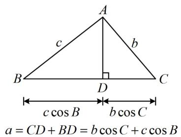
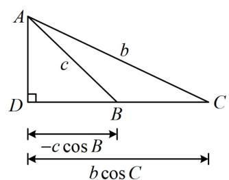
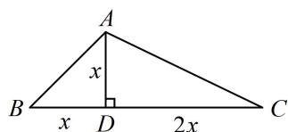
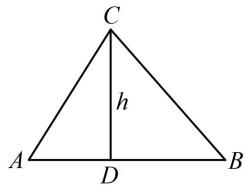
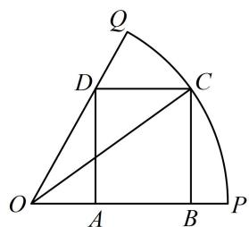
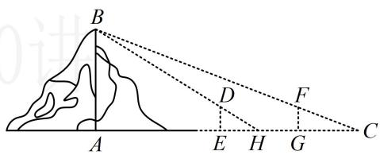
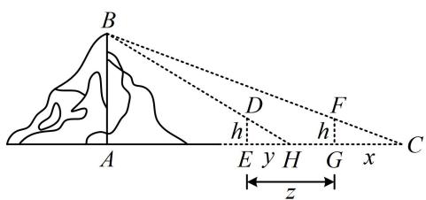
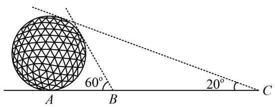
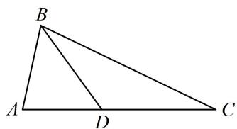

# 模块三 几何问题篇

# 第1节 射影定理、几何计算（★★★）

内容提要

##### 1. 射影定理：在 $\triangle ABC$ 中， $\left\{ \begin{array}{l} a = b \cos C + c \cos B \\ b = a \cos C + c \cos A \\ c = a \cos B + b \cos A \end{array} \right.$

提醒：大题不建议直接用射影定理，可先证再用，下面给出 $a = b\cos C + c\cos B$ 的证明.

因为 $\sin A = \sin [\pi -(B + C)] = \sin (B + C) = \sin B\cos C + \cos B\sin C$ ，所以 $a = b\cos C + c\cos B$

上式的图形解释如下图，另外两个式子可类似证明，本节后续解答过程若用到此定理，不再证明.

$a = C D - B D = b \cos C - (- c \cos B) = b \cos C + c \cos B$

##### 2. 几何计算: 遇到不便于直接解的解三角形问题, 往往可设长度或角度为参数, 用设的参数表示目标, 或通过分析图形的几何关系来建立方程, 求解问题.

# 类型 I：射影定理的应用

【例 1】 $\triangle ABC$ 的内角 $A, B, C$ 的对边分别为 $a, b, c, 2b \cos B = a \cos C + c \cos A$ ，则 $B =$ \_\_\_\_.

【解法1】所给等式每项都有齐次的边，结合要求的是角，可考虑用正弦定理边化角分析，

因为 $2b\cos B = a\cos C + c\cos A$ ，所以 $2\sin B\cos B = \sin A\cos C + \sin C\cos A = \sin (A + C) = \sin (\pi -B) = \sin B$ ①，又因为 $0 < B < \pi$ ，所以 $\sin B > 0$ ，故在式①中约去 $\sin B$ 可得 $\cos B = \frac{1}{2}$ ，所以 $B = \frac{\pi}{3}$

【解法2】看到所给等式中的 $a \cos C + c \cos A$ ，想到射影定理，由射影定理， $a \cos C + c \cos A = b$ ，代入 $2b \cos B = a \cos C + c \cos A$ 可得 $2b \cos B = b$ ，所以 $\cos B = \frac{1}{2}$ ，结合 $0 < B < \pi$ 可得 $B = \frac{\pi}{3}$ .

答案 $\frac{\pi}{3}$

【反思】出现 $a \cos B + b \cos A$ ， $a \cos C + c \cos A$ ， $b \cos C + c \cos B$ 这些结构，除了常规的边化角、角化边的处理方法外，还可以考虑用射影定理来速解.

##### 【变式】在 $\triangle ABC$ 中，角 $A, B, C$ 的对边分别为 $a, b, c$ ，且 $a = b \cos C + \sqrt{3}c \sin B$ ，则 $B = \_$ .

【解法1】所给等式每一项都有齐次的边，结合要求的是角，可考虑用正弦定理边化角分析，

因为 $a = b\cos C + \sqrt{3} c\sin B$ ，所以 $\sin A = \sin B\cos C + \sqrt{3}\sin C\sin B$ ①，

注意到右侧有 $\sin B \cos C$ ，故拆左侧的 $\sin A$ ，会出现相同的结构，可进一步化简，

因为 $\sin A = \sin [\pi -(B + C)] = \sin (B + C) = \sin B\cos C + \cos B\sin C$

所以代入式①得: $\sin B \cos C + \cos B \sin C = \sin B \cos C + \sqrt{3} \sin C \sin B$ , 故 $\cos B \sin C = \sqrt{3} \sin C \sin B$ ②, 因为 $0 < C < \pi$ , 所以 $\sin C > 0$ , 在式②中约去 $\sin C$ 可得 $\cos B = \sqrt{3} \sin B$ ,

所以 $\tan B = \frac{\sqrt{3}}{3}$ ，结合 $0 < B < \pi$ 可得 $B = \frac{\pi}{6}$ .

【解法2】观察发现所给等式右侧有 $b \cos C$ ，若将左侧的 $a$ 用射影定理代换掉，则可抵消一部分，

由射影定理， $a = b\cos C + c\cos B$ ，代入题干所给等式可得 $b\cos C + c\cos B = b\cos C + \sqrt{3} c\sin B$

所以 $c\cos B = \sqrt{3} c\sin B$ ，故 $\tan B = \frac{\sqrt{3}}{3}$ ，结合 $0 < B < \pi$ 可得 $B = \frac{\pi}{6}$

答案 $\frac{\pi}{6}$

【反思】不一定非要出现 $b \cos C + c \cos B$ 这种整体结构才能用射影定理，有时看到 $b \cos C$ 或 $c \cos B$ 这种局部结构，也能用射影定理速解问题.

# 类型 II：几何综合计算

【例 2】在 $\triangle ABC$ 中， $B=\frac{\pi}{4}$ ， $BC$ 边上的高等于 $\frac{1}{3}BC$ ，则 $\cos A=$ （）

$\quad$A. $\frac{3\sqrt{10}}{10}$

$\quad$B. $\frac{\sqrt{10}}{10}$

$\quad$C. $-\frac{\sqrt{10}}{10}$

$\quad$D. $-\frac{3\sqrt{10}}{10}$

解析题干涉及 $BC$ 边上的高，先画出图形，作出该高，并分析几何关系，

如图， $B=\frac{\pi}{4}\Rightarrow\triangle ABD$ 为等腰直角三角形 $\Rightarrow AD=BD$ ，又 BC 边上的高 $AD=\frac{1}{3}BC$ ，所以 CD=2AD，

观察图形可发现, 所有线段的长都能用 $A D$ 来表示, 故将其设为 $x$ ,

设 $AD = x$ ，则 $BD = x$ ， $CD = 2x$ ， $AB = \sqrt{2} x$ ， $AC = \sqrt{AD^2 + CD^2} = \sqrt{5} x$

$BC = 3x$ ，所以 $\cos A = \frac{AB^2 + AC^2 - BC^2}{2AB\cdot AC} = \frac{2x^2 + 5x^2 - 9x^2}{2\sqrt{2}x\cdot\sqrt{5}x} = -\frac{\sqrt{10}}{10}$

答案: C

【反思】对于几何计算问题，当出现未知长度或角度时，可以设出对应边长或者角度作为参数，再把其它量用参数表示，最后利用几何关系算出要求的几何问题.

##### 【变式1】锐角 $\triangle ABC$ 中， $\sin (A + B) = \frac{3}{5}$ ， $\sin (A - B) = \frac{1}{5}$ .

（1） 求证: $\tan A = 2 \tan B$ ; （2） 设 $AB = 3$ , 求 $AB$ 边上的高.

解：（1）（已知条件中的角是 $A + B$ 和 $A - B$ ，目标式中的角是 $A, B$ ，故考虑把已知等式展开，将角度向目标统一）由 $\sin (A + B) = \frac{3}{5}$ ， $\sin (A - B) = \frac{1}{5}$ 可得 $\left\{ \begin{array}{l} \sin A\cos B + \cos A\sin B = \frac{3}{5}\\ \sin A\cos B - \cos A\sin B = \frac{1}{5} \end{array} \right.$ ，所以 $\left\{ \begin{array}{l}\sin A\cos B = \frac{2}{5}\\ \cos A\sin B = \frac{1}{5} \end{array} \right.,$

两式相除得 $\frac{\tan A}{\tan B} = 2$ ，所以 $\tan A = 2\tan B$

（2） 解法 1: (三角形天然有内角和为 $\pi$ , 结合题干的两个条件, 总共三个角的条件, 应该能求出三角形的各个内角, 故按此尝试, 如何求角? 联系第 （1） 问的结论, 我们想到先算内角的正切)

由 $\triangle ABC$ 是锐角三角形可得 $A + B = \pi - C \in \left(\frac{\pi}{2}, \pi\right)$ ，又 $\sin(A + B) = \frac{3}{5}$ ，所以 $\cos(A + B) = -\sqrt{1 - \left(\frac{3}{5}\right)^2} = -\frac{4}{5}$ ，

从而 $\tan (A + B) = -\frac{3}{4}$ ，故 $\frac{\tan A + \tan B}{1 - \tan A\tan B} = -\frac{3}{4}$ ，将 $\tan A = 2\tan B$ 代入上式整理得： $2\tan^2 B - 4\tan B - 1 = 0$ ，

解得： $\tan B = \frac{2\pm\sqrt{6}}{2}$ ，又 $B$ 为锐角，所以 $\tan B > 0$ ，故 $\tan B = \frac{2 + \sqrt{6}}{2}$ ， $\tan A = 2\tan B = 2 + \sqrt{6}$

(有了 A 和 B, 怎样求高? 我们不妨画个图来看看. 如图, 已有 A 和 B, 则 AD 和 BD 容易用高 h 表示, 而 $AD + BD = AB$ , 故由此可建立方程求 h)

设 $AB$ 边上的高 $CD = h$ ，则 $AB = AD + DB = \frac{CD}{\tan A} +\frac{CD}{\tan B} = \frac{h}{2 + \sqrt{6}} +\frac{h}{\frac{2 + \sqrt{6}}{2}} = \frac{3h}{2 + \sqrt{6}}$

由题意， $AB = 3$ ，所以 $\frac{3h}{2 + \sqrt{6}} = 3$ ，解得： $h = 2 + \sqrt{6}$ ，故 $AB$ 边上的高为 $2 + \sqrt{6}$

【解法2】: (如图, 第（1）问我们得到了 $\tan A = 2 \tan B$ , 这两个正切刚好可以和 $h$ 联系起来, 故可尝试先把该结论翻译出来) 设 $AB$ 边上的高 $CD = h$ , 则 $\tan A = \frac{h}{AD}$ , $\tan B = \frac{h}{BD}$ ,

由（1）知 $\tan A = 2\tan B$ ，所以 $\frac{h}{AD} = 2\cdot \frac{h}{BD}$ ，故 $BD = 2AD$

又因为 $AB = 3$ ，所以 $AD = 1$ ， $BD = 2$ ，故 $AC = \sqrt{h^2 + 1}$ ， $BC = \sqrt{h^2 + 4}$

(到此所有长度都有了, 只要建立一个方程, 就能求 $h$ , 怎么建立? 已知三边, 当然想到余弦定理推论,由题干的 $\sin (A + B)$ 恰好容易求出 $\cos C$ , 于是对 $C$ 用余弦定理推论建立关于 $h$ 的方程)

由题意， $\sin (A + B) = \sin (\pi -C) = \sin C = \frac{3}{5}$ ，又因为 $\triangle ABC$ 是锐角三角形，所以 $\cos C = \sqrt{1 - \sin^2C} = \frac{4}{5}$

由余弦定理推论， $\cos C = \frac{AC^2 + BC^2 - AB^2}{2AC\cdot BC} = \frac{h^2 + 1 + h^2 + 4 - 9}{2\sqrt{h^2 + 1}\cdot\sqrt{h^2 + 4}} = \frac{h^2 - 2}{\sqrt{h^2 + 1}\cdot\sqrt{h^2 + 4}}$

所以 $\frac{h^2 - 2}{\sqrt{h^2 + 1} \cdot \sqrt{h^2 + 4}} = \frac{4}{5}$ ①,

从而 $25(h^{4} - 4h^{2} + 4) = 16(h^{4} + 5h^{2} + 4)$ ，故 $h^4 - 20h^2 + 4 = 0$ ，解得： $h^2 = 10 \pm 4\sqrt{6}$ ，

（有两个解，该取哪个呢？我们结合式①来看）由①可知 $h^2 - 2 > 0$ ，所以 $h^2 > 2$

注意到 $10 - 4\sqrt{6} < 2$ ，所以 $h^2 = 10 + 4\sqrt{6}$ ，故 $h = \sqrt{10 + 4\sqrt{6}} = \sqrt{(2 + \sqrt{6})^2} = 2 + \sqrt{6}$

【解法3】: (按解法2求得 $\sin C = \frac{3}{5}$ 后, 注意到已知 $A B$ , $A C$ , 结合图形可知 $\sin B$ 也容易用 $h$ 表示, 故接下来也可考虑用正弦定理建立关于 $h$ 的方程并求解)

由图可知 $\sin B = \frac{CD}{BC} = \frac{h}{\sqrt{h^2 + 4}}$ ，由正弦定理， $\frac{AB}{\sin C} = \frac{AC}{\sin B}$ 即 $\frac{3}{\frac{3}{5}} = \frac{\sqrt{h^2 + 1}}{\frac{h}{\sqrt{h^2 + 4}}}$ 所以 $\sqrt{h^2 + 1} = \frac{5h}{\sqrt{h^2 + 4}}$

从而 $(h^2 + 1)(h^2 + 4) = 25h^2$ ，故 $h^4 - 20h^2 + 4 = 0$ ，接下来同解法2.

【反思】本题尽管计算量更大，且三个解法的具体操作方法不同，但思路其实大体相同，都是设出未知数，再利用几何关系建立方程求解所设未知数。“设参数、列方程”就是几何计算问题的核心流程.

##### 【变式2】如图, 半径为1的扇形 $OPQ$ 的圆心角为 $\frac{\pi}{3}$ , 点 $C$ 在劣弧 $PQ$ 上运动, $ABCD$ 是扇形的内接矩形, 则矩形 $ABCD$ 面积的最大值为

解析矩形ABCD的面积由点 $C$ 的位置决定，而点 $C$ 的位置由 $\angle POC$ 决定，故可引入 $\angle POC$ 为变量，设 $\angle POC = \alpha \left(0 < \alpha < \frac{\pi}{3}\right)$ ，则 $BC = OC \cdot \sin \alpha = \sin \alpha$

$A D = B C = \sin \alpha , O B = O C \cdot \cos \alpha = \cos \alpha , O A = \frac {A D}{\tan \angle A O D} = \frac {\sin \alpha}{\tan \frac {\pi}{3}} = \frac {\sqrt {3}}{3} \sin \alpha ,$

所以 $AB = OB - OA = \cos \alpha -\frac{\sqrt{3}}{3}\sin \alpha$ ，故矩形的面积 $S = AB\cdot BC = \left(\cos \alpha -\frac{\sqrt{3}}{3}\sin \alpha\right)\sin \alpha$

$= \frac {1}{2} \sin 2 \alpha - \frac {\sqrt {3}}{3} \cdot \frac {1 - \cos 2 \alpha}{2} = \frac {\sqrt {3}}{3} \sin \left(2 \alpha + \frac {\pi}{6}\right) - \frac {\sqrt {3}}{6},$

因为 $0 < \alpha < \frac{\pi}{3}$ ，所以 $\frac{\pi}{6} < 2\alpha + \frac{\pi}{6} < \frac{5\pi}{6}$ ，故当 $2\alpha + \frac{\pi}{6} = \frac{\pi}{2}$ 时， $S$ 取得最大值 $\frac{\sqrt{3}}{6}$ .

答案 $\frac{\sqrt{3}}{6}$

【反思】变量函数思想是求最值的基本思想之一，引入变量的方法不是唯一的，例如本题设的是角度，其实也可设 BC = x ，但由此得出的面积表达式较复杂，不易求最值，所以在选取变量时，应预判计算量.

【变式 3】(2021·全国乙卷) 魏晋时期刘徽撰写的《海岛算经》是关于测量的数学著作, 其中第一题是测量海岛的高, 如图, 点 $E$ , $H$ , $G$ 在水平线 $AC$ 上, $DE$ 和 $FG$ 是两个垂直于水平面且等高的测量标杆的高度, 称为 “表高”, $EG$ 称为 “表距”, $GC$ 和 $EH$ 都称为 “表目距”, $GC$ 与 $EH$ 的差称为 “表目距的差”, 则海岛的高 $AB = (\quad)$

$\quad$A. $\frac{\text{表高} \times \text{表距}}{\text{表目距的差}} + \text{表高}$

$\quad$B. $\frac{\text{表高} \times \text{表距}}{\text{表目距的差}}$ - 表高

$\quad$C. $\frac{\text{表高} \times \text{表距}}{\text{表目距的差}} + \text{表距}$

$\quad$D. $\frac{\text{表高} \times \text{表距}}{\text{表目距的差}}$ - 表距

【解法1】为了方便观察，先把题干涉及到的线段设成字母，并在图中标注出来，

如图，设表目距 $CG = x$ ，表目距 $EH = y$ ，表距 $EG = z$ ，表高 $DE = FG = h$

从图形来看，有两组三角形相似，可用相似比建立这些边长的关系，

因为 $\triangle FGC \sim \triangle BAC$ ，所以 $\frac{FG}{AB} = \frac{CG}{AC}$ ，故 $\frac{h}{AB} = \frac{x}{x + z + AE}$ ①，四个选项都涉及表目距的差 $x - y$ ，故将上式变形成“ $x = \cdots$ ”的形式，用于和接下来的 $y$ 作差，所以 $x = \frac{h \cdot (x + z + AE)}{AB}$ ②，

又 $\triangle DEH \sim \triangle BAH$ ，所以 $\frac{DE}{AB} = \frac{EH}{AH}$ ，从而 $\frac{h}{AB} = \frac{y}{y + AE}$ ③，故 $y = \frac{h \cdot (y + AE)}{AB}$ ④，

所以②-④得： $x - y = \frac{h(x + z - y)}{AB}$ ，故 $AB = \frac{h(x - y + z)}{x - y} = h + \frac{hz}{x - y}$ ，即 $AB =$ 表高 $+\frac{\text{表高}\times\text{表距}}{\text{表目距的差}}$

【解法2】: 按解法1得到式①和式③后, 若熟悉等比性质 $\left(\frac{a}{b} = \frac{c}{d} = k \Rightarrow k = \frac{a \pm c}{b \pm d}\right)$ , 则可直接消 $AE$ ,

由①和③可得 $\frac{h}{AB} = \frac{x - y}{(x + z + AE) - (y + AE)} = \frac{x - y}{x + z - y}$

所以 $AB = \frac{h(x + z - y)}{x - y} = h + \frac{hz}{x - y}$ 即 $AB =$ 表高 $+\frac{\text{表高}\times\text{表距}}{\text{表目距的差}}$

答案: A

【反思】本题解析设了多个参数，但核心还是设出参数，根据条件列方程，最后求解出答案.

# 强化训练

##### 1. (★)

在 $\triangle ABC$ 中，角 $A, B, C$ 所对的边分别为 $a, b, c$ ，已知 $b \cos C + c \cos B = 2b$ ，则 $\frac{a}{b} =$ \_\_\_\_.

##### 2. (★★)

在 $\triangle ABC$ 中，已知 $b = \sqrt{3}$ ， $(3 - c)\cos A = a\cos C$ ，则 $\cos A =$ \_\_\_\_.

##### 3. (2023·江苏省苏北七市二调·★★★)

古代数学家刘徽编撰的《重差》是中国最早的一部测量学著作，也为地图学提供了数学基础。现根据刘徽的《重差》测量一个球体建筑物的高度，已知点 $A$ 是球体建筑物与水平地面的接触点（切点），地面上 $B$ ， $C$ 两点与点 $A$ 在同一条直线上，且在点 $A$ 的同侧。若在 $B$ ， $C$ 处分别测得球体建筑物的最大仰角为 $60^{\circ}$ 和 $20^{\circ}$ ，且 $BC = 100\mathrm{m}$ ，则该球体建筑物的高度约为（）（ $\cos 10^{\circ} \approx 0.985$ ）

$\quad$A. $49.25 \mathrm{~m}$

$\quad$B. $50.76 \mathrm{~m}$

$\quad$C. $56.74 \mathrm{~m}$

$\quad$D. $58.60 \mathrm{~m}$

##### 4. (★★★)

如图， $\triangle ABC$ 中， $D$ 是边 $AC$ 上的点， $AB = AD$ ， $2AB = \sqrt{3} BD$ ， $BC = 2BD$ ，则 $\sin C = (\quad)$

$\quad$A. $\frac{\sqrt{3}}{3}$

$\quad$B. $\frac{\sqrt{3}}{6}$

$\quad$C. $\frac{\sqrt{6}}{3}$

$\quad$D. $\frac{\sqrt{6}}{6}$

##### 5. (2024·新疆乌鲁木齐一模·★★★☆)

在 $\triangle ABC$ 中， $\overrightarrow{AD} = \frac{2}{3}\overrightarrow{AB} +\frac{1}{3}\overrightarrow{AC}$ ， $\angle BAD = \theta$

$\angle CAD = 2\theta$ ，则下列各式一定成立的是（）

$\quad$A. $\sin B = \cos \theta \sin C$   
$\quad$B. $\sin C = \cos \theta \sin B$   
$\quad$C. $\sin B = \sin \theta \sin C$   
$\quad$D. $\sin C = \sin \theta \sin B$

##### 6. (2023·广东深圳模拟·★★★)

已知 $a, b, c$ 分别为 $\triangle ABC$ 三个内角 $A, B, C$ 的对边，且 $c \cos B + 3b \cos C = a - b$ .

（1） 求 C;   
（2）若 $a = 5$ ， $\cos B = \frac{13}{14}$ ， $D$ 为 $AB$ 边上一点，且 $BD = 5$ ，求 $\triangle ACD$ 的面积.

##### 7. (2023·四川模拟·★★★☆)

如图，在扇形 $MON$ 中， $ON = 3$ ， $\angle MON = \frac{2\pi}{3}$ ， $\angle MON$ 的平分线交扇形弧于点 $P$ ，点 $A$ 是扇形弧 $PM$ 上一点（不包括端点），过 $A$ 作 $OP$ 的垂线交扇形弧于另一点 $B$ ，分别过 $A$ ， $B$ 作 $OP$ 的平行线，交 $OM$ ， $ON$ 于点 $D$ ， $C$ .

（1）若 $\angle AOB = \frac{\pi}{3}$ ，求 $AD$   
（2）设 $\angle AOP = x$ ， $x\in \left(0,\frac{\pi}{3}\right)$ ，求四边形ABCD的面积的最大值.

