# 强化训练

# 类型 I：向量的分解与共线

##### 1. (2022·新课标Ⅰ卷·★)

在 $\triangle ABC$ 中，点 $D$ 在边 $AB$ 上， $BD = 2DA$ ，记 $\overrightarrow{CA} = m$ ， $\overrightarrow{CD} = n$ ，则 $\overrightarrow{CB} =$ （）

$\quad$A. $3 m - 2 n$

$\quad$B. $-2m + 3n$

$\quad$C. $3m + 2n$

$\quad$D. $2m + 3n$

##### 1. B

【解法1】如图，由题意， $\overrightarrow{CB} = \overrightarrow{CA} +\overrightarrow{AB} = \overrightarrow{CA} +3\overrightarrow{AD}$

$= \overrightarrow {C A} + 3 (\overrightarrow {C D} - \overrightarrow {C A}) = - 2 \overrightarrow {C A} + 3 \overrightarrow {C D} = - 2 \boldsymbol {m} + 3 \boldsymbol {n}.$

解法 2：由题意， $\overrightarrow{AD}=\frac{1}{3}\overrightarrow{AB}$ ，根据内容提要第 2 点的结

论②， $\overrightarrow{CD} = \left(1 - \frac{1}{3}\right)\overrightarrow{CA} +\frac{1}{3}\overrightarrow{CB} = \frac{2}{3}\overrightarrow{CA} +\frac{1}{3}\overrightarrow{CB},$

所以 $\overrightarrow{CB} = -2\overrightarrow{CA} + 3\overrightarrow{CD} = -2m + 3n$ .

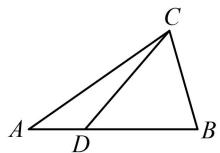

##### 2. (2023·广东模拟·★★)

在平行四边形ABCD中， $E$ 为AD中点， $F$ 为BE与AC的交点，则 $\overrightarrow{DF} =$ （）

$\quad$A. $\frac{1}{3}\overrightarrow{AB} +\frac{2}{3}\overrightarrow{AD}$

$\quad$B. $\frac{1}{3}\overrightarrow{AB} -\frac{2}{3}\overrightarrow{AD}$

$\quad$C. $\frac{1}{4}\overrightarrow{AB} +\frac{3}{4}\overrightarrow{AD}$

$\quad$D. $\frac{1}{4}\overrightarrow{AB} -\frac{3}{4}\overrightarrow{AD}$

##### 2. B

解析如图，从 $D$ 到 $F$ ，与基底 $\overrightarrow{AB}$ ， $\overrightarrow{AD}$ 关联较强的路径可选 $D\to A\to F$

由题意， $\overrightarrow{DF} = \overrightarrow{DA} +\overrightarrow{AF} = -\overrightarrow{AD} +\overrightarrow{AF}$ ①

还需把 $\overrightarrow{AF}$ 也用基底表示，先分析 $F$ 在 $AC$ 上的位置，

由图可知 $\triangle AEF\sim \triangle CBF$ ，所以 $\frac{AF}{CF} = \frac{AE}{BC} = \frac{1}{2}$

故 $\overrightarrow{AF} = \frac{1}{3}\overrightarrow{AC} = \frac{1}{3} (\overrightarrow{AB} +\overrightarrow{AD})$

代入①整理得： $\overrightarrow{DF} = \frac{1}{3}\overrightarrow{AB} -\frac{2}{3}\overrightarrow{AD}$

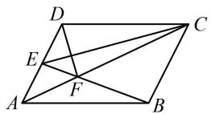

##### 3. (2022·安徽芜湖模拟·★★★)

如图， $O$ 是 $\triangle ABC$ 的重心， $D$ 是边 $BC$ 上一点，且 $\overrightarrow{BD} = 3\overrightarrow{DC}$ ， $\overrightarrow{OD} = \lambda \overrightarrow{AB} +\mu \overrightarrow{AC}$ ，则 $\frac{\lambda}{\mu} =$ （）

$\quad$A. $-\frac{1}{5}$

$\quad$B. $-\frac{1}{4}$

$\quad$C. $\frac{1}{5}$

$\quad$D. $\frac{1}{4}$

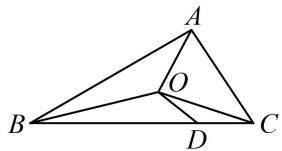

##### 3. A

解析 $\overrightarrow{OD} = \overrightarrow{OC} +\overrightarrow{CD} = \overrightarrow{OC} +\frac{1}{4}\overrightarrow{CB} = \overrightarrow{OC} +\frac{1}{4}\overrightarrow{AB} -\frac{1}{4}\overrightarrow{AC}$ ①，

还需把 $\overrightarrow{OC}$ 用基底表示，可用重心分中线比例来完成，

如图，延长 $CO$ 交 $AB$ 于 $E$ ，则 $E$ 为 $AB$ 中点，

且 $\overrightarrow{CO} = \frac{2}{3}\overrightarrow{CE} = \frac{2}{3}\times \frac{1}{2} (\overrightarrow{CA} +\overrightarrow{CB}) = \frac{1}{3}\overrightarrow{CA} +\frac{1}{3}\overrightarrow{CB}$

$= - \frac {1}{3} \overrightarrow {A C} + \frac {1}{3} (\overrightarrow {A B} - \overrightarrow {A C}) = \frac {1}{3} \overrightarrow {A B} - \frac {2}{3} \overrightarrow {A C},$

所以 $\overrightarrow{OC} = -\overrightarrow{CO} = -\frac{1}{3}\overrightarrow{AB} +\frac{2}{3}\overrightarrow{AC}$ ，代入①得

$\overrightarrow {O D} = \left(- \frac {1}{3} \overrightarrow {A B} + \frac {2}{3} \overrightarrow {A C}\right) + \frac {1}{4} \overrightarrow {A B} - \frac {1}{4} \overrightarrow {A C} = - \frac {1}{1 2} \overrightarrow {A B} + \frac {5}{1 2} \overrightarrow {A C},$

又 $\overrightarrow{OD} = \lambda \overrightarrow{AB} +\mu \overrightarrow{AC}$ ，所以 $\lambda = -\frac{1}{12}$ ， $\mu = \frac{5}{12}$ ，故 $\frac{\lambda}{\mu} = -\frac{1}{5}$

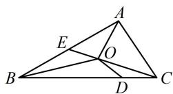

【反思】设 O 为 $\triangle ABC$ 的重心，则 $\overrightarrow{AO} = \frac{1}{3} \overrightarrow{AB} + \frac{1}{3} \overrightarrow{AC}$ .

##### 4. (2024·江苏南通三模·★★)

在梯形 $ABCD$ 中， $AB \parallel CD$ ，且 $AB = 2CD$ ，点 $M$ 是 $BC$ 的中点，则 $\overrightarrow{AM} = (\quad)$

$\quad$A. $\frac{2}{3}\overrightarrow{AB} -\frac{1}{2}\overrightarrow{AD}$

$\quad$B. $\frac{1}{2}\overrightarrow{AB} +\frac{2}{3}\overrightarrow{AD}$

$\quad$C. $\overrightarrow{AB} +\frac{1}{2}\overrightarrow{AD}$

$\quad$D. $\frac{3}{4}\overrightarrow{AB} +\frac{1}{2}\overrightarrow{AD}$

##### 4. D

解析观察选项发现目标是把 $\overrightarrow{AM}$ 用 $\overrightarrow{AB}$ 和 $\overrightarrow{AD}$ 表示，从 $A$ 到 $M$ ，与基底 $\{\overrightarrow{AB},\overrightarrow{AD}\}$ 关联较强的路径是 $A\to B\to M$ 如图，由题意， $\overrightarrow{AM} = \overrightarrow{AB} +\overrightarrow{BM} = \overrightarrow{AB} +\frac{1}{2}\overrightarrow{BC}$

$= \overrightarrow {A B} + \frac {1}{2} (\overrightarrow {B A} + \overrightarrow {A D} + \overrightarrow {D C}) = \overrightarrow {A B} - \frac {1}{2} \overrightarrow {A B} + \frac {1}{2} \overrightarrow {A D} + \frac {1}{2} \overrightarrow {D C}$

$= \frac {1}{2} \overrightarrow {A B} + \frac {1}{2} \overrightarrow {A D} + \frac {1}{2} \times \frac {1}{2} \overrightarrow {A B} = \frac {3}{4} \overrightarrow {A B} + \frac {1}{2} \overrightarrow {A D}.$

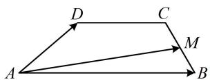

# 5. (★★☆)

已知 $\triangle ABC$ 内接于圆 $O$ ， $\left|\overrightarrow{CA} +\overrightarrow{CB}\right| = \left|\overrightarrow{CA} -\overrightarrow{CB}\right|$ ，若 $P$ 为线段 $OC$ 的中点，则 $\overrightarrow{OP} =$ （）

$\quad$A. $\frac{1}{3}\overrightarrow{AC} -\frac{1}{2}\overrightarrow{AB}$

$\quad$B. $\frac{1}{4}\overrightarrow{AC} -\frac{1}{2}\overrightarrow{AB}$

$\quad$C. $\frac{1}{2}\overrightarrow{AC} -\frac{1}{4}\overrightarrow{AB}$

$\quad$D. $\frac{1}{2}\overrightarrow{AC} -\frac{1}{3}\overrightarrow{AB}$

##### 5. C

解析给出了模的关系，想到将其平方，去掉模再看，

$\left| \overrightarrow {C A} + \overrightarrow {C B} \right| = \left| \overrightarrow {C A} - \overrightarrow {C B} \right| \Rightarrow \left| \overrightarrow {C A} + \overrightarrow {C B} \right| ^ {2} = \left| \overrightarrow {C A} - \overrightarrow {C B} \right| ^ {2},$

所以 $\overrightarrow{CA}^2 +\overrightarrow{CB}^2 +2\overrightarrow{CA}\cdot \overrightarrow{CB} = \overrightarrow{CA}^2 +\overrightarrow{CB}^2 -2\overrightarrow{CA}\cdot \overrightarrow{CB}$

从而 $\overrightarrow{CA} \cdot \overrightarrow{CB} = 0$ ，故 $CA \perp CB$ ，

所以 $AB$ 是圆 $O$ 的直径， $O$ 即为 $AB$ 中点，如图，

故 $\overrightarrow{OP} = -\frac{1}{2}\overrightarrow{CO} = -\frac{1}{2}\times \frac{1}{2} (\overrightarrow{CA} +\overrightarrow{CB}) = -\frac{1}{4}\overrightarrow{CA} -\frac{1}{4}\overrightarrow{CB}$

$= \frac {1}{4} \overrightarrow {A C} - \frac {1}{4} (\overrightarrow {A B} - \overrightarrow {A C}) = \frac {1}{2} \overrightarrow {A C} - \frac {1}{4} \overrightarrow {A B}.$

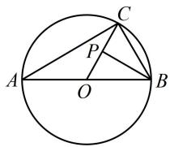

# 6. (2023·江苏省苏北七市二调·★★★)

在 $\square ABCD$ 中， $\overrightarrow{BE} = \frac{1}{2}\overrightarrow{BC}$ ， $\overrightarrow{AF} = \frac{1}{3}\overrightarrow{AE}$ ，若 $\overrightarrow{AB} = m\overrightarrow{DF} + n\overrightarrow{AE}$ ，则 $m + n = (\quad)$

$\quad$A. $\frac{1}{2}$

$\quad$B. $\frac{3}{4}$

$\quad$C. $\frac{5}{6}$

$\quad$D. $\frac{4}{3}$

##### 6. D

解析: 直接将 $\overrightarrow{AB}$ 用 $\overrightarrow{DF}$ 和 $\overrightarrow{AE}$ 表示较难, 在 $\square ABCD$ 中, 用 $\overrightarrow{AB}$ 和 $\overrightarrow{AD}$ 表示其它向量更容易, 故把它们作为基底表示 $\overrightarrow{DF}$ 和 $\overrightarrow{AE}$ , 代回原条件等式, 通过对比系数求 m, n,

如图， $\overrightarrow{DF} = \overrightarrow{DA} +\overrightarrow{AF} = -\overrightarrow{AD} +\frac{1}{3}\overrightarrow{AE} = -\overrightarrow{AD} +\frac{1}{3} (\overrightarrow{AB} +\overrightarrow{BE})$

$= - \overrightarrow {A D} + \frac {1}{3} \left(\overrightarrow {A B} + \frac {1}{2} \overrightarrow {A D}\right) = \frac {1}{3} \overrightarrow {A B} - \frac {5}{6} \overrightarrow {A D},$

$\overrightarrow{AE} = \overrightarrow{AB} +\overrightarrow{BE} = \overrightarrow{AB} +\frac{1}{2}\overrightarrow{AD}$ ，因为 $\overrightarrow{AB} = m\overrightarrow{DF} +n\overrightarrow{AE}$

所以 $\overrightarrow{AB} = m\left(\frac{1}{3}\overrightarrow{AB} -\frac{5}{6}\overrightarrow{AD}\right) + n\left(\overrightarrow{AB} +\frac{1}{2}\overrightarrow{AD}\right)$

$= \left(\frac {m}{3} + n\right) \overrightarrow {A B} + \left(\frac {n}{2} - \frac {5 m}{6}\right) \overrightarrow {A D},$

比较左右两边系数可得 $\left\{ \begin{array}{l} \frac{m}{3} + n = 1 \\ \frac{n}{2} - \frac{5m}{6} = 0 \end{array} \right.$

解得： $m = \frac{1}{2}$ ， $n = \frac{5}{6}$ ，所以 $m + n = \frac{4}{3}$

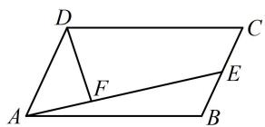

##### 7.（2022·重庆模拟·★★★☆）

如图，已知点 $G$ 是 $\triangle ABC$ 的重心，过点 $G$ 作直线分别与 $AB$ ， $AC$ 两边交于 $M$ ， $N$ 两点（ $M$ ， $N$ 与 $B$ ， $C$ 不重合），设 $\overrightarrow{AB} = x\overrightarrow{AM}$ ， $\overrightarrow{AC} = y\overrightarrow{AN}$ ，则 $\frac{1}{x + 1} + \frac{1}{y + 1}$ 的最小值为（）

$\quad$A. $\frac{1}{2}$

$\quad$B. $\frac{2}{3}$

$\quad$C. $\frac{3}{4}$

$\quad$D. $\frac{4}{5}$

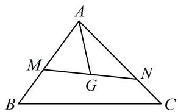

##### 7. D

解析目标式有两个变量，应先找它们的关系。由 G 为重心可知 $\overrightarrow{AG}$ 能用 $\overrightarrow{AB}$ ， $\overrightarrow{AC}$ 表示，结合已知又可化为用 $\overrightarrow{AM}$ ， $\overrightarrow{AN}$ 表示的结果，从而由 M, G, N 共线找到 x, y 的关系，

$G$ 是重心 $\Rightarrow \overrightarrow{AG} = \frac{1}{3}\overrightarrow{AB} +\frac{1}{3}\overrightarrow{AC} = \frac{x}{3}\overrightarrow{AM} +\frac{y}{3}\overrightarrow{AN}$ ，（原因可参考本节练习第3题）

结合 M, G, N 三点共线可得 $\frac{x}{3} + \frac{y}{3} = 1$ ，故 $x + y = 3$ ①，

目标式分母是 $x + 1$ 和 $y + 1$ ，所以按此凑形式，

由①可得 $(x + 1) + (y + 1) = 5$ ，所以 $\frac{1}{x + 1} +\frac{1}{y + 1} =$

$\left(\frac {1}{x + 1} + \frac {1}{y + 1}\right) \cdot 5 \times \frac {1}{5} = \left(\frac {1}{x + 1} + \frac {1}{y + 1}\right) \cdot [ (x + 1) + (y + 1) ] \cdot \frac {1}{5}$

$= \frac {1}{5} \left(1 + \frac {y + 1}{x + 1} + \frac {x + 1}{y + 1} + 1\right) = \frac {1}{5} \left(\frac {y + 1}{x + 1} + \frac {x + 1}{y + 1} + 2\right)$

$\geq \frac{1}{5}\left(2\sqrt{\frac{y + 1}{x + 1} \cdot \frac{x + 1}{y + 1}} + 2\right) = \frac{4}{5}$ ，取等条件是 $\frac{y + 1}{x + 1} = \frac{x + 1}{y + 1}$ ，

结合 $x + y = 3$ 可得 $x = y = \frac{3}{2}$ ，所以 $\left(\frac{1}{x + 1} +\frac{1}{y + 1}\right)_{\min} = \frac{4}{5}.$

##### 8.（2023·江苏省苏锡常镇四市一模·★★★☆）

在 $\triangle ABC$ 中，已知 $\overrightarrow{BD} = 2\overrightarrow{DC}$ ， $\overrightarrow{CE} = \overrightarrow{EA}$ ， $BE$ 与 $AD$ 交于点 $O$ ，若 $\overrightarrow{CO} = x\overrightarrow{CB} +y\overrightarrow{CA}(x,y\in \mathbf{R})$ ，则 $x + y = \_$ .

##### 8. $\frac{3}{5}$

解析肯定不好通过将 $\overrightarrow{CO}$ 直接分解为 $\overrightarrow{CB}$ 和 $\overrightarrow{CA}$ 来求 $x + y$ ，故想办法列出关于 $x, y$ 的方程，观察发现由 $A, O, D$ 共线可以得到一个，利用 $B, O, E$ 共线又可得到一个， $x, y$ 便可直接解出来了，因为 $\overrightarrow{BD} = 2\overrightarrow{DC}$ ，所以 $\overrightarrow{CB} = 3\overrightarrow{CD}$ ，

代入 $\overrightarrow{CO} = x\overrightarrow{CB} +y\overrightarrow{CA}$ 可得 $\overrightarrow{CO} = 3x\overrightarrow{CD} +y\overrightarrow{CA}$

因为 $A, O, D$ 共线，所以由三点共线系数和结论，

$3 x + y = 1 \quad ①,$

同理，由 $\overrightarrow{CE} = \overrightarrow{EA}$ 可得 $\overrightarrow{CA} = 2\overrightarrow{CE}$ ，

代入 $\overrightarrow{CO} = x\overrightarrow{CB} +y\overrightarrow{CA}$ 可得 $\overrightarrow{CO} = x\overrightarrow{CB} +2y\overrightarrow{CE}$

结合 B, O, E 三点共线可得 $x + 2y = 1$ ②,

联立①②解得： $x=\frac{1}{5}$ ， $y=\frac{2}{5}$ ，所以 $x+y=\frac{3}{5}$ .

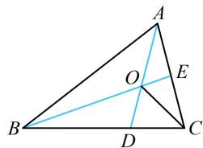

# 类型Ⅱ：等和线的运用

# 9. (★★★)

如图，在扇形 OAB 中， $\angle AOB = 90^{\circ}$ ，C 为弧 AB 上的一个动点，若 $\overrightarrow{OC} = x\overrightarrow{OA} + y\overrightarrow{OB}$ ，则 $x + y$ 的最大值是 \_\_\_\_.

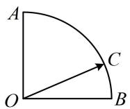

##### 9. $\sqrt{2}$

解析涉及基底表示的系数和问题，考虑用等和线处理，先连接基向量终点，找到系数和为1的等和线，

如图，连接 $AB$ ，则 $AB$ 是和为1的等和线，设 $l$ 是与 $AB$ 平行且与圆弧相切的直线，

由等和线定理，当 $C$ 恰为切点时， $C$ 离等和线 $AB$ 最远，

此时 $x + y$ 最大，设 $OC$ 与 $AB$ 交于点 $D$ ，则 $OD \perp AB$

不妨设 $|OA|=|OB|=|OC|=2$ ，则 $|OD|=\sqrt{2}$ ，

所以 $(x + y)_{\max} = \frac{|OC|}{|OD|} = \frac{2}{\sqrt{2}} = \sqrt{2}$

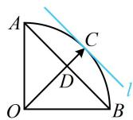

##### 10. (2023·山东模拟·★★★)

已知正 $\triangle ABC$ 的边长为1，动点 $P$ 满足 $\left|\overrightarrow{AP}\right| = 1$ ， $\overrightarrow{AP} = \lambda \overrightarrow{AB} +\mu \overrightarrow{AC}$ ，则 $\lambda +\mu$ 的最小值为（）

$\quad$A. $-\sqrt{3}$

$\quad$B. $-\frac{2\sqrt{3}}{3}$

$\quad$C. 0

$\quad$D. 3

##### 10. B

解析涉及基底表示的系数和问题，考虑用等和线处理，先找到系数和为1的等和线，由题意，BC即为系数和为1的等和线，所以等和线应与BC平行，

如图，要使 $\lambda +\mu$ 最小，点 $P$ 应在如图所示的位置，其中 $l$ 为与 $BC$ 平行的圆的切线，

由等和线定理， $(\lambda +\mu)_{\mathrm{min}} = -\frac{|PA|}{|AD|} = -\frac{1}{\frac{\sqrt{3}}{2}} = -\frac{2\sqrt{3}}{3}.$

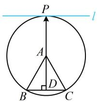

【反思】在以 $\overrightarrow{AB}$ ， $\overrightarrow{AC}$ 为基底系数和问题中，当点 A 在等和线 BC 与等和线 l 之间时，l 这条等和线的和为负数.

