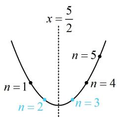

# 强化训练

##### 1. (2023·福建福州第一次质检·★★)

已知等比数列 $\{a_{n}\}$ 的前 $n$ 项和为 $S_{n}$ ， $a_{n+1} = S_{n} + 2$ 。

（1） 求 $\{a_{n}\}$ 的通项公式;  
（2）若 $b_{n} = \log_{2}a_{2n - 1}$ ，求数列 $\{b_n\}$ 的前 $n$ 项和 $T_{n}$

##### 1. 解: （1） (条件给的是 $a_{n}$ 与 $S_{n}$ 混搭的关系式, 要求 $a_{n}$ , 考虑退 $n$ 相减, 消去 $S_{n}$ )

因为 $a_{n + 1} = S_n + 2$ ，所以当 $n\geq 2$ 时， $a_{n} = S_{n - 1} + 2$

从而 $a_{n + 1} - a_n = S_n + 2 - S_{n - 1} - 2 = a_n$ ，故 $a_{n + 1} = 2a_{n}$ ①，

（条件已经给出了 $\{a_{n}\}$ 是等比数列，所以由上式可得出公比为2，求通项还差 $a_1$ ，可在 $a_{n + 1} = S_n + 2$ 中取 $n = 1$ 来算）在 $a_{n + 1} = S_n + 2$ 中取 $n = 1$ 得 $a_2 = S_1 + 2$ ，

由①知 $\{a_{n}\}$ 的公比 $q = 2$ ，所以 $a_2 = S_1 + 2$ 即为

$a_1 \times 2 = a_1 + 2$ ，解得： $a_1 = 2$ ，故 $a_n = 2^n$

（2）由（1）可得 $b_{n} = \log_{2}a_{2n - 1} = \log_22^{2n - 1} = 2n - 1$

所以 $T_{n}=b_{1}+b_{2}+b_{3}+\cdots+b_{n}=1+3+5+\cdots+(2n-1)$

$= \frac {n (1 + 2 n - 1)}{2} = n ^ {2}.$

##### 2. (2024·江苏南通二模·★★☆)

设数列 $\{a_{n}\}$ 的前 $n$ 项和为 $S_{n}$ ，且 $S_{n} - \frac{1}{2} a_{n} = n^{2} + 1$ .

（1）求 $a_1$ ， $a_2$ ，并证明：数列 $\{a_n + a_{n + 1}\}$ 是等差数列；  
（2） 求 $S_{20}$ .

##### 2. 解：（1）在 $S_{n} - \frac{1}{2} a_{n} = n^{2} + 1$ 中取 $n = 1$ 得

$S_{1} - \frac{1}{2} a_{1} = a_{1} - \frac{1}{2} a_{1} = 2$ ，所以 $a_1 = 4$

取 $n = 2$ 得 $S_{2} - \frac{1}{2} a_{2} = a_{1} + a_{2} - \frac{1}{2} a_{2} = 5$

结合 $a_1 = 4$ 可得 $a_2 = 2$ ，

（接下来证 $\{a_{n} + a_{n + 1}\}$ 是等差数列，条件涉及 $S_{n}$ 与 $a_{n}$ 混搭的关系式，要证的是与 $a_{n}$ 有关的结论，故考虑退 $n$ 相减，消去 $S_{n}$ ）因为 $S_{n} - \frac{1}{2} a_{n} = n^{2} + 1$ ，所以当 $n\geq 2$ 时，

$S_{n - 1} - \frac{1}{2} a_{n - 1} = (n - 1)^2 +1$ ，两式相减得

$S _ {n} - \frac {1}{2} a _ {n} - \left(S _ {n - 1} - \frac {1}{2} a _ {n - 1}\right) = n ^ {2} + 1 - [ (n - 1) ^ {2} + 1 ] \quad ①,$

又因为 $S_{n} - \frac{1}{2} a_{n} - \left(S_{n - 1} - \frac{1}{2} a_{n - 1}\right) = S_{n} - S_{n - 1} - \frac{1}{2} a_{n} + \frac{1}{2} a_{n - 1}$

$= a _ {n} - \frac {1}{2} a _ {n} + \frac {1}{2} a _ {n - 1} = \frac {1}{2} (a _ {n} + a _ {n - 1}),$

$n ^ {2} + 1 - [ (n - 1) ^ {2} + 1 ] = 2 n - 1,$

所以式①即为 $\frac{1}{2} (a_n + a_{n-1}) = 2n - 1$ ，故 $a_{n} + a_{n-1} = 4n - 2$

所以 $(a_{n + 1} + a_n) - (a_n + a_{n - 1}) = [4(n + 1) - 2] - (4n - 2) = 4$

故数列 $\{a_{n + 1} + a_n\}$ 是等差数列.

（2） (第 （1） 问已经得到了 $a_{n} + a_{n - 1} = 4n - 2$ , 故求 $S_{20}$ 时, 可按相邻项进行分组)

由（1）知 $a_{n} + a_{n - 1} = 4n - 2(n\geq 2)$

所以 $S_{20}=(a_{1}+a_{2})+(a_{3}+a_{4})+(a_{5}+a_{6})+\cdots+(a_{19}+a_{20})$

$= 6 + 1 4 + 2 2 + \dots + 7 8 = \frac {1 0 \times (6 + 7 8)}{2} = 4 2 0.$

##### 3. (2023·广西桂林模拟·★★★)

已知数列 $\{a_{n}\}$ 的前 $n$ 项和为 $S_{n}$ ， $a_{1} = 1$ ， $S_{n} = a_{n + 1} - 2^{n}$ .

（1）证明：数列 $\left\{\frac{S_n}{2^n}\right\}$ 为等差数列；

（2）若 $\forall n\in \mathbf{N}^*$ ， $(n - 6)a_{n}\geq \lambda \cdot 2^{n}$ ，求 $\lambda$ 的最大值.

##### 3. 解: （1） (要证的是与 $S_{n}$ 有关的结论, 故在 $S_{n} = a_{n+1} - 2^{n}$ 中将 $a_{n+1}$ 代换成 $S_{n+1} - S_{n}$ , 消去 $a_{n+1}$ )

因为 $S_{n} = a_{n + 1} - 2^{n}$ ，所以 $S_{n} = S_{n + 1} - S_{n} - 2^{n}$

整理得： $S_{n + 1} = 2S_n + 2^n$ ①，（要证 $\left\{\frac{S_n}{2^n}\right\}$ 为等差数列，只

需证 $\frac{S_{n + 1}}{2^{n + 1}} -\frac{S_n}{2^n}$ 为常数，故先由上式凑出 $\frac{S_{n + 1}}{2^{n + 1}}$ 这种结构）

由①两端同除以 $2^{n + 1}$ 得： $\frac{S_{n + 1}}{2^{n + 1}} = \frac{2S_n}{2^{n + 1}} +\frac{2^n}{2^{n + 1}}$

整理得： $\frac{S_{n + 1}}{2^{n + 1}} -\frac{S_n}{2^n} = \frac{1}{2}$ ，所以 $\left\{\frac{S_n}{2^n}\right\}$ 为等差数列.

（2）（要分析不等式 $(n-6)a_{n}\geq\lambda\cdot2^{n}$ ，需求出 $a_{n}$ ，可先由第（1）问证得的结论求出 $S_{n}$ ，再求 $a_{n}$ ）

由（1）得 $\frac{S_n}{2^n} = \frac{S_1}{2^1} + (n - 1) \cdot \frac{1}{2} = \frac{a_1}{2} + \frac{n - 1}{2} = \frac{1}{2} + \frac{n - 1}{2} = \frac{n}{2}$ ，

所以 $S_{n} = n\cdot 2^{n - 1}$ ，故当 $n\geq 2$ 时， $a_{n} = S_{n} - S_{n - 1} =$

$n \cdot 2 ^ {n - 1} - (n - 1) \cdot 2 ^ {n - 2} = 2 n \cdot 2 ^ {n - 2} - (n - 1) \cdot 2 ^ {n - 2} = (n + 1) \cdot 2 ^ {n - 2},$

又 $a_1 = 1$ 也满足上式，所以 $\forall n\in \mathbf{N}^*$ ， $a_{n} = (n + 1)\cdot 2^{n - 2}$

故 $(n - 6)a_{n}\geq \lambda \cdot 2^{n}$ 即为 $(n - 6)(n + 1)\cdot 2^{n - 2}\geq \lambda \cdot 2^{n}$

也即 $\lambda \leq \frac{(n - 6)(n + 1)}{4} = \frac{n^2 - 5n - 6}{4}$

(λ应小于等于右侧的最小值, 右侧是关于 $n$ 的二次函数, 故通过考虑对称轴来分析其最小值)

二次函数 $y = \frac{x^2 - 5x - 6}{4}$ 的对称轴为 $x = \frac{5}{2}$ ，如图，

当 $n = 2$ 或3时， $\frac{n^2 - 5n - 6}{4}$ 取得最小值-3，

因为 $\lambda \leq \frac{n^2 - 5n - 6}{4}$ 恒成立，所以 $\lambda \leq -3$ ，故 $\lambda_{\max} = -3$ ：

##### 4. (2022·四川成都七中模拟·★★★☆)

已知数列 $\{a_{n}\}$ 为非零数列，且满足 $\left(1 + \frac{1}{a_1}\right)\left(1 + \frac{1}{a_2}\right)\dots \left(1 + \frac{1}{a_n}\right) = \left(\frac{1}{2}\right)^{n(n + 1)}.$

（1） 求数列 $\{a_{n}\}$ 的通项公式;  
（2）求数列 $\left\{\frac{1}{a_n} + n\right\}$ 的前 $n$ 项和 $S_{n}$

##### 4. 解：（1）（所给等式左侧为数列 $\left\{1 + \frac{1}{a_n}\right\}$ 的前 $n$ 项积，已知

前 $n$ 项积，可先求出通项）

由题意， $\left(1 + \frac{1}{a_1}\right)\left(1 + \frac{1}{a_2}\right)\dots \left(1 + \frac{1}{a_n}\right) = \left(\frac{1}{2}\right)^{n(n + 1)}$ ①，

所以 $1+\frac{1}{a_{1}}=\frac{1}{4}$ ，解得： $a_{1}=-\frac{4}{3}$ ;

当 $n \geq 2$ 时， $\left(1 + \frac{1}{a_1}\right)\left(1 + \frac{1}{a_2}\right) \cdots \left(1 + \frac{1}{a_{n-1}}\right) = \left(\frac{1}{2}\right)^{(n-1)n}$ ②，

用式①除以式②可得： $1 + \frac{1}{a_n} = \frac{\left(\frac{1}{2}\right)^{n(n + 1)}}{\left(\frac{1}{2}\right)^{(n - 1)n}} = \left(\frac{1}{2}\right)^{2n} = \left(\frac{1}{4}\right)^n$

所以 $a_{n} = \frac{1}{\left(\frac{1}{4}\right)^{n} - 1} = \frac{4^{n}}{1 - 4^{n}}$

又 $a_1 = -\frac{4}{3}$ 也满足上式，所以 $\forall n \in \mathbf{N}^*$ ，都有 $a_n = \frac{4^n}{1 - 4^n}$ .

（2）由（1）可得 $\frac{1}{a_n} + n = \left(\frac{1}{4}\right)^n + n - 1$

(该通项由两部分相加构成，可分别求和再相加)

所以 $S_{n}=\left(\frac{1}{4}\right)^{1}+0+\left(\frac{1}{4}\right)^{2}+1+\cdots+\left(\frac{1}{4}\right)^{n}+n-1$

$= \left[ \left(\frac {1}{4}\right) ^ {1} + \left(\frac {1}{4}\right) ^ {2} + \dots + \left(\frac {1}{4}\right) ^ {n} \right] + [ 0 + 1 + \dots + (n - 1) ]$

$= \frac {\frac {1}{4} \left[ 1 - \left(\frac {1}{4}\right) ^ {n} \right]}{1 - \frac {1}{4}} + \frac {n (n - 1)}{2} = \frac {1}{3} \left[ 1 - \left(\frac {1}{4}\right) ^ {n} \right] + \frac {n (n - 1)}{2}.$

(2023·湖南长沙模拟·★★★☆)

已知数列 $\{a_{n}\}$ 的前 n 项和为 $S_{n}$ ，且 $a_{1} + 2a_{2} + 3a_{3} + \cdots + na_{n} = (n - 1)S_{n} + 2n$ .

（1） 求 $a_{1}, a_{2}$ , 并求数列 $\{a_{n}\}$ 的通项公式;  
（2）设 $b_{n} = \frac{n}{a_{n}^{2}}$ ，求数列 $\{b_n\}$ 的前 $n$ 项和 $T_{n}$

##### 5. 解: （1） 解法 1: (要求 $a_{1}, a_{2}$ , 可在所给等式中对 $n$ 赋值)

因为 $a_{1}+2a_{2}+3a_{3}+\cdots+na_{n}=(n-1)S_{n}+2n$ ①,

所以 $a_1 = 2$ ， $a_1 + 2a_2 = S_2 + 4 = a_1 + a_2 + 4$ ，故 $a_2 = 4$

(条件等式左侧的 $a_1 + 2a_2 + 3a_3 + \cdots + na_n$ 其实是 $\{na_n\}$ 的前 $n$ 项和，故可退 $n$ 相减，化掉和式)

由①可得当 $n \geq 2$ 时， $a_{1} + 2a_{2} + 3a_{3} + \dots + (n - 1)a_{n - 1} =$

$(n - 2) S _ {n - 1} + 2 (n - 1) \quad ②,$

用①-②可得 $na_{n} = (n - 1)S_{n} - (n - 2)S_{n - 1} + 2$ ③，

(观察发现式③有 $S_{n}$ 和 $S_{n - 1}$ , 故可通过调整前面的乘数, 用 $S_{n} - S_{n - 1} = a_{n}$ 化掉 $S_{n - 1}$ 这部分)

所以 $na_{n} = S_{n} + (n - 2)S_{n} - (n - 2)S_{n - 1} + 2$

$= S _ {n} + (n - 2) \left(S _ {n} - S _ {n - 1}\right) + 2 = S _ {n} + (n - 2) a _ {n} + 2,$

整理得： $S_{n} = 2a_{n} - 2(n\geq 2)$ ④，

经检验， $a_1 = 2$ 也满足④，故 $\forall n\in \mathbf{N}^*$ ， $S_{n} = 2a_{n} - 2$ ⑤，

(要求的是 $a_{n}$ , 故再由式⑤退 $n$ 相减消 $S_{n}$ )

故当 $n \geq 2$ 时， $S_{n-1} = 2a_{n-1} - 2$ ⑥，

由⑤-⑥可得 $S_{n} - S_{n - 1} = 2a_{n} - 2 - (2a_{n - 1} - 2)$

所以 $a_{n} = 2a_{n} - 2a_{n - 1}$ ，故 $a_{n} = 2a_{n - 1}$ ，又 $a_1 = 2$

所以 $\{a_{n}\}$ 是首项和公比都为2的等比数列，故 $a_{n} = 2^{n}$

【解法2】（按解法1得到式③后，观察发现 $a_{n}$ 只出现一次， $S_{n}$ 出现得更多，故也可将 $a_{n}$ 换成 $S_{n} - S_{n-1}$ ，形式更简洁）

将 $a_{n} = S_{n} - S_{n - 1}$ 代入③可得 $n(S_{n} - S_{n - 1}) =$

$(n - 1)S_{n} - (n - 2)S_{n - 1} + 2$ ，整理得： $S_{n} = 2S_{n - 1} + 2$

(要由此求 $S_{n}$ , 又可使用待定系数法构造, 因为余下的是

常数项，所以直接设 $S_{n} + \lambda = 2(S_{n - 1} + \lambda)$ ，则 $S_{n} = 2S_{n - 1} + \lambda$

与 $S_{n}=2S_{n-1}+2$ 对比可得 $\lambda=2$

所以 $S_{n} + 2 = 2(S_{n - 1} + 2)$ ，又 $S_{1} + 2 = a_{1} + 2 = 4$

所以 $S_{n} + 2 = 4\times 2^{n - 1} = 2^{n + 1}$ ，故 $S_{n} = 2^{n + 1} - 2$

所以当 $n \geq 2$ 时， $a_{n} = S_{n} - S_{n-1} = 2^{n+1} - 2 - (2^{n} - 2) = 2^{n}$ ，

显然 $a_1 = 2$ 也满足上式，故 $\forall n\in \mathbf{N}^*$ ，都有 $a_{n} = 2^{n}$

（2）由（1）可得 $b_{n}=\frac{n}{a_{n}^{2}}=\frac{n}{(2^{n})^{2}}=\frac{n}{4^{n}}$

(此为 “ $\frac{等差}{等比}$ ” 结构, 可用错位相减法求前 n 项和)

所以 $T_{n}=\frac{1}{4^{1}}+\frac{2}{4^{2}}+\frac{3}{4^{3}}+\cdots+\frac{n-1}{4^{n-1}}+\frac{n}{4^{n}}$ ⑦,

故 $\frac{T_{n}}{4}=\frac{1}{4^{2}}+\frac{2}{4^{3}}+\frac{3}{4^{4}}+\cdots+\frac{n-1}{4^{n}}+\frac{n}{4^{n+1}}$ ⑧,

⑦-⑧可得 $\frac{3}{4} T_n = \frac{1}{4^1} +\frac{1}{4^2} +\frac{1}{4^3} +\dots +\frac{1}{4^n} -\frac{n}{4^{n + 1}}$

$= \frac {\frac {1}{4} \left[ 1 - \left(\frac {1}{4}\right) ^ {n} \right]}{1 - \frac {1}{4}} - \frac {n}{4 ^ {n + 1}} = \frac {1}{3} - \frac {1}{3} \times \left(\frac {1}{4}\right) ^ {n} - \frac {n}{4 ^ {n + 1}}$

$= \frac {1}{3} - \frac {4}{3 \times 4 ^ {n + 1}} - \frac {3 n}{3 \times 4 ^ {n + 1}} = \frac {1}{3} - \frac {3 n + 4}{3 \times 4 ^ {n + 1}},$

所以 $T_{n} = \frac{4}{9} -\frac{3n + 4}{9\times 4^{n}}$

【反思】本题虽然要求的是 $a_{n}$ ，但可发现先求 $S_{n}$ 的解法2更方便，所以不是一定题目求谁，就要消去另外一个，也有例外；第二问用到的错位相减法，下一节就会学到.

